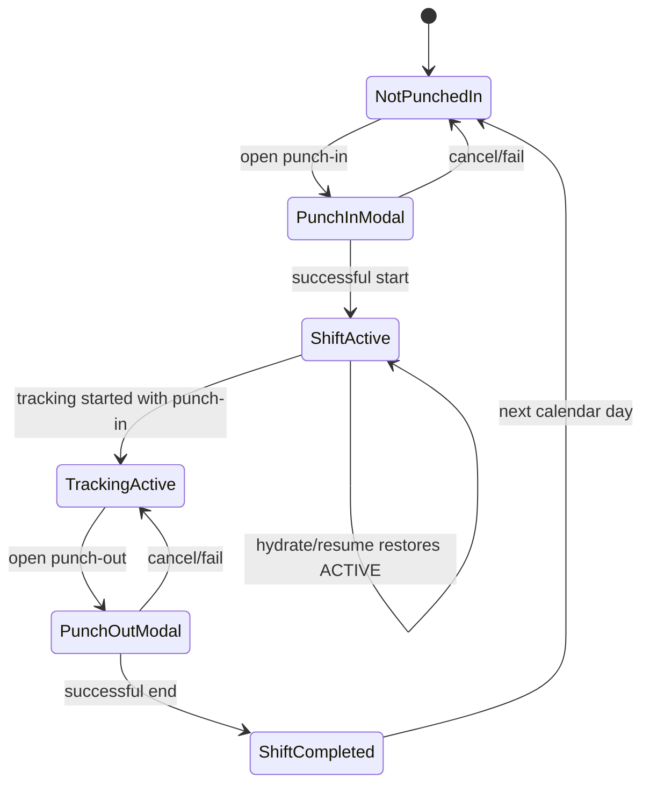

# Attendance, Shifts, Travel, and Field Movement Business Rules

## 1. Scope

This specification covers Field Commander attendance and field-movement behavior inferred from the original application:

1. **Daily attendance (punch-in / punch-out)** — starting and ending a work shift for the authenticated field user.
2. **Active-shift presentation** — the dashboard attendance control that shows duty status and opens punch flows.
3. **GPS / geo-tracking during an active shift** — background location capture, local buffering, synchronization, and distance accumulation.
4. **Daily travel reporting** — calendar selection, route map, timeline of shift events, manual vs GPS distance, and calculated TA/DA display/export.
5. **Expense logging tied to travel/attendance** — day expenses optionally linked to the active shift and surfaced in travel totals.
6. **Cross-feature gates** — workflows that require an active shift (General Visit, Farm Diary base visit) or that increment shift activity counters (onboarding, FSPP, Farm Card, Farm Diary, expenses).

Out of scope as primary modules (referenced only where they interact): retail invoicing, entity onboarding field content, Farm Diary agricultural content, authentication itself (except attendance coupling).

This document describes **what the application must do**, not how version 2 must implement it. Original technologies appear only as evidence.

---

## 2. Repository Evidence Map

### Screens and components

- `Frontend/src/modules/shifts/components/ActiveShiftWidget.tsx` — punch-in/out entry, one-shift-per-day lock UI, auto-open punch-in after login, activity-before-punch-out gate, travel-edit permission gate.
- `Frontend/src/modules/shifts/components/PunchInModal.tsx` — two-step punch-in, location/background permission, timestamp edit, route selection, vehicle/transit capture, optional odometer photo.
- `Frontend/src/modules/shifts/components/PunchOutModal.tsx` — punch-out validation, end KM, optional end odometer, comment when no travelling, day-change warning, offline point sync before close.
- `Frontend/src/modules/dashboard/screens/DashboardScreen.tsx` — hosts ActiveShiftWidget; refreshes shifts on pull-to-refresh; passes travel edit permission.
- `Frontend/src/modules/dashboard/screens/GeneralVisitScreen.tsx` — requires active punch-in; requires a shift record for the visit date; logs dated shift activity.
- `Frontend/src/modules/dashboard/screens/ProfileScreen.tsx` — pending location sync count indicator.
- `Frontend/src/modules/reports/screens/ReportsHubScreen.tsx` — travel/expense report entry gated by `mobile_travel_activity` view.
- `Frontend/src/modules/reports/screens/TravelReportScreen.tsx` — calendar, map/route, distances, TA/DA, timeline, PDF share.
- `Frontend/src/modules/reports/screens/ExpenseReportScreen.tsx` — expense list/filter/totals; add expense entry when edit permitted.
- `Frontend/src/modules/reports/screens/AddExpenseScreen.tsx` — create expense with optional receipt photo.
- `Frontend/src/modules/FarmDiary/screens/visit/FarmDiaryDashboardScreen.tsx` — blocks new base visit without active shift.

### Hooks and forms

- Onboarding hooks (`farmer`, `dealer`, `distributor`, `fpo`), `FSPP/hooks.ts`, `FarmCard/hooks.ts`, `farmDiaryStore.ts` — increment activity and append shift timeline events when drafts/submissions succeed during an active shift.
- No dedicated React Hook Form / Zod schema exists for punch-in or punch-out; validation is inline in modals and store methods.

### Schemas and validation

- Punch-in/out field rules are enforced in modal UI logic and `startShift` / `endShift`.
- Expense status values: `Pending | Approved | Rejected | Queried`.
- Shift status values observed: `ACTIVE`, `COMPLETED`.
- Allowance status values observed: `Pending`, `Approved`.

### Services and APIs

- Shift persistence via remote `shifts` and `shift_locations` collections (original client uses Supabase tables/RPC).
- Distance increment RPC named `add_shift_distance` (evidence of server-side cumulative distance).
- Assigned routes from `routes` filtered by current user id.
- Road-following map smoothing via external snap-to-roads call (`roadsApi.ts`).
- Optional odometer/receipt media upload producing a retrievable URL before persistence.
- **Server-side TA/DA expense trigger (user-supplied PL/pgSQL; not stored in this repo’s frontend tree)** — on shift row change (`NEW`), computes distance, TA/DA, upserts/deletes a `expenses` row with `category = 'TA/DA'` and `receipt_url = 'SYSTEM_GENERATED'`. This is the authoritative persisted claim path; the mobile travel screen recalculates a **display-only** approximation.

### Stores and state

- `Frontend/src/store/shiftStore.ts` — shift lifecycle, history, activity count, start/end, event logging, hydrate.
- `Frontend/src/store/expenseStore.ts` — expenses hydrate/add; attaches `shift_id` when a shift is active.
- `Frontend/src/store/authStore.ts` — user id and `loginTimestamp` used for auto punch-in prompt.
- `Frontend/src/store/alertStore.ts` — attendance alerts and confirmations.

### Navigation

- `Frontend/src/navigation/AppNavigator.tsx` — authenticated tabs including My Reports; Travel/Expense screens; hydrates shifts on sign-in; blocks all navigation when connectivity is explicitly false.

### Core and shared utilities

- `Frontend/src/core/locationTracker.ts` — background location task start/stop and local insert.
- `Frontend/src/core/locationUtils.ts` — Haversine distance, sync drain, plausibility filters, remote distance RPC.
- `Frontend/src/core/database.ts` — pending location queue, active shift id for background task, last synced point.
- `Frontend/src/core/OfflineSyncManager.tsx` — silent sync under 50 points; blocking modal above 50 while online.
- `Frontend/src/core/permissions.ts` — camera permission for odometer/receipts.
- `Frontend/src/core/usePermissions.ts` — `mobile_travel_activity` view/edit; SE role hard-grants travel; TH/Super Admin full access.
- `Frontend/src/core/roadsApi.ts` — map polyline snap/fallback.
- `Frontend/App.tsx` — resume sync and restart tracking when app becomes active during an active shift.

### Related modules

- Authentication — login timestamp reopens punch-in; logout does not clear shift local state or location queues (see auth rules).
- Dashboard — attendance widget placement; General Visit shift prerequisites.
- Onboarding / FSPP / Farm Card / Farm Diary — activity counting toward punch-out eligibility.
- Reports / Expenses — travel financial view and expense linkage.
- Profile — offline location backlog visibility.

Repository-wide search covered **164** frontend TypeScript/TSX files under `Frontend/src`, plus locales and existing business-rule docs. Symbols traced include `punchIn`/`punchOut`, `startShift`/`endShift`, `shiftStore`, `totalDistance`, `haversine`/`calculateDistance`, `TA`/`DA`, `allowance_status`, `shift_locations`, `mobile_travel_activity`, and related UI strings. **Additional authoritative evidence:** user-provided Supabase trigger body for system TA/DA expense generation (trigger name / bind timing not present in the frontend repo; behavior inferred from supplied function body operating on `NEW` shift columns).

---

## 3. Actors, Roles, and Permissions

### ATT-ACT-001 — Authenticated user required

- **Rule:** Attendance, travel reports, expenses, and shift-linked activity logging require an authenticated current user.
- **Business purpose:** Bind shifts and costs to a responsible field employee.
- **Trigger/condition:** Any shift hydrate, punch, expense, or report load.
- **Behavior/result:** Operations that need a user id no-op or never open if unauthenticated; navigator shows auth screens instead of main app.
- **Actor/role:** Any authenticated field user.
- **Affected workflow:** Entire attendance/travel domain.
- **UX behavior:** No attendance UI on login/register screens.
- **Validation/error behavior:** Missing user aborts store writes silently in several paths.
- **Online/offline behavior:** Global offline screen blocks operational navigation when connectivity is false.
- **Enforcement requirement:** Session and data access both required.
- **Dependencies:** Authentication session.
- **Original implementation evidence:**
  - `Frontend/src/navigation/AppNavigator.tsx:96-194` — `AppNavigator`
  - `Frontend/src/store/shiftStore.ts:68-70,109-111` — `hydrateShifts`, `startShift`
- **Confidence:** High

### ATT-ACT-002 — Travel/attendance module permission

- **Rule:** Punch controls are available only when the user has **edit** access to the travel/attendance module (`mobile_travel_activity`). Travel report and expense report cards require **view** access to the same module. Adding expenses requires **edit** access.
- **Business purpose:** Restrict attendance mutation and cost claims to authorized staff.
- **Trigger/condition:** Permission resolution for the current user/role.
- **Behavior/result:** Without edit: ActiveShiftWidget renders nothing. Without view: travel/expense cards hidden; reports hub may show restricted fallback if no report modules allowed. Without expense edit: Add New Expense footer hidden.
- **Actor/role:** SE role is granted travel view+edit in original defaults; TH/Super Admin receive all permissions; other roles use role-permission records.
- **Affected workflow:** Dashboard punch widget, My Reports hub, expense add.
- **UX behavior:** Unauthorized controls are hidden (not disabled).
- **Validation/error behavior:** Restricted Area message when no report view access.
- **Online/offline behavior:** Cached permissions may temporarily drive UI until refresh.
- **Enforcement requirement:** UI hiding is insufficient; server-side authorization for shift/expense writes must also apply.
- **Dependencies:** Role/permission assignment.
- **Original implementation evidence:**
  - `Frontend/src/modules/shifts/components/ActiveShiftWidget.tsx:22-27,95-98` — `isAllowedToEdit`
  - `Frontend/src/modules/dashboard/screens/DashboardScreen.tsx:49,642` — `travelPerm`
  - `Frontend/src/modules/reports/screens/ReportsHubScreen.tsx:19-57,76-100` — report cards
  - `Frontend/src/modules/reports/screens/ExpenseReportScreen.tsx:24-25,247-251` — add button
  - `Frontend/src/core/usePermissions.ts:49-102` — SE grants / `getModulePerm`
- **Confidence:** High

### ATT-ACT-003 — Record ownership isolation

- **Rule:** A user may only load and mutate their own shifts, shift locations, assigned routes, and expenses.
- **Business purpose:** Prevent cross-employee attendance and reimbursement leakage.
- **Trigger/condition:** Every hydrate/insert/update for shifts and expenses.
- **Behavior/result:** Queries filter by the authenticated user's identifier (`se_id` in original schema evidence).
- **Actor/role:** Authenticated field user.
- **Affected workflow:** Hydrate, punch, reports, expense list.
- **UX behavior:** No user selector for other employees.
- **Validation/error behavior:** Failure to load leaves prior local history.
- **Online/offline behavior:** Local persisted shift history may remain until hydrate succeeds.
- **Enforcement requirement:** Authorization isolation must hold on the server, not only client filters.
- **Dependencies:** Current user id.
- **Original implementation evidence:**
  - `Frontend/src/store/shiftStore.ts:72-76` — `hydrateShifts`
  - `Frontend/src/store/expenseStore.ts:36-40` — `hydrateExpenses`
  - `Frontend/src/modules/shifts/components/PunchInModal.tsx:45-48` — routes by `se_id`
- **Confidence:** High

### ATT-ACT-004 — No in-app admin approval actions for travel

- **Rule:** The mobile client displays allowance/expense statuses but does not provide approve/reject controls for travel allowance or expenses.
- **Business purpose (inferred):** Approval is an administrative backend process.
- **Trigger/condition:** Viewing reports/expenses.
- **Behavior/result:** Status badges only; no approve/reject buttons.
- **Actor/role:** Field user (viewer of status).
- **Affected workflow:** Travel report, expense report.
- **UX behavior:** Read-only status presentation.
- **Validation/error behavior:** None for approval on mobile.
- **Online/offline behavior:** N/A.
- **Enforcement requirement:** Version 2 must not invent mobile approval unless separately specified.
- **Dependencies:** Status fields on shift/expense records.
- **Original implementation evidence:**
  - `Frontend/src/store/shiftStore.ts:195-214` — writes `allowance_status` only
  - `Frontend/src/modules/reports/screens/ExpenseReportScreen.tsx:108-152` — status display only
- **Confidence:** High

---

## 4. Attendance and Shift Lifecycle

### States observed

| State | Meaning (behavioral) |
|---|---|
| Not punched in | No `ACTIVE` shift; widget shows Punch In (if permitted and not completed today). |
| Punch-in modal open | User completing location/transit steps; shift not yet created. |
| Shift active / ON DUTY | Remote status `ACTIVE`; local `isActive=true`; background tracking started. |
| Location tracking active | Background updates writing buffered points for the active shift id. |
| Punch-out modal open | Closing validation in progress; may sync pending points. |
| Shift completed | Remote status `COMPLETED`; punch-out event present; widget shows SHIFT COMPLETED for that calendar day. |
| Sync pending / failed (locations) | Points remain in local queue; profile shows count; optional blocking sync modal when backlog large and online. |
| Recovered active shift | After restart/login hydrate finds `ACTIVE` and restores local active fields; app resume restarts tracking. |

### Transitions

### ATT-LIFE-001 — Exactly one shift record per user per calendar day

- **Rule:** A user must not create a second shift for the same calendar day once a shift for that day already exists (completed or otherwise present in history for that date). UI treats a completed punch-out for today as locked until after local midnight.
- **Business purpose:** One attendance day = one attendance record.
- **Trigger/condition:** Punch-in attempt when today's shift already exists.
- **Behavior/result:** Client throws/blocks with “already completed / cannot punch in twice”; server unique constraint message mapped to friendly text when present.
- **Actor/role:** Field user with travel edit.
- **Affected workflow:** Punch-in.
- **UX behavior:** SHIFT COMPLETED badge; alert explaining wait until after midnight.
- **Validation/error behavior:** Friendly duplicate-day messages.
- **Online/offline behavior:** Offline app gate prevents new punch; hydrate on login aims to use server truth.
- **Enforcement requirement:** Client and server uniqueness for (user, day).
- **Dependencies:** Day derived from punch timestamp (see date rules).
- **Original implementation evidence:**
  - `Frontend/src/store/shiftStore.ts:116-119` — existing day check
  - `Frontend/src/modules/shifts/components/ActiveShiftWidget.tsx:32-47,120-128` — completed badge
  - `Frontend/src/modules/shifts/components/PunchInModal.tsx:248-249` — `unique_shift_per_day`
- **Confidence:** High

### ATT-LIFE-002 — Initial active state on successful punch-in

- **Rule:** Successful punch-in creates a shift in `ACTIVE` status with start time, start location (if captured), transit/vehicle fields, empty distance, events containing punch-in, optional assigned route, then starts tracking.
- **Business purpose:** Begin measurable field day.
- **Trigger/condition:** Confirm on punch-in step 2 after validations.
- **Behavior/result:** Local active flags set; history updated; tracking started.
- **Actor/role:** Authorized field user.
- **Affected workflow:** Punch-in → tracking.
- **UX behavior:** Widget switches to ON DUTY with start time and Punch Out.
- **Validation/error behavior:** Insert failure shows cannot punch-in alert.
- **Online/offline behavior:** Requires network for create (app also globally blocks when offline).
- **Enforcement requirement:** Persist ACTIVE shift before considering punch-in successful.
- **Dependencies:** User id, location permissions path, route selection.
- **Original implementation evidence:**
  - `Frontend/src/store/shiftStore.ts:109-163` — `startShift`
- **Confidence:** High

### ATT-LIFE-003 — Completion on successful punch-out

- **Rule:** Successful punch-out stops tracking, attempts location sync, appends punch-out event, sets status `COMPLETED`, stores end fields and `allowance_status`, clears local active state and local total distance.
- **Business purpose:** Close the attendance day and freeze end parameters.
- **Trigger/condition:** Confirm on punch-out after validations.
- **Behavior/result:** No longer ON DUTY; completed lock for that day.
- **Actor/role:** Authorized field user with active shift.
- **Affected workflow:** Punch-out → travel report viewability for that day.
- **UX behavior:** Success alert; widget shows completed or punch-in next day.
- **Validation/error behavior:** Failure alert “Failed to punch out.”
- **Online/offline behavior:** Sync of pending points attempted before close; update requires network.
- **Enforcement requirement:** Tracking must stop; end state must not remain ACTIVE after successful close.
- **Dependencies:** Active shift id; optional pending locations.
- **Original implementation evidence:**
  - `Frontend/src/store/shiftStore.ts:166-234` — `endShift`
  - `Frontend/src/modules/shifts/components/ActiveShiftWidget.tsx:164-180` — success alert
- **Confidence:** High

### ATT-LIFE-004 — Persistence across restart and login

- **Rule:** Active and historical shifts must be restorable after app restart and after sign-in hydration so an ACTIVE shift continues and one-per-day lock uses authoritative history.
- **Business purpose:** Prevent lost duty state and duplicate punch-ins from stale cache.
- **Trigger/condition:** App launch with persisted local state; auth `SIGNED_IN`; dashboard refresh.
- **Behavior/result:** ACTIVE shift restores widget and tracking-on-resume; COMPLETED today keeps lock.
- **Actor/role:** Same user.
- **Affected workflow:** Resume duty; punch-in lock.
- **UX behavior:** ON DUTY returns if still ACTIVE.
- **Validation/error behavior:** Hydrate failure leaves prior local state.
- **Online/offline behavior:** Hydrate needs network; local persist may show stale ACTIVE offline until blocked by offline gate.
- **Enforcement requirement:** Authoritative remote hydrate after login; local resume must not invent a second active shift.
- **Dependencies:** Persisted shift store; remote shifts.
- **Original implementation evidence:**
  - `Frontend/src/store/shiftStore.ts:68-107,342` — hydrate + persist
  - `Frontend/src/navigation/AppNavigator.tsx:132-134` — hydrate on sign-in
  - `Frontend/App.tsx:30-37` — restart tracking on active
  - `Frontend/src/modules/dashboard/screens/DashboardScreen.tsx:257-258` — refresh hydrate
- **Confidence:** High

### ATT-LIFE-005 — Logout does not clear shift or location queues

- **Rule:** Local logout clears session identity fields but does not clear shift history, expenses, or pending location queues.
- **Business purpose (observed):** Incomplete session teardown.
- **Trigger/condition:** Logout.
- **Behavior/result:** Prior shift data may remain on device until overwritten by next hydrate.
- **Actor/role:** Device user.
- **Affected workflow:** Multi-account device risk.
- **UX behavior:** None specific.
- **Validation/error behavior:** N/A.
- **Online/offline behavior:** Queued points remain.
- **Enforcement requirement:** Version 2 should treat cross-user residual data as a known risk unless cleared by policy.
- **Dependencies:** Auth logout behavior.
- **Original implementation evidence:** Documented in `business-rules/auth.md` and verified by absence of shift/expense clear in logout path; shift persist name `shift-storage-v6`.
- **Confidence:** High

---

## 5. Punch-In Rules

### ATT-IN-001 — Who can punch in

- **Rule:** Only authenticated users with travel/attendance **edit** permission may punch in.
- **Business purpose:** Restrict attendance creation.
- **Trigger/condition:** Widget render / punch-in press.
- **Behavior/result:** Widget hidden without permission.
- **Actor/role:** Travel editors (e.g., SE defaults).
- **Affected workflow:** Punch-in.
- **UX behavior:** No control if unauthorized.
- **Validation/error behavior:** N/A.
- **Online/offline behavior:** Offline gate blocks use.
- **Enforcement requirement:** Permission + auth.
- **Dependencies:** ATT-ACT-002.
- **Original implementation evidence:** `ActiveShiftWidget.tsx:95-98`
- **Confidence:** High

### ATT-IN-002 — Preconditions before punch-in

- **Rule:** Punch-in requires: not already completed for today; foreground location permission; background “all the time” location permission; successful progression past locating UI (denied blocks); mandatory assigned-route selection (or Others); Yes/No personal vehicle; if personal: vehicle type + starting KM; if not personal: transit mode.
- **Business purpose:** Capture duty start context and enable continuous route tracking.
- **Trigger/condition:** Opening and confirming punch-in modal.
- **Behavior/result:** Step 1 → step 2 → confirm creates shift.
- **Actor/role:** Authorized field user.
- **Affected workflow:** Punch-in wizard.
- **UX behavior:** Background permission denial shows settings alert; Android battery unrestricted prompt once per app session; Confirm disabled until required fields set.
- **Validation/error behavior:** Network/timeout/duplicate mapped to friendly alerts; other errors generic.
- **Online/offline behavior:** Create requires connectivity.
- **Enforcement requirement:** Background tracking consent before accepting punch-in; route mandatory.
- **Dependencies:** Device location/camera (camera only if odometer photo taken).
- **Original implementation evidence:**
  - `PunchInModal.tsx:67-106,391-397,404-526`
  - `shiftStore.ts:109-163`
- **Confidence:** High

### ATT-IN-003 — Network required for punch-in

- **Rule:** Punch-in cannot complete without network because shift creation is a remote write; the original app also blocks the entire operational UI when connectivity is false.
- **Business purpose:** Ensure server attendance record exists.
- **Trigger/condition:** Confirm punch-in / offline connectivity.
- **Behavior/result:** Failure alert or offline screen.
- **Actor/role:** Field user.
- **Affected workflow:** Punch-in.
- **UX behavior:** Network-issue friendly message when fetch fails.
- **Validation/error behavior:** Mapped network/timeout messages.
- **Online/offline behavior:** Offline blocked.
- **Enforcement requirement:** No silent local-only “fake” attendance day without sync contract.
- **Dependencies:** Connectivity.
- **Original implementation evidence:**
  - `AppNavigator.tsx:141-153`
  - `PunchInModal.tsx:250-253`
  - `shiftStore.ts:140-141`
- **Confidence:** High

### ATT-IN-004 — Timestamp source and editability

- **Rule:** Punch-in records both actual device time and an optional user-edited timestamp; effective shift time is edited time if provided, else actual. Edited date cannot be in the future; date picker max is today.
- **Business purpose:** Allow correcting clock issues while retaining actual capture time.
- **Trigger/condition:** User edits date/time on step 1; confirm.
- **Behavior/result:** Event stores `time`, `actualTime`, `editedTime`; shift `start_time` and day key use effective time.
- **Actor/role:** Field user.
- **Affected workflow:** Punch-in; day uniqueness uses effective time’s UTC date string in original code.
- **UX behavior:** “EDITED TIMESTAMP” badge when edited.
- **Validation/error behavior:** Future selection rejected with alert.
- **Online/offline behavior:** Device clock based.
- **Enforcement requirement:** Preserve actual vs effective time if edits remain allowed.
- **Dependencies:** Device clock.
- **Original implementation evidence:**
  - `PunchInModal.tsx:225-241,351-386`
  - `shiftStore.ts:113-114,121-126`
- **Confidence:** High

### ATT-IN-005 — Location capture at punch-in

- **Rule:** Punch-in attempts to capture coordinates (cached then live, balanced accuracy) and reverse-geocoded display string. Coordinates are stored on the punch-in event and as initial shift location; if obtained, an initial location point is written to the shift location store.
- **Business purpose:** Anchor start of route and attendance place.
- **Trigger/condition:** Step 1 visible; app resume while modal open.
- **Behavior/result:** Display address or status string; confirm may proceed with null location if status is “Unable to fetch location” (not denied/locating).
- **Actor/role:** Field user.
- **Affected workflow:** Punch-in.
- **UX behavior:** Punch In button disabled while locating/fetching/denied.
- **Validation/error behavior:** Denied blocks step advance; unable-to-fetch does not block.
- **Online/offline behavior:** Geocode needs network; coordinates may still exist offline if GPS works (but app offline gate usually blocks).
- **Enforcement requirement:** Background permission required even if coordinates fail.
- **Dependencies:** Location services.
- **Original implementation evidence:** `PunchInModal.tsx:129-163,391-397`; `shiftStore.ts:128-147`
- **Confidence:** High

### ATT-IN-006 — Vehicle / transit profile

- **Rule:** Personal vehicle path requires vehicle type (`two-wheeler` | `four-wheeler`, default two-wheeler) and numeric starting KM; optional odometer photo. Non-personal path requires one of: Public Transport, Sharing, No Travelling.
- **Business purpose:** Drive end-of-day KM rules, server TA rate (four-wheeler ₹8 vs default ₹4), punch-out activity exceptions, and client allowance_status heuristics.
- **Trigger/condition:** Step 2 choices.
- **Behavior/result:** Stored on shift; description text on punch-in event.
- **Actor/role:** Field user.
- **Affected workflow:** Punch-in and later punch-out/TA.
- **UX behavior:** Conditional fields appear by Yes/No.
- **Validation/error behavior:** Confirm disabled until required values present.
- **Online/offline behavior:** Photo upload requires network when photo provided.
- **Enforcement requirement:** Conditional required fields.
- **Dependencies:** Media upload for optional odo image.
- **Original implementation evidence:** `PunchInModal.tsx:431-526`; `ActiveShiftWidget.tsx:146-156`
- **Confidence:** High

### ATT-IN-007 — Assigned route mandatory

- **Rule:** User must select an assigned route or “Others” before confirm; Others stores null route id.
- **Business purpose:** Attribute day activities to a territory route.
- **Trigger/condition:** Step 2 confirm.
- **Behavior/result:** `assigned_route_id` set or null.
- **Actor/role:** Field user.
- **Affected workflow:** Punch-in; later reports/activity labeling.
- **UX behavior:** Select Route * control.
- **Validation/error behavior:** Confirm disabled without selection.
- **Online/offline behavior:** Routes fetched online on modal mount.
- **Enforcement requirement:** Non-empty selection before start.
- **Dependencies:** User’s route list.
- **Original implementation evidence:** `PunchInModal.tsx:39-52,404-428,515-518`
- **Confidence:** High

### ATT-IN-008 — Punch-in starts GPS tracking and distance accumulator

- **Rule:** Successful punch-in starts background location tracking for that shift id and initializes cumulative distance to 0.
- **Business purpose:** Record field movement for the duty day.
- **Trigger/condition:** After remote shift insert succeeds.
- **Behavior/result:** Tracking task registered; local active shift id set for background inserts.
- **Actor/role:** System after user confirm.
- **Affected workflow:** Tracking / distance.
- **UX behavior:** Foreground service notification text indicates tracking (Android).
- **Validation/error behavior:** Tracking start errors not surfaced distinctly in UI beyond punch failure if thrown.
- **Online/offline behavior:** Points buffer locally when network weak.
- **Enforcement requirement:** Tracking must not start without an ACTIVE shift id.
- **Dependencies:** Background location permission already granted in modal.
- **Original implementation evidence:** `shiftStore.ts:149-162`; `locationTracker.ts:51-66`
- **Confidence:** High

### ATT-IN-009 — Duplicate punch-in prevention

- **Rule:** Client rejects punch-in if any shift history entry exists for the effective date string; server unique constraint provides secondary protection.
- **Business purpose:** One day one shift.
- **Trigger/condition:** `startShift`.
- **Behavior/result:** Error thrown / alert.
- **Actor/role:** Field user.
- **Affected workflow:** Punch-in.
- **UX behavior:** Cannot Punch In alert.
- **Validation/error behavior:** Explicit messages.
- **Online/offline behavior:** Server constraint needs online insert.
- **Enforcement requirement:** Dual-layer uniqueness preferred.
- **Dependencies:** ATT-LIFE-001.
- **Original implementation evidence:** `shiftStore.ts:116-119`; `PunchInModal.tsx:248-249`
- **Confidence:** High

### ATT-IN-010 — Loading and failure/retry

- **Rule:** Confirm shows punching-in loading; failures leave user in modal (or closed then alert) with retry by submitting again; no automatic retry loop.
- **Business purpose:** Prevent double submits during in-flight create.
- **Trigger/condition:** Confirm press.
- **Behavior/result:** Button disabled while capturing.
- **Actor/role:** Field user.
- **Affected workflow:** Punch-in.
- **UX behavior:** “Punching in...” label.
- **Validation/error behavior:** Alert with mapped message.
- **Online/offline behavior:** Network errors mapped.
- **Enforcement requirement:** Disable concurrent confirms.
- **Dependencies:** None.
- **Original implementation evidence:** `PunchInModal.tsx:225-265,515-526`
- **Confidence:** High

### ATT-IN-011 — Auto-open punch-in after distinct login

- **Rule:** When user is not active, has a new `loginTimestamp` not yet consumed, and has not completed today’s shift, the punch-in modal opens automatically once per distinct login stamp.
- **Business purpose:** Force attendance start at beginning of work session.
- **Trigger/condition:** Login stamp change on dashboard widget mount/update.
- **Behavior/result:** Modal visible without tapping Punch In.
- **Actor/role:** Travel editor.
- **Affected workflow:** Post-login attendance.
- **UX behavior:** Modal appears.
- **Validation/error behavior:** N/A.
- **Online/offline behavior:** Subject to offline gate.
- **Enforcement requirement:** Optional behavioral preserve; note coupling to `loginTimestamp` resets (auth/SE completion).
- **Dependencies:** Auth login timestamp.
- **Original implementation evidence:** `ActiveShiftWidget.tsx:49-55`
- **Confidence:** High

### ATT-IN-012 — Profile/onboarding completion not required for punch-in

- **Rule:** Executable punch-in path does not check SE profile completeness before allowing punch-in.
- **Business purpose:** N/A (absence).
- **Trigger/condition:** Punch-in.
- **Behavior/result:** Punch-in available regardless of profile completion flag.
- **Actor/role:** Authenticated travel editor.
- **Affected workflow:** Punch-in.
- **UX behavior:** None.
- **Validation/error behavior:** None.
- **Online/offline behavior:** N/A.
- **Enforcement requirement:** Do not invent a profile-complete gate unless product later requires it.
- **Dependencies:** None.
- **Original implementation evidence:** No profile-complete check in `ActiveShiftWidget` / `PunchInModal` / `startShift`.
- **Confidence:** High

---

## 6. Punch-Out Rules

### ATT-OUT-001 — Who can punch out / active shift required

- **Rule:** Punch-out is available only from an active ON DUTY widget state (implies travel edit + ACTIVE shift). `endShift` no-ops if no active shift id.
- **Business purpose:** Close only an open duty day.
- **Trigger/condition:** Punch Out press / confirm.
- **Behavior/result:** Modal opens or silent no-op if no active id.
- **Actor/role:** Authorized field user on duty.
- **Affected workflow:** Punch-out.
- **UX behavior:** Punch Out button on ON DUTY chip.
- **Validation/error behavior:** Failed punch-out alert.
- **Online/offline behavior:** Remote update required.
- **Enforcement requirement:** Active shift prerequisite.
- **Dependencies:** ATT-LIFE-002.
- **Original implementation evidence:** `ActiveShiftWidget.tsx:102-117`; `shiftStore.ts:167-168`
- **Confidence:** High

### ATT-OUT-002 — Activity prerequisite (with No Travelling exception)

- **Rule:** If `activitiesLogged === 0` and transit mode is not `No Travelling`, punch-out is blocked with an alert requiring at least one logged activity. If transit is `No Travelling` and activities are zero, punch-out is allowed only with a non-empty work-summary comment.
- **Business purpose:** Prevent empty field days without explanation; allow office/no-travel days.
- **Trigger/condition:** Initiate punch-out / confirm.
- **Behavior/result:** Alert wall or required comment field.
- **Actor/role:** On-duty user.
- **Affected workflow:** Punch-out.
- **UX behavior:** Comment UI when zero activities + No Travelling.
- **Validation/error behavior:** Confirm disabled until comment filled in that case.
- **Online/offline behavior:** N/A for the gate.
- **Enforcement requirement:** Preserve activity-or-comment rule.
- **Dependencies:** Activity counter and transit mode from punch-in.
- **Original implementation evidence:**
  - `ActiveShiftWidget.tsx:57-69`
  - `PunchOutModal.tsx:335-368`
- **Confidence:** High

### ATT-OUT-003 — Location permission and capture at punch-out

- **Rule:** Punch-out requests foreground location permission, captures coordinates and display address; denied/locating states disable confirm. Background permission is not re-requested at punch-out.
- **Business purpose:** Capture end place.
- **Trigger/condition:** Modal visible.
- **Behavior/result:** End location stored on event/shift.
- **Actor/role:** On-duty user.
- **Affected workflow:** Punch-out.
- **UX behavior:** Location status row; Detecting Location... on button.
- **Validation/error behavior:** Denied disables submit.
- **Online/offline behavior:** Sync of buffered points attempted when pending > 0.
- **Enforcement requirement:** Foreground location for end capture.
- **Dependencies:** Location services.
- **Original implementation evidence:** `PunchOutModal.tsx:43-96,127-133,355-368`
- **Confidence:** High

### ATT-OUT-004 — Personal vehicle end KM and odometer

- **Rule:** For personal vehicle shifts, ending KM is required and must be ≥ starting KM; optional end odometer photo. Non-personal shifts show informational close text without end KM.
- **Business purpose:** Manual distance basis for TA/DA and allowance status.
- **Trigger/condition:** Confirm punch-out.
- **Behavior/result:** Inline error if missing/invalid KM.
- **Actor/role:** On-duty personal-vehicle user.
- **Affected workflow:** Punch-out; travel report manual distance.
- **UX behavior:** End KM field; optional camera capture.
- **Validation/error behavior:** Inline errors; camera denial alert.
- **Online/offline behavior:** Photo upload needs network when provided.
- **Enforcement requirement:** End KM ≥ start KM.
- **Dependencies:** Start KM from punch-in.
- **Original implementation evidence:** `PunchOutModal.tsx:101-108,288-328`
- **Confidence:** High

### ATT-OUT-005 — Timestamp rules at punch-out

- **Rule:** Punch-out time defaults to now and may be edited; cannot be future (auto-clamped to now with alert); cannot be earlier than punch-in (auto-clamped to punch-in with alert). Final submit also rejects earlier-than-punch-in. If selected calendar day differs from punch-in day, a warning is shown and confirm is disabled until date/time match punch-in day.
- **Business purpose:** Keep end time coherent with start; discourage overnight open shifts without corrected close time.
- **Trigger/condition:** Date/time edit; confirm.
- **Behavior/result:** Edited flags; disabled confirm across day boundary.
- **Actor/role:** On-duty user.
- **Affected workflow:** Punch-out.
- **UX behavior:** Day-change red attention banner; EDITED TIMESTAMP badge.
- **Validation/error behavior:** Auto-Adjusted alerts; Invalid Time on confirm race.
- **Online/offline behavior:** Device clock.
- **Enforcement requirement:** End ≥ start; same calendar day as start for submission.
- **Dependencies:** Stored startTime.
- **Original implementation evidence:** `PunchOutModal.tsx:16-23,111-122,195-202,265-279,360-367`
- **Confidence:** High

### ATT-OUT-006 — Minimum/maximum duration

- **Rule:** No minimum shift duration is enforced; immediate punch-out is allowed if activity/comment and other field rules pass. No maximum duration is enforced beyond the same-calendar-day submission constraint relative to punch-in.
- **Business purpose:** Flexibility with day-boundary discipline.
- **Trigger/condition:** Punch-out soon after punch-in.
- **Behavior/result:** Allowed if gates pass.
- **Actor/role:** On-duty user.
- **Affected workflow:** Punch-out.
- **UX behavior:** None specific.
- **Validation/error behavior:** None for short duration.
- **Online/offline behavior:** N/A.
- **Enforcement requirement:** Do not invent min duration without evidence.
- **Dependencies:** ATT-OUT-002.
- **Original implementation evidence:** Absence of duration checks in `PunchOutModal` / `endShift`.
- **Confidence:** High

### ATT-OUT-007 — Punch-out stops tracking and finalizes buffered GPS sync attempt

- **Rule:** Punch-out stops background tracking, syncs pending locations, clears last-synced anchor, then completes shift. GPS cumulative distance already applied via sync/RPC is not recalculated from odometer at end; local `totalDistance` is cleared after completion.
- **Business purpose:** Stop movement metering and flush offline points.
- **Trigger/condition:** `endShift`.
- **Behavior/result:** Tracking off; points drained best-effort.
- **Actor/role:** System.
- **Affected workflow:** Punch-out; travel map distance.
- **UX behavior:** “Syncing offline points...” / “Closing Shift...” labels when applicable.
- **Validation/error behavior:** Sync failures logged; punch-out may still proceed after attempted sync in modal/store order.
- **Online/offline behavior:** Sync needs network; failure leaves points for later managers.
- **Enforcement requirement:** Stop tracking on successful close path.
- **Dependencies:** Location queue.
- **Original implementation evidence:** `shiftStore.ts:170-175`; `PunchOutModal.tsx:127-134`
- **Confidence:** High

### ATT-OUT-008 — Punch-out finalizes shift; server creates TA/DA expense

- **Rule:** Punch-out does not insert a distinct “travel report” document. Completing the shift (remote update with end fields) is what enables the **server trigger** to upsert the system `TA/DA` expense (ATT-TA-006). The travel report screen remains a derived calendar projection of shift + locations + expenses.
- **Business purpose:** Close the day; persist reimbursement claim; allow review UI.
- **Trigger/condition:** Successful shift completion update; later opening Travel Report / Expense Report.
- **Behavior/result:** SYSTEM_GENERATED expense appears after hydrate; calendar day with a shift can be opened; no separate travel-report submit/approve in-app.
- **Actor/role:** Field user + database trigger.
- **Affected workflow:** Punch-out → expenses / travel view.
- **UX behavior:** View/share travel projection; expense list shows TA/DA row.
- **Validation/error behavior:** Empty travel state when no shift that day; missing expense if trigger did not run or amount was 0.
- **Online/offline behavior:** Trigger and expense hydrate need network.
- **Enforcement requirement:** Preserve derived travel view + persisted system claim unless product changes.
- **Dependencies:** Shift history; locations; expenses; ATT-TA-006.
- **Original implementation evidence:** `TravelReportScreen.tsx:43-45,174-223`; no travel-report insert in `endShift`; user-supplied trigger on `NEW`
- **Confidence:** High

### ATT-OUT-009 — Client `allowance_status` and server expense status (shared &lt;40 km rule)

- **Rule:** On punch-out, auto-approve uses **calculated distance &lt; 40 km**:
  - **Server trigger:** system `TA/DA` expense `status` = `Approved` when calculated distance &lt; **40**, else `Pending`.
  - **Mobile client** shift `allowance_status`: for personal vehicle with usable end KM, `Approved` when (end − start) &lt; **40**, else `Pending`; for **non-personal** transit the client still sets shift `allowance_status` to `Approved` unconditionally (expense status continues to follow the server &lt;40 rule).
- **Business purpose:** Low-distance claims auto-clear review; one shared km threshold for money-related auto-approve.
- **Trigger/condition:** Successful endShift / shift row update that fires the trigger.
- **Behavior/result:** Personal-vehicle odometer path aligns at **&lt;40** on both shift and expense; non-personal may still show Approved on shift while expense is Pending if distance ≥ 40.
- **Actor/role:** Mobile client + database trigger.
- **Affected workflow:** Punch-out / expense list status badges.
- **UX behavior:** Expense report can show TA/DA row status; shift `allowance_status` largely not shown on travel summary UI.
- **Validation/error behavior:** None coordinating the two fields beyond the shared 40 km constant for personal odometer.
- **Online/offline behavior:** Both require successful remote shift update.
- **Enforcement requirement:** Keep auto-approve threshold at **&lt; 40 km**; prefer unifying non-personal shift status with the same rule in version 2 if product wants a single signal.
- **Dependencies:** Personal vehicle flag, start/end KM; server calculated_distance.
- **Original implementation evidence:**
  - `Frontend/src/store/shiftStore.ts` — `endShift` `manualDistance < 40`
  - User-supplied Supabase trigger — expense `status` when `calculated_distance < 40`
- **Confidence:** High

### ATT-OUT-010 — Success navigation / feedback

- **Rule:** After successful punch-out, modal closes and an alert confirms attendance/journey compilation; user remains on dashboard (no forced navigation to travel report).
- **Business purpose:** Confirm close without interrupting dashboard work.
- **Trigger/condition:** endShift success from widget.
- **Behavior/result:** Alert OK.
- **Actor/role:** Field user.
- **Affected workflow:** Punch-out.
- **UX behavior:** “Shift Ended” alert.
- **Validation/error behavior:** Failure alert keeps user able to retry.
- **Online/offline behavior:** N/A.
- **Enforcement requirement:** Provide clear success feedback.
- **Dependencies:** Alert system.
- **Original implementation evidence:** `ActiveShiftWidget.tsx:161-180`
- **Confidence:** High

### ATT-OUT-011 — Open visits/forms not hard-blocked

- **Rule:** Punch-out does not check for unfinished onboarding wizards, open Farm Diary visits, or drafts. Only activity count / No Travelling comment rules apply.
- **Business purpose:** Unknown; observed gap vs potential operational desire.
- **Trigger/condition:** Punch-out.
- **Behavior/result:** Allowed even if other UIs are mid-flow elsewhere.
- **Actor/role:** Field user.
- **Affected workflow:** Punch-out vs other modules.
- **UX behavior:** None.
- **Validation/error behavior:** None.
- **Online/offline behavior:** N/A.
- **Enforcement requirement:** Documented as unenforced unfinished-task gate.
- **Dependencies:** None.
- **Original implementation evidence:** Absence of unfinished-task checks in `initiatePunchOut` / `endShift`.
- **Confidence:** High

---

## 7. Active Shift Widget Rules

### ATT-WID-001 — Visibility

- **Rule:** Widget renders only when travel edit permission is true (prop or internal module perm).
- **Business purpose:** Hide attendance mutation from unauthorized roles.
- **Trigger/condition:** Permission false.
- **Behavior/result:** Returns null.
- **Actor/role:** Unauthorized vs authorized.
- **Affected workflow:** Dashboard header.
- **UX behavior:** Completely hidden.
- **Validation/error behavior:** N/A.
- **Online/offline behavior:** Permission cache dependent.
- **Enforcement requirement:** Permission gate.
- **Dependencies:** ATT-ACT-002.
- **Original implementation evidence:** `ActiveShiftWidget.tsx:95-98`; `DashboardScreen.tsx:642`
- **Confidence:** High

### ATT-WID-002 — Three mutually exclusive presentations

- **Rule:**
  1. Active → ON DUTY chip with start time + Punch Out.
  2. Not active + completed today → SHIFT COMPLETED locked badge (tappable alert).
  3. Not active + not completed today → Punch In button.
- **Business purpose:** Reflect attendance state clearly.
- **Trigger/condition:** `isActive` / `hasPunchedToday`.
- **Behavior/result:** Exactly one of the three.
- **Actor/role:** Travel editor.
- **Affected workflow:** Dashboard attendance.
- **UX behavior:** Bounce animation on Punch In; pulse on ON DUTY dot.
- **Validation/error behavior:** Completed press shows midnight message.
- **Online/offline behavior:** Based on hydrated/persisted history.
- **Enforcement requirement:** Exclusive states.
- **Dependencies:** Shift store.
- **Original implementation evidence:** `ActiveShiftWidget.tsx:32-39,100-141`
- **Confidence:** High

### ATT-WID-003 — Displayed data and non-displayed data

- **Rule:** Widget shows start time (local locale short time) when active. It does **not** show elapsed time, live distance, tracking status text, or a map action.
- **Business purpose:** Minimal duty indicator.
- **Trigger/condition:** Active state.
- **Behavior/result:** “From HH:MM” only.
- **Actor/role:** Field user.
- **Affected workflow:** Active shift widget.
- **UX behavior:** Compact chip max width ~190.
- **Validation/error behavior:** Missing startTime falls back to Date.now() for display.
- **Online/offline behavior:** Local state.
- **Enforcement requirement:** Do not assume distance on widget.
- **Dependencies:** `startTime`.
- **Original implementation evidence:** `ActiveShiftWidget.tsx:102-117`
- **Confidence:** High

### ATT-WID-004 — Stale / inconsistent recovery

- **Rule:** Dashboard refresh and login hydrate reconcile widget with remote ACTIVE/COMPLETED. App resume restarts tracking if local state says active. Widget itself has no dedicated error/retry UI for missing shift records.
- **Business purpose:** Recover duty after process death.
- **Trigger/condition:** Refresh/login/resume.
- **Behavior/result:** State may flip when hydrate returns.
- **Actor/role:** Field user.
- **Affected workflow:** Resume.
- **UX behavior:** Silent unless hydrate changes presentation.
- **Validation/error behavior:** None on widget.
- **Online/offline behavior:** Hydrate needs network.
- **Enforcement requirement:** Authoritative reconcile path.
- **Dependencies:** ATT-LIFE-004.
- **Original implementation evidence:** `DashboardScreen.tsx:257-258`; `App.tsx:30-37`
- **Confidence:** Medium

---

## 8. GPS Permission and Geo-Tracking Rules

### ATT-GPS-001 — Permission timing

- **Rule:** Foreground then background location permissions are requested during punch-in step 1 (not at app install alone). Punch-out re-requests foreground only. Camera permission requested only when capturing odometer/receipt photos.
- **Business purpose:** Justify background tracking for route.
- **Trigger/condition:** Punch-in modal; camera actions.
- **Behavior/result:** Denied background blocks punch-in progression; settings deep-link offered.
- **Actor/role:** Field user.
- **Affected workflow:** Punch-in / media.
- **UX behavior:** Alerts with Open Settings; Android battery unrestricted prompt once per session.
- **Validation/error behavior:** Camera denial shows fallback message.
- **Online/offline behavior:** N/A.
- **Enforcement requirement:** Background allow-all-the-time before punch-in accept.
- **Dependencies:** OS permission model.
- **Original implementation evidence:** `PunchInModal.tsx:74-127`; `PunchOutModal.tsx:52-55`; `permissions.ts:44-58`
- **Confidence:** High

### ATT-GPS-002 — Tracking configuration

- **Rule:** While tracking: balanced accuracy; time interval 20s; distance interval 15m; does not pause updates automatically; shows background indicator; Android foreground service notification “Field Commander Active / Tracking your shift route.”
- **Business purpose:** Continuous route sampling with battery compromise.
- **Trigger/condition:** `startBackgroundTracking(shiftId)`.
- **Behavior/result:** Points inserted locally for active shift.
- **Actor/role:** System.
- **Affected workflow:** Field movement.
- **UX behavior:** Persistent notification on Android.
- **Validation/error behavior:** Task errors logged.
- **Online/offline behavior:** Local insert always; sync when possible.
- **Enforcement requirement:** Start only with shift id; stop clears active id.
- **Dependencies:** Active shift.
- **Original implementation evidence:** `locationTracker.ts:51-75`
- **Confidence:** High

### ATT-GPS-003 — Accuracy acceptance at capture vs sync

- **Rule:** Background capture accepts points with accuracy ≤ 500m. Sync distance math skips points with accuracy &gt; 150m, but still uploads all pending raw points to the remote location store for map rendering.
- **Business purpose:** Capture on weak phones; meter only plausible points.
- **Trigger/condition:** Each background location; sync drain.
- **Behavior/result:** Possible map points that did not contribute to distance.
- **Actor/role:** System.
- **Affected workflow:** Distance vs map.
- **UX behavior:** None.
- **Validation/error behavior:** Insert failures logged.
- **Online/offline behavior:** Offline buffer then sync.
- **Enforcement requirement:** Document dual thresholds; do not silently unify without product decision.
- **Dependencies:** ATT-DIST-*.
- **Original implementation evidence:** `locationTracker.ts:24-27`; `locationUtils.ts:43-87`
- **Confidence:** High

### ATT-GPS-004 — Impossible jump and drift filters (distance only)

- **Rule:** When accumulating distance: ignore jumps where distance &gt; 1.0 km **and** implied speed &gt; 120 km/h; count distance only when movement &gt; 20 meters from last trusted point; stationary updates refresh timestamp without adding distance.
- **Business purpose:** Reduce cell-tower spikes and GPS drift inflation.
- **Trigger/condition:** Sync drain loop.
- **Behavior/result:** Filtered km added via RPC.
- **Actor/role:** System.
- **Affected workflow:** GPS tracked distance.
- **UX behavior:** None.
- **Validation/error behavior:** RPC failure logged; points still deleted after insert success.
- **Online/offline behavior:** Filters apply at sync time.
- **Enforcement requirement:** Preserve filter semantics if GPS distance remains authoritative for display.
- **Dependencies:** Haversine utility; last synced point.
- **Original implementation evidence:** `locationUtils.ts:42-74,90-97`
- **Confidence:** High

### ATT-GPS-005 — Start/stop/resume conditions

- **Rule:** Tracking starts on punch-in success and on app becoming active while shift still active. Tracking stops on punch-out. No explicit pause/resume control for users. No geofencing against assigned route.
- **Business purpose:** Continuous duty tracking.
- **Trigger/condition:** startShift / AppState active / endShift.
- **Behavior/result:** Task registered or stopped.
- **Actor/role:** System.
- **Affected workflow:** GPS.
- **UX behavior:** Notification while active (platform-dependent).
- **Validation/error behavior:** Missing active shift id causes background task to ignore points.
- **Online/offline behavior:** Works offline into SQLite queue.
- **Enforcement requirement:** Tie tracking lifetime to ACTIVE shift.
- **Dependencies:** Local active shift id in config table.
- **Original implementation evidence:** `shiftStore.ts:149-171`; `App.tsx:30-37`; `locationTracker.ts:17-19,69-75`
- **Confidence:** High

### ATT-GPS-006 — Uses of GPS data

- **Rule:** GPS is used for: optional punch-in/out location stamps; continuous route points; filtered cumulative distance; travel map polyline (after simplification/snap); activity event location tags when logging activities. For **persisted** TA/DA (server trigger) and for **Travel Report display** (aligned client formula), GPS `total_distance` is the **fallback** when odometer start/end cannot yield a positive delta.
- **Business purpose:** Route evidence; reimbursement falls back to tracked km when odometer unusable.
- **Trigger/condition:** Tracking, report view, shift update trigger.
- **Behavior/result:** Manual and GPS cards both shown; TA/DA money uses odometer-or-GPS calculated distance.
- **Actor/role:** System / viewer.
- **Affected workflow:** Travel report; system TA/DA expense.
- **UX behavior:** Manual Distance vs GPS Tracked cards; TA label shows ₹4/km or ₹8/km from vehicle type.
- **Validation/error behavior:** N/A.
- **Online/offline behavior:** Pending points merged into map fetch; trigger runs on server after shift write.
- **Enforcement requirement:** Keep Travel Report money math aligned with ATT-TA-006.
- **Dependencies:** ATT-TA-001; ATT-TA-006.
- **Original implementation evidence:** `TravelReportScreen.tsx` reportData distance/rate block; `locationUtils.ts`; activity location in `shiftStore.ts:241-259`; user-supplied trigger odometer-else-`NEW.total_distance`
- **Confidence:** High

### ATT-GPS-007 — Privacy / consent behavior

- **Rule:** Background tracking consent is obtained via OS permission prompts and explanatory alerts before punch-in; no separate in-app privacy policy acceptance gate was found in the attendance path.
- **Business purpose:** OS-level consent.
- **Trigger/condition:** Punch-in permissions.
- **Behavior/result:** Cannot punch in without background grant.
- **Actor/role:** Field user.
- **Affected workflow:** Punch-in.
- **UX behavior:** Background Tracking Required alert.
- **Validation/error behavior:** Blocks step 1 advance.
- **Online/offline behavior:** N/A.
- **Enforcement requirement:** Explicit consent before continuous tracking.
- **Dependencies:** ATT-GPS-001.
- **Original implementation evidence:** `PunchInModal.tsx:91-105`
- **Confidence:** High

---

## 9. Shift Distance Calculation Rules

### ATT-DIST-001 — Haversine formula and units

- **Rule:** Distance between two coordinates uses Earth radius **6371 km** and standard Haversine; results are kilometers.
- **Business purpose:** Local distance estimation.
- **Trigger/condition:** Sync filters; map decimation.
- **Behavior/result:** km float.
- **Actor/role:** System.
- **Affected workflow:** GPS distance; map simplification.
- **UX behavior:** GPS Tracked shown to 2 decimal places on report.
- **Validation/error behavior:** N/A.
- **Online/offline behavior:** Computed on device during sync/map prep.
- **Enforcement requirement:** Same formula for filters and decimation unless product changes.
- **Dependencies:** Coordinate pairs.
- **Original implementation evidence:** `locationUtils.ts:8-18`; `TravelReportScreen.tsx:111-115,215`
- **Confidence:** High

### ATT-DIST-002 — Cumulative GPS distance persistence

- **Rule:** Filtered chunk distances are added to the shift’s remote cumulative distance via `add_shift_distance` RPC during sync. Punch-in initializes total_distance to 0. Display uses stored `total_distance` (or local `totalDistance` when present on history object).
- **Business purpose:** Durable day GPS mileage.
- **Trigger/condition:** Successful location sync with chunkDistance &gt; 0.
- **Behavior/result:** Cumulative increase.
- **Actor/role:** System.
- **Affected workflow:** Travel report GPS card.
- **UX behavior:** “Background System” subtitle.
- **Validation/error behavior:** RPC failure logs; does not roll back point upload.
- **Online/offline behavior:** Distance updates only when sync succeeds.
- **Enforcement requirement:** Idempotent/safe accumulation under retries should be verified server-side (client assumes RPC adds).
- **Dependencies:** Pending queue drain.
- **Original implementation evidence:** `locationUtils.ts:90-97`; `shiftStore.ts:136,105`
- **Confidence:** High

### ATT-DIST-003 — Manual distance

- **Rule:** Manual distance = max(0, endKm − startKm) from punch odometer fields. Defaults: missing end uses start (distance 0). Used for TA/DA.
- **Business purpose:** Reimbursement basis for personal vehicle.
- **Trigger/condition:** Travel report computation.
- **Behavior/result:** Integer/float km from parsed strings.
- **Actor/role:** Viewer / system.
- **Affected workflow:** TA/DA.
- **UX behavior:** MANUAL DISTANCE card with start→end.
- **Validation/error behavior:** Non-numeric parse yields NaN risks mitigated by max(0, …) only when numbers valid at punch-out for personal path.
- **Online/offline behavior:** From shift history fields.
- **Enforcement requirement:** Same inputs for UI and PDF.
- **Dependencies:** Punch-in start KM; punch-out end KM.
- **Original implementation evidence:** `TravelReportScreen.tsx:181-186`
- **Confidence:** High

### ATT-DIST-004 — What GPS distance includes / excludes

- **Rule:** GPS distance accumulates only while tracking is active (after punch-in, before stop on punch-out), subject to filters. Travel before punch-in or after punch-out is not tracked. Pauses are not user-controlled; automatic OS pauses are disabled in config.
- **Business purpose:** Duty-window metering.
- **Trigger/condition:** Tracking lifetime.
- **Behavior/result:** Duty-window path only.
- **Actor/role:** System.
- **Affected workflow:** GPS distance.
- **UX behavior:** May differ from manual odometer.
- **Validation/error behavior:** N/A.
- **Online/offline behavior:** Offline points later add distance when synced.
- **Enforcement requirement:** Clarify dual metrics to users (already labeled).
- **Dependencies:** ATT-GPS-005.
- **Original implementation evidence:** Tracking start/stop pairing; filters in `locationUtils.ts`
- **Confidence:** High

### ATT-DIST-005 — Travel money distance aligned with server; dual cards remain informational

- **Rule:** Travel UI still **displays** both manual odometer delta and GPS tracked km as separate cards. For **TA/DA money**, client and server both use: sanitized odometer delta when `end > start`, else `total_distance`. Later GPS sync can still change `total_distance` and, if the trigger re-fires, change the persisted expense; Travel Report recalculates from the shift fields it currently has hydrated.
- **Business purpose:** Show both metering sources while reimbursing with one shared calculated distance.
- **Trigger/condition:** Report view; shift updates; later sync.
- **Behavior/result:** Card values may differ from each other; TA/DA should match system expense when inputs match.
- **Actor/role:** Viewer / finance.
- **Affected workflow:** Travel report vs expenses.
- **UX behavior:** Two distance cards; TA/DA from shared formula; system TA/DA row still excluded from “Other Expenses.”
- **Validation/error behavior:** Stale hydrate can briefly disagree with a newly updated expense until refresh.
- **Online/offline behavior:** GPS updates after sync; trigger is server-side.
- **Enforcement requirement:** Keep money formula aligned with ATT-TA-006; hydrate before trusting totals.
- **Dependencies:** ATT-TA-001; ATT-TA-006.
- **Original implementation evidence:** `TravelReportScreen.tsx` reportData block; user-supplied trigger distance branch
- **Confidence:** High

---

## 10. Daily Travel Report Rules

### ATT-TR-001 — Report creation model

- **Rule:** There is no separate create/submit travel-report workflow. A “daily travel report” is a read-only projection for a selected calendar date when a shift exists that day.
- **Business purpose:** Review attendance journey and allowances.
- **Trigger/condition:** Navigate My Reports → Daily Travel Report → select date → View Report.
- **Behavior/result:** Calendar → report view; empty state if no shift.
- **Actor/role:** Users with travel view permission.
- **Affected workflow:** Travel report.
- **UX behavior:** Future dates disabled; days with shifts show a dot.
- **Validation/error behavior:** Share disabled without shift or while capturing.
- **Online/offline behavior:** Global offline gate; route fetch fails soft-logs.
- **Enforcement requirement:** Preserve derived model or explicitly add submission if required later.
- **Dependencies:** Shift history hydrate.
- **Original implementation evidence:** `ReportsHubScreen.tsx:76-86`; `TravelReportScreen.tsx:583-640,800-812`
- **Confidence:** High

### ATT-TR-002 — Day definition

- **Rule:** Calendar day matching uses local device date parts (`getDate/getMonth/getFullYear`). Shift `date` field is produced at punch-in as UTC ISO date (`toISOString().split('T')[0]`), which can disagree with local calendar near timezone boundaries.
- **Business purpose:** One report per day.
- **Trigger/condition:** Selecting a day; punch-in date assignment.
- **Behavior/result:** Possible mismatch near midnight UTC offsets.
- **Actor/role:** System.
- **Affected workflow:** One-per-day lock and report day selection.
- **UX behavior:** Local calendar UI.
- **Validation/error behavior:** None.
- **Online/offline behavior:** Device timezone.
- **Enforcement requirement:** Version 2 must define a single authoritative timezone/day rule (currently ambiguous).
- **Dependencies:** Device clock/timezone.
- **Original implementation evidence:** `shiftStore.ts:114`; `TravelReportScreen.tsx:38-45,607-611`; `ActiveShiftWidget.tsx:33-38`
- **Confidence:** High (ambiguity High)

### ATT-TR-003 — Report contents

- **Rule:** For a day with a shift, report shows: user name/phone/date; GPS route map (or empty); manual distance; GPS distance; timeline of events (punch-in/out, activities, expenses) with optional GPS tags; activity count; TA; DA; other expenses (excluding category `TA/DA` and `SYSTEM_GENERATED` receipts); grand total; assigned route name when present.
- **Business purpose:** Daily field evidence pack.
- **Trigger/condition:** Report view mode.
- **Behavior/result:** Read-only presentation + share PDF.
- **Actor/role:** Travel viewer.
- **Affected workflow:** Travel report.
- **UX behavior:** Loading spinner while drawing route; pull-to-refresh refetches route.
- **Validation/error behavior:** Soft failure keeps prior/empty route.
- **Online/offline behavior:** Merges remote + pending local points.
- **Enforcement requirement:** Preserve content categories if reports remain.
- **Dependencies:** Shifts, locations, expenses, routes.
- **Original implementation evidence:** `TravelReportScreen.tsx:52-132,174-223,642-791`
- **Confidence:** High

### ATT-TR-004 — Editability and approval

- **Rule:** Travel report fields are not editable in the report screen; no submit/approve/reject of the travel report itself exists in the mobile app.
- **Business purpose:** View/export only.
- **Trigger/condition:** Report view.
- **Behavior/result:** Share PDF only.
- **Actor/role:** Field user.
- **Affected workflow:** Travel report.
- **UX behavior:** Share button.
- **Validation/error behavior:** Share errors console-logged.
- **Online/offline behavior:** PDF share needs device sharing capability.
- **Enforcement requirement:** Do not invent in-app travel approval without evidence.
- **Dependencies:** ATT-ACT-004.
- **Original implementation evidence:** `TravelReportScreen.tsx:322-527,556-559,807-812`
- **Confidence:** High

### ATT-TR-005 — Expense linkage and SYSTEM_GENERATED TA/DA exclusion

- **Rule:** Same-day expenses (local date match) exclude rows where `category === 'TA/DA'` **or** `receipt_url === 'SYSTEM_GENERATED'`, then sum remaining into Other Expenses. The travel screen **separately** shows TA and DA using the **same rate/distance rules as the server trigger** (ATT-TA-001 / ATT-TA-006) so the breakdown stays readable without double-counting the system expense row in “Other Expenses.”
- **Business purpose:** Avoid double-counting the system TA/DA expense while showing an allowance breakdown that matches the persisted claim.
- **Trigger/condition:** Report computation after expenses hydrate.
- **Behavior/result:** Filtered other-expense sum + aligned client TA/DA; Expense Report still lists the SYSTEM_GENERATED TA/DA row when present.
- **Actor/role:** System.
- **Affected workflow:** Travel summary vs Expense Report.
- **UX behavior:** Other Expenses row conditional; TA label shows dynamic ₹4 or ₹8 per km.
- **Validation/error behavior:** Brief mismatch possible if expense hydrate/trigger lags behind local shift fields.
- **Online/offline behavior:** From expense store hydrate (needs prior sync of trigger write).
- **Enforcement requirement:** Preserve exclusion of system rows from Other Expenses; keep TA/DA math aligned with server.
- **Dependencies:** Expense store; ATT-TA-006.
- **Original implementation evidence:** `TravelReportScreen.tsx` dailyExpenses filter + reportData TA/DA; user-supplied trigger insert/update
- **Confidence:** High

---

## 11. TA/DA Eligibility and Calculation Rules

There are **two layers** that now share the same money formula: (A) **authoritative server persistence** via a database trigger that writes a `TA/DA` expense; (B) **Travel Report display** that recalculates locally for TA/DA lines and grand total (and does not write expenses). Persistence remains server-owned; the UI must mirror the server rate/distance/DA rules.

### ATT-TA-001 — Travel Report display formulas (aligned with server)

- **Rule:** Travel Report / PDF compute allowances as follows (mirroring ATT-TA-006):
  1. Resolve `vehicle_type` from the shift record, else punch-in event `vehicleType`.
  2. **Rate:** `four-wheeler` → **₹8/km**, else **₹4/km**.
  3. **Distance `D`:** sanitize start/end km; if both parse and end > start, use end − start; else use GPS `total_distance`.
  4. **TA** = `D * rate`.
  5. **DA** = `150` if `D > 60`, else `0`.
  6. **Grand total** = `TA + DA + otherExpenses` (otherExpenses excludes system TA/DA rows).
- **Business purpose:** Show the same claim the backend persists, broken out as TA / DA / other / total.
- **Trigger/condition:** Travel report render/share.
- **Behavior/result:** Displayed rupee amounts; **not** written as an expense by this screen.
- **Actor/role:** Travel viewer.
- **Affected workflow:** Travel report.
- **UX behavior:** Label reads "Travel Allowance (TA @ ₹4/km)" or "... @ ₹8/km" from `ratePerKm`.
- **Validation/error behavior:** Missing vehicle type defaults to ₹4/km (same as server ELSE).
- **Online/offline behavior:** Pure client calculation from hydrated shift fields.
- **Enforcement requirement:** Keep UI math synchronized with ATT-TA-006 whenever rates/thresholds change.
- **Dependencies:** Shift `vehicle_type` / events; start/end km; total_distance.
- **Original implementation evidence:**
  - `Frontend/src/modules/reports/screens/TravelReportScreen.tsx` — `reportData` useMemo + summary/PDF labels
- **Confidence:** High

### ATT-TA-002 — Historical mobile DA double-count bug (resolved)

- **Rule:** An older Travel Report build assigned memo `DA = TA+150` while UI recomputed DA as 0/150 and grand total separately, risking double-count if memo fields were reused. Current code stores `DA` as the ₹0/₹150 amount only and uses `grandTotal = TA + DA + otherExpenses` for both screen and PDF.
- **Business purpose:** Record resolved inconsistency.
- **Trigger/condition:** N/A (fixed).
- **Behavior/result:** Screen and PDF use `reportData.DA` and `reportData.grandTotal`.
- **Actor/role:** Developers / auditors.
- **Affected workflow:** Travel report.
- **UX behavior:** Consistent totals.
- **Validation/error behavior:** None.
- **Online/offline behavior:** N/A.
- **Enforcement requirement:** Do not reintroduce TA-inclusive `DA` naming.
- **Dependencies:** ATT-TA-001.
- **Original implementation evidence:** Prior audit; current `TravelReportScreen.tsx` reportData + summary rows
- **Confidence:** High

### ATT-TA-003 — Display and server eligibility (aligned money rules)

- **Rule:** Both Travel Report display and server trigger use vehicle-type rates, odometer-or-GPS distance, and DA if distance > 60. Server additionally auto-approves the **expense** when distance < 40 and upserts/deletes the SYSTEM_GENERATED row. Mobile does not write that expense and does not show expense approval on the TA/DA lines.
- **Business purpose:** Shared money math; server owns persistence/status.
- **Trigger/condition:** Report view vs shift trigger.
- **Behavior/result:** Four-wheeler and GPS-fallback days should agree on TA/DA amounts when shift fields match.
- **Actor/role:** Travel viewer / finance.
- **Affected workflow:** TA/DA.
- **UX behavior:** Travel shows dynamic ₹4/₹8 label; Expense Report shows SYSTEM_GENERATED row with remarks.
- **Validation/error behavior:** Timing/hydrate lag only.
- **Online/offline behavior:** Server row appears after successful shift write + expense hydrate.
- **Enforcement requirement:** Preserve alignment; status rules remain server-side.
- **Dependencies:** ATT-TA-001; ATT-TA-006.
- **Original implementation evidence:** `TravelReportScreen.tsx` reportData; user-supplied trigger
- **Confidence:** High

### ATT-TA-004 — Auto-approve (&lt;40) and DA (&gt;60) thresholds

- **Rule:** Concurrent constants in v1:
  - Auto-approve distance threshold: **&lt; 40 km** for server TA/DA expense status and for client shift `allowance_status` on personal-vehicle odometer path.
  - Client still sets shift `allowance_status` to `Approved` for all non-personal punches regardless of km.
  - DA amount: calculated distance **&gt; 60** → ₹150 (server and Travel Report display).
- **Business purpose:** Low-distance auto-approve vs DA bonus eligibility.
- **Trigger/condition:** Punch-out / trigger / report view.
- **Behavior/result:** Money DA uses 60; auto-approve uses **40**; non-personal shift status may still diverge from expense status.
- **Actor/role:** Client + trigger + viewer.
- **Affected workflow:** Allowance / expense status / DA.
- **UX behavior:** DA shown on travel; expense status on Expense Report; shift allowance_status rarely shown.
- **Validation/error behavior:** None.
- **Online/offline behavior:** N/A.
- **Enforcement requirement:** Preserve **&lt;40** auto-approve and **&gt;60** DA; optionally unify non-personal shift status with &lt;40.
- **Dependencies:** ATT-OUT-009; ATT-TA-006.
- **Original implementation evidence:** `shiftStore.ts` (`manualDistance < 40`); `TravelReportScreen.tsx` DA threshold; user-supplied trigger `< 40` and `> 60`
- **Confidence:** High

### ATT-TA-005 — Display recalculates; server claim is persisted

- **Rule:** The travel screen does not insert TA/DA expenses. Persistence is performed by the database trigger (ATT-TA-006) as a single `TA/DA` / `SYSTEM_GENERATED` expense per shift (upsert). No mobile receipt is required for that system row. No mobile manual override of the system amount exists. Travel Report recalculates each render using the **aligned** formula so displayed TA/DA match the claim when shift inputs match.
- **Business purpose:** Durable claim for finance; transparent breakdown for the SE.
- **Trigger/condition:** Travel open vs shift row change firing trigger.
- **Behavior/result:** Expense list gains/updates/deletes system TA/DA; travel summary mirrors money math without writing expenses.
- **Actor/role:** Trigger / travel viewer.
- **Affected workflow:** Expenses + travel report.
- **UX behavior:** SYSTEM_GENERATED row visible under Expense Report; filtered out of travel "Other Expenses."
- **Validation/error behavior:** None on mobile for trigger failure (would surface only as missing expense after hydrate).
- **Online/offline behavior:** Requires successful remote shift write for persistence.
- **Enforcement requirement:** Preserve one system claim per shift with upsert/delete-on-zero semantics unless product changes.
- **Dependencies:** ATT-TA-006; ATT-TR-005.
- **Original implementation evidence:** `TravelReportScreen` filter + aligned reportData; user-supplied trigger INSERT/UPDATE/DELETE
- **Confidence:** High

### ATT-TA-006 — Authoritative server TA/DA expense generation (trigger)

- **Rule:** On shift row processing (`NEW`), the server computes and upserts a linked expense as follows:
  1. **Rate:** if `NEW.vehicle_type = 'four-wheeler'` then **₹8/km**, else **₹4/km** (default / two-wheeler / null).
  2. **Distance:** strip non-numeric from `start_km` / `end_km`; if both parse and `end > start`, use `end - start`; else use `NEW.total_distance`; on parse errors use `total_distance`.
  3. **Expense status:** default `Pending`; if `calculated_distance < 40` set `Approved`.
  4. **TA** = `calculated_distance * rate_per_km`.
  5. **DA** = `150` if `calculated_distance > 60`, else `0`.
  6. **Amount** = TA + DA.
  7. If amount > 0: UPDATE existing `expenses` row where `shift_id = NEW.id` and `category = 'TA/DA'`, else INSERT with `se_id`, `shift_id`, `category='TA/DA'`, `amount`, `date=NOW()`, remarks describing distance/TA/rate/DA, `receipt_url='SYSTEM_GENERATED'`, `status`.
  8. If amount = 0 and an existing TA/DA expense exists: **DELETE** that expense.
- **Business purpose:** Persist the reimbursable TA/DA claim for the shift without requiring the user to enter it manually.
- **Trigger/condition:** Supabase/Postgres trigger on shift change (exact WHEN/OF columns not in frontend repo; body uses `NEW` including `end_km` / `total_distance` / `vehicle_type`, so it is intended to run when those completion fields are present—typically punch-out update; may also re-run if `total_distance` updates later).
- **Behavior/result:** At most one system TA/DA expense per shift; status/amount/remarks refreshed on re-entry.
- **Actor/role:** Database trigger (system); claim owned by `NEW.se_id`.
- **Affected workflow:** Punch-out completion; expense hydrate; finance review.
- **UX behavior:** Appears in Expense Report with category TA/DA; excluded from travel "Other Expenses"; Travel Report shows the same money math via ATT-TA-001 rather than reading the expense row.
- **Validation/error behavior:** Trigger exceptions on odometer parse are swallowed into GPS fallback; no user-facing trigger error path in the app.
- **Online/offline behavior:** Executes only after successful remote shift write.
- **Enforcement requirement:** Version 2 must preserve these formulas/rates/thresholds for persisted claims unless product explicitly changes them: **₹4 / ₹8**, **<40 approve**, **>60 → ₹150 DA**, odometer-then-GPS distance, one SYSTEM_GENERATED row per shift. Travel UI must stay aligned (ATT-TA-001).
- **Dependencies:** `shifts.vehicle_type`, `start_km`, `end_km`, `total_distance`, `se_id`; `expenses` table.
- **Original implementation evidence:**
  - User-supplied Supabase PL/pgSQL trigger body (not checked into `Frontend/`; provided in analysis session)
  - Consumed by mobile via `expenses` hydrate + filters in `TravelReportScreen.tsx`; display math in same screen `reportData`
- **Confidence:** High (behavior High; exact trigger name/timing Medium—not in repo)

### ATT-TA-007 — Formula reference card

| Input | Server (persisted expense) | Travel Report display (aligned) |
|---|---|---|
| Distance | Odometer delta if `end > start` after sanitize; else `total_distance` | Same |
| Two-wheeler / default rate | ₹4/km | ₹4/km |
| Four-wheeler rate | ₹8/km | ₹8/km |
| TA | distance × rate | distance × rate |
| DA | 150 if distance > 60 else 0 | Same |
| Auto-approve | expense Approved if distance < 40 | Personal shift `allowance_status` also < 40 (odometer); non-personal shift still always Approved on client |
| Persistence | Upsert/delete `expenses` TA/DA SYSTEM_GENERATED | None (display only) |
| Currency | INR in remarks (₹) | INR display (₹) |

---

## 12. Map and Route-Rendering Rules

### ATT-MAP-001 — When map shows

- **Rule:** Map appears in travel report detail view when route coordinates exist after fetch/simplify/snap. Loading state shows spinner “Drawing route map...”. Empty shows “No GPS route recorded”. Calendar view has no map.
- **Business purpose:** Visual journey evidence.
- **Trigger/condition:** Report mode + shift id.
- **Behavior/result:** Polyline + start (green) + end (red) markers; numbered orange markers for activity events with coordinates.
- **Actor/role:** Travel viewer.
- **Affected workflow:** Travel report.
- **UX behavior:** Map not scroll/zoom enabled; fits coordinates when &gt;1 points.
- **Validation/error behavior:** Fetch errors leave empty/previous cleared route.
- **Online/offline behavior:** Merges pending local points; snap API needs network/key else straight segments.
- **Enforcement requirement:** Preserve empty/loading/content states.
- **Dependencies:** `shift_locations` + pending queue + roads snap.
- **Original implementation evidence:** `TravelReportScreen.tsx:52-132,644-722,677-715`
- **Confidence:** High

### ATT-MAP-002 — Path construction

- **Rule:** Points sorted by timestamp; simplified by keeping points ≥ 50m from last kept; snapped to roads in chunks (~90–100) when API key present; otherwise original points. Not user-editable; not exportable as raw GPS file (PDF snapshot only).
- **Business purpose:** Readable road-following visualization.
- **Trigger/condition:** fetchRouteData.
- **Behavior/result:** `dynamicRoute` coordinates.
- **Actor/role:** System.
- **Affected workflow:** Map.
- **UX behavior:** Curved/road path when snap works.
- **Validation/error behavior:** Per-chunk fallback to raw points.
- **Online/offline behavior:** Snap fails → raw.
- **Enforcement requirement:** Decimation threshold 0.05 km.
- **Dependencies:** `calculateDistance`, `getSnappedRoute`.
- **Original implementation evidence:** `TravelReportScreen.tsx:102-125`; `roadsApi.ts:5-48`
- **Confidence:** High

### ATT-MAP-003 — Single point / invalid points

- **Rule:** Fit-to-route runs only when coordinates length &gt; 1. One point still renders map with initial region around that point and start/end both that point. Invalid/missing activity locations skipped.
- **Business purpose:** Avoid fit errors.
- **Trigger/condition:** Route length.
- **Behavior/result:** Partial visualization.
- **Actor/role:** System.
- **Affected workflow:** Map.
- **UX behavior:** May look static.
- **Validation/error behavior:** None.
- **Online/offline behavior:** N/A.
- **Enforcement requirement:** Safe handling for 0/1 points.
- **Dependencies:** ATT-MAP-001.
- **Original implementation evidence:** `TravelReportScreen.tsx:227-235,660-675`
- **Confidence:** High

---

## 13. Conditional Rendering and Interaction Matrix

| Screen/component | Element/action | Display condition | Hidden condition | Disabled condition | Read-only | Required | Role / perm | Location/network | Shift-state | Resulting behavior | Evidence |
|---|---|---|---|---|---|---|---|---|---|---|---|
| ActiveShiftWidget | Entire widget | travel edit true | edit false | — | — | — | `mobile_travel_activity` edit | offline gate | any | No attendance UI | `ActiveShiftWidget.tsx:95-98` |
| ActiveShiftWidget | Punch In button | !isActive && !hasPunchedToday | active or completed | — | — | — | edit | online | not active | Opens modal | `:129-139` |
| ActiveShiftWidget | SHIFT COMPLETED | !isActive && hasPunchedToday | else | — | — | — | edit | — | completed today | Alert on press | `:120-128` |
| ActiveShiftWidget | ON DUTY + Punch Out | isActive | !isActive | — | — | — | edit | — | ACTIVE | Shows start; opens out or blocks | `:102-117,57-69` |
| ActiveShiftWidget | Auto PunchIn modal | new loginTimestamp && !active && !completed | otherwise | — | — | — | edit | online | not active | Auto open once/stamp | `:49-55` |
| PunchInModal | Step1→Punch In | step===1 | step2 | locating/fetching/denied | — | location progress | edit | FG+BG location | — | Advance to step2 | `PunchInModal.tsx:391-397` |
| PunchInModal | Confirm | step===2 | step1 | missing route/vehicle fields or capturing | — | route; vehicle path fields | edit | network on submit | — | startShift | `:515-526` |
| PunchInModal | Odometer capture | personal===true | else | launching camera | optional | optional | edit | camera | — | Optional photo | `:473-500` |
| PunchInModal | Transit modes | personal===false | else | — | — | one mode | edit | — | — | Sets transit | `:504-512` |
| PunchOutModal | End KM + odo | isPersonalVehicle | else | — | — | end KM if personal | edit | camera optional | active | Validates KM | `PunchOutModal.tsx:288-328` |
| PunchOutModal | Work comment | activities==0 && No Travelling | else | — | — | comment required | edit | — | active | Enables close | `:335-368` |
| PunchOutModal | Punch Out confirm | modal open | — | locating/denied/capturing/dayChanged/empty comment case | — | per above | edit | sync if pending | active | endShift | `:355-368` |
| PunchOutModal | Day-change banner | punch-out day ≠ punch-in day | same day | confirm disabled | — | must fix date | edit | — | active | Blocks submit | `:195-202,366` |
| ReportsHub | Travel card | travel can_view | !can_view | — | — | — | view | online | — | Navigate travel | `ReportsHubScreen.tsx:76-86` |
| ReportsHub | Expense card | travel can_view | !can_view | — | — | — | view | online | — | Navigate expenses | `:89-100` |
| ReportsHub | Restricted fallback | no travel view and no retail view | has any | — | — | — | none | — | — | Access denied UI | `:48-57` |
| TravelReport | Future day | — | — | future dates | — | — | view | — | — | Cannot select | `TravelReportScreen.tsx:609-617` |
| TravelReport | Map | coords&gt;0 | empty/loading alt | scroll/zoom off | yes | — | view | network for fetch | shift exists | Route viz | `:644-722` |
| TravelReport | TA/DA rows | reportData exists | no shift | — | yes | — | view | — | shift that day | Shows calc | `:769-777` |
| TravelReport | Share | report mode | calendar | !dailyShift \|\| capturing | — | shift exists | view | — | — | PDF share | `:556-559,807-812` |
| ExpenseReport | Add New Expense | travel can_edit | !can_edit | — | — | — | edit | online | isActive imported but unused | Navigate add | `ExpenseReportScreen.tsx:247-251` |
| AddExpense | Submit | screen open | — | !amount \|\| blank remarks \|\| saving | — | amount, date, category, remarks; receipt optional | implied editor | camera optional; network | shift optional link | Creates expense | `AddExpenseScreen.tsx:60-73,180-185` |
| GeneralVisit | Submit | screen open | — | loading | — | comment, date | farmer editor | online | **must isActive** | Logs visit | `GeneralVisitScreen.tsx:52-55` |
| FarmDiaryDashboard | Start New Base Visit | footer | — | — | — | — | diary user | — | **must isActive** | Alert if not | `FarmDiaryDashboardScreen.tsx:82-90` |
| Profile | Sync status | always on profile | — | — | yes | — | auth user | pending count | — | Shows backlog | `ProfileScreen.tsx:333-354` |
| OfflineSyncManager | Blocking modal | pending&gt;50 && online | else | back button blocked | — | must Sync Now | any | online | — | Forces drain attempt | `OfflineSyncManager.tsx:21-40,78-84` |
| AppNavigator | Entire app ops | connected≠false | — | — | — | network | auth | **offline hides all** | — | Offline template | `AppNavigator.tsx:141-153` |

---

## 14. Offline, Synchronization, Retry, and Conflict Rules

### ATT-OFF-001 — Global offline gate vs location buffering

- **Rule:** When connectivity is explicitly false, the app replaces navigation with an offline screen (punch-in/out and reports unavailable). Separately, location points can accumulate locally during weak connectivity while the app is considered connected enough to run, and sync later.
- **Business purpose:** Hard stop for core ops; soft buffer for GPS.
- **Trigger/condition:** NetInfo false; background tracking with failed sync.
- **Behavior/result:** Offline UI vs growing pending queue.
- **Actor/role:** Field user / system.
- **Affected workflow:** All attendance ops; GPS.
- **UX behavior:** Offline template; profile pending count; sync modal &gt;50.
- **Validation/error behavior:** Sync failure messages on manual sync.
- **Online/offline behavior:** Dual regime.
- **Enforcement requirement:** Clarify product intent for true offline punch.
- **Dependencies:** NetInfo; SQLite queue.
- **Original implementation evidence:** `AppNavigator.tsx:141-153`; `database.ts`; `OfflineSyncManager.tsx`
- **Confidence:** High

### ATT-OFF-002 — Sync ordering and batching

- **Rule:** Pending locations sorted by timestamp; drained in batches up to 3000 rows; single-flight `isSyncing` guard; after remote insert, delete local ids; update last trusted point for next batch speed math.
- **Business purpose:** Ordered path reconstruction and distance.
- **Trigger/condition:** Background add, app active, offline manager, punch-out.
- **Behavior/result:** Points uploaded; distance RPC may run.
- **Actor/role:** System.
- **Affected workflow:** GPS distance/map.
- **UX behavior:** Silent under 50; modal above 50 online.
- **Validation/error behavior:** Critical failures leave points for retry; modal shows remaining count.
- **Online/offline behavior:** Online only for drain.
- **Enforcement requirement:** Retry-safe accumulation; conflict strategy for duplicate remote points not handled client-side.
- **Dependencies:** ATT-DIST-002.
- **Original implementation evidence:** `locationUtils.ts:21-113`; `database.ts:48-49`; `OfflineSyncManager.tsx:21-40`
- **Confidence:** High

### ATT-OFF-003 — Conflict / duplicate prevention gaps

- **Rule:** Client does not implement merge conflict UI for shifts. Duplicate day prevented by client check + expected unique constraint. Location sync may re-attempt failed batches; successful insert deletes local rows (no remote dedupe key visible in client). Concurrent multi-device ACTIVE shifts for one user are not handled in UI.
- **Business purpose:** Partial integrity only.
- **Trigger/condition:** Multi-device / retry.
- **Behavior/result:** Possible duplicate remote locations if delete fails after insert (not observed handled).
- **Actor/role:** System.
- **Affected workflow:** Sync.
- **UX behavior:** None.
- **Validation/error behavior:** Logs.
- **Online/offline behavior:** Retry on next trigger.
- **Enforcement requirement:** Server idempotency assumed unverified in client.
- **Dependencies:** Remote constraints.
- **Original implementation evidence:** `locationUtils.ts:86-105`; `shiftStore.ts:116-119`
- **Confidence:** Medium

### ATT-OFF-004 — Shift and expense local persistence

- **Rule:** Shift and expense stores persist locally and hydrate from remote when online. Punch create/update still requires remote success.
- **Business purpose:** Faster UI / resume.
- **Trigger/condition:** App use.
- **Behavior/result:** Stale history possible until hydrate.
- **Actor/role:** Field user.
- **Affected workflow:** Widget lock; reports.
- **UX behavior:** May show completed/active from cache.
- **Validation/error behavior:** Hydrate errors silent return.
- **Online/offline behavior:** Persist survives restart.
- **Enforcement requirement:** Hydrate after login before trusting one-per-day.
- **Dependencies:** ATT-LIFE-004.
- **Original implementation evidence:** `shiftStore.ts:342`; `expenseStore.ts:73`; `AppNavigator.tsx:132-134`
- **Confidence:** High

---

## 15. Loading, Empty, Error, Permission-Denied, and Recovery States

| Situation | Behavior | Evidence |
|---|---|---|
| Punch-in locating | Button “Detecting Location...”; disabled | `PunchInModal.tsx:391-397` |
| Punch-in BG denied | Alert + settings; location denied string; cannot advance | `:91-105` |
| Punch-in submit fail | Alert Cannot Punch In + mapped text; modal usable to retry | `:243-262` |
| Punch-out locating/denied | Confirm disabled | `PunchOutModal.tsx:360-365` |
| Punch-out fail | Alert Failed to punch out | `:145-146` |
| Travel no shift day | Empty illustration + message | `TravelReportScreen.tsx:634-639` |
| Travel route loading | Spinner Drawing route map | `:646-650` |
| Travel no GPS points | No GPS route recorded | `:717-721` |
| Reports no permission | Restricted Area | `ReportsHubScreen.tsx:50-57` |
| Expenses empty | EmptyState + Add Expense Today action | `ExpenseReportScreen.tsx:224-231` |
| Expense save fail | Alert Failed to save expense | `AddExpenseScreen.tsx:68-69` |
| Camera denied | Permission Denied + fallback | `permissions.ts` + modal handlers |
| Pending locations &gt;0 | Profile amber status text | `ProfileScreen.tsx:352-354` |
| Pending &gt;50 online | Blocking Offline Data Detected modal | `OfflineSyncManager.tsx:78-127` |
| App offline | Full-screen No Internet Connection | `AppNavigator.tsx:141-153` |
| Shift ended success | Alert compiled successfully | `ActiveShiftWidget.tsx:176-180` |

---

## 16. Cross-Feature Workflow and Navigation Rules

### ATT-X-001 — Ordering requirements (verified)

1. Background location permission → punch-in confirm → tracking start → distance can accumulate.
2. Active shift → activity logging increments counter → punch-out allowed (unless No Travelling + comment path).
3. Punch-out → tracking stop → **server upserts SYSTEM_GENERATED TA/DA expense** (when amount &gt; 0) → travel report can show the day; Expense Report can show the claim.
4. Travel-screen TA/DA **display** does not require a separate user submission; the **persisted** claim is trigger-generated from the shift row; display math is aligned with the trigger.
5. Expense may be added without active shift (shift_id null); if active, expense is linked and timeline event logged. System TA/DA is separate from user-entered expenses.
6. General Visit submit requires **currently** active shift even if logging to a past date’s shift record afterward.
7. Farm Diary “Start New Base Visit” requires currently active shift.

### ATT-X-002 — Activity sources that unlock punch-out

Observed callers of `incrementActivity` / `logShiftEvent` / dated activity:

- Farmer / Dealer / Distributor / FPO onboarding draft & submit
- FSPP enrollment
- Farm Card generate/draft
- Farm Diary visit completions (store)
- General Visit (`logActivityForDate`)
- Expenses (`logShiftEvent` type expense; **does not** call `incrementActivity` — expense alone may not satisfy activity count gate)

`AddExpenseScreen` and `DashboardScreen` import `incrementActivity` but do not call it (dead imports).

### ATT-X-003 — Navigation map

- Dashboard → ActiveShiftWidget punch flows (modals, no separate route)
- Tabs → My Reports → TravelReportScreen / ExpenseReportScreen → AddExpenseScreen
- Farmer Hub → General Visit (shift-gated on submit)
- Farm Diary dashboard → Mandatory base visit (shift-gated on press)

### ATT-X-004 — Authentication coupling

- Sign-in hydrates shifts.
- New `loginTimestamp` can auto-open punch-in.
- Logout does not stop tracking explicitly in logout function (tracking tied to local active flags / task); residual risk if session cleared while task still registered until endShift or process death.

---

## 17. Rule Consistency Audit

| ID | Issue | Evidence | Impact |
|---|---|---|---|
| AUD-ATT-01 | Dual distance **cards** remain (manual vs GPS); money uses shared odometer-or-GPS distance | `TravelReportScreen.tsx` reportData; trigger | Informational only; money aligned when hydrated |
| AUD-ATT-02 | Historical memo `DA` double-count risk — **resolved** in current Travel Report (`DA` is 0/150 only; uses `grandTotal`) | Prior audit; current `TravelReportScreen.tsx` | Keep from regressing |
| AUD-ATT-03 | Auto-approve km threshold aligned at **&lt;40** (client personal odometer + server expense); non-personal client still always Approves shift status; DA money &gt;60 | `shiftStore.ts`; trigger; travel DA | Residual: non-personal shift vs expense status |
| AUD-ATT-04 | Capture accuracy ≤500m vs sync distance accuracy ≤150m | `locationTracker.ts:27`; `locationUtils.ts:44` | Map can include points excluded from km |
| AUD-ATT-05 | Day key UTC ISO vs local toDateString comparisons | `shiftStore.ts:114`; widget `:33-38` | Near-midnight wrong day / lock errors |
| AUD-ATT-06 | Punch-in allows confirm with null location when “Unable to fetch” | `PunchInModal.tsx:391-397` | Attendance without coordinates |
| AUD-ATT-07 | General Visit requires current ACTIVE but uses dated logger for possibly other days | `GeneralVisitScreen.tsx:52-55,145-147` | Past-day visit blocked unless currently on duty |
| AUD-ATT-08 | Expense does not increment `activitiesLogged` | `expenseStore.ts:66-68` | Expense-only day cannot punch out unless No Travelling comment path |
| AUD-ATT-09 | `isActive` imported in ExpenseReportScreen unused | `ExpenseReportScreen.tsx:19` | Dead gate; expenses unrestricted by shift |
| AUD-ATT-10 | Client one-per-day checks any history date; UI completed lock checks COMPLETED/punch-out | `shiftStore.ts:116-118` vs widget `:36-38` | ACTIVE today blocks second start via history find, but messaging differs |
| AUD-ATT-11 | Global offline blocks app, yet offline location queue & sync UX exist | `AppNavigator` vs `OfflineSyncManager` | True offline attendance impossible; GPS offline partial |
| AUD-ATT-12 | Logout leaves shift persist + location queue | auth rules + persist keys | Cross-account device leakage risk |
| AUD-ATT-13 | Vehicle-type rate mismatch (server ₹8 vs UI ₹4) — **resolved**; Travel Report now uses ₹8/₹4 from `vehicle_type` | `TravelReportScreen.tsx` `ratePerKm`; trigger | Was four-wheeler preview bug |
| AUD-ATT-14 | Snap-to-roads chunking uses `i += 90` but slices `i, i+100` | `roadsApi.ts:18-19` | Overlap chunks; minor path duplication possible |
| AUD-ATT-15 | Travel excludes SYSTEM_GENERATED TA/DA from Other Expenses then re-adds aligned TA/DA lines — intentional to avoid double-count; Expense Report day sum still includes the system row | `TravelReportScreen` filter + reportData; trigger | Compare like-for-like when reconciling screens |
| AUD-ATT-16 | Trigger expense `date` uses `NOW()` (write time), not necessarily the shift’s `date` field | user-supplied trigger INSERT | Day grouping may mis-bucket near midnight / late punch-out |
| AUD-ATT-17 | Client may set shift `allowance_status=Approved` for all non-personal transit while server expense stays Pending if distance ≥40 | `shiftStore.ts:205-207`; trigger | Conflicting “approved” signals |
| AUD-ATT-18 | If trigger re-fires when `total_distance` updates after punch-out, persisted TA/DA can change; Travel Report updates only after hydrate of new `total_distance` | trigger UPDATE path; `add_shift_distance` RPC | Post-hoc claim mutation / stale UI until refresh |

---

## 18. Missing, Ambiguous, or Unenforced Rules

| Classification | Item |
|---|---|
| Missing | Trigger name, `BEFORE`/`AFTER`, and exact `UPDATE OF` column list not in frontend repo (behavior from supplied body only). |
| Missing | Server-visible definition of `add_shift_distance` idempotency (RPC body not in repo). |
| Missing | In-app travel report submission/approval workflow (expense approval is status-only on mobile). |
| Missing | Elapsed time / live distance / map on ActiveShiftWidget (UI suggests duty only). |
| Missing | Minimum shift duration; unfinished form checks before punch-out. |
| Missing | Explicit stop-tracking on logout. |
| Ambiguous | Whether trigger runs only on punch-out vs also on later `total_distance` updates. |
| Ambiguous | Authoritative timezone for “today” / shift.date / expense `NOW()`. |
| Ambiguous | Whether shift `allowance_status` is consumed by any admin UI. |
| Partially enforced | One-shift-per-day (client + expected DB unique name in error string). |
| Partially enforced | Location required: permission required, coordinates not strictly required. |
| Contradictory | Non-personal client always Approves shift `allowance_status` while expense uses &lt;40; DA memo historically wrong (resolved); 500 vs 150 accuracy. Rate ₹4-only UI and &lt;45 vs &lt;40 **resolved**. |
| Partially enforced | Travel money + personal auto-approve (&lt;40) aligned with server; non-personal shift status still special-cased. |
| Unreachable / dead | `incrementActivity` imports in AddExpenseScreen & DashboardScreen; ExpenseReport `isActive`; possibly unused `reportData.grandTotal`. |
| Unenforced in UI | Backend expense approval transitions beyond auto-Approve-under-40 — display only for admin changes. |

---

## 19. Original Implementation Evidence

Version 1 implements attendance as a client-heavy flow plus a server-side financial trigger:

- **UI:** Dashboard-mounted `ActiveShiftWidget` with modal punch-in/out; reports tab for travel/expenses.
- **State:** Zustand persisted `shiftStore` / `expenseStore`.
- **Backend access:** Supabase tables `shifts`, `shift_locations`, `expenses`, `routes`, RPC `add_shift_distance`, expected unique constraint `unique_shift_per_day`.
- **Server TA/DA trigger (user-supplied PL/pgSQL):** On shift `NEW`, derives distance (sanitized odometer delta if `end > start`, else `total_distance`), applies ₹8/km for `four-wheeler` else ₹4/km, DA ₹150 if distance &gt; 60, auto-Approves the expense if distance &lt; 40, upserts one `expenses` row (`category='TA/DA'`, `receipt_url='SYSTEM_GENERATED'`) or deletes it when amount is 0. Trigger name/timing not in the frontend tree.
- **Client parallel writers:** `endShift` sets shift `allowance_status` using **&lt;40 km** for personal odometer (aligned with trigger); non-personal still client-Approves unconditionally. `TravelReportScreen` recalculates TA/DA with the **same** ₹4/₹8 + odometer-or-GPS + DA&gt;60 rules as the trigger for display, and excludes SYSTEM_GENERATED TA/DA from “Other Expenses.”
- **Tracking:** Expo TaskManager + Location background updates; SQLite `pending_locations` and `app_config`.
- **Maps:** react-native-maps polyline; Google Roads snap when API key present.
- **Media:** Expo ImagePicker camera; Cloudinary URL persistence for odometer/receipts.
- **Permissions module:** `mobile_travel_activity`; SE hard-coded full travel access; TH/Super Admin bypass.
- **i18n:** Many attendance strings translated (en/hi/gu); travel TA label uses dynamic `ratePerKm` (₹4 or ₹8); some other summary labels remain hardcoded English (e.g., “MANUAL DISTANCE”).

These are implementation facts for traceability only—not version-2 stack requirements.

---

## 20. Version-2 Behavioral Requirements

Version 2 must preserve these technology-independent behaviors unless product explicitly changes them:

1. Authenticated, permission-gated attendance mutation (edit) and travel/expense viewing (view).
2. User-scoped isolation of shifts, locations, routes, and expenses.
3. At most one shift per user per attendance day, with clear lock after completion until next day.
4. Punch-in captures effective start time (with optional edit not in the future), transit/vehicle profile, mandatory route selection (or explicit Others), and requires continuous-tracking location consent before acceptance.
5. Successful punch-in starts duty state and continuous movement tracking for that duty window only.
6. Punch-out requires active duty; requires either ≥1 logged field activity or a No-Travelling work summary; personal vehicle requires end odometer ≥ start; end time ≥ start time and same calendar day as start for close.
7. Punch-out stops tracking, attempts to flush buffered movement samples, marks duty completed, and records allowance/expense review signals. Auto-approve for the **system TA/DA expense** and for **personal-vehicle** shift `allowance_status` uses calculated / odometer distance **&lt; 40 km → Approved**. Non-personal client shift status may still auto-Approve regardless of km—version 2 should unify if a single status signal is required.
8. Active duty control visible states: not started, on duty (with start time + end action), completed-for-day.
9. Auto-prompt to start duty once per new login session when not completed.
10. Movement samples buffer when upload cannot complete; retry when online; large backlog prompts the user to sync; profile surfaces pending count.
11. Distance metering filters inaccurate/impossible/drift points; cumulative GPS distance is retained for the shift; travel UI shows both manual and GPS distances.
12. **Persisted TA/DA claim (authoritative):** distance = odometer delta when end &gt; start after numeric sanitize, else GPS total; rate = **₹8/km** if four-wheeler else **₹4/km**; TA = distance × rate; DA = **₹150** iff distance **&gt; 60**; total = TA + DA; upsert one system TA/DA expense per shift (delete if total = 0); auto-approve that expense when distance **&lt; 40**. Currency INR.
13. **Travel Report display** must use the **same** rate/distance/DA rules as the persisted claim (dynamic ₹4/₹8 label). Same-day non-system expenses remain additive for out-of-pocket totals; system TA/DA rows stay excluded from “Other Expenses” to avoid double-count.
14. Daily travel experience includes calendar, timeline, map (or empty), distances, allowances, and shareable export—not a separate mobile approval workflow for the travel “report document.”
15. General Visit and Farm Diary base visit cannot proceed without current active duty (as currently gated).
16. Field activities from onboarding/FSPP/Farm Card/Farm Diary/General Visit count toward the punch-out activity requirement; expense logging alone does not.
17. Optional photos for odometer/receipts require camera permission and a durable media reference before final save when provided.
18. Clear loading, empty, permission-denied, and failure messages with user-retry paths for punch and sync.
19. Do not require inventing mobile approve/reject for travel beyond reflecting system/admin expense statuses unless newly specified.
20. Vehicle type captured at punch-in is a financial input (four- vs two-wheeler rate), not a dead field.

---

## 21. Completeness Checklist

- [x] Attendance and shift lifecycle verified (`ACTIVE`/`COMPLETED`, hydrate, resume)
- [x] Punch-in and punch-out conditions verified (permissions, location, fields, gates)
- [x] Active-shift widget conditions verified (three states, auto-open, no distance UI)
- [x] Daily travel-report creation/submission behavior verified (derived, not submitted)
- [x] TA/DA formulas, rates, thresholds, rounding/display verified — **server + Travel Report aligned:** ₹4/₹8 by vehicle type, &lt;40 approve (expense), &gt;60→₹150, odometer-or-GPS, SYSTEM_GENERATED upsert; UI mirrors money math
- [x] GPS permissions and tracking transitions verified
- [x] Shift-distance calculation and unit conversion verified (Haversine 6371 km)
- [x] Map markers, polylines, empty/loading states verified
- [x] Offline/sync/retry/conflict behavior verified (including gaps)
- [x] Conditional rendering matrix produced
- [x] Role/auth restrictions verified
- [x] Loading/empty/error/permission-denied states verified
- [x] Cross-module references traced (dashboard, reports, onboarding, FSPP, Farm Card, Farm Diary, auth, profile)
- [x] Backend TA/DA trigger body incorporated (user-supplied; not in frontend tree)
- [x] Contradictions and missing rules listed with evidence
- [x] No source code modified; only `business-rules/attendance.md` updated

### Metrics

| Metric | Value |
|---|---|
| Extracted rules (numbered ATT-* in sections 3–16) | **60+** primary rules plus matrix rows and audit items |
| Frontend `src` TS/TSX files indexed | **164** |
| Files inspected in depth for this module | **30+** frontend + **1** user-supplied server trigger body |
| Cross-module reference groups | Auth, Dashboard, Reports/Expenses, Onboarding×4, FSPP, Farm Card, Farm Diary, Profile sync, Offline sync, **Server TA/DA trigger** |
| Contradictions found | **18** audit rows (rate/DA-display mismatches marked **resolved** where fixed) |
| Missing / ambiguous / unenforced items | **16+** in section 18 |
| Security-sensitive assumptions | Server RLS/unique constraints and RPC idempotency not fully visible in repo; client filters by `se_id` only; trigger runs with DB privileges on `expenses` |
| Unverified assumptions | Exact trigger name/WHEN clause; whether it re-fires on `total_distance`-only updates; admin UIs for `allowance_status`; multi-device ACTIVE behavior |

**Next:** Optionally unify non-personal shift `allowance_status` with the same **&lt;40 km** rule as the expense (client still auto-Approves all non-personal shifts today).
