# Authentication Business Rules

## 1. Scope

This document extracts technology-agnostic business, UX, security, and integrity rules for **Authentication** in Field Commander version 1, for preservation in version 2.

### In scope

- Registration (account creation)
- Login (credential authentication)
- Session restoration and auth-state changes
- Authorization and data isolation tied to the authenticated user
- Logout and auto-logout / session time limit
- Account activation / email-confirmation failure messaging
- Authentication-dependent navigation (authenticated vs unauthenticated app shells)
- Role assignment at registration and role-driven module permissions after login
- Post-auth profile completion gating (Sales Executive onboarding completeness)
- Cross-module use of the current user identity for ownership and queries

### Out of scope (except as auth-dependent consumers)

- Full Sales Executive / Dealer / Farmer / Distributor / FPO onboarding field catalogs (covered only where they read auth identity or gate on profile completeness)
- Shift punch-in/out business rules beyond their dependency on login timestamp
- Offline location sync queue mechanics beyond session/logout implications

### Version-2 boundary

This document states **what** the application must do. It does **not** prescribe frameworks, folders, databases, APIs, ORMs, state libraries, or navigation libraries for version 2. Version-1 technologies appear only as **evidence**.

---

## 2. Authentication Architecture Evidence

How version 1 currently behaves (evidence only; not a version-2 design):

| Concern | Version-1 behavior (evidence) |
| --- | --- |
| Credential identity | Mobile number is transformed to a synthetic email `{mobile}@gmail.com` for account create and login |
| Real email | User-entered email is stored as metadata key `real_email`, not as the auth login identifier |
| Local app user | Persisted client store holds `user` + `loginTimestamp` under key `auth-storage` |
| Backend session | Auth client persists session, auto-refreshes tokens, stores session in device storage |
| Gate to app | If local `user` is non-null → authenticated navigator; else → Login/Register screens |
| Login success path | Login screen success callback is empty; navigation occurs when auth-state listener receives `SIGNED_IN` and writes local user |
| Logout path | Local store clears `user` and `loginTimestamp`; **does not** call backend sign-out |
| Offline gate | If network reports disconnected, entire navigator is replaced by a “No Internet” feedback screen (including auth screens) |
| Session time limit | 7 days from `loginTimestamp`, re-checked on app foreground |
| Role at signup | Hardcoded metadata `role: 'SE'` |
| Runtime permissions | Loaded from `profiles.role` (and role-permission tables for non-SE/non-admin roles) |

Primary evidence files:

- `Frontend/src/modules/auth/services/authService.ts`
- `Frontend/src/modules/auth/schema.ts`
- `Frontend/src/modules/auth/hooks.ts`
- `Frontend/src/modules/auth/screens/LoginScreen.tsx`
- `Frontend/src/modules/auth/screens/RegisterScreen.tsx`
- `Frontend/src/store/authStore.ts`
- `Frontend/src/navigation/AppNavigator.tsx`
- `Frontend/src/core/AutoLogoutProvider.tsx`
- `Frontend/src/core/supabase.ts`
- `Frontend/src/core/usePermissions.ts`
- `Frontend/App.tsx`

---

## 3. Actors, Roles, and Access Rules

### Actors

| Actor | Description | How established in v1 |
| --- | --- | --- |
| Unauthenticated visitor | Can only reach login (and register screen if navigated to) when online | Local `user === null` |
| Authenticated field user | Accesses main tabs and feature stacks | Local `user` populated from auth session metadata |
| Sales Executive (SE) | Default registration role; hardcoded mobile module permissions | Metadata `role: 'SE'`; permissions hardcode SE modules |
| Territory Head (TH) / Super Admin | Treated as full module access (“super admin” flag) | `profiles.role` ∈ {`TH`, `Super Admin`} |
| Other named roles | Permissions loaded from role → role_permissions mapping | Non-SE/non-TH/Super Admin `profiles.role` |
| Administrator / manager (human, off-app) | Referenced in “pending activation” and “no modules” messages | Message text only; no in-app admin workflow |

### Role assignment

| Rule topic | Finding |
| --- | --- |
| Role at registration | Always `SE`; user cannot choose a role on the register form |
| Role change in app | No authenticated self-service role change UI found |
| Role in local auth user object | **Not** stored on the local auth user; role is read later from `profiles` for permissions |
| Role-based navigation shell | Same main shell for all authenticated users; modules inside dashboard are permission-filtered |
| Missing / empty role | Dashboard can show “No Modules Assigned” when no view permissions resolve |

### Access summary

- **Unauthenticated:** Login + Register routes only (when online).
- **Authenticated:** Main tabs (Dashboard, My Reports, Profile) plus onboarding/feature stack screens.
- **Data ownership pattern:** Most domain writes/reads pass `user.id` as `se_id` / `profile_id` / field-executive id (client-side filter). Backend row-level isolation is assumed but not verified in-repo (no SQL/RLS definitions present).

---

## 4. Registration Rules

### AUTH-REG-001 — Registration required fields

- **Rule:** Registration requires first name, last name, date of birth, email, mobile, password, and password confirmation.
- **Business purpose:** Collect identity and credentials for a Sales Executive account.
- **Trigger/condition:** User submits the registration form.
- **Behavior/result:** Submission is blocked until schema validation passes.
- **Actor/role:** Unauthenticated registrant (intended SE).
- **Affected workflow:** Register screen.
- **UX behavior:** Labels mark fields with `*`; inline field errors shown.
- **Validation/error behavior:** Client schema rejects incomplete/invalid values before network call.
- **Online/offline behavior:** Requires network (offline gate blocks auth UI entirely).
- **Enforcement requirement:** Client validation before account creation request.
- **Dependencies:** Date-of-birth age rule; password match rule.
- **Original implementation evidence:**
  - `Frontend/src/modules/auth/schema.ts:17-30` — `registerSchema`
  - `Frontend/src/modules/auth/screens/RegisterScreen.tsx:47-78` — field controllers
- **Confidence:** High

### AUTH-REG-002 — Name minimum length

- **Rule:** First name and last name must each be at least 2 characters.
- **Business purpose:** Prevent empty/trivial names.
- **Trigger/condition:** Validation of `firstName` / `lastName`.
- **Behavior/result:** Reject with messages `"First Name is required"` / `"Last Name is required"` (message text implies required, but enforcement is min length 2).
- **Actor/role:** Registrant.
- **Affected workflow:** Registration.
- **UX behavior:** Inline error under fields.
- **Validation/error behavior:** Client-only length check; no character-class restriction.
- **Online/offline behavior:** N/A (client).
- **Enforcement requirement:** Minimum length 2 for both name parts.
- **Dependencies:** None.
- **Original implementation evidence:**
  - `Frontend/src/modules/auth/schema.ts:18-19` — `firstName` / `lastName`
- **Confidence:** High

### AUTH-REG-003 — Email format and normalization

- **Rule:** Email must be a valid email address format; UI lowercases input as the user types.
- **Business purpose:** Capture contact email separately from login credential.
- **Trigger/condition:** Email field change / submit.
- **Behavior/result:** Invalid format rejected with `"Invalid email address"`; stored value tends toward lowercase via UI transform.
- **Actor/role:** Registrant.
- **Affected workflow:** Registration.
- **UX behavior:** Email keyboard; `autoCapitalize="none"`.
- **Validation/error behavior:** Format validation on client; backend duplicate/email policy not visible in repo.
- **Online/offline behavior:** Network required for final create.
- **Enforcement requirement:** Valid email required; prefer lowercase storage of the contact email.
- **Dependencies:** AUTH-REG-007 (real email as metadata).
- **Original implementation evidence:**
  - `Frontend/src/modules/auth/schema.ts:20` — `email`
  - `Frontend/src/modules/auth/screens/RegisterScreen.tsx:64-66` — `toLowerCase()`
- **Confidence:** High

### AUTH-REG-004 — Mobile exactly 10 digits

- **Rule:** Mobile must match exactly 10 digits (`^\d{10}$`).
- **Business purpose:** Indian mobile identity for login and account keying.
- **Trigger/condition:** Submit registration.
- **Behavior/result:** Reject with `"Must be exactly 10 digits"`.
- **Actor/role:** Registrant.
- **Affected workflow:** Registration.
- **UX behavior:** `+91` prefix display; `maxLength={10}`; phone pad keyboard. Digits are not stripped in `onChange` (non-digits can be pasted until schema fails).
- **Validation/error behavior:** Client regex; UI length cap.
- **Online/offline behavior:** Network for create.
- **Enforcement requirement:** Exactly 10 numeric digits.
- **Dependencies:** Synthetic email derivation (AUTH-REG-006).
- **Original implementation evidence:**
  - `Frontend/src/modules/auth/schema.ts:21` — `mobile`
  - `Frontend/src/modules/auth/screens/RegisterScreen.tsx:68-70` — Input
- **Confidence:** High

### AUTH-REG-005 — Minimum age 18 with DD-MM-YYYY DOB

- **Rule:** Date of birth is required, stored/displayed as `DD-MM-YYYY`, and age computed from that format must be ≥ 18.
- **Business purpose:** Adult-only registration for field staff.
- **Trigger/condition:** DOB entry / submit; date picker also caps selectable date at today−18 years.
- **Behavior/result:** Reject with `"You must be at least 18 years old to register"` if age &lt; 18; empty DOB rejected as required.
- **Actor/role:** Registrant.
- **Affected workflow:** Registration.
- **UX behavior:** Label `"Date of Birth (18+ only) *"`; maximumDate = today − 18 years; typing formats toward DD-MM-YYYY.
- **Validation/error behavior:** Dual enforcement: picker max date + schema age refine. Typed dates outside picker constraints still validated by age function (invalid parse can yield age 0 → fail).
- **Online/offline behavior:** Client.
- **Enforcement requirement:** Age ≥ 18 at registration; DOB format DD-MM-YYYY.
- **Dependencies:** Shared date picker formatting behavior.
- **Original implementation evidence:**
  - `Frontend/src/modules/auth/schema.ts:3-15,22-24` — `calculateAge`, `dob`
  - `Frontend/src/modules/auth/screens/RegisterScreen.tsx:16-20,60-62` — `maxDobDate`, DatePickerField
  - `Frontend/src/design-system/components/DatePickerField.tsx:18-49` — DD-MM-YYYY
- **Confidence:** High

### AUTH-REG-006 — Synthetic auth email from mobile

- **Rule:** The authentication account identifier is derived as `{mobile}@gmail.com`, not the user-provided email.
- **Business purpose:** Allow mobile-number login against an email/password auth system.
- **Trigger/condition:** Successful client validation then register API call.
- **Behavior/result:** Account is created under synthetic email; collision on mobile effectively means collision on that synthetic identity.
- **Actor/role:** Registrant / system.
- **Affected workflow:** Registration → future login.
- **UX behavior:** User never sees the synthetic email.
- **Validation/error behavior:** Backend may return duplicate/user-exists errors as raw messages (no friendly mapper on register).
- **Online/offline behavior:** Online create required.
- **Enforcement requirement:** Login and registration must use the same mobile→credential transformation.
- **Dependencies:** AUTH-REG-004, AUTH-LOGIN-002.
- **Original implementation evidence:**
  - `Frontend/src/modules/auth/services/authService.ts:4-6` — `registerUser` email
- **Confidence:** High

### AUTH-REG-007 — Profile metadata on registration

- **Rule:** Registration must attach metadata: `first_name`, `last_name`, combined `name` (`first + last` trimmed), `real_email` (user email), `mobile`, `dob`, and `role`.
- **Business purpose:** Seed profile/session display and a backend trigger that expects `name`.
- **Trigger/condition:** Account creation request.
- **Behavior/result:** Metadata available on session after sign-in; local user hydration reads these keys (plus `is_profile_complete`).
- **Actor/role:** System on behalf of registrant.
- **Affected workflow:** Registration; post-login session hydration.
- **UX behavior:** Invisible to user.
- **Validation/error behavior:** None beyond create failure.
- **Online/offline behavior:** Online.
- **Enforcement requirement:** Preserve these logical attributes on account creation.
- **Dependencies:** AUTH-REG-008 default role.
- **Original implementation evidence:**
  - `Frontend/src/modules/auth/services/authService.ts:8-18` — `options.data`
  - `Frontend/src/navigation/AppNavigator.tsx:115-128` — metadata hydration
- **Confidence:** High

### AUTH-REG-008 — Default role SE

- **Rule:** Every self-registered account is assigned role `SE` (Sales Executive). Users cannot select another role at registration.
- **Business purpose:** App is built for Sales Executives.
- **Trigger/condition:** Registration create.
- **Behavior/result:** Metadata `role: 'SE'`.
- **Actor/role:** System.
- **Affected workflow:** Registration; later permissions if profile role mirrors this.
- **UX behavior:** Subtitle “Join as a Sales Executive”.
- **Validation/error behavior:** N/A.
- **Online/offline behavior:** Online.
- **Enforcement requirement:** Default registered role is Sales Executive unless an administrator path exists outside this module (none found in app).
- **Dependencies:** Permission model for SE.
- **Original implementation evidence:**
  - `Frontend/src/modules/auth/services/authService.ts:17` — `role: 'SE'`
  - `Frontend/src/modules/auth/screens/RegisterScreen.tsx:44` — copy
- **Confidence:** High

### AUTH-REG-009 — Password policy and confirmation

- **Rule:** Password minimum length is 6; confirm password must exactly equal password.
- **Business purpose:** Basic credential strength and typo prevention.
- **Trigger/condition:** Submit.
- **Behavior/result:** Messages `"Password must be at least 6 characters"` / `"Passwords don't match"`.
- **Actor/role:** Registrant.
- **Affected workflow:** Registration.
- **UX behavior:** Password visibility toggle via shared Input; confirm field required.
- **Validation/error behavior:** Client-only; no complexity rules (upper/lower/digit/symbol) enforced.
- **Online/offline behavior:** Client then online create.
- **Enforcement requirement:** Min length 6 + match confirmation.
- **Dependencies:** None.
- **Original implementation evidence:**
  - `Frontend/src/modules/auth/schema.ts:25-29` — password / refine
- **Confidence:** High

### AUTH-REG-010 — Registration success feedback (contradictory messaging)

- **Rule (observed):** On success, the hook prepares message “Account created successfully! Please login with your new credentials.” but the screen **ignores** that string and shows “Account created successfully! Welcome to Field Commander.” with button “Let’s Start”.
- **Business purpose:** Inform user of successful account creation.
- **Trigger/condition:** Create returns without error.
- **Behavior/result:** Success alert shown; no explicit navigation to Login in the success handler. If the auth provider auto-establishes a session on sign-up, `SIGNED_IN` can move the user into the authenticated shell while the alert still shows.
- **Actor/role:** Registrant.
- **Affected workflow:** Registration success.
- **UX behavior:** Global alert; tone inferred as success from title.
- **Validation/error behavior:** N/A.
- **Online/offline behavior:** Online.
- **Enforcement requirement for v2:** Define a single success path: either “created → must login” or “created → authenticated session,” and match UX copy to that path.
- **Dependencies:** Auth provider email-confirmation / auto-session settings (not in repo).
- **Original implementation evidence:**
  - `Frontend/src/modules/auth/hooks.ts:33` — hook success message
  - `Frontend/src/modules/auth/screens/RegisterScreen.tsx:22-29` — different UI message
- **Confidence:** High (contradiction confirmed)

### AUTH-REG-011 — Registration failure feedback

- **Rule:** On create error, show alert titled “Registration Failed” with the raw backend error message and a “Try Again” button.
- **Business purpose:** Allow retry.
- **Trigger/condition:** Auth create returns error.
- **Behavior/result:** Alert; form remains; loading cleared.
- **Actor/role:** Registrant.
- **Affected workflow:** Registration.
- **UX behavior:** Destructive-styled retry button (affects alert tone).
- **Validation/error behavior:** No friendly translation layer (unlike login).
- **Online/offline behavior:** Online failures only once request attempted.
- **Enforcement requirement:** Surface failure; allow retry. Prefer user-safe messages (gap vs login).
- **Dependencies:** None.
- **Original implementation evidence:**
  - `Frontend/src/modules/auth/hooks.ts:29-31` — `onError(error.message)`
  - `Frontend/src/modules/auth/screens/RegisterScreen.tsx:31-33` — alert
- **Confidence:** High

### AUTH-REG-012 — Registration loading / double-submit

- **Rule:** While registration is in progress, the Register button enters loading state and is not pressable.
- **Business purpose:** Prevent duplicate submissions.
- **Trigger/condition:** Submit start → finish.
- **Behavior/result:** Spinner replaces label; `disabled || loading` on button.
- **Actor/role:** Registrant.
- **Affected workflow:** Registration.
- **UX behavior:** Loading indicator on primary button.
- **Validation/error behavior:** Loading cleared in `finally`.
- **Online/offline behavior:** Applies during network call.
- **Enforcement requirement:** Disable submit while request in flight.
- **Dependencies:** Shared Button component.
- **Original implementation evidence:**
  - `Frontend/src/modules/auth/hooks.ts:26-37` — `loading`
  - `Frontend/src/design-system/components/Button.tsx:68-70` — disabled when loading
- **Confidence:** High

### AUTH-REG-013 — Navigate to Login from Register

- **Rule:** Register screen offers “Already have an account? Login” navigating to Login.
- **Business purpose:** Account recovery path for existing users.
- **Trigger/condition:** Press Login link.
- **Behavior/result:** Navigate to Login screen.
- **Actor/role:** Unauthenticated user.
- **Affected workflow:** Auth screens.
- **UX behavior:** Visible footer link.
- **Validation/error behavior:** N/A.
- **Online/offline behavior:** Only when auth screens mounted (online).
- **Enforcement requirement:** Bidirectional navigation between register and login **when both are offered**.
- **Dependencies:** AUTH-UI-002 (login→register link currently commented out).
- **Original implementation evidence:**
  - `Frontend/src/modules/auth/screens/RegisterScreen.tsx:84-88` — navigate Login
- **Confidence:** High

### AUTH-REG-014 — Duplicate / activation behavior

- **Rule:** No client-side duplicate-mobile check before create. Duplicate handling depends on backend auth errors (raw message). No in-app email verification UI; login maps unconfirmed/not-verified errors to “pending activation / contact manager.”
- **Business purpose:** Prevent duplicate accounts; control activation.
- **Trigger/condition:** Create conflict or login with unconfirmed account.
- **Behavior/result:** Error alert / friendly login message.
- **Actor/role:** Registrant / login user / manager (off-app).
- **Affected workflow:** Register / Login.
- **UX behavior:** No dedicated “resend confirmation” action.
- **Validation/error behavior:** Partially enforced via backend + login message mapping.
- **Online/offline behavior:** Online.
- **Enforcement requirement:** Define duplicate-mobile and activation policies explicitly in v2 (currently ambiguous).
- **Dependencies:** Auth provider configuration (not in repo).
- **Original implementation evidence:**
  - `Frontend/src/modules/auth/services/authService.ts:22` — returns authError
  - `Frontend/src/modules/auth/hooks.ts:67-68` — unconfirmed mapping (login only)
- **Confidence:** Medium (backend policy unverified)

---

## 5. Login Rules

### AUTH-LOGIN-001 — Login accepted credentials

- **Rule:** Login accepts mobile (10 digits) + password (min 6 characters).
- **Business purpose:** Authenticate existing SE accounts.
- **Trigger/condition:** Submit login form.
- **Behavior/result:** Client validates then password sign-in with derived email.
- **Actor/role:** Returning user.
- **Affected workflow:** Login.
- **UX behavior:** Mobile with `+91` prefix and maxLength 10; password with visibility toggle.
- **Validation/error behavior:** Inline schema errors; network errors via alert.
- **Online/offline behavior:** Online required (offline blocks entire app UI).
- **Enforcement requirement:** Same credential pair as registration identity scheme.
- **Dependencies:** AUTH-LOGIN-002.
- **Original implementation evidence:**
  - `Frontend/src/modules/auth/schema.ts:34-37` — `loginSchema`
  - `Frontend/src/modules/auth/screens/LoginScreen.tsx:34-66` — fields
- **Confidence:** High

### AUTH-LOGIN-002 — Mobile-to-credential transformation

- **Rule:** Login transforms mobile to `{mobile}@gmail.com` before password authentication.
- **Business purpose:** Align with registration synthetic identity.
- **Trigger/condition:** Valid login submit.
- **Behavior/result:** Sign-in against synthetic email + password.
- **Actor/role:** System.
- **Affected workflow:** Login.
- **UX behavior:** Hidden.
- **Validation/error behavior:** Backend “invalid login credentials” mapped to friendly text.
- **Online/offline behavior:** Online.
- **Enforcement requirement:** Identical transform as registration.
- **Dependencies:** AUTH-REG-006.
- **Original implementation evidence:**
  - `Frontend/src/modules/auth/services/authService.ts:26-30` — `loginUser`
- **Confidence:** High

### AUTH-LOGIN-003 — Session creation and navigation

- **Rule:** Successful login does not navigate in the screen callback; the auth-state listener on `SIGNED_IN` writes local user from session metadata and the navigator switches to the authenticated tree. Shift history is hydrated after sign-in.
- **Business purpose:** Enter the working app with identity and shift lock state.
- **Trigger/condition:** `SIGNED_IN` with session.
- **Behavior/result:** Local user set; MainTabs available; `hydrateShifts()` called.
- **Actor/role:** Authenticated user.
- **Affected workflow:** Login → Dashboard shell.
- **UX behavior:** Login success callback is intentionally empty.
- **Validation/error behavior:** N/A on success.
- **Online/offline behavior:** Requires connectivity for sign-in; local user then persists.
- **Enforcement requirement:** After successful authentication, app must enter authenticated experience and bind identity from trusted session claims/metadata.
- **Dependencies:** Local auth store; navigator gate.
- **Original implementation evidence:**
  - `Frontend/src/modules/auth/screens/LoginScreen.tsx:15-16` — empty onSuccess
  - `Frontend/src/navigation/AppNavigator.tsx:110-135` — onAuthStateChange
- **Confidence:** High

### AUTH-LOGIN-004 — Friendly error translation

- **Rule:** Login maps technical errors to user-facing messages:

  | Technical condition (substring match, case-insensitive) | User-facing message |
  | --- | --- |
  | `invalid login credentials` | The mobile number or password you entered is incorrect. |
  | `network request failed` OR `failed to fetch` | Network error. Please check your internet connection and try again. |
  | `too many requests` OR `rate limit` | Too many failed attempts. Please wait a few minutes and try again. |
  | `email not confirmed` OR `not verified` | Your account is pending activation. Please contact your manager. |
  | Anything else | An unexpected error occurred while logging in. Please try again. |

- **Business purpose:** Reduce technical jargon; guide recovery.
- **Trigger/condition:** Login API/error/catch.
- **Behavior/result:** Alert “Login Failed” + mapped message.
- **Actor/role:** Login user.
- **Affected workflow:** Login.
- **UX behavior:** Global alert.
- **Validation/error behavior:** Mapping only on login path (not registration).
- **Online/offline behavior:** Covers network failures if request attempted.
- **Enforcement requirement:** Preserve differentiated messaging for invalid credentials, network, rate limit, unconfirmed, and unknown errors.
- **Dependencies:** Backend error strings.
- **Original implementation evidence:**
  - `Frontend/src/modules/auth/hooks.ts:54-73,79-87` — `getFriendlyErrorMessage`
  - `Frontend/src/modules/auth/screens/LoginScreen.tsx:17` — alert title
- **Confidence:** High

### AUTH-LOGIN-005 — Loading / repeated submission

- **Rule:** Login button shows loading and is disabled while authentication is in progress.
- **Business purpose:** Prevent duplicate login attempts.
- **Trigger/condition:** Submit.
- **Behavior/result:** Button disabled with spinner until `finally`.
- **Actor/role:** Login user.
- **Affected workflow:** Login.
- **UX behavior:** Loading on primary button.
- **Validation/error behavior:** Loading cleared after success or failure.
- **Online/offline behavior:** During request.
- **Enforcement requirement:** Single in-flight login attempt per UI submission cycle.
- **Dependencies:** Button loading behavior.
- **Original implementation evidence:**
  - `Frontend/src/modules/auth/hooks.ts:75-90` — loading
  - `Frontend/src/modules/auth/screens/LoginScreen.tsx:69` — Button loading
- **Confidence:** High

### AUTH-LOGIN-006 — No in-UI password recovery

- **Rule:** No “forgot password” or reset-password flow is present on the login screen.
- **Business purpose:** N/A (gap).
- **Trigger/condition:** N/A.
- **Behavior/result:** User has no self-service recovery in-app.
- **Actor/role:** Login user.
- **Affected workflow:** Login.
- **UX behavior:** Absent.
- **Validation/error behavior:** N/A.
- **Online/offline behavior:** N/A.
- **Enforcement requirement:** Documented as **missing** for v2 product decision.
- **Dependencies:** None.
- **Original implementation evidence:**
  - `Frontend/src/modules/auth/screens/LoginScreen.tsx` — no recovery controls
- **Confidence:** High

---

## 6. Session Lifecycle Rules

### AUTH-SESS-001 — Authenticated vs unauthenticated navigation gate

- **Rule:** Application feature routes are available only when local `user` is non-null; otherwise only Login and Register screens are mounted.
- **Business purpose:** Prevent use of field tools without an app-level signed-in identity.
- **Trigger/condition:** `user` truthiness in navigator.
- **Behavior/result:** Swap entire stack trees.
- **Actor/role:** All users.
- **Affected workflow:** Global navigation.
- **UX behavior:** Instant switch between auth and main shells.
- **Validation/error behavior:** N/A.
- **Online/offline behavior:** Superseded by offline full-screen block when disconnected.
- **Enforcement requirement:** Unauthenticated users must not access authenticated workflows.
- **Dependencies:** Local auth user persistence.
- **Original implementation evidence:**
  - `Frontend/src/navigation/AppNavigator.tsx:159-194` — conditional stacks
- **Confidence:** High

### AUTH-SESS-002 — Local user persistence / restoration

- **Rule:** Local auth user and `loginTimestamp` persist across app restarts. On restart, a persisted non-null `user` grants authenticated navigation **without** an explicit `getSession()` bootstrap in app code.
- **Business purpose:** Keep user signed into the app shell across launches.
- **Trigger/condition:** App launch with persisted storage.
- **Behavior/result:** May show main app from persisted user even before/without re-validating session in the listener’s `SIGNED_IN` branch (listener only clears user on `SIGNED_OUT`/`!session`, and only hydrates on `SIGNED_IN`).
- **Actor/role:** Returning user.
- **Affected workflow:** Cold start.
- **UX behavior:** Direct entry to MainTabs if persisted user exists and device is online.
- **Validation/error behavior:** Stale local user vs expired backend session is a known integrity gap.
- **Online/offline behavior:** Offline blocks UI before this gate is reachable.
- **Enforcement requirement for v2:** Session restoration must reconcile local identity with a valid server/session authority; do not leave “UI logged in / credentials invalid” undefined.
- **Dependencies:** AUTH-SESS-005 logout gap.
- **Original implementation evidence:**
  - `Frontend/src/store/authStore.ts:14-26` — persist
  - `Frontend/src/navigation/AppNavigator.tsx:110-114` — only SIGNED_OUT / !session clears; SIGNED_IN hydrates
  - No `getSession` callers in repository
- **Confidence:** High

### AUTH-SESS-003 — Auth-state change handling

- **Rule:** On `SIGNED_IN`, local user is populated from session user id + metadata (`first_name`/`last_name`/`name`, `real_email`, `dob`, `mobile`, `is_profile_complete`). On `SIGNED_OUT` or missing session, local logout runs.
- **Business purpose:** Keep UI identity aligned with auth events.
- **Trigger/condition:** Auth state events.
- **Behavior/result:** Local user set or cleared; shifts hydrated on sign-in.
- **Actor/role:** System.
- **Affected workflow:** Login/register/session expiry.
- **UX behavior:** Navigator reacts to `user` changes.
- **Validation/error behavior:** None.
- **Online/offline behavior:** Event-driven when client can communicate.
- **Enforcement requirement:** Sign-in and sign-out events must update app auth state consistently.
- **Dependencies:** Metadata schema from registration.
- **Original implementation evidence:**
  - `Frontend/src/navigation/AppNavigator.tsx:110-135`
- **Confidence:** High

### AUTH-SESS-004 — Token refresh configuration

- **Rule:** Auth client is configured to auto-refresh tokens and persist session. App code does not handle `TOKEN_REFRESHED` explicitly for local user updates.
- **Business purpose:** Keep API credentials valid during long sessions.
- **Trigger/condition:** Token near expiry (provider behavior).
- **Behavior/result:** Transparent refresh (library); local user unchanged.
- **Actor/role:** System.
- **Affected workflow:** Long-running authenticated use.
- **UX behavior:** None.
- **Validation/error behavior:** Unspecified if refresh fails (likely eventually `!session` → logout).
- **Online/offline behavior:** Refresh needs network.
- **Enforcement requirement:** Authenticated API access must use a valid session/credential; expired sessions must end authenticated access.
- **Dependencies:** Network.
- **Original implementation evidence:**
  - `Frontend/src/core/supabase.ts:5-11` — `persistSession`, `autoRefreshToken`
- **Confidence:** Medium (refresh failure UX not coded)

### AUTH-SESS-005 — Logout behavior (local only)

- **Rule:** Logout clears local `user` and `loginTimestamp` only. It does **not** invoke backend sign-out, and does **not** clear drafts, shifts, expenses, farm-diary local state, permission caches, or offline location queues.
- **Business purpose (intended):** Return user to login.
- **Trigger/condition:** Profile Logout button; auto-logout timeout; auth `SIGNED_OUT`/`!session` listener calling local logout.
- **Behavior/result:** Navigator shows Login/Register; other persisted stores remain.
- **Actor/role:** Authenticated user / system.
- **Affected workflow:** Logout; subsequent login on same device.
- **UX behavior:** Danger-styled Logout button on Profile; no confirmation dialog.
- **Validation/error behavior:** None.
- **Online/offline behavior:** Works locally even if network fails; backend session may remain valid (security gap).
- **Enforcement requirement for v2:** Define whether logout must invalidate server session and what local data must be cleared vs retained for the same user.
- **Dependencies:** Profile screen; AutoLogoutProvider.
- **Original implementation evidence:**
  - `Frontend/src/store/authStore.ts:20` — `logout`
  - `Frontend/src/modules/dashboard/screens/ProfileScreen.tsx:327` — Logout button
  - Repository-wide: no `signOut` calls
- **Confidence:** High

### AUTH-SESS-006 — Session time limit (7 days from login timestamp)

- **Rule:** If an authenticated local user has a `loginTimestamp`, the session is forcibly locally logged out when elapsed time ≥ 7 days. Timer schedules remaining time; also re-checked when app becomes active. If user exists without timestamp, timestamp is set to now.
- **Business purpose:** Bound session lifetime (comment labels this “TEST MODE”).
- **Trigger/condition:** Elapsed ≥ 7 days or app foreground after expiry.
- **Behavior/result:** Local logout (same as AUTH-SESS-005).
- **Actor/role:** System.
- **Affected workflow:** Long-lived sessions.
- **UX behavior:** No dedicated “session expired” message; user simply returns to login.
- **Validation/error behavior:** None.
- **Online/offline behavior:** Local timer; does not require network to clear local user.
- **Enforcement requirement:** Enforce a maximum authenticated duration from login/session-start marker; notify user if product requires it (currently silent).
- **Dependencies:** `loginTimestamp` maintenance.
- **Original implementation evidence:**
  - `Frontend/src/core/AutoLogoutProvider.tsx:5-38` — `TEST_TIMEOUT_MS`, `enforceSessionLimit`
- **Confidence:** High

### AUTH-SESS-007 — Inactivity timeout

- **Rule:** There is **no** idle/inactivity timeout. Auto-logout is elapsed wall-clock time since `loginTimestamp`, not time since last interaction.
- **Business purpose:** N/A.
- **Trigger/condition:** N/A.
- **Behavior/result:** Active use does not extend the 7-day window (except when `setUser` resets timestamp — see audit).
- **Actor/role:** System.
- **Affected workflow:** Session lifetime.
- **UX behavior:** None.
- **Validation/error behavior:** N/A.
- **Online/offline behavior:** N/A.
- **Enforcement requirement:** Do not assume inactivity logout exists unless newly specified.
- **Dependencies:** None.
- **Original implementation evidence:**
  - `Frontend/src/core/AutoLogoutProvider.tsx` — no interaction tracking
- **Confidence:** High

### AUTH-SESS-008 — Login timestamp side effects

- **Rule:** `setUser(user)` always sets `loginTimestamp` to `Date.now()` when user is non-null. Completing SE onboarding calls `setUser({...user, isProfileComplete: true})`, which **resets** the session timer and can re-trigger post-login punch-in prompt logic that keys off `loginTimestamp`.
- **Business purpose (observed):** Unintended coupling between profile completion and session/punch-in.
- **Trigger/condition:** SE onboarding success.
- **Behavior/result:** New timestamp; possible punch-in modal again.
- **Actor/role:** Authenticated SE.
- **Affected workflow:** SE onboarding completion; shifts widget.
- **UX behavior:** Possible unexpected punch-in modal.
- **Validation/error behavior:** N/A.
- **Online/offline behavior:** Local.
- **Enforcement requirement for v2:** Separate “session start time” from “profile updated” events.
- **Dependencies:** ActiveShiftWidget login stamp effect.
- **Original implementation evidence:**
  - `Frontend/src/store/authStore.ts:19` — `setUser`
  - `Frontend/src/modules/onboarding/se/hooks.ts:288` — `setUser` after complete
  - `Frontend/src/modules/shifts/components/ActiveShiftWidget.tsx:49-55` — punch-in on new stamp
  - Note: `SIGNED_IN` uses `setState({user})` without timestamp; AutoLogoutProvider backfills if missing
- **Confidence:** High

### AUTH-SESS-009 — Offline session behavior

- **Rule:** When the device is reported offline, the app replaces navigation with a mandatory “No Internet Connection” screen and retry action. Authenticated offline use of the main app is not available through this navigator path. Local drafts/stores may still exist on device but are unreachable via UI while this gate is active.
- **Business purpose:** Force connectivity (as implemented).
- **Trigger/condition:** `NetInfo` `isConnected === false`.
- **Behavior/result:** Feedback screen; auth and main UI unmounted.
- **Actor/role:** All.
- **Affected workflow:** Global.
- **UX behavior:** Retry Connection button re-fetches network state.
- **Validation/error behavior:** N/A.
- **Online/offline behavior:** Offline blocks; online restores navigator.
- **Enforcement requirement:** Document as v1 behavior; v2 must decide whether login/offline drafts are allowed offline (currently not in UI).
- **Dependencies:** NetInfo.
- **Original implementation evidence:**
  - `Frontend/src/navigation/AppNavigator.tsx:103-154`
- **Confidence:** High

---

## 7. Authorization and Data-Isolation Rules

### AUTH-AUTHZ-001 — Route guard is presence-of-user only

- **Rule:** Route-level authorization checks only whether a local user object exists. It does not check role, profile completeness, or permission flags before mounting feature screens.
- **Business purpose:** Simple auth gate.
- **Trigger/condition:** Navigation render.
- **Behavior/result:** Any authenticated user can open any registered authenticated route if they can navigate to it.
- **Actor/role:** Authenticated user.
- **Affected workflow:** Global.
- **UX behavior:** Feature screens exist in stack for all authenticated users.
- **Validation/error behavior:** Deeper checks happen inside screens/hooks/services (partial).
- **Online/offline behavior:** Online for most data.
- **Enforcement requirement:** Authenticated shell ≠ fine-grained authorization; module permissions are a separate layer.
- **Dependencies:** AUTH-SESS-001.
- **Original implementation evidence:**
  - `Frontend/src/navigation/AppNavigator.tsx:159-188`
- **Confidence:** High

### AUTH-AUTHZ-002 — Role-based module permissions

- **Rule:** After login, permissions are resolved from `profiles.role` for the user id:

  - `TH` or `Super Admin` → all modules allowed (`can_view`/`can_edit` true via super-admin flag)
  - `SE` → hardcoded mobile modules: travel activity, farmer, dealer, distributor, fpo, retail (view+edit)
  - Other roles → `roles` + `role_permissions` rows by role name
  - Cached per user id for offline-first UI unblock; refreshed in background when online fetch works

- **Business purpose:** Limit dashboard modules and edit capabilities.
- **Trigger/condition:** `usePermissions(userId)` on dashboard and other consumers.
- **Behavior/result:** Tabs/actions hidden or disabled when `can_view`/`can_edit` false; empty state if no modules.
- **Actor/role:** Authenticated user by role.
- **Affected workflow:** Dashboard and permission-aware widgets.
- **UX behavior:** “Verifying Access…” then modules or “No Modules Assigned”.
- **Validation/error behavior:** Fetch errors log to console; UI unblocks with whatever cache/empty perms exist.
- **Online/offline behavior:** Cache used first; network refresh when possible.
- **Enforcement requirement:** Users must only see/use modules granted to their role; admins/TH unrestricted as in v1.
- **Dependencies:** `profiles.role` correctness (registration metadata role vs profiles row linkage assumed via backend trigger — not in repo).
- **Original implementation evidence:**
  - `Frontend/src/core/usePermissions.ts:15-107`
  - `Frontend/src/modules/dashboard/screens/DashboardScreen.tsx:43-52,646-660`
- **Confidence:** High for client behavior; Medium for backend profile creation

### AUTH-AUTHZ-003 — Ownership via current user id

- **Rule:** Domain operations commonly require `user.id` and stamp it as owner (`se_id`, `profile_id`, field executive id, draft `userId`). Missing user aborts some flows (e.g., SE submit shows “User session not found.”).
- **Business purpose:** Attribute records to the logged-in executive.
- **Trigger/condition:** Create/update/fetch of owned entities.
- **Behavior/result:** Queries filter by user id; writes include user id.
- **Actor/role:** Authenticated SE (typical).
- **Affected workflow:** Onboarding, reports, retail, farm card, farm diary, shifts, expenses, drafts.
- **UX behavior:** Varies by module.
- **Validation/error behavior:** Early return / alert when user missing.
- **Online/offline behavior:** Drafts tagged with user id locally; server isolation assumed.
- **Enforcement requirement:** Users must not access or mutate other users’ records; client filters are necessary but not sufficient without server enforcement.
- **Dependencies:** Valid session for server calls.
- **Original implementation evidence:**
  - Multiple modules importing `useAuthStore` (dealer/farmer/distributor/fpo/FarmCard hooks, dashboard services `eq('se_id', userId)`, draftStore tagging, etc.)
  - `Frontend/src/modules/onboarding/se/hooks.ts:234` — session not found
- **Confidence:** High (client); Medium (server RLS — assumed, not in repo)

### AUTH-AUTHZ-004 — Profile completeness gate (post-auth, not route-level)

- **Rule:** Incomplete SE profile does not block MainTabs, but Profile screen replaces detailed profile with incomplete/in-progress card and CTA to complete/resume onboarding. Edit control appears only when complete. Dashboard does not hard-block on incompleteness.
- **Business purpose:** Push SE onboarding completion.
- **Trigger/condition:** `user.isProfileComplete` OR `sales_executive.is_profile_complete`.
- **Behavior/result:** Conditional Profile UI; onboarding route available.
- **Actor/role:** Authenticated SE.
- **Affected workflow:** Profile; SE onboarding.
- **UX behavior:** Warning/progress card vs full profile details.
- **Validation/error behavior:** N/A.
- **Online/offline behavior:** Profile fetch needs network; draft progress can show from local draft store.
- **Enforcement requirement:** Incomplete profile must be visible and completable; do not assume all features are locked (they are not fully locked in v1).
- **Dependencies:** SE onboarding; auth metadata `is_profile_complete` (may be stale vs DB flag).
- **Original implementation evidence:**
  - `Frontend/src/modules/dashboard/screens/ProfileScreen.tsx:85,174-270`
  - `Frontend/src/navigation/AppNavigator.tsx:128` — metadata flag on SIGNED_IN
- **Confidence:** High

### AUTH-AUTHZ-005 — JWT / session required for protected data

- **Rule:** Data APIs are invoked through an auth-aware client configured with persisted session and anon key. Client code assumes authenticated requests succeed under backend policies. No explicit “attach JWT” logic appears in feature services beyond the shared client.
- **Business purpose:** Protect backend data.
- **Trigger/condition:** Any supabase query/mutation while logged in.
- **Behavior/result:** Success/failure depends on backend session + RLS (not defined in repo).
- **Actor/role:** Authenticated user.
- **Affected workflow:** All online data.
- **UX behavior:** Module-specific errors.
- **Validation/error behavior:** Provider auth errors.
- **Online/offline behavior:** Online for server; local drafts offline until sync paths run.
- **Enforcement requirement:** Protected data access must require a valid authenticated identity; unauthorized access must fail server-side.
- **Dependencies:** Backend security configuration (unverified here).
- **Original implementation evidence:**
  - `Frontend/src/core/supabase.ts`
  - README note on RLS for dealers
- **Confidence:** Medium

### AUTH-AUTHZ-006 — Client-only checks and gaps

- **Rule:** Permission hiding is primarily UI/client. Logout without server sign-out can leave a valid backend session on device storage. Persisted local user can show authenticated UI with a mismatched or expired server session until a clearing auth event occurs.
- **Business purpose:** N/A (risk).
- **Trigger/condition:** Logout; cold start; token expiry.
- **Behavior/result:** Potential unauthorized API capability or broken UI.
- **Actor/role:** Any device user.
- **Affected workflow:** Session end / restart.
- **UX behavior:** May look logged out while credentials remain, or logged in while APIs fail.
- **Validation/error behavior:** Inconsistent.
- **Online/offline behavior:** Both.
- **Enforcement requirement for v2:** Close session invalidation and reconciliation gaps.
- **Dependencies:** AUTH-SESS-005, AUTH-SESS-002.
- **Original implementation evidence:**
  - No `signOut` in repo
  - Persist auth store + persist auth session independently
- **Confidence:** High (gap)

---

## 8. Authentication Conditional-UI Rules

### LoginScreen

| Element | Visible when | Hidden/disabled/replaced when | Required |
| --- | --- | --- | --- |
| Brand image + “Welcome Back” + subtitle | Always on Login (online, unauthenticated) | Entire screen unmounted if authenticated or offline gate active | — |
| Mobile field | Always | — | Yes (10 digits) |
| Password field | Always | — | Yes (min 6) |
| Password visibility toggle | When password Input mounted | — | Optional UX |
| Login button | Always | **Disabled + loading spinner** while `loading` | — |
| Register link (“New Sales Executive?”) | **Commented out — not rendered** | Effectively hidden always | — |
| Login Failed alert | On login error callback | Hidden otherwise | — |

Evidence: `LoginScreen.tsx:20-79`, `Button.tsx:68-70`.

### RegisterScreen

| Element | Visible when | Hidden/disabled/replaced when | Required |
| --- | --- | --- | --- |
| Create Account header + “Join as a Sales Executive” | Always on Register | Unmounted if authenticated/offline | — |
| First/Last name | Always | — | Yes (≥2 chars) |
| DOB picker/field | Always; max date today−18 | — | Yes; age ≥18 |
| Email | Always; lowercased on change | — | Yes; email format |
| Mobile | Always; maxLength 10; +91 prefix | — | Yes; 10 digits |
| Password / Confirm | Always | — | Yes; min 6; must match |
| Register button | Always | Disabled/loading while submitting | — |
| Login footer link | Always on Register | — | — |
| Success alert | On successful create | — | — |
| Registration Failed alert | On create error | — | — |

Evidence: `RegisterScreen.tsx`.

### AppNavigator / global

| Element | Visible when | Hidden when |
| --- | --- | --- |
| Offline feedback screen | `isConnected === false` | Connected |
| Login/Register stack | `user` null and online | `user` set or offline |
| MainTabs + feature screens | `user` set and online | `user` null or offline |
| Global AlertModal | `alertStore.visible` | Not visible |

### ProfileScreen (auth-related)

| Element | Visible when | Hidden/replaced when |
| --- | --- | --- |
| Loading spinner | `loading && !refreshing` | Data loaded |
| Edit profile chip | `isProfileComplete` | Incomplete |
| Incomplete / in-progress card + Complete/Resume CTA | `!isProfileComplete` | Complete |
| Full profile detail cards | `isProfileComplete` | Incomplete |
| Logout button | After load | During initial loading screen |
| Language switcher | After load | During initial loading |

Evidence: `ProfileScreen.tsx:77-327`.

### DashboardScreen (auth/permission-related)

| Element | Visible when | Hidden/replaced when |
| --- | --- | --- |
| “Verifying Access…” | `permsLoading` | Permissions resolved |
| “No Modules Assigned” | Permissions loaded and no viewable modules | Has module access |
| Module tabs/lists | Per `can_view` flags | Permission false |
| ActiveShiftWidget | In header when dashboard shown | — |

Evidence: `DashboardScreen.tsx:646-660`.

---

## 9. Authentication Validation Matrix

| Field / rule | Accepted | Rejected | User-facing message | Enforcement location | Evidence | Confidence |
| --- | --- | --- | --- | --- | --- | --- |
| Register firstName | length ≥ 2 | length &lt; 2 | First Name is required | Client schema | `schema.ts:18` | High |
| Register lastName | length ≥ 2 | length &lt; 2 | Last Name is required | Client schema | `schema.ts:19` | High |
| Register email | email format | invalid | Invalid email address | Client schema (+ UI lowercases) | `schema.ts:20`, `RegisterScreen.tsx:65` | High |
| Register mobile | `/^\d{10}$/` | otherwise | Must be exactly 10 digits | Client schema + maxLength UI | `schema.ts:21`, `RegisterScreen.tsx:69` | High |
| Register dob | non-empty + age ≥ 18 (DD-MM-YYYY) | empty / underage | Date of Birth is required / You must be at least 18… | Client schema + picker maxDate | `schema.ts:22-24`, `RegisterScreen.tsx:16-20` | High |
| Register password | length ≥ 6 | shorter | Password must be at least 6 characters | Client schema | `schema.ts:25` | High |
| Register confirmPassword | equals password | mismatch | Passwords don't match | Client refine | `schema.ts:27-29` | High |
| Login mobile | `/^\d{10}$/` | otherwise | Must be exactly 10 digits | Client schema + maxLength | `schema.ts:35`, `LoginScreen.tsx:46` | High |
| Login password | length ≥ 6 | shorter | Password is required | Client schema (message mismatches rule) | `schema.ts:36` | High |
| Login credentials auth | backend accepts | invalid credentials | Friendly incorrect mobile/password message | Client mapper + backend | `hooks.ts:58-59` | High |
| Login network | — | network fail strings | Network error… | Client mapper | `hooks.ts:61-62` | High |
| Login rate limit | — | rate limit strings | Too many failed attempts… | Client mapper | `hooks.ts:64-65` | High |
| Login unconfirmed | — | not confirmed/verified | Pending activation… contact manager | Client mapper | `hooks.ts:67-68` | High |
| Login unknown | — | other errors | Unexpected error… | Client mapper | `hooks.ts:72` | High |

---

## 10. Authentication State Machine

```mermaid
stateDiagram-v2
  [*] --> UnknownLocal: App start
  UnknownLocal --> OfflineBlocked: NetInfo disconnected
  OfflineBlocked --> UnknownLocal: Retry / connection restored

  UnknownLocal --> Unauthenticated: persisted user null
  UnknownLocal --> AuthenticatedShell: persisted user non-null

  Unauthenticated --> Registering: open Register / submit register
  Registering --> Unauthenticated: register error
  Registering --> AuthenticatedShell: SIGNED_IN after signUp (if session issued)
  Registering --> Unauthenticated: success without session (possible; UX still welcomes)

  Unauthenticated --> Authenticating: submit login
  Authenticating --> Unauthenticated: login error (mapped)
  Authenticating --> AuthenticatedShell: SIGNED_IN

  AuthenticatedShell --> LoggingOutLocal: Logout button / 7-day expiry / SIGNED_OUT|!session
  LoggingOutLocal --> Unauthenticated: user cleared

  AuthenticatedShell --> AuthenticatedShell: TOKEN_REFRESHED (no local user rewrite)
```

| State | User-visible behavior | Triggers out |
| --- | --- | --- |
| OfflineBlocked | No Internet screen | Connection restored |
| Unauthenticated | Login (Register available in stack) | Login success / register→session |
| Authenticating | Login button loading | Success/error |
| Registering | Register button loading | Success/error |
| AuthenticatedShell | MainTabs + stacks | Logout / expiry / session loss |
| Registered but unconfirmed | Not a distinct UI state; surfaces on login error | Contact manager (off-app) |
| Session expired (7-day) | Silent local logout → Login | Re-login |

**Forbidden / undefined transitions in v1:** Explicit “session expired” interstitial; server logout transition; password recovery state.

---

## 11. Error and Feedback Rules

| Condition | Title / UI | Message | Recovery |
| --- | --- | --- | --- |
| Login validation | Inline field errors | Schema messages | Correct fields |
| Login invalid credentials | Login Failed | The mobile number or password you entered is incorrect. | Retry |
| Login network | Login Failed | Network error. Please check your internet connection and try again. | Retry / fix connectivity |
| Login rate limit | Login Failed | Too many failed attempts. Please wait a few minutes and try again. | Wait |
| Login unconfirmed | Login Failed | Your account is pending activation. Please contact your manager. | Off-app |
| Login unknown | Login Failed | An unexpected error occurred while logging in. Please try again. | Retry |
| Register validation | Inline | Schema messages | Correct fields |
| Register API error | Registration Failed | Raw `error.message` | Try Again |
| Register success (UI) | Success | Account created successfully! Welcome to Field Commander. | Let’s Start |
| Register success (hook unused text) | — | Account created successfully! Please login with your new credentials. | Not shown |
| Offline | No Internet Connection | Offline description + Retry Connection | Retry |
| No modules | No Modules Assigned | Contact administrator | Off-app |
| SE submit without user | Error | User session not found. | Re-auth (implied) |
| Auto-logout | None | Silent return to login | Re-login |
| Permissions loading | Verifying Access… | Spinner | Wait |

i18n: Screen titles/labels use `t(...)`. Many validation and login friendly strings are **hardcoded English** in schema/hooks and are not guaranteed translated.

---

## 12. Rule Consistency Audit

| Issue | Evidence | Impact |
| --- | --- | --- |
| Register success copy contradicts hook (“please login” vs “Welcome… Let’s Start”) | `hooks.ts:33` vs `RegisterScreen.tsx:25-28` | Ambiguous post-registration UX |
| Login→Register navigation commented out; Register→Login remains | `LoginScreen.tsx:71-76` | Register effectively hard to reach from Login UI (still in navigator stack) |
| Login password min(6) message says “Password is required” | `schema.ts:36` | Misleading validation text |
| Name min(2) messages say “required” | `schema.ts:18-19` | 1-char names fail with “required” wording |
| Logout does not sign out backend session | `authStore.ts:20`; no `signOut` | Security / session integrity gap |
| Logout does not clear drafts/queues/permission cache | draftStore/shift/expense unchanged | Cross-user device risk if another account logs in; drafts are userId-tagged but SE draft is single-slot |
| `SIGNED_IN` sets user without `loginTimestamp`; `setUser` resets timestamp | `AppNavigator.tsx:119-130`, `authStore.ts:19`, SE hooks `:288` | Session clock and punch-in coupling bugs |
| Auto-logout labeled TEST MODE 7 days; not inactivity | `AutoLogoutProvider.tsx:5-7` | Product intent unclear |
| Offline gate blocks login itself | `AppNavigator.tsx:141-154` | Cannot authenticate while offline |
| Role assigned in signup metadata but permissions read `profiles.role` | `authService.ts:17`, `usePermissions.ts:40-44` | Depends on unverified trigger syncing metadata→profiles |
| `is_profile_complete` in auth metadata vs `sales_executive.is_profile_complete` | AppNavigator hydration vs ProfileScreen OR logic | Possible stale incompleteness state after SE submit until next SIGNED_IN |
| Register errors not friendly-mapped; login errors are | hooks register vs login | Inconsistent UX |
| Client ownership filters without in-repo RLS proofs | services `eq('se_id')`; README assumption | Security-sensitive assumption |
| Duplicated mobile→email transform in register and login | `authService.ts` | Must stay identical; easy to drift |

---

## 13. Missing, Ambiguous, or Unenforced Authentication Rules

| ID | Classification | Description |
| --- | --- | --- |
| M-01 | Missing | Forgot-password / reset-password / change-password flows |
| M-02 | Missing | Explicit email verification / resend activation UX |
| M-03 | Missing | Logout confirmation; “session expired” user message |
| M-04 | Missing | Server session invalidation on logout/auto-logout |
| M-05 | Missing | Clearing or scoping all local stores on logout |
| M-06 | Ambiguous | Whether signUp always creates an immediate session or requires login |
| M-07 | Ambiguous | Whether `profiles.role` is created/updated from signup metadata via DB trigger (comment claims trigger expects `name`) |
| M-08 | Ambiguous | Intended production session timeout (7-day TEST MODE) |
| M-09 | Partially enforced | Account activation (message on login only; no registration-time handling) |
| M-10 | Partially enforced | Duplicate mobile/account prevention (backend only; raw errors) |
| M-11 | Partially enforced | Profile completeness (UI nudges; not a hard route lock) |
| M-12 | Contradictory | Registration success messaging (login vs welcome) |
| M-13 | Contradictory | Register availability (stack includes Register; Login CTA commented out) |
| M-14 | Unreachable / dead logic | Commented Register navigation on LoginScreen |
| M-15 | Unenforced in UI | Digit-only mobile filtering on change (schema only) |
| M-16 | Security gap | Persisted UI auth vs persisted backend session desync |

---

## 14. Version-2 Behavioral Requirements

Technology-independent behaviors version 2 must preserve or consciously replace with an explicit product decision:

1. **Mobile-number identity:** Users authenticate with a 10-digit mobile number and password; the system may internally map mobile to a stable credential identifier, but login and registration must use the same mapping.
2. **Contact email separate from login identity:** Collect a real email at registration for profile/contact use without making it the login identifier (unless product changes this deliberately).
3. **Registration data capture:** first name, last name, DOB, email, mobile, password, confirm password.
4. **Age gate:** Registrants must be at least 18; DOB captured in a clear date format understood by the age rule.
5. **Password rules:** Minimum length 6; confirmation must match (strengthen only if product requires).
6. **Default role:** Self-registration creates a Sales Executive (or equivalent field-executive) role; users cannot self-select privileged roles.
7. **Registration metadata equivalents:** Persist first/last/combined name, real email, mobile, DOB, and role with the account.
8. **Login validation:** Same mobile and password minimums before authentication attempt.
9. **Differentiated login errors:** Distinct user messaging for wrong credentials, network failure, rate limiting, unconfirmed/pending activation, and unexpected errors.
10. **Authenticated app gate:** Unauthenticated users cannot access authenticated workflows.
11. **Post-login identity binding:** App features that create/read owned data must bind to the authenticated user identity.
12. **Role-based module access:** After authentication, visible/editable modules follow role permissions; users with no modules see a clear empty/denied state.
13. **Logout returns to unauthenticated experience** and must define session invalidation + local data handling explicitly (v1 is incomplete).
14. **Maximum session lifetime** exists in v1 (7 days from login stamp); v2 must define the real policy and user messaging.
15. **Loading and anti-double-submit** on login and registration primary actions.
16. **Profile completeness** remains a first-class post-auth concern for field executives (prompt to complete/resume; edit when complete).
17. **Conditional UI** for auth loading, errors, offline (if retained), permissions loading, and incomplete profile must remain deterministic.
18. **Do not require** version-1’s synthetic `@gmail.com` implementation detail—only the mobile-as-login-id behavior—unless product keeps that exact scheme.

---

## 15. Completeness Checklist

| Review item | Status |
| --- | --- |
| Every related screen (Login, Register, Profile logout, Navigator gates) | Reviewed |
| Related components (Input, Button, DatePickerField, AlertModal, Feedback offline, ActiveShiftWidget login stamp) | Reviewed |
| Auth hooks | Reviewed |
| Auth schemas | Reviewed |
| Auth service | Reviewed |
| Auth store + alert store interactions | Reviewed |
| Routes / navigator | Reviewed |
| Shared utilities (permissions, supabase client, AutoLogoutProvider) | Reviewed |
| API/database interactions depending on session/user id | Sampled across onboarding, dashboard, reports, retail, farm card, farm diary, shifts, expenses |
| Offline / sync paths affecting auth UX | Navigator offline gate; OfflineSyncManager (not auth-gated); drafts user tagging |
| Permission / media / location | Permissions role model reviewed; media/location not part of login/register forms |
| Global references to auth module symbols | Searched (`useAuthStore`, `loginUser`, `registerUser`, `signIn`, `signUp`, `signOut`, session events) |
| Conditional UI paths | Documented in §8 |

### Totals

| Metric | Count |
| --- | --- |
| Extracted rules (numbered AUTH-* in §§4–7) | **36** |
| Additional matrix/conditional/state items | Validation matrix 15 rows; conditional UI tables; state machine |
| Files analyzed (primary + key consumers) | **40+** (auth module 5, store/nav/core 8, profile/dashboard/permissions, onboarding SE, shifts widget, locales, README, plus cross-module `useAuthStore` consumers) |
| Cross-module references found | Dashboard, Profile, SE/Dealer/Farmer/Distributor/FPO onboarding, FarmCard, FarmDiary, Reports, Retail, Shifts, Expenses, Drafts |
| Contradictions found | **4+** major (success copy; register CTA dead; password message; logout vs session) |
| Missing rules found | **8+** (M-01–M-05, recovery, messaging, etc.) |
| Security-sensitive assumptions | Backend RLS/isolation exists; signup trigger writes `profiles.role`; email confirmation settings; synthetic gmail uniqueness |
| Unverified assumptions | Exact backend auth config; DB triggers; whether `signUp` returns a session; production intent of 7-day timeout |
| Source code modified | **No** — only `business-rules/auth.md` created |

---

## Appendix A — Repository Evidence Map

### Screens and components

| File | Why it matters |
| --- | --- |
| `Frontend/src/modules/auth/screens/LoginScreen.tsx` | Login UI, validation display, alerts, commented register link |
| `Frontend/src/modules/auth/screens/RegisterScreen.tsx` | Registration UI, age picker cap, success/error alerts |
| `Frontend/src/modules/dashboard/screens/ProfileScreen.tsx` | Logout, profile completeness gating |
| `Frontend/src/design-system/components/Input.tsx` | Password reveal, prefixes, maxLength |
| `Frontend/src/design-system/components/Button.tsx` | Loading disables press |
| `Frontend/src/design-system/components/DatePickerField.tsx` | DD-MM-YYYY DOB |
| `Frontend/src/design-system/components/AlertModal.tsx` | Global auth alerts host |

### Hooks, schemas, services

| File | Why it matters |
| --- | --- |
| `Frontend/src/modules/auth/hooks.ts` | Submit flows, login error mapping, loading |
| `Frontend/src/modules/auth/schema.ts` | All client auth validation + age calc |
| `Frontend/src/modules/auth/services/authService.ts` | Synthetic email, metadata, role SE |

### Stores, navigation, core

| File | Why it matters |
| --- | --- |
| `Frontend/src/store/authStore.ts` | User persistence, logout, loginTimestamp |
| `Frontend/src/navigation/AppNavigator.tsx` | Auth gate, offline gate, session listener |
| `Frontend/src/core/AutoLogoutProvider.tsx` | 7-day local session limit |
| `Frontend/src/core/supabase.ts` | Session persistence / refresh config |
| `Frontend/src/core/usePermissions.ts` | Role→module authorization |
| `Frontend/App.tsx` | Wraps AutoLogoutProvider |

### Related modules (identity consumers)

| Area | Why it matters |
| --- | --- |
| Onboarding hooks (SE/dealer/farmer/distributor/fpo) | `user.id` ownership; SE profile completion updates auth user |
| `draftStore` | Tags drafts with user id; not cleared on logout |
| Shifts `ActiveShiftWidget` | Reacts to `loginTimestamp` |
| Dashboard/reports/retail/farm modules | Require authenticated user id for data |

---

## Appendix B — Verification of Prompt Hypotheses

| Hypothesis | Verdict |
| --- | --- |
| 1. Registration synthetic email from mobile | **Enforced** (client service) |
| 2. User email stored as profile metadata (`real_email`) | **Enforced** (client metadata) |
| 3. Metadata includes names, mobile, dob, role | **Enforced** |
| 4. Default role `SE` | **Enforced** (hardcoded) |
| 5. Mobile exactly 10 digits (register) | **Enforced** (schema + UI maxLength) |
| 6. Minimum age 18 | **Enforced** (schema + picker max) |
| 7. Password ≥ 6 (register) | **Enforced** |
| 8. Password confirmation match | **Enforced** |
| 9. Login mobile→synthetic email | **Enforced** |
| 10. Login mobile 10 digits | **Enforced** |
| 11. Login password ≥ 6 | **Enforced** (message wording weak) |
| 12–13. Login friendly error mapping categories | **Enforced** (client string matching) |
| 14. Authenticated session controls app access | **Partially** (local user gate; backend session not always cleared) |
| 15. JWT/session required for protected data | **Assumed** via auth client; RLS not in repo |
| 16. Inactivity/auto-logout | **Partially** — timeboxed 7-day logout exists; **not** inactivity-based |
| 17. Logout clears stores/drafts/sync/navigation | **Partially** — clears local user → nav reset; **does not** clear drafts/sync/backend session |
