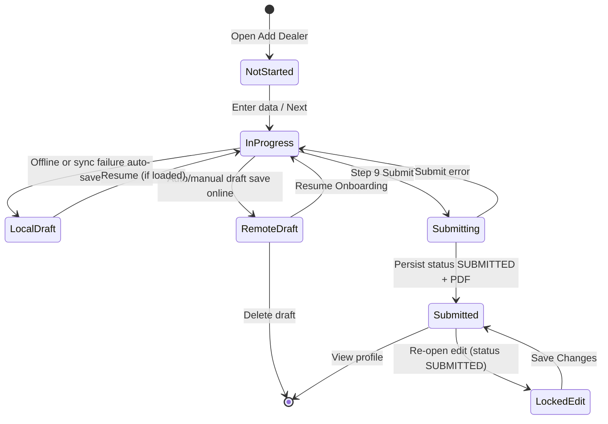

# Dealer Management, Onboarding, and Profile Business Rules

## 1. Scope

This document extracts technology-agnostic business, UX, security, and integrity rules for **Dealer** workflows in Field Commander version 1, for preservation in version 2.

### In scope

1. Dealer eligibility and module permissions (`mobile_dealer`)
2. Nine-step dealer onboarding wizard (basic info → profiling → business → commitments → compliance → documents → annexures → agreement → review/submit)
3. Draft save, resume, auto-save, and local offline fallback
4. Mobile-number duplicate/profile lookup and edit-lock behavior
5. Weighted scoring (eight aspects), risk-band classification, and dossier PDF generation
6. Dealer list/search/filter on the dashboard
7. Dealer entity profile view, edit entry, document viewing, and PDF share/download
8. Temporary/prospect dealers list (separate from onboarded dealers)
9. Free-text distributor linkage on dealer records (not a system foreign key)
10. Cross-module farmer linkage to submitted dealers
11. Media, GPS, signature, and permission-denied behavior tied to dealer onboarding
12. Shift activity logging after dealer draft save and submission

### Out of scope (except as consumers or references)

- Full distributor/farmer/FPO onboarding field catalogs (covered only where they link to or display dealers)
- Retail invoicing, inventory, expenses, attendance, travel distance algorithms
- FarmCard / FarmDiary workflows
- Backend row-level security policy definitions (not present in this repository)
- Version-2 architecture, stack, or schema design

### Version-2 boundary

This document states **what** the application must do. It does **not** prescribe frameworks, folders, databases, APIs, ORMs, state libraries, navigation libraries, media hosts, or offline engines for version 2. Version-1 technologies appear only as **evidence**.

### Workflows analyzed

| Workflow | Entry | Outcome |
| --- | --- | --- |
| Start onboarding | Dashboard “Add Dealer” / FAB when edit permission granted | Empty 9-step wizard |
| Resume draft | Dashboard dealer card “Resume Onboarding” | Wizard restored at saved step |
| Edit submitted profile | Dashboard card menu / Entity Profile “Edit Profile” | Wizard with submitted data; partial field lock when status is submitted |
| Mobile auto-load | Enter 10-digit contact mobile on Step 1 | Loads newest draft or submitted profile for that mobile |
| Submit / save changes | Step 9 submit | Persisted submitted dealer record + PDF dossier reference; draft deleted |
| View profile | Dashboard “View Profile” | Read-only profile overview |
| Delete draft | Draft card delete control | Removes remote draft for that entity id |
| Prospect dealers | Dashboard route/village “Dealers” shortcut | Temp dealers list filtered by village names |

---

## 2. Dealer Repository Evidence Map

### Screens and components

| File | Why it matters |
| --- | --- |
| `Frontend/src/modules/onboarding/dealer/screens/DealerOnboardingScreen.tsx` | Wizard shell, step routing, footer actions, success screen, language toggle, location cascade, back handling |
| `Frontend/src/modules/onboarding/dealer/screens/steps/Step1BasicInfo.tsx` | Identity, address cascade, tax IDs, owners, bank accounts, lock UI |
| `Frontend/src/modules/onboarding/dealer/screens/steps/Step2Profiling.tsx` | Eight score aspects, guidance tables, remarks, audio, red flags |
| `Frontend/src/modules/onboarding/dealer/screens/steps/Step3Business.tsx` | Additional shops/godowns, distributor link, proposed status, demo farmers |
| `Frontend/src/modules/onboarding/dealer/screens/steps/Step4Commitments.tsx` | GLS commitment checkboxes + lock |
| `Frontend/src/modules/onboarding/dealer/screens/steps/Step5Compliance.tsx` | Regulatory compliance checklist + lock |
| `Frontend/src/modules/onboarding/dealer/screens/steps/Step6Documents.tsx` | Core docs, GPS shop photos, selfie, dynamic compliance uploads |
| `Frontend/src/modules/onboarding/dealer/screens/steps/Step7Annexures.tsx` | Territories, products, credit refs, sales share, security deposit |
| `Frontend/src/modules/onboarding/dealer/screens/steps/Step8Agreement.tsx` | Terms text, acceptance, dual signatures + lock |
| `Frontend/src/modules/onboarding/dealer/screens/steps/Step9Review.tsx` | Missing-field review, jump-to-edit |
| `Frontend/src/modules/dashboard/screens/DashboardScreen.tsx` | List, filters, permissions, navigation entry points, temp-dealer shortcuts |
| `Frontend/src/modules/dashboard/screens/EntityProfileScreen.tsx` | Dealer profile display and edit |
| `Frontend/src/modules/dashboard/screens/TempDealersListScreen.tsx` | Prospect dealer list by villages |
| `Frontend/src/modules/dashboard/components/TempDealerCard.tsx` | Prospect dealer card: call/map/share |
| `Frontend/src/modules/dashboard/screens/ProfileScreen.tsx` | Dealer count metric |
| `Frontend/src/design-system/components/EntityCard.tsx` | Card summary, draft/resume/view/edit/delete |
| `Frontend/src/design-system/components/FilterModal.tsx` | Dealer filter options |
| `Frontend/src/design-system/components/UploadTile.tsx` | Camera vs file upload UI |
| `Frontend/src/design-system/components/ScoreSlider.tsx` | Score range 1–10 (UI control) |
| `Frontend/src/design-system/templates/Templates.tsx` (WizardFlowTemplate / FeedbackScreenTemplate) | Shared wizard chrome and success feedback |

### Hooks and forms

| File | Why it matters |
| --- | --- |
| `Frontend/src/modules/onboarding/dealer/hooks.ts` | Form defaults, draft CRUD, scoring, uploads, submit, locks, PDF, validation gate |

### Schemas and validation

| File | Why it matters |
| --- | --- |
| `Frontend/src/modules/onboarding/dealer/schema.ts` | Field contracts, GLS commitments catalog, Zod constraints |

### Services and APIs

| File | Why it matters |
| --- | --- |
| `Frontend/src/modules/onboarding/services/onboardingService.ts` | Persist/map dealer records; mobile lookup |
| `Frontend/src/modules/onboarding/services/cloudinaryService.ts` | Media upload producing retrievable URLs |
| `Frontend/src/modules/dashboard/services/dashboardService.ts` | Fetch dealers/drafts/temp dealers by owning user / villages |

### Stores and state

| File | Why it matters |
| --- | --- |
| `Frontend/src/store/authStore.ts` | Authenticated user identity for ownership |
| `Frontend/src/store/draftStore.ts` | Local offline draft fallback typed `DEALER` |
| `Frontend/src/store/alertStore.ts` | User-facing alerts |
| `Frontend/src/store/shiftStore.ts` | Activity increment and shift timeline events |

### Navigation

| File | Why it matters |
| --- | --- |
| `Frontend/src/navigation/AppNavigator.tsx` | Registers `DealerOnboarding` and `TempDealersListScreen` inside authenticated stack |

### Core and shared utilities

| File | Why it matters |
| --- | --- |
| `Frontend/src/core/usePermissions.ts` | `mobile_dealer` view/edit permissions |
| `Frontend/src/core/permissions.ts` | Camera/media permission requests and fallbacks |
| `Frontend/src/core/OfflineSyncManager.tsx` | Location sync only — does not sync dealer drafts/media |
| `Frontend/src/core/i18n.ts` + `Frontend/locales/{en,hi,gu}.json` | Translation keys for dealer UI |
| `Frontend/src/core/imageCompressor.ts` | Documents shared compression pattern used by onboarding |

### Related modules

| File | Why it matters |
| --- | --- |
| `Frontend/src/modules/onboarding/farmer/hooks.ts` / `Step3History.tsx` | Farmer optional link to submitted dealers owned by same user |
| `Frontend/src/modules/onboarding/distributor/screens/steps/Step4Dealers.tsx` | Distributor “top dealers” free-text/upload — not system dealer FK |
| `Frontend/src/modules/dashboard/screens/EntityProfileScreen.tsx` (farmer branch) | Displays linked dealer id on farmer profiles |

---

## 3. Actors, Roles, Eligibility, and Permissions

### Actors

| Actor | Description | Evidence |
| --- | --- | --- |
| Authenticated field user | Must be signed in to reach onboarding/dashboard | Auth-gated navigator |
| Sales Executive (SE) | Default role with hardcoded `mobile_dealer` view+edit | `usePermissions.ts:51-57` |
| Territory Head / Super Admin | Treated as full module access | `usePermissions.ts:49-50` |
| Other named roles | Permissions from role → role_permissions mapping | `usePermissions.ts:60-76` |
| Dealer (business party) | Signs agreement; not an app login actor | Step 8 `dealerSignature` |
| Sales Executive (signatory) | Co-signs agreement | Step 8 `seSignature` |

### Eligibility and access rules

| Topic | Finding |
| --- | --- |
| Who can start onboarding | Users with `mobile_dealer.can_edit` |
| Who can see dealers tab | Users with `mobile_dealer.can_view` |
| Must dealer already exist? | No — create path is empty form; update path uses existing id |
| Requires a distributor first? | No — distributor link is optional free-text on Step 3 |
| One user, many dealers | Yes — list is owned by current user id (`se_id`) |
| Invitation / approval gate to open wizard | None found |
| Profile-completion gate to open wizard | None found for dealer module |
| Unauthorized behavior | Tab omitted / add actions disabled when permissions false |
| Inactive / rejected onboarding states | No dedicated inactive/rejected statuses found |
| Temporary dealer creation by SE | Not supported in onboarding; prospect list is read-only from `temp_dealers` |

---

## 4. Dealer Entities and Data Contracts

### Primary entities

| Entity | Purpose | Key fields (logical) |
| --- | --- | --- |
| Dealer record | Submitted/editable onboarding result | Shop/owners/contact/address/tax/bank; scoring; additional locations; distributor links; demo farmers; commitments; documents; annexures; total_score; category band; status; pdf reference; signatures; ownership user id; update history |
| Dealer draft | Incomplete onboarding | entity type `dealer`; entity id; draft payload; current step; ownership user id; update history |
| Local draft fallback | Offline/crash copy | Same payload + `_step`; type `DEALER` |
| Temp/prospect dealer | Pre-registered prospect for outreach | Name, contact, village, address, taluka, district (CSV-shaped columns) |

### Status values evidenced

| Status | Where stored | Meaning in v1 |
| --- | --- | --- |
| Draft / Incomplete | Draft store / drafts collection | Not submitted; resumeable |
| `SUBMITTED` | Dealer record `status` | Finalized submission; UI badge labels this “Approved” |
| `DRAFT` | Allowed argument to save function | Not used by dealer submit path (submit always passes `SUBMITTED`) |
| Pending (UI only) | Entity card when `status !== 'SUBMITTED'` | Display label only |

**Not evidenced:** separate `APPROVED`, `REJECTED`, `REQUIRES_CORRECTION`, `ARCHIVED`, `TEMPORARY`, `ACTIVE`, `INACTIVE` workflow states for onboarded dealers. Temporary/prospect dealers are a separate collection, not a status on the dealer record.

### Ownership and relationships

- Dealer records are owned by the authenticated field user’s id (`se_id`).
- Dashboard fetches only records for the current user.
- Dealer “linked distributor” is free-text name + contact stored on the dealer record — **not** a foreign key to a distributor id.
- Farmer onboarding may optionally store `dealer_id` referencing a submitted dealer owned by the same user.
- Distributor Step 4 “top dealers” are free-text rows or an uploaded list — **not** selections from the dealers entity collection.
- Temp dealers are not owned by SE in client logic; filtered client-side by village name.

### Transformations (behavioral)

- GST/PAN/IFSC forced to uppercase in UI.
- Compliance checklist item labels slugified to document keys (`replace(/[^a-zA-Z0-9]/g, '_').toLowerCase()`).
- Signatures stored as stroke JSON strings; PDF renders SVG paths from them.
- Shop photo keys store URL arrays; other docs store single URL.
- GPS for shop photos stored under `shopLocations` then mapped into nested location GPS on persist.
- Score band string (`Elite` / `A-Category` / `B-Category` / `C-Category`) stored as `category`; raw sum as `total_score`.
- On load from DB, missing scores default to `5`; `agreementAccepted` forced `true`.
- Village auto-repair: if draft village is an array, first element used.

### Generated values

- Draft entity id: UUID when first draft save occurs.
- PDF dossier filename: `{sanitizedShopName}_Dossier.pdf`.
- Update history entries: `{ updated_by, updated_at, modified_fields }` on manual draft save and on submitted-profile update with dirty fields.

---

## 5. Complete Dealer Onboarding Workflow

### Step order (fixed)

1. Basic Information  
2. Profiling & Scoring  
3. Business Area & Status  
4. GLS Commitments  
5. Regulatory Compliance  
6. Documents & Photos  
7. SE Evaluation & Annexures  
8. Dealer Agreement  
9. Final Review & Submit  

Initial step: `1`, or route `initialStep` when resuming a draft.

### Navigation behavior

| Action | Behavior |
| --- | --- |
| Next | Always enabled (`isNextEnabled === true`); advances `step + 1` without validating current step |
| Back (header / hardware) | If jumped from review, returns to review; else previous step; on step 1 exits screen |
| Jump from review Edit | Sets `jumpBackTo = 9`, opens target step; footer becomes “Return to Review” |
| Save Draft | Visible only when not editing an existing submitted/fetched record; requires shop name + mobile |
| Submit / Save Changes | Only on step 9; runs multi-step completeness gate then schema validation then persistence |

### State machine (evidenced)



### Draft / resume / logout / restart

- Auto-save on app background/inactive and on wizard unmount (if not success).
- Draft requires dirty fields, shop name, mobile, and authenticated user.
- Successful online draft upsert removes matching local draft.
- Offline failure writes/updates local draft with `_step`.
- Resume passes `draftId`, `draftData`, `initialStep`.
- Mobile lookup can load newest draft or submitted profile for that mobile.
- After logout: local drafts remain device-persisted and tagged with user id; remote drafts remain server-side for that user. Re-auth required to open module.
- After successful submit: remote draft for that entity id deleted; success screen shown.

### Submission prerequisites (gate)

Submit blocked unless all of the following pass (client completeness check), then schema validation:

1. Step 1 basic profile formats (PAN/GST/bank/owners/address)
2. Step 2 all eight scores are numbers in 0–10
3. Step 3 business radios + conditional distributor / locations / demo farmers
4. Step 4 all GLS commitments checked
5. Step 6 required documents + shop exterior GPS
6. Step 7 annexure required fields (+ payment proof if deposit > 0)
7. Step 8 agreement accepted + both signatures

**Step 5 compliance is not in the completeness array.** Checked compliance items only add dynamic required document keys for Step 6.

### Duplicate-submission prevention

- In-memory submit lock ref prevents double taps while submitting.

### Success navigation

- Success feedback: share PDF; optionally “Add Another Dealer” (create path only); “Go Home” to main tabs.

---

## 6. Step 1 — Basic Information Rules

### Purpose

Capture dealer identity, location, tax IDs, owners/partners, and bank accounts.

### Fields

| Field | Required | Format / allowed values | Notes |
| --- | --- | --- | --- |
| contactMobile | Yes | Exactly 10 digits | Prefixed +91 in UI; drives auto-fetch |
| owners[0].name (Contact Person) | Yes | Min 2 chars | Always shown |
| shopName | Yes | Min 2 chars | Locked when submitted |
| landlineNumber | No | `3–5 digits[- ]6–8 digits` if present | Locked when submitted |
| state | Yes | Indian states list | Cascades clear city/taluka/village |
| city | Yes | From location tree after state | Label “City/District” |
| taluka | Yes | From location tree | |
| village | Yes | From location tree | Schema expects string |
| address | Yes | Min 5 chars | |
| landmark | No | Free text | |
| gstNumber | Yes | Indian GST regex; uppercased; max 15 | |
| panNumber | Yes | Indian PAN regex; uppercased; max 10 | |
| estYear | Yes | 4-char year via year picker | |
| firmType | Yes | `Proprietorship` \| `Partnership` \| `Pvt Ltd` | Controls multi-owner/bank UI |
| bankAccounts[] | ≥1 | Type, bank, branch, name, 9–18 digit account, IFSC | Bank names from fixed list |
| owners[1+] | Conditionally shown | Min 2 chars each | Only if Proprietorship or Partnership |
| bankAccounts[1+] | Conditionally shown | Same as primary | Only if multi-allowed firm type |
| bankAccounts[].isActive | Edit only | Boolean (default treated as active if not false) | Shown when `isEditing` |

### Conditional behavior

- If firm type is Proprietorship or Partnership: auto-ensure at least two owner slots; allow add/remove additional owners and banks.
- Else: collapse to first owner and first bank only.
- When `isLocked` (submitted): shop identity/address/tax/firm fields become non-interactive (opacity 0.5); mobile and contact person remain editable.
- Location options: selecting any Indian state triggers fetch of a Gujarat location tree RPC; non-Gujarat states yield empty city lists (behavioral limitation).

### Defaults

- One empty owner; one bank with `isActive: true` and empty fields.

### Validation timing

- Form mode `onChange`; Next does not block; submit/schema enforce.

### Evidence

- `Step1BasicInfo.tsx`, `schema.ts:11-44`, `hooks.ts` validationStatus Step 1, `DealerOnboardingScreen.tsx` location cascade.

---

## 7. Step 2 — Profiling Rules

### Purpose

SE scores dealer on eight aspects (0–10 each), optional remarks/audio, optional red flags.

### Aspects (keys)

1. Financial Health & Turnover (`scoreFinancial`)
2. Market Reputation (`scoreReputation`)
3. Shop Operations & Infrastructure (`scoreOperations`)
4. Farmer Network & Reach (`scoreFarmerNetwork`)
5. Team & Professionalism (`scoreTeam`)
6. Current Portfolio (`scorePortfolio`)
7. Experience & Openness to Bio (`scoreExperience`)
8. Growth Orientation (`scoreGrowth`)

Each has optional `rem*` text and `audio*` URL.

### Scoring UI guidance

- Dynamic guidance tables change by score bands ≤2, ≤4, ≤6, ≤8, else 9–10 (see `getDynamicTableData` in Step2).
- Score control UI minimum is **1**, maximum **10**, step 1.
- New-form defaults initialize scores at **0**.
- Completeness check accepts scores that are numbers in **0–10**.
- Schema accepts **0–10**.

### Aggregate score and band

```
raw = sum of 8 scores
band =
  raw > 60  → Elite
  raw >= 46 → A-Category
  raw >= 26 → B-Category
  else      → C-Category
percentage = raw (labeled “/ 100” in PDF; max theoretical 80 if each score max 10)
```

**Note:** Max sum with 8×10 is 80, yet UI/PDF present “/ 100”. Band thresholds still use the raw sum as coded.

### Red flags

- Optional text + optional audio; not required for submit.

### Effect on approval/eligibility

- Band and total stored on submit; used for filters/display.
- No code path blocks submission based on low band or red flags.

### Evidence

- `Step2Profiling.tsx`, `hooks.ts:279-307`, `schema.ts:46-55`.

---

## 8. Step 3 — Business Information Rules

### Purpose

Capture additional locations, distributor linkage, proposed commercial status, and demo-farmer willingness.

### Fields

| Field | Required | Values | Conditional |
| --- | --- | --- | --- |
| hasAdditionalLocations | Yes | Yes/No | If No: clears shops/godowns; if Yes: seeds one shop + one godown |
| additionalShops[] | If Yes and used | shopName, estYear, state/city/taluka/village, address | Add/remove rows |
| godowns[] | If Yes and used | address, capacity, capacityUnit (`Sq.ft`/`Sq.m`) | Add/remove rows |
| isLinkedToDistributor | Yes | Yes/No | If Yes: require first distributor name (≥2) + 10-digit contact |
| linkedDistributors[0] | If Yes | Free-text name + contact | Not system distributor picker |
| proposedStatus | Yes | `Authorised Dealer` \| `Exclusive Dealer` \| `Dealer` | |
| willingDemoFarmers | Yes | Yes/No | If Yes: require uploaded list **or** ≥1 manual farmer with name+contact+address |
| demoFarmers[] | Conditional | name, contact, address | Manual table hidden when list uploaded |
| documents.demo_farmers_list | Conditional alt | Media URL | Optional path when willing = Yes |

### Completeness nuance

- “Yes” additional locations requires at least one shop **or** godown, and every present shop/godown row fully filled.

### Evidence

- `Step3Business.tsx`, `hooks.ts:252-263`, `schema.ts:57-87`.

---

## 9. Step 4 — Commitments Rules

### Purpose

Dealer must accept all fixed GLS commitment statements.

### Catalog (`GLS_COMMITMENTS`)

1. 10% clean margin on MRP  
2. Company-funded schemes & loyalty program benefits  
3. Support from GLS Field Executive & sales team  
4. Access to crop-specific packages, Farm Card + Calendar  
5. Training on products and farmer advisory  

### Rules

- All five must be checked for Step 4 completeness / submit.
- When locked (submitted): checklist non-interactive.
- Commitments stored under `commitments.glsCommitments`.

### Evidence

- `schema.ts:3-9`, `Step4Commitments.tsx`, `hooks.ts:265`.

---

## 10. Step 5 — Compliance Rules

### Purpose

SE verifies availability of regulatory documents via checklist.

### Catalog (`COMPLIANCE_ITEMS`)

1. Valid FCO Authorization / Fertilizer Dealer Registration  
2. Valid Insecticide Selling License  
3. Educational Qualification Certificate  
4. Any state-specific approvals  

### Rules

- Checklist items are optional for navigation and **not** part of the submit completeness array.
- Each checked item creates a **required** document upload slot on Step 6 (slugified key).
- When locked: checklist non-interactive.
- No expiry-date fields or license-number fields exist.
- No approval restriction based on unchecked compliance.

### Evidence

- `Step5Compliance.tsx`, `Step6Documents.tsx:92-105`, `hooks.ts:267-270` (dynamic keys only).

---

## 11. Step 6 — Document Rules

### Core required documents

| Key | Label | Required |
| --- | --- | --- |
| `gst certificate / shop establishment license` | GST / shop establishment | Yes |
| `pan card` | PAN card | Yes |
| `cancelled cheque` | Cancelled cheque | Yes |
| `shop_exterior` | Exterior store front (camera, multi) | Yes + GPS |
| `selfie_with_owner` | Selfie with contact person | Yes |

### Optional

| Key | Notes |
| --- | --- |
| `shop_interior` | Multi camera + GPS attempted |
| `shop_godown` | Multi camera + GPS attempted |
| `farmer_list` | Additional farmer customers list |
| Dynamic compliance keys | Required only if Step 5 item checked |
| `demo_farmers_list` | From Step 3 |
| `se_payment_proof` | From Step 7 if deposit > 0 |

### Upload behavior

- Camera or document picker; permission denial shows fallback message and aborts.
- Non-camera documents: max **5 MB**.
- Images resized width 1024, JPEG compress 0.6 before upload.
- Upload must succeed and return retrievable URL before value stored.
- Shop photo keys: GPS required; if permission denied, upload aborted with “GPS Required”.
- Shop GPS stored under `shopLocations[key]`; Step 6 completeness requires `shopLocations.shop_exterior`.
- Remove/replace supported via clear/delete controls.
- Upload failure alert: “Upload failed.”

### Evidence

- `Step6Documents.tsx`, `hooks.ts:267-270`, `hooks.ts:681-753`.

---

## 12. Step 7 — Annexure Rules

### Annexure A — Territory Coverage

- ≥1 territory required.
- Each: taluka (from Step 1 city cascade), ≥1 village, cultivable area, ≥1 major crop from West-India crop list.
- Add/remove territories (first cannot remove via close control).

### Annexure B — Principal companies & products

- Required multi-selects: principal suppliers, chemical products, bio products, other products (demo option lists).

### Annexure D — Bank & credit references

- `seHasCreditReferences` Yes/No (optional in schema; completeness requires valid refs if Yes).
- If Yes: ≥1 ref with name ≥2 chars and contact exactly 10 digits; optional behavior notes/audio.

### Annexure E & F — Sales & expansion

- `seWillShareSales` checkbox; completeness requires value !== undefined (default false satisfies).
- Growth vision text **or** audio: shown as missing on Review if both empty, but **not** required by Step 7 completeness gate.

### Security deposit

- Optional amount.
- If parseInt(amount) > 0: require `sePaymentProofText` **or** `documents.se_payment_proof` (schema superRefine + completeness).

### Evidence

- `Step7Annexures.tsx`, `schema.ts:97-138`, `hooks.ts:272-277`, `Step9Review.tsx:104-106`.

---

## 13. Step 8 — Agreement and Consent Rules

### Purpose

Display generated agreement content from prior annexures/terms; require acceptance and dual signatures.

### Rules

- Agreement acceptance checkbox must be true.
- Dealer signature and SE signature required (min length 10 on stringified stroke data).
- When locked: entire step non-interactive.
- Terms include territory, status focus, payment to linked distributor, security deposit clause, support obligations, data sharing, termination (30 days), Vadodara jurisdiction, and formal promote/engage/honour/storage pledges.
- Acceptance is reversible while unlocked (checkbox can be unchecked before submit).
- `agreementAccepted` is **not** persisted as its own DB column; on reload from submitted record it is forced `true`.

### Evidence

- `Step8Agreement.tsx`, `schema.ts:121-124`, `onboardingService.ts:235`.

---

## 14. Step 9 — Final Review and Submission Rules

### Purpose

Show section summaries with missing markers; allow jump-edit; submit.

### Behavior

- Missing required values render in red with “Missing”.
- Edit buttons set jump-back to step 9 and open target step (1–8). Note: checklist section edit jumps to step 4 only (not 5).
- Submit button label: “Submit Profile” (create) or “Save Changes” (edit).
- Submit runs completeness list then schema; failures alert with missing sections or flattened schema errors.
- On success: PDF generated and uploaded; dealer upserted `SUBMITTED`; draft deleted; shift activity logged; success screen.

### Evidence

- `Step9Review.tsx`, `hooks.ts:781-877`, `DealerOnboardingScreen.tsx:121-131`.

---

## 15. Temporary Dealer Rules

### What exists

- Separate prospect collection (`temp_dealers`) loaded by village name match.
- Entry: Dashboard route or village shortcuts labeled “Dealers” → `TempDealersListScreen`.
- Card actions: Call (if mobile), Map (search query), WhatsApp share of details.
- Empty state: “No Dealers Found” / prospect messaging.
- Loading spinner while fetching.

### What does **not** exist (verified absent)

- Create temporary dealer from app
- Convert temp → permanent / start onboarding prefilled from temp card
- Temp dealer expiry
- Approve/reject temp dealers
- Retail/inventory eligibility for temp dealers
- Sync/ownership model beyond read-all-then-filter
- Link between `temp_dealers` and `dealers` records

**Classification:** Partially implemented outreach directory only.

### Evidence

- `dashboardService.ts:180-195`, `TempDealersListScreen.tsx`, `TempDealerCard.tsx`, `DashboardScreen.tsx` navigation to temp list.

---

## 16. Dealer Profile Screen Rules

### Entry points

- Entity card “View Profile” (non-draft dealers)
- Edit from profile menu / card “Edit Profile” → onboarding with `editData`

### Visible content (dealer branch)

1. Header: name, type, since date, status badge (`SUBMITTED`→“Approved”, else “Draft”)
2. Score widget + map link if exterior GPS present
3. Business profile (shop, contact, owners, phones, address, firm, year, GST, PAN)
4. Bank details
5. Profiling scores + red flags + audio
6. Business infrastructure (proposed status, demo farmers, linked distributors, additional shops/godowns)
7. Commercial annexures (territories, products, sales share, growth vision, credit refs, deposit)
8. Commitments, compliance list, uploaded documents directory (open/view)
9. Signatures presence indicators + PDF download/share if `pdf_url` present

### Actions

| Action | Condition |
| --- | --- |
| Edit Profile | Always offered for dealer profile (navigates to wizard) |
| View document | Document URL present |
| Download/Share PDF | `pdf_url` present; else “Not Found” alert |
| Pull-to-refresh | Visual only (~600ms); does not re-fetch server |

### Not shown / not available

- Approve / Reject controls
- Delete / archive / deactivate dealer
- Convert temporary
- Direct navigation to retail/inventory from dealer profile
- Live distributor profile deep-link (free-text only)

### Difference: onboarding vs profile vs temp vs farmer link

| Data set | Nature |
| --- | --- |
| Onboarding form | Working set; draft or edit |
| Dealer profile | Read model of submitted/persisted dealer record |
| Temp dealers | Separate prospect directory |
| Distributor–dealer | Free-text on dealer; free-text “top dealers” on distributor |
| Farmer `dealer_id` | Optional FK-like id to submitted dealer |

### Evidence

- `EntityProfileScreen.tsx` dealer branch, `EntityCard.tsx`, farmer `dealerId` usage.

---

## 17. Dealer Status and State Transitions

| From | To | Actor | Trigger |
| --- | --- | --- | --- |
| Not started | In progress | SE with edit perm | Open Add Dealer |
| In progress | Remote/local draft | SE | Auto/manual save |
| Draft | In progress | SE | Resume |
| In progress | Submitted | SE | Successful Step 9 submit |
| Submitted | Locked edit | SE | Edit profile |
| Locked edit | Submitted | SE | Save Changes |
| Draft | Deleted | SE | Delete draft control |

**Forbidden / absent:** reject, require correction, archive, temporary↔permanent transitions on dealer records.

UI label mapping: `SUBMITTED` displayed as “Approved” / “Pending” otherwise — **display only**, not a separate approval workflow.

---

## 5. Version-2 Business and UX Rules

*(Canonical numbered rules for preservation. Technology-neutral.)*

### DL-ACT-001 — Authenticated access required

- **Rule:** Dealer onboarding and dealer lists are available only to authenticated users.
- **Business purpose:** Prevent anonymous data creation.
- **Trigger/condition:** User opens dealer routes.
- **Behavior/result:** Unauthenticated users cannot reach dealer screens.
- **Actor/role:** Any user.
- **Affected workflow:** All dealer workflows.
- **UX behavior:** Auth gate before stack.
- **Validation/error behavior:** N/A.
- **Online/offline behavior:** Auth session required.
- **Enforcement requirement:** Application access control.
- **Dependencies:** Authentication module.
- **Original implementation evidence:**
  - `Frontend/src/navigation/AppNavigator.tsx:162` — `DealerOnboarding` inside authenticated stack
- **Confidence:** High

### DL-ACT-002 — Module view permission gates dealer list

- **Rule:** Users may view the dealers dashboard tab only if they have dealer module view permission (or elevated full-access role).
- **Business purpose:** Role-based visibility.
- **Trigger/condition:** Dashboard builds tabs.
- **Behavior/result:** Dealers tab omitted when `can_view` false.
- **Actor/role:** SE / TH / Super Admin / mapped roles.
- **Affected workflow:** Dashboard.
- **UX behavior:** Tab hidden.
- **Validation/error behavior:** N/A.
- **Online/offline behavior:** Permissions cached locally then refreshed.
- **Enforcement requirement:** Client permission check; server isolation assumed by ownership filter.
- **Dependencies:** Permissions service.
- **Original implementation evidence:**
  - `Frontend/src/modules/dashboard/screens/DashboardScreen.tsx:46,553-555` — `dealerPerm.can_view`
  - `Frontend/src/core/usePermissions.ts:55` — `mobile_dealer`
- **Confidence:** High

### DL-ACT-003 — Module edit permission gates create actions

- **Rule:** Users may start dealer onboarding only if they have dealer module edit permission (or elevated full-access role).
- **Business purpose:** Restrict who can create/edit dealer records.
- **Trigger/condition:** FAB / empty-state Add Dealer.
- **Behavior/result:** Action hidden/disabled without `can_edit`.
- **Actor/role:** SE / TH / Super Admin / mapped roles.
- **Affected workflow:** Create onboarding.
- **UX behavior:** Add Dealer unavailable.
- **Validation/error behavior:** N/A.
- **Online/offline behavior:** Same as permissions cache.
- **Enforcement requirement:** Client UI gate.
- **Dependencies:** Permissions.
- **Original implementation evidence:**
  - `Frontend/src/modules/dashboard/screens/DashboardScreen.tsx:584,1013-1030` — `dealerPerm.can_edit`
- **Confidence:** High

### DL-ACT-004 — One field user may own many dealers

- **Rule:** A single authenticated field user may create and manage multiple dealer records they own.
- **Business purpose:** Territory network building.
- **Trigger/condition:** Repeated onboarding / list fetch by owner id.
- **Behavior/result:** List returns all dealers for that user.
- **Actor/role:** Field user (SE).
- **Affected workflow:** Dashboard list.
- **UX behavior:** Paginated dealer cards.
- **Validation/error behavior:** N/A.
- **Online/offline behavior:** Online fetch by owner.
- **Enforcement requirement:** Ownership attribute on records.
- **Dependencies:** Persistence layer.
- **Original implementation evidence:**
  - `Frontend/src/modules/dashboard/services/dashboardService.ts:28-37` — `fetchMyDealers` filters `se_id`
- **Confidence:** High

### DL-ACT-005 — Users must not access other users’ dealer records via list

- **Rule:** Dealer list queries must be scoped to the current user’s owned records.
- **Business purpose:** Data isolation.
- **Trigger/condition:** Dashboard load.
- **Behavior/result:** Only owner’s dealers shown.
- **Actor/role:** Authenticated field user.
- **Affected workflow:** Dashboard / profile.
- **UX behavior:** N/A.
- **Validation/error behavior:** Fetch errors logged/surfaced by dashboard error handling.
- **Online/offline behavior:** Online.
- **Enforcement requirement:** Query filter by owner; backend authorization expected.
- **Dependencies:** Auth user id.
- **Original implementation evidence:**
  - `Frontend/src/modules/dashboard/services/dashboardService.ts:33-35` — `.eq('se_id', userId)`
- **Confidence:** High (client-enforced; server RLS not verified in repo)

### DL-WF-001 — Nine-step wizard order

- **Rule:** Dealer onboarding must present nine ordered steps as listed in §5.
- **Business purpose:** Structured capture of commercial evaluation and agreement.
- **Trigger/condition:** Onboarding open.
- **Behavior/result:** Step indicator `STEP n OF 9`; progress n/9.
- **Actor/role:** Field user.
- **Affected workflow:** Onboarding.
- **UX behavior:** Wizard chrome + language toggle.
- **Validation/error behavior:** Per-step schema; submit gate.
- **Online/offline behavior:** Steps usable offline for entry; media/submit need network.
- **Enforcement requirement:** Workflow engine.
- **Dependencies:** Step screens.
- **Original implementation evidence:**
  - `Frontend/src/modules/onboarding/dealer/screens/DealerOnboardingScreen.tsx:137-166`
- **Confidence:** High

### DL-WF-002 — Next does not validate current step

- **Rule:** Advancing to the next step must be allowed without validating the current step’s required fields.
- **Business purpose:** Allow partial progress / later completion.
- **Trigger/condition:** Next pressed.
- **Behavior/result:** `step` increments; footer Next always enabled.
- **Actor/role:** Field user.
- **Affected workflow:** Onboarding.
- **UX behavior:** No blocking toast on Next.
- **Validation/error behavior:** Deferred to submit/review.
- **Online/offline behavior:** Same.
- **Enforcement requirement:** Navigation must not hard-block Next on validity.
- **Dependencies:** None.
- **Original implementation evidence:**
  - `Frontend/src/modules/onboarding/dealer/hooks.ts:299` — `isNextEnabled = true`
  - `Frontend/src/modules/onboarding/dealer/screens/DealerOnboardingScreen.tsx:150`
- **Confidence:** High

### DL-WF-003 — Review jump-edit with return

- **Rule:** From final review, user may jump to an earlier step to edit, then return to review via footer “Return to Review” or back.
- **Business purpose:** Correct missing fields efficiently.
- **Trigger/condition:** Edit on review section.
- **Behavior/result:** `jumpBackTo` set to 9; target step opened.
- **Actor/role:** Field user.
- **Affected workflow:** Review.
- **UX behavior:** Footer label changes.
- **Validation/error behavior:** N/A.
- **Online/offline behavior:** Same.
- **Enforcement requirement:** Wizard jump stack.
- **Dependencies:** Step 9.
- **Original implementation evidence:**
  - `Frontend/src/modules/onboarding/dealer/screens/steps/Step9Review.tsx:58-62`
  - `Frontend/src/modules/onboarding/dealer/screens/DealerOnboardingScreen.tsx:149-150`
- **Confidence:** High

### DL-WF-004 — Draft save requirements

- **Rule:** Saving a draft requires shop name and mobile number, authenticated user, and that the profile is not already a completed fetched/submitted record being drafted.
- **Business purpose:** Identifiable incomplete work; prevent draft of completed profiles.
- **Trigger/condition:** Save Draft / auto-save.
- **Behavior/result:** Upsert remote draft or local fallback; alert if missing name/mobile or already complete.
- **Actor/role:** Field user.
- **Affected workflow:** Draft.
- **UX behavior:** Save Draft hidden when editing existing submitted/fetched profile.
- **Validation/error behavior:** Alerts “Cannot Save” / “Cannot Save Draft”.
- **Online/offline behavior:** Online upsert; on failure local draft.
- **Enforcement requirement:** Draft persistence.
- **Dependencies:** Auth, draft store.
- **Original implementation evidence:**
  - `Frontend/src/modules/onboarding/dealer/hooks.ts:121-233`
  - `Frontend/src/modules/onboarding/dealer/screens/DealerOnboardingScreen.tsx:147`
- **Confidence:** High

### DL-WF-005 — Auto-save on background and exit

- **Rule:** Partially completed onboarding must attempt draft persistence when the app backgrounds or the wizard unmounts (unless success already shown).
- **Business purpose:** Reduce data loss.
- **Trigger/condition:** App inactive/background or unmount.
- **Behavior/result:** `saveDraftToDB(false)` if dirty and eligible.
- **Actor/role:** Field user.
- **Affected workflow:** Draft.
- **UX behavior:** Silent.
- **Validation/error behavior:** Console log + local fallback.
- **Online/offline behavior:** Offline → local.
- **Enforcement requirement:** Lifecycle hooks.
- **Dependencies:** Draft persistence.
- **Original implementation evidence:**
  - `Frontend/src/modules/onboarding/dealer/hooks.ts:175-185`
- **Confidence:** High

### DL-WF-006 — Resume draft at saved step

- **Rule:** Resuming a draft must restore form values and open at the saved current step.
- **Business purpose:** Continuity.
- **Trigger/condition:** Resume Onboarding from card.
- **Behavior/result:** Route params `draftId`, `draftData`, `initialStep`.
- **Actor/role:** Field user.
- **Affected workflow:** Draft resume.
- **UX behavior:** Wizard continues mid-flow.
- **Validation/error behavior:** Village array auto-repair if needed.
- **Online/offline behavior:** Remote drafts preferred; local fallback exists.
- **Enforcement requirement:** Draft restore.
- **Dependencies:** Dashboard card.
- **Original implementation evidence:**
  - `Frontend/src/design-system/components/EntityCard.tsx:314-318`
  - `Frontend/src/modules/onboarding/dealer/hooks.ts:27-36`
- **Confidence:** High

### DL-WF-007 — Mobile auto-load existing profile/draft

- **Rule:** When a 10-digit mobile is entered on a new (non-edit, non-draft) form, the app must look up the newest matching dealer draft or submitted profile and load it after a short debounce.
- **Business purpose:** Prevent duplicate onboarding; support edit-by-mobile.
- **Trigger/condition:** `contactMobile.length === 10`.
- **Behavior/result:** Alert “Profile Found”; reset form; if draft restore step; if submitted set lock.
- **Actor/role:** Field user.
- **Affected workflow:** Step 1.
- **UX behavior:** Fetching state; alert.
- **Validation/error behavior:** Failures logged; no blocking alert.
- **Online/offline behavior:** Requires network lookup.
- **Enforcement requirement:** Mobile lookup service.
- **Dependencies:** Drafts + dealers collections.
- **Original implementation evidence:**
  - `Frontend/src/modules/onboarding/dealer/hooks.ts:82-119`
  - `Frontend/src/modules/onboarding/services/onboardingService.ts:651-677`
- **Confidence:** High

### DL-WF-008 — Submit completeness gate

- **Rule:** Final submission must be blocked until Steps 1–4 and 6–8 completeness criteria pass (as defined in §5–§13), then schema validation must pass.
- **Business purpose:** Ensure minimum commercial dossier quality.
- **Trigger/condition:** Submit / Save Changes.
- **Behavior/result:** Alert listing incomplete sections or schema errors; else persist.
- **Actor/role:** Field user.
- **Affected workflow:** Step 9.
- **UX behavior:** Loading alerts during PDF/save.
- **Validation/error behavior:** “Missing Information” / “Strict Validation Failed” / “Submission Failed”.
- **Online/offline behavior:** Requires network for media PDF upload and persistence.
- **Enforcement requirement:** Client gate + schema + persistence.
- **Dependencies:** All prior steps.
- **Original implementation evidence:**
  - `Frontend/src/modules/onboarding/dealer/hooks.ts:237-297,781-877`
- **Confidence:** High

### DL-WF-009 — Submit creates submitted record and dossier

- **Rule:** Successful submission must persist a dealer record with status submitted, total score, category band, PDF dossier reference, signatures, documents, and ownership; then delete any related draft.
- **Business purpose:** Formal onboarding completion.
- **Trigger/condition:** Validation passed.
- **Behavior/result:** Insert or update by existing id; success screen.
- **Actor/role:** Field user.
- **Affected workflow:** Submit.
- **UX behavior:** “Profile Submitted!” or “Profile Updated!”.
- **Validation/error behavior:** Error alert with message.
- **Online/offline behavior:** Online required.
- **Enforcement requirement:** Atomic-enough save after PDF upload.
- **Dependencies:** Media upload, PDF generation.
- **Original implementation evidence:**
  - `Frontend/src/modules/onboarding/dealer/hooks.ts:803-839`
  - `Frontend/src/modules/onboarding/services/onboardingService.ts:8-139`
- **Confidence:** High

### DL-WF-010 — Duplicate tap protection

- **Rule:** Concurrent duplicate submits must be ignored while a submit is in flight.
- **Business purpose:** Prevent duplicate records/uploads.
- **Trigger/condition:** Rapid Submit taps.
- **Behavior/result:** Second call returns immediately.
- **Actor/role:** Field user.
- **Affected workflow:** Submit.
- **UX behavior:** Button loading state.
- **Validation/error behavior:** N/A.
- **Online/offline behavior:** Same.
- **Enforcement requirement:** Client lock.
- **Dependencies:** None.
- **Original implementation evidence:**
  - `Frontend/src/modules/onboarding/dealer/hooks.ts:778-800`
- **Confidence:** High

### DL-WF-011 — Shift activity logging

- **Rule:** Successful manual draft save and successful dealer submit/update must increment shift activity and log a timeline event with route/village description when a shift is active.
- **Business purpose:** Field activity tracking.
- **Trigger/condition:** Save draft / submit success.
- **Behavior/result:** Activity + event logged.
- **Actor/role:** Field user on shift.
- **Affected workflow:** Draft/submit.
- **UX behavior:** Transparent.
- **Validation/error behavior:** Not user-blocking if shift missing.
- **Online/offline behavior:** Uses online shift/route lookups when available.
- **Enforcement requirement:** Shift module integration.
- **Dependencies:** Shift store.
- **Original implementation evidence:**
  - `Frontend/src/modules/onboarding/dealer/hooks.ts:216-230,814-829`
- **Confidence:** High

### DL-LOCK-001 — Submitted profile partial edit lock

- **Rule:** When a submitted dealer profile is edited, identity/tax/address/firm/core locked fields must not be changed; only an allow-list of contact, banks, scoring, business area, annexures, documents, and signatures may be dirty-saved.
- **Business purpose:** Protect core KYC while allowing operational updates.
- **Trigger/condition:** `status === SUBMITTED` → `isLocked`; dirty fields checked on save/submit.
- **Behavior/result:** Illegal dirty fields → alert and block save/submit.
- **Actor/role:** Field user.
- **Affected workflow:** Edit submitted.
- **UX behavior:** Locked sections visually disabled (Steps 1 subset, 4, 5, 8).
- **Validation/error behavior:** “You are only authorized to edit…”
- **Online/offline behavior:** Same.
- **Enforcement requirement:** Client restriction; update history records dirty keys.
- **Dependencies:** Status field.
- **Original implementation evidence:**
  - `Frontend/src/modules/onboarding/dealer/hooks.ts:80,187-198`
  - `Frontend/src/modules/onboarding/dealer/screens/steps/Step1BasicInfo.tsx:63`
- **Confidence:** High

### DL-SCORE-001 — Eight-aspect scoring and bands

- **Rule:** Dealer profiling must capture eight numeric scores and derive band: Elite (>60), A-Category (46–60), B-Category (26–45), C-Category (<26).
- **Business purpose:** Risk/capability classification.
- **Trigger/condition:** Score changes / submit.
- **Behavior/result:** Display badge; persist `total_score` + `category`.
- **Actor/role:** Field user (SE).
- **Affected workflow:** Step 2 / filters / profile.
- **UX behavior:** Live score badge; guidance tables.
- **Validation/error behavior:** Submit requires all eight numeric.
- **Online/offline behavior:** Local compute.
- **Enforcement requirement:** Derived value persistence.
- **Dependencies:** Step 2.
- **Original implementation evidence:**
  - `Frontend/src/modules/onboarding/dealer/hooks.ts:301-307`
  - `Frontend/src/design-system/components/FilterModal.tsx:262-273`
- **Confidence:** High

### DL-DOC-001 — Required media before submit

- **Rule:** Required documents and shop-exterior GPS must be successfully uploaded/captured and represented by retrievable references before final submission.
- **Business purpose:** Evidentiary dossier.
- **Trigger/condition:** Submit gate Step 6.
- **Behavior/result:** Missing docs block submit.
- **Actor/role:** Field user.
- **Affected workflow:** Documents.
- **UX behavior:** Upload tiles; GPS status.
- **Validation/error behavior:** Listed in missing steps / review red markers.
- **Online/offline behavior:** Upload requires network; offline cannot complete those fields.
- **Enforcement requirement:** Completeness + storage of URLs.
- **Dependencies:** Permissions, media upload.
- **Original implementation evidence:**
  - `Frontend/src/modules/onboarding/dealer/hooks.ts:267-270,731`
- **Confidence:** High

### DL-AGR-001 — Dual signature and acceptance mandatory

- **Rule:** Final submission requires agreement acceptance and both dealer and SE signatures.
- **Business purpose:** MoU evidence.
- **Trigger/condition:** Step 8 / submit.
- **Behavior/result:** Incomplete agreement blocks submit.
- **Actor/role:** Dealer party + SE (captured by SE in app).
- **Affected workflow:** Agreement.
- **UX behavior:** Checkbox + signature pads.
- **Validation/error behavior:** Schema + completeness.
- **Online/offline behavior:** Capture offline possible; submit online.
- **Enforcement requirement:** Required fields.
- **Dependencies:** Step 8.
- **Original implementation evidence:**
  - `Frontend/src/modules/onboarding/dealer/schema.ts:121-124`
  - `Frontend/src/modules/onboarding/dealer/hooks.ts:286`
- **Confidence:** High

### DL-TMP-001 — Prospect dealers are read-only outreach

- **Rule:** Prospect/temporary dealers from the prospect directory may be listed, called, mapped, and shared, but must not be treated as onboarded dealers and have no in-app conversion path in v1.
- **Business purpose:** Field outreach support.
- **Trigger/condition:** Route/village Dealers shortcut.
- **Behavior/result:** Filtered list UI only.
- **Actor/role:** Field user.
- **Affected workflow:** Temp dealers.
- **UX behavior:** Call/Map/Share; empty state.
- **Validation/error behavior:** Fetch errors logged; loading then empty/list.
- **Online/offline behavior:** Online fetch.
- **Enforcement requirement:** Separate data set.
- **Dependencies:** Village names.
- **Original implementation evidence:**
  - `Frontend/src/modules/dashboard/services/dashboardService.ts:180-195`
  - `Frontend/src/modules/dashboard/components/TempDealerCard.tsx`
- **Confidence:** High

### DL-XMOD-001 — Farmers may optionally link to submitted dealers

- **Rule:** Farmer onboarding may optionally associate a farmer with a dealer that is owned by the same user and has submitted status.
- **Business purpose:** Farmer–dealer commercial linkage.
- **Trigger/condition:** Farmer Step 3 dealer selector.
- **Behavior/result:** Optional `dealerId` stored on farmer.
- **Actor/role:** Field user.
- **Affected workflow:** Farmer onboarding / farmer profile.
- **UX behavior:** Select field of submitted dealers.
- **Validation/error behavior:** Optional field.
- **Online/offline behavior:** Requires dealer list fetch.
- **Enforcement requirement:** Optional relationship.
- **Dependencies:** Submitted dealers.
- **Original implementation evidence:**
  - `Frontend/src/modules/onboarding/farmer/hooks.ts:103-105`
  - `Frontend/src/modules/onboarding/farmer/screens/steps/Step3History.tsx:96-97`
- **Confidence:** High

### DL-XMOD-002 — Distributor link is free-text, not FK

- **Rule:** Linking a dealer to a distributor captures free-text name and mobile only; it must not require selecting an existing distributor system record.
- **Business purpose:** Flexible field capture when master data incomplete.
- **Trigger/condition:** Step 3 `isLinkedToDistributor === Yes`.
- **Behavior/result:** Name+contact stored under distributor links.
- **Actor/role:** Field user.
- **Affected workflow:** Dealer business step / profile display.
- **UX behavior:** Manual inputs.
- **Validation/error behavior:** Name + 10-digit contact required if Yes.
- **Online/offline behavior:** Local.
- **Enforcement requirement:** Conditional validation.
- **Dependencies:** None.
- **Original implementation evidence:**
  - `Frontend/src/modules/onboarding/dealer/screens/steps/Step3Business.tsx:151-157`
  - `Frontend/src/modules/onboarding/services/onboardingService.ts:51-54`
- **Confidence:** High

### DL-UX-001 — Review highlights missing required fields

- **Rule:** Final review must visually mark missing required fields and allow edit navigation to correct them.
- **Business purpose:** Reduce failed submits.
- **Trigger/condition:** Step 9 display.
- **Behavior/result:** Red “Missing” labels.
- **Actor/role:** Field user.
- **Affected workflow:** Review.
- **UX behavior:** Section cards + Edit.
- **Validation/error behavior:** Advisory until submit.
- **Online/offline behavior:** Same.
- **Enforcement requirement:** Review UI.
- **Dependencies:** Form values.
- **Original implementation evidence:**
  - `Frontend/src/modules/onboarding/dealer/screens/steps/Step9Review.tsx:17-51,110-111`
- **Confidence:** High

### DL-UX-002 — Success feedback with PDF share

- **Rule:** After successful submit/update, show success feedback offering PDF share and navigation home; create path also offers add another dealer.
- **Business purpose:** Confirm completion and enable dossier sharing.
- **Trigger/condition:** `showSuccess`.
- **Behavior/result:** Feedback template actions.
- **Actor/role:** Field user.
- **Affected workflow:** Post-submit.
- **UX behavior:** Pulse success screen.
- **Validation/error behavior:** PDF share errors alert.
- **Online/offline behavior:** Share uses generated/local file.
- **Enforcement requirement:** Success state.
- **Dependencies:** PDF generator.
- **Original implementation evidence:**
  - `Frontend/src/modules/onboarding/dealer/screens/DealerOnboardingScreen.tsx:121-131`
- **Confidence:** High

### DL-UX-003 — Language cycling on onboarding

- **Rule:** Dealer onboarding header must allow cycling UI language among English, Hindi, and Gujarati.
- **Business purpose:** Field language support.
- **Trigger/condition:** Language pill press.
- **Behavior/result:** i18n language changes.
- **Actor/role:** Field user.
- **Affected workflow:** Onboarding.
- **UX behavior:** `EN`/`HI`/`GU` pill.
- **Validation/error behavior:** N/A.
- **Online/offline behavior:** Local.
- **Enforcement requirement:** i18n.
- **Dependencies:** Locale files.
- **Original implementation evidence:**
  - `Frontend/src/modules/onboarding/dealer/screens/DealerOnboardingScreen.tsx:28-31,139-142`
- **Confidence:** High

### DL-DATA-001 — Persist structured dealer dossier

- **Rule:** Submitted dealer data must be stored as a structured record including shop identity, owners, banks, location GPS, scoring, commitments, documents map, annexures, signatures, score totals, category, status, PDF reference, owner id, and update history when updated.
- **Business purpose:** Durable commercial record.
- **Trigger/condition:** Submit/update.
- **Behavior/result:** Insert or update owned record.
- **Actor/role:** Field user.
- **Affected workflow:** Persistence.
- **UX behavior:** N/A.
- **Validation/error behavior:** Throw → submission failed alert.
- **Online/offline behavior:** Online.
- **Enforcement requirement:** Persistence mapping.
- **Dependencies:** Validated form.
- **Original implementation evidence:**
  - `Frontend/src/modules/onboarding/services/onboardingService.ts:19-139`
- **Confidence:** High

### DL-OFF-001 — Offline draft fallback without background sync manager

- **Rule:** If remote draft save fails, the app must keep a local user-tagged draft so work is not lost; background offline sync manager is not required to upload dealer drafts.
- **Business purpose:** Resilience.
- **Trigger/condition:** Draft upsert error.
- **Behavior/result:** Local add/update draft type DEALER.
- **Actor/role:** Field user.
- **Affected workflow:** Draft.
- **UX behavior:** Silent fallback.
- **Validation/error behavior:** Console log.
- **Online/offline behavior:** Offline capable for form+local draft; not for final submit/media.
- **Enforcement requirement:** Local draft store.
- **Dependencies:** Device storage.
- **Original implementation evidence:**
  - `Frontend/src/modules/onboarding/dealer/hooks.ts:161-171`
  - `Frontend/src/store/draftStore.ts:11-18`
  - `Frontend/src/core/OfflineSyncManager.tsx` — no dealer draft sync references
- **Confidence:** High

### DL-PERM-001 — Camera/media permission denial fallback

- **Rule:** If camera or media permission is denied, the app must show a clear denial message and must not crash; upload must not proceed.
- **Business purpose:** Graceful device permission handling.
- **Trigger/condition:** Upload without permission.
- **Behavior/result:** Alert with fallback message.
- **Actor/role:** Field user.
- **Affected workflow:** Documents/audio.
- **UX behavior:** Alert modal.
- **Validation/error behavior:** Abort upload.
- **Online/offline behavior:** Local permission check.
- **Enforcement requirement:** Central permission helpers.
- **Dependencies:** Device OS permissions.
- **Original implementation evidence:**
  - `Frontend/src/modules/onboarding/dealer/hooks.ts:683-684`
- **Confidence:** High

### DL-PERM-002 — GPS required for shop photo capture

- **Rule:** Capturing shop exterior/interior/godown photos requires foreground location permission; denial aborts capture with GPS required message.
- **Business purpose:** Geo-verify shop presence.
- **Trigger/condition:** Upload keys `shop_exterior|shop_interior|shop_godown`.
- **Behavior/result:** Store lat/lng with photos when granted.
- **Actor/role:** Field user.
- **Affected workflow:** Step 6.
- **UX behavior:** GPS coordinates shown; “GPS Failed” if missing on existing photo.
- **Validation/error behavior:** Alert “GPS Required”.
- **Online/offline behavior:** Device GPS.
- **Enforcement requirement:** Location permission + completeness of exterior GPS.
- **Dependencies:** Location services.
- **Original implementation evidence:**
  - `Frontend/src/modules/onboarding/dealer/hooks.ts:707-717`
  - `Frontend/src/modules/onboarding/dealer/screens/steps/Step6Documents.tsx:49-53`
- **Confidence:** High

---

## 18. Validation Matrix

| Field / rule | When enforced | Accept | Reject / block | Evidence |
| --- | --- | --- | --- | --- |
| Shop name | Schema + Step1 gate | ≥2 chars | Message / missing step | schema, hooks |
| Firm type | Schema + gate | Non-empty from list | Required | schema, Step1 |
| Est year | Schema + gate | Length 4 | Required | schema, hooks (===4) |
| State/city/taluka/village | Schema + gate | Min 2 each | Required | schema |
| Address | Schema + gate | ≥5 | Required | schema |
| Owners | Schema + gate | ≥1; each name ≥2 | Required | schema, hooks |
| Mobile | Schema + gate | `^\d{10}$` | Invalid | schema |
| Landline | Schema if present | Pattern | Invalid format | schema |
| GST | Schema + gate | GST regex | Invalid GST | schema |
| PAN | Schema + gate | PAN regex | Invalid PAN | schema |
| Banks | Schema + gate | ≥1 complete; acct 9–18; IFSC | Invalid | schema, hooks |
| Scores | Schema + gate | number 0–10 each | Incomplete Step 2 | schema, hooks |
| Additional locations | Gate | Yes/No + conditional rows | Incomplete Step 3 | hooks |
| Distributor link | Gate | No, or Yes+name+10-digit | Incomplete Step 3 | hooks |
| Proposed status | Schema + gate | Non-empty | Required | schema |
| Demo farmers | Gate | No, or Yes+file/manual | Incomplete Step 3 | hooks |
| GLS commitments | Gate | All 5 selected | Incomplete Step 4 | hooks |
| Compliance checklist | Not in gate | Any subset | N/A (optional) | Step5, hooks |
| Required docs + exterior GPS | Gate | Present | Incomplete Step 6 | hooks |
| Territories/products | Schema + gate | Min 1 each rules | Incomplete Step 7 | schema, hooks |
| Credit refs | Gate if Yes | Name+10-digit | Incomplete Step 7 | hooks |
| Security deposit proof | Schema + gate if >0 | Text or media | Custom error | schema superRefine |
| Agreement + signatures | Schema + gate | Accepted + both sigs | Incomplete Step 8 | schema, hooks |
| Doc file size | Upload | ≤5MB non-camera | Alert too large | hooks |
| Next button | Navigation | Always | Never blocks | hooks |

---

## 19. Conditional Rendering and Interaction Matrix

| Element | Visible when | Hidden/disabled when | Required when |
| --- | --- | --- | --- |
| Save Draft button | Not editing submitted/fetched profile | `isEditing` true | Shop+mobile to save |
| Next | step < 9 | — | Always enabled |
| Submit/Save Changes | step === 9 | — | Completeness+schema |
| Return to Review | jumpBackTo set | else Next label | — |
| Additional owners/banks UI | firmType Proprietorship/Partnership | Other firm types | Owners names if shown |
| Bank Active toggle | `isEditing` | create path | Optional |
| Locked Step1 fields | Always visible | `pointerEvents none` when locked | — |
| Additional shops/godowns | hasAdditionalLocations=Yes | No | If Yes, ≥1 complete location set |
| Distributor name/contact | isLinkedToDistributor=Yes | No | If Yes |
| Demo farmer upload/table | willingDemoFarmers=Yes | No | File or manual if Yes |
| Manual farmer table | Yes + no uploaded list | List uploaded | — |
| Commitments/Compliance/Agreement lock | Always | Non-interactive when locked | Commitments all; agreement on submit |
| Compliance doc uploads | complianceChecklist length>0 | Empty checklist | Each checked item |
| Payment proof section | seSecurityDeposit > 0 | Else | Text or media |
| Credit reference rows | seHasCreditReferences=Yes | No | If Yes |
| Temp Call button | mobile present | disabled if no mobile | — |
| Add Dealer FAB | dealerPerm.can_edit | else | — |
| Dealers tab | dealerPerm.can_view | else | — |
| Resume vs View Profile | isDraft vs not | — | — |
| Delete draft icon | isDraft | submitted cards show menu | — |

---

## 20. Media, Documents, Signatures, and Permissions

| Concern | Behavior |
| --- | --- |
| Camera/gallery/docs | Via permission helpers; deny → alert |
| Audio remarks | Upload as audio resource; fail → alert |
| Compression | Shop/selfie images resized/compressed before upload |
| File size | Docs >5MB rejected |
| Signatures | Stroke JSON; min length 10; rendered in PDF |
| PDF dossier | Generated at submit; uploaded; URL stored; shareable later |
| Post-approval media change | Documents + signatures in allow-list for locked edits |
| Authorization to view media | Profile shows URLs to owning user’s dealer; no extra ACL in client |

---

## 21. Persistence, Offline, Synchronization, and Retry Rules

| Topic | Rule |
| --- | --- |
| Create | Insert dealer on first submit without existing id |
| Update | Update by id when editData/fetchedRecordId present; append update_history if dirty |
| Draft remote | Upsert by entity_id; entity_type dealer |
| Draft local | On remote failure |
| Delete draft | Dashboard delete + after successful submit |
| Conflict | Last upsert wins; no merge UI |
| Retry | User re-attempts submit/upload; no automatic queue for dealer submit |
| OfflineSyncManager | Does not process dealer drafts/media |
| Logout | Local drafts retained with userId tag; remote drafts remain |
| Submitted editability | Partial allow-list only |

---

## 22. Navigation and Cross-Module Rules

| From | To | Condition |
| --- | --- | --- |
| Dashboard Add Dealer / FAB | DealerOnboarding | can_edit |
| EntityCard Resume | DealerOnboarding draft params | Draft card |
| EntityCard View Profile | EntityProfile | Submitted |
| EntityCard/Profile Edit | DealerOnboarding editData | Submitted |
| Wizard back step 1 | Previous screen | — |
| Success Go Home | MainTabs | — |
| Success Add Another | Reset form step 1 | Create path only |
| Dashboard route/village Dealers | TempDealersListScreen | Villages param |
| Farmer Step 3 | Optional dealer id | Submitted dealers of same SE |
| Distributor Step 4 | Free-text top dealers | Unrelated to dealers table |
| Retail module | — | No dealer references found under retail paths |

Unauthorized/missing distributor relationship: no redirect; free-text optional.

---

## 23. Profiling, Scoring, and Derived Values

### Exact band formula (submit/filter source of truth)

```
raw = Σ(scoreFinancial, scoreReputation, scoreOperations, scoreFarmerNetwork,
        scoreTeam, scorePortfolio, scoreExperience, scoreGrowth)

if raw > 60 → Elite
else if raw >= 46 → A-Category
else if raw >= 26 → B-Category
else → C-Category
```

### Edge cases

- Defaults on new form: all scores `0` → band C-Category until moved.
- Defaults on DB map missing scores: `5` each.
- ScoreSlider UI cannot set below 1 once interacted; schema still allows 0.
- PDF labels raw as “/ 100” though max sum is 80.
- EntityCard display uses different thresholds for “Category A/B/C” text (`≥70` / `≥50` / else) and does **not** show stored `category` string — see consistency audit.

### Filters

- Risk category filter uses stored `category` values Elite / A-Category / B-Category / C-Category.
- Also filterable: proposed status, firm type, linked/unlinked, willing demo farmers, completion Incomplete/Completed, sort by score or updated time.

---

## 24. Loading, Empty, Error, Permission-Denied, and Recovery States

| State | Behavior |
| --- | --- |
| Location loading | City label shows Loading… |
| Profile mobile fetch | `isFetchingProfile` (no dedicated spinner surfaced in Step1 beyond implicit) |
| Uploading | Per-key loading on tiles/recorders |
| Submitting | Button loading; processing alerts |
| Dashboard empty dealers | Empty message + Add Dealer if permitted |
| Temp empty | EmptyState with Go Back |
| Temp loading | ActivityIndicator |
| Permission denied | Alert with fallback message |
| Upload fail | “Upload failed.” / audio fail alert |
| Submit fail | “Submission Failed” + message |
| PDF missing on profile | “Not Found” |
| Draft save of complete profile | “Cannot Save Draft” instructing Save Changes on last step |

---

## 25. Dealer Rule Consistency Audit

| Issue | Evidence | Impact |
| --- | --- | --- |
| Step 5 compliance optional for submit but UI implies verification | Not in `validationStatus`; only dynamic docs | Dealers can submit with zero compliance checks |
| Review marks growth vision missing; submit does not require it | `Step9Review` vs `isStep7Valid` | UX false alarm |
| Next never blocked vs schema strict on submit | `isNextEnabled=true` | Users discover errors late |
| EntityCard Category A/B/C thresholds ≠ stored Elite bands | `EntityCard.tsx:262` vs `hooks.ts:304-306` | Misleading category on cards |
| ScoreSlider min 1 vs defaults/validation allow 0 | `ScoreSlider.tsx:17` vs defaults 0 | Inconsistent scoring UX |
| UI “Approved” for `SUBMITTED` without approval workflow | EntityCard / EntityProfile | Terminology mismatch |
| `agreementAccepted` not persisted; forced true on load | `mapDealerDbToForm` | Cannot audit acceptance flag historically |
| Farmer dealer dropdown selects `shop_name`,`city` | Farmer hooks vs dealer `primary_shop_name` / nested city | Likely empty/wrong labels for dealer options |
| Gujarat-only location RPC after any state select | `get_gujarat_location_tree` | Non-Gujarat addresses broken |
| mapDealerDbToForm may set village as array | `onboardingService.ts:167` vs schema string | Resume/edit type mismatch risk |
| Temp dealers not convertible | No navigation from TempDealerCard to onboarding | Incomplete temp workflow |
| OfflineSyncManager ignores dealer drafts | No matches | Local drafts may never auto-reconcile until user reopens |
| Checklist review Edit jumps only to Step 4 | `renderEditBtn(4)` for “4 & 5” | Step 5 harder to reach from review |
| Completeness allows score 0; guidance tables treat ≤2 | isStep2Valid `>=0` | Zero scores “valid” without interaction |
| Distributor payment terms assume linked distributor | Agreement text | May show payment terms even if not linked |

---

## 26. Missing, Ambiguous, or Unenforced Dealer Rules

| Item | Classification | Notes |
| --- | --- | --- |
| Real approve/reject/correction workflow | Missing | Only SUBMITTED + UI label Approved |
| Convert temp → permanent | Missing | |
| Create/edit/delete temp dealers in-app | Missing | Read-only list |
| Compliance mandatory / license expiry | Missing / unenforced | Checklist optional; no expiry |
| Backend RLS policies | Ambiguous | Not in repo; client filters by se_id |
| Growth vision required? | Contradictory | Review vs gate |
| Score scale /100 vs max 80 | Ambiguous | Presentation vs math |
| Whether non-SE roles can onboard | Partially enforced | Via role_permissions; SE hardcoded |
| Duplicate dealer by GST/PAN prevention | Missing | Only mobile lookup |
| Conflict resolution for concurrent edits | Missing | Last write wins |
| Retail/inventory eligibility by dealer status | Missing | No retail references found |
| Dealer inactive/archive | Missing | |
| Step validation on Next | Unenforced by design | Always enabled |
| Local draft surfacing on dashboard | Partially enforced | Dashboard maps remote drafts; local-only drafts may not appear until synced |
| Map URL on TempDealerCard | Ambiguous/broken-looking | Uses unusual maps URL host |
| Annexure C as editable step | Unreachable as separate step | Shown only inside agreement from godown/docs |

---

## 27. Original Implementation Evidence

Version 1 implements dealers roughly as follows (evidence only — not v2 requirements):

- React Native / Expo screens under `modules/onboarding/dealer` with React Hook Form + Zod.
- WizardFlowTemplate for steps; FeedbackScreenTemplate for success.
- Zustand stores for auth, alerts, drafts, shift.
- Supabase tables: `dealers`, `drafts`, `temp_dealers`, plus RPC `get_gujarat_location_tree`; ownership column `se_id`.
- Cloudinary uploads for images/raw/audio/PDF; secure URLs stored in JSON document maps.
- Permissions module key `mobile_dealer` with SE hardcoded grants; TH/Super Admin full access.
- PDF via print-to-file + share; dossier HTML assembled in `hooks.generateHTML`.
- i18n via react-i18next with en/hi/gu; many labels wrapped in `t()`.
- OfflineSyncManager does location tasks, not dealer entity sync.
- Dashboard EntityCard + FilterModal + EntityProfileScreen provide list/profile UX.
- Farmer module optionally links `dealer_id` to submitted dealers.

---

## 28. Version-2 Dealer Behavioral Requirements

Version 2 must preserve these technology-independent behaviors:

1. Authenticated, permission-gated view/create/edit of dealers owned by the user (or elevated roles).
2. Nine-step onboarding with the documented field groups, conditionals, and final review.
3. Ability to progress steps without per-step hard blocks; enforce completeness at final submit.
4. Draft save/resume with shop name + mobile identity; auto-save on leave/background when possible; offline local fallback.
5. Mobile-number lookup that loads existing draft or submitted dealer and applies submitted edit locks.
6. Eight-aspect scoring with Elite/A/B/C band thresholds as coded (>60 / ≥46 / ≥26).
7. All five GLS commitments required; agreement acceptance + dual signatures required.
8. Required core documents, selfie, shop exterior with GPS; file size and permission/GPS failure messaging.
9. Conditional additional locations, distributor free-text link, proposed status, demo farmers evidence.
10. Annexures for territories, product ranges, optional credit refs, sales-share flag, deposit proof when deposit > 0.
11. Persist submitted dossier with score, category, media references, PDF dossier reference, signatures, update history.
12. Dashboard list/search/filter/sort; profile read view; edit with partial lock after submit; draft delete.
13. Prospect dealer directory by village for call/map/share without implying onboarded status or conversion (unless product later adds it).
14. Optional farmer linkage to submitted dealers of the same owner.
15. Post-submit success feedback with dossier share and return home.
16. Multilingual UI strings for dealer flows.
17. Shift activity logging on meaningful draft save and submit when shift tracking is active.
18. Users must not access dealer records they are not authorized to access.

Do **not** require Version 2 to use the original frameworks, folders, schema names, or vendors.

---

## 29. Completeness Checklist

| Review item | Done |
| --- | --- |
| Dealer eligibility and role restrictions | Yes |
| Temporary-dealer behavior | Yes (partial product) |
| Every onboarding step and order | Yes (1–9) |
| Fields, defaults, validation, conditionals | Yes |
| Profiling, scoring, bands, contradictions | Yes |
| Distributor–dealer relationship | Yes (free-text) |
| Commitments and compliance | Yes |
| Documents, annexures, signatures, agreement | Yes |
| Final review and submission | Yes |
| Statuses and transitions | Yes |
| Profile display and actions | Yes |
| Conditional UI matrix | Yes |
| Loading/empty/error/offline/retry | Yes |
| Draft/resume/sync/conflict | Yes |
| Media and permission-denied | Yes |
| Navigation and cross-module refs | Yes |
| Duplicated/contradictory/incomplete behavior reported | Yes |
| Source evidence for rules | Yes |
| Source code unmodified; only `business-rules/dealer.md` written | Yes |

### Totals

| Metric | Count |
| --- | --- |
| Extracted numbered rules (DL-*) | 28 |
| Additional section-level rules (steps, matrices, audits) | 100+ documented behaviors |
| Primary files analyzed | ~35 dealer-critical + shared |
| Cross-module references found | Farmer linkage; distributor free-text top dealers; dashboard/profile/temp; shift; permissions; drafts; i18n |
| Contradictions found | ≥10 (see §25) |
| Missing rules found | ≥10 (see §26) |
| Security-sensitive assumptions | Server-side RLS/authorization not verified in repo; client trusts `se_id` filter; media URLs assumed unguessable |
| Unverified assumptions | Exact DB constraints/triggers; whether `shop_name` column exists for farmer join; production contents of `temp_dealers`; whether remote drafts merge with local drafts on login |

---

*End of Dealer Management, Onboarding, and Profile Business Rules.*
