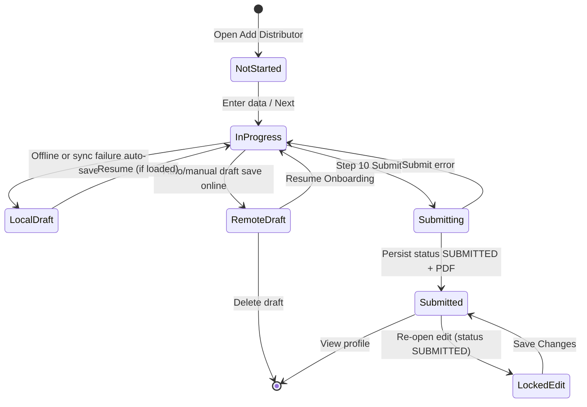

# Distributor Management, Onboarding, and Profile Business Rules

## 1. Scope

This document extracts technology-agnostic business, UX, security, and integrity rules for **Distributor** workflows in Field Commander version 1, for preservation in version 2.

### In scope

1. Distributor eligibility and module permissions
2. Ten-step distributor onboarding wizard (basic info → scoring → business → dealers → commitments → regulatory → documents → annexures → agreement → review/submit)
3. Draft save, resume, auto-save, and local offline fallback
4. Mobile-number duplicate/profile lookup and edit-lock behavior
5. Weighted scoring, grade bands, and dossier PDF generation
6. Distributor list/search/filter on the dashboard
7. Distributor entity profile view, edit entry, document viewing, and PDF share/download
8. Cross-module dealer linkage fields that reference distributors by free-text identity (not a system foreign key)
9. Media, GPS, signature, and permission-denied behavior tied to distributor onboarding
10. Shift activity logging after distributor draft save and submission

### Out of scope (except as consumers or references)

- Full dealer/farmer/FPO onboarding field catalogs (covered only where they link to or display distributors)
- Retail invoicing, inventory, expenses, attendance, travel distance algorithms
- FarmCard / FarmDiary workflows
- Backend row-level security policy definitions (not present in this repository)
- Version-2 architecture, stack, or schema design

### Version-2 boundary

This document states **what** the application must do. It does **not** prescribe frameworks, folders, databases, APIs, ORMs, state libraries, navigation libraries, media hosts, or offline engines for version 2. Version-1 technologies appear only as **evidence**.

### Workflows analyzed

| Workflow | Entry | Outcome |
| --- | --- | --- |
| Start onboarding | Dashboard “Add Distributor” / FAB when edit permission granted | Empty 10-step wizard |
| Resume draft | Dashboard distributor card “Resume Onboarding” | Wizard restored at saved step |
| Edit submitted profile | Dashboard card menu / Entity Profile “Edit Profile” | Wizard with submitted data; partial field lock when status is submitted |
| Mobile auto-load | Enter 10-digit contact mobile on Step 1 | Loads newest draft or submitted profile for that mobile |
| Submit / save changes | Step 10 submit | Persisted submitted distributor record + PDF dossier reference; draft deleted |
| View profile | Dashboard “View Profile” | Read-only profile overview |
| Delete draft | Draft card delete control | Removes remote draft for that entity id |

---

## 2. Distributor Repository Evidence Map

### Screens and components

| File | Why it matters |
| --- | --- |
| `Frontend/src/modules/onboarding/distributor/screens/DistributorOnboardingScreen.tsx` | Wizard shell, step routing, footer actions, success screen, language toggle, back handling |
| `Frontend/src/modules/onboarding/distributor/screens/steps/Step1BasicInfo.tsx` | Identity, address cascade, tax IDs, bank accounts, lock UI |
| `Frontend/src/modules/onboarding/distributor/screens/steps/Step2Scoring.tsx` | Score aspects, guidance tables, remarks, audio |
| `Frontend/src/modules/onboarding/distributor/screens/steps/Step3Business.tsx` | Territory, turnover, suppliers, proposed status, infra |
| `Frontend/src/modules/onboarding/distributor/screens/steps/Step4Dealers.tsx` | Dealer list upload vs manual dealer rows |
| `Frontend/src/modules/onboarding/distributor/screens/steps/Step5Commitments.tsx` | GLS commitment checkboxes + lock |
| `Frontend/src/modules/onboarding/distributor/screens/steps/Step6Regulatory.tsx` | Compliance checklist + lock |
| `Frontend/src/modules/onboarding/distributor/screens/steps/Step7Documents.tsx` | Core docs, GPS photos, dynamic compliance uploads |
| `Frontend/src/modules/onboarding/distributor/screens/steps/Step8Annexures.tsx` | Annexures A–G, security deposit, payment proof |
| `Frontend/src/modules/onboarding/distributor/screens/steps/Step9Agreement.tsx` | Terms text, acceptance, dual signatures + lock |
| `Frontend/src/modules/onboarding/distributor/screens/steps/Step10Review.tsx` | Missing-field review, jump-to-edit |
| `Frontend/src/modules/dashboard/screens/DashboardScreen.tsx` | List, filters, permissions, navigation entry points |
| `Frontend/src/modules/dashboard/screens/EntityProfileScreen.tsx` | Distributor profile display and edit |
| `Frontend/src/modules/dashboard/screens/ProfileScreen.tsx` | Distributor count metric |
| `Frontend/src/design-system/components/EntityCard.tsx` | Card summary, draft/resume/view/edit/delete |
| `Frontend/src/design-system/components/FilterModal.tsx` | Distributor filter options |
| `Frontend/src/design-system/components/UploadTile.tsx` | Camera vs file upload UI |
| `Frontend/src/design-system/components/ScoreSlider.tsx` | Score range 1–10 |
| `Frontend/src/design-system/templates/Templates.tsx` (WizardFlowTemplate / FeedbackScreenTemplate) | Shared wizard chrome and success feedback |

### Hooks and forms

| File | Why it matters |
| --- | --- |
| `Frontend/src/modules/onboarding/distributor/hooks.ts` | Form defaults, draft CRUD, scoring, uploads, submit, locks, PDF, validation gate |

### Schemas and validation

| File | Why it matters |
| --- | --- |
| `Frontend/src/modules/onboarding/distributor/schema.ts` | Field contracts, commitment/compliance catalogs, Zod constraints |

### Services and APIs

| File | Why it matters |
| --- | --- |
| `Frontend/src/modules/onboarding/services/onboardingService.ts` | Persist/map distributor records; mobile lookup |
| `Frontend/src/modules/onboarding/services/cloudinaryService.ts` | Media upload producing retrievable URLs |
| `Frontend/src/modules/dashboard/services/dashboardService.ts` | Fetch distributors/drafts by owning user |

### Stores and state

| File | Why it matters |
| --- | --- |
| `Frontend/src/store/authStore.ts` | Authenticated user identity for ownership |
| `Frontend/src/store/draftStore.ts` | Local offline draft fallback typed `DISTRIBUTOR` |
| `Frontend/src/store/alertStore.ts` | User-facing alerts |
| `Frontend/src/store/shiftStore.ts` | Activity increment and shift timeline events |

### Navigation

| File | Why it matters |
| --- | --- |
| `Frontend/src/navigation/AppNavigator.tsx` | Registers `DistributorOnboarding` route inside authenticated stack |

### Core and shared utilities

| File | Why it matters |
| --- | --- |
| `Frontend/src/core/usePermissions.ts` | `mobile_distributor` view/edit permissions |
| `Frontend/src/core/permissions.ts` | Camera/media permission requests and fallbacks |
| `Frontend/src/core/OfflineSyncManager.tsx` | Location sync only — does not sync distributor drafts/media |
| `Frontend/src/core/i18n.ts` + `Frontend/locales/{en,hi,gu}.json` | Translation keys for distributor UI |
| `Frontend/src/core/imageCompressor.ts` | Documents shared compression pattern used by onboarding |

### Related modules

| File | Why it matters |
| --- | --- |
| `Frontend/src/modules/onboarding/dealer/screens/steps/Step3Business.tsx` | Free-text “linked distributor” capture on dealer onboarding |
| `Frontend/src/modules/onboarding/dealer/hooks.ts` / `schema.ts` | Dealer validation for linked distributor |
| `Frontend/src/modules/onboarding/dealer/screens/steps/Step8Agreement.tsx` | Agreement text referencing payment to linked distributor |
| `Frontend/src/modules/dashboard/screens/EntityProfileScreen.tsx` (dealer branch) | Displays linked distributors on dealer profiles |

---

## 3. Actors, Roles, Eligibility, and Permissions

### Actors

| Actor | Description | Evidence |
| --- | --- | --- |
| Authenticated field user | Must be signed in to reach onboarding/dashboard | Auth-gated navigator |
| Sales Executive (SE) | Default role with hardcoded `mobile_distributor` view+edit | `usePermissions.ts:51-57` |
| Territory Head / Super Admin | Treated as full module access | `usePermissions.ts:49-50` |
| Other named roles | Permissions from role → role_permissions mapping | `usePermissions.ts:60-76` |
| Distributor (business party) | Signs agreement; not an app login actor | Step 9 signature field |
| Sales Executive (signatory) | Co-signs agreement | Step 9 `seSignature` |

### Eligibility and access rules

| Topic | Finding |
| --- | --- |
| Who can start onboarding | Users with `mobile_distributor.can_edit` |
| Who can see distributors tab | Users with `mobile_distributor.can_view` |
| Must distributor already exist? | No — create path is empty form; update path uses existing id |
| One user, many distributors | Yes — list is owned by current user id (`se_id`) |
| Invitation / approval gate to open wizard | None found |
| Profile-completion gate to open wizard | None found for distributor module |
| Unauthorized behavior | Tab omitted / add actions disabled when permissions false |
| Inactive / rejected onboarding states | No dedicated inactive/rejected statuses found |

---

## 4. Distributor Entities and Data Contracts

### Primary entities

| Entity | Purpose | Key fields (logical) |
| --- | --- | --- |
| Distributor record | Submitted/editable onboarding result | Firm/owner/contact/address/tax/bank; scoring; business_scope; dealer_network; commitments; documents; annexures; total_score; band; status; pdf reference; signatures; ownership user id; update history |
| Distributor draft | Incomplete onboarding | entity type distributor; entity id; draft payload; current step; ownership user id; update history |
| Local draft fallback | Offline/crash copy | Same payload + `_step`; type `DISTRIBUTOR` |

### Status values evidenced

| Status | Where stored | Meaning in v1 |
| --- | --- | --- |
| Draft / Incomplete | Draft store / drafts collection | Not submitted; resumeable |
| `SUBMITTED` | Distributor record `status` | Finalized submission; UI badge labels this “Approved” |
| `DRAFT` | Allowed argument to save function | Not used by distributor submit path (submit always passes `SUBMITTED`) |
| Pending (UI only) | Entity card when `status !== 'SUBMITTED'` | Display label only |

**Not evidenced:** separate `APPROVED`, `REJECTED`, `REQUIRES_CORRECTION`, `ARCHIVED` workflow states for distributors.

### Ownership and relationships

- Distributor records are owned by the authenticated field user’s id (`se_id`).
- Dashboard fetches only records for the current user.
- Dealer “linked distributor” is free-text name + contact stored on the dealer record — **not** a foreign key to a distributor id.
- Step 4 “top dealers” are free-text rows or an uploaded list — **not** selections from the dealers entity collection.

### Transformations (behavioral)

- GST/PAN/IFSC forced to uppercase in UI; email forced lowercase.
- Dealer turnover amount + unit concatenated on save (`"{amount} {unit}"`); split back on load.
- `"Others"` supplier token stripped before persistence.
- Security deposit defaults to `"0"` on save if empty.
- Signatures stored as stroke JSON strings; PDF renders SVG paths from them.
- Compliance checklist item labels slugified to document keys.

---

## 5. Complete Onboarding Workflow

### Step order (fixed)

1. Basic Information  
2. Profiling & Scoring  
3. Onboarding & Appointment / Business Scope  
4. Dealer Network  
5. GLS Commitments  
6. Regulatory Compliance  
7. Documents & Photos  
8. SE Evaluation & Annexures  
9. Distributor Agreement  
10. Final Review & Submit  

Initial step: `1`, or route `initialStep` when resuming a draft.

### Navigation behavior

| Action | Behavior |
| --- | --- |
| Next | Always enabled (`isNextEnabled === true`); advances `step + 1` without validating current step |
| Back (header / hardware) | If jumped from review, returns to review; else previous step; on step 1 exits screen |
| Jump from review Edit | Sets `jumpBackTo = 10`, opens target step; footer becomes “Return to Review” |
| Save Draft | Visible only when not editing an existing submitted/fetched record; requires firm name + mobile |
| Submit / Save Changes | Only on step 10; runs multi-step completeness gate then schema validation then persistence |

### State machine (evidenced)



### Draft / resume / logout / restart

- Auto-save on app background/inactive and on wizard unmount (if not success).
- Draft requires dirty fields, firm name, mobile, and authenticated user.
- Successful online draft upsert removes matching local draft.
- Offline failure writes/updates local draft with `_step`.
- Resume passes `draftId`, `draftData`, `initialStep`.
- Mobile lookup can load newest draft or submitted profile for that mobile.
- After logout: local drafts remain device-persisted and tagged with user id; remote drafts remain server-side for that user. Re-auth required to open module.
- After submit success: draft row deleted; success screen shown; further auto-save suppressed.

### Submission prerequisites (enforced at submit)

Submit is blocked unless all of these completeness checks pass (plus schema validation):

1. Step 1 basic profile formats (PAN/GST/bank/pincode/mobile, etc.)
2. Step 3 business scope & infra
3. Step 4 dealer network list **or** valid manual dealers
4. Step 5 all 5 GLS commitments checked
5. Step 7 required documents + exterior storage GPS present
6. Step 8 annexures + growth vision + conditional payment proof
7. Step 9 agreement accepted + both signatures present

**Not gated at submit completeness list:** Step 2 scoring (defaults always present); Step 6 checklist completeness (empty allowed).

### Post-submit

- PDF dossier generated and uploaded; URL stored on record.
- Shift activity incremented; timeline event “Onboarded Distributor” or “Updated Distributor”.
- Success screen: Share PDF / Add Another / Go Home.
- Add Another resets form to step 1.

### Approval / rejection / resubmission

- No in-app approve/reject workflow found.
- Submitted records can be edited with field restrictions; re-save still uses status `SUBMITTED`.

---

## 6. Step 1 — Basic Information Rules

### Purpose

Capture distributor identity, contact, registered address, tax identifiers, firm type/year, and bank accounts. Mobile may auto-load an existing draft/profile.

### Fields

| Field | Required | Format / values | Notes |
| --- | --- | --- | --- |
| contactMobile | Yes | Exactly 10 digits | Triggers lookup after 600ms when length 10 |
| contactPerson | Yes | Min length 2 | Editable when locked |
| contactDesignation | Yes (schema) | Min length 2 | Editable when locked; **missing from submit completeness Step1 check** |
| email | Optional | Email or empty | Lowercased |
| firmName | Yes | Min 2 | Locked when submitted |
| ownerName | Yes | Min 2 | Locked when submitted |
| address | Yes | Min 5 | Locked |
| state | Yes | From Indian states list | Changing clears district/taluka; locked |
| city (District) | Yes | From location tree | Options depend on fetched tree; locked |
| taluka | Yes | From location tree | Locked |
| pincode | Yes | Exactly 6 digits | Locked |
| gstNumber | Yes | Indian GST regex | Uppercased; locked |
| panNumber | Yes | Indian PAN regex | Uppercased; locked |
| estYear | Yes | Year picker, min length 4 | Locked |
| firmType | Yes | Proprietorship / Partnership / Pvt Ltd / Other | Locked |
| bankAccounts[] | ≥1 | accountName, bankNameBranch, accountNumber 9–18 digits, IFSC regex | Always editable; Active toggle only in edit mode; remove allowed for index>0 when not editing |

### Conditional / UX

- When `isLocked` (submitted): firm/owner/address/tax/year/type are non-interactive (opacity 0.5). Contact + banks remain interactive.
- District/taluka lists load from a Gujarat location tree RPC whenever a state is selected (tree is not state-specific in code).
- Loading label: “District (Loading...) *”.
- “Add Another Bank Account” always available.

### Defaults

One bank account row with `isActive: true` and empty fields.

---

## 7. Step 2 — Scoring and Assessment Rules

### Purpose

Sales executive scores the distributor on eight weighted aspects (1–10), optional remarks/audio, optional red flags.

### Aspects and UI weights (labels)

| Aspect key | Label weight | Runtime multiplier |
| --- | --- | --- |
| scoreFinancial | 15% | 1.5 |
| scoreReputation | 15% | 1.5 |
| scoreOperations | 10% | 1.0 |
| scoreDealerNetwork | 15% | 1.5 |
| scoreTeam | 10% | 1.0 |
| scorePortfolio | 10% | 1.0 |
| scoreExperience | 15% | 1.5 |
| scoreGrowth | 10% | 1.0 |

### Exact score formula

```
raw = round(
  scoreFinancial * 1.5
+ scoreReputation * 1.5
+ scoreOperations * 1.0
+ scoreDealerNetwork * 1.5
+ scoreTeam * 1.0
+ scorePortfolio * 1.0
+ scoreExperience * 1.5
+ scoreGrowth * 1.0
)
```

Missing values treated as `5` in the formula. Slider range: integer 1–10 inclusive. Defaults: all scores `5`. Theoretical max with all 10s: **100**.

### Grade bands (onboarding / PDF)

| Condition | Band |
| --- | --- |
| raw ≥ 85 | Grade A+ (Platinum) |
| raw ≥ 65 | Grade A (Strategic) |
| raw ≥ 45 | Grade B (Operational) |
| else | Grade C (High Risk) |

### Guidance tables

UI shows dynamic interpretive rows based on score buckets (≤2, ≤4, ≤6, ≤8, else) per aspect — advisory only; does not auto-set score.

### Optional fields

`rem*`, `audio*`, `redFlags`, `audioRedFlags` — optional. Audio uploads require network; failure shows “Audio upload failed.”

### Score-dependent approval

None. Low scores do not block submit.

### Editability after submission

Scoring fields are in the allowed-edit list when locked.

### Dashboard card category contradiction

Entity cards derive display category with thresholds **≥70 A / ≥50 B / else C**, which differs from onboarding bands. See consistency audit.

---

## 8. Step 3 — Business Information Rules

### Purpose

Define applied territory, commercial potential, suppliers, proposed appointment status, dealer activation target, and storage infrastructure.

### Fields

| Field | Required | Values / rules |
| --- | --- | --- |
| appliedTerritory | ≥1 district | Multi-select from location tree districts; empty until state chosen in Step 1 |
| turnoverPotential | Yes | Numeric string; prefix ₹ |
| turnoverPotentialUnit | Optional UI; default `Cr` | `Lacs` or `Cr` |
| currentSuppliers | ≥1; each name min 2 | Multi-select majors + optional custom “Others” rows |
| proposedStatus | Yes | `Authorised Distributor` or `Exclusive Focus Area` |
| demoFarmersCommitment | Yes | Numeric string (label: dealers to activate with 5–10 demo farmers each) |
| godownCapacity | Yes | Numeric string; suffix Sq.ft |
| coldChainFacility | Yes | `Yes` or `No` (enum) |

### Major suppliers catalog

Bayer, Syngenta, UPL, Corteva, FMC, PI Industries, Coromandel, IFFCO, Others.

### Conditional UI

- If custom suppliers present (or Others selected): show “Specify Other Suppliers” inputs; can add/remove; removing last custom collapses Others.
- `"Others"` token is not persisted; only custom names + majors are saved.

---

## 9. Step 4 — Dealer Relationship Rules

### Purpose

Capture top dealer network either by uploading a list document **or** entering dealers manually (Annexure B source).

### Selection model

- **Not** a search of existing dealer records.
- Either:
  - Upload `documents.dealer_network_list`, **or**
  - Manual `topDealers[]` where every row has name ≥2, address ≥2, contact exactly 10 digits.

### Manual dealer fields

| Field | Required for manual path | Notes |
| --- | --- | --- |
| name | Yes | |
| contact | Yes | 10 digits |
| address | Yes | |
| turnover / turnoverUnit | Optional | Unit default `Lacs` |
| products | Optional | Tags array |
| farmersServed | Optional | |
| bioExperience | Optional | None / Limited / Moderate / Strong / Expert |

### Conditional UI

- If dealer list document uploaded: manual entry section **hidden**.
- First dealer row cannot be removed; additional rows can.
- Schema marks `topDealers` optional; runtime submit validation enforces either upload or complete manual rows.

### Relationship cardinality

Evidence supports **one distributor → many free-text dealer descriptions** (or one uploaded list). No system link enforcing dealer-distributor FK.

### Post-submission editability

`topDealers` and documents are allowed when locked.

---

## 10. Step 5 — Commitments Rules

### Purpose

Distributor must accept all five fixed GLS commitments.

### Commitment catalog (exact strings)

1. Clean 10% margin on Dealer Rate  
2. All dealer schemes & loyalty rewards 100% funded by GLS  
3. Two-tier model: GLS invoices distributor; GLS field team drives 60% retail  
4. Dedicated Field Executives for 150+ farmers  
5. Crop-specific packages, Farm Card + Calendar, Loyalty Program support  

### Rules

- Submit requires exactly 5 checked (all of them).
- Schema requires array (no min length in Zod); completeness gate enforces length === 5.
- Entire step is non-interactive when `isLocked` (submitted).

---

## 11. Step 6 — Regulatory and Compliance Rules

### Purpose

Mark which compliance documents the distributor currently has; selected items become required uploads in Step 7.

### Checklist catalog

1. Valid FCO Authorization / Fertilizer Dealer Registration  
2. Valid Insecticide Selling License (for biopesticides)  
3. Educational Qualification Certificate (if applicable)  
4. Storage Facility Photos & Suitability Confirmation  
5. GST Certificate  
6. Any state-specific approvals  

### Rules

- All items optional at Step 6 (empty checklist allowed).
- Checked items slugify to document keys and become required in Step 7 / submit gate.
- Step locked when submitted.
- No expiry-date fields or license-number fields in this step.
- No automatic block for missing compliance checklist itself.

---

## 12. Step 7 — Document Rules

### Always-required core documents

| Key | Label |
| --- | --- |
| gst_certificate | GST Registration Certificate |
| pan_card | PAN Card Copy |
| cancelled_cheque | Cancelled Cheque |
| trade_licence | Shop & Est. / Trade Licence |
| itr_declaration | Last 2 Years ITR / Turnover Declaration |
| authorisation_letter | Authorisation Letter from Owner |

### Always-required infrastructure photos

| Key | Rules |
| --- | --- |
| storage_exterior | Camera capture; GPS required; multi-photo array; GPS stored under storageLocations |
| storage_interior | Same; submit gate currently requires exterior GPS specifically |

### Conditional compliance uploads

For each checked Step 6 item, require document key = slug(item).

### Optional additional

| Key | Label |
| --- | --- |
| dealer_list | List of Current Dealers (optional; distinct from Step 4 `dealer_network_list`) |

### Media behavior

- UploadTile: Camera or Upload (file picker `*/*`).
- Docs > 5MB rejected with alert.
- Images resized width 1024, JPEG compress 0.6 before upload.
- Permission denied → alert with fallback message; no crash.
- GPS denied for storage photos → abort upload with “GPS Required”.
- Upload failure → “Upload failed.”
- Clear/remove supported; clearing last storage photo also clears GPS.

---

## 13. Step 8 — Annexure Rules

### Annexure A — Territory coverage (required ≥1 region)

Per region: state, district, taluka, villages ≥1, cultivableArea, majorCrops ≥1. Cascading location lists; crops from West India crop list. Add/remove regions (first not removable).

### Annexure B — Top dealers (read-only summary)

Shows uploaded list confirmation, or up to 3 manual dealers, or danger “No dealers recorded”. Edit jumps to Step 4.

### Annexure C — Principal companies & products

- Principal suppliers ≥1: name + % share  
- Chemical products ≥1 (multi-select catalog)  
- Bio products ≥1 (multi-select catalog)  
- Other products ≥1 (tags)

### Annexure D — Infrastructure (read-only)

Shows godownCapacity and coldChainFacility from Step 3; Edit jumps to Step 3.

### Annexure E — Credit references

≥1 supplier reference: name ≥2, contact 10 digits; optional behavior text or audio. UI copy suggests 2–3; validation requires ≥1.

### Annexure F & G — Sales & vision

- `anxWillShareSales` checkbox (boolean; not required to be true)
- Growth vision: text **or** audio required

### Section E — Security deposit

- Optional amount  
- If amount > 0: require paymentProofText **or** `documents.distributor_payment_proof`

---

## 14. Step 9 — Agreement and Consent Rules

### Purpose

Present filled annexure summary + Terms & Conditions; require acceptance and dual signatures.

### Mandatory

- `agreementAccepted === true`
- `distributorSignature` min length 10 (stroke JSON)
- `seSignature` min length 10

### Terms content (behavioral)

Hardcoded clauses covering territory, exclusivity/focus, payment terms (advance/LC; credit; 1.5%/month interest), security deposit (dynamic amount/proof), stock & off-take, logistics, GLS support, distributor obligations, legal compliance (FCO 1985, Insecticides Act 1968, GST), data sharing/DPDP, termination (60 days), jurisdiction Vadodara Gujarat.

### Lock

Entire step non-interactive when submitted (`isLocked`), including unchecking agreement / resigning — but signatures remain in allowed-edit list for save restrictions (UI lock conflicts with allowed-edit list; see audit).

### Reversibility

Before submit: user can uncheck acceptance. After submitted lock: UI prevents interaction.

---

## 15. Step 10 — Final Review and Submission Rules

### Purpose

Summarize all sections with red “Missing” markers; provide Edit jumps; submit.

### Sections shown

1 Basic Info (+ banks)  
2 Score summary  
3 Business Scope  
4 Dealer Network  
5 & 6 Commitments (compliance checklist details not fully summarized beyond commitments)  
7 Documents required list  
8 Annexures  
9 Agreement & signatures  

### Submit button

- Label: “Submit Profile” (create) or “Save Changes” (edit)
- Loading while submitting
- Double-tap prevented via lock ref
- On missing completeness: alert listing failing section names
- On restricted dirty fields: “Restricted Action”
- On success: success feedback screen

### No separate confirmation modal

Submit runs immediately after gates.

---

## Named Rule Catalog (Technology-Neutral)

*(Stable `DIST-*` IDs for cross-reference. Complements step sections above and §28 below.)*

### DIST-ACT-001 — Authentication required

- Rule: Distributor onboarding, drafts, lists, and profiles are available only to authenticated users.
- Business purpose: Bind ownership and prevent anonymous writes.
- Trigger/condition: User opens distributor features.
- Behavior/result: Unauthenticated users cannot reach the route stack that hosts distributor screens.
- Actor/role: Any user.
- Affected workflow: All distributor flows.
- UX behavior: Auth screens instead of app shell.
- Validation/error behavior: N/A.
- Online/offline behavior: Auth session restoration still required.
- Enforcement requirement: Gate distributor features behind authenticated session.
- Dependencies: Auth module.
- Original implementation evidence:
  - `Frontend/src/navigation/AppNavigator.tsx:165` — `DistributorOnboarding` inside authenticated stack
- Confidence: High

### DIST-ACT-002 — Module view permission

- Rule: Users without distributor view permission must not see the Distributors collection tab or load distributor lists.
- Business purpose: Role-based access control.
- Trigger/condition: `mobile_distributor.can_view` is false.
- Behavior/result: Tab omitted; fetch skipped.
- Actor/role: Authenticated user.
- Affected workflow: Dashboard.
- UX behavior: Tab hidden.
- Validation/error behavior: N/A.
- Online/offline behavior: Same.
- Enforcement requirement: Permission check before list presentation/fetch.
- Dependencies: Permission catalog.
- Original implementation evidence:
  - `Frontend/src/modules/dashboard/screens/DashboardScreen.tsx:45,179,550-569` — `distPerm.can_view`
  - `Frontend/src/core/usePermissions.ts:56` — SE default module
- Confidence: High

### DIST-ACT-003 — Module edit permission for create entry

- Rule: Users without distributor edit permission must not see or use “Add Distributor” actions.
- Business purpose: Prevent unauthorized onboarding.
- Trigger/condition: `mobile_distributor.can_edit` is false.
- Behavior/result: FAB/tab add actions disabled or omitted.
- Actor/role: Authenticated user.
- Affected workflow: Dashboard entry.
- UX behavior: Add controls hidden/disabled.
- Validation/error behavior: N/A.
- Online/offline behavior: Same.
- Enforcement requirement: Permission check on create entry points.
- Dependencies: Permission catalog.
- Original implementation evidence:
  - `Frontend/src/modules/dashboard/screens/DashboardScreen.tsx:585,1015-1032,1049-1051`
- Confidence: High

### DIST-ACT-004 — Ownership isolation of lists

- Rule: Users must only retrieve distributor records and drafts they own (bound to their user id).
- Business purpose: Data isolation among field staff.
- Trigger/condition: List/fetch distributors or drafts.
- Behavior/result: Queries filtered by owning user id.
- Actor/role: Field user.
- Affected workflow: Dashboard, profile counts.
- UX behavior: Only own entities appear.
- Validation/error behavior: Fetch errors surface as load failures.
- Online/offline behavior: Online fetch; local drafts tagged with user id.
- Enforcement requirement: Server-side isolation must match client filter; client must always scope by current user.
- Dependencies: Auth user id.
- Original implementation evidence:
  - `Frontend/src/modules/dashboard/services/dashboardService.ts:72-83,87-95`
- Confidence: High (client filter); Medium (server RLS assumed, not in-repo)

### DIST-WF-001 — Ten-step ordered wizard

- Rule: Distributor onboarding must present exactly ten sequential steps in the documented order.
- Business purpose: Complete dossier capture.
- Trigger/condition: Open onboarding.
- Behavior/result: Step indicator “STEP N OF 10”; progress N/10.
- Actor/role: Field user with edit access.
- Affected workflow: Onboarding.
- UX behavior: Wizard template with language toggle.
- Validation/error behavior: Step advance unrestricted; submit validates globally.
- Online/offline behavior: Works offline for form entry; uploads/submit need network.
- Enforcement requirement: Preserve step order and coverage.
- Dependencies: None.
- Original implementation evidence:
  - `Frontend/src/modules/onboarding/distributor/screens/DistributorOnboardingScreen.tsx:75-98`
- Confidence: High

### DIST-WF-002 — Next without per-step validation

- Rule: Moving to the next step must be allowed even if the current step is incomplete; completeness is enforced at final submit.
- Business purpose: Flexible data collection in the field.
- Trigger/condition: User taps Next.
- Behavior/result: Step increments; incomplete fields remain for later.
- Actor/role: Field user.
- Affected workflow: Steps 1–9.
- UX behavior: Next never disabled by validation.
- Validation/error behavior: Errors shown inline via form mode onChange, but do not block Next.
- Online/offline behavior: Same.
- Enforcement requirement: Do not require step-complete to advance unless product later changes; preserve submit-time gate.
- Dependencies: Submit gate.
- Original implementation evidence:
  - `Frontend/src/modules/onboarding/distributor/hooks.ts:311` — `isNextEnabled = true`
  - `Frontend/src/modules/onboarding/distributor/screens/DistributorOnboardingScreen.tsx:121-122`
- Confidence: High

### DIST-WF-003 — Draft save prerequisites

- Rule: Manual draft save requires firm name and 10-digit-capable contact mobile (non-empty firm + mobile present); otherwise alert and do not save.
- Business purpose: Identifiable drafts.
- Trigger/condition: Save Draft / Save & Exit.
- Behavior/result: Alert if missing; else persist and return home.
- Actor/role: Field user (create/draft path only).
- Affected workflow: Drafting.
- UX behavior: “Cannot Save” alert.
- Validation/error behavior: Message requires Firm Name and Mobile Number.
- Online/offline behavior: Online upsert preferred; offline local fallback.
- Enforcement requirement: Same prerequisites.
- Dependencies: Auth user.
- Original implementation evidence:
  - `Frontend/src/modules/onboarding/distributor/hooks.ts:227-257`
- Confidence: High

### DIST-WF-004 — Hide draft button when editing completed profile

- Rule: Save Draft must not appear when editing an already-fetched/submitted distributor.
- Business purpose: Prevent draft duplication of completed profiles.
- Trigger/condition: `isEditing` true.
- Behavior/result: Only Next / Save Changes footer.
- Actor/role: Field user.
- Affected workflow: Edit.
- UX behavior: Draft button omitted.
- Validation/error behavior: Manual draft attempt on fetched id alerts “profile is already complete”.
- Online/offline behavior: N/A.
- Enforcement requirement: Preserve.
- Dependencies: Edit detection.
- Original implementation evidence:
  - `Frontend/src/modules/onboarding/distributor/screens/DistributorOnboardingScreen.tsx:113`
  - `Frontend/src/modules/onboarding/distributor/hooks.ts:146-148,232-234`
- Confidence: High

### DIST-WF-005 — Auto-save drafts on background/unmount

- Rule: Partially completed forms must be restorable after the user leaves and returns, via automatic draft persistence when the app backgrounds or the wizard unmounts (unless success already shown).
- Business purpose: Prevent data loss.
- Trigger/condition: App inactive/background or screen cleanup; dirty fields present; not editing completed; firm+mobile+user present.
- Behavior/result: Draft upserted remotely or locally.
- Actor/role: Field user.
- Affected workflow: Drafting.
- UX behavior: Silent.
- Validation/error behavior: Console/local fallback on remote failure.
- Online/offline behavior: Remote first; local fallback.
- Enforcement requirement: Equivalent durable draft behavior.
- Dependencies: Draft storage.
- Original implementation evidence:
  - `Frontend/src/modules/onboarding/distributor/hooks.ts:139-205`
- Confidence: High

### DIST-WF-006 — Resume draft at saved step

- Rule: Resuming a draft must restore form values and open at the saved current step.
- Business purpose: Continuity.
- Trigger/condition: Resume Onboarding from dashboard draft card.
- Behavior/result: Wizard opens with draft payload and `initialStep`.
- Actor/role: Owner user.
- Affected workflow: Draft resume.
- UX behavior: “Resume Onboarding”.
- Validation/error behavior: N/A.
- Online/offline behavior: Uses remote draft payload from dashboard load.
- Enforcement requirement: Persist and restore step index + payload.
- Dependencies: Dashboard draft mapping.
- Original implementation evidence:
  - `Frontend/src/design-system/components/EntityCard.tsx:314-317`
  - `Frontend/src/modules/onboarding/distributor/hooks.ts:29-33`
- Confidence: High

### DIST-WF-007 — Mobile duplicate/profile auto-load

- Rule: When a 10-digit mobile is entered on a new onboarding (no edit/draft params), the system must look up the newest matching distributor draft then submitted record and load it, alerting the user.
- Business purpose: Avoid duplicate profiles; continue existing work.
- Trigger/condition: `contactMobile.length === 10` and not edit/draft route.
- Behavior/result: Reset form from draft or mapped DB; may lock if submitted; may set draft id / fetched id.
- Actor/role: Field user.
- Affected workflow: Step 1.
- UX behavior: “Profile Found” alert; fetching state.
- Validation/error behavior: Lookup failures logged; form continues.
- Online/offline behavior: Requires network for lookup.
- Enforcement requirement: Prefer newest draft over submitted; then submitted.
- Dependencies: Mobile uniqueness assumption (newest-wins).
- Original implementation evidence:
  - `Frontend/src/modules/onboarding/distributor/hooks.ts:108-137`
  - `Frontend/src/modules/onboarding/services/onboardingService.ts:651-677`
- Confidence: High

### DIST-WF-008 — Submitted field lock

- Rule: When a loaded distributor status is `SUBMITTED`, identity/tax/firm-core fields, GLS commitments, compliance checklist, and agreement UI must be read-only/non-interactive; contact, banks, scoring, business scope, dealers, annexures, documents, and signatures remain editable for updates.
- Business purpose: Protect core identity while allowing operational updates.
- Trigger/condition: `status === 'SUBMITTED'` → `isLocked`.
- Behavior/result: Locked sections use pointerEvents none + reduced opacity; save rejects dirty locked fields.
- Actor/role: Field user editing.
- Affected workflow: Edit submitted.
- UX behavior: Dimmed locked fields.
- Validation/error behavior: Alert listing unauthorized edit domains.
- Online/offline behavior: Same.
- Enforcement requirement: Enforce both UI and submit-time dirty-field allowlist.
- Dependencies: Status field.
- Original implementation evidence:
  - `Frontend/src/modules/onboarding/distributor/hooks.ts:106,212-223`
  - `Frontend/src/modules/onboarding/distributor/screens/steps/Step1BasicInfo.tsx:98`
  - `Frontend/src/modules/onboarding/distributor/screens/steps/Step5Commitments.tsx:18`
  - `Frontend/src/modules/onboarding/distributor/screens/steps/Step6Regulatory.tsx:18`
  - `Frontend/src/modules/onboarding/distributor/screens/steps/Step9Agreement.tsx:27`
- Confidence: High

### DIST-WF-009 — Submit completeness gate

- Rule: Final submission must be refused until all completeness sections pass and schema validation passes; show the list of failing sections.
- Business purpose: Ensure dossier completeness.
- Trigger/condition: Submit / Save Changes on step 10.
- Behavior/result: Alert “Missing Information” with bullet list, or proceed.
- Actor/role: Field user.
- Affected workflow: Submit.
- UX behavior: Blocking alert.
- Validation/error behavior: See Validation Matrix.
- Online/offline behavior: Submit requires network for PDF upload + persistence.
- Enforcement requirement: Dual gate (business completeness + schema).
- Dependencies: Media URLs already obtained.
- Original implementation evidence:
  - `Frontend/src/modules/onboarding/distributor/hooks.ts:263-308,645-707`
- Confidence: High

### DIST-WF-010 — Duplicate submit prevention

- Rule: Concurrent/double submit taps must not create duplicate submissions.
- Business purpose: Integrity.
- Trigger/condition: Rapid repeated Submit.
- Behavior/result: Second call ignored while locked.
- Actor/role: Field user.
- Affected workflow: Submit.
- UX behavior: Button loading.
- Validation/error behavior: N/A.
- Online/offline behavior: Same.
- Enforcement requirement: Client-side re-entrancy lock at minimum.
- Dependencies: None.
- Original implementation evidence:
  - `Frontend/src/modules/onboarding/distributor/hooks.ts:642-661,704`
- Confidence: High

### DIST-WF-011 — PDF dossier required on submit

- Rule: Before final persistence, a PDF dossier summarizing the profile must be generated, uploaded, and stored as a retrievable reference on the distributor record.
- Business purpose: Shareable onboarding evidence.
- Trigger/condition: Successful submit path.
- Behavior/result: Processing alerts; pdf URL saved; shareable after success.
- Actor/role: Field user.
- Affected workflow: Submit + success + profile PDF actions.
- UX behavior: “Generating and securing PDF dossier...” then success Share PDF.
- Validation/error behavior: Failure aborts submit with message.
- Online/offline behavior: Requires network.
- Enforcement requirement: Persist retrievable dossier reference with submission.
- Dependencies: Print/share capabilities; media upload.
- Original implementation evidence:
  - `Frontend/src/modules/onboarding/distributor/hooks.ts:665-673`
  - `Frontend/src/modules/onboarding/services/onboardingService.ts:496`
- Confidence: High

### DIST-WF-012 — Delete draft after successful submit

- Rule: After successful submission, the corresponding draft must be removed so it no longer appears as incomplete.
- Business purpose: Avoid duplicate draft/completed cards.
- Trigger/condition: Submit success with draft id.
- Behavior/result: Draft deleted.
- Actor/role: System.
- Affected workflow: Submit.
- UX behavior: Draft disappears from list after refresh.
- Validation/error behavior: N/A.
- Online/offline behavior: Remote delete.
- Enforcement requirement: Clear draft on success.
- Dependencies: Draft id.
- Original implementation evidence:
  - `Frontend/src/modules/onboarding/distributor/hooks.ts:691-695`
- Confidence: High

### DIST-WF-013 — Success continuation options

- Rule: After successful create/update, user must be offered share dossier, start another distributor, or return home.
- Business purpose: Field productivity.
- Trigger/condition: `showSuccess`.
- Behavior/result: Feedback screen with three actions.
- Actor/role: Field user.
- Affected workflow: Post-submit.
- UX behavior: Titles differ for create vs update.
- Validation/error behavior: N/A.
- Online/offline behavior: Share needs capability/network.
- Enforcement requirement: Preserve outcomes.
- Dependencies: PDF generator.
- Original implementation evidence:
  - `Frontend/src/modules/onboarding/distributor/screens/DistributorOnboardingScreen.tsx:50-72`
- Confidence: High

### DIST-SCR-001 — Weighted score and bands

- Rule: Overall score and grade band must be computed with the exact weighted formula and thresholds documented in §7 and persisted with the record.
- Business purpose: Risk/partner grading.
- Trigger/condition: Any score change; submit.
- Behavior/result: Display raw/100 and band; store `total_score` and `band`.
- Actor/role: Field user.
- Affected workflow: Step 2, review, PDF, profile.
- UX behavior: Live badge.
- Validation/error behavior: Scores clamped 1–10 by control/schema.
- Online/offline behavior: Local calculation.
- Enforcement requirement: Preserve formula and thresholds for onboarding grade.
- Dependencies: Eight aspect scores.
- Original implementation evidence:
  - `Frontend/src/modules/onboarding/distributor/hooks.ts:313-322,673`
- Confidence: High

### DIST-DLR-001 — Dealer network OR upload

- Rule: Dealer network requirement is satisfied by either an uploaded dealer-network list document or a complete set of manual dealer rows; not by linking existing dealer entities.
- Business purpose: Capture network evidence flexibly.
- Trigger/condition: Submit completeness Step 4.
- Behavior/result: Pass if either path valid.
- Actor/role: Field user.
- Affected workflow: Steps 4/8/10.
- UX behavior: Manual UI hidden when upload present.
- Validation/error behavior: Review shows missing message.
- Online/offline behavior: Upload needs network.
- Enforcement requirement: Preserve alternative satisfaction paths.
- Dependencies: Documents map.
- Original implementation evidence:
  - `Frontend/src/modules/onboarding/distributor/hooks.ts:277-279`
  - `Frontend/src/modules/onboarding/distributor/screens/steps/Step4Dealers.tsx:23-53`
- Confidence: High

### DIST-COM-001 — All five GLS commitments required

- Rule: Submission requires acceptance of all five catalog commitments.
- Business purpose: Commercial terms acknowledgment.
- Trigger/condition: Submit.
- Behavior/result: Fail if checked count ≠ 5.
- Actor/role: Field user / distributor party (via SE capture).
- Affected workflow: Steps 5/10.
- UX behavior: Checkboxes; locked after submit.
- Validation/error behavior: Missing commitments highlighted.
- Online/offline behavior: Same.
- Enforcement requirement: Exact five strings must be accepted.
- Dependencies: Commitment catalog.
- Original implementation evidence:
  - `Frontend/src/modules/onboarding/distributor/schema.ts:3-9`
  - `Frontend/src/modules/onboarding/distributor/hooks.ts:281`
- Confidence: High

### DIST-DOC-001 — Required media before submit

- Rule: Required documents and storage photos must be successfully uploaded and represented by retrievable references before final submission; storage exterior GPS coordinates must be present.
- Business purpose: Compliance and geo-verified storage.
- Trigger/condition: Submit Step 7 gate.
- Behavior/result: Fail if any required key missing or exterior GPS missing.
- Actor/role: Field user.
- Affected workflow: Steps 6–7, 10.
- UX behavior: Upload tiles; GPS badge/warning.
- Validation/error behavior: Missing keys listed in review.
- Online/offline behavior: Upload requires network; denied permissions block capture.
- Enforcement requirement: No final submit with missing required media references.
- Dependencies: Device permissions; media service.
- Original implementation evidence:
  - `Frontend/src/modules/onboarding/distributor/hooks.ts:283-287,336-408`
- Confidence: High

### DIST-AGR-001 — Agreement acceptance and dual signatures

- Rule: Submission requires explicit terms acceptance plus distributor and sales-executive signatures.
- Business purpose: Legal evidence of appointment terms.
- Trigger/condition: Submit Step 9 gate + schema refine.
- Behavior/result: Block if any missing.
- Actor/role: Distributor + SE.
- Affected workflow: Steps 9–10.
- UX behavior: Checkbox + signature pads.
- Validation/error behavior: Schema message “You must accept the terms to proceed”; review Missing markers.
- Online/offline behavior: Local capture; submit online.
- Enforcement requirement: Preserve mandatory consent + dual sign.
- Dependencies: Signature component.
- Original implementation evidence:
  - `Frontend/src/modules/onboarding/distributor/schema.ts:130-132`
  - `Frontend/src/modules/onboarding/distributor/hooks.ts:298`
- Confidence: High

### DIST-PRF-001 — Profile view of submitted distributor

- Rule: Submitted distributors must be viewable in a profile overview showing identity, banks, scoring, business scope, dealers, annexures, commitments, compliance, documents, signatures, and PDF actions.
- Business purpose: Review and sharing.
- Trigger/condition: View Profile from card.
- Behavior/result: Entity profile distributor branch rendered.
- Actor/role: Owning user (and any role that can open the card).
- Affected workflow: Profile.
- UX behavior: Sections + document open/download/share.
- Validation/error behavior: Missing PDF alerts “Not Found”.
- Online/offline behavior: Document open/download needs network.
- Enforcement requirement: Preserve read model content.
- Dependencies: Persisted distributor record.
- Original implementation evidence:
  - `Frontend/src/modules/dashboard/screens/EntityProfileScreen.tsx:538-660,795-896`
- Confidence: High

### DIST-DASH-001 — List, search, filter, sort

- Rule: Distributors tab must merge active drafts and submitted records; support search (name/city/state/contact person/mobile), filters (completion, grade band, proposed status, cold chain), and sort (newest / score high / score low).
- Business purpose: Network management.
- Trigger/condition: Dashboard Distributors tab.
- Behavior/result: Filtered sorted list.
- Actor/role: View-permitted user.
- Affected workflow: Dashboard.
- UX behavior: Empty state, draft badges, score display.
- Validation/error behavior: N/A.
- Online/offline behavior: List from last successful fetch; drafts from remote drafts fetch.
- Enforcement requirement: Preserve merge semantics (hide draft if same mobile already submitted).
- Dependencies: Permissions.
- Original implementation evidence:
  - `Frontend/src/modules/dashboard/screens/DashboardScreen.tsx:280-307`
  - `Frontend/src/design-system/components/FilterModal.tsx:316-347`
- Confidence: High

### DIST-XMOD-001 — Dealer free-text distributor link

- Rule: Dealer onboarding may optionally record a linked distributor as free-text name + 10-digit contact when linkage = Yes; this does not create or require a distributor record id.
- Business purpose: Capture commercial linkage without FK integrity.
- Trigger/condition: Dealer Step 3 linkage Yes.
- Behavior/result: Fields required; stored on dealer record; shown on dealer profile.
- Actor/role: Field user onboarding dealers.
- Affected workflow: Dealer onboarding/profile.
- UX behavior: Conditional inputs.
- Validation/error behavior: Missing distributor details blocks dealer submit path.
- Online/offline behavior: Same as dealer module.
- Enforcement requirement: Preserve optional free-text linkage semantics (not system join).
- Dependencies: Dealer module.
- Original implementation evidence:
  - `Frontend/src/modules/onboarding/dealer/screens/steps/Step3Business.tsx:151-155`
  - `Frontend/src/modules/dashboard/screens/EntityProfileScreen.tsx:467-468`
- Confidence: High

### DIST-I18N-001 — Language cycling in wizard

- Rule: Distributor onboarding must support cycling UI language among English, Hindi, and Gujarati via header control; strings use translation keys with English fallbacks.
- Business purpose: Field language accessibility.
- Trigger/condition: Language chip press.
- Behavior/result: `en → hi → gu → en`.
- Actor/role: Field user.
- Affected workflow: Onboarding.
- UX behavior: Language code chip.
- Validation/error behavior: N/A.
- Online/offline behavior: Local.
- Enforcement requirement: Preserve multilingual presentation for distributor strings present in locale files.
- Dependencies: i18n catalogs.
- Original implementation evidence:
  - `Frontend/src/modules/onboarding/distributor/screens/DistributorOnboardingScreen.tsx:24-27,96-99`
- Confidence: High

### DIST-SHIFT-001 — Activity logging on draft/submit

- Rule: Successful manual draft save and successful submit/update must increment shift activity and log a shift timeline event describing location (route name if available + taluka/city).
- Business purpose: Attendance/productivity linkage.
- Trigger/condition: saveAndExit success; submit success.
- Behavior/result: Activity + event recorded.
- Actor/role: Field user on active shift context when available.
- Affected workflow: Draft/submit.
- UX behavior: Silent.
- Validation/error behavior: Dependent on shift store behavior.
- Online/offline behavior: Uses online shift/route lookups when possible.
- Enforcement requirement: Preserve cross-module activity side effects.
- Dependencies: Shift module.
- Original implementation evidence:
  - `Frontend/src/modules/onboarding/distributor/hooks.ts:241-255,675-689`
- Confidence: High

---

## 16. Distributor Profile Screen Rules

### Entry points

| Entry | Condition | Target |
| --- | --- | --- |
| EntityCard “View Profile” | Not draft | `EntityProfile` with entity |
| EntityCard menu “Edit Profile” | Not draft | `DistributorOnboarding` with `editData` |
| Profile menu “Edit Profile” | On profile | Same edit navigation |
| Generate PDF Dossier button | `pdf_url` missing | Opens edit onboarding |

### Visibility by role

No extra role filter inside profile screen; access is via dashboard ownership/permission path.

### Displayed distributor data

Business profile, banks, scoring (+ red flags/audio), business scope & targets, top dealers, commercial annexures, commitments, compliance checklist, uploaded documents directory, signature status, PDF download/share.

### Differences

| Concern | Source |
| --- | --- |
| Onboarding data | Wizard form / drafts |
| Profile data | Submitted distributor record columns/JSON |
| Approval data | UI treats `SUBMITTED` as “Approved”; no separate approval entity |
| Dealer-related data | Free-text `dealer_network` or upload; not live dealer entities |
| Operational data | Not linked to retail/inventory from this screen |

### Actions

Edit; view/open documents; download/share PDF; refresh (cosmetic timeout only — does not re-fetch).

### Missing / loading / error

- Empty banks/docs show italic empty text.
- Refresh sets refreshing true for 600ms without network reload.
- Download/share errors alert user.

---

## 17. Distributor Status and State Transitions

| From | To | Actor | Allowed? |
| --- | --- | --- | --- |
| Not started | In progress | Field user | Yes |
| In progress | Remote/local draft | Field user / system | Yes |
| Draft | In progress (resume) | Owner | Yes |
| Draft | Deleted | Owner | Yes |
| In progress | Submitted (`SUBMITTED`) | Field user | Yes, if gates pass |
| Submitted | Submitted (update) | Field user | Yes, with field restrictions |
| Submitted | Rejected | — | **Not evidenced** |
| Any | Approved (separate status) | — | **Not evidenced** (UI label only) |

Forbidden transitions not explicitly coded beyond dirty-field allowlist and draft-blocked-when-fetched-id.

---

## 18. Validation Matrix

| Field / rule | Accepted | Rejected behavior | Layers | Evidence |
| --- | --- | --- | --- | --- |
| firmName | ≥2 chars | Schema error; Step1 gate | Schema + submit gate | schema.ts:22; hooks.ts:273 |
| ownerName | ≥2 | Schema; Step1 gate | Both | schema/hooks |
| contactPerson | ≥2 | Schema; Step1 gate | Both | |
| contactDesignation | ≥2 | Schema only | Schema (gap vs gate) | schema.ts:27; hooks.ts:273 |
| contactMobile | `/^\d{10}$/` | Schema; Step1 gate | Both | |
| email | email or empty | Schema | Schema | |
| address | ≥5 | Schema; Step1 | Both | |
| state/city/taluka | min 2 | Schema; Step1 | Both | |
| pincode | 6 digits | Schema; Step1 | Both | |
| GST | GST regex | Schema; Step1 | Both | |
| PAN | PAN regex | Schema; Step1 | Both | |
| estYear | min 4 | Schema; Step1 | Both | |
| firmType | non-empty | Schema; Step1 | Both | |
| bank accountNumber | 9–18 digits | Schema; Step1 | Both | |
| bank IFSC | IFSC regex | Schema; Step1 | Both | |
| scores | 1–10 number | Schema | Schema | schema.ts:55-62 |
| appliedTerritory | ≥1 | Schema; Step3 gate | Both | |
| currentSuppliers | ≥1 names ≥2 | Schema; Step3 | Both | |
| coldChainFacility | Yes/No | Schema enum; Step3 | Both | |
| topDealers | optional in schema | Runtime OR upload | Gate only | hooks.ts:277-279 |
| glsCommitments | array | length===5 at gate | Gate (+ schema array) | hooks.ts:281 |
| complianceChecklist | array any length | — | Soft | |
| documents required set | present URLs | Step7 gate | Gate | hooks.ts:283-287 |
| anx* sets | schema mins | Schema + Step8 gate | Both | |
| security deposit >0 | proof text or media | Step8 gate | Gate | hooks.ts:294-295 |
| agreementAccepted | true | Schema refine + gate | Both | |
| signatures | min 10 chars | Schema + gate | Both | |
| doc size | ≤5MB | Alert, no upload | Upload handler | hooks.ts:356-361 |

---

## 19. Conditional Rendering and Interaction Matrix

| Element | Visible when | Hidden/disabled when | Required when |
| --- | --- | --- | --- |
| Save Draft button | `!isEditing` | Editing fetched/submitted | Firm+mobile to save |
| Next button | step < 10 and no jumpBack | — | Always enabled |
| Return to Review | `jumpBackTo` set | Otherwise | — |
| Submit / Save Changes | step === 10 and no jumpBack | — | Completeness+schema |
| Success screen | `showSuccess` | Wizard | — |
| Locked Step1 core fields | always shown | Non-interactive if `isLocked` | Always for submit |
| Bank Active toggle | `isEditing` | Create mode uses remove instead | — |
| Remove bank (index>0) | `!isEditing` | Editing | — |
| Custom suppliers inputs | Others/custom selected | Not selected | If Others path used |
| Manual dealers UI | No `dealer_network_list` | Upload present | If no upload |
| Compliance uploads | checklist length > 0 | Empty checklist | For each checked item |
| Payment proof UI | securityDeposit > 0 | Deposit 0/empty | When deposit > 0 |
| GPS badge | storage photo + GPS | Missing GPS shows warning | Exterior GPS at submit |
| Draft badge/delete | `item.isDraft` | Submitted cards | — |
| View Profile / Resume | Non-farmer cards | Farmer uses hub | — |
| Add Distributor FAB | `distPerm.can_edit` | No edit perm | — |
| Distributors tab | `distPerm.can_view` | No view perm | — |
| Language chip | Always in wizard | — | — |
| Step5/6/9 lock overlay | `isLocked` | Unlock when not submitted | — |

---

## 20. Media, Documents, Signatures, and Permissions

| Concern | Behavior |
| --- | --- |
| Camera permission | Requested; denied → alert fallback; no crash |
| Media library permission | Requested for gallery/docs; denied → alert |
| GPS permission | Required for storage photos; denied aborts capture |
| File types | Document picker `*/*`; images JPEG after manipulate |
| Max size | 5MB for document picker assets with size metadata |
| Compression | Images resize width 1024, compress 0.6 |
| Upload timing | Immediate on capture/select; URL written to form |
| Retry | User re-taps upload after failure |
| Offline | Upload fails; form values may draft locally without new media |
| Signatures | Stroke JSON strings; required length ≥10 |
| Audio | Uploaded as media URLs on scoring/annexures |
| Post-approval media change | Allowed via edit allowlist for `documents` / signatures |

---

## 21. Persistence, Offline, Synchronization, and Retry Rules

| Topic | Behavior |
| --- | --- |
| Create | Insert distributor with status `SUBMITTED` |
| Update | Update by id; append update_history when dirty fields present |
| Draft upsert | By entity_id; stores draft_data + current_step |
| Offline draft | Local persisted store type DISTRIBUTOR |
| Offline sync manager | Does **not** sync distributor drafts/media — only locations |
| Conflict | Newest mobile lookup wins; no merge UI |
| After restart | Remote drafts reload on dashboard; local drafts remain until migrated/removed |
| After logout | Need re-auth; local drafts user-tagged |
| Retry submit | User re-attempts; lock clears in finally |
| Edit after submit | Allowed with restrictions |
| Rejected resubmit | No rejected state |
| Approved read-only | Partial lock only; not full read-only |

---

## 22. Navigation and Cross-Module Rules

| From | To | Trigger |
| --- | --- | --- |
| Dashboard | DistributorOnboarding | Add Distributor / FAB |
| Dashboard draft card | DistributorOnboarding | Resume with draft params |
| Dashboard submitted card | EntityProfile | View Profile |
| Card/Profile menus | DistributorOnboarding | Edit with editData |
| Onboarding success | MainTabs | Go Home |
| Onboarding | MainTabs | Save Draft exit |
| Dealer onboarding | (data only) | Free-text linked distributor |
| Dealer profile | (display) | Linked distributors list |
| Profile counts | Dashboard shortcut | Distributors metric |
| Shift timeline | Side effect | Draft/submit events |

Unauthorized/deleted distributor: no special redirect beyond empty list / failed fetch.

Offline: app-level “No Internet” gate may block entire navigator (auth rules); distributor-specific offline is draft fallback + failed uploads.

---

## 23. Scoring, Derived Values, and Calculations

### Onboarding score (authoritative for band persistence)

See §7 formula and thresholds.

### Entity card score color

- score > 60 indigo  
- ≥ 46 green  
- ≥ 26 amber  
- else red  

### Entity card category label (non-authoritative)

- ≥ 70 → Category A  
- ≥ 50 → Category B  
- else Category C  

**Conflicts with onboarding bands** — document as inconsistency.

### Review turnover display

Step 10 always suffixes turnover with `" Cr"` even if unit is Lacs — display bug risk.

### Profile getScoreColor for widgets

Same thresholds as card color function on profile.

### Max weighted score

100 when all aspects = 10.

### Rounding

`Math.round` on weighted sum.

---

## 24. Loading, Empty, Error, Permission-Denied, and Recovery States

| State | Behavior |
| --- | --- |
| Dashboard loading | Spinner while first page loads |
| Empty distributors | EmptyState + optional add action |
| Location loading | “Loading...” labels on district fields |
| Profile fetch by mobile | `isFetchingProfile` (no dedicated spinner documented in Step1 UI beyond form fill) |
| Uploading | Per-key uploading map; UploadTile “Uploading...” |
| Submit loading | Button loading + processing alerts |
| Permission denied | Alert with fallbackMessage |
| GPS missing after photo | Warning text to recapture |
| Upload/submit failure | Alert with message; unlock submit |
| Draft delete confirm | Dashboard alert flow via `handleDeleteDraft` |
| PDF missing | Alert Not Found / Generate via edit |
| Syncing drafts | Dashboard shows “Syncing drafts...” during migration |

---

## 25. Distributor Rule Consistency Audit

| Issue | Evidence | Impact |
| --- | --- | --- |
| Next never blocked vs submit heavily gated | hooks.ts:311 vs 645-651 | Users can traverse empty steps; discover gaps late |
| `contactDesignation` required in schema but omitted from Step1 completeness gate | schema.ts:27; hooks.ts:273 | May fail only at schema submit, or pass gate inconsistently |
| Step 2 & Step 6 absent from `validationStatus` list | hooks.ts:300-308 | Scoring/compliance checklist never listed in missing alert |
| Zod `topDealers` optional vs runtime required OR upload | schema.ts:76-85; hooks.ts:277-279 | Dual-layer inconsistency |
| UI lock on agreement/signatures vs allowlist includes signatures | Step9 lock; hooks.ts:219 | Locked UI may prevent edits allowlist intends to allow |
| `proposed_status` saved under `business_scope.proposed_status` but dashboard filter reads `raw.proposedStatus` / `raw_data` | onboardingService.ts:460; DashboardScreen.ts:298 | Status filter may fail for submitted distributors |
| EntityCard category thresholds ≠ onboarding bands | EntityCard.tsx:262 vs hooks.ts:317-320 | Conflicting grade communication |
| Location tree always Gujarat RPC regardless of selected Indian state | Step1/3/8 RPC `get_gujarat_location_tree` | Non-Gujarat states get empty/wrong district lists |
| Review turnover hardcodes `Cr` suffix | Step10Review.tsx:182 | Wrong unit display |
| Entity card turnover hardcodes `Cr` | EntityCard.tsx:59 | Same |
| `SUBMITTED` labeled “Approved” | EntityCard.tsx:244-247 | Misleading lifecycle language; no real approval workflow |
| OfflineSyncManager ignores distributor drafts | OfflineSyncManager.tsx | Local drafts may not auto-reconcile like locations |
| Dealer linkage not referential | dealer Step3 | Orphan/mismatched names possible |
| Step7 optional `dealer_list` vs Step4 `dealer_network_list` | Step7Documents vs Step4 | Two similarly named document keys; easy confusion |
| Interior GPS not required by Step7 gate (only exterior) | hooks.ts:287 | Interior GPS may be missing while photos exist |
| Schema comments misnumber steps (media as step 6, annexures as 7/8) | schema.ts:91-97 | Documentation drift only |

---

## 26. Missing, Ambiguous, or Unenforced Distributor Rules

| ID | Classification | Description |
| --- | --- | --- |
| M-01 | Missing | No approve/reject/correction workflow despite “Approved” UI label |
| M-02 | Missing | No server-side uniqueness enforcement evidence for GST/PAN/mobile beyond newest lookup |
| M-03 | Missing | No document expiry / license number capture for regulatory items |
| M-04 | Missing | No minimum score threshold to qualify |
| M-05 | Missing | No FK between distributor and dealer entities |
| M-06 | Ambiguous | Whether non-SE roles with only view can open edit routes if navigated manually |
| M-07 | Ambiguous | Whether `DRAFT` status on distributors table is ever used (function accepts it; submit does not) |
| M-08 | Partially enforced | Annexure E copy says 2–3 references; validation requires ≥1 |
| M-09 | Partially enforced | `anxWillShareSales` shown as agreement obligation but not required true |
| M-10 | Partially enforced | contactDesignation schema vs Step1 gate |
| M-11 | Contradictory | Score band systems (onboarding vs card category) |
| M-12 | Contradictory | Filter field paths vs persisted proposed status location |
| M-13 | Unreachable / weak | District options for non-Gujarat states via Gujarat-only tree |
| M-14 | Unenforced in UI | Step validation on Next (intentionally unenforced) |
| M-15 | Missing | Profile refresh does not reload entity from backend |
| M-16 | Missing | Distributor-specific offline media queue |
| M-17 | Ambiguous | Active bank flag semantics for create vs edit |
| M-18 | Partially enforced | Security deposit interest-free/refund terms are text only |

---

## 27. Original Implementation Evidence

Version 1 implements distributor onboarding as a React Native Expo wizard using React Hook Form + Zod, Zustand draft/auth/alert/shift stores, Supabase tables `distributors` and `drafts`, Cloudinary uploads, Expo print/sharing for PDF dossiers, and permission helpers in `core/permissions.ts`. Dashboard merges Supabase drafts with `distributors` rows filtered by `se_id`. SE roles receive hardcoded `mobile_distributor` permissions; TH/Super Admin bypass module lists. OfflineSyncManager syncs location queues only. Dealer module stores `distributor_links` JSON with free-text distributors. These details are **evidence of current behavior**, not version-2 prescriptions.

Key symbols: `useDistributorOnboarding`, `distributorOnboardingSchema`, `saveDistributorOnboarding`, `mapDistributorDbToForm`, `fetchProfileByMobile`, `DistributorOnboardingScreen`, `fetchMyDistributors`, `EntityCard`, `EntityProfileScreen`.

---

## 28. Version-2 Distributor Behavioral Requirements

Version 2 must preserve these technology-independent behaviors:

1. Authenticated, permissioned access to view/create/edit distributors owned by the user.
2. Ten-step onboarding covering identity/banks, weighted scoring, business scope, dealer network evidence, five GLS commitments, compliance checklist → conditional docs, required core docs + geo-tagged storage photos, annexures A–G + conditional payment proof, agreement + dual signatures, final review.
3. Next-step navigation without forcing per-step completion; hard completeness + format validation at submit.
4. Restorable drafts with saved step; auto-persist on leave; manual save requiring firm name + mobile; hide draft save when editing completed profiles.
5. Mobile lookup loading newest draft or submitted profile; lock core fields when submitted while allowing defined operational edits.
6. Exact weighted score formula and A+/A/B/C band thresholds for persisted grade.
7. Dealer network satisfied by upload **or** manual rows (not requiring dealer master selection).
8. Required media must be uploaded to retrievable references before submit; storage exterior GPS required; permission-denied safe fallbacks.
9. PDF dossier generated and referenced on submit; share/download from success/profile.
10. Dashboard list merge of drafts + submitted; search/filter/sort behaviors; resume/view/edit/delete draft actions.
11. Profile overview of submitted data including documents and signatures.
12. No silent invention of approve/reject states unless product adds them; if “Approved” label retained, define real meaning.
13. Multilingual UI for distributor strings (en/hi/gu at minimum as currently supported).
14. Activity/timeline side effects on draft save and submit when shift tracking exists.
15. Dealer optional free-text distributor linkage remains distinct from distributor master records unless explicitly redesigned.

Do **not** require version 2 to use the original frameworks, folder layout, or vendors.

---

## 29. Completeness Checklist

| Review item | Done |
| --- | --- |
| Eligibility and role restrictions | Yes |
| Every onboarding step and order | Yes |
| Fields, defaults, validations, conditionals | Yes |
| Scoring formulas, thresholds, rounding | Yes |
| Dealer selection/assignment behavior | Yes (free-text/upload) |
| Commitments and dependencies | Yes |
| Regulatory/compliance rules | Yes |
| Documents, annexures, signatures, agreement | Yes |
| Final review and submission prerequisites | Yes |
| Status transitions | Yes (evidenced only) |
| Profile display and actions | Yes |
| Conditional UI | Yes |
| Loading/empty/error/offline/retry | Yes |
| Draft/resume/sync/conflict | Yes |
| Media and permission-denied | Yes |
| Navigation and cross-module refs | Yes |
| Duplicated/contradictory/mocked/unimplemented | Yes (§25–26) |
| Source evidence per rule | Yes |
| Source code unmodified; only this markdown written | Yes |

### Totals

| Metric | Count |
| --- | --- |
| Extracted named rules (DIST-* catalog in §5) | 24 core IDs (+ step sections 6–15 contain additional field-level rules) |
| Approximate field/UX rules across matrices | 120+ |
| Files analyzed (primary) | ~40 |
| Cross-module references | Dashboard, EntityProfile, Profile counts, Dealer onboarding/profile/agreement, Shift store, Permissions, Draft store, Auth gate, i18n |
| Contradictions found | 6+ (bands, filters, lock vs allowlist, unit display, Approved label, Gujarat tree) |
| Missing/unenforced items | 18 classified in §26 |
| Security-sensitive assumptions | Client-side `se_id` filtering; backend RLS not verified in-repo; media URLs assumed authorization-safe |
| Unverified assumptions | Exact DB constraints/triggers; RLS policies; whether non-owner can deep-link edit; production Cloudinary/access controls |

**Output file:** `business-rules/distributor.md` only.
