# Expense Business Rules

## 1. Scope

This specification covers Field Commander **expense / reimbursement** behavior inferred from the original application:

1. **Add expense** — authenticated field users log out-of-pocket expenses (amount, date, category, remarks, optional receipt photo).
2. **Expense report / management list** — date-range browsing, status filters, amount sorting, day grouping, range and daily totals.
3. **Receipt capture** — optional camera-only bill/receipt photo uploaded to a retrievable media reference before save.
4. **Lifecycle statuses** — client creates expenses as `Pending`; displays `Approved`, `Rejected`, `Queried` (and admin notes) without mobile approve/reject/edit/delete.
5. **Travel / TA/DA coupling** — same-day non-system expenses feed Travel Report “Other Expenses”; system-generated `TA/DA` expenses are created outside the add-expense UI and excluded from that travel subtotal.
6. **Permissions and navigation** — entry via My Reports → Expense Report; gated by travel/activity module view/edit rights.

**Explicitly out of scope as this module** (mentioned only to avoid confusion):

- FSPP **seasonal expenditure** scoring fields (`seasonalExpense`) — farmer enrollment scoring, not reimbursement expenses.
- Retail invoicing / inventory billing.
- Full attendance punch-in/out rules (documented in `business-rules/attendance.md`); only expense-touching intersections are restated here.

This document describes **what the application must do**, not how version 2 must implement it. Original technologies appear only as evidence (Section 21).

---

## 2. Expense Repository Evidence Map

### Screens and components

| File | Why it matters |
|------|----------------|
| `Frontend/src/modules/reports/screens/AddExpenseScreen.tsx` | Create-expense form, validation gates, camera receipt, submit/upload. |
| `Frontend/src/modules/reports/screens/ExpenseReportScreen.tsx` | List, date range, same-month rule, status filters, sort, totals, cards, add CTA permission gate, empty state. |
| `Frontend/src/modules/reports/screens/ReportsHubScreen.tsx` | Hub card entry, view permission, hydrate on focus/refresh. |
| `Frontend/src/modules/reports/screens/TravelReportScreen.tsx` | Same-day other-expense sum; excludes `TA/DA` / `SYSTEM_GENERATED`; timeline icon for expense events; PDF “Other Expenses.” |
| `Frontend/src/design-system/components/EmptyState.tsx` | Empty list CTA (“Add Expense Today”). |
| `Frontend/src/design-system/components/Button.tsx` | Disabled/submit styling for add CTA and category chips. |
| `Frontend/src/design-system/templates/FeedbackScreenTemplate.tsx` (via navigator) | Global offline blocking screen that prevents expense UI when disconnected. |

### Hooks and forms

| File | Why it matters |
|------|----------------|
| No dedicated expense `hooks.ts` / RHF form | All add-expense state is local React state in `AddExpenseScreen`. |
| `Frontend/src/core/usePermissions.ts` | Resolves `mobile_travel_activity` view/edit; SE hard-grants; TH/Super Admin all-access. |

### Schemas and validation

| Location | Why it matters |
|----------|----------------|
| Inline UI in `AddExpenseScreen` | Submit disabled when amount empty or remarks blank after trim; category always selected; date capped at today. |
| `Expense` interface in `expenseStore.ts` | Field contract and status union. |
| No Zod/schema module for expenses | Amount min/max/decimal and receipt MIME not schema-enforced on client. |

### Services and APIs

| File | Why it matters |
|------|----------------|
| `Frontend/src/store/expenseStore.ts` | Remote read/insert to `expenses`; ownership filter; persist cache. |
| `Frontend/src/modules/onboarding/services/cloudinaryService.ts` | Receipt upload returning secure URL (or empty string if no photo). |
| Server-side TA/DA trigger (not in frontend tree; documented in attendance rules from supplied PL/pgSQL) | Upserts/deletes system `TA/DA` expense rows with `receipt_url = 'SYSTEM_GENERATED'`. |

### Stores and state

| File | Why it matters |
|------|----------------|
| `Frontend/src/store/expenseStore.ts` | `expenses`, `hydrateExpenses`, `addExpense`; local persist name `expense-storage-v3`. |
| `Frontend/src/store/shiftStore.ts` | `activeShiftId` stamped onto new expenses; `logShiftEvent('expense', …)` on add when shift active; punch-out activity gate (expenses do **not** increment `activities_logged`). |
| `Frontend/src/store/authStore.ts` | User id for ownership; logout clears identity only, not expense persist. |
| `Frontend/src/store/alertStore.ts` | Success/error/permission alerts. |

### Navigation

| File | Why it matters |
|------|----------------|
| `Frontend/src/navigation/AppNavigator.tsx` | Tab “My Reports” → hub; stack screens `ExpenseReportScreen`, `AddExpenseScreen`; global offline gate. |

### Core and shared utilities

| File | Why it matters |
|------|----------------|
| `Frontend/src/core/permissions.ts` | `requestCameraPermission` for receipts. |
| `Frontend/src/core/OfflineSyncManager.tsx` | Location sync only — **no expense queue**. |
| `Frontend/src/core/database.ts` | Pending locations only — **no expense tables**. |
| `Frontend/src/core/imageCompressor.ts` | **Not used** by expense receipt path (picker `quality: 0.6` only). |
| `Frontend/locales/en.json` (+ `hi.json`, `gu.json`) | User-facing expense strings; some UI keys missing (fallback to key text). |

### Related modules

| Module | Relationship |
|--------|----------------|
| Attendance / shifts | Optional `shift_id`; timeline event; TA/DA system expense on shift completion (server). |
| Travel report | Aggregates other expenses into day financial summary. |
| Auth | Session required; logout leaves cached expenses. |
| FSPP | Homonymous “expense” scoring — **not** this domain. |

Repository search covered expense-related symbols across `Frontend/src` (~164 TS/TSX files), locales, and prior business-rule docs. No SQL migrations for `expenses` exist in-repo.

---

## 3. Actors, Roles, and Permissions

### EXP-ACT-001 — Authenticated user required

- **Rule:** Expense hydrate and create require a current authenticated user id. Unauthenticated users cannot reach main tabs (including My Reports).
- **Business purpose:** Bind claims to a responsible employee.
- **Trigger/condition:** `hydrateExpenses` / `addExpense` / navigator session.
- **Behavior/result:** Missing user → hydrate/add no-op (return without insert); auth screens shown instead of app.
- **Actor/role:** Any signed-in field user.
- **Affected workflow:** All expense flows.
- **UX behavior:** No expense UI on login/register.
- **Validation/error behavior:** Silent abort if user missing during add (caller may still show generic save error if throw path unused).
- **Online/offline behavior:** Offline global screen blocks navigation when connectivity is false.
- **Enforcement requirement:** Session required for create/list.
- **Dependencies:** Auth session.
- **Original implementation evidence:**
  - `Frontend/src/store/expenseStore.ts:32-34,45-47` — `hydrateExpenses`, `addExpense`
  - `Frontend/src/navigation/AppNavigator.tsx:141-172` — session + screens
- **Confidence:** High

### EXP-ACT-002 — View permission for expense report entry

- **Rule:** The Expense Report hub card is shown only when the user has **view** access to the travel/activity module (`mobile_travel_activity`). If the user has neither travel view nor retail view, the reports hub shows a restricted-area fallback.
- **Business purpose:** Hide cost/report surfaces from unauthorized roles.
- **Trigger/condition:** Permission resolution on Reports Hub.
- **Behavior/result:** Card hidden without view; restricted message when no report modules allowed.
- **Actor/role:** SE defaults to travel view+edit; TH / Super Admin full access; other roles via role-permission records.
- **Affected workflow:** My Reports → Expense Report.
- **UX behavior:** Unauthorized = hidden card (not disabled).
- **Validation/error behavior:** Restricted Area copy.
- **Online/offline behavior:** Cached permissions may drive UI until refresh.
- **Enforcement requirement:** UI hide is not sufficient; server must isolate reads.
- **Dependencies:** `usePermissions`.
- **Original implementation evidence:**
  - `Frontend/src/modules/reports/screens/ReportsHubScreen.tsx:19-57,89-100`
  - `Frontend/src/core/usePermissions.ts:49-103`
- **Confidence:** High

### EXP-ACT-003 — Edit permission required to add expenses

- **Rule:** The fixed “Add New Expense” footer on Expense Report is shown only when `mobile_travel_activity.can_edit` is true.
- **Business purpose:** Separate viewers from claim submitters.
- **Trigger/condition:** Permission check on Expense Report render.
- **Behavior/result:** Without edit, footer hidden. Empty-state action “Add Expense Today” still navigates to add screen (see audit).
- **Actor/role:** Users with travel edit (SE by default; TH/Super Admin).
- **Affected workflow:** Add expense.
- **UX behavior:** Footer hidden; empty CTA still present.
- **Validation/error behavior:** None on empty CTA.
- **Online/offline behavior:** Same as permission cache.
- **Enforcement requirement:** Server must reject unauthorized inserts.
- **Dependencies:** EXP-ACT-002.
- **Original implementation evidence:**
  - `Frontend/src/modules/reports/screens/ExpenseReportScreen.tsx:22-25,247-251,224-231`
- **Confidence:** High

### EXP-ACT-004 — Self-owned expenses only

- **Rule:** Users load and create expenses only for themselves. There is no UI to select another employee, entity, farmer, or visit as expense owner. Creates stamp the current user as owner (`se_id` in original schema evidence).
- **Business purpose:** Prevent cross-employee reimbursement leakage.
- **Trigger/condition:** Hydrate filter; insert payload.
- **Behavior/result:** List = own rows; insert always current user.
- **Actor/role:** Authenticated field user.
- **Affected workflow:** List and add.
- **UX behavior:** No owner picker.
- **Validation/error behavior:** Hydrate errors leave prior local list.
- **Online/offline behavior:** Local persist may show prior user’s cached list until hydrate after login (see gaps).
- **Enforcement requirement:** Server-side ownership isolation required.
- **Dependencies:** Auth user id.
- **Original implementation evidence:**
  - `Frontend/src/store/expenseStore.ts:36-40,51-60`
- **Confidence:** High

### EXP-ACT-005 — No mobile approve, reject, query, pay, or reimburse

- **Rule:** The mobile client displays status badges and optional admin comments but provides **no** approve, reject, query, withdraw, pay, or mark-reimbursed actions.
- **Business purpose:** Field capture vs back-office review separation.
- **Trigger/condition:** Expense Report card render.
- **Behavior/result:** Status is read-only on device; transitions assumed external/admin/server.
- **Actor/role:** Field user (viewer of status); admin outside this app.
- **Affected workflow:** Lifecycle after create.
- **UX behavior:** Badge + optional Admin Note only.
- **Validation/error behavior:** N/A.
- **Online/offline behavior:** Status appears after hydrate.
- **Enforcement requirement:** Preserve read-only field behavior unless product adds mobile review.
- **Dependencies:** Status values on records.
- **Original implementation evidence:**
  - `Frontend/src/modules/reports/screens/ExpenseReportScreen.tsx:108-154` — display only
  - Full-repo search: no expense approve/reject handlers in Frontend
- **Confidence:** High

### EXP-ACT-006 — Role defaults for travel/expense module

- **Rule:** Role `SE` is granted travel/activity view+edit (hence expense report + add). Roles `TH` and `Super Admin` receive all module permissions. Other roles use stored role-permission rows.
- **Business purpose:** Default field-executive access to expenses.
- **Trigger/condition:** Permission fetch by profile role.
- **Behavior/result:** SE can view/add; others depend on configuration.
- **Actor/role:** SE, TH, Super Admin, configured roles.
- **Affected workflow:** Hub and add CTA.
- **UX behavior:** As EXP-ACT-002/003.
- **Validation/error behavior:** Fetch errors keep cache or empty perms.
- **Online/offline behavior:** Offline-first permission cache.
- **Enforcement requirement:** Configurable RBAC for non-SE roles.
- **Dependencies:** Profiles/roles/permissions data.
- **Original implementation evidence:**
  - `Frontend/src/core/usePermissions.ts:49-76,99-103`
- **Confidence:** High

---

## 4. Expense Entities and Data Contract

### Entity: Expense (user-entered and system)

| Field | Meaning | Client create | Notes |
|-------|---------|---------------|-------|
| `id` | Unique id | Generated by backend on insert | List key |
| Owner id (`se_id`) | Employee who owns the claim | Current user | Required for hydrate filter |
| `shift_id` | Optional link to active shift | `activeShiftId` or null | Not user-editable |
| `category` | Expense class | User: `Food` \| `Travelling` \| `Misc`; System: `TA/DA` | Hardcoded chips for user path |
| `amount` | Money value | Parsed float from string input | Displayed with ₹ |
| `date` | Expense date/time | ISO string from date picker | Day filtering uses calendar day |
| `remarks` | Description | Trimmed text | Required for user path |
| `receipt_url` | Media reference or sentinel | Upload URL or `''`; system uses `SYSTEM_GENERATED` | List does not open media |
| `status` | Lifecycle | Always `Pending` on mobile create | Also `Approved`, `Rejected`, `Queried` |
| `admin_comments` | Reviewer note | Not set by mobile | Optional display |

### EXP-DAT-001 — Create payload defaults

- **Rule:** New user expenses are inserted with status `Pending`, optional `shift_id` from the current active shift (else null), amount as a number, and `receipt_url` as uploaded URL or empty string.
- **Business purpose:** Normalize new claims for review.
- **Trigger/condition:** Successful add after optional upload.
- **Behavior/result:** Row prepended to local list from insert response.
- **Actor/role:** Field user with edit permission (UI).
- **Affected workflow:** Add expense.
- **UX behavior:** Success alert then back navigation.
- **Validation/error behavior:** Insert error thrown → “Failed to save expense.”
- **Online/offline behavior:** Requires network insert (and upload if receipt present).
- **Enforcement requirement:** Persist owner, status Pending, optional shift link.
- **Dependencies:** Auth; optional active shift; media upload if receipt.
- **Original implementation evidence:**
  - `Frontend/src/store/expenseStore.ts:45-70`
  - `Frontend/src/modules/reports/screens/AddExpenseScreen.tsx:60-72`
- **Confidence:** High

### EXP-DAT-002 — Local list cache

- **Rule:** The expense list is also retained in local durable storage so previously hydrated/created rows can appear after app restart until overwritten by a successful hydrate.
- **Business purpose:** Faster reopen / brief resilience.
- **Trigger/condition:** Store persistence middleware.
- **Behavior/result:** Cached array shown; hydrate replaces with remote rows for current user when successful.
- **Actor/role:** Device user.
- **Affected workflow:** Expense Report.
- **UX behavior:** May show stale cache before hub hydrate.
- **Validation/error behavior:** Hydrate error leaves cache unchanged.
- **Online/offline behavior:** Cache readable offline only if user somehow reaches UI; global offline screen normally blocks app.
- **Enforcement requirement:** Cache must not leak across users without clearing (gap today).
- **Dependencies:** EXP-LIST hydrate.
- **Original implementation evidence:**
  - `Frontend/src/store/expenseStore.ts:27-74`
- **Confidence:** High

### EXP-DAT-003 — System TA/DA expense row (cross-module)

- **Rule:** Completing/updating a shift can cause a server-side process to upsert or delete one expense with `category = 'TA/DA'` and `receipt_url = 'SYSTEM_GENERATED'`, owned by the shift’s employee and linked to that shift. Mobile add-expense UI cannot create this category.
- **Business purpose:** Persist travel allowance claim without manual entry.
- **Trigger/condition:** Shift row change on server (see attendance rules).
- **Behavior/result:** Appears in Expense Report after hydrate; excluded from Travel “Other Expenses.”
- **Actor/role:** System / backend; field user views only.
- **Affected workflow:** Travel + Expense Report.
- **UX behavior:** Listed like other expenses (category label TA/DA if present).
- **Validation/error behavior:** N/A on mobile.
- **Online/offline behavior:** Visible after online hydrate.
- **Enforcement requirement:** Preserve exclusion from travel other-expenses; one system row per shift semantics.
- **Dependencies:** Attendance TA/DA formulas.
- **Original implementation evidence:**
  - `TravelReportScreen.tsx:215-222` — exclusion filter
  - `business-rules/attendance.md` ATT-TA-006 (user-supplied trigger body; not in frontend tree)
- **Confidence:** High (behavior); Medium (trigger bind details not in repo)

---

## 5. Add-Expense Workflow Rules

### EXP-ADD-001 — Entry points

- **Rule:** Users reach Add Expense only by navigating to `AddExpenseScreen` from Expense Report: (1) footer “Add New Expense” when edit permitted, or (2) empty-state “Add Expense Today.” There is no dashboard or travel-report add shortcut.
- **Business purpose:** Centralize claim entry under expense report.
- **Trigger/condition:** Press those actions.
- **Behavior/result:** Stack navigates to Log Expense screen.
- **Actor/role:** Field user (edit intended for footer).
- **Affected workflow:** Add.
- **UX behavior:** Screen title “Log Expense”; back arrow returns.
- **Validation/error behavior:** N/A.
- **Online/offline behavior:** Requires app online (global gate).
- **Enforcement requirement:** Preserve hub → report → add path.
- **Dependencies:** Navigation stack; EXP-ACT-003.
- **Original implementation evidence:**
  - `ExpenseReportScreen.tsx:34-36,224-231,247-250`
  - `AppNavigator.tsx:171-172`
- **Confidence:** High

### EXP-ADD-002 — Field order and labels

- **Rule:** Form presents, in order: Amount (₹)*, Date of Expense*, Category*, Remarks*, Bill/Receipt (Optional). Primary action: Submit Expense (footer).
- **Business purpose:** Consistent capture order.
- **Trigger/condition:** Screen mount.
- **Behavior/result:** As listed.
- **Actor/role:** Submitter.
- **Affected workflow:** Add.
- **UX behavior:** Asterisks on required fields; receipt labeled optional.
- **Validation/error behavior:** Submit disabled until amount and non-empty remarks.
- **Online/offline behavior:** N/A.
- **Enforcement requirement:** Preserve required vs optional semantics.
- **Dependencies:** None.
- **Original implementation evidence:**
  - `AddExpenseScreen.tsx:84-186`
- **Confidence:** High

### EXP-ADD-003 — Defaults

- **Rule:** Default category is `Food`. Default expense date is “now” (device local). Amount and remarks start empty. Receipt starts unset.
- **Business purpose:** Fast path for common meal claims.
- **Trigger/condition:** Initial state.
- **Behavior/result:** User can change before submit.
- **Actor/role:** Submitter.
- **Affected workflow:** Add.
- **UX behavior:** Food chip selected as primary variant.
- **Validation/error behavior:** N/A.
- **Online/offline behavior:** N/A.
- **Enforcement requirement:** Defaults must be explicit.
- **Dependencies:** None.
- **Original implementation evidence:**
  - `AddExpenseScreen.tsx:20-29`
- **Confidence:** High

### EXP-ADD-004 — Submit behavior

- **Rule:** On Submit: set saving; if receipt local URI present, upload media and obtain retrievable URL (else empty string); insert expense; on success show success alert and navigate back; on failure show error alert; always clear saving flag.
- **Business purpose:** Persist claim with optional proof.
- **Trigger/condition:** Submit press when enabled.
- **Behavior/result:** Remote insert + local list prepend + optional shift timeline event.
- **Actor/role:** Submitter.
- **Affected workflow:** Add → list.
- **UX behavior:** Button label “Submitting...” while saving; disabled during save.
- **Validation/error behavior:** “Failed to save expense.” / upload failures bubble to same catch.
- **Online/offline behavior:** Requires connectivity for upload and insert.
- **Enforcement requirement:** Do not finalize without successful persistence; receipt URL required only if user attached a photo.
- **Dependencies:** EXP-RCP-*; EXP-DAT-001.
- **Original implementation evidence:**
  - `AddExpenseScreen.tsx:60-72,180-185`
  - `expenseStore.ts:45-70`
- **Confidence:** High

### EXP-ADD-005 — No draft / resume / unsaved warning

- **Rule:** There is no save-as-draft, no restore of partial form after leaving, and no unsaved-changes confirmation on back.
- **Business purpose:** (Observed simplicity; product may want drafts in v2 — not present in v1.)
- **Trigger/condition:** Back navigation or unmount.
- **Behavior/result:** In-memory form discarded.
- **Actor/role:** Submitter.
- **Affected workflow:** Add.
- **UX behavior:** Immediate discard.
- **Validation/error behavior:** None.
- **Online/offline behavior:** N/A.
- **Enforcement requirement:** Document absence; do not invent draft requirement from v1.
- **Dependencies:** None.
- **Original implementation evidence:**
  - `AddExpenseScreen.tsx` — local `useState` only; back `goBack` without guard
- **Confidence:** High

### EXP-ADD-006 — Duplicate submission prevention (UI)

- **Rule:** While `isSaving` is true, Submit is disabled and labeled “Submitting...”.
- **Business purpose:** Reduce double inserts from double taps.
- **Trigger/condition:** During handleSave.
- **Behavior/result:** Second press ignored via disabled button.
- **Actor/role:** Submitter.
- **Affected workflow:** Add.
- **UX behavior:** Disabled primary button.
- **Validation/error behavior:** None beyond disable.
- **Online/offline behavior:** N/A.
- **Enforcement requirement:** Client debounce/disable; server idempotency not evidenced.
- **Dependencies:** Button `disabled`.
- **Original implementation evidence:**
  - `AddExpenseScreen.tsx:25,60-72,181-184`
- **Confidence:** High

### EXP-ADD-007 — Active shift linkage (optional)

- **Rule:** An active shift is **not** required to add an expense. If an active shift id exists at submit time, it is stored on the expense and a shift timeline event type `expense` is logged (“Logged Expense”, description `category • ₹amount`). If no active shift, `shift_id` is null and no timeline event is written.
- **Business purpose:** Allow claims outside duty; enrich travel timeline when on duty.
- **Trigger/condition:** `addExpense` after insert.
- **Behavior/result:** Optional link + optional timeline.
- **Actor/role:** Submitter.
- **Affected workflow:** Add; travel timeline.
- **UX behavior:** No shift gate on Add screen (`isActive` unused on Expense Report).
- **Validation/error behavior:** Timeline location fetch failures warn only.
- **Online/offline behavior:** Timeline update is online remote update.
- **Enforcement requirement:** Preserve optional linkage semantics.
- **Dependencies:** Shift store active id.
- **Original implementation evidence:**
  - `expenseStore.ts:49-68`
  - `shiftStore.ts:237-272` — `logShiftEvent`
  - `ExpenseReportScreen.tsx:19` — `isActive` unused
- **Confidence:** High

### EXP-ADD-008 — Activity counter not incremented by expenses

- **Rule:** Logging an expense does **not** increment the shift `activities_logged` counter used for punch-out eligibility. (`incrementActivity` is imported on AddExpenseScreen but never called.)
- **Business purpose:** Observed: expenses are timeline events, not punch-out “activity” counts.
- **Trigger/condition:** Expense save during active shift.
- **Behavior/result:** Counter unchanged; punch-out still needs a non-expense activity if travelling.
- **Actor/role:** Submitter on shift.
- **Affected workflow:** Punch-out gate vs expense.
- **UX behavior:** None on expense screen.
- **Validation/error behavior:** Stale locale string mentions expense OR activity; live punch-out copy mentions activity only.
- **Online/offline behavior:** N/A.
- **Enforcement requirement:** Do not treat expenses as satisfying activity count unless product changes.
- **Dependencies:** ATT punch-out rules.
- **Original implementation evidence:**
  - `AddExpenseScreen.tsx:18` — unused `incrementActivity`
  - `ActiveShiftWidget.tsx:57-65`
  - Locale key mentioning expense+activity unused by widget
- **Confidence:** High

---

## 6. Expense Field and Validation Rules

### EXP-VAL-001 — Amount required (non-empty string)

- **Rule:** Submit stays disabled while amount is falsy empty string. Keyboard is numeric. Placeholder “0”. Label includes required asterisk.
- **Business purpose:** Force a declared money value.
- **Trigger/condition:** Amount change / submit enablement.
- **Behavior/result:** Empty → cannot submit.
- **Actor/role:** Submitter.
- **Affected workflow:** Add.
- **UX behavior:** Disabled submit.
- **Validation/error behavior:** No dedicated “invalid amount” message; zero/`0`, negatives, and non-numeric strings are **not** blocked by the enablement check (`"0"` is truthy).
- **Online/offline behavior:** N/A.
- **Enforcement requirement:** At minimum require non-empty; stronger numeric rules are **not** enforced in v1 UI.
- **Dependencies:** None.
- **Original implementation evidence:**
  - `AddExpenseScreen.tsx:86-93,184`
  - `expenseStore.ts:55` — `parseFloat(expense.amount)` (NaN possible)
- **Confidence:** High

### EXP-VAL-002 — Remarks required (trimmed non-empty)

- **Rule:** Submit disabled when `remarks.trim() === ''`. Stored remarks are trimmed. Multiline; placeholder “Brief description...”.
- **Business purpose:** Require a business reason.
- **Trigger/condition:** Remarks change.
- **Behavior/result:** Whitespace-only rejected at enablement.
- **Actor/role:** Submitter.
- **Affected workflow:** Add.
- **UX behavior:** Required asterisk.
- **Validation/error behavior:** Disable only; no length max evidenced.
- **Online/offline behavior:** N/A.
- **Enforcement requirement:** Require non-empty description.
- **Dependencies:** None.
- **Original implementation evidence:**
  - `AddExpenseScreen.tsx:137-145,64,184`
- **Confidence:** High

### EXP-VAL-003 — Category required; fixed enum for user entry

- **Rule:** Category is always one of hardcoded `Food`, `Travelling`, `Misc` via mutually exclusive buttons. Marked required; default Food. Not free-text; not remotely configured in client.
- **Business purpose:** Standardize claim classes.
- **Trigger/condition:** Chip press.
- **Behavior/result:** Selected category submitted as English key string.
- **Actor/role:** Submitter.
- **Affected workflow:** Add; list icons.
- **UX behavior:** Primary vs secondary chip styles; labels translated via `t(cat)`.
- **Validation/error behavior:** Always valid once default applied.
- **Online/offline behavior:** N/A.
- **Enforcement requirement:** User path limited to these three; system may use `TA/DA`.
- **Dependencies:** None.
- **Original implementation evidence:**
  - `AddExpenseScreen.tsx:20,124-134`
  - `ExpenseReportScreen.tsx:124` — icon by category
- **Confidence:** High

### EXP-VAL-004 — Date required; no future dates

- **Rule:** Expense date is required (always has a Date object). Picker `maximumDate` is today. Selecting a date closes picker. Display uses `toLocaleDateString()`. Submitted as `toISOString()`.
- **Business purpose:** Prevent future-dated claims.
- **Trigger/condition:** Date picker change.
- **Behavior/result:** Future dates not selectable; past allowed without lower bound in UI.
- **Actor/role:** Submitter.
- **Affected workflow:** Add.
- **UX behavior:** Calendar row opens native date picker.
- **Validation/error behavior:** No alert for invalid date beyond picker constraint.
- **Online/offline behavior:** Device clock dependent.
- **Enforcement requirement:** Disallow future expense dates.
- **Dependencies:** Device date.
- **Original implementation evidence:**
  - `AddExpenseScreen.tsx:23-24,96-121,64`
- **Confidence:** High

### EXP-VAL-005 — Currency presentation is INR symbol only

- **Rule:** UI labels amount as “Amount (₹)” and displays list/totals with `₹` prefix. No currency picker, conversion, or multi-currency fields.
- **Business purpose:** Single-currency reimbursement (INR).
- **Trigger/condition:** Display/submit.
- **Behavior/result:** INR symbol only.
- **Actor/role:** All viewers.
- **Affected workflow:** Add and list/travel.
- **UX behavior:** Hardcoded ₹.
- **Validation/error behavior:** N/A.
- **Online/offline behavior:** N/A.
- **Enforcement requirement:** Preserve INR presentation unless product changes.
- **Dependencies:** None.
- **Original implementation evidence:**
  - `AddExpenseScreen.tsx:87`; `ExpenseReportScreen.tsx:128,177,204`
- **Confidence:** High

### EXP-VAL-006 — Category not required for submit enablement separately

- **Rule:** Submit enablement checks only amount and remarks (and not-saving). Category always has a default, so it is effectively always present.
- **Business purpose:** Category cannot be empty.
- **Trigger/condition:** Submit disable expression.
- **Behavior/result:** Category never blocks submit.
- **Actor/role:** Submitter.
- **Affected workflow:** Add.
- **UX behavior:** Asterisk on category is cosmetic relative to disable logic.
- **Validation/error behavior:** N/A.
- **Online/offline behavior:** N/A.
- **Enforcement requirement:** Keep category always set for user path.
- **Dependencies:** EXP-VAL-003.
- **Original implementation evidence:**
  - `AddExpenseScreen.tsx:184`
- **Confidence:** High

---

## 7. Receipt and Attachment Rules

### EXP-RCP-001 — Receipt optional

- **Rule:** Bill/Receipt is optional. Expenses may be submitted with empty `receipt_url`.
- **Business purpose:** Allow claims without paper proof (policy may differ externally).
- **Trigger/condition:** Submit without capture.
- **Behavior/result:** `receipt_url: ''`.
- **Actor/role:** Submitter.
- **Affected workflow:** Add.
- **UX behavior:** Label “(Optional)”.
- **Validation/error behavior:** None for missing receipt.
- **Online/offline behavior:** No upload if absent.
- **Enforcement requirement:** Optional unless product tightens.
- **Dependencies:** None.
- **Original implementation evidence:**
  - `AddExpenseScreen.tsx:148-150,63-64`
- **Confidence:** High

### EXP-RCP-002 — Camera-only capture; no gallery

- **Rule:** Receipt capture launches the device camera only (`launchCameraAsync`). There is no gallery/library picker on this screen.
- **Business purpose:** Encourage original photo of bill (intent from “Strict Camera-Only” comment + code).
- **Trigger/condition:** “Open Camera” press.
- **Behavior/result:** Single image asset URI stored locally until submit/remove.
- **Actor/role:** Submitter.
- **Affected workflow:** Add.
- **UX behavior:** Dashed “Open Camera” tile; while launching shows “Opening Camera...” spinner.
- **Validation/error behavior:** Permission denied alert; camera open failure alert.
- **Online/offline behavior:** Capture is local; upload needs network at submit.
- **Enforcement requirement:** Camera path; gallery absence is v1 behavior.
- **Dependencies:** Camera permission.
- **Original implementation evidence:**
  - `AddExpenseScreen.tsx:27-57,153-175`
- **Confidence:** High

### EXP-RCP-003 — Permission denied fallback

- **Rule:** Before opening camera, request camera permission. If not granted, show alert title “Permission Denied” with the permission fallback message and do not open camera.
- **Business purpose:** Graceful lock without crash.
- **Trigger/condition:** Permission false.
- **Behavior/result:** No capture; form otherwise usable.
- **Actor/role:** Submitter.
- **Affected workflow:** Receipt.
- **UX behavior:** Alert only (no inline locked tile beyond absence of image).
- **Validation/error behavior:** Fallback message from permissions helper (“Camera access is required to capture photos.”).
- **Online/offline behavior:** Local.
- **Enforcement requirement:** Must not crash; must explain denial.
- **Dependencies:** `requestCameraPermission`.
- **Original implementation evidence:**
  - `AddExpenseScreen.tsx:35-38`
  - `Frontend/src/core/permissions.ts:44-58`
- **Confidence:** High

### EXP-RCP-004 — Capture settings and single attachment

- **Rule:** Camera capture requests images only, quality `0.6`, editing disabled. Only one receipt at a time; capturing replaces prior only after remove (UI shows captured state, not a second slot).
- **Business purpose:** Limit size/count.
- **Trigger/condition:** Successful camera return.
- **Behavior/result:** One local URI.
- **Actor/role:** Submitter.
- **Affected workflow:** Receipt.
- **UX behavior:** Captured row with delete control.
- **Validation/error behavior:** Cancelled camera leaves unset.
- **Online/offline behavior:** Local until upload.
- **Enforcement requirement:** Max one optional receipt on create.
- **Dependencies:** Image picker.
- **Original implementation evidence:**
  - `AddExpenseScreen.tsx:44-51,154-160`
- **Confidence:** High

### EXP-RCP-005 — Remove receipt before submit

- **Rule:** User may clear the captured receipt via delete icon, returning to Open Camera tile.
- **Business purpose:** Correct mistakes.
- **Trigger/condition:** Delete press on captured row.
- **Behavior/result:** `receiptImage` undefined.
- **Actor/role:** Submitter.
- **Affected workflow:** Add.
- **UX behavior:** Captured indicator removed.
- **Validation/error behavior:** None.
- **Online/offline behavior:** Local.
- **Enforcement requirement:** Allow remove pre-submit.
- **Dependencies:** EXP-RCP-002.
- **Original implementation evidence:**
  - `AddExpenseScreen.tsx:158-159`
- **Confidence:** High

### EXP-RCP-006 — Upload before persistence; store URL not raw bytes

- **Rule:** If a receipt URI exists at submit, it must be uploaded and a retrievable URL obtained before the expense insert. The insert stores that URL string (not base64). Failed upload prevents successful save (error path).
- **Business purpose:** Durable proof reference.
- **Trigger/condition:** Submit with receipt.
- **Behavior/result:** `receipt_url` = secure URL.
- **Actor/role:** Submitter.
- **Affected workflow:** Add.
- **UX behavior:** Saving spinner covers upload+insert.
- **Validation/error behavior:** Generic save failure alert.
- **Online/offline behavior:** Upload requires network.
- **Enforcement requirement:** No base64 in expense records; URL or empty.
- **Dependencies:** Media upload service.
- **Original implementation evidence:**
  - `AddExpenseScreen.tsx:63-64`
  - `cloudinaryService.ts:3-40`
- **Confidence:** High

### EXP-RCP-007 — No dedicated image compressor on expense path

- **Rule:** Expense receipts do not call the shared `compressImage` utility; only picker quality 0.6 applies.
- **Business purpose:** Observed implementation detail.
- **Trigger/condition:** Capture/upload.
- **Behavior/result:** Possibly larger uploads than Farm Diary paths.
- **Actor/role:** System.
- **Affected workflow:** Receipt upload.
- **UX behavior:** None.
- **Validation/error behavior:** Upload size failures surface as save errors.
- **Online/offline behavior:** N/A.
- **Enforcement requirement:** Do not claim shared compressor is required by v1 expense behavior.
- **Dependencies:** None.
- **Original implementation evidence:**
  - Grep: `imageCompressor` unused by reports/expense files; `AddExpenseScreen` quality 0.6
- **Confidence:** High

### EXP-RCP-008 — No list/detail receipt viewer

- **Rule:** Expense Report cards do not show receipt thumbnails, links, or view-receipt actions. After save, mobile UI does not re-display the receipt.
- **Business purpose:** (Gap / limited mobile review.)
- **Trigger/condition:** List render.
- **Behavior/result:** Receipt existence invisible in list.
- **Actor/role:** Field viewer.
- **Affected workflow:** Management screen.
- **UX behavior:** No indicator.
- **Validation/error behavior:** N/A.
- **Online/offline behavior:** N/A.
- **Enforcement requirement:** Document absence; admin tools outside app may use URL.
- **Dependencies:** EXP-RCP-006.
- **Original implementation evidence:**
  - `ExpenseReportScreen.tsx:117-154` — no `receipt_url` UI
- **Confidence:** High

### EXP-RCP-009 — Category-independent receipt rules

- **Rule:** No category requires a receipt differently; Food/Travelling/Misc share the same optional rule.
- **Business purpose:** Uniform capture.
- **Trigger/condition:** Category change.
- **Behavior/result:** Receipt UI unchanged.
- **Actor/role:** Submitter.
- **Affected workflow:** Add.
- **UX behavior:** Same optional block.
- **Validation/error behavior:** None.
- **Online/offline behavior:** N/A.
- **Enforcement requirement:** No conditional receipt requirement in v1.
- **Dependencies:** EXP-RCP-001.
- **Original implementation evidence:**
  - `AddExpenseScreen.tsx` — receipt block independent of `category`
- **Confidence:** High

---

## 8. Expense Management Screen Rules

### EXP-LIST-001 — Data source

- **Rule:** Expense Report reads from the in-memory expense store (populated by persist + `hydrateExpenses`). Hydration runs when Reports Hub gains focus and on hub pull-to-refresh—not on Expense Report focus itself.
- **Business purpose:** Show employee claims.
- **Trigger/condition:** Hub focus/refresh; after successful add (local prepend).
- **Behavior/result:** Filtered/sorted/grouped view of store array.
- **Actor/role:** Owner.
- **Affected workflow:** Management.
- **UX behavior:** No skeleton loader on Expense Report; no list-level pull-to-refresh.
- **Validation/error behavior:** Hydrate errors leave prior data; no error banner on Expense Report.
- **Online/offline behavior:** Hydrate needs network; cache may show.
- **Enforcement requirement:** Refresh path must exist; document hub-only hydrate.
- **Dependencies:** EXP-DAT-002.
- **Original implementation evidence:**
  - `ReportsHubScreen.tsx:24-44`
  - `ExpenseReportScreen.tsx:18,38-80`
  - `expenseStore.ts:32-42`
- **Confidence:** High

### EXP-LIST-002 — Default date range

- **Rule:** Start and end dates both initialize to today.
- **Business purpose:** Show today’s claims first.
- **Trigger/condition:** Screen mount.
- **Behavior/result:** Only today’s expenses until range changed.
- **Actor/role:** Viewer.
- **Affected workflow:** List.
- **UX behavior:** Two date chips.
- **Validation/error behavior:** N/A.
- **Online/offline behavior:** N/A.
- **Enforcement requirement:** Default to current day.
- **Dependencies:** Device date.
- **Original implementation evidence:**
  - `ExpenseReportScreen.tsx:26-27`
- **Confidence:** High

### EXP-LIST-003 — Inclusive day filtering

- **Rule:** An expense is included if its date (time zeroed) is ≥ start (00:00:00) and ≤ end (23:59:59.999).
- **Business purpose:** Inclusive range.
- **Trigger/condition:** Range change / list compute.
- **Behavior/result:** Filter before status/sort.
- **Actor/role:** Viewer.
- **Affected workflow:** List.
- **UX behavior:** Immediate recompute.
- **Validation/error behavior:** N/A.
- **Online/offline behavior:** Local filter.
- **Enforcement requirement:** Inclusive bounds.
- **Dependencies:** EXP-LIST-002.
- **Original implementation evidence:**
  - `ExpenseReportScreen.tsx:38-48`
- **Confidence:** High

### EXP-LIST-004 — Same calendar month constraint

- **Rule:** Expense statements may only span dates within the **same calendar month** (and year). Changing start to another month auto-adjusts end to last day of that month (capped at today). Choosing an end date in a different month than start shows alert “Invalid Selection” / month-matching message and does **not** apply the end date. End picker `minimumDate` is start; both pickers `maximumDate` today.
- **Business purpose:** Limit statement windows to one month.
- **Trigger/condition:** Date picker onChange.
- **Behavior/result:** Cross-month end rejected; start month change coerces end.
- **Actor/role:** Viewer.
- **Affected workflow:** List range.
- **UX behavior:** Alert on invalid end.
- **Validation/error behavior:** Alert; previous end retained.
- **Online/offline behavior:** Local.
- **Enforcement requirement:** Same-month only.
- **Dependencies:** Date pickers.
- **Original implementation evidence:**
  - `ExpenseReportScreen.tsx:82-106,235-243`
- **Confidence:** High

### EXP-LIST-005 — Empty state

- **Rule:** When no expenses match current filters, show EmptyState title “No expenses”, description about no matching logs, receipt icon, action “Add Expense Today” navigating to add screen.
- **Business purpose:** Guide user to create.
- **Trigger/condition:** Empty processed list / sections.
- **Behavior/result:** CTA navigates to AddExpenseScreen.
- **Actor/role:** Viewer (CTA not permission-gated).
- **Affected workflow:** List.
- **UX behavior:** Empty illustration + button.
- **Validation/error behavior:** N/A.
- **Online/offline behavior:** N/A.
- **Enforcement requirement:** Empty messaging required.
- **Dependencies:** EmptyState component.
- **Original implementation evidence:**
  - `ExpenseReportScreen.tsx:224-231`
  - `Frontend/src/design-system/components/EmptyState.tsx:18-45`
- **Confidence:** High

### EXP-LIST-006 — No pagination

- **Rule:** All matching expenses in the store for the range are rendered in a SectionList; no page size or infinite scroll.
- **Business purpose:** Simple full-range view within month.
- **Trigger/condition:** List render.
- **Behavior/result:** Full in-memory set.
- **Actor/role:** Viewer.
- **Affected workflow:** List.
- **UX behavior:** Scrollable sections.
- **Validation/error behavior:** N/A.
- **Online/offline behavior:** Bound by hydrated set.
- **Enforcement requirement:** Document no pagination in v1.
- **Dependencies:** Hydrate returns all user expenses ordered by date desc remotely, then client filters.
- **Original implementation evidence:**
  - `expenseStore.ts:36-40`; `ExpenseReportScreen.tsx:166-179`
- **Confidence:** High

---

## 9. Search, Sorting, and Filtering Rules

### EXP-FIL-001 — No text search

- **Rule:** There is no search field; remarks/category/amount are not text-searchable.
- **Business purpose:** (Absent feature.)
- **Trigger/condition:** N/A.
- **Behavior/result:** Only date + status + sort controls.
- **Actor/role:** Viewer.
- **Affected workflow:** List.
- **UX behavior:** No search box.
- **Validation/error behavior:** N/A.
- **Online/offline behavior:** N/A.
- **Enforcement requirement:** Do not invent search from v1.
- **Dependencies:** None.
- **Original implementation evidence:**
  - `ExpenseReportScreen.tsx` — no search state/UI
- **Confidence:** High

### EXP-FIL-002 — Status filter (single select)

- **Rule:** Horizontal chips: `All`, `Pending`, `Approved`, `Queried`, `Rejected`. Default `All`. When not All, keep only expenses whose `status` equals the chip (exact string match). Combined with date filter using **AND** logic (date first, then status).
- **Business purpose:** Focus by review state.
- **Trigger/condition:** Chip press.
- **Behavior/result:** List/totals recompute.
- **Actor/role:** Viewer.
- **Affected workflow:** List.
- **UX behavior:** Selected chip primary color.
- **Validation/error behavior:** N/A.
- **Online/offline behavior:** Local.
- **Enforcement requirement:** Exact status match; All = no status constraint.
- **Dependencies:** Status values.
- **Original implementation evidence:**
  - `ExpenseReportScreen.tsx:31,51-52,208-213`
- **Confidence:** High

### EXP-FIL-003 — Amount sort toggles

- **Rule:** Sort chips: “₹ High to Low” and “₹ Low to High”. Pressing an active chip sets sort to `none`. When `none`, sort by date descending. High/low compare `Number(amount)`. Sort applies after status filter. High and low are mutually exclusive via separate toggles (activating one does not auto-clear the other in code—each toggle only flips itself vs none; user can turn one on while the other was on only by pressing the other which sets its own state—actually each Pressable only updates `priceSort` to high/none or low/none, so selecting Low while High was active sets to `low`, replacing previous).
- **Business purpose:** Amount ordering.
- **Trigger/condition:** Sort chip press.
- **Behavior/result:** Reorder within filtered set; section grouping follows processed order keys.
- **Actor/role:** Viewer.
- **Affected workflow:** List.
- **UX behavior:** Indigo highlight when active.
- **Validation/error behavior:** Non-numeric amounts sort as NaN behavior of JS sort.
- **Online/offline behavior:** Local.
- **Enforcement requirement:** Preserve three modes: none (date desc), high, low.
- **Dependencies:** Amount field.
- **Original implementation evidence:**
  - `ExpenseReportScreen.tsx:32,53-57,215-220`
- **Confidence:** High

### EXP-FIL-004 — No category / amount-range / user filters

- **Rule:** No category filter, amount range filter, or user/role filter on Expense Report.
- **Business purpose:** (Absent.)
- **Trigger/condition:** N/A.
- **Behavior/result:** Only date + status + sort.
- **Actor/role:** Viewer.
- **Affected workflow:** List.
- **UX behavior:** No such controls.
- **Validation/error behavior:** N/A.
- **Online/offline behavior:** N/A.
- **Enforcement requirement:** Document absence.
- **Dependencies:** None.
- **Original implementation evidence:**
  - `ExpenseReportScreen.tsx` header controls only
- **Confidence:** High

### EXP-FIL-005 — Filter persistence

- **Rule:** Status and sort state are component local; reset when leaving/remounting the screen. Date range also resets to today on remount.
- **Business purpose:** Ephemeral UI state.
- **Trigger/condition:** Unmount.
- **Behavior/result:** No cross-session filter memory.
- **Actor/role:** Viewer.
- **Affected workflow:** List.
- **UX behavior:** Defaults restored.
- **Validation/error behavior:** N/A.
- **Online/offline behavior:** N/A.
- **Enforcement requirement:** No claimed persistence in v1.
- **Dependencies:** React state.
- **Original implementation evidence:**
  - `ExpenseReportScreen.tsx:26-32`
- **Confidence:** High

---

## 10. Expense Card, Row, and Detail Behavior

### EXP-CARD-001 — Displayed fields

- **Rule:** Each card shows: category icon (Food→restaurant, Travelling→bus, else receipt), translated category, amount as `₹{amount}`, remarks if non-empty, admin note block if `admin_comments` present, date via `toLocaleDateString()`, status badge (translated, uppercase styling).
- **Business purpose:** At-a-glance claim summary.
- **Trigger/condition:** List item render.
- **Behavior/result:** Read-only card.
- **Actor/role:** Owner viewer.
- **Affected workflow:** List.
- **UX behavior:** Soft card with border.
- **Validation/error behavior:** Missing remarks → omit remarks line; missing admin note → omit note.
- **Online/offline behavior:** From store.
- **Enforcement requirement:** Preserve these fields.
- **Dependencies:** Expense entity.
- **Original implementation evidence:**
  - `ExpenseReportScreen.tsx:117-154`
- **Confidence:** High

### EXP-CARD-002 — Status badge colors

- **Rule:** Status color map: Approved green; Rejected red; Queried amber; default (e.g. Pending) slate.
- **Business purpose:** Visual status encoding.
- **Trigger/condition:** `getStatusColor(status)`.
- **Behavior/result:** Badge background/text/border; admin note left border uses status border color.
- **Actor/role:** Viewer.
- **Affected workflow:** List.
- **UX behavior:** Pill badge.
- **Validation/error behavior:** Unknown status uses default slate.
- **Online/offline behavior:** N/A.
- **Enforcement requirement:** Preserve mapping for known statuses.
- **Dependencies:** EXP-LIFE-*.
- **Original implementation evidence:**
  - `ExpenseReportScreen.tsx:108-115,147-151`
- **Confidence:** High

### EXP-CARD-003 — No press, edit, delete, submit, or receipt actions

- **Rule:** Cards are non-pressable Views. No edit, delete, view details, view receipt, submit, withdraw, approve, or reject controls.
- **Business purpose:** Mobile is capture + status view only.
- **Trigger/condition:** Card render.
- **Behavior/result:** No navigation from card.
- **Actor/role:** Viewer.
- **Affected workflow:** Management.
- **UX behavior:** Static.
- **Validation/error behavior:** N/A.
- **Online/offline behavior:** N/A.
- **Enforcement requirement:** Document no mobile mutations after create.
- **Dependencies:** EXP-ACT-005.
- **Original implementation evidence:**
  - `ExpenseReportScreen.tsx:117-154,166-169`
- **Confidence:** High

### EXP-CARD-004 — No sync / pending indicator on cards

- **Rule:** Cards do not show sync pending/failed badges. Expenses are not queued in OfflineSyncManager.
- **Business purpose:** (No offline expense pipeline.)
- **Trigger/condition:** N/A.
- **Behavior/result:** No sync UI.
- **Actor/role:** Viewer.
- **Affected workflow:** List.
- **UX behavior:** Status badge only.
- **Validation/error behavior:** N/A.
- **Online/offline behavior:** N/A.
- **Enforcement requirement:** Do not invent sync badges from v1.
- **Dependencies:** Offline rules.
- **Original implementation evidence:**
  - Grep OfflineSyncManager/database — no expense; cards lack sync UI
- **Confidence:** High

---

## 11. Expense Lifecycle and Status Transitions

Observed client status union: `Pending | Approved | Rejected | Queried`.

```mermaid
stateDiagram-v2
  [*] --> Pending: Mobile create (user expense)
  Pending --> Approved: External/admin/server (not in mobile UI)
  Pending --> Rejected: External/admin/server
  Pending --> Queried: External/admin/server
  Queried --> Approved: External (assumed; not in mobile)
  Queried --> Rejected: External (assumed; not in mobile)
  Queried --> Pending: External (assumed; not in mobile)
  note right of Pending: System TA/DA may insert as Approved or Pending per server distance rules
```

### EXP-LIFE-001 — Initial status Pending on mobile create

- **Rule:** Every user-created expense starts as `Pending`.
- **Business purpose:** Queue for review.
- **Trigger/condition:** `addExpense` insert.
- **Behavior/result:** Status Pending in payload.
- **Actor/role:** Field submitter.
- **Affected workflow:** Create.
- **UX behavior:** Appears under Pending filter.
- **Validation/error behavior:** N/A.
- **Online/offline behavior:** Online insert.
- **Enforcement requirement:** Create → Pending.
- **Dependencies:** EXP-DAT-001.
- **Original implementation evidence:**
  - `expenseStore.ts:17,59`
- **Confidence:** High

### EXP-LIFE-002 — Status meanings (as used in UI)

| Status | Meaning (inferred from UI) | Mobile enter? | Mobile actions |
|--------|----------------------------|---------------|----------------|
| `Pending` | Awaiting review | Yes (create); system TA/DA may also be Pending | View only |
| `Approved` | Accepted | No (display only; system TA/DA may start Approved) | View only |
| `Rejected` | Denied | No | View only |
| `Queried` | Needs clarification / questioned | No | View only; admin note often relevant |

- **Rule:** Mobile does not transition among these statuses.
- **Business purpose:** Back-office control.
- **Trigger/condition:** Hydrate shows server values.
- **Behavior/result:** Read-only badges.
- **Actor/role:** Field viewer; external approver.
- **Affected workflow:** Lifecycle.
- **UX behavior:** Filters and colors.
- **Validation/error behavior:** N/A.
- **Online/offline behavior:** After hydrate.
- **Enforcement requirement:** Do not invent mobile approval unless product adds it.
- **Dependencies:** EXP-ACT-005.
- **Original implementation evidence:**
  - `expenseStore.ts:17`; `ExpenseReportScreen.tsx:108-213`
- **Confidence:** High (UI); Medium (exact admin workflow outside repo)

### EXP-LIFE-003 — No Draft / Paid / Cancelled statuses in client model

- **Rule:** Client TypeScript union does not include Draft, Submitted (as distinct from Pending), Paid, Reimbursed, or Cancelled. Do not invent these for v1 fidelity.
- **Business purpose:** Match implemented model.
- **Trigger/condition:** N/A.
- **Behavior/result:** Only four statuses + create Pending.
- **Actor/role:** N/A.
- **Affected workflow:** Lifecycle docs.
- **UX behavior:** Filter chips match four + All.
- **Validation/error behavior:** N/A.
- **Online/offline behavior:** N/A.
- **Enforcement requirement:** Stick to evidenced statuses.
- **Dependencies:** None.
- **Original implementation evidence:**
  - `expenseStore.ts:17`; filter chips list
- **Confidence:** High

### EXP-LIFE-004 — Editable fields after create

- **Rule:** After create, mobile cannot edit any fields or delete the expense, regardless of status.
- **Business purpose:** Immutable field capture on device.
- **Trigger/condition:** Post-create.
- **Behavior/result:** No update/delete API calls from expense UI/store.
- **Actor/role:** Field user.
- **Affected workflow:** Edit/delete.
- **UX behavior:** No controls.
- **Validation/error behavior:** N/A.
- **Online/offline behavior:** N/A.
- **Enforcement requirement:** Document immutability on mobile.
- **Dependencies:** EXP-CARD-003.
- **Original implementation evidence:**
  - `expenseStore.ts` — only `hydrateExpenses` and `addExpense`
- **Confidence:** High

### EXP-LIFE-005 — System TA/DA status entry

- **Rule:** System TA/DA expenses may be inserted/updated by server with status Approved when calculated distance &lt; 40 km, else Pending (per attendance/trigger evidence). Mobile still cannot change them.
- **Business purpose:** Auto-approve short travel claims.
- **Trigger/condition:** Shift completion/update trigger.
- **Behavior/result:** Row visible in Expense Report.
- **Actor/role:** System.
- **Affected workflow:** Travel claim.
- **UX behavior:** Appears in list/filters.
- **Validation/error behavior:** N/A.
- **Online/offline behavior:** After hydrate.
- **Enforcement requirement:** Align with attendance TA/DA rules.
- **Dependencies:** ATT-TA-006.
- **Original implementation evidence:**
  - `business-rules/attendance.md` ATT-TA-004/006; Travel exclusion filter
- **Confidence:** Medium (trigger not in frontend tree)

---

## 12. Edit, Delete, Submit, Approve, Reject, and Reimburse Rules

### EXP-MUT-001 — No mobile edit

- **Rule:** No edit screen, no field patch, no versioning. Confirmed absent.
- **Evidence:** Store API surface; UI cards.
- **Confidence:** High

### EXP-MUT-002 — No mobile delete

- **Rule:** No delete action, confirmation, or soft-delete. System may delete TA/DA row when amount becomes 0 (server trigger)—not user-initiated from expense UI.
- **Evidence:** No delete in expenseStore; attendance trigger delete path.
- **Confidence:** High

### EXP-MUT-003 — Submit equals create

- **Rule:** “Submit Expense” performs immediate create as Pending; there is no separate draft→submit step.
- **Evidence:** `AddExpenseScreen.handleSave` + `addExpense`.
- **Confidence:** High

### EXP-MUT-004 — No mobile approve/reject/reimburse/cancel/withdraw

- **Rule:** None of these actions exist in the mobile expense UI.
- **Evidence:** ExpenseReportScreen actions limited to add + filters.
- **Confidence:** High

---

## 13. Expense Calculations and Aggregation Rules

### EXP-CALC-001 — Expense Report grand total

- **Rule:** `grandTotalAmount = sum(Number(item.amount))` over **processed** expenses (after date + status filters, regardless of sort). Displayed as `₹{grandTotalAmount}` under “Total for Selection Range:”.
- **Business purpose:** Range total for current query.
- **Trigger/condition:** List recompute.
- **Behavior/result:** Includes Pending/Approved/Queried/Rejected alike whenever status filter allows; includes system TA/DA rows if they fall in range/filter.
- **Actor/role:** Viewer.
- **Affected workflow:** Expense Report.
- **UX behavior:** Banner total.
- **Validation/error behavior:** Non-numeric → NaN risk in sum.
- **Online/offline behavior:** Local.
- **Enforcement requirement:** Sum filtered set; document inclusion of all statuses when All selected.
- **Dependencies:** Filters.
- **Original implementation evidence:**
  - `ExpenseReportScreen.tsx:59-60,201-205`
- **Confidence:** High

### EXP-CALC-002 — Daily section totals

- **Rule:** Expenses grouped by localized long date string (`weekday, year, month, day`). Each section `dailyTotal = sum(Number(amount))` for that day’s items in the processed set. Section headers show `Total: ₹{dailyTotal}`. Section order sorted by parsing date strings descending (fragile if locale parse fails—observed code).
- **Business purpose:** Per-day subtotals.
- **Trigger/condition:** After process.
- **Behavior/result:** Grouped SectionList.
- **Actor/role:** Viewer.
- **Affected workflow:** List.
- **UX behavior:** Pill date header + total.
- **Validation/error behavior:** Locale date parse for section sort may be unreliable.
- **Online/offline behavior:** Local.
- **Enforcement requirement:** Preserve day grouping + daily sum.
- **Dependencies:** EXP-CALC-001 inputs.
- **Original implementation evidence:**
  - `ExpenseReportScreen.tsx:62-80,171-178`
- **Confidence:** High

### EXP-CALC-003 — No category subtotals on Expense Report

- **Rule:** No category aggregation UI on Expense Report.
- **Evidence:** Only grand + daily totals.
- **Confidence:** High

### EXP-CALC-004 — Travel Report other-expenses and grand total

- **Rule:** For a selected calendar day with a shift report:
  1. `dailyExpenses` = expenses same local day AND `category !== 'TA/DA'` AND `receipt_url !== 'SYSTEM_GENERATED'`.
  2. `totalExpenses` = sum of those amounts.
  3. Travel `TA` and `DA` computed from shift distance/vehicle rules (attendance).
  4. `grandTotal = TA + DA + totalExpenses`.
  5. “Other Expenses” row shown only if `dailyExpenses.length > 0`.
- **Business purpose:** Avoid double-counting system TA/DA while adding out-of-pocket claims.
- **Trigger/condition:** Travel reportData memo.
- **Behavior/result:** Travel total can differ from Expense Report day sum (Expense Report includes system TA/DA row).
- **Actor/role:** Travel viewer.
- **Affected workflow:** Travel summary/PDF.
- **UX behavior:** Other Expenses + Grand Total.
- **Validation/error behavior:** Number coercion.
- **Online/offline behavior:** Uses hydrated expenses.
- **Enforcement requirement:** Preserve exclusion predicates.
- **Dependencies:** ATT-TA-001; EXP-DAT-003.
- **Original implementation evidence:**
  - `TravelReportScreen.tsx:212-222,803-814,516-519`
- **Confidence:** High

### EXP-CALC-005 — No tax, conversion, or deduction logic

- **Rule:** No tax, FX conversion, or deduction formulas in expense code.
- **Evidence:** Sums only.
- **Confidence:** High

### EXP-CALC-006 — Rounding / decimal precision

- **Rule:** No explicit rounding; amounts displayed as stored/stringified from Number sum. Input not limited to 2 decimal places.
- **Evidence:** `Number` + template strings.
- **Confidence:** High

---

## 14. Attendance, Travel, TA/DA, and Expense Relationships

### EXP-REL-001 — Optional shift association

- Covered by EXP-ADD-007.

### EXP-REL-002 — Travel timeline expense events

- **Rule:** When linked to an active shift, an expense creates a timeline event rendered with receipt icon styling in Travel Report activities list.
- **Business purpose:** Duty diary completeness.
- **Trigger/condition:** `logShiftEvent('expense', ...)`.
- **Behavior/result:** Event in shift `events` array.
- **Actor/role:** On-shift submitter.
- **Affected workflow:** Travel timeline.
- **UX behavior:** Orange receipt icon.
- **Validation/error behavior:** Location attach best-effort.
- **Online/offline behavior:** Online update.
- **Enforcement requirement:** Preserve event type `expense`.
- **Dependencies:** EXP-ADD-007.
- **Original implementation evidence:**
  - `expenseStore.ts:66-68`; `TravelReportScreen.tsx:270`; `shiftStore.ts:20,237-272`
- **Confidence:** High

### EXP-REL-003 — TA/DA vs manual expenses are separate

- **Rule:** Manual categories Food/Travelling/Misc are user-entered. TA/DA is system-generated and excluded from Travel “Other Expenses,” while Travel shows TA and DA lines from the shared allowance formula. Expense Report may list both.
- **Business purpose:** Separate allowance vs out-of-pocket.
- **Trigger/condition:** Travel compute vs expense list.
- **Behavior/result:** No double count on travel grand total when exclusion applied.
- **Actor/role:** Viewer.
- **Affected workflow:** Travel + Expense Report reconciliation.
- **UX behavior:** Different presentation.
- **Validation/error behavior:** N/A.
- **Online/offline behavior:** Hydrate dependent.
- **Enforcement requirement:** Keep exclusion + separate TA/DA display.
- **Dependencies:** EXP-CALC-004; ATT-TA-*.
- **Original implementation evidence:**
  - `TravelReportScreen.tsx:215-222,793-814`
- **Confidence:** High

### EXP-REL-004 — No visit/entity binding

- **Rule:** Expenses are not linked to farmers, dealers, distributors, FPOs, farm visits, or retail invoices in the expense create/list code.
- **Evidence:** Payload fields only se_id, shift_id, category, amount, date, remarks, receipt_url, status.
- **Confidence:** High

### EXP-REL-005 — Duplicate claim prevention

- **Rule:** No client duplicate detection (same day/category/amount). Multiple identical expenses can be submitted.
- **Evidence:** `addExpense` always inserts.
- **Confidence:** High

### EXP-REL-006 — Punch-out does not require an expense

- **Rule:** Punch-out gate requires `activities_logged > 0` when travelling; expenses do not increment that counter. Locale contains an unused string mentioning expense OR activity.
- **Evidence:** ActiveShiftWidget; unused `incrementActivity` on AddExpense; locale key orphan.
- **Confidence:** High

### EXP-REL-007 — Travel approval vs expense approval

- **Rule:** Shift `allowance_status` and expense `status` are distinct. Mobile travel UI does not approve expenses. System TA/DA expense status uses server distance rules; shift allowance_status set in `endShift` with related but not identical rules (see attendance).
- **Evidence:** shiftStore endShift; expense statuses; no cross-update in expenseStore.
- **Confidence:** High

---

## 15. Conditional Rendering and Interaction Matrix

| Screen/component | Element/action | Display when | Hidden when | Disabled when | Read-only | Required | Role | Status | Date | Receipt | Network | Result | Evidence |
|------------------|----------------|--------------|-------------|---------------|-----------|----------|------|--------|------|---------|---------|--------|----------|
| ReportsHub | Expense Report card | `mobile_travel_activity.can_view` | view false | — | — | — | view | — | — | — | Online (app gate) | Navigate to list | ReportsHub 89-100 |
| ReportsHub | Restricted fallback | !permsLoading && no travel/retail view | has any view | — | — | — | — | — | — | — | — | Block reports | 50-57 |
| ExpenseReport | Add New Expense footer | `can_edit` | !can_edit | — | — | — | edit | — | — | — | — | Open add | 247-251 |
| ExpenseReport | Empty Add Expense Today | empty list | has items | — | — | — | **not gated** | — | — | — | — | Open add | 224-231 |
| ExpenseReport | Date pickers | always | — | — | — | — | view | — | max today; end min=start | — | — | Change range | 183-198,235-243 |
| ExpenseReport | Status chips | always | — | — | — | — | — | filter | — | — | — | Filter | 208-213 |
| ExpenseReport | Sort chips | always | — | — | — | — | — | — | — | — | — | Sort | 215-220 |
| ExpenseReport | Grand total banner | always (header) | — | — | yes | — | — | — | — | — | — | Show sum | 201-205 |
| ExpenseReport | Daily total | section has data | — | — | yes | — | — | — | — | — | — | Show day sum | 171-178 |
| ExpenseReport | Status badge | always on card | — | — | yes | — | — | colors | — | — | — | Show status | 149-151 |
| ExpenseReport | Admin Note | `admin_comments` truthy | falsy | — | yes | — | — | — | — | — | — | Show note | 136-145 |
| ExpenseReport | Remarks line | remarks truthy | empty | — | yes | — | — | — | — | — | — | Show text | 131-133 |
| ExpenseReport | Sync indicator | — | **always hidden** | — | — | — | — | — | — | — | — | N/A | none |
| ExpenseReport | Edit/Delete/Approve/Reject | — | **always hidden** | — | — | — | — | — | — | — | — | N/A | none |
| ExpenseReport | Search | — | **always hidden** | — | — | — | — | — | — | — | — | N/A | none |
| ExpenseReport | `isActive` shift gate | unused | — | — | — | — | — | — | — | — | — | No effect | line 19 |
| AddExpense | Amount | always | — | — | no | yes (non-empty) | — | — | — | — | — | Input | 86-93 |
| AddExpense | Date | always | — | — | no | yes | — | — | ≤ today | — | — | Pick | 96-121 |
| AddExpense | Category chips | always | — | — | no | yes (defaulted) | — | — | — | — | — | Select | 124-134 |
| AddExpense | Remarks | always | — | — | no | yes (trim) | — | — | — | — | — | Input | 137-145 |
| AddExpense | Open Camera | no receipt && !launching | receipt or launching | — | — | optional | — | — | — | — | — | Capture | 167-175 |
| AddExpense | Opening Camera… | launching | else | — | — | — | — | — | — | — | — | Wait | 162-166 |
| AddExpense | Captured + delete | receipt set | unset | — | — | — | — | — | — | yes | — | Remove/keep | 154-160 |
| AddExpense | Submit | always | — | !amount \|\| blank remarks \|\| isSaving | — | — | edit intended | — | — | — | needs net | Save | 181-184 |
| AddExpense | Gallery | — | **always** | — | — | — | — | — | — | — | — | N/A | camera only |
| AppNavigator | Entire app / expense | connected ≠ false | offline false | — | — | — | auth | — | — | — | required | Offline template | AppNavigator 141-153 |

---

## 16. Offline, Synchronization, Retry, and Conflict Rules

### EXP-OFF-001 — Global offline blocks expense UI

- **Rule:** When connectivity is explicitly false, the app replaces navigation with an offline feedback screen. Users cannot open Expense Report or Add Expense while that gate is active.
- **Business purpose:** Force online for core flows in v1.
- **Trigger/condition:** NetInfo `isConnected === false`.
- **Behavior/result:** No expense interaction.
- **Actor/role:** Any user.
- **Affected workflow:** All.
- **UX behavior:** Retry Connection action.
- **Validation/error behavior:** N/A.
- **Online/offline behavior:** Hard block.
- **Enforcement requirement:** Document v1 online requirement for expense entry.
- **Dependencies:** Navigator.
- **Original implementation evidence:**
  - `AppNavigator.tsx:141-153`
- **Confidence:** High

### EXP-OFF-002 — No expense offline queue

- **Rule:** OfflineSyncManager and local SQLite queue handle location points only. Expenses are not queued, retried, or conflict-merged offline.
- **Business purpose:** (Absent pipeline.)
- **Trigger/condition:** N/A.
- **Behavior/result:** Create requires live insert (+ upload).
- **Actor/role:** System.
- **Affected workflow:** Add.
- **UX behavior:** Save error if network fails mid-submit.
- **Validation/error behavior:** “Failed to save expense.”
- **Online/offline behavior:** Fail closed.
- **Enforcement requirement:** Do not claim offline expense create in v1.
- **Dependencies:** None.
- **Original implementation evidence:**
  - `OfflineSyncManager.tsx` / `database.ts` — no expense symbols
- **Confidence:** High

### EXP-OFF-003 — Local persist is cache, not sync queue

- **Rule:** Persisted expense array is a cache of last known list / successful inserts, not a pending-sync outbox. Failed inserts are not stored as pending claims.
- **Business purpose:** Faster reload.
- **Trigger/condition:** Zustand persist.
- **Behavior/result:** May be stale; overwritten on hydrate success.
- **Actor/role:** Device.
- **Affected workflow:** List.
- **UX behavior:** Possible stale rows until hub hydrate.
- **Validation/error behavior:** Silent hydrate failure.
- **Online/offline behavior:** Cache survives restart; logout does not clear it.
- **Enforcement requirement:** Treat as cache; clear-on-logout not present.
- **Dependencies:** EXP-DAT-002; auth logout.
- **Original implementation evidence:**
  - `expenseStore.ts:73`; `authStore.ts:20`
- **Confidence:** High

### EXP-OFF-004 — No conflict resolution

- **Rule:** No last-write-wins or merge logic for expenses on client. No edit path ⇒ few conflicts; hydrate replaces list.
- **Evidence:** `set({ expenses: data })` on hydrate.
- **Confidence:** High

### EXP-OFF-005 — Retry behavior

- **Rule:** User retries by submitting again after failure. No automatic retry. Hub pull-to-refresh retries hydrate.
- **Evidence:** catch alert; ReportsHub onRefresh.
- **Confidence:** High

---

## 17. Loading, Empty, Error, Permission-Denied, and Recovery States

| State | Where | Behavior | Evidence |
|-------|-------|----------|----------|
| Saving | AddExpense | Submit disabled; label Submitting... | AddExpense 181-184 |
| Camera launching | AddExpense | Spinner tile Opening Camera... | 162-166 |
| Permission denied | AddExpense | Alert; no camera | 36-38 |
| Camera error | AddExpense | Alert Failed to open camera | 53-54 |
| Save success | AddExpense | Alert Success / Expense logged successfully; goBack | 66-67 |
| Save failure | AddExpense | Alert Error / Failed to save expense | 68-69 |
| Empty list | ExpenseReport | EmptyState + Add CTA | 224-231 |
| Invalid month end | ExpenseReport | Alert Invalid Selection | 97-100 |
| Restricted reports | ReportsHub | Security icon + Restricted Area | 50-57 |
| List loading skeleton | ExpenseReport | **Absent** | — |
| List error banner | ExpenseReport | **Absent** | — |
| Hydrate failure | Store | Silent; keep cache | expenseStore 42 |
| Offline | App | Full-screen offline | AppNavigator 141-153 |

### EXP-UX-001 — Hardcoded / missing i18n keys

- **Rule:** Some strings use `t("...")` keys that may be missing from locale files (e.g. “Admin Note”, “Opening Camera”, “Failed to open camera”), falling back to the key text. Others are present in `en.json` / `hi` / `gu`.
- **Business purpose:** Localization completeness gap.
- **Evidence:** Locale grep vs AddExpense/ExpenseReport string literals.
- **Confidence:** Medium (depends on i18n missing-key behavior; fallbackLng en).

---

## 18. Navigation and Cross-Module Rules

### EXP-NAV-001 — Stack path

- **Rule:** MainTabs “My Reports” → ReportsHub → `ExpenseReportScreen` → `AddExpenseScreen`. Back returns one level. Success on add pops to Expense Report.
- **Evidence:** AppNavigator tabs/stack; handleSave goBack.
- **Confidence:** High

### EXP-NAV-002 — Auth gate

- **Rule:** Expense screens only registered in authenticated stack branch.
- **Evidence:** AppNavigator user ? … Expense screens.
- **Confidence:** High

### EXP-NAV-003 — Cross-module consumers

- **Rule:** Travel Report consumes expense store for other-expenses. Shift store consumes expense creates for timeline. FSPP seasonalExpense is unrelated. Dashboard has no expense entry.
- **Evidence:** Imports/grep.
- **Confidence:** High

---

## 19. Rule Consistency Audit

| ID | Issue | Evidence | Impact |
|----|-------|----------|--------|
| AUD-EXP-01 | Empty-state “Add Expense Today” not gated by `can_edit`, but footer is | ExpenseReport 224-231 vs 247-251 | View-only users may open add; server may reject |
| AUD-EXP-02 | `isActive` imported on Expense Report but unused | line 19 | Dead code; no shift gate despite comment |
| AUD-EXP-03 | `incrementActivity` imported on AddExpense but never called | AddExpense 18 | Expenses don’t help punch-out activity wall |
| AUD-EXP-04 | Locale mentions expense OR activity for punch-out; UI says activity only | en.json orphan vs ActiveShiftWidget | Contradictory product copy |
| AUD-EXP-05 | Amount enablement allows `0`, negatives, garbage; `parseFloat` may yield NaN | AddExpense 184; store 55 | Bad rows possible |
| AUD-EXP-06 | Category marked required but not in disable predicate | asterisk vs disable | Cosmetic inconsistency |
| AUD-EXP-07 | Expense Report totals include system TA/DA; Travel other-expenses exclude them | CALC-001 vs CALC-004 | Totals disagree across screens |
| AUD-EXP-08 | No receipt indicator after save | cards omit receipt_url | Users cannot verify proof on device |
| AUD-EXP-09 | Hydrate only on hub focus/refresh, not Expense Report focus | ReportsHub vs ExpenseReport | Stale list if deep-linked/stale stack |
| AUD-EXP-10 | Logout does not clear expense persist | authStore logout | Cross-account cache risk on shared device |
| AUD-EXP-11 | Admin Note / some camera strings may lack locale entries | locales grep | Untranslated fallback |
| AUD-EXP-12 | No client enforcement of RLS; only `eq('se_id')` | expenseStore | Security assumes backend policies |
| AUD-EXP-13 | Section header sort uses `new Date(localeString)` | ExpenseReport 70-71 | Potential mis-ordering in some locales |
| AUD-EXP-14 | Queried/Approved/Rejected transitions not implemented in app | UI display only | Lifecycle incomplete on mobile by design |
| AUD-EXP-15 | Global offline block vs persisted cache | AppNavigator vs persist | Offline viewing of expenses generally unreachable |

---

## 20. Missing, Ambiguous, or Unenforced Expense Rules

| Classification | Item |
|----------------|------|
| Missing | Mobile edit, delete, withdraw, resubmit |
| Missing | Mobile approve/reject/query/pay/reimburse |
| Missing | Text search; category filter; amount range |
| Missing | Offline create/queue/retry/conflict for expenses |
| Missing | Receipt viewer / required-by-category policy |
| Missing | Explicit max amount, min amount, decimal places, non-zero rule |
| Missing | Unsaved-changes guard; draft/resume |
| Missing | List skeleton/error/retry on Expense Report |
| Missing | Clear expense cache on logout |
| Ambiguous | Who sets Queried/Approved/Rejected and admin_comments (outside repo) |
| Ambiguous | Whether backend rejects unauthorized add when empty CTA used |
| Ambiguous | Exact DB constraints/triggers for expenses table (no SQL in repo) |
| Partially enforced | Same-month range (UI only) |
| Partially enforced | Future date block (picker only) |
| Partially enforced | Ownership (client filter only in-repo) |
| Partially enforced | Duplicate submit (UI disable only) |
| Contradictory | Punch-out locale vs live copy vs unused incrementActivity |
| Contradictory | Edit-gated footer vs ungated empty CTA |
| Unreachable / dead | `isActive` on ExpenseReport; `incrementActivity` on AddExpense; locale expense-or-activity punch-out string |
| Unreachable | Gallery receipt path (never built) |
| Unenforced in UI | Receipt presence; positive amount; numeric validity |

---

## 21. Original Implementation Evidence

**Keep this section as v1 technology evidence only — not v2 architecture requirements.**

- **UI:** React Native screens under `Frontend/src/modules/reports/screens/` (`AddExpenseScreen`, `ExpenseReportScreen`, `ReportsHubScreen`); Travel coupling in `TravelReportScreen`.
- **State:** Zustand store `useExpenseStore` with `persist` + AsyncStorage key `expense-storage-v3`.
- **Backend client:** Supabase table `expenses` — `select` filtered by `se_id`, `insert` with payload including `shift_id`, `parseFloat(amount)`, `status: 'Pending'`.
- **Media:** `uploadFileToCloudinary(uri, 'image')` before insert when receipt present; picker `expo-image-picker` camera; `requestCameraPermission` in `permissions.ts`.
- **Permissions:** `usePermissions` module key `mobile_travel_activity` for view (hub card) and edit (add footer).
- **Alerts:** `useAlertStore.showAlert`.
- **i18n:** `react-i18next` `t(...)` with `Frontend/locales/{en,hi,gu}.json`.
- **Shift coupling:** `useShiftStore.getState().activeShiftId`; `logShiftEvent('expense', ...)`.
- **Offline:** App-level NetInfo gate; no expense entries in `OfflineSyncManager` / `database.ts`.
- **System TA/DA:** Not written by mobile expense UI; server trigger documented in attendance business rules upserts `category='TA/DA'`, `receipt_url='SYSTEM_GENERATED'`.
- **Navigation:** React Navigation tab “My Reports” + stack screens in `AppNavigator.tsx`.

---

## 22. Version-2 Expense Behavioral Requirements

Technology-independent behaviors version 2 must preserve (unless product explicitly changes them):

1. Authenticated users only; users must only access their own expense claims.
2. Expense report entry requires travel/activity **view** permission; creating expenses requires **edit** permission (resolve empty-state bypass if keeping the distinction).
3. Users can log expenses for themselves only (not for other employees/entities) via an add flow reachable from the expense report.
4. Required capture: monetary amount, expense date (not in the future), category from the fixed set Food / Travelling / Misc (or explicit product successor set), and non-empty remarks/description.
5. Currency presentation is INR (₹) with no multi-currency conversion in this feature.
6. Receipt/bill photo is optional; if provided, it must be captured (camera-only in v1), successfully stored as a retrievable reference (not raw embedded binary in the claim record), and associated before final create succeeds.
7. New user claims start in a pending-review status; field app does not approve, reject, query, pay, edit, or delete claims.
8. Display review statuses Pending, Approved, Queried, Rejected with distinct visual treatment; show reviewer comments when present.
9. Expense statements are browsable by inclusive date range limited to a single calendar month; default range is the current day; end date cannot precede start; dates cannot be after today.
10. Support filtering by status (all or each status) and sorting by amount high/low or by date descending; combine date and status with AND logic.
11. Show a selection-range total and per-day totals for the filtered set; group list items by calendar day.
12. Creating a claim while on duty may associate it to the active duty period and append a duty timeline “expense” event; creating without an active duty period remains allowed (`shift` link null).
13. Logging an expense does not by itself satisfy the “at least one activity before punch-out” duty rule.
14. Travel day financial summary must add out-of-pocket expenses for that day while excluding system-generated travel-allowance expense rows from that subtotal, and must not double-count TA/DA already shown as allowance lines.
15. System-generated travel allowance claims (TA/DA) remain separate from manual Food/Travelling/Misc entry; field users do not manually create the system TA/DA category.
16. Expense create requires successful online persistence in v1; do not imply an offline outbox unless product adds one.
17. Prevent trivial double-submit while a save is in progress; surface success and failure feedback; return to the list after success.
18. Camera permission denial must not crash; explain why capture is unavailable.
19. Empty filtered results must show a clear empty state.
20. Do not expose FSPP seasonal expenditure scoring as part of this reimbursement module.

---

## 23. Completeness Checklist

- [x] Add-expense workflow verified (fields, defaults, submit, back, alerts)
- [x] Every field, default, validation, conditional field verified
- [x] Receipt/attachment behavior verified (camera-only, optional, upload URL, no viewer)
- [x] Expense management screen verified (range, month rule, group, totals)
- [x] Search/sort/filter/totals/refresh verified (no search; hub hydrate; no list PTR)
- [x] Card/row actions verified (display-only)
- [x] Lifecycle statuses/transitions verified (Pending create; others display-only; system TA/DA cross-ref)
- [x] Edit/delete/submit/approve/reject/cancel/reimburse verified (mostly absent)
- [x] Attendance/travel/GPS/TA/DA relationships verified
- [x] Offline/draft/sync/retry/conflict verified (global offline; cache-only; no queue)
- [x] Conditional UI matrix completed
- [x] Role/ownership/authorization verified
- [x] Loading/empty/error/permission-denied verified
- [x] Duplicated/contradictory/incomplete/unimplemented called out in audit
- [x] Source evidence on rules
- [x] Source code unmodified; only `business-rules/expenses.md` written

### Totals

| Metric | Count |
|--------|-------|
| Extracted expense rules (numbered EXP-* in §§3–18) | **72** |
| Audit findings (AUD-EXP-*) | **15** |
| Missing/ambiguous/unenforced rows (§20) | **22** |
| Primary files analyzed (expense-critical) | **18+** (screens, store, permissions, cloudinary, navigator, shift store, travel report, locales, offline/db, alert/auth, EmptyState/Button, attendance cross-doc) |
| Broader Frontend TS/TSX files in tree (context) | **~164** |
| Cross-module reference groups | Auth, Permissions, Shifts/Attendance, Travel Report, Reports Hub, Media upload, Camera permissions, i18n, Offline gate, FSPP (exclusion), Dashboard (none) |
| Contradictions found | **4** major (AUD-EXP-01, 03/04, 07, plus dead imports) |
| Missing rules / features | See §20 |
| Security-sensitive assumptions | Backend enforces ownership/RLS; admin status changes occur outside app; empty CTA may bypass edit UI gate |
| Unverified assumptions | Exact `expenses` table constraints; admin console workflow for Queried/Approved/Rejected; trigger bind timing for TA/DA; whether shared-device cache ever shows wrong user before hydrate |

**Output file:** `business-rules/expenses.md` only. No source files modified.
