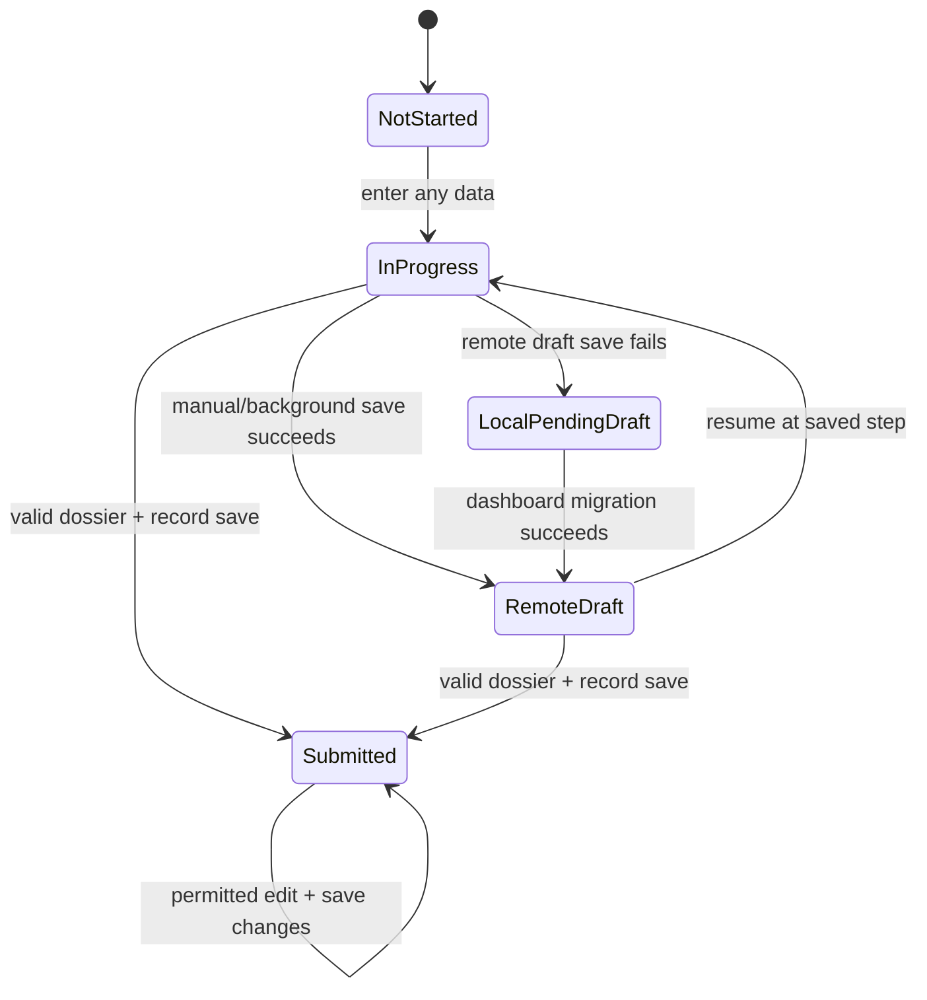
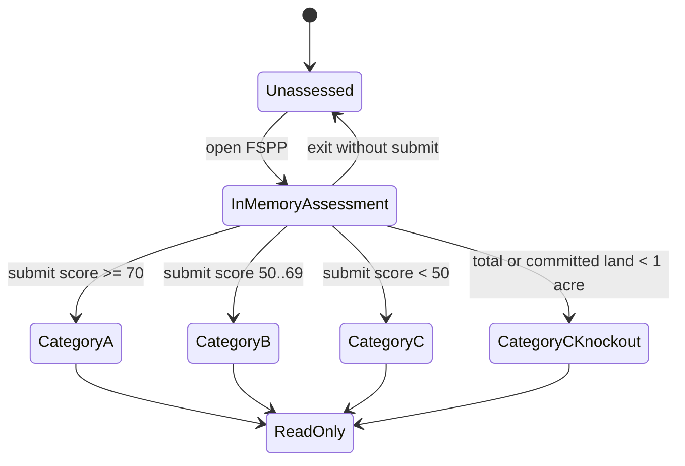

# Farmer Part 1 Business Rules

## 1. Scope and Explicit Exclusions

This specification extracts technology-independent behavior evidenced in the original Field Commander application for:

1. Complete five-step farmer onboarding, draft/resume, edit, review, submission, and dossier behavior.
2. Farmer profile, dashboard Farmer tab, route/village drill-down, farmer cards, search, sort, filters, territory Analysis, and prospect Dealers shortcuts.
3. Farmer Hub entry points and actions.
4. General Visit logging against submitted farmers or farmer drafts.
5. Four-screen FSPP assessment (Land, Awareness, Mindset, Review), scoring, classification, and profile display.

### Explicit exclusions

- **FarmCard is out of scope.** This document records only the Farmer Hub gate/navigation boundary: a completed FSPP assessment exposes a Farm Cards action; Category A/B or an explicit approval flag unlocks it.
- **Farm Diary, Farm Diary setup, Farm Diary visits, mandatory visits, visit details, and Crop Observation are out of scope.** This document records only the dashboard/Hub navigation boundaries.
- No FarmCard land, soil, infrastructure, livestock, media, boundary, review, or card-lifecycle rule is included.
- No Farm Diary data-entry, calendar, observation, visit, setup, or synchronization rule is included.
- Backend policy definitions are unavailable in this repository. Client queries are evidence of original behavior, not proof of backend authorization.

### Version-2 architecture boundary

Sections 3–30 and 32 state what version 2 must do or what remains unresolved. Original frameworks, storage products, libraries, table names, and source-level implementation details are evidence only and are isolated in sections 2 and 31.

## 2. Farmer Repository Evidence Map

### Screens and components

| File | Why it matters |
| --- | --- |
| `Frontend/src/modules/onboarding/farmer/screens/FarmerOnboardingScreen.tsx` | Five-step shell, step navigation, language switch, footer actions, back behavior, success state |
| `Frontend/src/modules/onboarding/farmer/screens/steps/Step1PersonalDetails.tsx` | Profile photo, mobile, name, cascading location, pincode, submitted-profile lock |
| `Frontend/src/modules/onboarding/farmer/screens/steps/Step2FarmDetails.tsx` | Farmer-onboarding land, crops, soil, water, equipment, bio-awareness, trees, livestock |
| `Frontend/src/modules/onboarding/farmer/screens/steps/Step3History.tsx` | Cultivation history and submitted-dealer linkage |
| `Frontend/src/modules/onboarding/farmer/screens/steps/Step4Signatures.tsx` | Declaration, mandatory consent, farmer and SE signatures |
| `Frontend/src/modules/onboarding/farmer/screens/steps/Step5Review.tsx` | Review summaries, missing indicators, edit-and-return behavior |
| `Frontend/src/modules/dashboard/screens/DashboardScreen.tsx` | Farmer tab permission, data loading, route/village/profile hierarchy, Analysis and Dealers shortcuts, search/filter/sort, pagination, draft deletion, add action |
| `Frontend/src/modules/dashboard/screens/FarmerHubScreen.tsx` | Farmer action hub, draft resume, profile, General Visit, FSPP, and out-of-scope module gates |
| `Frontend/src/modules/dashboard/screens/EntityProfileScreen.tsx` | Submitted farmer profile, FSPP result, edit/PDF/signature actions, missing-value display |
| `Frontend/src/modules/dashboard/screens/GeneralVisitScreen.tsx` | Date/comment visit workflow, shift/date checks, duplicate prevention, append behavior |
| `Frontend/src/modules/dashboard/screens/TempDealersListScreen.tsx` | Prospect-dealer list opened from Farmer-tab route/village Dealers shortcuts |
| `Frontend/src/modules/dashboard/components/TempDealerCard.tsx` | Prospect-dealer display fields and call/map/share actions |
| `Frontend/src/modules/FSPP/screens/FSPPEnrollmentScreen.tsx` | Four-screen FSPP shell, read-only completed assessment, review, submission and result |
| `Frontend/src/modules/FSPP/screens/steps/Step1Land.tsx` | Committed land cap/unit conversion and expenditure options |
| `Frontend/src/modules/FSPP/screens/steps/Step2Awareness.tsx` | Biological-input and GLS-awareness questions |
| `Frontend/src/modules/FSPP/screens/steps/Step3Mindset.tsx` | Four mindset statements and answer controls |
| `Frontend/src/design-system/components/EntityCard.tsx` | Farmer card fields, status/score/stage indicators, draft deletion, edit, Hub navigation |
| `Frontend/src/design-system/components/FilterModal.tsx` | Farmer sort, stage, route, scale, crop, soil and water filters |
| `Frontend/src/modules/dashboard/components/AnalyticsTable.tsx` | Route/village farmer metrics and formulas |

### Hooks and forms

| File | Why it matters |
| --- | --- |
| `Frontend/src/modules/onboarding/farmer/hooks.ts` | Defaults, mobile lookup, draft persistence, edit restrictions, upload, validation gates, dossier and submission |
| `Frontend/src/modules/FSPP/hooks.ts` | FSPP defaults, land normalization, score formula, completion/read-only detection and persistence |
| `Frontend/src/modules/dashboard/hooks.ts` | Profile actions and language behavior; no farmer-fetch logic |

### Schemas and validation

| File | Why it matters |
| --- | --- |
| `Frontend/src/modules/onboarding/farmer/schema.ts` | Submit-time field contract, mobile/pincode constraints, conditional crop rule, same-unit land check, consent/signatures |
| `Frontend/src/modules/FSPP/hooks.ts` | FSPP has no independent validation schema; requiredness is implemented by string-presence checks |

### Services and APIs

| File | Why it matters |
| --- | --- |
| `Frontend/src/modules/onboarding/services/onboardingService.ts` | Farmer payload transformation, submitted status, update history, reverse mapping, newest mobile match |
| `Frontend/src/modules/onboarding/services/cloudinaryService.ts` | Version-1 media/PDF upload evidence |
| `Frontend/src/modules/dashboard/services/dashboardService.ts` | User-owned farmer/draft/route retrieval, pagination, network counts, and prospect dealers by village name |

### Stores and state

| File | Why it matters |
| --- | --- |
| `Frontend/src/store/authStore.ts` | Current actor identity and persisted login timestamp |
| `Frontend/src/store/draftStore.ts` | User-tagged local fallback drafts and migration source |
| `Frontend/src/store/alertStore.ts` | Global alert messages and actions |
| `Frontend/src/store/shiftStore.ts` | Active-shift gate, dated activity logs, activity counts and opportunistic GPS |
| `Frontend/src/store/farmDiaryStore.ts` | Checked only for the out-of-scope Farm Diary boundary; no Part-1 rule is sourced from it |

### Navigation

| File | Why it matters |
| --- | --- |
| `Frontend/src/navigation/AppNavigator.tsx` | Authenticated-only routes, global offline blocking screen, dashboard stack and cross-module destinations |

### Core and shared utilities

| File | Why it matters |
| --- | --- |
| `Frontend/src/core/usePermissions.ts` | Role/module permission resolution, offline cache and default SE access |
| `Frontend/src/core/permissions.ts` | Camera permission timeout and denied fallback |
| `Frontend/src/core/i18n.ts` | English/Hindi/Gujarati selection, persisted preference and English fallback |
| `Frontend/src/core/AutoLogoutProvider.tsx` | Seven-day session expiry |
| `Frontend/src/core/database.ts`, `OfflineSyncManager.tsx`, `locationTracker.ts`, `locationUtils.ts` | Shift-location queue only; demonstrate that farmer/FSPP/visit records do not use this sync queue |
| `Frontend/src/design-system/components/SignaturePad.tsx` | Signature restoration, capture format and clear behavior |
| `Frontend/src/design-system/components/DatePickerField.tsx` | General Visit date format, manual entry and maximum-date picker behavior |
| `Frontend/src/design-system/components/SelectField.tsx`, `MultiSelectField.tsx` | Selection/search/toggle semantics used by onboarding |

### Related modules

| File/area | Boundary |
| --- | --- |
| `Frontend/src/modules/FarmCard/**` | Out of scope; checked only to confirm farmer/FSPP identifiers and Hub navigation |
| `Frontend/src/modules/FarmDiary/**` | Out of scope; checked only to confirm Farmer Hub and village-dashboard navigation |
| `Frontend/src/modules/reports/**` | No direct farmer-record consumer found; farmer/FSPP/visit activity enters shift events used by travel reporting |
| `Frontend/src/modules/auth/**` | Registration creates an SE-role actor; login establishes the authenticated route boundary |
| `Frontend/src/modules/dashboard/screens/ProfileScreen.tsx` | Shows combined submitted-plus-draft farmer count and links to a fixed dashboard tab index |

## 3. Actors, Roles, Eligibility, and Permissions

### Actors

| Actor | Evidenced capability |
| --- | --- |
| Authenticated application user | Can reach registered farmer/FSPP/visit routes; unauthenticated users see authentication screens |
| Sales Executive (SE) | Receives default farmer view/edit access and is recorded as farmer owner, signatory and activity actor |
| Territory Head / Super Admin | Receives full module access in the client permission resolver |
| Other configured role | Receives per-module view/edit flags |
| Farmer | Subject of the record, gives program consent and signature; not evidenced as an application login actor |

### FMR-A01 — Authenticated access boundary

- Rule: Farmer Part 1 routes must be available only in an authenticated session.
- Business purpose: Prevent anonymous access to farmer personal and operational data.
- Trigger/condition: Session exists versus is absent, signed out, or expired.
- Behavior/result: Authenticated routes are registered only when a user exists; otherwise authentication routes replace them. A session expires seven days after login.
- Actor/role: Any signed-in user.
- Affected workflow: Dashboard, onboarding, profile, Farmer Hub, General Visit, FSPP.
- UX behavior: Expiry/sign-out redirects by replacing the authenticated route set; no farmer-specific access-denied screen exists.
- Validation/error behavior: Missing session at farmer submit produces “User session not found.”
- Online/offline behavior: Authentication state is locally persisted, but the whole navigator is replaced by an offline screen when connectivity is reported absent.
- Enforcement requirement: UI route gate plus authoritative server-side authentication is required.
- Dependencies: Auth state, session events, session timestamp.
- Original implementation evidence:
  - `Frontend/src/navigation/AppNavigator.tsx:96-194` — `AppNavigator`
  - `Frontend/src/core/AutoLogoutProvider.tsx:7-54` — `AutoLogoutProvider`
  - `Frontend/src/modules/onboarding/farmer/hooks.ts:460-464` — `submit`
- Confidence: High

### FMR-A02 — Farmer module view and edit capabilities

- Rule: Viewing and editing/creating farmers are separate capabilities; either base-farmer or farmer-onboarding permission may expose the Farmer tab and add action.
- Business purpose: Support role-based separation of read and write access.
- Trigger/condition: `can_view` or `can_edit` for either farmer permission domain.
- Behavior/result: No view permission hides the tab and suppresses farmer fetches. No edit permission hides add actions and General Visit. FSPP visibility uses base-farmer view only.
- Actor/role: SE, TH, Super Admin, or configured role.
- Affected workflow: Dashboard Farmer tab, empty-state action, floating add action, Farmer Hub actions.
- UX behavior: Permission loading shows “Verifying Access”; no assigned modules shows an access explanation.
- Validation/error behavior: Directly navigating to registered routes is not rechecked within the onboarding/FSPP screens.
- Online/offline behavior: Cached permissions may render before fresh permissions arrive.
- Enforcement requirement: Every entry point and all writes require authoritative authorization, not only conditional visibility.
- Dependencies: Permission profile and role mapping.
- Original implementation evidence:
  - `Frontend/src/modules/dashboard/screens/DashboardScreen.tsx:42-53,546-589,646-660` — `DashboardScreen`
  - `Frontend/src/modules/dashboard/screens/FarmerHubScreen.tsx:16-23,157-226` — `FarmerHubScreen`
  - `Frontend/src/core/usePermissions.ts:49-76,99-103` — `usePermissions`
- Confidence: High

### FMR-A03 — User ownership scope

- Rule: Normal farmer lists, farmer drafts, routes and dealer choices are scoped to the current user.
- Business purpose: Keep each field actor’s working set isolated.
- Trigger/condition: Farmer/draft/route/dealer data is loaded for a signed-in user.
- Behavior/result: Only records carrying that actor’s ownership identifier are requested; farmer submissions assign the current actor as owner.
- Actor/role: Authenticated field user.
- Affected workflow: Dashboard, onboarding dealer linkage, profile counts.
- UX behavior: No cross-owner selector or reassignment action exists.
- Validation/error behavior: Client code does not verify ownership when updating by arbitrary record ID.
- Online/offline behavior: Local fallback drafts are tagged with user ID; legacy drafts with no owner are treated as belonging to the current user during migration.
- Enforcement requirement: Reads and writes must enforce ownership/assignment server-side; ownerless local data must not be silently claimed without a migration policy.
- Dependencies: Current user identity, record ownership, route assignment.
- Original implementation evidence:
  - `Frontend/src/modules/dashboard/services/dashboardService.ts:13-25,87-107` — `fetchMyFarmers`, `fetchMyDrafts`, `fetchMyRoutes`
  - `Frontend/src/modules/onboarding/farmer/hooks.ts:101-108,143-151` — `useFarmerOnboarding`
  - `Frontend/src/store/draftStore.ts:33-57` — `addDraft`, `updateDraft`
- Confidence: High

### FMR-A04 — Permission cache reconciliation

- Rule: Previously known access may be shown while fresh access is being checked, then must reconcile to current permissions.
- Business purpose: Permit fast startup without permanently trusting stale authorization.
- Trigger/condition: Cached permission data exists.
- Behavior/result: Cached flags render first; fresh role permissions replace and recache them. Dashboard refresh also refreshes permissions.
- Actor/role: Any authenticated role.
- Affected workflow: Dashboard and Farmer Hub.
- UX behavior: First-time users see a spinner; returning users may briefly see cached actions.
- Validation/error behavior: Permission fetch failure leaves cached or empty state without an explicit error.
- Online/offline behavior: Cached data is used offline, but the global offline screen prevents normal interaction.
- Enforcement requirement: Cached permission display must never authorize protected writes.
- Dependencies: Local cache and authoritative role source.
- Original implementation evidence:
  - `Frontend/src/core/usePermissions.ts:27-90` — `fetchPerms`
  - `Frontend/src/modules/dashboard/screens/DashboardScreen.tsx:244-260` — `useFocusEffect`, `onRefresh`
- Confidence: High

## 4. Farmer Entities and Data Contracts

| Entity | Key logical data |
| --- | --- |
| Farmer | Owner/SE, full name, mobile, village, nested personal details, farm details, cultivation history, optional dealer link, signatures, status, dossier reference, update history, FSPP details, comments, created/updated dates |
| Farmer draft | Owner, entity type/id, complete partial form payload, current step, update history, updated date, optional General Visit comments |
| Local fallback draft | Draft ID, owner, FARMER type, payload plus current step, local update time |
| FSPP assessment | Normalized total land, committed land/unit, expense answer, two awareness answers, four mindset answers, evaluation timestamp, score, category, status label, knockout flag |
| General Visit entry | Selected date (`DD-MM-YYYY`), trimmed comment, creation timestamp; stored as an append-only element of a farmer/draft comments array |
| Dashboard farmer view model | Record ID, display name, type, district/village, state, FSPP score, raw record, draft flag, update date |
| Territory analytics column | Display name, farmer subset, village count; derived metrics listed in `FMR-LIST10` |
| Prospect dealer | Directory name, village, contact person, mobile, address, taluka, district (alternate CSV field casings accepted); not an onboarded dealer |

Transformations with business impact:

- Custom soil, water and equipment values replace “Others” before persistence.
- Past-crop “Other” inputs replace the “Others” token; custom past-crop name is **not** persisted (audit issue).
- Empty tree/livestock rows are discarded.
- Submitted status is always `SUBMITTED`.
- Existing record update overwrites the farmer payload and appends modified-field audit entries when dirty fields exist.
- FSPP converts Bigha to acres using `1 acre = 2.5 Bigha`.

## 5. Complete Farmer Onboarding Workflow

### FMR-ONB01 — Entry modes and initial state

- Rule: Onboarding supports new, remote-draft resume, submitted-record edit, and mobile-discovered resume/edit modes.
- Business purpose: Create once, resume incomplete work, and update an existing farmer without duplicate workflows.
- Trigger/condition: Route has no data, draft data, edit data, or a newly entered 10-digit mobile matches a record.
- Behavior/result: New starts at step 1; route may supply an initial step; draft data is restored; edit data is reverse-mapped; a mobile match replaces entered form data.
- Actor/role: Authorized farmer editor.
- Affected workflow: All onboarding steps.
- UX behavior: Mobile discovery shows “Profile Found”; no confirmation is requested before replacement.
- Validation/error behavior: Lookup errors are logged only.
- Online/offline behavior: Mobile discovery and explicit remote resume require connectivity; local fallback appears only after later migration.
- Enforcement requirement: Restoring data must be deterministic and must not overwrite unsaved input without warning.
- Dependencies: Route parameters, mobile lookup, farmer/draft mapping.
- Original implementation evidence:
  - `Frontend/src/modules/onboarding/farmer/hooks.ts:25-47,58-99` — `useFarmerOnboarding`
- Confidence: High

### FMR-ONB02 — Five-step order and unrestricted progression

- Rule: The evidenced order is Personal Details → Farm Details → History & Linking → Declaration & Signatures → Final Review.
- Business purpose: Collect identity before operating details and consent before submission.
- Trigger/condition: User presses Next, Back, an edit link, or Return to Review.
- Behavior/result: Next increments one step; Back decrements one step; review edit jumps to a selected step and returns to review. Next is always enabled, so incomplete steps may be skipped.
- Actor/role: Farmer editor.
- Affected workflow: Onboarding wizard.
- UX behavior: Header displays step N of 5 and N/5 progress. Hardware and header back share step behavior; step 1 exits.
- Validation/error behavior: Step validity does not block progression; submission performs the gate.
- Online/offline behavior: Step navigation is local, but global offline behavior blocks the application.
- Enforcement requirement: Version 2 must preserve order and edit-return behavior; whether incomplete forward navigation remains allowed is unresolved, not a required defect.
- Dependencies: Current step and review return target.
- Original implementation evidence:
  - `Frontend/src/modules/onboarding/farmer/screens/FarmerOnboardingScreen.tsx:31-43,70-115` — `FarmerOnboardingScreen`
  - `Frontend/src/modules/onboarding/farmer/hooks.ts:264-291` — `validationStatus`, `isNextEnabled`
- Confidence: High

### FMR-ONB03 — Draft save prerequisites and exit

- Rule: A manual farmer draft can be saved only after full name and mobile are non-empty and only for a non-completed profile.
- Business purpose: Ensure a resumable draft can be identified and prevent a completed profile from being forked into a draft.
- Trigger/condition: User presses Save Draft.
- Behavior/result: Draft is upserted, activity is counted/logged, and user returns to the main tabs.
- Actor/role: Farmer editor.
- Affected workflow: New/draft onboarding.
- UX behavior: Save Draft is hidden in explicit edit mode, but remains visible after a completed profile is found by mobile and then returns a “Cannot Save Draft” alert.
- Validation/error behavior: Missing name/mobile shows “Please enter both…”; completed profile explains to use Save Changes.
- Online/offline behavior: Failed remote save writes a local fallback; the UI still exits and does not explicitly say the draft is local-only.
- Enforcement requirement: A successful user-visible draft action must leave a recoverable draft and disclose pending synchronization.
- Dependencies: User identity, form dirty state, draft ID, shift.
- Original implementation evidence:
  - `Frontend/src/modules/onboarding/farmer/hooks.ts:196-228` — `saveAndExit`
  - `Frontend/src/modules/onboarding/farmer/screens/FarmerOnboardingScreen.tsx:90-104` — footer
- Confidence: High

### FMR-ONB04 — Background/unmount autosave

- Rule: Dirty, identifiable, non-completed farmer work is autosaved when the app backgrounds or the wizard unmounts.
- Business purpose: Reduce loss from interruption or app closure.
- Trigger/condition: App becomes inactive/backgrounded or step effect unmounts; at least one dirty field and both name/mobile/user exist.
- Behavior/result: Same draft ID is upserted with complete current values and current step.
- Actor/role: Farmer editor.
- Affected workflow: New/draft onboarding.
- UX behavior: Background autosave is silent.
- Validation/error behavior: No dirty data, missing identifiers, edit mode, shown success, or mobile-loaded completed record causes no save.
- Online/offline behavior: Remote failure writes/updates the local fallback.
- Enforcement requirement: Partial work must be restorable after interruption and tied to the correct user.
- Dependencies: App lifecycle, dirty tracking, persistent draft store.
- Original implementation evidence:
  - `Frontend/src/modules/onboarding/farmer/hooks.ts:110-170,230-241` — `saveDraftToDB`, autosave effect
- Confidence: High

### FMR-ONB05 — Local fallback migration

- Rule: Locally pending entity drafts are migrated to shared draft persistence when connectivity permits.
- Business purpose: Recover offline/crash fallback drafts across later sessions.
- Trigger/condition: Dashboard loads with signed-in user and local drafts.
- Behavior/result: Current user’s and ownerless legacy drafts are batch-upserted, then **all** local entity drafts are cleared.
- Actor/role: Authenticated user.
- Affected workflow: Dashboard and draft resume.
- UX behavior: “Syncing drafts…” appears only when route list is empty/loading.
- Validation/error behavior: Failure is logged; no retry status is shown.
- Online/offline behavior: Migration is online-only; no conflict strategy beyond upsert-by-entity-ID.
- Enforcement requirement: Migration must not erase another user’s local drafts and must clear only confirmed migrated records.
- Dependencies: Local draft owner, entity ID, connectivity.
- Original implementation evidence:
  - `Frontend/src/modules/dashboard/screens/DashboardScreen.tsx:85-122` — `migrateLocalDrafts`
  - `Frontend/src/store/draftStore.ts:60-61` — `clearDrafts`
- Confidence: High

### FMR-ONB06 — Mobile duplicate lookup

- Rule: Entering exactly 10 digits triggers a delayed search for the newest matching farmer draft, then newest submitted farmer.
- Business purpose: Reuse an existing profile rather than knowingly create another with the same mobile.
- Trigger/condition: New form, no explicit draft/edit data, mobile length exactly 10, 600 ms elapsed.
- Behavior/result: Newest draft wins over any submitted record; matched data is loaded and status determines edit lock.
- Actor/role: Farmer editor.
- Affected workflow: Step 1 and subsequent steps.
- UX behavior: Loading state exists internally but no spinner is rendered; a found alert is shown.
- Validation/error behavior: Lookup errors are silent to user; submission does not recheck uniqueness.
- Online/offline behavior: No lookup while globally offline; no unique constraint evidence is available.
- Enforcement requirement: Duplicate prevention must be authoritative and race-safe; matches must respect ownership/authorization.
- Dependencies: Mobile number, record update dates, user authorization.
- Original implementation evidence:
  - `Frontend/src/modules/onboarding/farmer/hooks.ts:58-99` — mobile lookup effect
  - `Frontend/src/modules/onboarding/services/onboardingService.ts:650-677` — `fetchProfileByMobile`
- Confidence: High

### FMR-ONB07 — Submitted-profile edit lock

- Rule: A submitted farmer’s identity/location, cultivation history, declaration and signatures are visually locked, while a defined set of operational fields remains updateable.
- Business purpose: Protect stable identity/consent data after completion while allowing operational maintenance.
- Trigger/condition: Explicit or mobile-loaded record has `SUBMITTED` status.
- Behavior/result: Step 1 locks name, father name and location but leaves mobile/alternate mobile and profile photo active; Step 3 locks crop history but not dealer linkage; Step 4 locks all consent/signatures; Step 2 is not visually locked. Submit also rejects dirty top-level fields outside its allowlist.
- Actor/role: Farmer editor.
- Affected workflow: Submitted-profile edit.
- UX behavior: Locked sections are dimmed and non-interactive; no field-level explanation is shown.
- Validation/error behavior: Illegal dirty fields produce “Restricted Action”/“Cannot Save” with a broader textual summary.
- Online/offline behavior: Updates require online submission.
- Enforcement requirement: Field-level mutability must be consistent in UI and authoritative write validation.
- Dependencies: Status and dirty-field paths.
- Original implementation evidence:
  - `Frontend/src/modules/onboarding/farmer/hooks.ts:172-194` — `checkRestrictions`
  - `Frontend/src/modules/onboarding/farmer/screens/steps/Step1PersonalDetails.tsx:141-245` — lock wrapper
  - `Frontend/src/modules/onboarding/farmer/screens/steps/Step3History.tsx:20-97` — partial lock
  - `Frontend/src/modules/onboarding/farmer/screens/steps/Step4Signatures.tsx:7-39` — lock
- Confidence: High

### FMR-ONB08 — Final submission gate

- Rule: Final submission requires all Step 1/2/4 gate fields, conditional “Other” details, and a schema-valid payload.
- Business purpose: Prevent incomplete farmer records.
- Trigger/condition: Submit Profile or Save Changes is pressed on step 5.
- Behavior/result: A precheck lists incomplete sections; schema validation then enforces field formats and cross-field rules.
- Actor/role: Farmer editor.
- Affected workflow: Final review and submission.
- UX behavior: Submit remains visually enabled; alerts explain missing sections or invalid data.
- Validation/error behavior: No user session, illegal edits, missing sections, or invalid schema blocks persistence.
- Online/offline behavior: Submission has no offline queue.
- Enforcement requirement: Final persistence must reject invalid data independently of the UI.
- Dependencies: Validation matrix and current session.
- Original implementation evidence:
  - `Frontend/src/modules/onboarding/farmer/hooks.ts:451-524` — `submit`
  - `Frontend/src/modules/onboarding/farmer/schema.ts:6-109` — `farmerOnboardingSchema`
- Confidence: High

### FMR-ONB09 — Dossier-before-record submission

- Rule: A retrievable dossier reference must be produced before the farmer record is saved.
- Business purpose: Keep the submitted profile and its evidence dossier together.
- Trigger/condition: Valid final submission.
- Behavior/result: Dossier is generated and uploaded first; farmer persistence follows with that reference.
- Actor/role: Farmer editor.
- Affected workflow: Submit/update and profile PDF actions.
- UX behavior: Processing and Saving alerts are shown.
- Validation/error behavior: Any generation/upload/save error fails the whole client workflow and shows “Submission Failed.”
- Online/offline behavior: Requires connectivity; there is no queued submission.
- Enforcement requirement: Version 2 must preserve retrievable evidence before marking submission complete, without prescribing storage technology.
- Dependencies: Valid form, signature rendering, media service, record persistence.
- Original implementation evidence:
  - `Frontend/src/modules/onboarding/farmer/hooks.ts:293-445,470-480` — `generateHTML`, `generatePDF`, `submit`
- Confidence: High

### FMR-ONB10 — Idempotency and completion

- Rule: One in-flight submission is allowed; a successful create/update stores `SUBMITTED`, removes its draft, logs activity, and shows completion.
- Business purpose: Avoid accidental double submission and clean up obsolete drafts.
- Trigger/condition: Valid submit and no existing in-flight submission.
- Behavior/result: Create inserts; edit/mobile match updates; dirty fields are audited; draft is deleted after record save.
- Actor/role: Farmer editor.
- Affected workflow: Submission.
- UX behavior: Submit shows loading; success distinguishes “Farmer Enrolled” and explicit edit “Farmer Updated.”
- Validation/error behavior: Double taps are ignored. A failure unlocks retry.
- Online/offline behavior: No durable idempotency key is evidenced; process-level lock is lost on restart.
- Enforcement requirement: Submission must be idempotent across retries/restarts and draft deletion must follow confirmed completion.
- Dependencies: Existing record ID, draft ID, activity log.
- Original implementation evidence:
  - `Frontend/src/modules/onboarding/farmer/hooks.ts:448-513` — `submit`
  - `Frontend/src/modules/onboarding/services/onboardingService.ts:241-315` — `saveFarmerOnboarding`
- Confidence: High

## 6. Step 1 — Personal Details Rules

### FMR-PER01 — Personal identity requirements

- Rule: Full name and father/husband name require at least two characters; primary mobile must contain exactly ten digits.
- Business purpose: Establish minimally identifiable contact data.
- Trigger/condition: Values change and final submission occurs.
- Behavior/result: Invalid fields receive inline errors and block submission.
- Actor/role: Farmer editor entering farmer data.
- Affected workflow: Step 1.
- UX behavior: Primary mobile has `+91`, numeric keypad and ten-character cap; alternate mobile is labeled optional.
- Validation/error behavior: Alternate mobile has a UI cap but no digit-pattern validation; no gender, DOB, age, email, identity document, education, occupation, income, bank, household or demographic fields exist.
- Online/offline behavior: Local form editing; final save online.
- Enforcement requirement: Preserve only evidenced fields and constraints; do not infer absent demographic requirements.
- Dependencies: Form validation.
- Original implementation evidence:
  - `Frontend/src/modules/onboarding/farmer/schema.ts:8-17` — personal fields
  - `Frontend/src/modules/onboarding/farmer/screens/steps/Step1PersonalDetails.tsx:141-145` — controls
- Confidence: High

### FMR-PER02 — Cascading location

- Rule: State, district, taluka and village are required and form a cascading hierarchy.
- Business purpose: Place farmers in geographic and route views.
- Trigger/condition: Parent location changes.
- Behavior/result: Changing state clears district/taluka/village; changing district clears taluka/village; changing taluka clears village. Available child values are sorted.
- Actor/role: Farmer editor.
- Affected workflow: Step 1, dashboard routing/filtering.
- UX behavior: State is searchable; child controls become selectors when options exist and free-text inputs otherwise.
- Validation/error behavior: Each location string requires at least two characters; location-source failure silently falls back to manual entry.
- Online/offline behavior: Location hierarchy fetch requires network, but manual fallback exists if the screen is reachable.
- Enforcement requirement: Stored hierarchy must remain internally consistent even when manual fallback is used.
- Dependencies: Location hierarchy source.
- Original implementation evidence:
  - `Frontend/src/modules/onboarding/farmer/screens/steps/Step1PersonalDetails.tsx:44-115,147-242` — location effects/controls
  - `Frontend/src/modules/onboarding/farmer/schema.ts:13-16` — required location
- Confidence: High

### FMR-PER03 — Defaults and optional pincode

- Rule: New farmers default to Gujarat; pincode is optional, but if present must be exactly six digits.
- Business purpose: Reduce local field effort while preserving a valid postal code.
- Trigger/condition: New form initialization or pincode entry.
- Behavior/result: Default state is prefilled; empty pincode is accepted.
- Actor/role: Farmer editor.
- Affected workflow: Step 1.
- UX behavior: Numeric keypad and six-character cap.
- Validation/error behavior: Invalid non-empty pincode displays “Invalid Pincode” and blocks submission.
- Online/offline behavior: No special behavior.
- Enforcement requirement: Optional-value validation must distinguish absent from malformed.
- Dependencies: New-versus-restored form mode.
- Original implementation evidence:
  - `Frontend/src/modules/onboarding/farmer/hooks.ts:41-47` — defaults
  - `Frontend/src/modules/onboarding/farmer/schema.ts:17` — pincode
- Confidence: High

### FMR-PER04 — Optional profile photo

- Rule: A profile photo is optional and may be captured, previewed, and replaced.
- Business purpose: Support visual identification.
- Trigger/condition: User taps capture/retake.
- Behavior/result: Camera permission is requested; captured image is resized/compressed, uploaded, and its reference enters the form.
- Actor/role: Farmer editor.
- Affected workflow: Step 1, profile, dossier.
- UX behavior: Spinner while uploading; preview when present; “Tap to Retake Photo” replaces capture label.
- Validation/error behavior: Permission denied/timed out shows fallback; upload failure shows “Photo upload failed.”
- Online/offline behavior: Upload requires network; no deferred media queue.
- Enforcement requirement: A stored photo reference must be retrievable; denial must leave the optional workflow usable.
- Dependencies: Camera permission and media upload.
- Original implementation evidence:
  - `Frontend/src/modules/onboarding/farmer/screens/steps/Step1PersonalDetails.tsx:122-139` — photo UI
  - `Frontend/src/modules/onboarding/farmer/hooks.ts:245-262` — `handleUpload`
  - `Frontend/src/core/permissions.ts:5-59` — permission helpers
- Confidence: High

## 7. Step 2 — Farmer-Onboarding Farm Details Rules

This section covers only farm details captured inside farmer onboarding. It does not specify FarmCard behavior.

### FMR-FARM01 — Required farm baseline

- Rule: Total land, at least one major crop, at least one soil type and at least one water source are required.
- Business purpose: Establish a minimum operational farm profile.
- Trigger/condition: Submission/review.
- Behavior/result: Missing baseline blocks final submission.
- Actor/role: Farmer editor.
- Affected workflow: Step 2, profile, dashboard filters, FSPP baseline.
- UX behavior: Required labels use an asterisk; review marks missing values red.
- Validation/error behavior: Arrays must contain one item; total land must be a non-empty string.
- Online/offline behavior: Local entry; final persistence online.
- Enforcement requirement: Requiredness must be enforced authoritatively.
- Dependencies: Farm details.
- Original implementation evidence:
  - `Frontend/src/modules/onboarding/farmer/schema.ts:20-31` — required farm fields
  - `Frontend/src/modules/onboarding/farmer/hooks.ts:268-272` — Step 2 gate
- Confidence: High

### FMR-FARM02 — Land units and same-unit total check

- Rule: Total, irrigated and rain-fed land use Acres or Bigha; when all three units match, irrigated plus rain-fed must not exceed total.
- Business purpose: Prevent internally impossible land allocation.
- Trigger/condition: Values change and final validation runs.
- Behavior/result: Both component areas show an exceedance error and submission is blocked.
- Actor/role: Farmer editor.
- Affected workflow: Step 2.
- UX behavior: Live red error appears only when units are identical.
- Validation/error behavior: Mixed units bypass the sum rule; numeric strings are not constrained to positive/finite values by schema.
- Online/offline behavior: Local calculation.
- Enforcement requirement: Unit-aware numeric integrity is required; conversion policy for mixed units is unresolved.
- Dependencies: Three values and three units.
- Original implementation evidence:
  - `Frontend/src/modules/onboarding/farmer/screens/steps/Step2FarmDetails.tsx:31-43,49-102` — live check
  - `Frontend/src/modules/onboarding/farmer/schema.ts:90-108` — cross-field check
- Confidence: High

### FMR-FARM03 — Major crops and conditional custom crop

- Rule: Major crops are multi-select from the evidenced West India list; selecting Other Cereals, Other Pulses or Other Oilseeds requires custom crop text.
- Business purpose: Capture supported classifications without losing uncommon crops.
- Trigger/condition: Any “Other …” major crop is selected.
- Behavior/result: Custom input appears and becomes required.
- Actor/role: Farmer editor.
- Affected workflow: Step 2, review, dossier, dashboard crop filters/analytics.
- UX behavior: Crop selector is searchable.
- Validation/error behavior: Missing custom text blocks submission with “Please specify the other crop(s).”
- Online/offline behavior: Local.
- Enforcement requirement: Conditional custom value must be persisted without ambiguity.
- Dependencies: `majorCrops`, `otherCrops`.
- Original implementation evidence:
  - `Frontend/src/modules/onboarding/farmer/screens/steps/Step2FarmDetails.tsx:8,21-29,104-110` — crop controls
  - `Frontend/src/modules/onboarding/farmer/schema.ts:80-88` — conditional validation
- Confidence: High

### FMR-FARM04 — Soil, water and equipment custom values

- Rule: Selecting “Others” for soil, water or equipment requires a custom value at the final gate.
- Business purpose: Preserve uncommon operational values.
- Trigger/condition: Corresponding “Others” option selected.
- Behavior/result: A custom input appears; persisted arrays replace the marker with custom text.
- Actor/role: Farmer editor.
- Affected workflow: Step 2, review, profile, filters.
- UX behavior: Custom fields disappear when “Others” is deselected.
- Validation/error behavior: Soil/water/equipment requiredness exists in the manual step gate, but only crop custom value is in the schema; custom equipment is labeled optional parent but required conditionally.
- Online/offline behavior: Local entry.
- Enforcement requirement: Conditional rules must be enforced consistently across UI and persistence.
- Dependencies: Selection arrays and custom text.
- Original implementation evidence:
  - `Frontend/src/modules/onboarding/farmer/screens/steps/Step2FarmDetails.tsx:111-149` — conditional controls
  - `Frontend/src/modules/onboarding/farmer/hooks.ts:268-272` — gate
  - `Frontend/src/modules/onboarding/services/onboardingService.ts:274-289` — transformations
- Confidence: High

### FMR-FARM05 — Optional operational fields

- Rule: Irrigated land, rain-fed land, irrigation types, equipment, biological-product knowledge, intercropping, side trees and livestock are optional.
- Business purpose: Enrich the farmer profile without blocking onboarding.
- Trigger/condition: User chooses to provide values.
- Behavior/result: Values are preserved; empty tree/livestock rows are dropped.
- Actor/role: Farmer editor.
- Affected workflow: Step 2 and profile/dossier consumers.
- UX behavior: Tree/livestock rows support add/delete; deleting the last row leaves one empty visual row.
- Validation/error behavior: Quantities and land values use numeric keyboards but have no positive/integer/range validation. “Others” tree/livestock has no custom-name field.
- Online/offline behavior: Local entry.
- Enforcement requirement: Optional numeric data, when provided, must be valid; exact acceptable ranges are missing.
- Dependencies: Farm details.
- Original implementation evidence:
  - `Frontend/src/modules/onboarding/farmer/schema.ts:24-45` — optional fields
  - `Frontend/src/modules/onboarding/farmer/screens/steps/Step2FarmDetails.tsx:129-252` — optional controls
  - `Frontend/src/modules/onboarding/services/onboardingService.ts:284-289` — persistence filtering
- Confidence: High

## 8. Step 3 — History Rules

### FMR-HIS01 — Repeatable cultivation history

- Rule: Cultivation history is an optional repeatable list containing crop, area/unit, inputs, yield/unit and problems.
- Business purpose: Record prior agronomic experience.
- Trigger/condition: User adds/removes/edits a history row.
- Behavior/result: New/default rows use Acres and Kg; removing the last row leaves one empty row.
- Actor/role: Farmer editor.
- Affected workflow: Step 3, review, profile, dossier.
- UX behavior: Add Another Crop and row delete controls are available on non-locked profiles.
- Validation/error behavior: Most fields have no requiredness or numeric range; empty history is accepted.
- Online/offline behavior: Local entry.
- Enforcement requirement: Preserve repeatability and explicit optionality.
- Dependencies: `pastCrops`.
- Original implementation evidence:
  - `Frontend/src/modules/onboarding/farmer/screens/steps/Step3History.tsx:21-92` — history rows
  - `Frontend/src/modules/onboarding/farmer/schema.ts:48-69` — history contract
- Confidence: High

### FMR-HIS02 — Conditional history “Other” values

- Rule: An “Other …” past crop requires a custom crop name; “Others” input usage requires custom input text at the manual gate.
- Business purpose: Avoid meaningless generic classifications.
- Trigger/condition: Corresponding option selected.
- Behavior/result: Custom field appears; absent crop name blocks schema validation; absent custom input blocks the pre-submit step gate.
- Actor/role: Farmer editor.
- Affected workflow: Step 3 and review.
- UX behavior: Review marks missing other input, but displays the generic crop label rather than custom crop name.
- Validation/error behavior: Custom crop schema rule says “Please specify the crop name.”
- Online/offline behavior: Local.
- Enforcement requirement: Custom crop name must survive persistence and display.
- Dependencies: Crop/input selections.
- Original implementation evidence:
  - `Frontend/src/modules/onboarding/farmer/schema.ts:59-68` — row refinement
  - `Frontend/src/modules/onboarding/farmer/hooks.ts:274-278` — Step 3 gate
  - `Frontend/src/modules/onboarding/farmer/screens/steps/Step3History.tsx:44-69` — conditional UI
- Confidence: High

### FMR-HIS03 — Optional submitted dealer linkage

- Rule: A farmer may optionally link to one submitted dealer owned by the current actor.
- Business purpose: Associate farmer activity with the field actor’s dealer network.
- Trigger/condition: Step 3 loads and a dealer is selected.
- Behavior/result: Dealer choices include dealer name and district; stored farmer data carries the selected dealer ID.
- Actor/role: Farmer editor.
- Affected workflow: Step 3, review, farmer profile.
- UX behavior: No “required” marker; review shows “None Linked” if absent.
- Validation/error behavior: No existence check at farmer submission and no visible fetch error.
- Online/offline behavior: Dealer options require online fetch.
- Enforcement requirement: A selected relationship must reference an authorized, eligible existing dealer.
- Dependencies: Submitted dealer records.
- Original implementation evidence:
  - `Frontend/src/modules/onboarding/farmer/hooks.ts:101-108` — dealer fetch
  - `Frontend/src/modules/onboarding/farmer/screens/steps/Step3History.tsx:95-98` — linkage control
  - `Frontend/src/modules/onboarding/services/onboardingService.ts:258-260` — persistence
- Confidence: High

## 9. Step 4 — Signatures and Consent Rules

### FMR-SIG01 — Mandatory declaration acceptance

- Rule: Farmer onboarding requires acceptance of the displayed Farmer First Program declaration.
- Business purpose: Record informed program participation and data-sharing consent.
- Trigger/condition: Final submission.
- Behavior/result: Unchecked consent blocks submission.
- Actor/role: Farmer, recorded by farmer editor.
- Affected workflow: Step 4 and review.
- UX behavior: Declaration promises a Farmer Card/Crop Calendar, regular support, data/feedback sharing, and an effort to follow recommendations.
- Validation/error behavior: “You must accept the terms & conditions.”
- Online/offline behavior: Captured in form/draft; submitted online.
- Enforcement requirement: Declaration version/content, acceptance actor and timestamp should be auditable; version 1 does not record them separately.
- Dependencies: Declaration text and acceptance.
- Original implementation evidence:
  - `Frontend/src/modules/onboarding/farmer/screens/steps/Step4Signatures.tsx:10-21` — declaration/checkbox
  - `Frontend/src/modules/onboarding/farmer/schema.ts:73-75` — consent validation
- Confidence: High

### FMR-SIG02 — Dual signatures

- Rule: Both farmer and Sales Executive signatures are required.
- Business purpose: Evidence mutual acknowledgement.
- Trigger/condition: Submission.
- Behavior/result: Signature pads capture stroke data; existing signatures restore; clear removes the signature.
- Actor/role: Farmer and SE.
- Affected workflow: Step 4, review, profile, dossier.
- UX behavior: Each pad provides draw and delete controls; review shows Captured/Missing.
- Validation/error behavior: Each signature string must have at least five characters.
- Online/offline behavior: Signature data is draftable locally; no separate media upload is used.
- Enforcement requirement: Both valid signatures must be bound to the submitted declaration and protected from unauthorized replacement.
- Dependencies: Signature component and form state.
- Original implementation evidence:
  - `Frontend/src/modules/onboarding/farmer/screens/steps/Step4Signatures.tsx:23-37` — signature fields
  - `Frontend/src/design-system/components/SignaturePad.tsx:27-57,77-106` — restore/capture/clear
  - `Frontend/src/modules/onboarding/farmer/schema.ts:76-77` — validation
- Confidence: High

## 10. Step 5 — Final Review and Submission Rules

### FMR-REV01 — Review content and missing indicators

- Rule: Review summarizes personal, farm, history/linkage, consent and signatures, and visually marks required missing values.
- Business purpose: Let the actor detect omissions before final persistence.
- Trigger/condition: Step 5 is opened or values change.
- Behavior/result: Missing required fields are red; optional empty values are not marked missing.
- Actor/role: Farmer editor.
- Affected workflow: Final review.
- UX behavior: Each section has Edit; edit sets a return target and footer becomes Return to Review.
- Validation/error behavior: Review indicators are advisory and not the authoritative validation result.
- Online/offline behavior: Local.
- Enforcement requirement: Review must reflect the actual payload and authoritative validation.
- Dependencies: Current form state.
- Original implementation evidence:
  - `Frontend/src/modules/onboarding/farmer/screens/steps/Step5Review.tsx:16-61,89-198` — review
- Confidence: High

### FMR-REV02 — Post-success choices

- Rule: After success, the actor may share the dossier, start another farmer, or return home.
- Business purpose: Support evidence distribution and rapid repeat onboarding.
- Trigger/condition: Submission completes.
- Behavior/result: Share opens device sharing; Add Another resets form and returns to step 1; Go Home navigates to main tabs.
- Actor/role: Farmer editor.
- Affected workflow: Completion screen.
- UX behavior: Success title distinguishes explicit edit from create.
- Validation/error behavior: PDF share failure shows an error.
- Online/offline behavior: Sharing uses the generated file; adding another later still requires connectivity to submit.
- Enforcement requirement: Starting another farmer must reset all prior identifiers and state.
- Dependencies: Success state and dossier.
- Original implementation evidence:
  - `Frontend/src/modules/onboarding/farmer/screens/FarmerOnboardingScreen.tsx:45-67` — success screen
- Confidence: High

## 11. Farmer Status and Onboarding State Transitions

Evidenced states only:

| State | Representation | Allowed next state |
| --- | --- | --- |
| Not started | No record/draft | In progress |
| In progress | Form memory only | Remote/local draft or Submitted |
| Draft/incomplete | Draft record; card `isDraft` | Resumed in progress, deleted, or Submitted |
| Local pending draft | Local fallback | Remote draft through migration |
| Submitted | Farmer `status = SUBMITTED` | Updated Submitted |

Not evidenced as farmer lifecycle states: pending approval, rejected, correction required, approved (despite UI label), inactive, archived, restored, sync failed, or deleted submitted farmer.

## 12. Farmer Profile Screen Rules

### FMR-PRO01 — Profile entry and content

- Rule: A non-draft farmer opens a read-oriented profile showing identity, contact, location, onboarding farm data, cultivation history, dealer ID, signatures, created date, status, optional FSPP and dossier.
- Business purpose: Consolidate the farmer’s submitted information.
- Trigger/condition: Farmer Hub primary action for a non-draft.
- Behavior/result: Missing scalar/list values show N/A; missing history shows a dedicated empty message.
- Actor/role: User who can reach the farmer.
- Affected workflow: Entity Profile.
- UX behavior: Mobile values are callable; profile photo falls back to an agriculture icon.
- Validation/error behavior: No record-not-found/error fetch because route data is used.
- Online/offline behavior: Global offline screen prevents use; profile does not independently fetch.
- Enforcement requirement: Profile visibility must follow authorization and distinguish onboarding data from FSPP/visits/out-of-scope modules.
- Dependencies: Farmer route payload.
- Original implementation evidence:
  - `Frontend/src/modules/dashboard/screens/EntityProfileScreen.tsx:138-190,335-408,755-792,839-897` — farmer profile branch
- Confidence: High

### FMR-PRO02 — Status display

- Rule: `SUBMITTED` records are displayed as “Approved”; every other status is displayed as Draft/Pending depending on component.
- Business purpose: Communicate completion, though original semantics are inconsistent.
- Trigger/condition: Status badge rendering.
- Behavior/result: Green Approved badge for submitted.
- Actor/role: Profile viewer.
- Affected workflow: Entity Profile and cards.
- UX behavior: No approval actor/date/reason is shown.
- Validation/error behavior: Display does not verify an approval workflow.
- Online/offline behavior: No special behavior.
- Enforcement requirement: Version 2 must distinguish submission from approval unless a real approval transition is defined.
- Dependencies: Farmer status.
- Original implementation evidence:
  - `Frontend/src/modules/dashboard/screens/EntityProfileScreen.tsx:350-359` — status badge
  - `Frontend/src/design-system/components/EntityCard.tsx:243-247` — card badge
- Confidence: High

### FMR-PRO03 — Profile edit and refresh

- Rule: Edit Profile routes to farmer onboarding with submitted data; the profile’s pull-to-refresh is visual-only.
- Business purpose: Reuse onboarding fields for updates.
- Trigger/condition: Menu Edit Profile or pull-to-refresh.
- Behavior/result: Edit loads the record; refresh waits 600 ms without refetching.
- Actor/role: Any profile viewer; no permission check exists in this screen.
- Affected workflow: Profile.
- UX behavior: Edit menu is always shown; no delete/archive/deactivate/restore/approve/reject actions exist.
- Validation/error behavior: Edit restrictions are applied later by the onboarding hook.
- Online/offline behavior: Edit/save online; refresh does not recover stale data.
- Enforcement requirement: Edit visibility and writes must be permission-checked; refresh must actually reconcile data.
- Dependencies: Route data and onboarding edit mode.
- Original implementation evidence:
  - `Frontend/src/modules/dashboard/screens/EntityProfileScreen.tsx:174-190,315-330` — `onRefresh`, `handleEdit`
- Confidence: High

### FMR-PRO04 — FSPP profile result

- Rule: A farmer profile displays an FSPP banner and score only when FSPP status/score exists.
- Business purpose: Expose qualification outcome alongside farmer data.
- Trigger/condition: `fspp_details.statusLabel` and optional score.
- Behavior/result: Category A green, B amber, other red; score is shown out of 100.
- Actor/role: Profile viewer.
- Affected workflow: Profile and Farmer Hub.
- UX behavior: No assessment answers, evaluation date, approval status or retry action are displayed.
- Validation/error behavior: Unknown categories fall into danger styling.
- Online/offline behavior: Uses route data.
- Enforcement requirement: Result display must reflect authoritative assessment data.
- Dependencies: FSPP assessment.
- Original implementation evidence:
  - `Frontend/src/modules/dashboard/screens/EntityProfileScreen.tsx:363-382` — FSPP banner/widgets
- Confidence: High

## 13. Farmer Dashboard Tab Rules

### FMR-DASH01 — Tab visibility and default position

- Rule: Farmer tab is included when either farmer permission domain permits view; dashboard default is the first available module tab, not necessarily Farmers.
- Business purpose: Show only assigned modules.
- Trigger/condition: Permissions load/change.
- Behavior/result: Tabs are dynamically ordered Distributor, Dealer, Farmer, FPO; invalid active index resets to zero.
- Actor/role: Authenticated user.
- Affected workflow: Dashboard.
- UX behavior: Profile count shortcut assumes Farmers is index 2, which can be wrong when tabs are hidden.
- Validation/error behavior: No explicit unavailable-tab error.
- Online/offline behavior: Permission cache may affect initial ordering.
- Enforcement requirement: Navigation must use stable tab identity, not permission-sensitive numeric index.
- Dependencies: Module permissions.
- Original implementation evidence:
  - `Frontend/src/modules/dashboard/screens/DashboardScreen.tsx:546-576` — `tabPages`
  - `Frontend/src/modules/dashboard/screens/ProfileScreen.tsx:203-223` — statistic shortcuts
- Confidence: High

### FMR-DASH02 — Farmer data subset and pagination

- Rule: The Farmer tab loads submitted farmer records and all drafts owned by the current user, newest first, in 50-record pages.
- Business purpose: Present the actor’s working farmer network.
- Trigger/condition: Dashboard focus, refresh or end-of-list.
- Behavior/result: Farmers are paged; drafts/routes load on page zero; pages merge by ID and sort by update date.
- Actor/role: User with farmer tab access.
- Affected workflow: Farmer dashboard.
- UX behavior: Footer spinner during pagination; pull-to-refresh refreshes permissions and shift state too.
- Validation/error behavior: Load errors are console-only and can appear as empty state.
- Online/offline behavior: Requires connectivity; no cached farmer-list store is evidenced.
- Enforcement requirement: Dataset must remain user-authorized and failures must not masquerade as empty.
- Dependencies: User ID, permissions, pagination.
- Original implementation evidence:
  - `Frontend/src/modules/dashboard/services/dashboardService.ts:13-25,87-95` — farmer/draft fetches
  - `Frontend/src/modules/dashboard/screens/DashboardScreen.tsx:162-241,244-260` — `loadData`, refresh
- Confidence: High

### FMR-DASH03 — Draft/completed merge

- Rule: A draft with the same mobile as a submitted farmer is hidden from the combined list.
- Business purpose: Avoid displaying apparent duplicates.
- Trigger/condition: Combined farmer list is computed.
- Behavior/result: Submitted mobiles form a set; matching drafts are excluded.
- Actor/role: Dashboard viewer.
- Affected workflow: Farmer list/routes/analytics.
- UX behavior: Draft without mobile remains visible.
- Validation/error behavior: Same-mobile records owned by different entities may be incorrectly collapsed; no server uniqueness.
- Online/offline behavior: Based on currently loaded submitted pages and all loaded drafts.
- Enforcement requirement: Duplicate handling must use a defined identity rule, not only client-side mobile matching.
- Dependencies: Primary mobile.
- Original implementation evidence:
  - `Frontend/src/modules/dashboard/screens/DashboardScreen.tsx:342-347` — `processedFarmers`
- Confidence: High

## 14. Farmer Hub Screen Rules

### FMR-HUB01 — Draft versus submitted primary action

- Rule: A draft farmer’s primary action is Resume Onboarding; a submitted farmer’s primary action is Farmer Profile.
- Business purpose: Route users to the appropriate lifecycle action.
- Trigger/condition: `isDraft`.
- Behavior/result: Draft passes draft ID/data/saved step; non-draft passes entity to profile.
- Actor/role: Farmer-tab viewer.
- Affected workflow: Farmer Hub.
- UX behavior: Draft card shows “Draft Incomplete.”
- Validation/error behavior: Missing route entity is not handled.
- Online/offline behavior: Resume depends on route data; global offline block applies.
- Enforcement requirement: Lifecycle status must determine allowed destination.
- Dependencies: Farmer view model.
- Original implementation evidence:
  - `Frontend/src/modules/dashboard/screens/FarmerHubScreen.tsx:71-77,112-155` — primary card
- Confidence: High

### FMR-HUB02 — General Visit visibility

- Rule: General Visit is shown when either base-farmer or farmer-onboarding edit capability exists, including for drafts.
- Business purpose: Permit authorized field activity.
- Trigger/condition: `canEditBaseFarmer`.
- Behavior/result: Opens General Visit with the selected entity.
- Actor/role: Farmer editor.
- Affected workflow: Farmer Hub → General Visit.
- UX behavior: Hidden without edit capability.
- Validation/error behavior: No farmer status eligibility check.
- Online/offline behavior: Submission online only.
- Enforcement requirement: Visit writes must be independently authorized and draft eligibility must be explicit.
- Dependencies: Edit permission and entity.
- Original implementation evidence:
  - `Frontend/src/modules/dashboard/screens/FarmerHubScreen.tsx:157-189` — General Visit card
- Confidence: High

### FMR-HUB03 — FSPP visibility and read-only result

- Rule: FSPP is shown only for non-draft farmers with base-farmer view permission; a completed assessment opens read-only.
- Business purpose: Restrict assessment to submitted profiles and prevent accidental overwrite.
- Trigger/condition: Non-draft, view permission, status label present/absent.
- Behavior/result: Label changes from “FSPP Enrollment / Not yet enrolled” to “View FSPP Assessment / Completed.”
- Actor/role: Farmer viewer.
- Affected workflow: Farmer Hub → FSPP.
- UX behavior: Card color changes after completion.
- Validation/error behavior: No explicit edit/reassessment path.
- Online/offline behavior: Online route only due global gate.
- Enforcement requirement: Only eligible, authorized farmer records may be assessed; completed assessment mutability must be defined.
- Dependencies: Farmer lifecycle, permission, FSPP details.
- Original implementation evidence:
  - `Frontend/src/modules/dashboard/screens/FarmerHubScreen.tsx:191-226` — FSPP card
- Confidence: High

### FMR-HUB04 — Refresh behavior

- Rule: Pull-to-refresh fetches the selected farmer and rechecks whether any FarmCard exists.
- Business purpose: Reflect changes made in profile/FSPP/out-of-scope downstream workflows.
- Trigger/condition: Pull-to-refresh.
- Behavior/result: Fresh farmer row is merged under `raw`; Hub header/display model outside `raw` is retained.
- Actor/role: Hub viewer.
- Affected workflow: Farmer Hub.
- UX behavior: Refresh spinner; errors are console-only.
- Validation/error behavior: Missing/deleted farmer leaves stale display.
- Online/offline behavior: Online fetch.
- Enforcement requirement: Missing, unauthorized or deleted farmers require explicit unavailable behavior.
- Dependencies: Farmer ID.
- Original implementation evidence:
  - `Frontend/src/modules/dashboard/screens/FarmerHubScreen.tsx:25-69` — `onRefresh`, `checkFarmCards`
- Confidence: High

## 15. Farmer Search, Sorting, Filtering, Card, Analytics, and Dealers Rules

### FMR-LIST01 — Search behavior

- Rule: Farmer search performs immediate, case-insensitive substring matching over name, district/city, state, village, father/husband name and mobile.
- Business purpose: Locate a farmer from common identity/location clues.
- Trigger/condition: Non-whitespace search text.
- Behavior/result: Combined draft/submitted list is filtered; whitespace-only search means no filter.
- Actor/role: Farmer-tab viewer.
- Affected workflow: Dashboard list.
- UX behavior: Placeholder says name, phone or location; no debounce, clear button or ID search.
- Validation/error behavior: Query is lowercased but not trimmed before matching, so leading/trailing spaces can cause no results.
- Online/offline behavior: Searches currently loaded client data only.
- Enforcement requirement: Search scope, partial matching and pagination completeness must be explicit.
- Dependencies: Loaded farmer pages/drafts.
- Original implementation evidence:
  - `Frontend/src/modules/dashboard/screens/DashboardScreen.tsx:129-131,349-359,664-687` — search
- Confidence: High

### FMR-LIST02 — Farmer filters combine by intersection

- Rule: Across filter groups, active farmer filters combine with AND; within multi-select route/scale/crop/soil/water groups, selected options combine with OR.
- Business purpose: Narrow the farmer population predictably.
- Trigger/condition: Filters are applied.
- Behavior/result: Stage is single-select; routes, scales, crops, soils and water are multi-select.
- Actor/role: Farmer-tab viewer.
- Affected workflow: Dashboard filtered list.
- UX behavior: Reset restores all defaults; closing without Apply discards local changes.
- Validation/error behavior: Filters persist when changing dashboard tabs because one shared filter state is used.
- Online/offline behavior: Client-side over loaded data.
- Enforcement requirement: Filter semantics and scope must be visible and stable.
- Dependencies: Loaded farmers/routes.
- Original implementation evidence:
  - `Frontend/src/design-system/components/FilterModal.tsx:152-174,350-420,465-467` — filter UI
  - `Frontend/src/modules/dashboard/screens/DashboardScreen.tsx:361-420` — filter execution
- Confidence: High

### FMR-LIST03 — Stage filters

- Rule: Stage offers Submitted Profiles, FSPP Enrolled, and Farm Card Added as mutually exclusive selections.
- Business purpose: Find farmers by operational progression.
- Trigger/condition: Stage selected.
- Behavior/result: Submitted means any non-draft; FSPP means a status label exists; Farm Card means joined FarmCard rows exist.
- Actor/role: Farmer-tab viewer.
- Affected workflow: Dashboard.
- UX behavior: “All (No Filter)” clears stage.
- Validation/error behavior: Submitted includes every non-draft regardless of status value; FSPP presence does not require valid completion.
- Online/offline behavior: Client-side.
- Enforcement requirement: Stage definitions must be based on authoritative lifecycle states. FarmCard remains out of scope.
- Dependencies: Draft flag, FSPP details, out-of-scope card relation.
- Original implementation evidence:
  - `Frontend/src/design-system/components/FilterModal.tsx:361-371` — stage options
  - `Frontend/src/modules/dashboard/screens/DashboardScreen.tsx:361-385` — stage filter
- Confidence: High

### FMR-LIST04 — Geographic route drill-down

- Rule: With no search/filter, Farmer tab defaults to assigned routes → villages → profiles.
- Business purpose: Organize field work geographically.
- Trigger/condition: Farmer tab active with default search/filter state.
- Behavior/result: Routes sort alphabetically; counts include submitted and draft farmers by case-insensitive trimmed village equality. Farmers outside assigned route villages appear under Others.
- Actor/role: Farmer-tab viewer.
- Affected workflow: Dashboard Farmer tab.
- UX behavior: Empty route state offers manual Add Farmer only with edit permission; zero-count village is dimmed and non-navigable.
- Validation/error behavior: A farmer with blank village is omitted from Others; counts can include drafts hidden later by mobile deduplication.
- Online/offline behavior: Routes and farmers require online load.
- Enforcement requirement: Assignment/geographic visibility must not rely solely on client grouping.
- Dependencies: Assigned routes and farmer village.
- Original implementation evidence:
  - `Frontend/src/modules/dashboard/screens/DashboardScreen.tsx:431-489,733-979` — route/village views
- Confidence: High

### FMR-LIST05 — Scale, crop, soil and water filters

- Rule: Scale is Marginal `<2`, Small `2–5` inclusive, Large `>5` by parsed total-land number; crop/soil/water require exact stored-value membership.
- Business purpose: Segment farmers by agronomic characteristics.
- Trigger/condition: Corresponding filter selected.
- Behavior/result: “Others” soil means not Black/Sandy/Red/Loamy; “Others” water means not Canal/Borewell/Rain.
- Actor/role: Farmer-tab viewer.
- Affected workflow: Dashboard.
- UX behavior: Available crop filter values are a subset and spelling may differ from onboarding.
- Validation/error behavior: Units are ignored; Bigha is treated numerically as acres. Missing/invalid land parses as 0 and becomes Marginal. Tube-well/Well/Tank/Pond/River become water “Others.”
- Online/offline behavior: Client-side.
- Enforcement requirement: Any scale comparison must normalize units and option catalogs must align.
- Dependencies: Onboarding farm data.
- Original implementation evidence:
  - `Frontend/src/modules/dashboard/screens/DashboardScreen.tsx:400-420` — farmer filters
  - `Frontend/src/design-system/components/FilterModal.tsx:373-420` — options
- Confidence: High

### FMR-LIST06 — Sort behavior

- Rule: Default sort is newest update first; optional farmer sorts are largest or smallest parsed land holding.
- Business purpose: Prioritize recent work or farm scale.
- Trigger/condition: Sort selection.
- Behavior/result: Drafts and submitted records share the selected order.
- Actor/role: Farmer-tab viewer.
- Affected workflow: Dashboard.
- UX behavior: No alphabetical, score, visit-date or status sort.
- Validation/error behavior: Land units and null ordering are not normalized; missing land acts as zero.
- Online/offline behavior: Client-side over loaded pages.
- Enforcement requirement: Sort must define unit normalization, missing ordering and whole-result versus loaded-page scope.
- Dependencies: Update date and total land.
- Original implementation evidence:
  - `Frontend/src/design-system/components/FilterModal.tsx:199-220` — sort options
  - `Frontend/src/modules/dashboard/screens/DashboardScreen.tsx:422-425` — sort execution
- Confidence: High

### FMR-LIST07 — Farmer card

- Rule: A farmer card displays name, optional district/state, phone, land/unit, crops, water, draft/submission badge, optional FSPP score/category, and three-stage progress.
- Business purpose: Provide a compact operational summary.
- Trigger/condition: Farmer item rendered.
- Behavior/result: Card press opens Farmer Hub; phone initiates a call. Submitted cards show Onboarded always, FSPP when details object is non-empty, and Farm Card when card evidence exists.
- Actor/role: Farmer-tab viewer.
- Affected workflow: Dashboard card.
- UX behavior: Missing details are omitted; if all four details are missing, “Profile details are incomplete.”
- Validation/error behavior: Card derives FSPP category from score thresholds even if stored category differs; a non-empty incomplete FSPP object marks stage complete.
- Online/offline behavior: Uses loaded data.
- Enforcement requirement: Indicators must use authoritative states, not object presence.
- Dependencies: Farmer, FSPP, out-of-scope FarmCard.
- Original implementation evidence:
  - `Frontend/src/design-system/components/EntityCard.tsx:61-75,106-139,203-306` — farmer card
- Confidence: High

### FMR-LIST08 — Draft deletion and submitted actions

- Rule: Draft cards expose immediate delete with confirmation; submitted cards expose Edit Profile; no submitted delete/archive/deactivate action exists.
- Business purpose: Remove abandoned incomplete work while retaining submitted records.
- Trigger/condition: Draft versus submitted.
- Behavior/result: Confirmed draft deletion removes by entity ID and refreshes data.
- Actor/role: Any user who can see the card; no edit/delete permission check inside the card.
- Affected workflow: Dashboard.
- UX behavior: Cancel/Delete alert; deletion errors are console-only.
- Validation/error behavior: Delete service filters only by entity ID in client code.
- Online/offline behavior: Online-only.
- Enforcement requirement: Draft deletion/edit must enforce ownership and capability.
- Dependencies: Draft ID and permissions.
- Original implementation evidence:
  - `Frontend/src/design-system/components/EntityCard.tsx:163-199` — card actions
  - `Frontend/src/modules/dashboard/screens/DashboardScreen.tsx:591-614` — delete confirmation
  - `Frontend/src/modules/dashboard/services/dashboardService.ts:175-178` — `deleteDraft`
- Confidence: High

### FMR-LIST09 — Analysis entry points

- Rule: While the Farmer tab is in geographic drill-down (no search and default filters), an Analysis action is available at three levels: all routes, villages of one selected route, and farmers of one selected village.
- Business purpose: Compare territory composition without leaving the Farmer tab hierarchy.
- Trigger/condition: Farmer route mode, village list mode, or village profile list mode.
- Behavior/result:
  - Routes Analysis builds one column per assigned route; farmers are those whose normalized village is in that route’s village list; `villageCount` is the route’s village list length.
  - Villages Analysis builds one column per village of the selected route; farmers match that village; `villageCount` is 1.
  - Single-village Analysis builds one column for the selected village with matching farmers and `villageCount` 1.
- Actor/role: Farmer-tab viewer.
- Affected workflow: Dashboard Farmer tab → analytics modal.
- UX behavior: Analysis is hidden when search or non-default filters force the flat farmer list. Titles are “Routes Analysis,” “Villages Analysis,” or “{Village} Village Analysis.”
- Validation/error behavior: Metrics use only already-loaded farmer/draft pages; a farmer in multiple routes can appear in multiple route columns.
- Online/offline behavior: Uses currently loaded dashboard data; modal open does not refetch.
- Enforcement requirement: Analytics scope (loaded pages vs full territory) and multi-route double-counting must be explicit.
- Dependencies: Assigned routes, loaded farmers/drafts, selected route/village.
- Original implementation evidence:
  - `Frontend/src/modules/dashboard/screens/DashboardScreen.tsx:740-759,837-853,938-954,1075-1085` — Analysis actions and modal
- Confidence: High

### FMR-LIST10 — Territory analytics metrics and formulas

- Rule: Each analytics column reports fixed metrics computed from the farmers assigned to that column.
- Business purpose: Summarize farmer volume, FSPP progress, land, crop/soil mix, and recency per territory unit.
- Trigger/condition: Analysis modal opens with one or more entity columns.
- Behavior/result (per column):
  - Number of Villages: supplied `villageCount`.
  - Number of Farmers: farmer array length.
  - Completed Profile Farmer: records that are not drafts.
  - Draft Farmer: records flagged draft.
  - FSPP Enrolled Farmer: records whose FSPP details object is non-empty (any keys), not necessarily `statusLabel`.
  - Average Score: rounded mean of FSPP `score` over enrolled records; missing score treated as 0; 0 when none enrolled.
  - Total Land (Acres): sum of numeric `farm_details.totalLand` where value > 0; unit conversion is not applied.
  - Committed Land for Bio: sum of numeric FSPP `committedLand` over enrolled records; unit conversion is not applied.
  - Average Land/Farmer (Acres): total land ÷ farmers with land &gt; 0, one decimal; else `0`.
  - Major Crops: all crops by occurrence share, sorted descending, labeled `Crop (pct%)`.
  - Soil Type & %: top two soils by occurrence share.
  - Biofertilizer Stage: every farmer contributes one stage = farm `biofertilizer`, else FSPP `statusLabel`, else `Unknown`; all stages shown with percentages.
  - Last Visited on: latest of record `updatedAt` / `updated_at` / `created_at` formatted `en-IN` day-month-year — **not** General Visit date.
- Actor/role: Farmer-tab viewer.
- Affected workflow: Analytics modal and PDF.
- UX behavior: Empty entity set shows “No data available to display.” A column with zero farmers shows zeros and em dashes for text metrics.
- Validation/error behavior: Crop/soil/stage percentages are occurrence-based (a multi-crop farmer increments numerator and denominator once per listed value). Soil is capped at two; crops and stages are not. Land and FSPP definitions disagree with Hub/stage-filter rules (see AUD-09, AUD-10, AUD-29).
- Online/offline behavior: Local computation over loaded rows.
- Enforcement requirement: Metric labels must match formulas; version 2 must decide unit normalization and visit-date semantics.
- Dependencies: Farmer farm details, FSPP details, timestamps.
- Original implementation evidence:
  - `Frontend/src/modules/dashboard/components/AnalyticsTable.tsx:22-125` — `computeMetrics`, metric row labels
- Confidence: High

### FMR-LIST11 — Analytics PDF export

- Rule: From a non-empty analytics table, the user may export the same metrics matrix as a landscape PDF and share/save it through the device share sheet.
- Business purpose: Produce a portable territory report.
- Trigger/condition: PDF control on the analytics view.
- Behavior/result: PDF title is “Territory Analysis Report”; body includes export date and the same Metrics × entity columns as the on-screen table.
- Actor/role: Analytics viewer.
- Affected workflow: Farmer-tab Analysis modal.
- UX behavior: PDF control is always shown when columns exist; no progress indicator or duplicate-click guard.
- Validation/error behavior: Failure alerts “PDF Error” / “Failed to generate or share PDF.”
- Online/offline behavior: Generation is local; sharing depends on device capability.
- Enforcement requirement: Export must use the same authorization and data scope as the on-screen analysis.
- Dependencies: Analytics columns and device document/share capability.
- Original implementation evidence:
  - `Frontend/src/modules/dashboard/components/AnalyticsTable.tsx:127-200` — `exportToPDF`
- Confidence: High

### FMR-LIST12 — Prospect dealers shortcut from route and village

- Rule: From Farmer-tab village list (selected route) and village farmer list, a Dealers action opens a prospect-dealer directory filtered by the relevant village name(s).
- Business purpose: Let field users see outreach prospects co-located with the farmers they are browsing.
- Trigger/condition: Village-list header or village-profile header while in geographic Farmer drill-down.
- Behavior/result:
  - Route village list passes all villages of the selected route and title “{Route} Dealers.”
  - Village profile list passes `[selectedVillageName]` and title “{Village} Dealers.”
  - Destination loads the prospect/temporary dealer directory and keeps only rows whose village matches (case-insensitive trim), accepting alternate CSV column casings for village.
- Actor/role: Farmer-tab viewer (no separate dealer-module permission gate on this shortcut).
- Affected workflow: Farmer tab → prospect dealers list.
- UX behavior: Shortcut is not shown on the all-routes list or on the flat search/filter farmer list. List shows count “Dealers Located,” loading spinner, prospect cards, or empty “No Dealers Found” with Go Back.
- Validation/error behavior: Empty village list returns no dealers. Fetch errors are console-only and present as empty. Client loads the full prospect table then filters locally (no ownership filter in the farmer-tab path).
- Online/offline behavior: Online fetch required.
- Enforcement requirement: Prospect dealers are not onboarded dealers; version 2 must define authorization, ownership, and whether this shortcut requires dealer view permission.
- Dependencies: Selected route villages or selected village name; prospect dealer directory.
- Original implementation evidence:
  - `Frontend/src/modules/dashboard/screens/DashboardScreen.tsx:822-835,924-936` — Dealers shortcuts
  - `Frontend/src/modules/dashboard/screens/TempDealersListScreen.tsx:11-69` — list, loading, empty
  - `Frontend/src/modules/dashboard/services/dashboardService.ts:180-195` — `fetchTempDealersByVillages`
- Confidence: High

### FMR-LIST13 — Prospect dealer card actions

- Rule: Each prospect dealer card displays name, village, contact person, mobile, address/taluka/district when present, and offers Call, Map, and WhatsApp share; there is no convert-to-onboarded-dealer or create-prospect action in this path.
- Business purpose: Support field outreach without treating prospects as submitted dealers.
- Trigger/condition: Prospect list has at least one row.
- Behavior/result: Call uses the first comma-separated mobile; Map searches name+address; WhatsApp shares a formatted text summary. Cards tolerate alternate CSV field name casings.
- Actor/role: Farmer-tab viewer.
- Affected workflow: Temp dealers list from Farmer tab.
- UX behavior: Actions are client deep-links; missing mobile still shows the card.
- Validation/error behavior: No schema validation; malformed mobiles may fail at the OS dialer/share layer.
- Online/offline behavior: List requires prior online load; call/map/share are device-local intents.
- Enforcement requirement: Prospect vs onboarded dealer boundary must remain explicit; conversion/expiry/approval are absent in version 1.
- Dependencies: Prospect dealer row fields.
- Original implementation evidence:
  - `Frontend/src/modules/dashboard/components/TempDealerCard.tsx:7-75` — fields and actions
- Confidence: High

## 16. General Visit Rules

### FMR-VIS01 — Entry eligibility

- Rule: General Visit is offered to farmer editors, for submitted farmers and drafts, but submission requires the actor to be currently punched in.
- Business purpose: Associate field notes with accountable attendance.
- Trigger/condition: Hub action and Submit Visit.
- Behavior/result: Inactive shift blocks with “You can only log… while you are punched in.”
- Actor/role: Farmer editor/SE.
- Affected workflow: Farmer Hub → General Visit.
- UX behavior: Screen itself does not disable the form while inactive; block occurs on submit.
- Validation/error behavior: No explicit farmer active/submitted eligibility.
- Online/offline behavior: Online-only.
- Enforcement requirement: Visit eligibility must be checked at both entry and write layers.
- Dependencies: Farmer and shift state.
- Original implementation evidence:
  - `Frontend/src/modules/dashboard/screens/FarmerHubScreen.tsx:157-189` — entry
  - `Frontend/src/modules/dashboard/screens/GeneralVisitScreen.tsx:47-66` — initial checks
- Confidence: High

### FMR-VIS02 — Required visit data

- Rule: Visit date and a non-whitespace comment are required; date defaults to today and cannot be selected in the future through the picker.
- Business purpose: Produce a dated, meaningful field note.
- Trigger/condition: Screen opens and submit is pressed.
- Behavior/result: Comment is trimmed before storage; date is normalized to zero-padded `DD-MM-YYYY`.
- Actor/role: Visiting field user.
- Affected workflow: General Visit.
- UX behavior: Date picker allows manual typing and calendar selection; comment is the only narrative field.
- Validation/error behavior: Missing comment/date shows specific alerts. Manual input can bypass future/date-validity picker constraints.
- Online/offline behavior: Local entry, online submit.
- Enforcement requirement: Date must be a real non-future date and comment must remain non-empty after trimming.
- Dependencies: Date and comment.
- Original implementation evidence:
  - `Frontend/src/modules/dashboard/screens/GeneralVisitScreen.tsx:23-45,57-66,185-212` — visit form
  - `Frontend/src/design-system/components/DatePickerField.tsx:23-67,100-127` — date control
- Confidence: High

### FMR-VIS03 — One visit comment per farmer per date

- Rule: A farmer/draft may have at most one General Visit comment for a normalized calendar date.
- Business purpose: Prevent duplicate daily visit logs.
- Trigger/condition: Existing comments are loaded before append.
- Behavior/result: Same normalized date blocks; otherwise a new element is appended.
- Actor/role: Visiting field user.
- Affected workflow: General Visit.
- UX behavior: Duplicate alert says only one comment per date is allowed.
- Validation/error behavior: Read-then-write is non-atomic and can race; non-General-Visit comments in the same array also block by date.
- Online/offline behavior: Requires online read/update.
- Enforcement requirement: Uniqueness must be atomic and scoped to visit type/farmer/date.
- Dependencies: Farmer comments.
- Original implementation evidence:
  - `Frontend/src/modules/dashboard/screens/GeneralVisitScreen.tsx:70-96,119-133` — fetch, duplicate check, append
- Confidence: High

### FMR-VIS04 — Selected-date shift requirement

- Rule: In addition to a currently active shift, a shift record must exist for the selected visit date.
- Business purpose: Restrict visits to dates on which the actor attended.
- Trigger/condition: Submit after basic validation.
- Behavior/result: The user’s shift is queried by selected date; absence blocks.
- Actor/role: Visiting field user.
- Affected workflow: General Visit.
- UX behavior: “No Shift Found” explains that the actor was not punched in on that date.
- Validation/error behavior: Multiple shifts for a date can make single-record lookup fail; query errors are treated as no shift.
- Online/offline behavior: Online-only.
- Enforcement requirement: Visit date must reference an authorized attendance record.
- Dependencies: User ID and shift date.
- Original implementation evidence:
  - `Frontend/src/modules/dashboard/screens/GeneralVisitScreen.tsx:98-117` — dated shift check
- Confidence: High

### FMR-VIS05 — Visit persistence and activity log

- Rule: A successful visit appends `{date, trimmed comment, created timestamp}` to the selected farmer/draft and adds a dated shift activity with farmer, route, village and comment.
- Business purpose: Preserve the note and reflect field activity/travel context.
- Trigger/condition: All checks pass.
- Behavior/result: Draft table is used for drafts; farmer records for submitted entities. Activity count increments for the selected date.
- Actor/role: Visiting field user.
- Affected workflow: General Visit, shift timeline/travel reporting.
- UX behavior: Success alert returns to prior screen on OK.
- Validation/error behavior: Visit record update can succeed even if activity logging silently fails.
- Online/offline behavior: No queue/retry; partial success is possible.
- Enforcement requirement: Record and activity side effects require a defined atomicity/reconciliation policy.
- Dependencies: Farmer/draft, selected-date shift, route.
- Original implementation evidence:
  - `Frontend/src/modules/dashboard/screens/GeneralVisitScreen.tsx:119-161` — persistence
  - `Frontend/src/store/shiftStore.ts:284-340` — `logActivityForDate`
- Confidence: High

### FMR-VIS06 — Visit GPS behavior

- Rule: Visit submission opportunistically adds the latest known/current balanced-accuracy coordinate to the shift event; location is not required for visit success.
- Business purpose: Add context to field activity when available.
- Trigger/condition: Dated activity is logged.
- Behavior/result: Coordinate is attached if retrieval succeeds; failure is logged and activity continues.
- Actor/role: Visiting field user.
- Affected workflow: General Visit shift event.
- UX behavior: No permission prompt, indicator, warning or coordinate preview on the visit screen.
- Validation/error behavior: No accuracy threshold or explicit permission-denied feedback in this path.
- Online/offline behavior: Location fetch is device-dependent; event persistence is online.
- Enforcement requirement: If location is optional, absence must be explicit; if required, permission and accuracy rules are missing.
- Dependencies: Device location availability.
- Original implementation evidence:
  - `Frontend/src/store/shiftStore.ts:301-327` — `logActivityForDate`
- Confidence: High

## 17. FSPP Eligibility and Enrollment Workflow

### FMR-FSPP01 — Farmer eligibility and entry

- Rule: Only a non-draft farmer exposed through Farmer Hub may enter FSPP; no age, geography, role-specific edit, active shift, training, prior program or approval prerequisite is enforced.
- Business purpose: Assess an onboarded farmer’s FSPP fit.
- Trigger/condition: Non-draft plus base-farmer view permission.
- Behavior/result: Opens assessment using farmer’s stored onboarding farm data.
- Actor/role: User with base-farmer view access.
- Affected workflow: Farmer Hub → FSPP.
- UX behavior: Entry is hidden for drafts.
- Validation/error behavior: No independent route-level authorization/record existence check.
- Online/offline behavior: Global offline block; submission online.
- Enforcement requirement: Who may perform assessments must be explicitly authorized; current evidence equates view with assess.
- Dependencies: Submitted farmer and permission.
- Original implementation evidence:
  - `Frontend/src/modules/dashboard/screens/FarmerHubScreen.tsx:191-226` — FSPP entry
- Confidence: High

### FMR-FSPP02 — Four-screen flow

- Rule: FSPP order is Land → Awareness → Mindset → Review, beginning at screen 1.
- Business purpose: Gather scoring inputs before showing the outcome.
- Trigger/condition: Next/Back.
- Behavior/result: Next always advances; Back decrements or exits; no step-jump links exist.
- Actor/role: Assessor.
- Affected workflow: FSPP.
- UX behavior: Header shows step N of 4 and progress.
- Validation/error behavior: Incomplete steps may be skipped; only final submit presence-checks all answers.
- Online/offline behavior: Form is memory-only until submit.
- Enforcement requirement: Preserve order; unresolved whether forward step gating should remain permissive.
- Dependencies: Current step.
- Original implementation evidence:
  - `Frontend/src/modules/FSPP/hooks.ts:24-25,62-75` — step and gates
  - `Frontend/src/modules/FSPP/screens/FSPPEnrollmentScreen.tsx:84-113` — wizard
- Confidence: High

### FMR-FSPP03 — No draft/resume and completed read-only

- Rule: FSPP has no save-as-draft. Once a non-`DRAFT` status label exists, stored answers load and the assessment becomes read-only with Close instead of Submit.
- Business purpose: Treat a completed assessment as final.
- Trigger/condition: Existing `fspp_details.statusLabel`.
- Behavior/result: Completed assessment disables all step interaction; status label `DRAFT` is treated as not completed but its stored values are discarded.
- Actor/role: Assessor/viewer.
- Affected workflow: FSPP.
- UX behavior: Completed users can navigate screens and close only.
- Validation/error behavior: No reassessment, rejection, correction or re-enrollment path.
- Online/offline behavior: Unsaved work is lost on exit/app restart.
- Enforcement requirement: Finality and reassessment policy must be explicit; partial work restoration is absent in v1.
- Dependencies: Stored FSPP status.
- Original implementation evidence:
  - `Frontend/src/modules/FSPP/hooks.ts:28-45` — completion/defaults
  - `Frontend/src/modules/FSPP/screens/FSPPEnrollmentScreen.tsx:97-112` — read-only completed mode
- Confidence: High

### FMR-FSPP04 — Submission and result

- Rule: All eight answers must be non-empty before Submit Assessment; successful submit stores the assessment timestamp/result and displays the final score/status.
- Business purpose: Persist a complete qualification decision.
- Trigger/condition: Review screen and all required answers present.
- Behavior/result: Farmer’s FSPP details are replaced; activity is logged; result screen returns to profile/Hub.
- Actor/role: Assessor.
- Affected workflow: FSPP Review/Result.
- UX behavior: Review lists incomplete question groups and computes a live score even before completion.
- Validation/error behavior: Persistence errors show “Submission Failed”; double-submit guard is only the button loading state, not a ref/server idempotency key.
- Online/offline behavior: Online-only and not queued.
- Enforcement requirement: Assessment save must be atomic, authorized and idempotent.
- Dependencies: Farmer ID and all inputs.
- Original implementation evidence:
  - `Frontend/src/modules/FSPP/hooks.ts:64-75,113-163` — submit
  - `Frontend/src/modules/FSPP/screens/FSPPEnrollmentScreen.tsx:24-82` — review/result
- Confidence: High

## 18. FSPP Step 1 — Land Rules

### FMR-FLND01 — Baseline land normalization

- Rule: Farmer total land is read from onboarding and normalized to acres; Bigha is divided by 2.5.
- Business purpose: Compare total and committed land on one scale.
- Trigger/condition: FSPP opens.
- Behavior/result: Baseline displays normalized acre value.
- Actor/role: Assessor.
- Affected workflow: FSPP Land/score.
- UX behavior: Displays “Total Land Holding … Acres.”
- Validation/error behavior: Missing/invalid total may become zero/NaN; units other than exact Bigha are treated as acres.
- Online/offline behavior: Uses route data.
- Enforcement requirement: Unit conversion must be exact and invalid baseline data handled explicitly.
- Dependencies: Farmer onboarding land.
- Original implementation evidence:
  - `Frontend/src/modules/FSPP/hooks.ts:49-60` — land normalization
- Confidence: High

### FMR-FLND02 — Committed land bounds

- Rule: Committed land may use Acres or Bigha and is capped at the farmer’s total normalized holding in the selected unit.
- Business purpose: Prevent commitment above owned/reported land.
- Trigger/condition: Committed value or unit changes.
- Behavior/result: Non-numeric characters except one decimal point are removed; values above maximum are replaced with maximum.
- Actor/role: Assessor.
- Affected workflow: FSPP Land.
- UX behavior: Dynamic Max label and warning below 1 acre/2.5 Bigha.
- Validation/error behavior: Zero, negative representation, decimal-only and NaN edge cases are not formally validated; committed land need not be positive to enable submit if string non-empty.
- Online/offline behavior: Local.
- Enforcement requirement: Committed land must be a valid non-negative number not exceeding total.
- Dependencies: Baseline land and unit conversion.
- Original implementation evidence:
  - `Frontend/src/modules/FSPP/screens/steps/Step1Land.tsx:29-93` — committed land input
- Confidence: High

### FMR-FLND03 — Mandatory land knockout

- Rule: Total land below 1 acre **or** committed land below 1 acre automatically yields score 0, Category C, “Disqualified / Hold,” and knockout true.
- Business purpose: Enforce minimum land viability.
- Trigger/condition: Score calculation.
- Behavior/result: All other points are ignored.
- Actor/role: Assessor/farmer subject.
- Affected workflow: FSPP Review/Result and downstream FarmCard gate.
- UX behavior: Review shows a red knockout warning.
- Validation/error behavior: The assessment can still be submitted and stored as disqualified.
- Online/offline behavior: Local calculation, online persistence.
- Enforcement requirement: Exact threshold and conversion must be preserved.
- Dependencies: Normalized total and committed acres.
- Original implementation evidence:
  - `Frontend/src/modules/FSPP/hooks.ts:77-81` — `calculateScore`
  - `Frontend/src/modules/FSPP/screens/FSPPEnrollmentScreen.tsx:60-65` — knockout warning
- Confidence: High

### FMR-FLND04 — Seasonal expenditure selection

- Rule: One expenditure band is required; options and points depend on committed-land unit.
- Business purpose: Score current input investment intensity.
- Trigger/condition: Unit/answer selection.
- Behavior/result: Acres uses `<₹10,000=0`, `₹10,000–14,999=10`, `₹15,000–20,000=20`, `>₹20,000=30`; Bigha uses `<₹4,000=0`, `₹4,000–5,999=10`, `₹6,000–8,000=20`, `>₹8,000=30`.
- Actor/role: Assessor.
- Affected workflow: FSPP Land/score.
- UX behavior: 20-point band is tagged Target Profile.
- Validation/error behavior: Changing unit does not clear an already selected label, so an Acres label under Bigha (or reverse) maps to zero.
- Online/offline behavior: Local.
- Enforcement requirement: Unit change must reconcile dependent answer and scoring catalog.
- Dependencies: Committed unit and expense answer.
- Original implementation evidence:
  - `Frontend/src/modules/FSPP/constants.ts:1-13` — expense options
  - `Frontend/src/modules/FSPP/screens/steps/Step1Land.tsx:18-20,96-115` — selection
  - `Frontend/src/modules/FSPP/hooks.ts:93-95` — scoring
- Confidence: High

## 19. FSPP Step 2 — Awareness Rules

### FMR-FAWR01 — Biological awareness score

- Rule: One biological-input awareness answer is required and scores 0, 5, 10 or 15.
- Business purpose: Measure familiarity/adoption of biological inputs.
- Trigger/condition: Answer selected and score calculated.
- Behavior/result: No awareness/pure chemical=0; heard but never used=5; modest awareness/experimented=10; actively using=15.
- Actor/role: Assessor.
- Affected workflow: FSPP Awareness/score.
- UX behavior: Single-select cards show selected state.
- Validation/error behavior: Unknown label scores zero; answer presence only is validated.
- Online/offline behavior: Local.
- Enforcement requirement: Answer catalog and points must remain versioned together.
- Dependencies: Biological awareness answer.
- Original implementation evidence:
  - `Frontend/src/modules/FSPP/constants.ts:15-20` — `BIO_OPTIONS`
  - `Frontend/src/modules/FSPP/screens/steps/Step2Awareness.tsx:17-29` — UI
- Confidence: High

### FMR-FAWR02 — GLS knowledge score

- Rule: One prior-GLS-knowledge answer is required and scores 0, 5 or 10.
- Business purpose: Measure existing organization/product familiarity.
- Trigger/condition: Answer selected and score calculated.
- Behavior/result: No knowledge=0; local brand only=5; research legacy/product lines=10.
- Actor/role: Assessor.
- Affected workflow: FSPP Awareness/score.
- UX behavior: Single-select cards.
- Validation/error behavior: Unknown label scores zero.
- Online/offline behavior: Local.
- Enforcement requirement: Preserve exact catalog and points.
- Dependencies: GLS knowledge answer.
- Original implementation evidence:
  - `Frontend/src/modules/FSPP/constants.ts:22-26` — `GLS_OPTIONS`
  - `Frontend/src/modules/FSPP/screens/steps/Step2Awareness.tsx:31-41` — UI
- Confidence: High

## 20. FSPP Step 3 — Mindset Rules

### FMR-FMND01 — Four required mindset statements

- Rule: The assessor must answer all four statements concerning soil harm, diminished returns, human-health concern and active transition interest.
- Business purpose: Assess motivation to reduce chemical dependency.
- Trigger/condition: Mindset step and final submit.
- Behavior/result: Each statement allows Disagree, Neutral or Agree.
- Actor/role: Assessor evaluating farmer.
- Affected workflow: FSPP Mindset.
- UX behavior: Selected answer uses answer-specific color.
- Validation/error behavior: Any unanswered statement disables final Submit and appears as one missing review group.
- Online/offline behavior: Local.
- Enforcement requirement: Preserve statement wording/meaning and require all responses.
- Dependencies: Four mindset answers.
- Original implementation evidence:
  - `Frontend/src/modules/FSPP/constants.ts:34-39` — `MINDSET_STATEMENTS`
  - `Frontend/src/modules/FSPP/screens/steps/Step3Mindset.tsx:15-46` — controls
- Confidence: High

### FMR-FMND02 — Mindset points

- Rule: Each mindset answer scores Disagree=0, Neutral=2, Agree=5, for a maximum of 20.
- Business purpose: Quantify transition mindset.
- Trigger/condition: Score calculation.
- Behavior/result: Four answer points are summed.
- Actor/role: Assessor/farmer subject.
- Affected workflow: FSPP score.
- UX behavior: Points are not shown per answer.
- Validation/error behavior: Unknown/unanswered labels contribute zero.
- Online/offline behavior: Local.
- Enforcement requirement: Exact values must be preserved.
- Dependencies: Four answers.
- Original implementation evidence:
  - `Frontend/src/modules/FSPP/constants.ts:28-32` — `MINDSET_OPTIONS`
  - `Frontend/src/modules/FSPP/hooks.ts:101-105` — mindset sum
- Confidence: High

## 21. FSPP Scoring, Eligibility, and Derived Values

### FMR-FSCORE01 — Non-knockout score formula

- Rule: `score = total-land points + committed-land points + expense points + biological-awareness points + GLS-knowledge points + four mindset points`.
- Business purpose: Produce a 100-point qualification score.
- Trigger/condition: Total and committed land both at least 1 acre.
- Behavior/result:
  - Total land: `<2 acres=0`, `2–<4=5`, `>=4=10`.
  - Committed land: `>=1 acre=15`.
  - Expense: `0/10/20/30`.
  - Biological awareness: `0/5/10/15`.
  - GLS knowledge: `0/5/10`.
  - Mindset: four × `0/2/5`.
- Actor/role: Assessor/farmer subject.
- Affected workflow: FSPP Review/Result/Profile.
- UX behavior: Live computed score is visible on Review.
- Validation/error behavior: Missing labels score zero even though final submit is disabled.
- Online/offline behavior: Local deterministic formula.
- Enforcement requirement: Server/authoritative calculation must reproduce exact formula.
- Dependencies: All assessment inputs.
- Original implementation evidence:
  - `Frontend/src/modules/FSPP/hooks.ts:83-105` — `calculateScore`
- Confidence: High

### FMR-FSCORE02 — Category thresholds

- Rule: Non-knockout score `>=70` is Category A / Highly Qualified / Anchor-Demo Plot; `50–69` is Category B / Qualified; `<50` is Category C / Disqualified-Hold.
- Business purpose: Convert score to operational classification.
- Trigger/condition: Score calculation.
- Behavior/result: Category and status label are stored and displayed.
- Actor/role: Assessor/farmer subject.
- Affected workflow: Review, result, profile, Farmer Hub downstream gate.
- UX behavior: A green, B amber, C red.
- Validation/error behavior: No manual override/reason.
- Online/offline behavior: Local calculation.
- Enforcement requirement: Exact inclusive thresholds must be preserved.
- Dependencies: Score and knockout.
- Original implementation evidence:
  - `Frontend/src/modules/FSPP/hooks.ts:107-110` — category assignment
- Confidence: High

## 22. FSPP Status and State Transitions

- A literal `DRAFT` status is checked but never created by the FSPP workflow.
- No approval, rejection, correction, re-enrollment, reassessment, expiration or withdrawn transition is implemented.
- Separate `APPROVED` fields are consumed only to unlock the out-of-scope FarmCard boundary; no Part-1 producer of those fields exists.

## 23. Conditional Rendering and Interaction Matrix

| Area/element | Visible/active when | Hidden/disabled/replaced when | Evidence |
| --- | --- | --- | --- |
| Farmer tab | Either farmer view permission true | Omitted otherwise | `DashboardScreen.tsx:52-53,558-562` |
| Add Farmer | Either farmer edit permission true | Hidden from FAB/empty action otherwise | `DashboardScreen.tsx:578-589,1011-1027` |
| Permission spinner | Permission fetch pending with no cache | Replaced by dashboard/access denied | `DashboardScreen.tsx:646-661` |
| Route hierarchy | Farmer tab, empty search, default filters | Replaced by flat filtered/searched list | `DashboardScreen.tsx:731-734,980-1040` |
| Routes / Villages / Village Analysis | Geographic drill-down at matching level | Hidden in flat search/filter mode | `DashboardScreen.tsx:740-759,837-853,938-954` |
| Dealers shortcut | Village list or village profile list in geographic mode | Hidden on all-routes list and flat search/filter list | `DashboardScreen.tsx:822-835,924-936` |
| Village navigation | Village count > 0 | Dimmed/no chevron/no navigation at zero | `DashboardScreen.tsx:857-895` |
| Draft delete | Farmer card is draft | Replaced by edit menu for submitted | `EntityCard.tsx:163-199` |
| Farmer Hub primary action | Always | Draft: Resume; non-draft: Profile | `FarmerHubScreen.tsx:112-155` |
| General Visit card | Either farmer edit permission true | Hidden otherwise | `FarmerHubScreen.tsx:157-189` |
| FSPP card | Non-draft and base-farmer view | Hidden for draft/no base view | `FarmerHubScreen.tsx:191-226` |
| Farm Cards boundary | Non-draft, FSPP status and base view | Hidden before FSPP; disabled unless A/B or explicit approval | `FarmerHubScreen.tsx:228-266` |
| Farm Diary boundary | Non-draft, at least one FarmCard, base view | Hidden otherwise | `FarmerHubScreen.tsx:268-290` |
| Save Draft | Not explicit edit mode | Hidden in edit mode; mobile-found completed profile still shows but rejects | `FarmerOnboardingScreen.tsx:90-103`; `hooks.ts:201-204` |
| Next | Steps 1–4 | Always enabled regardless validity | `FarmerOnboardingScreen.tsx:100-103`; `hooks.ts:290-291` |
| Return to Review | Review edit jump active | Replaces Next/Submit | `FarmerOnboardingScreen.tsx:94-103` |
| Step 1 identity/location | Submitted profile not locked | Dimmed/read-only when locked | `Step1PersonalDetails.tsx:143-245` |
| Step 1 mobile/photo | Always interactive | Not covered by lock wrapper | `Step1PersonalDetails.tsx:122-143` |
| Location selector | Hierarchy options available | Replaced by free text when unavailable | `Step1PersonalDetails.tsx:168-242` |
| Custom major crop | Any “Other …” selected | Hidden otherwise; required when shown | `Step2FarmDetails.tsx:104-110` |
| Custom soil/water/equipment | “Others” selected | Hidden otherwise | `Step2FarmDetails.tsx:111-144` |
| History custom crop/input | Corresponding Other selected | Hidden otherwise | `Step3History.tsx:46-69` |
| History rows | Submitted profile not locked | History dimmed/read-only; dealer remains editable | `Step3History.tsx:20-97` |
| Consent/signatures | Profile not locked | Entire step dimmed/read-only for submitted | `Step4Signatures.tsx:7-39` |
| FSPP warning | Committed land below 1 acre equivalent | Hidden otherwise | `Step1Land.tsx:91-93` |
| FSPP knockout box | Computed knockout true | Hidden otherwise | `FSPPEnrollmentScreen.tsx:60-65` |
| FSPP incomplete list | Any required answer empty | Hidden when complete | `FSPPEnrollmentScreen.tsx:50-79` |
| FSPP submit | Step 4 and not completed | Disabled until eight fields non-empty; replaced by Close if completed | `FSPPEnrollmentScreen.tsx:97-103` |
| FSPP fields | Assessment not completed | All step content read-only if completed | `FSPPEnrollmentScreen.tsx:107-112` |
| Profile FSPP banner | Status label exists | Hidden otherwise | `EntityProfileScreen.tsx:363-372` |
| Profile score tile | FSPP score defined | Hidden otherwise | `EntityProfileScreen.tsx:374-384` |
| Profile dossier actions | PDF reference exists | Replaced by Generate PDF Dossier (which routes to edit) | `EntityProfileScreen.tsx:879-897` |
| General Visit submit loader | Request in flight | Button prevents normal repeated press; ref also guards | `GeneralVisitScreen.tsx:34,47-50,207-212` |
| Whole application | Connectivity not explicitly false | Replaced by blocking offline feedback when false | `AppNavigator.tsx:141-154` |

## 24. Validation Matrix

| Field/question | Required | Accepted/default | Rejection/edge behavior | Evidence |
| --- | --- | --- | --- | --- |
| Profile photo | No | Retrievable string reference; default empty | Upload failure alert | `schema.ts:8`; `hooks.ts:245-262` |
| Full name | Yes | String length >=2 | “Full name is required” | `schema.ts:9` |
| Father/husband name | Yes | String length >=2 | “Father's name is required” | `schema.ts:10` |
| Mobile | Yes | Exactly 10 digits | “Invalid mobile number”; max 10 UI | `schema.ts:11`; `Step1:141` |
| Alternate mobile | No | Any string; UI max 10 | No regex | `schema.ts:12`; `Step1:142` |
| State/district/taluka/village | Yes | Each string length >=2 | Field-specific required messages | `schema.ts:13-16` |
| Pincode | No | Empty or exactly 6 digits | “Invalid Pincode” | `schema.ts:17` |
| Total land | Yes | Non-empty string; default Acres | No positivity/number schema | `schema.ts:20-25` |
| Irrigated/rain-fed land | No | Strings; default Acres | Same-unit sum cannot exceed total | `schema.ts:21-25,90-108` |
| Major crops | Yes | At least one from UI catalog | Array empty blocks | `schema.ts:26` |
| Other major crop text | Conditional | Non-whitespace when Other category selected | “Please specify…” | `schema.ts:80-88` |
| Soil type | Yes | At least one | Custom “Others” only manual gate | `schema.ts:28-29`; `hooks.ts:270` |
| Water source | Yes | At least one | Custom “Others” only manual gate | `schema.ts:30-31`; `hooks.ts:271` |
| Irrigation type | No | Multi-select | No conditional custom detail for its “Others” | `schema.ts:33` |
| Equipment | No | Multi-select | Custom “Others” required by manual gate only | `hooks.ts:272` |
| Biofertilizer knowledge | No | Don't Know / He-She knows / Using | No schema enum | `Step2:17-19,146-149` |
| Intercropping | No | Yes/No | No schema enum | `Step2:151-166` |
| Trees/livestock | No | Repeatable type/quantity | Empty rows filtered; no numeric validation | `schema.ts:38-45`; service `288-289` |
| Past crop custom name | Conditional | Non-whitespace | Schema error; value later lost | `schema.ts:59-68`; service `248-256` |
| Past input custom text | Conditional gate | Required if Others selected | Manual gate/review only | `hooks.ts:274-278`; `Step5:154-163` |
| Dealer link | No | One submitted owned dealer ID | No referential validation in client | `schema.ts:70`; `hooks.ts:101-108` |
| Consent | Yes | Boolean true | Terms error | `schema.ts:73-75` |
| Farmer/SE signature | Yes | String length >=5 | Required messages | `schema.ts:76-77` |
| Visit date | Yes | `DD-MM-YYYY`, default today, picker max today | Manual malformed/future values insufficiently validated | `GeneralVisitScreen.tsx:23-45,62-65,188-195` |
| Visit comment | Yes | Trimmed non-empty | Compulsory alert | `GeneralVisitScreen.tsx:57-60` |
| FSPP committed land | Yes for submit | Numeric-filtered string, Acres/Bigha, max total | Empty disables; malformed non-empty edge remains | `Step1Land.tsx:39-57`; `hooks.ts:64-75` |
| FSPP expense/bio/GLS | Yes | One exact option label each | Empty disables; unknown label scores zero | `hooks.ts:64-75`; `constants.ts:1-26` |
| FSPP mindset A-D | Yes | Disagree/Neutral/Agree | Any empty disables | `hooks.ts:64-75`; `constants.ts:28-39` |

## 25. Media, Signatures, Permissions, GPS, and Location Rules

1. Farmer onboarding requests camera permission only for optional profile photo; denial/time-out gives a retry-oriented explanation and does not crash.
2. Photo capture allows editing to square aspect, then compresses before upload. No file-library choice exists for farmer photo.
3. Signatures are vector-stroke data, restored from drafts, clearable, and embedded into the dossier; they are not device-permission dependent.
4. Farmer onboarding does not capture farmer GPS, consent location, signature location, or farm coordinates.
5. General Visit GPS is opportunistic in the shift event and does not gate success. Active-shift background tracking is an attendance/travel dependency, not a farmer-record field.

Evidence: `farmer/hooks.ts:245-262`; `permissions.ts:5-59`; `SignaturePad.tsx:27-106`; `shiftStore.ts:301-327`; `locationTracker.ts:51-66`.

## 26. Persistence, Offline, Synchronization, and Retry Rules

### Required version-2 data/integrity behavior

- Farmer records and drafts must remain isolated to authorized users/assignments.
- Draft create/update must be resumable at the last saved step and retain partial values.
- Final submission must be idempotent, validate authoritatively, retain audit history, and delete the corresponding draft only after confirmed success.
- Mobile duplicate handling must be race-safe and authorization-aware.
- FSPP update and General Visit append must not overwrite unrelated concurrent data.

### Original offline reality

| Workflow | Original behavior |
| --- | --- |
| Whole application | Connectivity false replaces all routes with a blocking offline screen |
| Farmer draft save | Remote failure writes a local fallback, despite global offline block |
| Farmer draft sync | Dashboard migrates fallback by ID; no conflict/version resolution; broad local clear after success |
| Farmer final submit | No queue; dossier and record require network |
| FSPP | No draft, queue or retry persistence |
| General Visit | No queue; read-modify-write online only |
| Location | Separate ordered local queue with retry; does not synchronize farmer/FSPP/visit records |

## 27. Navigation and Cross-Module Integration Boundaries

| From | Trigger | Destination/dependency | Scope treatment |
| --- | --- | --- | --- |
| Dashboard add/FAB | Farmer edit capability | Farmer Onboarding | In scope |
| Farmer card | Card press | Farmer Hub | In scope |
| Farmer-tab Analysis | Geographic route/village/profile headers | Analytics modal (metrics + PDF) | In scope |
| Farmer-tab Dealers | Route villages or selected village header | Prospect dealers list by village names | Boundary: prospect directory only; not onboarded dealers |
| Farmer Hub draft card | Draft | Farmer Onboarding at saved step | In scope |
| Farmer Hub profile card | Non-draft | Entity Profile | In scope |
| Farmer Hub General Visit | Farmer edit capability | General Visit | In scope |
| Farmer Hub FSPP | Non-draft + base view | FSPP | In scope |
| Farmer Hub Farm Cards | FSPP exists; A/B or approval unlocks | FarmCard list | **Boundary only; FarmCard internals excluded** |
| Farmer Hub Farm Diaries | At least one FarmCard | Farm Diary Hub | **Boundary only; Farm Diary internals excluded** |
| Dashboard village | Base farmer view | Village Farm Diaries | **Boundary only; Farm Diary internals excluded** |
| General Visit/FSPP/onboarding | Successful activity | Shift timeline/travel activity | Only activity title/description/GPS dependency is in scope |
| Farmer onboarding Step 3 | Dealer selected | Submitted dealer owned by actor | Relationship boundary only |

## 28. Loading, Empty, Error, Permission-Denied, and Recovery States

| Context | State/feedback | Recovery |
| --- | --- | --- |
| Permission loading | Spinner + “Verifying Access…” | Automatic |
| No assigned modules | Block icon + administrator instruction | None in screen |
| Dashboard first load/migration | Spinner; optional “Syncing drafts…” | Pull-to-refresh |
| Farmer search no result | No Results Found + adjust criteria | Change/reset search/filter |
| No farmer routes | No Routes Assigned | Add Farmer if permitted |
| Route village with zero farmers | Dimmed, non-clickable explanation | Add farmer elsewhere |
| Analytics empty columns | No data available to display | Return to territory with farmers |
| Prospect dealers empty | No Dealers Found + prospect messaging | Go Back |
| Farmer/FSPP/dashboard load failure | Often console-only and may appear empty/stale | Pull-to-refresh where available |
| Photo permission denied | Permission Denied + fallback message | Tap capture again |
| Photo upload failed | Error alert | Retry capture/upload |
| Farmer missing data | Section alert at submit; inline review missing markers | Edit affected step |
| Farmer submit failed | Error message or connectivity fallback | Submit retry |
| General Visit inactive/no dated shift | Specific Not Allowed/No Shift alerts | Punch in/use eligible date |
| Duplicate visit | Specific one-per-date alert | Select another date; no edit route |
| Visit update error | Technical message appended to “Failed to log visit” | Manual retry |
| FSPP incomplete | Submit disabled + review missing list | Answer missing questions |
| FSPP submit failure | Alert | Manual retry |
| App offline | Full-screen No Internet + Retry Connection | Automatic/explicit connectivity retry |

## 29. Farmer Part 1 Rule Consistency Audit

| ID | Classification | Evidence and impact |
| --- | --- | --- |
| AUD-01 | Contradictory | `SUBMITTED` is displayed as Approved (`EntityProfile:355-358`, `EntityCard:243-247`) without approval transition. Users may mistake submission for review approval. |
| AUD-02 | Partially enforced | Step validity is computed but Next is always enabled (`farmer/hooks:264-291`). Review/submit catches many errors, but step labels imply progressive validation that does not occur. |
| AUD-03 | Contradictory | Step 2 receives `isLocked` but component does not accept/use it (`FarmerOnboardingScreen:111`; `Step2FarmDetails:23`). Submitted farm fields remain editable, partly consistent with allowlist but not with broad dimming conventions. |
| AUD-04 | Contradictory | Step 3 history is locked but dealer link remains editable (`Step3History:20-97`); allowlist permits both dealer and history. UI and submit authorization disagree for history. |
| AUD-05 | Partially enforced | “Other” soil/water/equipment and past-input requirements are manual gates, not schema rules (`hooks:268-278`; `schema`). Alternate pathways could persist incomplete custom data. |
| AUD-06 | Data loss | `otherCropName` is validated and entered but omitted from `formattedPastCrops` (`onboardingService:248-256`). Review/profile/dossier show generic “Other …” label. |
| AUD-07 | Data loss | `otherCrops` is used in review but persistence keeps generic major-crop option and does not store custom text separately (`onboardingService:274-280`). |
| AUD-08 | Inconsistent units | Entity Profile hardcodes Acres for total/irrigated/rain-fed (`EntityProfile:769-773`) while onboarding stores independent units. |
| AUD-09 | Incorrect segmentation | Farmer scale/filter/sort and analytics treat numeric land as acres without conversion (`Dashboard:400-425`; `AnalyticsTable:43-46`). |
| AUD-10 | Misnamed metric | Analytics “Last Visited on” is latest record update/create date, not General Visit date (`AnalyticsTable:81-82`). |
| AUD-11 | Inconsistent FSPP draft logic | Comment says drafts are ignored; code loads details only when considered completed and discards literal DRAFT (`FSPP/hooks:28-43`). No FSPP code writes DRAFT. |
| AUD-12 | Stale dependent answer | Changing committed unit changes expense option catalog but retains old expense label; scorer then returns zero (`Step1Land:69-81`; `hooks:93-95`). |
| AUD-13 | Partially enforced | FSPP requiredness checks only non-empty strings; no numeric schema exists. Non-numeric/zero committed values can be submitted and classified. |
| AUD-14 | Authorization gap | Farmer profile Edit is always visible and EntityCard edit/delete lacks permission checks (`EntityProfile:315-330`; `EntityCard:163-199`). |
| AUD-15 | Authorization gap | FSPP assessment is exposed on `can_view`, not `can_edit`, and writes directly (`FarmerHub:191-226`; `FSPP/hooks:129-133`). |
| AUD-16 | Authorization gap | Client updates/delete by record/entity ID without adding owner filter (`onboardingService:302-311`; `dashboardService:175-177`; `GeneralVisit:128-131`). No backend policy files are present. |
| AUD-17 | Race/data loss | General Visit does read-modify-write of entire comments array and duplicate check client-side (`GeneralVisit:74-133`), allowing concurrent lost updates/duplicates. |
| AUD-18 | Partial side effects | Visit farmer update succeeds before shift activity logging; activity logging silently returns on error (`GeneralVisit:128-158`; `shiftStore:292-327`). |
| AUD-19 | Contradictory attendance | General Visit requires an active shift now and a shift on selected historical date. This prevents adding a historical visit after punch-out unless currently punched in. |
| AUD-20 | Offline inconsistency | Global offline screen blocks the app (`AppNavigator:141-154`) while farmer hooks and permission system contain offline fallbacks. Most intended offline behavior is unreachable during detected disconnection. |
| AUD-21 | Draft migration risk | Migration filters current-user/ownerless drafts but clears all local entity drafts (`Dashboard:96-113`; `draftStore:60-61`), risking other-user draft loss. |
| AUD-22 | Dashboard navigation bug | Profile statistic navigates to numeric tab index 2 while tab set is permission-dependent (`ProfileScreen:217-219`; `Dashboard:546-576`). |
| AUD-23 | Pagination incompleteness | Search/filter/route metrics run on loaded pages only, while UI does not disclose partial result scope. Route view has no end-reached pagination. |
| AUD-24 | Refresh gap | Entity Profile pull-to-refresh only delays 600 ms (`EntityProfile:174-177`); changes from FSPP/visits remain stale until re-entry. |
| AUD-25 | Missing visit display | General Visit comments are stored but not displayed on Entity Profile or Farmer Hub. Users cannot inspect/edit visit history in Part 1. |
| AUD-26 | Security-sensitive cache | Cached permissions can temporarily display stale actions; no write-layer client check exists in onboarding/FSPP/visit screens. |
| AUD-27 | Localization inconsistency | Many user-facing labels/messages are passed through translation, but hardcoded English remains in FSPP result/review, declaration, PDF, cards and profile. |
| AUD-28 | Option mismatch | Onboarding includes “Irri. Wheat,” “Unirri. Wheat,” “Soyabean”; farmer filter offers “Wheat,” “Soybean,” causing missed matches. |
| AUD-29 | Status-by-presence | Dashboard card and analytics count any non-empty FSPP details object, while the stage filter and Hub require `statusLabel` (`EntityCard:270-294`; `AnalyticsTable:34-41`; `Dashboard:371-375`; `FarmerHub:204-218`). Counts and displays may disagree. |
| AUD-30 | Missing error distinction | Dashboard load errors are console-only and render the same as legitimate empty state, obscuring recovery and authorization failures. |
| AUD-31 | Permission inconsistency | FAB and flat-list empty state use base-farmer **or** farmer-onboarding edit permission, but the no-routes “Add Farmer Manually” action uses only base-farmer edit (`Dashboard:52-53,583,799-800,1012-1027`). Onboarding-only editors receive different actions by empty-state path. |
| AUD-32 | Permission configuration drift | `mobile_farmer_onboard` is consumed as a distinct permission but is absent from the hardcoded SE permission bundle (`usePermissions:51-59`). SE access currently works only because base-farmer edit is ORed with it. |
| AUD-33 | Geographic source mismatch | Selecting any Indian state invokes the same Gujarat location-tree source (`Step1PersonalDetails:44-72`); non-Gujarat selections can receive Gujarat districts, talukas and villages. The hardcoded Gujarat district fallback is declared but unused (`Step1PersonalDetails:23-28`). |
| AUD-34 | Draft-visit data-loss risk | General Visit can append comments to a farmer draft (`GeneralVisit:70-131`), but final farmer submission does not copy draft-level `comments` into the farmer payload (`onboardingService:258-297`). A pre-submission visit may disappear after onboarding. |
| AUD-35 | FSPP color inconsistency | Farmer cards color scores at `>60`, `>=46`, `>=26`, while category labels use `>=70` and `>=50` (`EntityCard:15-19,252-263`). A score can have a color suggesting a different band. |
| AUD-36 | FSPP partial-success risk | FSPP farmer data is saved before shift activity side effects (`FSPP/hooks:129-159`). If activity logging fails, the user sees Submission Failed although the assessment may already be complete and read-only. |
| AUD-37 | Activity-without-shift inconsistency | Farmer draft save/submission and FSPP submission increment/log activity without requiring punch-in; `incrementActivity` changes local count even without an active shift and `logShiftEvent` silently does nothing (`farmer/hooks:211-225,481-495`; `FSPP/hooks:136-155`; `shiftStore:237-282`). General Visit, by contrast, blocks without an active shift. |
| AUD-38 | Consent reconstruction | Reverse mapping of any submitted farmer forces `agreementAccepted: true` instead of reading an acceptance field (`onboardingService:383-386`), so edit/review cannot prove the original consent value independently of record status/signatures. |
| AUD-39 | Localization asymmetry | Submitted farmer list data is returned raw while dealer list fields receive runtime translation (`dashboardService:13-55`). Farmer names/locations therefore follow stored language only, despite translated surrounding UI. |
| AUD-40 | Authorization gap | Farmer-tab Dealers shortcut has no dealer-module permission check and loads the full prospect directory before client village filter (`Dashboard:822-835,924-936`; `dashboardService:180-195`). Any Farmer-tab viewer can open co-located prospects. |
| AUD-41 | Semantically mixed metric | Analytics “Biofertilizer Stage” mixes farm biofertilizer values with FSPP status labels and Unknown (`AnalyticsTable:84-100`). |

## 30. Missing, Ambiguous, or Unenforced Farmer Rules

| ID | Classification | Missing/ambiguous behavior |
| --- | --- | --- |
| GAP-01 | Missing | No submitted-farmer delete, archive, deactivate, restore or retention policy. |
| GAP-02 | Missing | No farmer approval/rejection/correction/resubmission workflow despite Approved labels and approval fields. |
| GAP-03 | Missing | No authoritative duplicate rule (global vs owner-scoped mobile, merge policy, shared family mobile, conflict message). |
| GAP-04 | Missing | No age, gender, DOB, identity, email, education, occupation, household, income, bank or personal-document requirements. These must not be invented. |
| GAP-05 | Missing | No numeric positivity, decimal precision, quantity range, or mixed-unit land reconciliation rule. |
| GAP-06 | Missing | No consent version, timestamp, witness, withdrawal, revocation or privacy visibility policy. |
| GAP-07 | Ambiguous | Which fields on submitted farmers are legally/business editable; UI wrappers and allowlist disagree. |
| GAP-08 | Missing | No unsaved-change confirmation on back/exit; autosave depends on name/mobile/dirty state. |
| GAP-09 | Partially enforced | Draft owner isolation relies on query/client tags; ownerless drafts are adopted and backend policies are absent. |
| GAP-10 | Missing | No sync status (pending/synced/failed), user retry, conflict detection or merge policy for farmer drafts. |
| GAP-11 | Missing | No FSPP draft/resume, expiration, reassessment, rejection, approval, correction or duplicate enrollment rule. |
| GAP-12 | Ambiguous | FSPP can be performed by a viewer; intended assessor role/capability is undefined. |
| GAP-13 | Missing | No rule for FSPP when farmer land changes after assessment; stored baseline and score become stale. |
| GAP-14 | Missing | No General Visit purpose/type/observations/recommendations/follow-up/media/signature/duration/start/end/status/approval fields. |
| GAP-15 | Ambiguous | General Visit eligibility for drafts; UI allows it, but business meaning is undefined. |
| GAP-16 | Missing | No General Visit edit/delete/history/retry/offline queue/conflict policy. |
| GAP-17 | Partially enforced | General Visit location is opportunistic with no explicit permission/accuracy/requiredness rule. |
| GAP-18 | Missing | No deleted/unavailable/unauthorized farmer recovery behavior; Hub can retain stale route data. |
| GAP-19 | Unreachable or dead logic | FSPP `statusLabel === DRAFT` branch is consumed but never produced by FSPP. |
| GAP-20 | Unreachable or dead logic | Farmer hook allowlist includes `documents`, but farmer schema/UI has no documents field. |
| GAP-21 | Out of scope but referenced | FarmCard access depends on FSPP Category A/B or separate approval; FarmCard internals excluded. |
| GAP-22 | Out of scope but referenced | Farm Diary entry depends on at least one FarmCard; Farm Diary internals excluded. |
| GAP-23 | Missing | No retention/migration rule for General Visit comments recorded against a draft when that draft becomes a submitted farmer. |
| GAP-24 | Missing | No state-specific location hierarchy rule or validated manual-location reconciliation for states outside Gujarat. |
| GAP-25 | Ambiguous | Whether farmer onboarding draft/save/submit and FSPP assessment should count as shift activity when the actor is not punched in. |
| GAP-26 | Missing | No Analytics freshness, loaded-page-scope disclosure, or multi-route double-count policy for Farmer-tab Analysis. |
| GAP-27 | Missing | No prospect-dealer create, convert-to-onboarded, expiry, ownership, or Farmer-tab permission rule beyond the read-only village filter. |

## 31. Original Implementation Evidence

Version 1 uses:

- A five-step client wizard with form-state validation and a schema at final submit.
- A hosted relational backend for farmer, draft, shift, route and dealer records.
- User-owned queries keyed by the authenticated actor.
- Remote draft upsert plus a persisted local fallback and later dashboard migration.
- A media host for profile photo and generated dossier references.
- Client-side role/module permissions cached locally.
- Client-side FSPP scoring stored as a nested farmer detail object.
- General Visit as an append to a comments array plus a shift timeline event.
- A global connectivity gate that replaces the app while offline.
- English, Hindi and Gujarati resources with persisted language and English fallback.

These are observations about version 1 only. They do not prescribe version-2 frameworks, storage, APIs, state management, navigation, database schema, cloud provider, or deployment architecture.

## 32. Version-2 Farmer Part 1 Behavioral Requirements

### Business behavior required in version 2

1. Support new farmer onboarding, resumable drafts, submitted-profile viewing and permitted updates through the evidenced five-step information model.
2. Require the evidenced identity, farm baseline, consent and dual-signature data before final completion.
3. Prevent duplicate final submissions and apply a clearly defined, authoritative farmer identity/duplicate policy.
4. Preserve exact FSPP knockout, score formula, answer points and category thresholds.
5. Permit General Visit only for authorized actors with eligible attendance/date context and one atomic visit record per farmer/date/type.

### UX behavior required in version 2

1. Provide review with missing/invalid indicators and direct edit-return navigation.
2. Make draft, submitted, FSPP and out-of-scope downstream-stage indicators semantically accurate.
3. Preserve route→village→farmer discovery, Analysis and prospect Dealers shortcuts, search fields, sort/filter choices, loading, empty, error and retry states.
4. Clearly show read-only fields/actions and why they are locked.
5. Support English, Hindi and Gujarati selection with a safe fallback while eliminating unintentional hardcoded-language gaps.

### Data, security, and integrity behavior required in version 2

1. Enforce authentication, ownership/assignment and view/edit/delete/assessment/visit permissions on every read and write.
2. Validate conditional “Other” values and numeric/unit relationships without losing custom values.
3. Bind consent/signatures/dossier to the submitted farmer record and retain update audit history.
4. Make draft synchronization user-safe, observable, retryable and conflict-aware.
5. Keep farmer, FSPP and visit persistence concurrency-safe and distinguish submission from approval.

Behaviors **not** to preserve as requirements: step-skipping defect, Approved mislabel, unit-blind analytics, stale refresh, ownerless-draft adoption, client-only authorization, FSPP no-draft limitation, and visit read-modify-write races.

## 33. Completeness Checklist

- [x] Exact scope and FarmCard/FarmDiary exclusions verified.
- [x] All five farmer onboarding steps and order reviewed.
- [x] Farmer form defaults, visible fields, schema rules, manual gates and conditional fields reviewed.
- [x] Draft save, autosave, resume, local fallback, migration and final submission reviewed.
- [x] Farmer profile display/actions and FSPP display reviewed.
- [x] Dashboard Farmer tab, permission behavior, route/village drill-down and pagination reviewed.
- [x] Farmer Hub actions and refresh reviewed.
- [x] Search, sort, filter, cards, stages, Analysis entry points/metrics/PDF, and prospect Dealers shortcuts reviewed.
- [x] Evidenced farmer statuses and transitions reviewed.
- [x] General Visit eligibility, date/comment, shift, location, duplicate, persistence and activity effects reviewed.
- [x] Every FSPP step, answer option, formula, threshold and result state reviewed.
- [x] Conditional UI paths documented.
- [x] Loading, empty, error, offline, permission-denied and retry behavior reviewed.
- [x] Shared input/select/multi-select/date/signature/alert/empty-state behavior traced where it changes rules.
- [x] Authentication, permission cache, session expiry and ownership paths reviewed.
- [x] Global references to farmer/FSPP/General Visit and related report/shift consumers searched.
- [x] FarmCard and FarmDiary internals were not extracted; boundaries only are documented.

### Final counts

- **Extracted rules:** 74 (`FMR-*` rule cards)
- **Primary files analyzed in detail:** 37
- **Additional shared/related files searched or boundary-checked:** 24+
- **Cross-module reference groups found:** 8 (auth, permissions, shifts/travel, onboarded dealers, prospect dealers, profile counts, FarmCard boundary, Farm Diary boundary)
- **Consistency contradictions/gaps found:** 41 audit findings
- **Missing/ambiguous/unenforced classifications:** 27
- **Security-sensitive assumptions:** backend authorization/RLS not present; client ID-based updates/deletes; stale permission cache; mobile uniqueness not authoritative; ownerless draft migration
- **Unverified assumptions:** backend constraints/policies, approval producer, retention policy, mobile uniqueness scope, intended FSPP assessor role, legal consent requirements, General Visit draft eligibility
