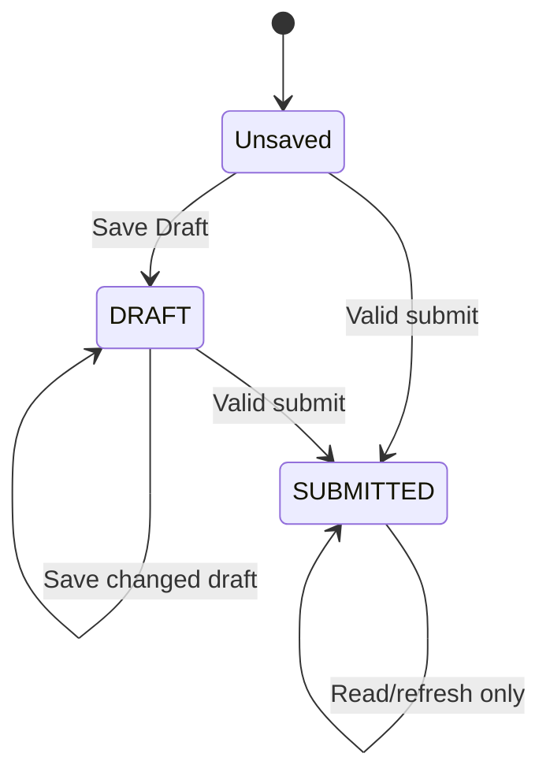

# Farmer Part 2: FarmCard, FarmDiary, and FSPP Approval Business Rules

## 1. Scope and Explicit Exclusions

This specification describes the technology-independent behavior evidenced in the original Field Commander application for FarmCard creation, draft/resume, review and display; FarmDiary setup, profile, calendar, visits and history; crop-observation capture; and the FSPP approval boundary that controls FarmCard access.

Farmer onboarding, Farmer Hub, General Visit and FSPP scoring are described only where they gate or supply data to these workflows. Their complete rules remain in `business-rules/farmer-part-1.md`. Attendance, travel, reports and expenses are limited to active-shift and activity-log integration. Dealer, distributor, FPO and retail behavior is out of scope.

Sections 3–27 and 29 describe required behavior or unresolved behavior without prescribing a version-2 architecture. Original frameworks, storage products, table names and source-level mechanics are confined to sections 2 and 28.

The supplied automatic FSPP approval rule is normative: exact `Category A` and `Category B` classifications produce `APPROVED`; every other, missing, null or unrecognized classification produces `PENDING`. No server-side source is present in this repository, so the precise record-creation event, later mutation authority and recalculation policy remain unverified.

## 2. Repository Evidence Map

### Screens and components

| Evidence | Why it matters |
| --- | --- |
| `Frontend/src/modules/FarmCard/screens/FarmCardOnboardingScreen.tsx` | Six-step order, language switch, back/next/review/submit and draft controls |
| `Frontend/src/modules/FarmCard/screens/steps/Step1FarmerProfile.tsx` | Locked inherited identity and socio-economic fields |
| `Frontend/src/modules/FarmCard/screens/steps/Step2LandAndWater.tsx` | Land, area, water-source and irrigation inputs and conditional water quality |
| `Frontend/src/modules/FarmCard/screens/steps/Step3SoilAndHistory.tsx` | Soil values, test-date condition and repeatable crop history |
| `Frontend/src/modules/FarmCard/screens/steps/Step4InfraAndLivestock.tsx` | Brands, market, machinery, livestock, waste and neighborhood risk |
| `Frontend/src/modules/FarmCard/screens/steps/Step5MediaAndDigital.tsx` | Boundary, evidence media, removal/preview and digital-adoption checklist |
| `Frontend/src/modules/FarmCard/screens/steps/Step6Review.tsx` | Review summaries, media indicators and edit-return behavior |
| `Frontend/src/modules/FarmCard/screens/components/BoundaryCaptureModal.tsx` | Walk/draw modes, point thresholds, search, undo/clear, permission and snapshot behavior |
| `Frontend/src/modules/FarmCard/screens/FarmCardsListScreen.tsx` | Multiple-card list, draft resume, details routing, refresh and first-card redirect |
| `Frontend/src/modules/FarmCard/screens/FarmCardDetailsScreen.tsx` | Read-only submitted detail, conditional fields/media, status and refresh |
| `Frontend/src/modules/FarmDiary/screens/setup/FarmDiarySetupScreen.tsx` | Four-step create/edit flow, prerequisites, fields, polygon and transformations |
| `Frontend/src/modules/FarmDiary/screens/FarmDiaryHubScreen.tsx` | FarmCard grouping, diary creation and no-card empty state |
| `Frontend/src/modules/FarmDiary/screens/VillageFarmDiariesScreen.tsx` | Village-level loading, refresh, empty state and farmer cards |
| `Frontend/src/modules/FarmDiary/components/FarmDiaryEntityCard.tsx` | Farmer facts, phone action and current/next stage display |
| `Frontend/src/modules/FarmDiary/screens/visit/FarmDiaryDashboardScreen.tsx` | Profile/calendar/history entry and active-shift visit gate |
| `Frontend/src/modules/FarmDiary/screens/visit/FarmDiaryProfileScreen.tsx` | Read-only profile/map and unrestricted edit entry |
| `Frontend/src/modules/FarmDiary/screens/visit/FarmDiaryCalendarScreen.tsx` | Sowing prerequisite, SOP timeline, expected-date formula and status colors |
| `Frontend/src/modules/FarmDiary/screens/visit/MandatoryBaseVisitScreen.tsx` | Visit number, base fields, conditional inputs, media and handoff to observation |
| `Frontend/src/modules/FarmDiary/screens/visit/CropObservationScreen.tsx` | Crop/stage defaults, five sample tabs, dynamic controls, photo and submit rules |
| `Frontend/src/modules/FarmDiary/components/HistoryLedgerList.tsx` | Ledger loading/empty state, chronological visit numbering and health display |
| `Frontend/src/modules/FarmDiary/screens/visit/VisitDetailsScreen.tsx` | Base/observation details and per-parameter averages |

### Hooks, validation, services and state

| Evidence | Why it matters |
| --- | --- |
| `Frontend/src/modules/FarmCard/hooks.ts` | Defaults inherited from farmer, strict final completeness scan, media/GPS, draft and submit |
| `Frontend/src/modules/FarmCard/schema.ts` | FarmCard shape, pH range and same-unit cultivated-area validation |
| `Frontend/src/modules/FarmCard/services/farmCardService.ts` | Create/update, `DRAFT`/`SUBMITTED`, ownership links and farmer completion flag |
| `Frontend/src/store/farmDiaryStore.ts` | Diary CRUD, visit numbering, dynamic parameters, observation writes/rollback/retry and ledger composition |
| `Frontend/src/modules/FarmDiary/services/villageFarmDiaryService.ts` | FarmCard eligibility, village enrichment and current/next SOP stage derivation |
| `Frontend/src/modules/FSPP/hooks.ts` | Source and exact casing of stored FSPP category; no approval-status producer |

### Navigation, authorization and shared behavior

| Evidence | Why it matters |
| --- | --- |
| `Frontend/src/modules/dashboard/screens/FarmerHubScreen.tsx` | Submitted-farmer, permission, FSPP and FarmCard/FarmDiary gates |
| `Frontend/src/modules/dashboard/screens/DashboardScreen.tsx` | Village FarmDiary entry and farmer stage filters |
| `Frontend/src/design-system/components/EntityCard.tsx` | Onboarded/FSPP/FarmCard progress display |
| `Frontend/src/modules/dashboard/screens/EntityProfileScreen.tsx` | FSPP category/status-label display, but not approval status |
| `Frontend/src/navigation/AppNavigator.tsx` | Authentication-only route registration and global offline replacement |
| `Frontend/src/core/usePermissions.ts` | Role and module view/edit resolution; cached permission behavior |
| `Frontend/src/store/authStore.ts`, `alertStore.ts`, `shiftStore.ts` | Actor identity, global feedback and active-shift/activity integration |
| `Frontend/src/core/permissions.ts`, `imageCompressor.ts` | Central FarmCard camera fallback and image compression behavior |
| `Frontend/src/core/database.ts`, `OfflineSyncManager.tsx`, `locationTracker.ts`, `locationUtils.ts` | Only shift coordinates are queued offline; target records are not |
| `Frontend/src/core/i18n.ts`, `Frontend/locales/*.json` | English/Hindi/Gujarati resources and English fallback |
| `Frontend/src/modules/onboarding/services/cloudinaryService.ts` | Original retrievable-media-reference upload behavior |

### Backend evidence search

No migration, SQL schema, policy, trigger, procedure, server, backend or API implementation directory was found. Client requests identify data interactions but do not prove server authorization, constraints or the supplied automatic FSPP decision.

## 3. Actors, Roles, Eligibility, and Permissions

| Actor | Evidenced capability |
| --- | --- |
| Authenticated field user | Can reach registered target routes; writes carry the current actor where implemented |
| Sales Executive (SE) | Receives default farmer view/edit permissions and is recorded on FarmCards/base visits |
| Territory Head / Super Admin | Client permission resolver grants full module access |
| Other configured role | Receives configured module view/edit flags |
| Farmer | Subject linked to cards/diaries; no farmer-login workflow is evidenced |
| Approval authority | Not identified in repository; manual approval UI is absent |

### FP2-A01 — Authenticated route boundary

- Rule: FarmCard, FarmDiary and crop-observation routes must require an authenticated session.
- Business purpose: Protect farmer and farm operational data.
- Trigger/condition: Session exists versus is absent or signed out.
- Behavior/result: Target routes are registered only for authenticated users; the persisted session is automatically cleared after seven days.
- Actor/role: Any application user.
- Affected workflow: All Part-2 workflows.
- UX behavior: Authentication screens replace application routes after sign-out.
- Validation/error behavior: Some write functions silently return or report unauthorized when actor identity is absent.
- Online/offline behavior: The route set is also replaced by a global offline screen.
- Enforcement requirement: Both route access and every read/write require authoritative authorization.
- Dependencies: Session and current actor identity.
- Original implementation evidence:
  - `Frontend/src/navigation/AppNavigator.tsx:96-195` — `AppNavigator`
  - `Frontend/src/core/AutoLogoutProvider.tsx:7-57` — `AutoLogoutProvider`
  - `Frontend/src/modules/FarmCard/hooks.ts:185-187,300-303` — `submit`, `saveDraft`
  - `Frontend/src/store/farmDiaryStore.ts:198-203` — `startBaseVisit`
- Confidence: High

### FP2-A02 — Farmer-module permission boundary

- Rule: FarmCard and FarmDiary entry points must be visible only to actors with farmer-view capability; protected writes must independently require write authority.
- Business purpose: Separate data visibility from mutation authority.
- Trigger/condition: Farmer is submitted, actor has `can_view`, and workflow prerequisites are met.
- Behavior/result: Hub and village FarmDiary actions are hidden without view access.
- Actor/role: SE, TH, Super Admin or configured role.
- Affected workflow: Farmer Hub, FarmCard entry, FarmDiary entry, village diaries.
- UX behavior: Hidden actions provide no target-specific access-denied screen.
- Validation/error behavior: Target screens do not recheck permissions when directly routed.
- Online/offline behavior: Cached permission flags can render before refresh.
- Enforcement requirement: Visibility is not authorization; direct-route and server-side checks are required.
- Dependencies: Role, permission profile and farmer status.
- Original implementation evidence:
  - `Frontend/src/modules/dashboard/screens/FarmerHubScreen.tsx:16-23,191-290` — `FarmerHubScreen`
  - `Frontend/src/modules/dashboard/screens/DashboardScreen.tsx:956-973` — village FarmDiary action
  - `Frontend/src/core/usePermissions.ts:27-103` — `usePermissions`
- Confidence: High

### FP2-A03 — Submitted farmer prerequisite

- Rule: FarmCard/FarmDiary Hub actions must not be offered for a farmer onboarding draft.
- Business purpose: Ensure downstream records link to an established farmer.
- Trigger/condition: Farmer entity is a draft.
- Behavior/result: FSPP, FarmCard and FarmDiary actions are hidden; resume onboarding remains available.
- Actor/role: Farmer-data viewer.
- Affected workflow: Farmer Hub entry.
- UX behavior: Draft state shows “Resume Onboarding” and “Draft Incomplete.”
- Validation/error behavior: Direct target routes do not validate that the farmer is submitted.
- Online/offline behavior: No target-specific offline exception.
- Enforcement requirement: Record creation must validate the linked farmer is eligible, not rely on the Hub.
- Dependencies: Farmer lifecycle state.
- Original implementation evidence:
  - `Frontend/src/modules/dashboard/screens/FarmerHubScreen.tsx:71-82,112-155,191-290` — `FarmerHubScreen`
- Confidence: High

### FP2-A04 — FarmCard FSPP gate

- Rule: FarmCard access requires a completed FSPP assessment and either exact Category A/Category B or an authoritative `APPROVED` result.
- Business purpose: Restrict FarmCard generation to qualified or explicitly approved farmers.
- Trigger/condition: Farmer is submitted and FSPP status label exists.
- Behavior/result: Before FSPP the FarmCard action is hidden; after FSPP it is enabled for A/B or approval and disabled otherwise.
- Actor/role: Authorized farmer viewer.
- Affected workflow: Farmer Hub to FarmCard list.
- UX behavior: Ineligible action remains visible, disabled, dimmed and labeled “Locked: Not Approved”; an approval override on a non-A/B category shows “Approved.”
- Validation/error behavior: FarmCard list/onboarding does not repeat this gate.
- Online/offline behavior: Uses the last loaded farmer record; refresh reloads it when online.
- Enforcement requirement: Qualification/approval must be checked authoritatively at create and update time.
- Dependencies: Stored FSPP status label, category and approval result.
- Original implementation evidence:
  - `Frontend/src/modules/dashboard/screens/FarmerHubScreen.tsx:76-82,228-266` — `canAccessFarmCards`
- Confidence: High

### FP2-A05 — FarmDiary FarmCard gate

- Rule: A FarmDiary requires an existing FarmCard linked to the same farmer.
- Business purpose: Anchor crop monitoring to a defined farm.
- Trigger/condition: FarmDiary entry or setup.
- Behavior/result: Hub action is hidden until any FarmCard exists; setup requires a selected FarmCard; no-card Hub shows an instruction.
- Actor/role: Authorized farmer viewer.
- Affected workflow: Farmer Hub, FarmDiary Hub and setup.
- UX behavior: “No Farm Cards found. Create a Farm Card first…” appears when none load.
- Validation/error behavior: Setup blocks save without a selected card, but does not verify card status or same-farmer ownership at save.
- Online/offline behavior: Live lookup only; unavailable offline.
- Enforcement requirement: The relationship, ownership and eligibility must be validated on every create/update.
- Dependencies: Farmer and FarmCard.
- Original implementation evidence:
  - `Frontend/src/modules/dashboard/screens/FarmerHubScreen.tsx:28-47,268-290` — `checkFarmCards`
  - `Frontend/src/modules/FarmDiary/screens/FarmDiaryHubScreen.tsx:22-64` — `FarmDiaryHubScreen`
  - `Frontend/src/modules/FarmDiary/screens/setup/FarmDiarySetupScreen.tsx:100-104,152-158` — `handleSave`, `handleNext`
- Confidence: High

### FP2-A06 — Record ownership and assignment

- Rule: Every FarmCard, diary, visit and observation must remain linked to its farmer/farm and authorized actor; users must not access arbitrary identifiers.
- Business purpose: Preserve tenant and assignment isolation.
- Trigger/condition: Any target record is read, created or updated.
- Behavior/result: FarmCards carry farmer and field-actor links; diaries carry farmer and FarmCard links; visits carry diary and field-actor links; observations carry diary/base-visit links.
- Actor/role: Authorized field actor.
- Affected workflow: All persistence operations.
- UX behavior: No reassignment or ownership editor exists.
- Validation/error behavior: Client updates by supplied record ID and does not confirm ownership; server policies are unavailable.
- Online/offline behavior: All target writes are online.
- Enforcement requirement: Relationship and ownership checks are authoritative and cannot be bypassed with crafted route data.
- Dependencies: Actor, farmer, FarmCard, diary and visit identifiers.
- Original implementation evidence:
  - `Frontend/src/modules/FarmCard/services/farmCardService.ts:4-28` — `saveFarmCard`
  - `Frontend/src/modules/FarmDiary/screens/setup/FarmDiarySetupScreen.tsx:109-136` — `payload`
  - `Frontend/src/store/farmDiaryStore.ts:198-249,344-409` — `startBaseVisit`, `saveCropObservation`
- Confidence: High for client relationships; Medium for actual isolation

## 4. FarmCard Entities and Data Contracts

| Entity | Technology-neutral contract |
| --- | --- |
| FarmCard | Farmer, responsible field actor, lifecycle status, complete card payload, boundary points, media references, media capture metadata and update time |
| Inherited farmer baseline | Farmer ID/name/mobile/location, farm land/soil/water/irrigation, crop history, cattle and equipment copied as initial values |
| Boundary | Ordered latitude/longitude points plus optional visual snapshot; no stored area calculation is evidenced |
| Yield-history row | Year, season, crop, area/unit, input cost, total 20kg bulk, yield per acre and price per quintal |
| Media set | Optional boundary snapshot; mandatory soil-squeeze and lab/pH evidence at final submit; per-item capture location/time metadata where camera capture is used |

Transformations with business impact:

- Goats/sheep and poultry counts inherited from onboarding are summed into one FarmCard field.
- Cow, buffalo and ox/bull counts are inherited by matching text labels.
- “Tractor” or “Mini Tractor” preselects “Own Tractor.”
- Farmer crop history splits `yearSeason` on `-`; missing values become empty and area unit defaults to Acres.
- Draft payload overlays inherited defaults, so saved draft values take precedence.
- Final submission changes the same draft record when a draft ID is supplied; otherwise a new card is created.

## 5. Complete FarmCard Workflow

### FP2-FC01 — Entry and multiple-card behavior

- Rule: An eligible farmer may have multiple FarmCards, each representing one farm/plot for that farmer.
- Business purpose: Represent multiple farms separately.
- Trigger/condition: Eligible user opens Farm Cards.
- Behavior/result: Zero cards redirects directly to creation; one or more cards shows newest first and an “Add Another Farm Card” action.
- Actor/role: Authorized farmer viewer.
- Affected workflow: FarmCard list and creation.
- UX behavior: Cards are numbered by current reverse-list position, not a persistent farm number.
- Validation/error behavior: No duplicate field/plot/survey prevention exists.
- Online/offline behavior: Online lookup only.
- Enforcement requirement: Multiplicity is allowed; version 2 must define or preserve duplicate handling explicitly.
- Dependencies: Eligible farmer.
- Original implementation evidence:
  - `Frontend/src/modules/FarmCard/screens/FarmCardsListScreen.tsx:19-53,129-215` — `FarmCardsListScreen`
- Confidence: High

### FP2-FC02 — Six-step order and navigation

- Rule: FarmCard data is presented in six ordered steps: profile; land/water; soil/history; infrastructure/livestock/risks; media/digital; review.
- Business purpose: Break a large assessment into understandable sections.
- Trigger/condition: FarmCard creation/resume.
- Behavior/result: Next advances without step validation; back decrements or exits at step 1; review edit jumps to a selected step and provides Return to Review.
- Actor/role: FarmCard editor.
- Affected workflow: FarmCard wizard.
- UX behavior: Header shows step N of 6 and progress N/6.
- Validation/error behavior: Most incompleteness is discovered only at final submit.
- Online/offline behavior: Wizard route is globally unavailable offline.
- Enforcement requirement: Final validity must not depend on users visiting steps in order.
- Dependencies: Wizard state.
- Original implementation evidence:
  - `Frontend/src/modules/FarmCard/screens/FarmCardOnboardingScreen.tsx:28-86` — `renderStep`, footer and `onBack`
  - `Frontend/src/modules/FarmCard/screens/steps/Step6Review.tsx:37-45` — `ReviewSection`
- Confidence: High

### FP2-FC03 — Draft save and resume

- Rule: Partially completed FarmCards can be saved and later resumed from the same data.
- Business purpose: Prevent loss during long field assessments.
- Trigger/condition: Form has changed and user selects Save Draft.
- Behavior/result: Current values and uploaded media references are saved with `DRAFT`; existing draft is updated; success returns to the prior screen; selecting a draft resumes it.
- Actor/role: Authenticated FarmCard editor.
- Affected workflow: Wizard and card list.
- UX behavior: Draft button is disabled when pristine or final submission is active and has its own loading indicator.
- Validation/error behavior: Draft bypasses completeness/schema submission checks; upload/save errors keep the form and show an error.
- Online/offline behavior: Draft save uploads local media and writes remotely; no local fallback or sync queue exists.
- Enforcement requirement: Drafts must be restorable, actor-scoped and distinct from submitted records.
- Dependencies: Actor, farmer, optional existing draft ID.
- Original implementation evidence:
  - `Frontend/src/modules/FarmCard/hooks.ts:88-93,300-365` — defaults and `saveDraft`
  - `Frontend/src/modules/FarmCard/screens/FarmCardOnboardingScreen.tsx:60-68` — draft control
  - `Frontend/src/modules/FarmCard/screens/FarmCardsListScreen.tsx:129-140` — draft resume
- Confidence: High

### FP2-FC04 — Final completeness and submission

- Rule: Final submission requires every supplied top-level field except digital adoption, media GPS and boundary points; soil-test date and crop barrier are conditionally required; soil-squeeze and lab-report evidence are mandatory.
- Business purpose: Produce a complete field baseline.
- Trigger/condition: Submit on review.
- Behavior/result: Blank strings, empty arrays, arrays containing blank strings and yield rows with any blank string block submission.
- Actor/role: FarmCard editor.
- Affected workflow: Final review/submit.
- UX behavior: One generic “Incomplete Farm Card” alert is shown; missing fields are not enumerated or focused.
- Validation/error behavior: Boundary snapshot/points are not mandatory despite media task wording. Invalid schema values also prevent the submit callback.
- Online/offline behavior: Submission requires uploads and remote persistence.
- Enforcement requirement: Conditional requiredness and media completion must be enforced authoritatively with field-specific feedback.
- Dependencies: Complete payload and evidence uploads.
- Original implementation evidence:
  - `Frontend/src/modules/FarmCard/hooks.ts:185-233` — `submit` completeness scan
  - `Frontend/src/modules/FarmCard/schema.ts:32-39,112-125` — validation
- Confidence: High

### FP2-FC05 — Upload-before-finalization

- Rule: Locally captured FarmCard media must become retrievable references before the card is finalized.
- Business purpose: Avoid submitted records that reference device-only files.
- Trigger/condition: Draft or submit contains local media.
- Behavior/result: All media uploads are awaited; resulting references replace local paths in persisted documents; failure blocks the save.
- Actor/role: FarmCard editor.
- Affected workflow: Draft and final submit.
- UX behavior: Save/submit loading is shown; error reports upload or save failure.
- Validation/error behavior: Existing remote references are retained; empty media entries are omitted from final media map.
- Online/offline behavior: No deferred media upload.
- Enforcement requirement: Final records must never contain local-only references.
- Dependencies: Media service and network.
- Original implementation evidence:
  - `Frontend/src/modules/FarmCard/hooks.ts:237-264,305-333` — upload batches
  - `Frontend/src/modules/onboarding/services/cloudinaryService.ts:31-40` — upload success contract
- Confidence: High

### FP2-FC06 — Submission completion effects

- Rule: Successful submission changes the card to `SUBMITTED`, marks the farmer as having a FarmCard, records one activity and returns to the main application.
- Business purpose: Expose downstream FarmDiary and operational reporting.
- Trigger/condition: Card and media save succeeds.
- Behavior/result: Existing draft transitions to submitted or a new submitted card is created; farmer completion flag is set.
- Actor/role: Authenticated FarmCard editor.
- Affected workflow: FarmCard completion, Farmer Hub, dashboard progress and travel activity.
- UX behavior: “Farm Card generated and secured” is shown, then navigation goes to main tabs.
- Validation/error behavior: Failure to update the farmer completion flag is not checked, so card success and downstream flag can diverge.
- Online/offline behavior: Online only.
- Enforcement requirement: Card finalization and farmer eligibility projection must be consistent and recoverable.
- Dependencies: Card persistence, farmer record and activity log.
- Original implementation evidence:
  - `Frontend/src/modules/FarmCard/hooks.ts:265-296` — `submit`
  - `Frontend/src/modules/FarmCard/services/farmCardService.ts:30-37` — `saveFarmCard`
- Confidence: High

## 6. FarmCard Step-by-Step Rules

### FP2-FC07 — Locked inherited farmer identity

- Rule: Farmer name, mobile, state, district, taluka and village are inherited and read-only in FarmCard.
- Business purpose: Prevent FarmCard identity from diverging during creation.
- Trigger/condition: Wizard initialization.
- Behavior/result: Values are copied from farmer data; the entire baseline identity block ignores interaction.
- Actor/role: FarmCard editor.
- Affected workflow: Step 1.
- UX behavior: Block is labeled “Baseline Identity (Locked)” and visually muted.
- Validation/error behavior: Missing inherited values still become mandatory at final submit; no repair link is provided.
- Online/offline behavior: Uses route-supplied farmer data.
- Enforcement requirement: Identity must link to the farmer; corrections occur through the authoritative farmer workflow.
- Dependencies: Farmer profile.
- Original implementation evidence:
  - `Frontend/src/modules/FarmCard/hooks.ts:29-85` — `fallbackDefaults`
  - `Frontend/src/modules/FarmCard/screens/steps/Step1FarmerProfile.tsx:24-74` — locked block
- Confidence: High

### FP2-FC08 — Socio-economic inputs

- Rule: WhatsApp, education, farming experience, family members and labor type are collected; all are final-submit mandatory in version 1.
- Business purpose: Complete the farm operator profile.
- Trigger/condition: Step 1.
- Behavior/result: Education accepts Illiterate/Primary/Secondary/Graduate; labor accepts Family/Hired/Both; WhatsApp is limited to 10 entered characters.
- Actor/role: FarmCard editor.
- Affected workflow: Step 1.
- UX behavior: Experience and family use numeric keyboards, but values remain text.
- Validation/error behavior: No digit-only, positivity, phone pattern or range validation exists.
- Online/offline behavior: Form-local until save.
- Enforcement requirement: Preserve allowed choices; numeric/phone integrity remains unresolved rather than inferred.
- Dependencies: None beyond FarmCard.
- Original implementation evidence:
  - `Frontend/src/modules/FarmCard/screens/steps/Step1FarmerProfile.tsx:76-101` — `Step1FarmerProfile`
  - `Frontend/src/modules/FarmCard/schema.ts:9,14-17` — field schema
- Confidence: High

### FP2-FC09 — Land inventory and units

- Rule: Legal owner, field, plot, survey number, land status, total area, cultivated area and FSPP committed area are collected; area units are Acres or Bigha.
- Business purpose: Identify and quantify the represented plot.
- Trigger/condition: Step 2.
- Behavior/result: Land status is Irrigated or Rainfed; inherited total area/unit and inferred land status prefill where available.
- Actor/role: FarmCard editor.
- Affected workflow: Step 2 and details.
- UX behavior: Paired value/unit controls are used.
- Validation/error behavior: All fields are final-submit mandatory; no positive-number, format, uniqueness or unit-conversion validation exists.
- Online/offline behavior: Form-local until save.
- Enforcement requirement: Values and units must remain paired and unambiguous.
- Dependencies: Farmer farm details.
- Original implementation evidence:
  - `Frontend/src/modules/FarmCard/hooks.ts:69-76` — defaults
  - `Frontend/src/modules/FarmCard/screens/steps/Step2LandAndWater.tsx:28-64` — land controls
- Confidence: High

### FP2-FC10 — Cultivated-area constraint

- Rule: Cultivated area must not exceed total area when both values use the same unit.
- Business purpose: Prevent impossible land allocation.
- Trigger/condition: Both values are numeric and units match.
- Behavior/result: An inline “Exceeds Total Area” error appears and schema validation rejects the value.
- Actor/role: FarmCard editor.
- Affected workflow: Step 2 and submit.
- UX behavior: No comparison occurs for mixed units.
- Validation/error behavior: Negative and zero values are accepted; FSPP committed area is not compared to either area.
- Online/offline behavior: Local validation.
- Enforcement requirement: Preserve the evidenced same-unit rule; mixed-unit and committed-area rules are unresolved.
- Dependencies: Total/cultivated values and units.
- Original implementation evidence:
  - `Frontend/src/modules/FarmCard/screens/steps/Step2LandAndWater.tsx:15-20,45-59` — `isCultAreaExceeding`
  - `Frontend/src/modules/FarmCard/schema.ts:112-125` — `superRefine`
- Confidence: High

### FP2-FC11 — Water and irrigation inputs

- Rule: Water sources, irrigation methods, per-selected-source TDS/pH, availability, frequency, pump and drip/sprinkler area are captured.
- Business purpose: Establish water assets and quality.
- Trigger/condition: Step 2; source-specific quality controls appear only when one or more sources are selected.
- Behavior/result: Sources: Borewell/Canal/Rain/Tank/River; methods: Drip/Sprinkler/Flood/Furrow; availability: Sufficient/Moderate/Scarce; frequency: Daily/Alternate/Weekly.
- Actor/role: FarmCard editor.
- Affected workflow: Step 2.
- UX behavior: Removing a source hides its quality inputs but does not explicitly clear stored keyed values.
- Validation/error behavior: Final scan requires nonempty source/method arrays and other visible fields; it does not recursively validate water-quality records, ranges or stale keys.
- Online/offline behavior: Form-local until save.
- Enforcement requirement: Per-source quality must remain associated with the selected source.
- Dependencies: Selected water sources.
- Original implementation evidence:
  - `Frontend/src/modules/FarmCard/screens/steps/Step2LandAndWater.tsx:66-129` — water controls
  - `Frontend/src/modules/FarmCard/schema.ts:49-57` — water contract
- Confidence: High

### FP2-FC12 — Soil and soil-test conditions

- Rule: Soil type, pH, EC, organic matter, N/P/K, drainage and soil-test status are collected; test date is required only when status is Yes and cannot be future-dated through the picker.
- Business purpose: Establish baseline soil health.
- Trigger/condition: Step 3; status Yes shows date, No clears it.
- Behavior/result: Soil types are Sandy/Loamy/Clay/Black/Red; drainage Good/Moderate/Poor; pH must be 0–14.
- Actor/role: FarmCard editor.
- Affected workflow: Step 3, review and details.
- UX behavior: Values greater than 14 are blocked during typing; schema also rejects outside 0–14.
- Validation/error behavior: Manual date validity is delegated to shared date input; all other numeric ranges are unenforced.
- Online/offline behavior: Crop master loading is online, soil fields are local until save.
- Enforcement requirement: Conditional date and pH range must be consistent at all layers.
- Dependencies: Soil-test status.
- Original implementation evidence:
  - `Frontend/src/modules/FarmCard/screens/steps/Step3SoilAndHistory.tsx:42-83` — soil controls
  - `Frontend/src/modules/FarmCard/schema.ts:32-47` — pH/test fields
- Confidence: High

### FP2-FC13 — Repeatable yield history

- Rule: At least one complete yield-history row is required; additional seasons can be added and all but the first can be removed.
- Business purpose: Capture multi-season performance.
- Trigger/condition: Step 3.
- Behavior/result: Each row has year, Monsoon/Winter/Summer, active-master crop, area/unit, input cost, yield, price and total 20kg bulk.
- Actor/role: FarmCard editor.
- Affected workflow: Step 3, review and details.
- UX behavior: Crop choices are sorted/deduplicated; until loaded, a literal “Loading...” option is presented.
- Validation/error behavior: Any blank string in any row blocks final submission; numeric ranges and cross-field formulas are absent. Inherited farmer history expects source properties that farmer onboarding does not persist (`yearSeason` and `inputCost`) and maps source yield into the 20kg-bulk field, so inherited rows can be incomplete or semantically wrong.
- Online/offline behavior: Active crop choices require network; inherited rows can still render.
- Enforcement requirement: Master-data failure must not allow placeholder values to masquerade as crops.
- Dependencies: Active crop catalog and farmer crop history.
- Original implementation evidence:
  - `Frontend/src/modules/FarmCard/hooks.ts:49-56,77` — inherited/default rows
  - `Frontend/src/modules/FarmCard/screens/steps/Step3SoilAndHistory.tsx:17-36,85-129` — yield history
  - `Frontend/src/modules/FarmCard/hooks.ts:216-223` — completeness scan
  - `Frontend/src/modules/onboarding/services/onboardingService.ts:248-256` — farmer history source shape
- Confidence: High

### FP2-FC14 — Market, machinery and livestock profile

- Rule: The card captures repeatable chemical/biological brands, decision factor, sales/transport/payment choices, machinery, livestock counts, FYM, residue management and compost willingness.
- Business purpose: Profile operational capacity and commercial behavior.
- Trigger/condition: Step 4.
- Behavior/result: Choices are limited to the explicit option lists displayed in the original UI; brand lists start with one mandatory row.
- Actor/role: FarmCard editor.
- Affected workflow: Step 4, review and details.
- UX behavior: Brand rows can be added; remove is available only when more than one exists.
- Validation/error behavior: Final scan requires all arrays nonempty and every brand string nonblank; counts/amounts have no positivity or integer checks.
- Online/offline behavior: Form-local until save.
- Enforcement requirement: Enumerated values and repeatable-list semantics must remain stable.
- Dependencies: Inherited equipment/livestock defaults.
- Original implementation evidence:
  - `Frontend/src/modules/FarmCard/screens/steps/Step4InfraAndLivestock.tsx:15-132` — profile controls
  - `Frontend/src/modules/FarmCard/hooks.ts:38-48,78-83` — inherited defaults
- Confidence: High

### FP2-FC15 — Neighborhood-risk condition

- Rule: Runoff risk, spray-drift risk, edge plantation and pest vector are required; crop barrier is required and visible only when edge plantation is Yes.
- Business purpose: Record contamination and pest pathways.
- Trigger/condition: Step 4 and edge-plantation answer.
- Behavior/result: No hides the crop-barrier control and exempts it at submit; Yes shows Sorghum/Maize/Other.
- Actor/role: FarmCard editor.
- Affected workflow: Step 4, review and details.
- UX behavior: Details also hides crop barrier unless edge plantation remains Yes.
- Validation/error behavior: Switching from Yes to No does not clear an existing crop-barrier value.
- Online/offline behavior: Form-local until save.
- Enforcement requirement: Hidden conditional data must have a defined retention policy.
- Dependencies: Edge-plantation answer.
- Original implementation evidence:
  - `Frontend/src/modules/FarmCard/screens/steps/Step4InfraAndLivestock.tsx:135-148` — risk controls
  - `Frontend/src/modules/FarmCard/hooks.ts:196-198` — conditional completeness
  - `Frontend/src/modules/FarmCard/screens/FarmCardDetailsScreen.tsx:219-227` — details condition
- Confidence: High

## 7. FarmCard Boundary, Land, Water, Soil, Infrastructure, Livestock, and Media Rules

### FP2-FC16 — Boundary walk mode

- Rule: A boundary can be captured by walking its perimeter; locking is available only after at least four points and after tracking stops.
- Business purpose: Capture a physical plot polygon.
- Trigger/condition: Walk mode and location permission granted.
- Behavior/result: Tracking resets prior points, records high-accuracy positions every second or meter, shows live count and fits the map after stop.
- Actor/role: FarmCard/diary editor.
- Affected workflow: FarmCard media and FarmDiary setup.
- UX behavior: Start becomes Stop while tracking; after points exist it becomes Re-Start Walk.
- Validation/error behavior: Permission denial shows an explanation; no self-intersection, closure, containment or coordinate-range validation exists.
- Online/offline behavior: GPS capture may work locally, but the globally blocked route and map/search dependencies prevent an offline workflow.
- Enforcement requirement: Minimum point count is four in walk mode; geometric validity remains unresolved.
- Dependencies: Foreground location permission and device location.
- Original implementation evidence:
  - `Frontend/src/modules/FarmCard/screens/components/BoundaryCaptureModal.tsx:107-138,264-283` — tracking/actions
- Confidence: High

### FP2-FC17 — Manual boundary draw mode

- Rule: A boundary can be drawn by ordered map taps; lock is available at three or more points, with undo and clear controls.
- Business purpose: Provide an alternative to perimeter walking.
- Trigger/condition: Draw mode.
- Behavior/result: Switching modes stops tracking and clears points; location search recenters the map; lock captures a snapshot and ordered point list.
- Actor/role: FarmCard/diary editor.
- Affected workflow: FarmCard media and FarmDiary setup.
- UX behavior: Search exists only in draw mode; undo/clear are disabled at zero points.
- Validation/error behavior: Empty search does nothing; not-found and network search failures show alerts.
- Online/offline behavior: Search explicitly depends on connectivity; no offline map guarantee.
- Enforcement requirement: Minimum point count is three in draw mode.
- Dependencies: Map/geocoding availability.
- Original implementation evidence:
  - `Frontend/src/modules/FarmCard/screens/components/BoundaryCaptureModal.tsx:65-105,140-170,176-243,284-310` — draw/search/save
- Confidence: High

### FP2-FC18 — Boundary evidence optionality

- Rule: Version 1 labels boundary capture as a validation task but permits FarmCard submission without boundary points or boundary snapshot.
- Business purpose: Observed behavior; intended purpose appears to be field verification.
- Trigger/condition: Final completeness scan.
- Behavior/result: Boundary points are explicitly optional and boundary snapshot is excluded from mandatory document checks.
- Actor/role: FarmCard editor.
- Affected workflow: Step 5 and submit.
- UX behavior: Review shows a failed/missing boundary indicator but submit remains available.
- Validation/error behavior: No boundary-specific submit error.
- Online/offline behavior: Not applicable beyond normal online submission.
- Enforcement requirement: Version 2 must resolve whether boundary is truly optional; it must not silently claim mandatory capture while accepting absence.
- Dependencies: Documents and polygon.
- Original implementation evidence:
  - `Frontend/src/modules/FarmCard/hooks.ts:188-203` — optional/mandatory list
  - `Frontend/src/modules/FarmCard/screens/steps/Step5MediaAndDigital.tsx:87-91` — task labels
  - `Frontend/src/modules/FarmCard/screens/steps/Step6Review.tsx:97-103` — indicators
- Confidence: High

### FP2-FC19 — Evidence capture, GPS and time

- Rule: Soil-squeeze and lab/pH media capture requires camera and foreground location permission; successful capture records location and an India-time display timestamp.
- Business purpose: Associate evidence with place and time.
- Trigger/condition: User starts a non-boundary evidence capture.
- Behavior/result: Soil squeeze permits photo or up-to-15-second video; lab evidence is photo-only; quality is 0.6.
- Actor/role: FarmCard editor.
- Affected workflow: Step 5.
- UX behavior: Denied camera or GPS blocks capture with an alert; cancellation leaves data unchanged; capture failure shows “Capture failed.”
- Validation/error behavior: Media metadata is optional at final submission and is not displayed on details.
- Online/offline behavior: Local capture precedes online upload at save.
- Enforcement requirement: Required evidence must have a retrievable reference; required GPS policy must be explicit and non-bypassable if retained.
- Dependencies: Camera, foreground location and media upload.
- Original implementation evidence:
  - `Frontend/src/modules/FarmCard/hooks.ts:97-167` — `handleCameraUpload`
- Confidence: High

### FP2-FC20 — Media preview, replace and removal

- Rule: Captured media can be previewed full-screen and removed; removal also clears associated GPS metadata and, for boundary, polygon points.
- Business purpose: Allow correction before submission.
- Trigger/condition: A media item exists.
- Behavior/result: Capture control is replaced by preview/status/delete; after delete, capture control returns.
- Actor/role: FarmCard editor.
- Affected workflow: Step 5.
- UX behavior: There is no separate replace action; delete then recapture is required.
- Validation/error behavior: Removing required soil/lab media makes final submission invalid.
- Online/offline behavior: Removal is local until next save.
- Enforcement requirement: Media and its metadata must be removed atomically.
- Dependencies: Documents, media metadata and polygon.
- Original implementation evidence:
  - `Frontend/src/modules/FarmCard/screens/steps/Step5MediaAndDigital.tsx:31-79,113-135` — `renderPhotoTask`
- Confidence: High

## 8. FarmCard Review and Details-Screen Rules

### FP2-FC21 — Review behavior

- Rule: Review summarizes five input sections, marks missing media, and lets the user edit a section then return to review.
- Business purpose: Confirm data before finalization.
- Trigger/condition: Step 6.
- Behavior/result: Missing scalar/array values show N/A; selected summary fields and all yield rows are displayed.
- Actor/role: FarmCard editor.
- Affected workflow: Review.
- UX behavior: Review omits many captured fields and does not identify all submit-blocking omissions.
- Validation/error behavior: N/A is informational only; submit performs the actual completeness check.
- Online/offline behavior: Local current-form view.
- Enforcement requirement: Review must not imply completeness when omitted required fields remain missing.
- Dependencies: Current form state.
- Original implementation evidence:
  - `Frontend/src/modules/FarmCard/screens/steps/Step6Review.tsx:11-107` — `Step6Review`
- Confidence: High

### FP2-FC22 — Read-only submitted details

- Rule: Non-draft cards open a read-only detail view; absent values and absent sections are hidden.
- Business purpose: Present the secured baseline without accidental edits.
- Trigger/condition: Card status is not `DRAFT`.
- Behavior/result: Details show generated date, status, conditional boundary/media, demographics, land/water, soil/history, market, machinery/livestock, risks and digital adoption.
- Actor/role: Authorized viewer.
- Affected workflow: Card list to details.
- UX behavior: Pull-to-refresh updates the viewed record; boundary expands; media links open externally.
- Validation/error behavior: Refresh errors are logged only; status missing defaults visually to `SUBMITTED`.
- Online/offline behavior: Details route is globally blocked offline.
- Enforcement requirement: Submitted details are immutable unless a separately authorized correction workflow is defined.
- Dependencies: Persisted card and retrievable media.
- Original implementation evidence:
  - `Frontend/src/modules/FarmCard/screens/FarmCardsListScreen.tsx:129-140` — routing
  - `Frontend/src/modules/FarmCard/screens/FarmCardDetailsScreen.tsx:17-253` — details
- Confidence: High

## 9. FarmCard Status and State Transitions

Only literal `DRAFT` and `SUBMITTED` are implemented. There is no implemented FarmCard pending approval, approved, rejected, completed, active, inactive, archived, deleted, restored, sync-pending or sync-failed state. A failed network operation leaves the prior persisted state.

### FP2-FC23 — Status-specific action

- Rule: `DRAFT` cards are editable by resume; every other status is treated as read-only details.
- Business purpose: Separate incomplete work from finalized data.
- Trigger/condition: User selects a list card.
- Behavior/result: Exact uppercase `DRAFT` routes to wizard; otherwise details.
- Actor/role: Authorized viewer/editor.
- Affected workflow: FarmCard list.
- UX behavior: All statuses use the same green badge styling.
- Validation/error behavior: Unsupported or malformed statuses are treated as submitted/read-only.
- Online/offline behavior: Online list only.
- Enforcement requirement: Status transitions and edit rights must be authoritative.
- Dependencies: Card status.
- Original implementation evidence:
  - `Frontend/src/modules/FarmCard/screens/FarmCardsListScreen.tsx:129-160` — card press/status badge
- Confidence: High

## 10. FarmCard Conditional Rendering Matrix

| Element | Visible/available condition | Hidden/disabled/replaced condition | Rule |
| --- | --- | --- | --- |
| Hub Farm Cards | Submitted farmer + FSPP status + farmer view | Hidden for draft/no FSPP/no view; disabled for non-A/B without approval | FP2-A02–A04 |
| Save Draft | Always rendered in wizard | Disabled while submitting or pristine; loader while saving | FP2-FC03 |
| Next | Steps 1–5 when not returning from review | Replaced by Return to Review during edit-return; Submit on step 6 | FP2-FC02 |
| Soil-test date | Soil-test status = Yes | Hidden and cleared when No | FP2-FC12 |
| Per-source water quality | At least one selected source | Hidden with no selected sources | FP2-FC11 |
| Remove yield row | Row index > 0 | First row cannot be removed | FP2-FC13 |
| Crop barrier | Edge plantation = Yes | Hidden and not required otherwise | FP2-FC15 |
| Boundary search | Draw mode | Hidden in walk mode | FP2-FC17 |
| Walk Lock Boundary | More than 3 points and not tracking | Hidden while tracking/0–3 points | FP2-FC16 |
| Draw Lock | At least 3 points | Hidden below 3 points | FP2-FC17 |
| Undo/Clear | Draw mode | Disabled at zero points | FP2-FC17 |
| Capture control | No media for task | Replaced by preview/delete after capture | FP2-FC20 |
| Details boundary | Boundary snapshot exists | Entire map section hidden otherwise | FP2-FC22 |
| Details crop barrier | Edge plantation = Yes and value nonempty | Hidden otherwise | FP2-FC15 |
| Details media section | Soil or lab reference exists | Hidden if neither exists | FP2-FC22 |
| Draft resume | Exact status `DRAFT` | All other statuses open details | FP2-FC23 |
| Add another card | At least one card loaded | Zero cards redirects directly to creation | FP2-FC01 |

## 11. FarmDiary Setup Rules

### FP2-FD01 — FarmDiary multiplicity and FarmCard grouping

- Rule: A farmer may have multiple diaries and a FarmCard may have multiple diaries; each diary links to exactly one farmer and one FarmCard.
- Business purpose: Track crops/plots independently.
- Trigger/condition: FarmDiary Hub loads.
- Behavior/result: Diaries are grouped under FarmCards; each expanded card offers “Add New Diary Here.”
- Actor/role: Authorized farmer viewer/editor.
- Affected workflow: FarmDiary Hub and setup.
- UX behavior: Cards show diary count and newest source records load first.
- Validation/error behavior: No duplicate diary/crop/plot prevention exists.
- Online/offline behavior: Online load/create only.
- Enforcement requirement: Relationships must be valid and same-farmer; multiplicity is allowed.
- Dependencies: Farmer and FarmCard.
- Original implementation evidence:
  - `Frontend/src/modules/FarmDiary/screens/FarmDiaryHubScreen.tsx:22-38,65-150` — grouping and add action
  - `Frontend/src/store/farmDiaryStore.ts:106-157` — fetch/create
- Confidence: High

### FP2-FD02 — Four-step setup order

- Rule: Diary setup has four ordered steps: basic farm; soil; water/irrigation; additional information.
- Business purpose: Establish a monitoring baseline.
- Trigger/condition: Create or edit diary.
- Behavior/result: Back decrements or exits; Next validates the current step; step 4 submits.
- Actor/role: Diary editor.
- Affected workflow: Setup.
- UX behavior: Header shows N of 4 and progress N/4; no draft action exists.
- Validation/error behavior: Leaving the screen loses unsaved changes; no unsaved-change warning.
- Online/offline behavior: Globally unavailable offline.
- Enforcement requirement: Partially completed setup persistence is not evidenced and must not be claimed.
- Dependencies: Setup state.
- Original implementation evidence:
  - `Frontend/src/modules/FarmDiary/screens/setup/FarmDiarySetupScreen.tsx:152-176,427-460` — navigation
- Confidence: High

### FP2-FD03 — Step-1 mandatory baseline

- Rule: FarmCard, crop name, plot area, land status and a plotted diary polygon are required; sowing date becomes required when sowing is marked done.
- Business purpose: Bind monitoring to a crop and defined plot.
- Trigger/condition: Advancing from step 1.
- Behavior/result: Missing baseline blocks Next; sowing date cannot be future-dated through the picker.
- Actor/role: Diary editor.
- Affected workflow: Setup step 1.
- UX behavior: Selected FarmCard is displayed read-only; crop comes from active master choices; units are Acres/Bigha; land status Irrigated/Rainfed.
- Validation/error behavior: Plot area has no positive/range check; polygon is accepted based on snapshot or existing point presence, not geometry. When no FarmCard is preselected, no control lets the user select one, so the required FarmCard gate cannot be satisfied through the UI.
- Online/offline behavior: Card/crop choices require live data.
- Enforcement requirement: Required linkage and baseline fields must also be validated at final save.
- Dependencies: FarmCard, crop catalog and polygon.
- Original implementation evidence:
  - `Frontend/src/modules/FarmDiary/screens/setup/FarmDiarySetupScreen.tsx:79-98,152-162,196-359` — step 1
- Confidence: High

### FP2-FD04 — Soil and water setup gates

- Rule: Step 2 requires soil type; step 3 requires at least one water source and irrigation method.
- Business purpose: Ensure minimum agronomic baseline.
- Trigger/condition: Advancing from steps 2 and 3.
- Behavior/result: Missing selections block advancement with “Incomplete Form.”
- Actor/role: Diary editor.
- Affected workflow: Setup steps 2–3.
- UX behavior: Soil test status, pH, EC, organic matter, N/P/K, drainage, TDS and water pH are displayed but optional.
- Validation/error behavior: No pH, positivity, numeric or unit ranges are enforced.
- Online/offline behavior: Form-local until online save.
- Enforcement requirement: Preserve required selections; optional numeric integrity remains unresolved.
- Dependencies: None beyond setup.
- Original implementation evidence:
  - `Frontend/src/modules/FarmDiary/screens/setup/FarmDiarySetupScreen.tsx:163-173,363-405` — step gates/controls
- Confidence: High

### FP2-FD05 — Setup transformations and persistence

- Rule: Numeric-looking values are stored as numbers or null; empty strings become null; multi-select water and irrigation values are stored as comma-separated values.
- Business purpose: Normalize persisted diary data.
- Trigger/condition: Final setup submit.
- Behavior/result: Create inserts a diary; edit updates the existing diary; success returns to the previous screen.
- Actor/role: Diary editor.
- Affected workflow: Setup create/edit.
- UX behavior: Submit shows shared diary loading state.
- Validation/error behavior: Final save only rechecks selected FarmCard, not step requirements, allowing direct step-state manipulation to bypass earlier gates.
- Online/offline behavior: Online only; failures show generic create/update errors.
- Enforcement requirement: Final save must enforce the full setup contract independently of navigation history.
- Dependencies: Existing diary for edit.
- Original implementation evidence:
  - `Frontend/src/modules/FarmDiary/screens/setup/FarmDiarySetupScreen.tsx:100-150` — `handleSave`
  - `Frontend/src/store/farmDiaryStore.ts:125-196` — create/update
- Confidence: High

### FP2-FD06 — Diary polygon within FarmCard context

- Rule: Diary boundary capture displays the parent FarmCard polygon as reference but does not enforce containment.
- Business purpose: Let an operator define a monitored sub-area.
- Trigger/condition: FarmCard selected and boundary modal opened.
- Behavior/result: Parent boundary determines initial map region and is rendered; saved child points become the diary polygon.
- Actor/role: Diary editor.
- Affected workflow: Setup step 1.
- UX behavior: Existing edit-mode polygon satisfies the gate but its snapshot is not initialized, so the map preview appears absent until recaptured.
- Validation/error behavior: No containment, overlap, area or replacement confirmation.
- Online/offline behavior: Same boundary/map limitations as FarmCard.
- Enforcement requirement: Parent-child geometry policy is unresolved and must not be inferred.
- Dependencies: Selected FarmCard boundary.
- Original implementation evidence:
  - `Frontend/src/modules/FarmDiary/screens/setup/FarmDiarySetupScreen.tsx:72-75,288-359` — parent boundary and modal
  - `Frontend/src/modules/FarmCard/screens/components/BoundaryCaptureModal.tsx:38-58,213-218` — parent display
- Confidence: High

### FP2-FD07 — Diary editability

- Rule: Any viewer reaching a diary profile sees an edit action; version 1 has no status-based lock.
- Business purpose: Maintain diary baseline details.
- Trigger/condition: Diary profile displayed.
- Behavior/result: Edit opens setup prefilled from the diary and selected FarmCard.
- Actor/role: Any routed viewer in client behavior.
- Affected workflow: Profile/edit.
- UX behavior: Edit icon is always visible.
- Validation/error behavior: Permission and ownership are not rechecked in profile/setup.
- Online/offline behavior: Online only.
- Enforcement requirement: Version 2 must authorize edits independently; no post-visit lock is evidenced.
- Dependencies: Diary record.
- Original implementation evidence:
  - `Frontend/src/modules/FarmDiary/screens/visit/FarmDiaryProfileScreen.tsx:97-121` — edit action
  - `Frontend/src/modules/FarmDiary/screens/setup/FarmDiarySetupScreen.tsx:23-65` — edit defaults
- Confidence: High

## 12. FarmDiary Hub, Profile, Calendar, and Ledger Rules

### FP2-FD08 — Village diary population

- Rule: Village FarmDiary view includes only supplied village farmers whose records indicate at least one FarmCard.
- Business purpose: Focus monitoring on eligible farmers in the selected village.
- Trigger/condition: User opens Farm Diary from a village header.
- Behavior/result: Farmer matching is case-insensitive by stored village text before navigation; eligibility then uses FarmCard flag or joined cards.
- Actor/role: Farmer viewer.
- Affected workflow: Dashboard village to Village Farm Diaries.
- UX behavior: Loading spinner, pull-to-refresh and “No Farm Cards Found” empty action are provided.
- Validation/error behavior: Enrichment errors yield an empty list or eligible farmers with no diary rows; no explicit error/retry message.
- Online/offline behavior: Live diary/session/SOP requests only.
- Enforcement requirement: Territory/village membership must be authoritative, not trusted from route-supplied farmer arrays.
- Dependencies: Village farmer list and FarmCard indicator.
- Original implementation evidence:
  - `Frontend/src/modules/dashboard/screens/DashboardScreen.tsx:938-973` — village entry
  - `Frontend/src/modules/FarmDiary/screens/VillageFarmDiariesScreen.tsx:14-112` — list behavior
  - `Frontend/src/modules/FarmDiary/services/villageFarmDiaryService.ts:21-25,87-105` — eligibility
- Confidence: High

### FP2-FD09 — Current and next stage derivation

- Rule: Current stage is the latest observation session’s stage; without an observation it is “Not started.” Next stage follows crop SOP sequence and becomes “Complete” after the final stage.
- Business purpose: Show monitoring progression.
- Trigger/condition: Village diary enrichment.
- Behavior/result: Sessions are ordered newest first; crop ID comes from the session or case-insensitive diary crop-name resolution; missing/unknown current stage falls back to first SOP stage.
- Actor/role: Village diary viewer.
- Affected workflow: Farmer diary cards.
- UX behavior: Farmers with a FarmCard but no diary get a synthetic “No diary yet / Not started / —” row.
- Validation/error behavior: No SOP/crop yields `—`; current stage can move backward because users may select any stage.
- Online/offline behavior: Derived from online master/session data.
- Enforcement requirement: Progress display must be derived consistently and should not imply enforced sequence where none exists.
- Dependencies: Latest observation, crop and ordered SOP stages.
- Original implementation evidence:
  - `Frontend/src/modules/FarmDiary/services/villageFarmDiaryService.ts:28-81,108-195` — stage derivation
- Confidence: High

### FP2-FD10 — Diary profile display

- Rule: Diary profile is read-only except for its edit action and conditionally shows a valid polygon map and nonempty values.
- Business purpose: Present baseline crop/plot, soil and water data.
- Trigger/condition: Profile opened.
- Behavior/result: Polygon requires at least three points; map fits its extent and expands on press; absent rows are omitted.
- Actor/role: Authorized viewer.
- Affected workflow: Diary dashboard/profile.
- UX behavior: Sowing date appears only when sowing is done and date exists.
- Validation/error behavior: No loading, refresh or record-not-found state.
- Online/offline behavior: Globally unavailable offline.
- Enforcement requirement: Display must reflect the persisted diary, not stale route data.
- Dependencies: Diary.
- Original implementation evidence:
  - `Frontend/src/modules/FarmDiary/screens/visit/FarmDiaryProfileScreen.tsx:10-185` — `FarmDiaryProfileScreen`
- Confidence: High

### FP2-FD11 — Calendar prerequisite and generation

- Rule: Calendar generation requires sowing marked done and a sowing date; otherwise an instructional empty state is shown.
- Business purpose: Anchor crop activities to days after sowing.
- Trigger/condition: Calendar opened.
- Behavior/result: Crop name resolves to a master crop; ordered stages and applications load; applications sort by DAS.
- Actor/role: Diary viewer.
- Affected workflow: Calendar.
- UX behavior: Missing prerequisite shows “Sowing Date Required” and an Edit Farm Diary button that only navigates back.
- Validation/error behavior: Unknown crop or load error shows an alert; no in-screen retry. Calendar crop resolution uses exact matching, while village stage enrichment resolves crop names case-insensitively.
- Online/offline behavior: Online only.
- Enforcement requirement: Calendar must clearly distinguish missing setup from unavailable SOP data.
- Dependencies: Diary crop, sowing date and SOP master data.
- Original implementation evidence:
  - `Frontend/src/modules/FarmDiary/screens/visit/FarmDiaryCalendarScreen.tsx:17-87,116-145` — prerequisite/load
- Confidence: High

### FP2-FD12 — Calendar expected dates and status

- Rule: Each application expected date equals sowing date plus numeric DAS calendar days.
- Business purpose: Schedule stage activities.
- Trigger/condition: Calendar SOP application exists.
- Behavior/result: Date is formatted YYYY-MM-DD; dates before today are danger/overdue, today warning, future success; relative text supports yesterday/today/tomorrow, future and past days.
- Actor/role: Diary viewer.
- Affected workflow: Calendar.
- UX behavior: Product and dosage rows appear only when data exists.
- Validation/error behavior: Missing/non-numeric DAS is treated as zero; timezone conversion may shift date boundaries.
- Online/offline behavior: Calculation is local after online data load.
- Enforcement requirement: Date arithmetic and timezone basis must be consistent.
- Dependencies: Valid sowing date and DAS.
- Original implementation evidence:
  - `Frontend/src/modules/FarmDiary/screens/visit/FarmDiaryCalendarScreen.tsx:61-80,89-114,182-247` — date/status rendering
- Confidence: High

### FP2-FD13 — History ledger composition

- Rule: History combines base visits and crop observations, pairing one observation to a base visit when identifiers match and including orphan observations.
- Business purpose: Provide a unified visit history.
- Trigger/condition: Diary dashboard loads ledger.
- Behavior/result: A base visit with no matching observation is “General”; a paired observation carries base details; orphan observation remains an observation.
- Actor/role: Diary viewer.
- Affected workflow: Dashboard ledger and visit details.
- UX behavior: Ledger sorts oldest first and assigns display Visit 1..N by that combined order.
- Validation/error behavior: If multiple observations share one base visit, only the first fetched match is paired and others can be omitted; errors become empty history.
- Online/offline behavior: Online only.
- Enforcement requirement: Visit identity/number must not rely on list position; one-to-many policy must be explicit.
- Dependencies: Base visits and observation sessions.
- Original implementation evidence:
  - `Frontend/src/store/farmDiaryStore.ts:461-532` — `fetchHistoryLedger`
  - `Frontend/src/modules/FarmDiary/components/HistoryLedgerList.tsx:18-93` — sorting/display
- Confidence: High

## 13. FarmDiary Visit Lifecycle Rules

### FP2-V01 — Active-shift visit gate

- Rule: Starting a new base visit from the diary dashboard requires an active shift.
- Business purpose: Associate field work with attendance/travel activity.
- Trigger/condition: Start New Base Visit pressed.
- Behavior/result: No active shift shows “Shift Required” and blocks navigation; active shift opens base visit.
- Actor/role: Field user.
- Affected workflow: Diary dashboard to visit.
- UX behavior: Button remains visible and enabled; validation occurs on press.
- Validation/error behavior: MandatoryBaseVisit route and persistence function do not independently verify active shift.
- Online/offline behavior: Shift state may be persisted, but target route is globally blocked offline.
- Enforcement requirement: Visit creation must enforce active-shift policy authoritatively if this is a true business prerequisite.
- Dependencies: Active shift.
- Original implementation evidence:
  - `Frontend/src/modules/FarmDiary/screens/visit/FarmDiaryDashboardScreen.tsx:80-91` — start action
- Confidence: High

### FP2-V02 — Visit number assignment

- Rule: A diary’s next visit number is one greater than its highest stored base-visit number, or 1 when none exists.
- Business purpose: Sequence visits within a diary.
- Trigger/condition: Base visit screen opens and visit saves.
- Behavior/result: UI previews the next number; persistence recalculates it before insert.
- Actor/role: Field user.
- Affected workflow: Mandatory base visit and ledger.
- UX behavior: Number is zero-padded for display.
- Validation/error behavior: Failure to fetch defaults to 1; concurrent saves can select the same number unless server uniqueness exists.
- Online/offline behavior: Online query only.
- Enforcement requirement: Number allocation must be concurrency-safe and diary-scoped.
- Dependencies: Existing visits.
- Original implementation evidence:
  - `Frontend/src/store/farmDiaryStore.ts:204-215,535-549` — visit numbering
  - `Frontend/src/modules/FarmDiary/screens/visit/MandatoryBaseVisitScreen.tsx:18-26,169-176` — display
- Confidence: High

### FP2-V03 — Base visit required and optional data

- Rule: Soil moisture and soil-health status are mandatory; watering date/method, observations and photos are optional.
- Business purpose: Capture minimum field condition before crop measurements.
- Trigger/condition: Base visit submit.
- Behavior/result: Soil health choices are Optimal/Good/Fair/Poor and default to Optimal; visit date/time default to opening time, but the collected visit time is not included in the persisted payload.
- Actor/role: Field user.
- Affected workflow: Mandatory base visit.
- UX behavior: Warning states base parameters unlock crop-stage logs.
- Validation/error behavior: Soil moisture is parsed; blank blocks, but nonnumeric or zero-like invalid text becomes 0 and no 0–100 range exists.
- Online/offline behavior: Online submission only.
- Enforcement requirement: Required fields and any intended percentage range must be authoritative; the latter is currently missing.
- Dependencies: Diary.
- Original implementation evidence:
  - `Frontend/src/modules/FarmDiary/screens/visit/MandatoryBaseVisitScreen.tsx:39-53,106-135,180-220` — defaults/validation
- Confidence: High

### FP2-V04 — Conditional fertilizer and pesticide lists

- Rule: Selecting that fertilizer or pesticide was given requires at least one corresponding list item.
- Business purpose: Prevent a positive treatment claim without treatment detail.
- Trigger/condition: Toggle is Yes at submit.
- Behavior/result: Add controls appear only while toggle is on; items can be added or removed; names can be typed or chosen from product suggestions.
- Actor/role: Field user.
- Affected workflow: Mandatory base visit.
- UX behavior: Quantity, unit and method are shown for each candidate item.
- Validation/error behavior: Only name is required when adding; quantity/method can be blank, numeric range is absent, toggling off retains hidden list data.
- Online/offline behavior: Product suggestions are online; free text remains possible.
- Enforcement requirement: Conditional list presence must be enforced; hidden-data retention is unresolved.
- Dependencies: Product catalog.
- Original implementation evidence:
  - `Frontend/src/modules/FarmDiary/screens/visit/MandatoryBaseVisitScreen.tsx:116-124,222-444` — conditional lists
- Confidence: High

### FP2-V05 — Optional base-visit photos

- Rule: A base visit may include any number of camera/gallery images, each removable before submit.
- Business purpose: Supplement observations with visual evidence.
- Trigger/condition: User selects Capture Photo.
- Behavior/result: User chooses camera or gallery; permission denial explains the requirement; selected image is compressed; thumbnails can be removed.
- Actor/role: Field user.
- Affected workflow: Mandatory base visit.
- UX behavior: Photos are explicitly labeled optional.
- Validation/error behavior: Upload failure is swallowed per photo and the local reference is persisted as fallback, creating an inaccessible-reference risk.
- Online/offline behavior: No deferred upload; local fallback can leak into persisted data.
- Enforcement requirement: Persisted media must be retrievable; optional media upload failure must be reported or omitted, not saved as device-only paths.
- Dependencies: Camera/gallery permission and upload.
- Original implementation evidence:
  - `Frontend/src/modules/FarmDiary/screens/visit/MandatoryBaseVisitScreen.tsx:58-104,453-477` — photo UI
  - `Frontend/src/store/farmDiaryStore.ts:216-243` — upload/fallback
- Confidence: High

### FP2-V06 — Base visit completion and mandatory observation handoff

- Rule: Saving the base form immediately creates a completed base visit and replaces the screen with Crop Observation.
- Business purpose: Make crop observation the next visit phase.
- Trigger/condition: Valid base visit save.
- Behavior/result: Visit carries diary, actor, next number and `is_completed=true`; success alert says “Base visit started successfully”; navigation passes the new base-visit ID.
- Actor/role: Authenticated field user.
- Affected workflow: Base visit to crop observation.
- UX behavior: Back from observation cannot return to the replaced base form.
- Validation/error behavior: If observation is abandoned/fails, the completed base visit remains and appears as General. Back navigation permits abandonment, and no route resumes observation for an existing base visit.
- Online/offline behavior: Online only.
- Enforcement requirement: Visit phase status must distinguish base completion from full observation-cycle completion if required.
- Dependencies: Successful base visit insert.
- Original implementation evidence:
  - `Frontend/src/store/farmDiaryStore.ts:235-270` — `startBaseVisit`
  - `Frontend/src/modules/FarmDiary/screens/visit/MandatoryBaseVisitScreen.tsx:126-135` — handoff
- Confidence: High

## 14. Mandatory Base Visit Rules

Rules FP2-V01–V06 are the complete implemented mandatory-base-visit contract. No scheduled/unscheduled distinction, visit-frequency rule, duplicate-by-date rule, GPS check-in, signature, consent, approval, rejection, draft, edit or delete behavior is implemented.

## 15. Visit Details and History Rules

### FP2-V07 — Visit detail conditional sections

- Rule: Visit details show base information for all ledger items, treatment sections only when flags/lists exist, and crop-health details only for non-General observations.
- Business purpose: Present an audit view of captured work.
- Trigger/condition: Ledger item selected.
- Behavior/result: Empty values/sections are hidden; photos are shown horizontally; no edit/delete controls exist.
- Actor/role: Diary viewer.
- Affected workflow: Visit details.
- UX behavior: Date/time comes from record creation time, not entered visit date. Plant-set photos and nonnumeric/categorical parameter values are not shown.
- Validation/error behavior: Missing route data has no recovery state.
- Online/offline behavior: Uses already fetched ledger data but route is globally blocked offline.
- Enforcement requirement: Details are read-only and should identify actual visit identity rather than positional numbering.
- Dependencies: Combined ledger item.
- Original implementation evidence:
  - `Frontend/src/modules/FarmDiary/screens/visit/VisitDetailsScreen.tsx:8-31,67-157` — details
- Confidence: High

### FP2-V08 — Plant parameter averages

- Rule: Visit details average each numeric parameter independently across samples that contain a parseable value.
- Business purpose: Summarize crop measurements.
- Trigger/condition: Observation has sample values.
- Behavior/result: Average = sum of parseable values / count of parseable values, rounded to one decimal and trailing `.0` removed; UOM is taken from encountered value metadata.
- Actor/role: Diary viewer.
- Affected workflow: Visit details.
- UX behavior: Displays total sample rows, even if some have no numeric values.
- Validation/error behavior: Mixed units are averaged without conversion and one displayed UOM can misrepresent the result.
- Online/offline behavior: Local calculation from fetched data.
- Enforcement requirement: Only compatible units may be aggregated; the version-1 mixed-unit behavior is a defect, not a desired formula.
- Dependencies: Sample values and UOM metadata.
- Original implementation evidence:
  - `Frontend/src/modules/FarmDiary/screens/visit/VisitDetailsScreen.tsx:33-65,138-151` — `getPlantAverages`
- Confidence: High

## 16. Crop Observation Rules

### FP2-CO01 — Base-visit dependency

- Rule: A crop observation requires a base-visit ID and diary; absence blocks saving.
- Business purpose: Link crop measurements to a visit context.
- Trigger/condition: Observation submit.
- Behavior/result: Missing ID shows “Missing Base Visit ID. Cannot save observation.”
- Actor/role: Field user.
- Affected workflow: Crop observation.
- UX behavior: Screen may render without ID, but save fails.
- Validation/error behavior: Client does not verify that base visit belongs to the supplied diary.
- Online/offline behavior: Online only.
- Enforcement requirement: Relationship must be validated authoritatively.
- Dependencies: Diary and base visit.
- Original implementation evidence:
  - `Frontend/src/modules/FarmDiary/screens/visit/CropObservationScreen.tsx:12-37,192-200` — route dependency
- Confidence: High

### FP2-CO02 — Crop and stage defaults

- Rule: Crop defaults to a case-insensitive match with diary crop name, otherwise the first loaded crop; stage defaults to the first ordered SOP stage for that crop.
- Business purpose: Reduce field selection effort.
- Trigger/condition: Observation opens or crop changes.
- Behavior/result: Stages are ordered by sequence; user may select any displayed stage; crop has no visible selector.
- Actor/role: Field user.
- Affected workflow: Crop observation.
- UX behavior: Header displays diary crop name even if persisted selected crop fell back to another crop.
- Validation/error behavior: No crops/stages produces no form and no explicit empty/error state; load errors are ignored.
- Online/offline behavior: Requires master/SOP data online.
- Enforcement requirement: Persisted crop and displayed crop must agree; fallback must be explicit.
- Dependencies: Diary crop and master data.
- Original implementation evidence:
  - `Frontend/src/modules/FarmDiary/screens/visit/CropObservationScreen.tsx:55-114,243-299` — crop/stage loading/header
- Confidence: High

### FP2-CO03 — Dynamic parameter contract

- Rule: Observation fields are determined by the selected crop/stage’s parameter definitions, input type, options and permitted units.
- Business purpose: Adapt observations to agronomic SOP.
- Trigger/condition: Crop and stage selected.
- Behavior/result: Dropdown/chips/categorical, Boolean, Textarea, Upload Image and Numeric/default controls are rendered; default UOM is preferred, otherwise first.
- Actor/role: Field user.
- Affected workflow: Crop observation.
- UX behavior: Form is hidden while loading and replaced with a loading state.
- Validation/error behavior: Retrieved mandatory flags and validation rules are not enforced; unknown input types become numeric.
- Online/offline behavior: Online master lookup only.
- Enforcement requirement: Mandatory and validation metadata must be enforced consistently, not merely fetched.
- Dependencies: Crop-stage parameter/UOM master data.
- Original implementation evidence:
  - `Frontend/src/store/farmDiaryStore.ts:276-341` — `fetchDynamicParameters`
  - `Frontend/src/modules/FarmDiary/screens/visit/CropObservationScreen.tsx:301-506` — dynamic rendering
- Confidence: High

### FP2-CO04 — Five sample slots and valid-sample selection

- Rule: Exactly five sample tabs are offered, but submission includes only samples with a photo or any entered parameter; at least one such sample is required.
- Business purpose: Support up to five plant samples without forcing all five.
- Trigger/condition: Observation entry and submit.
- Behavior/result: User switches Plant 1–5; active sample state is independent.
- Actor/role: Field user.
- Affected workflow: Crop observation.
- UX behavior: No completion indicator per tab.
- Validation/error behavior: There is no way to clear all values for a sample through the UI; optional untouched samples are omitted.
- Online/offline behavior: Local until submit.
- Enforcement requirement: Minimum one and maximum five samples.
- Dependencies: Selected crop/stage.
- Original implementation evidence:
  - `Frontend/src/modules/FarmDiary/screens/visit/CropObservationScreen.tsx:41-53,201-208,304-329` — samples/tabs
- Confidence: High

### FP2-CO05 — Mandatory photo per persisted sample

- Rule: Every sample included in submission must have a sample-set photograph.
- Business purpose: Provide visual evidence for measured plants.
- Trigger/condition: Any sample has photo or entered value.
- Behavior/result: Missing-photo samples block submit and are listed in the alert; camera permission is required; image is compressed.
- Actor/role: Field user.
- Affected workflow: Crop observation.
- UX behavior: Photo control changes to “Photo Captured Successfully.”
- Validation/error behavior: The displayed “Geo-Parameters Locked” coordinates/time are hardcoded and no real observation GPS is captured. The image is compressed once at capture and again before upload.
- Online/offline behavior: Photo must upload before sample persistence.
- Enforcement requirement: Required photos must be retrievable; UI must not misrepresent GPS provenance.
- Dependencies: Camera and upload.
- Original implementation evidence:
  - `Frontend/src/modules/FarmDiary/screens/visit/CropObservationScreen.tsx:136-159,201-218,508-532` — photo rule/UI
  - `Frontend/src/store/farmDiaryStore.ts:360-382` — upload and required path
- Confidence: High

### FP2-CO06 — Observation media parameters

- Rule: A dynamic Upload Image parameter captures a camera image whose reference is stored as that parameter’s raw value.
- Business purpose: Support parameter-specific visual evidence.
- Trigger/condition: Parameter input type is Upload Image.
- Behavior/result: Permission denial blocks capture; selected image is compressed and previewed; upload occurs before value insert.
- Actor/role: Field user.
- Affected workflow: Crop observation.
- UX behavior: No gallery, remove or explicit replace action; tapping recaptures.
- Validation/error behavior: Upload failure aborts the full observation.
- Online/offline behavior: No deferred upload.
- Enforcement requirement: Parameter media must be retrievable and associated with the correct sample/parameter.
- Dependencies: Dynamic parameter, camera and upload.
- Original implementation evidence:
  - `Frontend/src/modules/FarmDiary/screens/visit/CropObservationScreen.tsx:161-177,446-467` — capture/control
  - `Frontend/src/store/farmDiaryStore.ts:384-407` — value uploads
- Confidence: High

### FP2-CO07 — Hardcoded health score

- Rule: Every saved crop observation receives health score 5, displayed as 5/10; no measurements affect it.
- Business purpose: None inferable; appears placeholder behavior.
- Trigger/condition: Observation submit.
- Behavior/result: Constant `5` is persisted and ledger displays it.
- Actor/role: Field user/viewer.
- Affected workflow: Observation and history.
- UX behavior: Score appears authoritative despite no calculation.
- Validation/error behavior: No range/calculation validation.
- Online/offline behavior: Persisted online.
- Enforcement requirement: Do not preserve the number as a business formula; version 2 needs an approved derivation or must label/remove placeholder scoring.
- Dependencies: None.
- Original implementation evidence:
  - `Frontend/src/modules/FarmDiary/screens/visit/CropObservationScreen.tsx:220-226` — session payload
  - `Frontend/src/modules/FarmDiary/components/HistoryLedgerList.tsx:67-73` — score display
- Confidence: High

### FP2-CO08 — Observation save ordering and rollback

- Rule: Observation session, sample sets and values are created in order; any failure attempts to remove the newly created session and offers Cancel/Retry.
- Business purpose: Avoid empty partial sessions and permit recovery.
- Trigger/condition: Observation submit.
- Behavior/result: Sample photos and parameter media upload before dependent inserts; success alerts and returns to diary dashboard.
- Actor/role: Field user.
- Affected workflow: Crop observation persistence.
- UX behavior: Submit disables/shows Saving during operation; classified errors distinguish upload, network, session, duplicate and permission failures.
- Validation/error behavior: Rollback deletes only the session explicitly; cascade behavior for already inserted children is unverified, and rollback failure is ignored.
- Online/offline behavior: Online retry repeats the whole operation; no idempotency key or offline queue.
- Enforcement requirement: Save must be atomic or reliably compensating and retry-safe.
- Dependencies: Session/sample/value persistence and media upload.
- Original implementation evidence:
  - `Frontend/src/store/farmDiaryStore.ts:22-73,344-459` — error classification/save/rollback
  - `Frontend/src/modules/FarmDiary/screens/visit/CropObservationScreen.tsx:238-240,552-564` — success/navigation/submit
- Confidence: High

### FP2-CO09 — Unenforced dynamic requiredness

- Rule: Version 1 permits submission without values for parameters marked mandatory and ignores supplied validation rules.
- Business purpose: Observed gap; no valid business purpose.
- Trigger/condition: Dynamic parameters loaded and observation submitted.
- Behavior/result: Only sample presence/photo, crop and stage are checked.
- Actor/role: Field user.
- Affected workflow: Crop observation.
- UX behavior: Mandatory parameters are not marked required and no field error appears.
- Validation/error behavior: Server may reject only if external constraints exist; none are in repository.
- Online/offline behavior: Online.
- Enforcement requirement: Version 2 must enforce authoritative parameter requiredness and validation metadata.
- Dependencies: Dynamic parameter definitions.
- Original implementation evidence:
  - `Frontend/src/store/farmDiaryStore.ts:294-333` — fetched metadata
  - `Frontend/src/modules/FarmDiary/screens/visit/CropObservationScreen.tsx:192-241,333-506` — submit/render without enforcement
- Confidence: High

### FP2-CO10 — Mocked observation guidance

- Rule: Version 1 displays fallback leaf-color choices, a fixed numeric “average” range, fixed batch ID and fixed GPS/time that are not derived from stored business data.
- Business purpose: None inferable; presentation placeholders.
- Trigger/condition: Relevant field/header/photo renders.
- Behavior/result: Color parameters without options get six hardcoded colors; every Numeric field displays 32–40 in its UOM.
- Actor/role: Field user.
- Affected workflow: Crop observation.
- UX behavior: Placeholders appear as real agronomic/provenance guidance.
- Validation/error behavior: Values are not validated against 32–40.
- Online/offline behavior: Local display.
- Enforcement requirement: Version 2 must not present mocked values as authoritative requirements or evidence.
- Dependencies: Parameter labels/types.
- Original implementation evidence:
  - `Frontend/src/modules/FarmDiary/screens/visit/CropObservationScreen.tsx:296,342-348,494-498,523-530` — placeholders
- Confidence: High

## 17. FarmDiary Conditional Rendering Matrix

| Element | Visible/available condition | Hidden/disabled/replaced condition | Rule |
| --- | --- | --- | --- |
| Farmer Hub Farm Diaries | Submitted farmer + any FarmCard + farmer view | Hidden for draft/no card/no view | FP2-A02, FP2-A03, FP2-A05 |
| Hub no-card message | FarmCard result empty | Replaced by grouped cards otherwise | FP2-A05 |
| Add New Diary Here | FarmCard accordion expanded | Hidden while collapsed | FP2-FD01 |
| Sowing date | Sowing Done = Yes | Hidden when No; not automatically cleared | FP2-FD03 |
| Diary map preview | New snapshot exists | Edit mode existing polygon can pass gate while preview remains absent | FP2-FD06 |
| Profile map | Polygon array has >2 points | Hidden otherwise | FP2-FD10 |
| Profile sowing date | Sowing done and date present | Hidden otherwise | FP2-FD10 |
| Calendar empty state | No sowing completion/date | SOP calendar replaces it when present | FP2-FD11 |
| Calendar product | Product or chemical name present | Hidden otherwise | FP2-FD12 |
| Start New Base Visit | Always on diary dashboard | Press blocked by inactive shift | FP2-V01 |
| Fertilizer editor | Fertilizers Given = Yes | Hidden when No, retained data not cleared | FP2-V04 |
| Pesticide editor | Pesticides Given = Yes | Hidden when No, retained data not cleared | FP2-V04 |
| Visit treatment section | Either treatment flag true | Hidden otherwise | FP2-V07 |
| Crop-health details | Ledger item not General | Hidden for base-only General visit | FP2-V07 |
| Observation form | Crop+stage selected and parameters not loading | Hidden during load or missing crop/stage | FP2-CO02, FP2-CO03 |
| Stage picker | User presses stage | Empty message when no stages | FP2-CO02 |
| UOM picker | Parameter has >1 permitted UOM | Unit shown noninteractive for one UOM; hidden with none | FP2-CO03 |
| Dynamic control | Based on input type | Unknown type replaced by numeric control | FP2-CO03 |
| Observation submit | Dynamic form rendered | Disabled only while saving; validity checked on press | FP2-CO04–CO09 |

## 18. FSPP Category and Automatic Approval-Status Rules

### FP2-AP01 — Automatic category-derived approval

- Rule: When the relevant FSPP enrollment/approval record is created or processed, exact stored category `Category A` or `Category B` must automatically produce `APPROVED`; every other value—including Category C, missing, null, empty, unsupported, unrecognized or differently cased values—must produce `PENDING`.
- Business purpose: Apply a consistent qualification decision without user manipulation.
- Trigger/condition: Creation/processing of the related approval-bearing record.
- Behavior/result: Decision reads the linked farmer’s stored FSPP details and derives status automatically.
- Actor/role: System decision; users are not decision makers.
- Affected workflow: FSPP approval and FarmCard access.
- UX behavior: UI may display the resulting status but must not allow category/status override.
- Validation/error behavior: Failure to resolve farmer/category must fail safe to `PENDING`, not `APPROVED`.
- Online/offline behavior: Offline-created dependent records must receive the same decision when synchronized; version 1 has no such offline path.
- Enforcement requirement: Backend/authoritative processing; non-bypassable and not client-trusted.
- Dependencies: Linked farmer and stored `fspp_details.category`.
- Original implementation evidence:
  - `Frontend/src/modules/FSPP/hooks.ts:107-132` — exact category strings stored on farmer
  - Backend implementation evidence: unavailable in repository; behavior supplied externally
- Confidence: High for required decision; Low for original execution mechanism

### FP2-AP02 — Approval integrity and UI consumption

- Rule: Users must not create, edit or misrepresent automatic approval status; FarmCard gating must consume the authoritative result.
- Business purpose: Prevent unauthorized eligibility escalation.
- Trigger/condition: Approval status is displayed or used.
- Behavior/result: No manual approval/rejection control exists; Hub accepts either A/B category or uppercase `APPROVED` from farmer-level or nested FSPP data.
- Actor/role: System; authorized viewer.
- Affected workflow: Farmer Hub and FarmCard entry.
- UX behavior: Approval status itself is not shown on farmer profile, FarmCard or FarmDiary; only a non-A/B override displays “Approved” in Hub.
- Validation/error behavior: Client-side OR logic lets category A/B bypass a missing `APPROVED` record and trusts route data.
- Online/offline behavior: Hub refreshes farmer data online; no approval notification or sync alert.
- Enforcement requirement: UI state must reflect authoritative status, and protected writes must revalidate it.
- Dependencies: FP2-AP01 and farmer data.
- Original implementation evidence:
  - `Frontend/src/modules/dashboard/screens/FarmerHubScreen.tsx:76-82,228-266` — approval consumption
  - `Frontend/src/modules/dashboard/screens/EntityProfileScreen.tsx:363-371` — category/status-label only
- Confidence: High

### FP2-AP03 — Unverified approval lifecycle

- Rule: No later approval transition, recalculation, approver role, rejection, expiry or notification behavior may be inferred from this repository.
- Business purpose: Prevent invented lifecycle requirements.
- Trigger/condition: Category or approval status changes after initial decision.
- Behavior/result: Behavior is unspecified; no client producer or editor exists.
- Actor/role: Unknown.
- Affected workflow: FSPP approval and downstream FarmCard.
- UX behavior: No alert, navigation, conditional FarmDiary change or status history is implemented.
- Validation/error behavior: Stale `APPROVED` could continue to unlock FarmCards if category later changes.
- Online/offline behavior: Unspecified.
- Enforcement requirement: Product/backend owners must define mutation authority and recalculation policy.
- Dependencies: External approval behavior.
- Original implementation evidence:
  - Global repository search for `fspp_approval_status`, `approvalStatus`, `APPROVED`, `PENDING` — only Hub consumers; no producer
  - Backend source: unavailable
- Confidence: High that repository is silent

## 19. FarmCard, FarmDiary, and FSPP Dependency Rules

The evidenced progression is: submitted farmer → completed FSPP → A/B or approved → FarmCard draft/submission → any existing FarmCard → FarmDiary setup → active shift → base visit → crop observation. FarmDiary does not check FSPP category/approval directly; it relies only on FarmCard existence. Crop observation does not check FSPP or FarmCard status directly; it relies on diary and base-visit identifiers.

### FP2-D01 — Downstream dependency projection

- Rule: Downstream access must depend on valid upstream records, not stale Boolean projections alone.
- Business purpose: Prevent orphaned/unauthorized workflows.
- Trigger/condition: FarmDiary/visit/observation creation.
- Behavior/result: Version 1 uses any FarmCard row or farmer `has_farm_card`; status is not considered.
- Actor/role: Authorized field user.
- Affected workflow: Hub, village diary, setup and observations.
- UX behavior: Draft FarmCards also count as existing for FarmDiary Hub because queries do not filter status.
- Validation/error behavior: Farmer flag can remain true after record inconsistency; no delete flow resets it.
- Online/offline behavior: Live query varies by entry point.
- Enforcement requirement: Eligibility must use authoritative linked record state and consistent status rules.
- Dependencies: Farmer, FarmCard and diary.
- Original implementation evidence:
  - `Frontend/src/modules/dashboard/screens/FarmerHubScreen.tsx:34-43,268-290` — any card
  - `Frontend/src/modules/FarmDiary/services/villageFarmDiaryService.ts:21-25` — flag/join
  - `Frontend/src/modules/FarmDiary/screens/FarmDiaryHubScreen.tsx:25-33` — all cards
- Confidence: High

## 20. Validation Matrix

This matrix summarizes rules above and does not create additional rules.

| Workflow/field | Required condition | Accepted/constraint | Rejection behavior | Evidence/rule |
| --- | --- | --- | --- | --- |
| FarmCard identity and most fields | Final submit | Nonblank; arrays nonempty/no blank strings | Generic incomplete alert | FP2-FC04, FC07–FC15 |
| FarmCard WhatsApp | Final submit | UI max 10 chars; no pattern | No field pattern error | FP2-FC08 |
| Cultivated area | When comparable | ≤ total only if units equal | Inline/schema error | FP2-FC10 |
| Soil pH | If entered | Numeric 0–14 | Field/schema error; >14 typing blocked | FP2-FC12 |
| Soil-test date | Test status Yes | Picker max today | Generic incomplete; picker blocks future | FP2-FC12 |
| Yield history | Final submit | ≥1 row; every string populated | Generic incomplete | FP2-FC13 |
| Crop barrier | Edge plantation Yes | Sorghum/Maize/Other | Generic incomplete | FP2-FC15 |
| FarmCard evidence | Final submit | Soil squeeze + lab report | Generic incomplete | FP2-FC04, FC19 |
| Boundary | Lock | Walk ≥4; draw ≥3 | Lock hidden | FP2-FC16–FC18 |
| Diary setup step 1 | Next | Card/crop/plot area/status/polygon; sow date if done | Specific incomplete alert | FP2-FD03 |
| Diary soil | Step-2 Next | Soil type | Specific incomplete alert | FP2-FD04 |
| Diary water | Step-3 Next | ≥1 source and method | Specific incomplete alert | FP2-FD04 |
| Base visit moisture/health | Submit | Nonblank; health choice | Incomplete alert | FP2-V03 |
| Treatment list | Toggle Yes | ≥1 item, item name only | Incomplete/error alert | FP2-V04 |
| Observation context | Submit | Base visit, crop, stage | Error alert | FP2-CO01–CO02 |
| Observation sample | Submit | ≥1 touched sample; each touched sample photo | Validation/photo alert | FP2-CO04–CO05 |
| Dynamic mandatory/ranges | Intended by metadata | Not enforced | None | FP2-CO03, CO09 |
| FSPP approval | Automatic decision | Exact A/B → approved; all else pending | Fail-safe pending | FP2-AP01 |

## 21. GPS, Location, Media, Signatures, and Permission Rules

### FP2-M01 — Target-workflow device scope

- Rule: FarmCard evidence uses camera+foreground GPS; boundaries use foreground GPS/map; base visits use camera/gallery; crop samples use camera. No microphone, audio, signature or consent behavior is implemented.
- Business purpose: Capture field evidence appropriate to each workflow.
- Trigger/condition: Device-dependent action selected.
- Behavior/result: Permission denial blocks only that action and explains the missing permission.
- Actor/role: Field user.
- Affected workflow: FarmCard, setup, base visit and crop observation.
- UX behavior: FarmCard camera permission has a timeout fallback; FarmDiary screens request permissions directly and have no timeout.
- Validation/error behavior: Required FarmCard/observation media makes denial indirectly block submission; boundary denial does not block FarmCard submission.
- Online/offline behavior: Capture is local; final persistence requires online upload.
- Enforcement requirement: Denied permissions must never crash; required-feature fallback must explain recovery.
- Dependencies: Device capabilities.
- Original implementation evidence:
  - `Frontend/src/core/permissions.ts:5-59` — centralized timeout
  - `Frontend/src/modules/FarmCard/hooks.ts:97-167` — FarmCard media/GPS
  - `Frontend/src/modules/FarmDiary/screens/visit/MandatoryBaseVisitScreen.tsx:60-104` — base media
  - `Frontend/src/modules/FarmDiary/screens/visit/CropObservationScreen.tsx:136-177` — observation media
- Confidence: High

## 22. Persistence, Offline, Synchronization, Retry, and Conflict Rules

### FP2-S01 — Global online-only target workflows

- Rule: Version 1 does not permit FarmCard, FarmDiary, visit or crop-observation interaction while connectivity is reported absent.
- Business purpose: Avoid unsupported remote operations.
- Trigger/condition: Network status false.
- Behavior/result: Entire authenticated navigator is replaced with “No Internet Connection” and retry.
- Actor/role: Any user.
- Affected workflow: All Part-2 screens.
- UX behavior: Application automatically resumes when connectivity returns; manual retry rechecks.
- Validation/error behavior: False-positive connectivity can block local form access; network loss during an open operation still yields operation errors.
- Online/offline behavior: No target record queue, pending/synced/failed indicator, conflict policy or retry ordering exists.
- Enforcement requirement: If version 2 supports offline creation, it must preserve validation/approval decisions and define idempotency/conflicts; that is new behavior, not evidenced version-1 behavior.
- Dependencies: Connectivity.
- Original implementation evidence:
  - `Frontend/src/navigation/AppNavigator.tsx:96-154` — offline replacement
  - `Frontend/src/core/database.ts:6-22` — only pending locations
- Confidence: High

### FP2-S02 — Shift-coordinate queue is not a target-record queue

- Rule: Offline synchronization in version 1 applies only to shift GPS points, not FarmCards, diaries, visits, observations, FSPP decisions or media.
- Business purpose: Clarify synchronization boundary.
- Trigger/condition: Location points accumulate.
- Behavior/result: Location queue can sync silently or via modal; target records never enter it.
- Actor/role: Shifted field user.
- Affected workflow: Travel reporting boundary only.
- UX behavior: No target pending/sync-failed badge.
- Validation/error behavior: Target operations fail normally on network loss.
- Online/offline behavior: Location points ordered by timestamp; irrelevant to target record persistence.
- Enforcement requirement: Do not claim target offline support from location-sync code.
- Dependencies: Active shift.
- Original implementation evidence:
  - `Frontend/src/core/database.ts:6-83` — local tables
  - `Frontend/src/core/OfflineSyncManager.tsx:21-74` — queue logic
  - `Frontend/src/core/locationUtils.ts:20-113` — location sync
- Confidence: High

### FP2-S03 — Duplicate and conflict behavior

- Rule: Version 1 has no FarmCard/diary/visit optimistic concurrency, idempotency or merge behavior.
- Business purpose: Identify integrity boundary.
- Trigger/condition: Concurrent create/update or retry.
- Behavior/result: Last accepted diary/FarmCard update wins; observation duplicate errors are translated but retry resubmits a new session attempt.
- Actor/role: Editor.
- Affected workflow: All writes.
- UX behavior: Generic errors except classified observation retry.
- Validation/error behavior: Duplicate FarmCards/diaries/visit numbers are not client-prevented.
- Online/offline behavior: No sync conflict handling.
- Enforcement requirement: Version 2 must define duplicate and concurrent-update integrity without inheriting silent last-write behavior.
- Dependencies: Authoritative constraints, unavailable.
- Original implementation evidence:
  - `Frontend/src/modules/FarmCard/services/farmCardService.ts:21-31` — insert/update
  - `Frontend/src/store/farmDiaryStore.ts:159-196,344-459` — update/retry
- Confidence: High

## 23. Loading, Empty, Error, Permission-Denied, and Recovery States

### FP2-E01 — Loading and refresh

- Rule: Lists/details/calendar/history must indicate active loading and avoid stale state updates after unmount where implemented.
- Business purpose: Communicate remote work.
- Trigger/condition: Initial load, refresh or save.
- Behavior/result: FarmCard list, village diaries, hubs, calendar, history and dynamic parameters show spinners; list/detail refresh is available in selected screens.
- Actor/role: Viewer/editor.
- Affected workflow: Target screens.
- UX behavior: FarmCard list performs duplicate focus fetches; Hub lacks pull-to-refresh; diary profile lacks refresh.
- Validation/error behavior: Several fetch failures only log and render empty/stale data.
- Online/offline behavior: Online.
- Enforcement requirement: Empty and error states must be distinguishable.
- Dependencies: Remote data.
- Original implementation evidence:
  - `Frontend/src/modules/FarmCard/screens/FarmCardsListScreen.tsx:35-110` — loading/duplicate fetch
  - `Frontend/src/modules/FarmDiary/screens/VillageFarmDiariesScreen.tsx:22-109` — load/refresh
  - `Frontend/src/modules/FarmDiary/screens/visit/FarmDiaryCalendarScreen.tsx:164-180` — loading/empty
- Confidence: High

### FP2-E02 — Error recovery

- Rule: Save failures must preserve user-entered state and provide actionable recovery; only crop observation currently provides explicit Retry.
- Business purpose: Avoid data loss.
- Trigger/condition: Upload or persistence error.
- Behavior/result: FarmCard and diary/base-visit errors show generic alerts; observation classifies common causes and retries the same payload.
- Actor/role: Editor.
- Affected workflow: All writes.
- UX behavior: Technical backend message can be exposed in FarmCard errors.
- Validation/error behavior: Diary fetch/history errors can masquerade as empty data.
- Online/offline behavior: Retry requires connectivity.
- Enforcement requirement: User-facing errors must not expose sensitive internals and must distinguish validation, permission, connectivity and server failure.
- Dependencies: Alert handling.
- Original implementation evidence:
  - `Frontend/src/modules/FarmCard/hooks.ts:293-296,360-363` — errors
  - `Frontend/src/store/farmDiaryStore.ts:117-121,150-155,267-272,437-455` — errors/retry
- Confidence: High

## 24. Navigation and Cross-Module Integration Boundaries

| Boundary | Preserved behavior |
| --- | --- |
| Farmer Part 1 | Only submitted farmers expose downstream actions; FarmCard inherits farmer baseline |
| FSPP | Completed qualification plus A/B or approval gates FarmCard |
| Dashboard/Farmer Hub | Hub opens cards/diaries; village header opens eligible farmer diaries |
| Attendance/shift | Active shift gates base-visit start; successful target actions increment/log travel activity |
| FarmCard → FarmDiary | Any FarmCard currently enables diary; setup links one card |
| FarmDiary → observation | Base visit creates ID and immediately hands off to observation |
| Reports/travel | FarmCard draft/submit, diary create, base visit and observation log activity descriptions; logging failure is isolated only for observation |
| General Visit/expenses | No direct data dependency found |

### FP2-N01 — Activity logging must not redefine transaction success

- Rule: Core business record success must be distinguishable from travel/activity logging success.
- Business purpose: Prevent auxiliary reporting failure from corrupting field records.
- Trigger/condition: Successful target action.
- Behavior/result: Observation explicitly isolates logging errors; FarmCard/diary/base visit await logging inside the main success path and may report failure after the core write succeeded.
- Actor/role: Field user.
- Affected workflow: Draft, submit, diary create, visit and observation.
- UX behavior: User may retry and duplicate a core record after an auxiliary logging failure.
- Validation/error behavior: Partial success is not reported.
- Online/offline behavior: Both operations are online.
- Enforcement requirement: Auxiliary logging must be idempotent and must not cause ambiguous core-record outcomes.
- Dependencies: Shift/activity service.
- Original implementation evidence:
  - `Frontend/src/modules/FarmCard/hooks.ts:265-296,333-363` — main-path logging
  - `Frontend/src/store/farmDiaryStore.ts:125-155,245-270,411-436` — diary/visit/observation logging
- Confidence: High

## 25. Calculations, Scores, Thresholds, and Derived Values

1. FarmCard cultivated-area check: reject only when `cultivatedArea > totalLandArea` and units are identical (FP2-FC10).
2. Boundary minimum: walk lock at `points > 3`; draw lock at `points >= 3` (FP2-FC16–FC17).
3. Visit number: `max(existing visit_number) + 1`, else `1` (FP2-V02).
4. Calendar date: `sowing date + Number(DAS || 0)` days; relative days use ceiling of midnight difference (FP2-FD12).
5. Visit parameter average: arithmetic mean of parseable values per label, independently rounded to one decimal (FP2-V08).
6. Observation health: constant `5/10`, not a calculation (FP2-CO07).
7. FSPP approval: exact A/B → `APPROVED`; all else → `PENDING` (FP2-AP01). FSPP score/category formulas remain in Farmer Part 1.
8. No boundary area, diary polygon area, yield prediction, severity mapping, pest threshold, recommendation derivation or visit-completion percentage is implemented.

## 26. Rule Consistency Audit

| ID | Inconsistency and evidence | Impact |
| --- | --- | --- |
| AUD-01 | FarmCard schema marks almost everything optional, while submit scans almost every top-level value (`schema.ts:4-112`; `hooks.ts:188-225`) | Validation differs by entry layer |
| AUD-02 | Next never validates steps; final submit does (`FarmCardOnboardingScreen.tsx:75-78`) | Late, generic error discovery |
| AUD-03 | Boundary is labeled validation Task 1/review failure but explicitly optional (`Step5:89`; `hooks.ts:191-203`) | Misleading mandatory impression |
| AUD-04 | FarmCard details render water TDS/pH records as strings (`FarmCardDetailsScreen.tsx:142-143`) | `[object Object]`-like display risk |
| AUD-05 | FarmCard final scan does not recursively validate record objects (`hooks.ts:194-225`) | Empty water quality can pass |
| AUD-06 | FarmCard submit sets card then unchecked farmer flag (`farmCardService.ts:30-35`) | Diary gate can diverge from card truth |
| AUD-07 | Any card, including `DRAFT`, enables FarmDiary (`FarmerHubScreen.tsx:34-43`; Hub query no status filter) | Incomplete farm can start diary |
| AUD-08 | Village eligibility can use stale `has_farm_card`, while Hub uses live card query | Entry points disagree |
| AUD-09 | Diary step validation is not repeated at final save (`FarmDiarySetupScreen.tsx:100-150`) | Step manipulation can submit incomplete record |
| AUD-10 | Diary model interface names total/cultivated acres, while setup persists plot area/unit and dashboard reads total acres (`farmDiaryStore.ts:75-86`; dashboard:33-38) | Area may display undefined |
| AUD-11 | Edit-mode existing polygon passes validation but no preview snapshot initializes (`FarmDiarySetupScreen.tsx:67-73,154`) | UI suggests boundary missing |
| AUD-12 | Base visit upload failure persists local URI (`farmDiaryStore.ts:216-233`) | Other devices cannot retrieve evidence |
| AUD-13 | Base visit is marked complete before required observation is saved (`farmDiaryStore.ts:235-249`) | Abandoned cycles appear General/complete |
| AUD-14 | Fetched `is_mandatory` and `validation_rules` are ignored (`farmDiaryStore.ts:294-333`; CropObservation submit) | Required agronomic data omitted |
| AUD-15 | Input-type categorical detection includes values not handled by switch (`CropObservationScreen.tsx:340,360-501`) | Some dropdown metadata falls to numeric |
| AUD-16 | Health score fixed at 5 but displayed as measured (`CropObservationScreen.tsx:225`; History:70) | Misleading business metric |
| AUD-17 | Fixed GPS/time, batch ID and 32–40 range are UI-only placeholders | False provenance/agronomic guidance |
| AUD-18 | Multiple observations per base visit are not safely composed (`farmDiaryStore.ts:500-523`) | History can omit records |
| AUD-19 | Ledger display visit number is chronological index, not stored `visit_number` | Renumbering/mismatch after data changes |
| AUD-20 | Parameter averages combine mixed units without conversion (`VisitDetailsScreen.tsx:39-60`) | Invalid aggregate |
| AUD-21 | Hub category A/B grants FarmCard even if automatic approval record is missing/pending | Client gate can disagree with supplied backend rule |
| AUD-22 | No backend approval producer/policies/migrations exist in repository | Automatic decision and authorization cannot be verified |
| AUD-23 | Target records have no offline queue while shift GPS does | “Offline-first” is inconsistent by domain |
| AUD-24 | FarmCard/diary/base logging can fail after record write and surface overall failure | Retry may duplicate records |
| AUD-25 | Permission checks exist at entry points only, not target screens/services | Crafted navigation can bypass UI hiding |
| AUD-26 | Many labels/errors/placeholders are hardcoded English despite translation support | Incomplete localization |
| AUD-27 | Farmer-history inheritance expects `yearSeason`/`inputCost` not present in the saved farmer shape and maps yield to `total20kg` | Prefilled history is incomplete or semantically wrong |
| AUD-28 | Diary setup requires a FarmCard but has no selector when none is preselected | Direct/unseeded setup cannot progress |
| AUD-29 | Base visit captures `visit_time` but omits it from persistence | Entered visit time is discarded |
| AUD-30 | Observation back navigation leaves a completed base visit and no resume route exists | Incomplete cycles become permanent General visits |
| AUD-31 | Calendar uses exact crop-name matching while village stage enrichment uses case-insensitive matching | Calendar and village progression can disagree |
| AUD-32 | Crop photos are compressed at capture and again during save | Unnecessary quality/performance loss |
| AUD-33 | Visit details omit plant photos and nonnumeric observation values | Saved evidence is not fully reviewable |
| AUD-34 | `calculateAverage`, `activeCrop`, `isCategorical` and related styles are unused in Crop Observation | Dead logic obscures actual behavior |
| AUD-35 | Diary setup reads unused FarmCard preferences and promises later history/preference editing that has no UI | Advertised behavior is absent |
| AUD-36 | `PENDING` is neither read, written nor displayed in application source; only the required specification names it | Users cannot distinguish pending approval from missing approval |
| AUD-37 | Farmer profile/entity cards label onboarding `SUBMITTED` as “Approved,” independently of FSPP approval | Users can mistake onboarding state for FSPP approval |
| AUD-38 | Farmer entity cards derive Category A/B/C from score thresholds instead of displaying the stored FSPP category | Display can diverge from the authoritative stored category |
| AUD-39 | FSPP completion means `statusLabel` on the Hub/filter but any nonempty FSPP object in analytics/progress | Counts, filters and access cues can disagree |

## 27. Missing, Ambiguous, or Unenforced Rules

| ID | Classification | Issue |
| --- | --- | --- |
| GAP-01 | Missing | FarmCard duplicate policy for farmer+field/plot/survey |
| GAP-02 | Missing | FarmCard delete, archive, deactivate, restore and retention |
| GAP-03 | Missing | FarmCard correction/edit after submission and approval/rejection lifecycle |
| GAP-04 | Ambiguous | Whether boundary is mandatory; UI and submit conflict |
| GAP-05 | Missing | Boundary self-intersection, closure, containment, coordinate and calculated-area rules |
| GAP-06 | Partially enforced | Numeric positivity/ranges for area, counts, costs, yield, pH/EC/TDS and nutrients |
| GAP-07 | Missing | FSPP committed area versus total/cultivated area rule |
| GAP-08 | Missing | App-restart/logout recovery for unsaved FarmCard changes; only remote saved draft resumes |
| GAP-09 | Missing | Diary draft/resume, setup status and approval lifecycle |
| GAP-10 | Missing | Diary duplicate, delete/archive/retention and multiple-crop policy |
| GAP-11 | Ambiguous | Meaning of `farm_name`: UI stores crop name, screens label it farm/diary name |
| GAP-12 | Missing | Diary plot containment within parent FarmCard and area consistency |
| GAP-13 | Missing | Visit schedule/frequency, duplicate date prevention and scheduled/unscheduled distinction |
| GAP-14 | Partially enforced | Active shift checked only on dashboard navigation |
| GAP-15 | Missing | Visit GPS check-in, signature, farmer consent, draft/edit/delete and approval |
| GAP-16 | Contradictory | Base visit saved complete before crop observation completes |
| GAP-17 | Partially enforced | Fertilizer/pesticide requires list but not quantity/method |
| GAP-18 | Missing | Crop observation edit/delete/draft/approval/rejection/follow-up/recommendations |
| GAP-19 | Partially enforced | Dynamic mandatory flags and validation rules fetched but ignored |
| GAP-20 | Unreachable or dead logic | `isCategorical` is calculated but unused; lower-case `dropdown` is not a switch case |
| GAP-21 | Unreachable or dead logic | FarmCard `draftStore` type includes FARM_CARD but add function excludes it and FarmCard never uses it |
| GAP-22 | Missing | Observation severity mapping, thresholds, disease/pest recommendation and derived status |
| GAP-23 | Contradictory | UI claims locked geo-parameters while using fixed text and capturing no observation location |
| GAP-24 | Backend evidence unavailable | Exact approval-bearing record and event that causes automatic FSPP decision |
| GAP-25 | Backend evidence unavailable | Case handling is specified as exact by requirement, but server comparison implementation is unavailable |
| GAP-26 | Backend evidence unavailable | Later approval mutation, authorized actor, recalculation and history policy |
| GAP-27 | Missing | Approval status display outside the Hub, status-change alerts and notifications |
| GAP-28 | Missing | Authoritative authorization/row-isolation policies for every target entity |
| GAP-29 | Missing | Offline target-record queue, idempotency, conflict, retry order and synced/failed UI |
| GAP-30 | Out of scope but referenced | Farmer onboarding and FSPP score calculation details are in Farmer Part 1 |
| GAP-31 | Partially enforced | FarmCard history inheritance is wired but incompatible with the farmer history data shape |
| GAP-32 | Unreachable or dead logic | Diary setup without a preselected FarmCard cannot select the required card |
| GAP-33 | Missing | Resume/retry entry for a base visit whose crop observation was abandoned |
| GAP-34 | Partially enforced | Base visit time is collected but not persisted or displayed |
| GAP-35 | Missing | Review display for observation plant photos and categorical/text/image parameter values |
| GAP-36 | Unreachable or dead logic | Diary UI says yield history and input preferences can be added later, but no such editor exists |
| GAP-37 | Backend evidence unavailable | No repository producer, consumer UI, audit trail or transition history exists for `PENDING`; live backend inspection is required to verify it |

## 28. Original Implementation Evidence

Version 1 uses a six-step form with a schema plus a separate final object scan for FarmCards. It stores drafts and submitted cards in the same collection, uploads local media before save, and projects submitted-card existence onto the farmer. FarmCard boundaries share one walk/draw map component with Diary setup.

FarmDiary uses a four-step local-state setup screen and a shared global store for remote operations. Diary baseline data links to farmer and FarmCard. Visits are inserted as completed base records, then crop observations create a session, sample sets and parameter values. Observation persistence attempts compensating deletion and exposes a retry action.

The application globally replaces all normal routes when offline. The only local synchronization queue stores shift-location points. No FarmCard, diary, visit, observation, FSPP approval or media queue exists.

FSPP category is stored inside the farmer’s FSPP details as exact strings `Category A`, `Category B` or `Category C`. Farmer Hub consumes either exact A/B or uppercase `APPROVED` from one of two farmer fields. No repository file creates `APPROVED`/`PENDING`, and no backend source exists. The automatic approval rule in FP2-AP01 is therefore recorded as externally supplied backend behavior, not inferred client implementation.

## 29. Version-2 Farmer Part 2 Behavioral Requirements

1. Require authentication and authoritative actor/record authorization for every target read and write.
2. Permit FarmCard only for a submitted farmer with completed FSPP and authoritative eligibility; enforce exact A/B automatic approval and fail-safe pending for all other categories.
3. Prevent UI or request payloads from overriding the automatic FSPP decision.
4. Preserve FarmCard draft/resume, six logical sections, conditional fields, evidence completion and read-only finalized details.
5. Preserve multiple FarmCards per farmer while defining duplicate, correction, archival and retention rules before implementation.
6. Keep farmer identity linked/read-only in FarmCard and preserve source-aware copied defaults.
7. Enforce same-unit cultivated-area constraint, soil pH 0–14, conditional soil-test date and crop-barrier rules.
8. Preserve boundary walk/draw point thresholds and clearly resolve whether boundary is mandatory.
9. Ensure every required media item is retrievable before finalization and keep media/metadata deletion atomic.
10. Require one valid FarmCard belonging to the farmer for each diary; do not treat an ineligible draft as sufficient unless explicitly approved as policy.
11. Preserve four logical Diary setup sections, crop/plot/polygon baseline and conditional sowing date.
12. Preserve active-shift gate if confirmed as a business rule and enforce it at visit creation, not only navigation.
13. Allocate diary visit numbers atomically and distinguish base-phase completion from full observation-cycle completion.
14. Preserve conditional treatment lists and define required quantity/method rules.
15. Require a base visit, crop, stage, at least one sample and a retrievable photo for every persisted sample.
16. Enforce dynamic observation requiredness, allowed values, units and validation rules.
17. Remove or replace hardcoded health, batch, GPS/time and numeric guidance with verified derived data.
18. Save multi-record observations atomically and make retry idempotent.
19. Preserve calendar DAS date derivation with an explicit timezone/date policy.
20. Aggregate only compatible measurement units and identify visits by stored identity/number.
21. Distinguish loading, empty, permission, connectivity, authorization and server errors and provide safe recovery.
22. Do not claim offline target-record support unless validation, media, automatic approval, idempotency and conflict behavior are defined.
23. Keep auxiliary activity logging from changing or obscuring core record success.
24. Support English, Hindi and Gujarati with English fallback, including errors and dynamic option labels.

## 30. Completeness Checklist

### Review coverage

- [x] Every FarmCard screen, step, hook, schema, service and boundary component
- [x] FarmCard entry, draft/resume, submit, list, details, status and multiple-card behavior
- [x] Boundary capture, media, GPS, permissions, uploads and removal
- [x] Every FarmDiary screen, component, setup path, store operation and service
- [x] Hub, village view, profile, calendar, ledger and visit details
- [x] Mandatory base visit fields, conditions, numbering, media and handoff
- [x] Every crop-observation field type, condition, persistence stage, calculation and placeholder
- [x] FSPP category source, exact A/B values, Hub gate and absent backend producer
- [x] Navigation, authentication, role permissions, dashboard and Farmer Hub references
- [x] Offline/location sync boundary, errors, retries and activity logging
- [x] Global references to target entity and route names
- [x] Conditional visibility, enabled/read-only/required/replaced states
- [x] Search for migrations, schemas, policies, procedures and backend logic (none found)

### Completion report

- **Total extracted rules:** 71 (`FP2-A01`–`A06`: 6; `FC01`–`FC23`: 23; `FD01`–`FD13`: 13; `V01`–`V08`: 8; `CO01`–`CO10`: 10; `AP01`–`AP03`: 3; `D01`: 1; `M01`: 1; `S01`–`S03`: 3; `E01`–`E02`: 2; `N01`: 1).
- **Files analyzed:** 46 directly relevant source/configuration/localization/specification files, plus repository-wide content and backend-file searches.
- **Cross-module references found:** Farmer onboarding/profile, FSPP, dashboard, Farmer Hub, permissions/authentication, attendance/shift GPS, travel activity and shared media/localization.
- **Contradictions/inconsistencies found:** 39 audit findings.
- **Missing/ambiguous/unenforced findings:** 37.
- **Security-sensitive assumptions:** client route/visibility checks are not proof of authorization; ownership and relationship constraints are unavailable; approval must be authoritative and non-bypassable.
- **Unverified assumptions:** precise backend record/event for automatic approval; backend case comparison; approval mutation/recalculation authority; database constraints/cascades/policies; offline automatic-decision processing.

The total number of extracted Farmer Part 2 rules is **71**.
