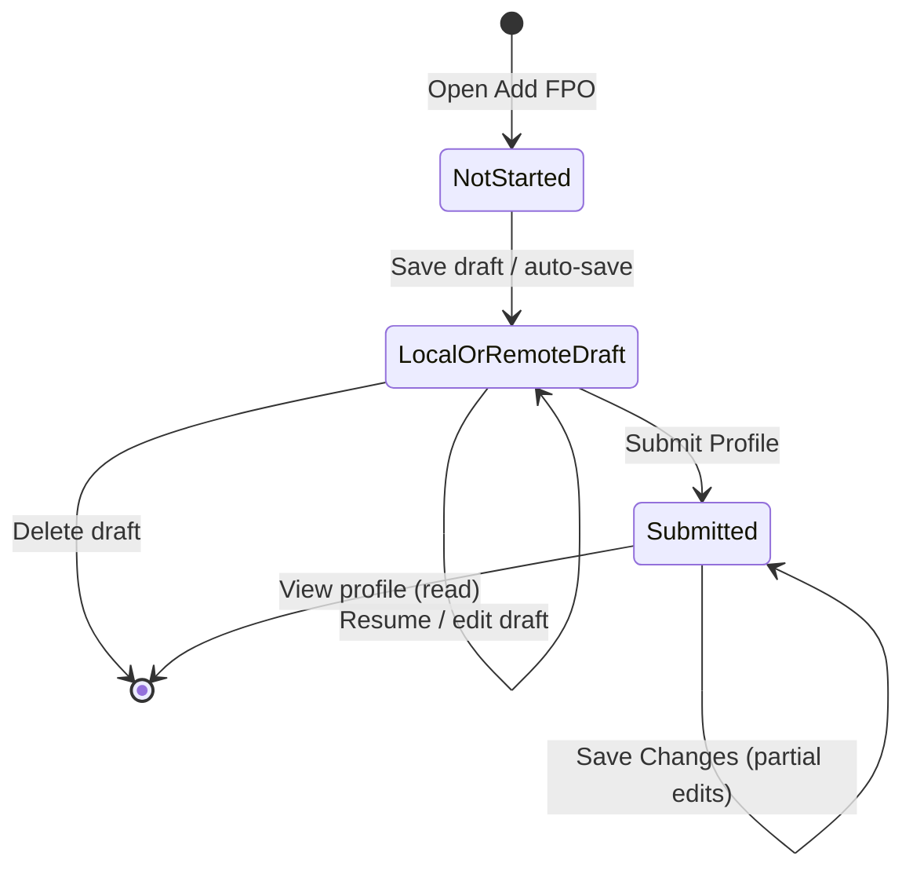

# FPO Management, Onboarding, and Profile Business Rules

## 1. Scope

This document extracts technology-agnostic business, UX, security, and integrity rules for **FPO (Farmer Producer Organization)** workflows in Field Commander version 1, for preservation in version 2.

### In scope

1. FPO eligibility and module permissions (`mobile_fpo`)
2. Nine-step FPO onboarding wizard (basic info → profiling → business → network/annexures → commitments → regulatory checklist → documents → agreement → review/submit)
3. Draft save, resume, background auto-save, and local offline fallback
4. Contact-mobile duplicate/profile lookup and submitted-profile edit-lock behavior
5. Ten-aspect scoring, Green/Yellow/Red recommendation bands, and dossier PDF generation
6. FPO list/search/filter on the dashboard
7. FPO entity profile view, edit entry, document viewing, and PDF share/download
8. Manual member-count and crop annexures (not system farmer-entity membership)
9. Allotted operational territories (district / taluka / villages)
10. Media, GPS-tagged storage photos, dual signatures, and permission-denied behavior
11. Shift activity logging after FPO draft save and submission

### Out of scope (except as consumers or references)

- Full dealer/distributor/farmer onboarding field catalogs (covered only where they share screens or permissions patterns)
- Retail invoicing, inventory, expenses, attendance, travel algorithms
- FarmCard / FarmDiary / FSPP workflows
- Backend row-level security policy definitions (not present in this repository)
- Version-2 architecture, stack, or schema design

### Version-2 boundary

This document states **what** the application must do. It does **not** prescribe frameworks, folders, databases, APIs, ORMs, state libraries, navigation libraries, media hosts, or offline engines for version 2. Version-1 technologies appear only as **evidence**.

### Workflows analyzed

| Workflow | Entry | Outcome |
| --- | --- | --- |
| Start onboarding | Dashboard “Add FPO” / FAB when edit permission granted | Empty 9-step wizard |
| Resume draft | Dashboard FPO card “Resume Onboarding” | Wizard restored at saved step |
| Edit submitted profile | Dashboard card menu / Entity Profile “Edit Profile” | Wizard with submitted data; partial field lock when status is submitted |
| Mobile auto-load | Enter 10-digit contact mobile on Step 1 | Loads newest draft or submitted profile for that mobile |
| Submit / save changes | Step 9 submit | Persisted submitted FPO record + PDF dossier reference; draft deleted |
| View profile | Dashboard “View Profile” | Read-only profile overview |
| Delete draft | Draft card delete control | Removes remote draft for that entity id |

---

## 2. FPO Repository Evidence Map

### Screens and components

| File | Why it matters |
| --- | --- |
| `Frontend/src/modules/onboarding/fpo/screens/FPOOnboardingScreen.tsx` | Wizard shell, step routing, footer actions, success screen, language toggle, back handling |
| `Frontend/src/modules/onboarding/fpo/screens/steps/Step1BasicInfo.tsx` | Identity, leadership, address cascade, tax IDs, bank accounts, lock UI |
| `Frontend/src/modules/onboarding/fpo/screens/steps/Step2Profiling.tsx` | Ten score aspects, guidance tables, remarks, audio, red flags |
| `Frontend/src/modules/onboarding/fpo/screens/steps/Step3Business.tsx` | Allotted territories, offtake, suppliers, partnership tier, demo commitment |
| `Frontend/src/modules/onboarding/fpo/screens/steps/Step4Network.tsx` | Member counts, crops, seasonal demand, warehouse annexure fields |
| `Frontend/src/modules/onboarding/fpo/screens/steps/Step5Commitments.tsx` | GLS commitment checkboxes + lock |
| `Frontend/src/modules/onboarding/fpo/screens/steps/Step6Regulatory.tsx` | Regulatory compliance checklist + lock |
| `Frontend/src/modules/onboarding/fpo/screens/steps/Step7Documents.tsx` | Core docs, compliance-derived uploads, GPS storage photos |
| `Frontend/src/modules/onboarding/fpo/screens/steps/Step8Agreement.tsx` | Terms text, acceptance, dual signatures + lock |
| `Frontend/src/modules/onboarding/fpo/screens/steps/Step9Review.tsx` | Missing-field review, jump-to-edit |
| `Frontend/src/modules/dashboard/screens/DashboardScreen.tsx` | List, filters, permissions, navigation entry points |
| `Frontend/src/modules/dashboard/screens/EntityProfileScreen.tsx` | FPO profile display, documents, signatures, PDF actions, edit |
| `Frontend/src/modules/dashboard/screens/ProfileScreen.tsx` | FPO count metric |
| `Frontend/src/design-system/components/EntityCard.tsx` | Card summary, draft/resume/view/edit/delete |
| `Frontend/src/design-system/components/FilterModal.tsx` | FPO filter options |
| `Frontend/src/design-system/components/UploadTile.tsx` | Camera vs file upload UI |
| `Frontend/src/design-system/components/ScoreSlider.tsx` | Score range 1–10 (UI control) |
| `Frontend/src/design-system/templates/Templates.tsx` (WizardFlowTemplate / FeedbackScreenTemplate) | Shared wizard chrome and success feedback |

### Hooks and forms

| File | Why it matters |
| --- | --- |
| `Frontend/src/modules/onboarding/fpo/hooks.ts` | Form defaults, draft CRUD, scoring, uploads, submit, locks, PDF, validation gate |

### Schemas and validation

| File | Why it matters |
| --- | --- |
| `Frontend/src/modules/onboarding/fpo/schema.ts` | Field contracts, GLS commitments catalog, compliance catalog, schema constraints |

### Services and APIs

| File | Why it matters |
| --- | --- |
| `Frontend/src/modules/onboarding/services/onboardingService.ts` | Persist/map FPO records; mobile lookup; PDF URL update |
| `Frontend/src/modules/onboarding/services/cloudinaryService.ts` | Media upload producing retrievable URLs |
| `Frontend/src/modules/dashboard/services/dashboardService.ts` | Fetch FPOs/drafts/counts by owning user; delete draft |

### Stores and state

| File | Why it matters |
| --- | --- |
| `Frontend/src/store/authStore.ts` | Authenticated user identity for ownership |
| `Frontend/src/store/draftStore.ts` | Local offline draft fallback typed `FPO` |
| `Frontend/src/store/alertStore.ts` | User-facing alerts |
| `Frontend/src/store/shiftStore.ts` | Activity increment and shift timeline events |

### Navigation

| File | Why it matters |
| --- | --- |
| `Frontend/src/navigation/AppNavigator.tsx` | Registers `FPOOnboarding` inside authenticated stack |

### Core and shared utilities

| File | Why it matters |
| --- | --- |
| `Frontend/src/core/usePermissions.ts` | `mobile_fpo` view/edit permissions |
| `Frontend/src/core/permissions.ts` | Camera/media permission requests and fallbacks |
| `Frontend/src/core/OfflineSyncManager.tsx` | Location sync only — does not sync FPO drafts/media |
| `Frontend/src/core/i18n.ts` + `Frontend/locales/{en,hi,gu}.json` | Translation keys for FPO UI |
| `Frontend/src/core/imageCompressor.ts` | Shared compression patterns used by onboarding image pipeline |

### Related modules

| File | Why it matters |
| --- | --- |
| No farmer / dealer / distributor onboarding references to FPO IDs | Confirmed: no executable farmer↔FPO membership linkage |
| Dashboard / EntityCard / FilterModal / ProfileScreen | List, filter, profile, counts |

---

## 3. Actors, Roles, Eligibility, and Permissions

### Actors

| Actor | Description | Evidence |
| --- | --- | --- |
| Authenticated field user | Must be signed in to reach onboarding/dashboard | Auth-gated navigator |
| Sales Executive (SE) | Default role with hardcoded `mobile_fpo` view+edit | `usePermissions.ts:51-58` |
| Territory Head / Super Admin | Treated as full module access | `usePermissions.ts:49-50` |
| Other named roles | Permissions from role → role_permissions mapping | `usePermissions.ts:60-76` |
| FPO authorized signatory | Signs agreement; not an app login actor | Step 8 `fpoSignature` |
| Sales Executive (signatory) | Co-signs agreement | Step 8 `seSignature` |

### Eligibility and access rules

| Topic | Finding | Enforcement |
| --- | --- | --- |
| Who can start onboarding | Users with `mobile_fpo.can_edit` | UI (FAB / empty-state action disabled without edit) |
| Who can see FPOs tab | Users with `mobile_fpo.can_view` | UI + fetch gated |
| Must FPO already exist? | No — create path is empty form; update path uses existing id | Client |
| Can one user manage multiple FPOs? | Yes — list is all records owned by user id | Client fetch by owner |
| Ownership link | Submitted records store owning field-user id (`se_id`) | Persist layer |
| Territory / region restriction on access | List filtered by owner only; no territory ACL in client | Client assumption |
| Distributor/dealer relationship required? | No system FK; suppliers are free-text tags | Client |
| Farmers linked during onboarding? | No — only numeric total/active members | Client |
| Unauthorized access | Unauthenticated users cannot open stack; no dedicated FPO denial screen beyond permission gating | UI |
| Inactive / rejected FPO | No inactive/rejected statuses found for FPO | N/A |
| Duplicate / already-completed | Mobile lookup loads existing draft or submitted profile | Client |

---

## 4. FPO Entities and Data Contracts

### Primary entities (logical)

| Entity | Description |
| --- | --- |
| FPO profile | Submitted onboarding dossier owned by a field user |
| FPO draft | In-progress form snapshot with current step |
| Scoring snapshot | Ten aspect scores + red flags (+ limited audio) |
| Business scope | Territories, offtake, suppliers, partnership, warehouse fields |
| Member base annexure | Member counts, crops, seasonal demand |
| Commitments | GLS commitment list + compliance checklist strings |
| Documents map | Document key → retrievable media reference |
| Storage locations | Photo key → lat/lng |
| Agreement evidence | Acceptance flag + two signature stroke payloads |
| Dossier PDF reference | Retrievable PDF URL after submit |

### Field contract (form → logical persistence)

| Form field | Logical persisted name / container | Required for submit (effective gate) | Notes |
| --- | --- | --- | --- |
| `fpoName` | FPO name | Soft (draft needs name+mobile; schema min 2) | UI says “Must be Unique”; uniqueness not verified client-side |
| `registrationNumber` | Registration number | Schema yes; submit gate incomplete | |
| `incorporationYear` | Incorporation year | Schema yes; year picker last 50 years | |
| `address`, `state`, `city`, `taluka`, `pincode` | Address | Partial in submit gate | `city` UI label = District |
| `commandArea` | Command area | Schema yes | Free text |
| `ceoName`, `bodPresidentName` | Leadership | Schema yes | Editable when locked |
| `contactMobile` | Contact mobile | Yes (10 digits) | Lookup key |
| `email` | Email | Optional (empty or valid email) | Lowercased in UI |
| `gstNumber`, `panNumber` | Tax IDs | Optional formats if non-empty | Uppercased |
| `promotingAgency` | Promoting agency | Schema yes | Options: SFAC, NABARD, NGO, Misc / Other |
| `bankAccounts[]` | Bank details array | ≥1; account fields + IFSC | |
| Scores `score*` | Scoring object | Defaults 5; schema 1–10 | Unweighted sum |
| `rem*`, `audio*` (per aspect) | **Not persisted** on submit | Optional in form | Data loss on submit |
| `redFlags`, `audioRedFlags` | Scoring red flags | Optional | Audio red flags persisted |
| `allottedTerritories[]` | Business scope territories | ≥1 with district in gate; villages required in schema/review | |
| `expectedOfftake` | Offtake ₹ | Required | Numeric keyboard string |
| `currentSuppliers[]` | Supplier tags | Optional | |
| `partnershipTier` | Partnership tier | Required | Two radio options |
| `demoFarmersCommitment` | Demo commitment | Required | Numeric keyboard string |
| `warehouseSpace`, `storageConditions`, `customMachinery` | Business scope infra | Optional | Collected on Step 4 UI |
| `totalMembers`, `activeMembers` | Member base | Required | Manual strings |
| `majorCrops[]` | Crops | ≥1 with name (acreage schema-required; gate weaker) | |
| `kharifDemand`, `rabiDemand` | Seasonal timelines | Optional | |
| `glsCommitments[]` | Commitments | All 5 required | |
| `complianceChecklist[]` | Compliance | **Not in submit gate** | Drives extra upload keys |
| `documents` | Documents map | Partial required keys in gate | |
| `storageLocations` | GPS map | Exterior GPS required in gate | |
| `agreementAccepted` | Boolean | Must be true | |
| `fpoSignature`, `seSignature` | Signature stroke JSON strings | Required (min length 10) | |
| `total_score`, `band` | Derived at submit | Written on persist | |
| `status` | `SUBMITTED` on submit | Only submitted status used in practice | |
| `pdf_url` | Dossier PDF | Best-effort after submit | |
| `update_history` | Edit audit | On update with dirty fields | |

### Defaults

- Empty create: scores default to **5**; one empty bank; one empty territory; one empty crop; commitments/compliance empty; agreement false; signatures empty.
- Lock flag: `status === 'SUBMITTED'`.

### Generated values

- Draft entity id: random UUID if absent.
- PDF filename: sanitized FPO name + `_Dossier.pdf`.
- Compliance-derived document keys: checklist item string → alphanumeric underscore lowercase.

---

## 5. Complete FPO Onboarding Workflow

### Step order (fixed 1–9)

1. Basic Information  
2. Profiling & Scoring  
3. Business Scope & Appointment  
4. Special FPO Annexures (Member Base & Infrastructure)  
5. GLS Commitments  
6. Regulatory Checklist  
7. Upload Documents  
8. Terms & Signatures  
9. Final Review  

### Wizard behavior

| Behavior | Rule |
| --- | --- |
| Initial step | `initialStep` route param or 1; draft resume uses saved `current_step` |
| Step indicator | “STEP {n} OF 9”; progress = n/9 |
| Jump to step | Allowed from review EDIT; no free jump otherwise |
| Next | Always enabled (`isNextEnabled: true`); **no per-step block** |
| Back | Previous step; if jump-back set, return to review; step 1 exits wizard |
| Hardware back | Same as onBack for steps > 1 |
| Skip | Not supported |
| Validation timing | Schema mode `onChange`; submit uses custom `validationStatus` + schema submit |
| Save draft | Footer when not editing submitted/fetched record |
| Submit | Step 9 only; label “Submit Profile” or “Save Changes” when editing |
| Success | Feedback screen: Share PDF / Add Another / Go Home |
| Offline | Draft falls back to local store; uploads require connectivity |
| Approval/rejection | No separate workflow; `SUBMITTED` shown as “Approved” on cards/profile |

### State machine (statuses evidenced)



**Statuses found in code (do not invent others):**

| Status / state | Where |
| --- | --- |
| Incomplete draft (`isDraft: true`) | Dashboard mapping from `drafts` |
| `SUBMITTED` | FPO record `status` on submit |
| UI label “Approved” | Card/profile when `status === 'SUBMITTED'` |
| UI label “Pending” / “Draft” | Card when not submitted; profile non-submitted |
| Local offline draft | Local draft store type `FPO` |
| Sync pending / failed | Not first-class statuses; failed remote draft save → local fallback |

**Not found:** Approved/Rejected as distinct backend statuses, Requires correction, Archived, Inactive, Sync failed as FPO entity status.

---

## 5. Version-2 Business and UX Rules (Numbered)

### FPO-001 — Authentication required for FPO workflows

- **Rule:** Only authenticated users may open FPO onboarding, list, or profile screens.
- **Business purpose:** Protect partner organization data.
- **Trigger/condition:** App session absent.
- **Behavior/result:** Authenticated stack (including FPO routes) not shown.
- **Actor/role:** Any user.
- **Affected workflow:** All FPO.
- **UX behavior:** Login flow instead of main app.
- **Validation/error behavior:** N/A.
- **Online/offline behavior:** Session-based.
- **Enforcement requirement:** Navigation / session gate.
- **Dependencies:** Auth session.
- **Original implementation evidence:**
  - `Frontend/src/navigation/AppNavigator.tsx:159-166` — `user ? (` stack includes `FPOOnboarding`
- **Confidence:** High

### FPO-002 — Module view/edit permissions gate list and create

- **Rule:** FPO tab/list requires view permission; Add FPO requires edit permission for module `mobile_fpo`.
- **Business purpose:** Role-based capability control.
- **Trigger/condition:** Permission flags false.
- **Behavior/result:** Tab omitted; Add actions disabled/hidden.
- **Actor/role:** Role-permission mapped users; SE defaults both true.
- **Affected workflow:** Dashboard.
- **UX behavior:** Empty/disabled actions when cannot edit.
- **Validation/error behavior:** N/A.
- **Online/offline behavior:** Permissions loaded online.
- **Enforcement requirement:** Client permission check (server isolation assumed, not verified in repo).
- **Dependencies:** Role permissions.
- **Original implementation evidence:**
  - `Frontend/src/core/usePermissions.ts:57` — `mobile_fpo`
  - `Frontend/src/modules/dashboard/screens/DashboardScreen.tsx:48,563-586,1016-1052`
- **Confidence:** High

### FPO-003 — Ownership isolation of FPO records

- **Rule:** Users must only retrieve FPO records they own (field-user id match), unless elevated backend rules exist outside this repo.
- **Business purpose:** Data isolation among field staff.
- **Trigger/condition:** List/count fetch.
- **Behavior/result:** Query filtered by owning user id.
- **Actor/role:** Field user.
- **Affected workflow:** Dashboard list, profile counts.
- **UX behavior:** Only own FPOs appear.
- **Validation/error behavior:** Fetch error throws.
- **Online/offline behavior:** Online list; local drafts are device-local.
- **Enforcement requirement:** Persistence query filter; server authorization should reinforce (unverified here).
- **Dependencies:** Authenticated user id.
- **Original implementation evidence:**
  - `Frontend/src/modules/dashboard/services/dashboardService.ts:58-69` — `fetchMyFPOs`
- **Confidence:** High (client); Medium (server RLS unknown)

### FPO-004 — Nine-step sequential onboarding with free Next

- **Rule:** Onboarding presents nine ordered steps; users may advance with Next without per-step hard validation; completeness is enforced at final submit.
- **Business purpose:** Allow progressive capture while requiring a complete dossier before submit.
- **Trigger/condition:** Next pressed; `isNextEnabled` always true.
- **Behavior/result:** Step increments.
- **Actor/role:** Field user with edit permission.
- **Affected workflow:** Onboarding.
- **UX behavior:** Progress label and bar update.
- **Validation/error behavior:** Field-level schema errors may show on change; do not block Next.
- **Online/offline behavior:** Local form state.
- **Enforcement requirement:** Wizard navigation + submit gate.
- **Dependencies:** Form state.
- **Original implementation evidence:**
  - `Frontend/src/modules/onboarding/fpo/screens/FPOOnboardingScreen.tsx:45-77`
  - `Frontend/src/modules/onboarding/fpo/hooks.ts:577` — `isNextEnabled: true`
- **Confidence:** High

### FPO-005 — Draft save requires FPO name and mobile

- **Rule:** Manual draft save requires FPO name and contact mobile; auto-save also skips if those or user id missing, or no dirty fields.
- **Business purpose:** Identifiable recoverable drafts.
- **Trigger/condition:** Save Draft / background / unmount.
- **Behavior/result:** Upsert remote draft or local fallback; navigate home on manual save after activity log.
- **Actor/role:** Creating/editing draft (not already-fetched submitted profile).
- **Affected workflow:** Onboarding draft.
- **UX behavior:** Alerts on cannot-save; “Saving…” then home.
- **Validation/error behavior:** Alert if name/mobile missing.
- **Online/offline behavior:** Remote upsert; on failure write local draft.
- **Enforcement requirement:** Draft persistence.
- **Dependencies:** User id; draft entity id.
- **Original implementation evidence:**
  - `Frontend/src/modules/onboarding/fpo/hooks.ts:106-217`
- **Confidence:** High

### FPO-006 — Mobile number loads existing draft or submitted FPO

- **Rule:** When creating (no edit/draft params) and mobile becomes 10 digits, the newest matching draft or submitted FPO for entity type FPO is loaded into the form.
- **Business purpose:** Prevent duplicate dossiers and resume work.
- **Trigger/condition:** `contactMobile` length 10; debounce ~600ms.
- **Behavior/result:** Alert “Profile Found”; draft resets form+step; submitted maps DB→form and may lock.
- **Actor/role:** Field user.
- **Affected workflow:** Step 1.
- **UX behavior:** Alert; fields populated.
- **Validation/error behavior:** Failures logged; no user alert.
- **Online/offline behavior:** Requires online lookup.
- **Enforcement requirement:** Lookup by mobile on drafts then FPO table.
- **Dependencies:** Network.
- **Original implementation evidence:**
  - `Frontend/src/modules/onboarding/fpo/hooks.ts:68-96`
  - `Frontend/src/modules/onboarding/services/onboardingService.ts:651-677`
- **Confidence:** High

### FPO-007 — Submitted profiles apply partial edit lock

- **Rule:** When loaded status is `SUBMITTED`, identity/registration/promoting-agency/address-style fields are UI-locked; commitments, compliance, documents, and agreement screens are pointer-locked; leadership, banks, scoring, business, network remain editable per allowed dirty-field list.
- **Business purpose:** Preserve core legal identity while allowing operational updates.
- **Trigger/condition:** `editData.status === 'SUBMITTED'` or fetched submitted profile.
- **Behavior/result:** Locked sections non-interactive (opacity reduced); illegal dirty fields block save/submit.
- **Actor/role:** Field user editing own FPO.
- **Affected workflow:** Edit submitted.
- **UX behavior:** Dimmed locked sections.
- **Validation/error behavior:** Alert listing unauthorized edits.
- **Online/offline behavior:** Same.
- **Enforcement requirement:** UI lock + client dirty-field allowlist (not a full server field ACL in repo).
- **Dependencies:** Status.
- **Original implementation evidence:**
  - `Frontend/src/modules/onboarding/fpo/hooks.ts:66,168-186`
  - `Frontend/src/modules/onboarding/fpo/screens/FPOOnboardingScreen.tsx:47-54`
  - `Frontend/src/modules/onboarding/fpo/screens/steps/Step1BasicInfo.tsx:89-137`
- **Confidence:** High

### FPO-008 — Ten-aspect unweighted scoring and bands

- **Rule:** Total score = sum of ten aspects each 1–10 (default 5). Bands: ≥75 Green (Proceed); ≥60 Yellow (Conditional); else Red (Stop). UI copy says minimum 75 required to proceed, but submit gate does **not** block Red/Yellow.
- **Business purpose:** Partnership risk recommendation.
- **Trigger/condition:** Any score change / submit.
- **Behavior/result:** Live badge; persisted `total_score` + `band` on submit.
- **Actor/role:** Field user.
- **Affected workflow:** Step 2, PDF, profile.
- **UX behavior:** Color-coded band badge.
- **Validation/error behavior:** Schema enforces 1–10; threshold not enforced at submit.
- **Online/offline behavior:** Local calculation.
- **Enforcement requirement:** Derived value persistence; threshold policy ambiguous (see audit).
- **Dependencies:** Ten score fields.
- **Original implementation evidence:**
  - `Frontend/src/modules/onboarding/fpo/hooks.ts:98-104,222-245,535`
  - `Frontend/src/modules/onboarding/fpo/screens/steps/Step2Profiling.tsx:139-140`
- **Confidence:** High

### FPO-009 — All five GLS commitments required

- **Rule:** Submission requires accepting all five catalog GLS commitment strings.
- **Business purpose:** Mutual commercial alignment.
- **Trigger/condition:** Submit validation.
- **Behavior/result:** Step 5 invalid if length ≠ catalog length.
- **Actor/role:** Field user.
- **Affected workflow:** Steps 5, 9, submit.
- **UX behavior:** Checkboxes; review MISSING count.
- **Validation/error behavior:** Missing Information alert listing Step 5.
- **Online/offline behavior:** Local.
- **Enforcement requirement:** Submit gate + review indicators.
- **Dependencies:** `FPO_GLS_COMMITMENTS` catalog.
- **Original implementation evidence:**
  - `Frontend/src/modules/onboarding/fpo/schema.ts:3-10`
  - `Frontend/src/modules/onboarding/fpo/hooks.ts:231`
- **Confidence:** High

### FPO-010 — Agreement acceptance and dual signatures required

- **Rule:** Submission requires agreement acceptance true and both FPO and SE signatures present.
- **Business purpose:** MoU evidence.
- **Trigger/condition:** Submit / schema.
- **Behavior/result:** Block submit if missing.
- **Actor/role:** Field user + FPO signatory (offline wet/digital pad).
- **Affected workflow:** Steps 8–9.
- **UX behavior:** Checkbox + two signature pads; review YES/NO/MISSING.
- **Validation/error behavior:** Schema refine / min length; submit alert.
- **Online/offline behavior:** Signatures stored as stroke JSON strings; media upload separate.
- **Enforcement requirement:** Submit gate.
- **Dependencies:** Signature capture control.
- **Original implementation evidence:**
  - `Frontend/src/modules/onboarding/fpo/schema.ts:103-105`
  - `Frontend/src/modules/onboarding/fpo/hooks.ts:235`
- **Confidence:** High

### FPO-011 — Required documents and GPS exterior photo

- **Rule:** Effective submit gate requires documents `incorporation_certificate`, `pan_card`, `board_resolution`, `storage_exterior`, and GPS for `storage_exterior`. UI/review also mark additional docs required (FCO, cancelled cheque, storage interior, compliance-selected) inconsistently with the gate.
- **Business purpose:** Legal and facility evidence.
- **Trigger/condition:** Submit.
- **Behavior/result:** Block if gate keys missing.
- **Actor/role:** Field user.
- **Affected workflow:** Steps 7, 9.
- **UX behavior:** Upload tiles; GPS required alert on storage photos.
- **Validation/error behavior:** Permission/GPS/size/upload failure alerts.
- **Online/offline behavior:** Upload requires network; no offline queue for media.
- **Enforcement requirement:** Submit gate + upload pipeline.
- **Dependencies:** Media upload service; location permission.
- **Original implementation evidence:**
  - `Frontend/src/modules/onboarding/fpo/hooks.ts:233,259-317`
  - `Frontend/src/modules/onboarding/fpo/screens/steps/Step7Documents.tsx:40-78`
  - `Frontend/src/modules/onboarding/fpo/screens/steps/Step9Review.tsx:62-64`
- **Confidence:** High

### FPO-012 — Media upload rules

- **Rule:** Camera/gallery require permission; non-camera documents >5MB rejected; camera/image resized width 1024 compress 0.6 JPEG; successful upload must yield retrievable URL stored in documents map; storage exterior/interior require foreground GPS and store lat/lng.
- **Business purpose:** Usable evidence with location proof for facilities.
- **Trigger/condition:** Upload action.
- **Behavior/result:** URL set; uploading flags per key.
- **Actor/role:** Field user.
- **Affected workflow:** Step 7; profiling audio Step 2.
- **UX behavior:** Loading on tile; clear removes key.
- **Validation/error behavior:** Permission Denied / File Too Large / GPS Required / Upload failed.
- **Online/offline behavior:** Online only for upload.
- **Enforcement requirement:** Client media pipeline.
- **Dependencies:** Permissions; upload endpoint.
- **Original implementation evidence:**
  - `Frontend/src/modules/onboarding/fpo/hooks.ts:247-317`
  - `Frontend/src/modules/onboarding/services/cloudinaryService.ts:1-40`
  - `Frontend/src/core/permissions.ts:27-58`
- **Confidence:** High

### FPO-013 — Submit persists dossier, deletes draft, logs activity, generates PDF best-effort

- **Rule:** Successful submit writes submitted FPO with score/band, deletes matching draft, increments shift activity and logs timeline event, then attempts PDF generate+upload+attach; PDF failure does not roll back submit.
- **Business purpose:** Complete partner record and operational activity proof.
- **Trigger/condition:** Step 9 submit after gates pass.
- **Behavior/result:** Success screen; optional PDF share.
- **Actor/role:** Field user.
- **Affected workflow:** Submission.
- **UX behavior:** Loading on button; success feedback.
- **Validation/error behavior:** Submission Failed alert with error message.
- **Online/offline behavior:** Requires online persistence; PDF best-effort.
- **Enforcement requirement:** Persist + draft delete + activity log.
- **Dependencies:** User session; shift store optional route name.
- **Original implementation evidence:**
  - `Frontend/src/modules/onboarding/fpo/hooks.ts:519-574`
  - `Frontend/src/modules/onboarding/services/onboardingService.ts:679-777,854-856`
- **Confidence:** High

### FPO-014 — Dashboard list, search, filter, draft merge

- **Rule:** FPO tab merges remote drafts (excluding mobiles already submitted) with submitted FPOs; supports search by name/city/state/CEO/mobile; filters completion, member scale, business activities, promoting agency; sorts by updated time descending.
- **Business purpose:** Operational pipeline visibility.
- **Trigger/condition:** Tab load / filter apply.
- **Behavior/result:** Processed list for cards.
- **Actor/role:** Users with view permission.
- **Affected workflow:** Dashboard.
- **UX behavior:** Empty message promoting partnership.
- **Validation/error behavior:** Load errors via dashboard handling.
- **Online/offline behavior:** Remote drafts/submitted; local offline drafts not automatically merged into dashboard list in evidence reviewed.
- **Enforcement requirement:** Client aggregation.
- **Dependencies:** Fetch APIs.
- **Original implementation evidence:**
  - `Frontend/src/modules/dashboard/screens/DashboardScreen.tsx:154-158,492-542`
- **Confidence:** High

### FPO-015 — Profile read view and edit entry

- **Rule:** Submitted FPO cards open a read-only profile overview with edit navigation back into onboarding; documents openable; PDF download/share when PDF URL present.
- **Business purpose:** Review partner dossier.
- **Trigger/condition:** View Profile / Edit Profile.
- **Behavior/result:** Profile sections rendered; edit passes `editData`.
- **Actor/role:** Owning field user (client assumption).
- **Affected workflow:** Profile.
- **UX behavior:** Sections, commitments, documents, signatures, PDF buttons.
- **Validation/error behavior:** PDF Not Found / download/share errors.
- **Online/offline behavior:** Needs URLs online.
- **Enforcement requirement:** Profile UI.
- **Dependencies:** Persisted record shape.
- **Original implementation evidence:**
  - `Frontend/src/modules/dashboard/screens/EntityProfileScreen.tsx:183-184,663-753,796-890`
  - `Frontend/src/design-system/components/EntityCard.tsx:308-328`
- **Confidence:** High

### FPO-016 — No system farmer membership selection

- **Rule:** FPO “network” onboarding captures manual member counts, crop acreages, and infrastructure annexures; it does **not** select or link farmer app entities.
- **Business purpose:** Capture scale for partnership (as implemented).
- **Trigger/condition:** Step 4.
- **Behavior/result:** Numeric/text annexure only.
- **Actor/role:** Field user.
- **Affected workflow:** Step 4 / profile member section.
- **UX behavior:** Inputs for totals and crops.
- **Validation/error behavior:** Required totals and at least one crop name (schema also acreage).
- **Online/offline behavior:** Local.
- **Enforcement requirement:** Form fields only.
- **Dependencies:** None to farmer module.
- **Original implementation evidence:**
  - `Frontend/src/modules/onboarding/fpo/screens/steps/Step4Network.tsx:26-168`
  - Grep: no FPO references under farmer onboarding
- **Confidence:** High

### FPO-017 — Territory allotment depends on Step 1 state and location tree

- **Rule:** Operational territories require a state selected in Step 1; district/taluka/village options load from a Gujarat location tree RPC; villages multi-select; taluka disabled until district; villages disabled until taluka; add territory disabled without state or while loading.
- **Business purpose:** Define appointed geography.
- **Trigger/condition:** Step 3 interactions.
- **Behavior/result:** Warning if state missing; cascading selects.
- **Actor/role:** Field user.
- **Affected workflow:** Step 3.
- **UX behavior:** Modal village checklist with search.
- **Validation/error behavior:** Schema requires ≥1 territory with district, taluka, ≥1 village.
- **Online/offline behavior:** Location tree requires network; selecting non-Gujarat state yields empty options (RPC name Gujarat-specific).
- **Enforcement requirement:** UI cascade + schema.
- **Dependencies:** Location reference data.
- **Original implementation evidence:**
  - `Frontend/src/modules/onboarding/fpo/screens/steps/Step3Business.tsx:27-266`
  - `Frontend/src/modules/onboarding/fpo/schema.ts:66-72`
- **Confidence:** High

### FPO-018 — Multilingual UI cycling

- **Rule:** Onboarding header language control cycles en → hi → gu → en for translated strings.
- **Business purpose:** Field language support.
- **Trigger/condition:** Header press.
- **Behavior/result:** Language changes.
- **Actor/role:** Field user.
- **Affected workflow:** Onboarding.
- **UX behavior:** Language code pill.
- **Validation/error behavior:** N/A.
- **Online/offline behavior:** Local i18n.
- **Enforcement requirement:** i18n.
- **Dependencies:** Locale catalogs.
- **Original implementation evidence:**
  - `Frontend/src/modules/onboarding/fpo/screens/FPOOnboardingScreen.tsx:24-27,65-68`
- **Confidence:** High

### FPO-019 — Shift activity logging on meaningful draft save and submit

- **Rule:** Manual draft save and successful submit increment shift activity and log timeline events describing route (if active) and location (taluka/city).
- **Business purpose:** Field productivity tracking.
- **Trigger/condition:** Save draft exit; submit success.
- **Behavior/result:** Activity + event recorded.
- **Actor/role:** Field user on shift.
- **Affected workflow:** Draft/submit.
- **UX behavior:** Transparent to user beyond save alerts.
- **Validation/error behavior:** Shift lookups may silently skip route name.
- **Online/offline behavior:** Uses online shift/route tables.
- **Enforcement requirement:** Shift store integration.
- **Dependencies:** Active shift optional.
- **Original implementation evidence:**
  - `Frontend/src/modules/onboarding/fpo/hooks.ts:201-215,537-551`
- **Confidence:** High

---

## 6. Step 1 — Basic Information Rules

### Purpose

Capture FPO identity, contact, leadership, registration, address, command area, and bank accounts.

### Fields

| Field | Required (schema) | Required (submit gate) | Defaults / format | Conditional |
| --- | --- | --- | --- | --- |
| FPO Name | Yes min 2 | Indirect (draft) | Unique label only | Locked if submitted |
| Contact mobile | 10 digits | Yes | +91 prefix UI | Lookup trigger |
| Email | Optional valid/empty | No | Lowercase | |
| CEO / MD | Yes | No in gate | | Editable when locked |
| BoD President | Yes | No in gate | | Editable when locked |
| Promoting Agency | Yes | No in gate | SFAC/NABARD/NGO/Misc | Locked if submitted |
| Registration No | Yes | No in gate | | Locked |
| Incorporation Year | Yes min 4 | No in gate | Last 50 calendar years | Locked |
| GST | Optional regex | No | Uppercase max 15 | Locked |
| PAN | Optional regex | No | Uppercase max 10 | Locked |
| Address | Yes min 5 | Yes in gate | | Locked |
| State | Yes | Yes | Full Indian states list | Clears district/taluka; Locked |
| District (`city`) | Yes | Yes | From location tree | Clears taluka; Locked |
| Taluka | Yes | No in gate | From tree | Locked |
| Pincode | 6 digits | No in gate | Numeric max 6 | Locked |
| Command Area | Yes | No in gate | Free text | Locked |
| Bank accounts | ≥1; name/branch; A/C 9–18 digits; IFSC regex | Banks valid in gate | One active empty row | Add/remove (remove only index>0); Active toggle only if `isEditing` prop (not passed by parent → dead UI) |

### Behavior notes

- State change loads Gujarat location tree regardless of which state is chosen.
- Locked group dims and disables pointer events for identity/registration/address/command area; mobile/email/leadership/banks remain interactive.

### Evidence

- `Step1BasicInfo.tsx` entire file; `schema.ts:23-50`; `hooks.ts:226-227`.

---

## 7. Step 2 — Profiling Rules

### Purpose

Score FPO capability across ten aspects; capture remarks/audio/red flags.

### Aspects (1–10 each)

1. Member Base & Reach  
2. Financial Health & Equity  
3. Governance & Mgmt  
4. Infrastructure Capabilities  
5. Input Distribution Exp  
6. Output Aggregation  
7. Adoption of Biologicals  
8. Extension & Field Reach  
9. Digital Literacy  
10. Strategic Alignment  

Each has guidance text, dynamic implication table by score bands (≤2, ≤4, ≤6, ≤8, else), optional remarks, optional audio.

### Scoring formula (exact)

```
raw = scoreMemberBase + scoreFinancial + scoreGovernance + scoreInfra
    + scoreDistribution + scoreAggregation + scoreBiologicals
    + scoreExtension + scoreDigital + scoreAlignment
```

Missing treated as 5 in calculator (`|| 5`). Max theoretical 100.

### Band derivation (exact)

```
if raw >= 75 → "Green (Proceed)"
else if raw >= 60 → "Yellow (Conditional)"
else → "Red (Stop)"
```

**Unweighted.** No percentage beyond raw/100 display. UI claims “Minimum 75/100 required to proceed” — **not enforced** by Next or submit gate.

### Persistence gap

Submit stores only numeric scores + `redFlags` + `audioRedFlags`. Per-aspect remarks and per-aspect audio are **not** written to scoring payload.

### Evidence

- `Step2Profiling.tsx`; `hooks.ts:98-104,708-721`; `ScoreSlider.tsx:17`.

---

## 8. Step 3 — Business Information Rules

### Purpose

Define allotted operational territories, offtake potential, current suppliers, partnership tier, demo-farmer commitment.

### Fields

| Field | Required | Allowed values / notes |
| --- | --- | --- |
| Allotted territories[] | ≥1 | district, taluka, villages[] |
| Expected offtake | Yes | Currency string (₹) |
| Current suppliers | Optional | Tags |
| Partnership tier | Yes | `Anchor FPO Partner` \| `Cluster-Level Input Center` |
| Demo farmers commitment | Yes | Numeric keyboard string |

Warehouse/storage/machinery appear in schema comments under Step 3 but are **collected on Step 4** and saved under business scope.

Submit gate checks: first territory has district + offtake + partnershipTier + demoFarmersCommitment (does not fully enforce taluka/villages despite schema/review).

### Evidence

- `Step3Business.tsx`; `schema.ts:66-80`; `hooks.ts:229`.

---

## 9. Step 4 — Network and Membership Rules

### Purpose

Annexure A member/crop profile and Annexure B infrastructure capability. “Network” here means annexure data, **not** multi-entity graph linking.

### Fields

| Field | Required | Notes |
| --- | --- | --- |
| Total members | Yes | Manual string |
| Active members | Yes | Manual string; no cross-check ≤ total |
| Major crops[] | ≥1 | Crop from fixed list; acreage numeric string |
| Kharif / Rabi demand | Optional | Month-range timelines |
| Warehouse space | Optional | sq.ft |
| Storage conditions | Optional | Pucca / Kaccha / Temperature-controlled |
| Custom machinery | Optional | Free text |

Crop options: Castor, Cotton, Fruits, Groundnut, Maize, Millets, Mustard, Paddy/Rice, Pulses, Soyabean, Spices, Sugarcane, Vegetables, Wheat, Others.

No add/remove of farmer entities; no eligibility against farmer records; no max/min member counts enforced beyond non-empty strings.

### Evidence

- `Step4Network.tsx`; `schema.ts:83-90`; `hooks.ts:230`.

---

## 10. Step 5 — Commitments Rules

Catalog (`FPO_GLS_COMMITMENTS`):

1. Fair Margin Structure: Clean 10% operational margin on the FPO Landing Rate.  
2. Farmer-First Field Support: GLS field team to drive 60% of demand generation.  
3. Dedicated Field Personnel: Dedicated GLS Field Executives assigned.  
4. Input-to-Output Support: Supply of specialized crop packages and Farm Cards.  
5. 100% Funded Demos: Product demonstration kits and training funded by GLS.

All five required for submit. UI locked when submitted. Not in dirty allowlist (cannot change after submit even if unlocked).

### Evidence

- `schema.ts:3-10`; `Step5Commitments.tsx`; `hooks.ts:231`.

---

## 11. Step 6 — Regulatory and Compliance Rules

Catalog (`FPO_COMPLIANCE_ITEMS`) — checklist of document availability:

1. Incorporation Certificate (ROC / Cooperative Society)  
2. Valid FCO Authorization / Retail Fertilizer License  
3. Valid Insecticide Selling License  
4. FPO PAN & GST Registration Certificate  
5. Cancelled Cheque  
6. Board Resolution authorizing partnership  
7. Last 2 years Audited Balance Sheet / Financial Statement  

**Not required** by submit `validationStatus`. Checked items generate additional upload rows on Step 7 via slugified keys. Locked when submitted.

No expiry-date fields; no automatic approval block for unchecked items.

### Evidence

- `schema.ts:12-20`; `Step6Regulatory.tsx`; `Step7Documents.tsx:60-70`.

---

## 12. Step 7 — Document Rules

### Fixed upload keys

| Key | UI label | UI required mark | In submit gate | GPS |
| --- | --- | --- | --- | --- |
| `incorporation_certificate` | Incorporation Cert | * | Yes | No |
| `fco_license` | FCO / Fertilizer License | * | No | No |
| `insecticide_license` | Insecticide Selling License | | No | No |
| `pan_card` | PAN Card | * | Yes | No |
| `gst_certificate` | GST Cert | | No | No |
| `cancelled_cheque` | Cancelled Cheque | * | No | No |
| `board_resolution` | Board Resolution | * | Yes | No |
| `balance_sheet` | Audited Balance Sheet | | No | No |
| `storage_exterior` | Storage Exterior | * | Yes + GPS | Yes |
| `storage_interior` | Storage Interior | * | No (GPS attempted if uploaded) | Yes |

Plus dynamic keys from compliance checklist.

When `isLocked`, entire documents step non-interactive — conflicts with allowlist that includes `documents`.

### Evidence

- `Step7Documents.tsx`; `hooks.ts:233,259-317`.

---

## 13. Step 8 — Agreement and Consent Rules

- Fixed MoU terms text (scope, commercial/payment, farmer-first strategy, data sharing/DPDP, regulatory compliance, Vadodara jurisdiction).
- Acceptance checkbox mandatory.
- Dual signatures mandatory.
- Locked when submitted (also excluded from allowlist for `agreementAccepted`; signatures are allowlisted but UI-locked → unreachable).
- No agreement version field; no location/date capture beyond dossier date.

### Evidence

- `Step8Agreement.tsx`; `schema.ts:103-105`.

---

## 14. Step 9 — Final Review and Submission Rules

- Sections 1–8 with EDIT jump (`setJumpBackTo(9)` then `setStep`).
- MISSING indicators for required fields; commitments completeness; docs checklist (broader than submit gate); GPS exterior.
- Submit runs `checkRestrictions` → `validationStatus` missing list alert → schema `handleSubmit` → persist.
- Duplicate submission: no explicit debounce beyond `isSubmitting` loading flag.
- After success: draft deleted; success screen actions Share PDF / Add Another (reset form step 1) / Go Home.

### Evidence

- `Step9Review.tsx`; `FPOOnboardingScreen.tsx:41-42,74-77`; `hooks.ts:519-574`.

---

## 15. FPO Member and Network Rules

| Question | Finding |
| --- | --- |
| How farmers associated? | Manual counts only; no farmer IDs |
| Membership approval? | N/A |
| Farmer in multiple FPOs? | N/A (no link) |
| Inactive farmers selectable? | N/A |
| Add members after onboarding? | Counts editable when not UI-locked (Step 4 unlocked) |
| Remove members? | N/A |
| Membership history? | Not retained as entities |
| Member count calculated? | Manual entry |
| Affects scoring? | Indirectly via human scoring of Member Base aspect only |
| Link to dealers/distributors? | Free-text suppliers only |
| Network on profile? | Shows member counts/crops; still renders removed `lrpNetwork` UI (dead) |
| Editable after approval? | Member/business fields allowlisted; Step 4 not pointer-locked |

---

## 16. FPO Profile Screen Rules

### Entry points

- EntityCard “View Profile” for non-draft FPO  
- Edit from card menu or profile overflow → onboarding with `editData`

### Displayed (FPO branch)

- Name, CEO, BoD President, mobile, email, command area, address, location, promoting agency, registration, incorporation year, GST, PAN  
- Bank accounts  
- Ten scores + red flags + red-flag audio  
- Business scope (note: reads `allottedTerritory` singular — mismatch with saved `allottedTerritories`)  
- Member totals, crops, LRP network (legacy empty)  
- Shared commitments, compliance, documents directory, signatures, PDF actions  

### Not shown / broken for FPO

- Profile score widget excludes FPO (`isDealer \|\| isDistributor \|\| farmer FSPP` only)  
- Location widget falls through to farmer `personal_details` → N/A for FPO  
- Header icon uses agriculture (farmer) for FPO  
- Card score badge excludes FPO (`hasScore` omits FPO) even though list maps `total_score`  
- PDF filename uses `firm_name` helper → falls back to type “FPO”

### Actions

| Action | Visibility |
| --- | --- |
| Edit Profile | Always in menu (no status hide) |
| View documents | When URLs present |
| Download/Share PDF | When `pdf_url` present |
| Approve/Reject | Not present |
| Delete/Archive FPO | Not present (draft delete only) |

### Evidence

- `EntityProfileScreen.tsx:147,183-184,336-394,663-753,796-890`  
- `EntityCard.tsx:31,76-87,252-266`

---

## 17. FPO Status and State Transitions

| From | To | Actor | Allowed? |
| --- | --- | --- | --- |
| None | Draft | Field user | Yes (save) |
| Draft | Draft | Field user | Yes (update) |
| Draft | Submitted | Field user | Yes (submit) |
| Draft | Deleted | Field user | Yes (delete draft) |
| Submitted | Submitted (updated) | Field user | Yes (save changes with allowlist) |
| Submitted | Draft | — | No (draft deleted on submit; no reopen-as-draft) |
| Submitted | Rejected | — | Not implemented |
| Any | Archived/Inactive | — | Not implemented |

UI maps `SUBMITTED` → label “Approved” without a separate approval actor.

---

## 18. Validation Matrix

| Field / rule | Accepted | Rejected / blocked | Layer | Evidence |
| --- | --- | --- | --- | --- |
| Mobile | Exactly 10 digits | Schema + gate | Schema + submit gate | schema/hooks |
| Pincode | Exactly 6 digits | Schema | Schema (not gate) | schema |
| GST/PAN if filled | Indian formats | Schema | Schema | schema |
| IFSC | `^[A-Z]{4}0[A-Z0-9]{6}$` | Schema + gate | Both | schema/hooks |
| Account number | 9–18 digits | Schema | Schema | schema |
| Email | Empty or email | Schema | Schema | schema |
| Scores | 1–10 integer | Schema / slider | Both | schema/ScoreSlider |
| Territories | ≥1 with villages | Schema/review; gate weaker | Split | schema/hooks/review |
| Commitments | All 5 | Gate | Gate | hooks |
| Agreement/signatures | Accepted + both sigs | Schema + gate | Both | schema/hooks |
| Docs (gate set) | Listed keys + exterior GPS | Gate | Gate | hooks |
| Score ≥75 | UI guidance only | Not blocked | Unenforced | Step2 copy vs hooks |
| Compliance checklist | Any subset | Not blocked | Unenforced | hooks |
| FPO name uniqueness | UI label | Not checked | Unenforced | Step1 label |

---

## 19. Conditional Rendering and Interaction Matrix

| Element | Visible when | Hidden/disabled/read-only when |
| --- | --- | --- |
| FPOs tab | `mobile_fpo.can_view` | Permission false |
| Add FPO / FAB | `mobile_fpo.can_edit` | Permission false / disabled |
| Save Draft footer | Not editing (`!isEditing`) | Editing submitted/fetched |
| Next | Steps 1–8 | Replaced by Return to Review if jumpBackTo |
| Return to Review | jumpBackTo set | Otherwise |
| Submit / Save Changes | Step 9 | Loading disables via loading prop |
| Step1 locked identity block | `isLocked` | Opacity 0.5, pointerEvents none |
| Leadership/mobile/banks | Always (Step1) | — |
| Bank Active toggle | `isEditing` prop true | Prop never passed → always hidden |
| Bank remove | index > 0 and not isEditing branch | First bank |
| Step2 score badge colors | Band includes Red/Yellow/else | — |
| Territory warning | State empty | State selected |
| Taluka select | District selected | Disabled opacity 0.5 |
| Villages select | Taluka selected | Disabled |
| Add territory | State set and not loading | Disabled muted |
| Steps 5–8 lock | `isLocked` | pointerEvents none |
| Steps 2–4 lock | — | **Never locked** even if submitted |
| Selected compliance uploads | Checklist non-empty | Section null if empty |
| Success screen | `showSuccess` | Wizard hidden |
| Card Resume vs View | `isDraft` | Opposite |
| Card Approved badge | `status === 'SUBMITTED'` | Else Pending |
| PDF buttons | `pdf_url` truthy | Alert Not Found |

---

## 20. Media, Documents, Signatures, and Permissions

| Topic | Behavior |
| --- | --- |
| Camera | Permission required; deny → alert fallback message |
| Media library | Permission for docs; deny → alert |
| File types | Docs `*/*`; images via camera path |
| Max size | 5MB for non-camera documents |
| Compression | Images resize width 1024, compress 0.6 JPEG |
| GPS | Required for storage exterior/interior capture |
| Preview/clear | UploadTile value + onClear |
| Replace | Re-upload same key overwrites URL |
| Offline media | Not queued; upload fails with connection message |
| Audio remarks | Upload as audio resource; aspect audios not persisted |
| Signatures | Stroke JSON strings min length 10 |
| After approval | Documents/agreement UI locked; allowlist contradicts UI for docs/signatures |

---

## 21. Persistence, Offline, Synchronization, and Retry Rules

| Topic | Behavior |
| --- | --- |
| Draft remote | Upsert by `entity_id`; stores form JSON + `current_step` + history on manual save |
| Draft local fallback | On remote failure, add/update local draft type `FPO` with `_step` |
| Remove local on sync success | Yes |
| Submitted create/update | Insert or update by existing id; status SUBMITTED |
| Ownership | `se_id` = user id |
| Offline sync manager | Does not sync FPO drafts/media |
| Conflict handling | Last upsert wins; mobile lookup takes newest |
| Retry | User re-triggers upload/submit; no automatic media retry queue |
| App background/unmount | Auto draft save if not success |
| Logout | Not specially clearing FPO drafts in hook; local drafts persist in storage |
| Rejected resubmission | N/A |
| Approved edit | Partial allowlist + UI locks |

---

## 22. Navigation and Cross-Module Rules

| Path | Behavior |
| --- | --- |
| Dashboard → FPOOnboarding | Add / empty state |
| Card → Resume | draftId, draftData, initialStep |
| Card → Edit / Profile Edit | editData |
| Card → View Profile | EntityProfile |
| Success → MainTabs | Go Home |
| Success → reset wizard | Add Another |
| Farmer/Dealer/Distributor/FSPP/FarmCard/Retail/Expenses | No FPO FK navigation found |
| Profile counts | Includes FPO submitted+draft counts |
| Back from step 1 | `navigation.goBack()` |
| Unauthorized FPO | No dedicated screen; permission hides module |

---

## 23. Profiling, Scoring, and Derived Values

| Derived | Formula / rule | Edge cases |
| --- | --- | --- |
| Raw score | Sum of 10 aspects; missing→5 in calculator | Defaults all 5 → raw 50 → Red |
| Band | ≥75 Green; ≥60 Yellow; else Red | Threshold not enforced |
| Card category A/B/C | Dealer-style ≥70/≥50 — **not shown for FPO** | Dead for FPO |
| Profile getScoreColor | >60 / ≥46 / ≥26 — dealer thresholds | Used on aspect rows only |
| Member scale filter | `<250` Small; `250–1000` Medium; else Large | Reads top-level `total_members`/`totalMembers` but data lives under `member_base.totalMembers` → filter ineffective |
| Business activities filter | Match `business_activities` arrays | Field never collected → filter always empty match |
| Promoting agency filter options | NABARD, SFAC, NCDC, State Govt, NGO/CSR, Independent | Step1 options differ (NGO, Misc/Other) → partial mismatch |

Guidance tables by score for each aspect are UX-only (documented in Step2 code).

---

## 24. Loading, Empty, Error, Permission-Denied, and Recovery States

| State | Behavior |
| --- | --- |
| Profile mobile fetch | `isFetchingProfile` (no dedicated spinner wired in Step1 UI beyond state) |
| Location loading | District label “Loading...” |
| Uploading | Per-key loading on tiles/recorders |
| Submitting | Button loading; disabled interactions via loading |
| Empty FPO list | Message: partner with FPOs… |
| Empty banks on profile | Italic “No bank details recorded.” |
| Empty documents | “No documents uploaded.” |
| Permission denied | Alert with fallbackMessage |
| GPS denied | Alert; abort upload |
| File too large | Alert with size |
| Upload fail | Alert check internet |
| Submit fail | Alert error.message |
| PDF missing | Not Found alert |
| Draft cannot save on complete profile | Alert to use Save Changes |
| Restricted edits | Alert unauthorized fields |

---

## 25. FPO Rule Consistency Audit

| Issue | Evidence | Impact |
| --- | --- | --- |
| UI “75 required to proceed” vs no gate | Step2 copy; hooks validationStatus omits score | Red-band FPOs can be submitted |
| Submit gate docs vs UI/review required marks | Gate omits FCO, cancelled cheque, storage interior | Profiles can submit without UI-starred docs |
| Step1 schema required fields omitted from gate | registration, year, taluka, pincode, leadership, agency, command | Incomplete Step1 can pass gate if mobile/banks/address/state/city present |
| Step4 acreage schema vs gate only crop name | schema vs hooks:230 | Acreage empty may pass gate until schema submit |
| Territory gate only checks `[0].district` | hooks:229 | Incomplete villages may pass gate until schema |
| Compliance checklist unused in gate | Step6 optional for submit | Checklist is advisory only |
| Per-aspect remarks/audio not persisted | save scoring object | Data loss after submit |
| Profile `allottedTerritory` vs saved `allottedTerritories` | EntityProfile vs saveFPO | Territory blank on profile |
| Legacy `lrpNetwork` UI after removal | EntityProfile; comments in service | Dead section |
| Member scale filter wrong path | Dashboard parseInt top-level | Filter broken |
| Business activities filter on nonexistent field | Dashboard/FilterModal | Filter useless |
| Promoting agency option mismatch | Step1 vs FilterModal | Inconsistent taxonomy |
| `isEditing` not passed to Step1 | FPOOnboardingScreen | Active bank toggle unreachable |
| Documents/signatures allowlisted but Steps 7–8 UI-locked | hooks allowlist vs screens | Contradictory edit policy |
| Steps 2–4 unlocked for submitted | Screen props | Broader edits than identity lock suggests |
| Card/profile omit FPO score widgets | EntityCard hasScore; EntityProfile score widget | Score only inside profiling section |
| SUBMITTED labeled Approved | EntityCard/EntityProfile | Implies approval workflow that does not exist |
| Unique FPO name label only | Step1 | Duplicates possible |
| Gujarat location tree for all states | RPC name + Step1 state list | Non-Gujarat empty cascades |
| PDF getEntityName ignores `fpo_name` | EntityProfile | Generic filenames |

---

## 26. Missing, Ambiguous, or Unenforced FPO Rules

| Issue | Class |
| --- | --- |
| Server-side authorization / RLS for `fpos` and `drafts` | Missing (not in repo) |
| Distinct approval/rejection workflow | Missing |
| Score ≥75 hard requirement | Ambiguous / Partially enforced (UI only) |
| FPO name uniqueness | Unenforced |
| Active members ≤ total members | Missing |
| Farmer entity membership | Missing (by design in v1 code) |
| Offline media sync | Missing |
| Local offline drafts on dashboard merge | Ambiguous / Partially enforced |
| Compliance checklist mandatory | Unenforced |
| Document set parity UI↔gate | Contradictory |
| `lrpNetwork` profile rendering | Unreachable / dead logic |
| Bank Active toggle | Unreachable / dead logic |
| Business activities data capture | Missing relative to filters |
| Correction-after-rejection path | Missing |
| Archive/deactivate FPO | Missing |
| Multi-user concurrent edit conflicts | Ambiguous (last write wins) |

---

## 27. Original Implementation Evidence

Version 1 implements FPO onboarding as a React Native / Expo wizard using React Hook Form + Zod, Zustand stores for auth/drafts/alerts/shift, Supabase tables `fpos` and `drafts`, Cloudinary uploads, and Expo modules for camera, documents, location, print/share, and crypto UUIDs.

Key symbols:

- `useFPOOnboarding` — orchestration  
- `fpoOnboardingSchema`, `FPO_GLS_COMMITMENTS`, `FPO_COMPLIANCE_ITEMS`  
- `saveFPOOnboarding`, `mapFPODbToForm`, `fetchProfileByMobile`, `updateFPOPdfUrl`  
- `fetchMyFPOs`, `deleteDraft`  
- Screens `FPOOnboardingScreen`, Steps 1–9, `EntityProfileScreen` FPO branch, `DashboardScreen` FPO tab  

These details are evidence only and are **not** version-2 requirements.

---

## 28. Version-2 FPO Behavioral Requirements

1. Authenticated, permission-gated view/create/edit of FPOs owned by the user (or elevated roles).  
2. Nine-step onboarding with the documented field groups, conditionals, and final review.  
3. Ability to progress steps without per-step hard blocks; enforce completeness at final submit (resolve UI↔gate contradictions intentionally).  
4. Draft save/resume with FPO name + mobile identity; auto-save on leave/background when possible; offline local fallback.  
5. Mobile-number lookup that loads existing draft or submitted FPO and applies submitted edit locks.  
6. Ten-aspect scoring with Green/Yellow/Red thresholds (≥75 / ≥60) as coded; decide whether 75 is mandatory.  
7. All five GLS commitments required; agreement acceptance + dual signatures required.  
8. Required documents and GPS-tagged storage exterior evidence; clear file size and permission/GPS failure messaging.  
9. Allotted territories with cascading geography and village multi-select; partnership tier and offtake/demo commitments.  
10. Member-base and crop annexures as manual structured data (unless product later adds true farmer links).  
11. Persist submitted dossier with score, band, media references, PDF dossier reference, signatures, update history.  
12. Dashboard list/search/filter/sort; profile read view; edit with partial lock after submit; draft delete.  
13. Post-submit success feedback with dossier share and return home / add another.  
14. Multilingual UI strings for FPO flows.  
15. Shift activity logging on meaningful draft save and submit when shift tracking is active.  
16. Users must not access FPO records they are not authorized to access.  
17. Do not claim a separate approval workflow unless implemented; avoid labeling submitted as approved without an approver action—or implement approval explicitly.

Do **not** require Version 2 to use the original frameworks, folders, schema names, or vendors.

---

## 29. Completeness Checklist

| Review item | Done |
| --- | --- |
| FPO eligibility and role restrictions | Yes |
| Every onboarding step and order | Yes (1–9) |
| Fields, defaults, validation, conditionals | Yes |
| Profiling, scoring, bands, contradictions | Yes |
| Member/network meaning verified | Yes (annexure, not farmer FK) |
| Business information and commitments | Yes |
| Regulatory and compliance | Yes |
| Documents, signatures, agreement | Yes |
| Final review and submission | Yes |
| Statuses and transitions | Yes |
| Profile display and actions | Yes |
| Conditional UI matrix | Yes |
| Loading/empty/error/offline/retry | Yes |
| Draft/resume/sync/conflict | Yes |
| Media and permission-denied | Yes |
| Navigation and cross-module refs | Yes |
| Duplicated/contradictory/incomplete behavior reported | Yes |
| Source evidence for rules | Yes |
| Source code unmodified; only `business-rules/fpo.md` written | Yes |

### Totals

| Metric | Count |
| --- | --- |
| Extracted numbered rules (FPO-*) | 19 |
| Additional section-level rules (steps, matrices, audits) | 100+ documented behaviors |
| Primary files analyzed | ~30 FPO-critical + shared |
| Cross-module references found | Dashboard/profile/card/filter/permissions/drafts/shift/i18n; **no** farmer FPO membership |
| Contradictions found | ≥15 (see §25) |
| Missing rules found | ≥12 (see §26) |
| Security-sensitive assumptions | Server-side RLS/authorization not verified in repo; client trusts owner id filter; media URLs assumed unguessable |
| Unverified assumptions | Exact DB constraints/triggers/unique indexes on `fpos`; whether local drafts ever hydrate into dashboard; production contents of Gujarat location RPC for non-Gujarat states; whether backend rejects Red-band submits |

---

*End of FPO Management, Onboarding, and Profile Business Rules.*
