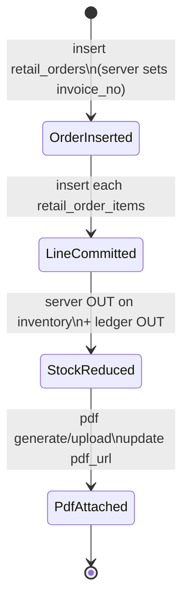

# Retail Invoicing and Live Inventory Business Rules

## 1. Scope

This specification covers Field Commander **Retail Invoicing and Live Inventory** behavior inferred from the original application:

1. **Live Inventory (My Inventory)** — authenticated field users view their assigned stock lines (item, batch, MRP, unit of measure, balance quantity), search/sort those lines, and see empty/loading states.
2. **Retail Invoicing / Order History** — users list their own retail invoices, search/filter/sort them, download or share invoice PDFs, and open new-invoice creation.
3. **New Invoice** — users identify a farmer buyer (mobile + name), select products from personal stock by item+batch, build a cart limited by available quantity, choose CASH or COMPANY UPI payment (UPI requires a payment-proof photo), submit an order, generate a PDF invoice, and store a retrievable PDF reference.
4. **Server-side stock and numbering** — on each order-line insert, balance for that executive/item/batch is decremented and an `OUT` ledger row is written; invoice numbers are assigned before order insert from the executive’s name prefix + per-executive sequence; admin/back-office transfers credit stock with `IN` ledger rows (not exposed in the mobile UI).
5. **Permissions and navigation** — entry via My Reports hub cards gated by retail module **view** rights; screens registered on the authenticated stack.
6. **Cross-module coupling** — farmer lookup by mobile for buyer autofill; shared filter modal; media upload for UPI proof and invoice PDF; global connectivity gate that blocks the entire app when offline.

**Explicitly out of scope as this module** (mentioned only to avoid confusion):

- Onboarding “inventory / stock / retail shop” **scoring copy** for dealers, distributors, and FPOs (profile questionnaires, not executive stock ledger).
- Farm Card “Core Land & Plot Inventory” and livestock inventory (farm assets, not product stock).
- Expense reimbursement, travel TA/DA, attendance punch rules (documented elsewhere); retail invoices do not create expenses in the client.
- Mobile warehouse UI, purchase orders, returns, refunds, credit sales, GST invoicing, multi-warehouse picker — **not implemented** in the mobile client. Admin stock **IN** transfers exist as backend routines (see Sections 6 and 20), not as Field Commander screens.

This document describes **what the application must do**, not how version 2 must implement it. Original technologies appear only as evidence (Section 20).

---

## 2. Retail Repository Evidence Map

### Screens and components

| File | Why it matters |
|------|----------------|
| `Frontend/src/modules/retail/screens/InventoryScreen.tsx` | Live inventory load, ownership filter, positive-qty filter, search/sort, empty/loading UI. |
| `Frontend/src/modules/retail/screens/RetailInvoicingScreen.tsx` | Order history load, search/filter/sort, PDF download/share, FAB and empty-state create invoice. |
| `Frontend/src/modules/retail/screens/NewInvoiceScreen.tsx` | Buyer lookup, product cart, MRP totals, CASH/UPI, proof capture, order+items insert, PDF generate/upload. |
| `Frontend/src/modules/reports/screens/ReportsHubScreen.tsx` | Sole UI entry: My Inventory + Retail Invoicing cards; `mobile_retail` view gate; restricted-area fallback. |
| `Frontend/src/design-system/components/FilterModal.tsx` | Inventory sort options; Invoices sort + payment-mode filter; Reset/Apply behavior. |
| `Frontend/src/design-system/components/EmptyState.tsx` | Empty inventory/orders CTAs. |
| `Frontend/src/design-system/components/Button.tsx` / `Input.tsx` | Submit button disable; buyer fields. |
| `Frontend/src/design-system/templates/FeedbackScreenTemplate.tsx` (via navigator) | Global offline blocking screen. |

### Hooks and forms

| File | Why it matters |
|------|----------------|
| **No** `Frontend/src/modules/retail/hooks.ts` | All retail form/state logic is local React state inside screens. |
| `Frontend/src/core/usePermissions.ts` | Resolves `mobile_retail` view/edit; SE hard-grant; TH/Super Admin all-access. |

### Schemas and validation

| Location | Why it matters |
|----------|----------------|
| Inline checks in `NewInvoiceScreen.handleSubmit` | Farmer name required; cart non-empty; UPI proof required when UPI. |
| **No** retail Zod/schema module | Mobile length, price ranges, stock recheck at submit not schema-enforced. |

### Services and APIs

| File | Why it matters |
|------|----------------|
| Inline Supabase calls in the three retail screens | Read `executive_inventory` / `item_master`; read/write `retail_orders`; write `retail_order_items`; read `farmers`. |
| `Frontend/src/modules/onboarding/services/cloudinaryService.ts` | Uploads UPI proof image and invoice PDF; returns secure URL. |
| **No** dedicated `retailService` | No shared API layer for stock mutation, cancellation, or refunds. |

### Backend / database routines (supplied evidence; not in Frontend repo)

| Routine (behavioral name) | Why it matters |
|---------------------------|----------------|
| Order-item stock-OUT trigger body | On each `retail_order_items` insert: load `se_id` + `invoice_no` from parent order; subtract `qty` from matching `executive_inventory` row (same `se_id`, `item_id`, `batch_number`); insert `inventory_transactions` row with `txn_type = 'OUT'` and `reference_id = invoice_no`. |
| Order invoice-number trigger body | Before/on `retail_orders` insert: build 4-letter prefix from executive profile name; set `invoice_no = prefix \|\| zero-padded 3-digit sequence` where sequence = count of that executive’s existing orders + 1. |
| Admin stock-IN (batch-aware) routine | Upsert `executive_inventory` on `(se_id, item_id, batch_number)` adding quantity; log `IN` with `reference_id = 'ADMIN_TRANSFER'`. |
| Admin stock-IN (item-only) routine | Alternate upsert on `(se_id, item_id)` without batch; log `IN` without batch — conflicts with batch-aware model (see audit). |

### Stores and state

| File | Why it matters |
|------|----------------|
| `Frontend/src/store/authStore.ts` | Supplies `user.id` as `se_id` ownership key. |
| `Frontend/src/store/alertStore.ts` | Success/error alerts for submit, download. |
| **No** retail Zustand store | No draft persistence, cart persistence, or offline invoice queue. |

### Navigation

| File | Why it matters |
|------|----------------|
| `Frontend/src/navigation/AppNavigator.tsx` | Auth gate; My Reports tab; stack routes `InventoryScreen`, `RetailInvoicingScreen`, `NewInvoiceScreen`; global offline gate. |

### Core and shared utilities

| File | Why it matters |
|------|----------------|
| `Frontend/src/core/permissions.ts` | Central camera permission helper — **not used** by New Invoice proof capture. |
| `Frontend/src/core/OfflineSyncManager.tsx` | Location sync only — **no retail queue**. |
| `Frontend/src/core/database.ts` | Pending locations only — **no retail tables**. |
| `Frontend/locales/en.json` (+ `hi.json`, `gu.json`) | Retail strings; some UI strings remain hardcoded English. |

### Related modules

| Module | Relationship |
|--------|----------------|
| Farmers / onboarding | Mobile lookup autofills buyer name and optional address fields for PDF. |
| Reports hub | Entry point and retail view permission gate. |
| Auth | Session required; screens unreachable without login. |
| Expenses / travel / shifts | **No** executable retail coupling (no shift gate, no expense creation from invoices). |
| Dashboard | No retail cards; dashboard.md notes shared FilterModal reuse only. |

Repository search covered retail-related symbols across `Frontend/src`, locales, and prior business-rule docs. SQL/trigger source files are **not** checked into this repository; stock-OUT, invoice-number, and admin-IN behaviors below are documented from **operator-supplied database function bodies** and must be treated as version-1 backend evidence.

---

## 3. Actors, Roles, and Permissions

### Relevant actors (from executable permission logic)

| Actor | How retail access is granted |
|-------|------------------------------|
| Sales Executive (`SE`) | Hardcoded `mobile_retail` with `can_view: true`, `can_edit: true`. |
| Territory Head (`TH`) / Super Admin | Treated as super-admin: all modules view+edit. |
| Other named roles | `role_permissions` rows for `mobile_retail` (if configured). |
| Unauthenticated user | Cannot reach My Reports or retail stack screens. |
| Authenticated user without retail view | Hub cards hidden; if also without travel view, Restricted Area UI. |
| Admin / back-office stock issuer (inferred) | Calls stock-IN transfer routines that credit `executive_inventory` and write `IN` ledger rows. **Not** callable from the mobile retail screens analyzed. |

### RET-ACT-001 — Authentication required for retail routes

- **Rule:** Retail inventory, order history, and new-invoice screens are available only when a current authenticated user session exists.
- **Business purpose:** Bind stock and invoices to a responsible employee.
- **Trigger/condition:** Navigator resolves session present vs absent.
- **Behavior/result:** No session → login/register only; with session → main tabs including My Reports and retail stack screens.
- **Actor/role:** Any signed-in user who can navigate to the screens.
- **Affected workflow:** All retail flows.
- **UX behavior:** Unauthenticated users never see retail UI.
- **Validation/error behavior:** N/A (route-level).
- **Online/offline behavior:** Even when authenticated, explicit offline connectivity replaces the navigator with a blocking offline screen.
- **Enforcement requirement:** Session required for navigation and for ownership-scoped data reads/writes.
- **Dependencies:** Auth session.
- **Original implementation evidence:**
  - `Frontend/src/navigation/AppNavigator.tsx:141-187` — session branch + retail screens
- **Confidence:** High

### RET-ACT-002 — Retail hub entry requires module view permission

- **Rule:** “My Inventory” and “Retail Invoicing” hub cards are shown only when the user has **view** access to the retail module (`mobile_retail`).
- **Business purpose:** Hide retail operations from roles not authorized to see stock/billing.
- **Trigger/condition:** Permission resolution on Reports Hub render.
- **Behavior/result:** Without view, both cards omitted. If user also lacks travel view, Restricted Area fallback.
- **Actor/role:** SE (default view); TH/Super Admin; other roles via permission records.
- **Affected workflow:** My Reports → Inventory / Retail Invoicing.
- **UX behavior:** Unauthorized = hidden cards (not disabled).
- **Validation/error behavior:** Restricted Area copy when no report modules allowed.
- **Online/offline behavior:** Cached permissions may drive UI until refresh; pull-to-refresh refreshes permissions.
- **Enforcement requirement:** UI hide is not sufficient; data access must isolate by authorized user.
- **Dependencies:** `usePermissions` / `getModulePerm('mobile_retail')`.
- **Original implementation evidence:**
  - `Frontend/src/modules/reports/screens/ReportsHubScreen.tsx:20,48-57,103-128`
  - `Frontend/src/core/usePermissions.ts:49-103`
- **Confidence:** High

### RET-ACT-003 — Retail edit permission is granted but not used to gate invoicing UI

- **Rule:** The permission model distinguishes `can_edit` for `mobile_retail`, but inventory, order history, FAB “create invoice,” empty-state create, and submit do **not** check `can_edit`.
- **Business purpose (inferred for permission model):** Separate viewers from billers. **Actual client behavior:** View alone unlocks create/submit entry points once the user can open Retail Invoicing (or navigate to the route).
- **Trigger/condition:** Any render of Retail Invoicing / New Invoice.
- **Behavior/result:** Users with view (and route access) can create invoices without an edit check.
- **Actor/role:** All users who can open Retail Invoicing.
- **Affected workflow:** New invoice creation.
- **UX behavior:** No “view-only” mode.
- **Validation/error behavior:** None for missing edit.
- **Online/offline behavior:** Same.
- **Enforcement requirement:** If view-only viewers must not bill, version 2 must enforce edit separately (client currently does not).
- **Dependencies:** RET-ACT-002.
- **Original implementation evidence:**
  - `Frontend/src/core/usePermissions.ts:58` — SE gets `can_edit: true`
  - `Frontend/src/modules/retail/screens/RetailInvoicingScreen.tsx:188-195,260-265` — create without edit check
  - `Frontend/src/modules/reports/screens/ReportsHubScreen.tsx:104` — only `can_view` checked
- **Confidence:** High

### RET-ACT-004 — Inventory and invoices are scoped to the current user as sales executive

- **Rule:** Inventory reads filter by `se_id = current user id`. Invoice list and new invoice inserts stamp/filter by the same user id as `se_id`.
- **Business purpose:** Each executive sees and creates only their own stock and bills.
- **Trigger/condition:** Fetch/insert with authenticated user id.
- **Behavior/result:** Missing user id yields empty ownership match (queries with `undefined` se_id).
- **Actor/role:** Acting sales executive (or any role using their profile id as `se_id`).
- **Affected workflow:** Inventory, order history, new invoice.
- **UX behavior:** No cross-user stock browser.
- **Validation/error behavior:** Inventory fetch errors logged to console only.
- **Online/offline behavior:** Requires online data access (global offline gate).
- **Enforcement requirement:** Server-side isolation must match client ownership filters; client filter alone is not security.
- **Dependencies:** Auth user id.
- **Original implementation evidence:**
  - `Frontend/src/modules/retail/screens/InventoryScreen.tsx:28-32`
  - `Frontend/src/modules/retail/screens/RetailInvoicingScreen.tsx:32-36`
  - `Frontend/src/modules/retail/screens/NewInvoiceScreen.tsx:37-41,191-197`
- **Confidence:** High

### RET-ACT-005 — No attendance/shift prerequisite for retail actions

- **Rule:** Retail screens do not require an active shift, punch-in, or attendance state.
- **Business purpose:** N/A (absence of gate).
- **Trigger/condition:** Opening inventory / invoicing / submit.
- **Behavior/result:** Retail proceeds regardless of shift store state.
- **Actor/role:** Any authorized retail user.
- **Affected workflow:** All retail.
- **UX behavior:** No shift warning on retail screens.
- **Validation/error behavior:** None.
- **Online/offline behavior:** N/A.
- **Enforcement requirement:** Do not invent a shift gate unless product policy adds one.
- **Dependencies:** None.
- **Original implementation evidence:**
  - No `shiftStore` / attendance references under `Frontend/src/modules/retail/**`
- **Confidence:** High

### RET-ACT-006 — Unauthorized retail: hub hide only; stack screens do not re-check module permission

- **Rule:** Once authenticated, `InventoryScreen`, `RetailInvoicingScreen`, and `NewInvoiceScreen` do not re-evaluate `mobile_retail` permissions; only the hub cards hide.
- **Business purpose (gap):** Defense in depth missing on screen entry.
- **Trigger/condition:** Direct navigation to registered stack route names.
- **Behavior/result:** A user without retail view who somehow reaches the route can still load data filtered only by `se_id`.
- **Actor/role:** Authenticated users lacking retail view.
- **Affected workflow:** Deep/stack navigation.
- **UX behavior:** No access-denied screen on retail screens themselves.
- **Validation/error behavior:** None.
- **Online/offline behavior:** Same.
- **Enforcement requirement:** Version 2 should treat hub hide as insufficient; enforce authorization at data and screen boundaries.
- **Dependencies:** RET-ACT-002, RET-ACT-004.
- **Original implementation evidence:**
  - Retail screens: no `usePermissions` import
  - `Frontend/src/navigation/AppNavigator.tsx:185-187` — screens registered for all authenticated users
- **Confidence:** High

---

## 4. Retail Entities and Data Contracts

### Entities observed in client behavior

#### Executive inventory line (`executive_inventory` + joined `item_master`)

| Field / concept | Client usage | Notes |
|-----------------|--------------|-------|
| `se_id` | Ownership filter | Must equal current user |
| `item_id` | Cart identity (with batch) | Used on invoice items |
| `batch_number` | Display, search, cart key, persisted on line items | Batch is first-class |
| `balance_qty` | Available stock; filter `> 0`; caps cart qty | Zero/negative lines hidden from lists |
| `updated_at` | Inventory default order (desc) | “Freshness” ordering only |
| `item_master.name` | Display / search | Required for UI render |
| `item_master.mrp` | Unit selling price (only price used) | No cost/margin fields in client |
| `item_master.uom` | Unit label on inventory card and PDF | Display only |

#### Farmer buyer (`farmers`)

| Field / concept | Client usage |
|-----------------|--------------|
| `mobile` | Exact match lookup when mobile length is 10 |
| `full_name` | Autofill farmer name |
| `village` | PDF address fragment |
| `personal_details.taluka` / `personal_details.city` | PDF address fragment |
| Persistence on order | Only `farmer_mobile` and `farmer_name` stored on `retail_orders` — not farmer id |

#### Retail order (`retail_orders`)

| Field / concept | Client usage |
|-----------------|--------------|
| `id` | List key; FK for items; PDF update target |
| `se_id` | Creator / ownership |
| `farmer_mobile` | Buyer phone as entered |
| `farmer_name` | Buyer name as entered/autofilled |
| `total_amount` | Grand total at submit (`MRP × qty` sum) |
| `payment_mode` | `'CASH'` or `'UPI'` |
| `payment_proof_url` | Media reference for UPI proof (nullable for CASH) |
| `invoice_no` | Returned after insert (server-generated); shown in list/PDF |
| `created_at` | List date display; PDF date |
| `pdf_url` | Retrievable PDF reference after generation |

#### Retail order item (`retail_order_items`)

| Field / concept | Client usage |
|-----------------|--------------|
| `order_id` | Parent order |
| `item_id` | Product |
| `batch_number` | Batch sold |
| `qty` | Integer cart quantity |
| `unit_price` | Snapshot of MRP at sale |
| `total_price` | `unit_price × qty` |

#### Inventory transaction ledger (`inventory_transactions`)

| Field / concept | Backend usage |
|-----------------|---------------|
| `se_id` | Executive whose stock moved |
| `item_id` | Product |
| `batch_number` | Present on batch-aware OUT and batch-aware IN; absent on item-only IN routine |
| `qty` | Absolute quantity moved (not signed in the insert; direction via `txn_type`) |
| `txn_type` | `'OUT'` on invoice line insert; `'IN'` on admin transfer |
| `reference_id` | Invoice number for OUT; literal `'ADMIN_TRANSFER'` for IN |

Mobile retail screens **do not** read or display this ledger.

### Generated / default values

| Value | Behavior |
|-------|----------|
| Invoice number | Assigned by server before/at order insert (see RET-INVW-009). Format: `{4-letter name prefix}{3-digit sequence}` e.g. first two letters of first name + first two of last name, uppercased, padded with `X`, then `COUNT(orders for se)+1` zero-padded to 3 digits. Client only reads the returned value. |
| Invoice date | Uses `created_at` from insert for PDF/list formatting (`en-IN` day-short-month-year). |
| Payment mode default | `'CASH'`. |
| Cart qty default | `1` on first add. |
| PDF company header | Hardcoded GLS company name/address/phone in HTML template. |
| PDF state | Hardcoded “Gujarat”. |
| Address fallback | If no village: `'Gujarat'`. |
| UPI ID / QR | Hardcoded company UPI string and remote QR image URL. |
| Stock after sale | `balance_qty := balance_qty - line.qty` for matching `(se_id, item_id, batch_number)` when each order line is inserted (server). |
| Stock after admin transfer | `balance_qty := balance_qty + transfer.qty` (upsert) for the target executive/item/(batch) (server). |
| Ledger OUT reference | Parent order’s `invoice_no`. |
| Ledger IN reference | Constant `'ADMIN_TRANSFER'`. |

### Transformations

- Grand total: sum of `mrp * qty` over cart (local).
- Line amount: `mrp * qty` (local; PDF uses `.toFixed(2)` for line/grand in HTML; on-screen grand total may show without forced 2-decimal formatting).
- Mobile display on history: `+91 {farmer_mobile}`.
- Invoice prefix: `UPPER(first2(firstName) \|\| first2(lastName))`, each name part from `profiles.name` split on space; missing parts → `'XX'`; pad to length 4 with `'X'`.
- Invoice sequence: `COUNT(retail_orders WHERE se_id = NEW.se_id) + 1` at insert time, then `LPAD(seq, 3, '0')`.

### Relationships

- Inventory line → item master (join for name/MRP/UOM).
- Inventory uniqueness (batch-aware path): `(se_id, item_id, batch_number)`.
- Alternate IN path uniqueness: `(se_id, item_id)` only — see consistency audit.
- Order → many order items.
- Order item insert → stock OUT mutation + ledger OUT row (server).
- Admin transfer call → stock IN upsert + ledger IN row (server).
- Order → optional payment proof media reference.
- Order → optional PDF media reference.
- Order → farmer identity is **denormalized** (name/mobile), not a required FK to `farmers` in client insert.

---

## 5. Inventory Screen Rules

### RET-INV-001 — Load inventory on screen focus

- **Rule:** When the Live Inventory screen gains focus, the application must reload inventory for the current user and show a loading indicator until the load completes.
- **Business purpose:** Present current assigned stock when the user opens or returns to the screen.
- **Trigger/condition:** Screen focus; dependency on user id.
- **Behavior/result:** Loading spinner + “Syncing stock ledger...” then list or empty state.
- **Actor/role:** Current user.
- **Affected workflow:** Live Inventory.
- **UX behavior:** Replaces previous list while loading (loading branch hides list).
- **Validation/error behavior:** On error, logs message; still sets inventory to `data || []` (empty if failed).
- **Online/offline behavior:** Requires connectivity (global offline gate). Not a true sync queue.
- **Enforcement requirement:** Refetch on enter/return; surface failures (client currently under-surfaces errors).
- **Dependencies:** RET-ACT-004.
- **Original implementation evidence:**
  - `Frontend/src/modules/retail/screens/InventoryScreen.tsx:24-44,111-115`
- **Confidence:** High

### RET-INV-002 — Only positive balance lines are listed

- **Rule:** Inventory listing includes only lines where balance quantity is greater than zero.
- **Business purpose:** Show sellable/available stock only.
- **Trigger/condition:** Inventory query.
- **Behavior/result:** Zero and negative balances never appear on Live Inventory.
- **Actor/role:** Current user.
- **Affected workflow:** Live Inventory.
- **UX behavior:** Empty state if no positive lines.
- **Validation/error behavior:** N/A.
- **Online/offline behavior:** Online read.
- **Enforcement requirement:** Same filter for sellable stock elsewhere (New Invoice uses the same).
- **Dependencies:** None.
- **Original implementation evidence:**
  - `Frontend/src/modules/retail/screens/InventoryScreen.tsx:32`
- **Confidence:** High

### RET-INV-003 — Inventory identity is item + batch for the executive

- **Rule:** Each displayed row is an executive stock line identified by product master fields plus `batch_number`, showing `balance_qty`, MRP, and UOM.
- **Business purpose:** Distinguish batches of the same product.
- **Trigger/condition:** Successful inventory load.
- **Behavior/result:** Card shows name, “Batch: …”, “MRP: ₹… / {uom}”, large balance count labeled “UNITS”.
- **Actor/role:** Current user.
- **Affected workflow:** Live Inventory.
- **UX behavior:** Read-only cards (no adjust/edit actions).
- **Validation/error behavior:** Assumes `item_master` present (renders `item.item_master.name` without null guard in list item).
- **Online/offline behavior:** Online.
- **Enforcement requirement:** Preserve batch-level display.
- **Dependencies:** Item master join.
- **Original implementation evidence:**
  - `Frontend/src/modules/retail/screens/InventoryScreen.tsx:130-144`
- **Confidence:** High

### RET-INV-004 — Search by product name or batch (substring, case-insensitive)

- **Rule:** User may filter the loaded list by a search string matching product name or batch number (case-insensitive substring).
- **Business purpose:** Find stock quickly.
- **Trigger/condition:** Non-empty search query.
- **Behavior/result:** List shows matches only; clear control appears when query non-empty.
- **Actor/role:** Current user.
- **Affected workflow:** Live Inventory.
- **UX behavior:** Empty “No matches found” when search yields none.
- **Validation/error behavior:** N/A.
- **Online/offline behavior:** Client-side filter on already-loaded data.
- **Enforcement requirement:** Local filter only; does not re-query server.
- **Dependencies:** RET-INV-001.
- **Original implementation evidence:**
  - `Frontend/src/modules/retail/screens/InventoryScreen.tsx:50-56,90-94,121-125`
- **Confidence:** High

### RET-INV-005 — Sort options for inventory

- **Rule:** User may sort inventory by name A–Z (default), quantity high→low, or quantity low→high.
- **Business purpose:** Organize stock view.
- **Trigger/condition:** Filter modal apply; default `sortBy: 'name_asc'`.
- **Behavior/result:** Client-side sort of filtered list.
- **Actor/role:** Current user.
- **Affected workflow:** Live Inventory.
- **UX behavior:** Filter button highlights when sort ≠ `name_asc`.
- **Validation/error behavior:** N/A.
- **Online/offline behavior:** Client-side.
- **Enforcement requirement:** Preserve available sort behaviors.
- **Dependencies:** FilterModal entityType `"Inventory"`.
- **Original implementation evidence:**
  - `Frontend/src/modules/retail/screens/InventoryScreen.tsx:22,58-64,96-107`
  - `Frontend/src/design-system/components/FilterModal.tsx:202-205`
- **Confidence:** High

### RET-INV-006 — Inventory is read-only in the mobile app

- **Rule:** The Live Inventory screen provides no create, adjust, transfer, reserve, damage, or delete actions. Stock increases are performed by back-office admin transfer routines; stock decreases occur automatically when invoice lines are inserted (server).
- **Business purpose:** Mobile is a viewer of assigned stock; replenishment is outside this UI (copy references warehouse manager / transfers).
- **Trigger/condition:** Screen render.
- **Behavior/result:** View/search/sort only on device.
- **Actor/role:** Current user (viewer); admin issuer for IN.
- **Affected workflow:** Live Inventory.
- **UX behavior:** Empty-state text instructs contacting warehouse manager for stock transfers.
- **Validation/error behavior:** N/A.
- **Online/offline behavior:** N/A.
- **Enforcement requirement:** Preserve mobile read-only; preserve server IN/OUT as the mutation authority.
- **Dependencies:** RET-STK-007, RET-STK-010.
- **Original implementation evidence:**
  - `Frontend/src/modules/retail/screens/InventoryScreen.tsx` — no mutation calls
  - Empty description `:125`
  - Operator-supplied admin IN routines
- **Confidence:** High

### RET-INV-007 — “Live” means refetch-on-focus, not realtime push

- **Rule:** Inventory is labeled “Live Inventory” and hub subtitle mentions “live stock & transfers,” but the client does not subscribe to realtime stock channels; it refetches when the screen is focused. After an invoice, balances change on the server immediately, but the device shows the new balance only after the next inventory refetch (typically on focus).
- **Business purpose (marketing/UI):** Suggest current stock. **Actual behavior:** Near-real-time only insofar as user reopens/refocuses the screen while online.
- **Trigger/condition:** Focus effect.
- **Behavior/result:** No automatic mid-session push updates; no pull-to-refresh on InventoryScreen.
- **Actor/role:** Current user.
- **Affected workflow:** Live Inventory.
- **UX behavior:** Loading copy “Syncing stock ledger...” during fetch.
- **Validation/error behavior:** Fetch errors not shown in UI.
- **Online/offline behavior:** Online only.
- **Enforcement requirement:** Document refresh semantics honestly; do not claim websocket realtime unless implemented.
- **Dependencies:** RET-INV-001, RET-STK-007.
- **Original implementation evidence:**
  - `InventoryScreen.tsx:24-44` — `useFocusEffect` only
  - No realtime channel usage in retail module
  - Hub subtitle `ReportsHubScreen.tsx:112`
- **Confidence:** High

### RET-INV-008 — Empty and search-empty states

- **Rule:** With no rows after filter, show EmptyState: if searching → “No matches found” / adjust search; else → “No Stock Available” / warehouse contact copy, action “Go Back”.
- **Business purpose:** Guide next step when empty.
- **Trigger/condition:** `filteredInventory` empty and not loading.
- **Behavior/result:** CTA navigates back.
- **Actor/role:** Current user.
- **Affected workflow:** Live Inventory.
- **UX behavior:** As above.
- **Validation/error behavior:** Distinguishes search vs true empty.
- **Online/offline behavior:** Online.
- **Enforcement requirement:** Preserve empty guidance.
- **Dependencies:** EmptyState component.
- **Original implementation evidence:**
  - `Frontend/src/modules/retail/screens/InventoryScreen.tsx:121-128`
- **Confidence:** High

### RET-INV-009 — Absent inventory concepts in mobile UI

- **Rule:** The following are **not** implemented on InventoryScreen: reserved qty, damaged/expired qty, visible incoming/outgoing ledger UI, multi-warehouse selection, low-stock threshold UI, category filters, SKU field, serial numbers, expiry dates, manual refresh control, pagination. Backend does maintain an `inventory_transactions` ledger for IN/OUT, but the mobile app never displays it.
- **Business purpose:** N/A (gaps in mobile).
- **Trigger/condition:** N/A.
- **Behavior/result:** Only `balance_qty` as available/on-hand proxy in the UI.
- **Confidence:** High
- **Original implementation evidence:** Absence across `InventoryScreen.tsx`; ledger writes only in supplied backend bodies.

---

## 6. Live Inventory and Stock-Mutation Rules

### RET-STK-001 — Cart quantity cannot exceed loaded balance

- **Rule:** While building an invoice, quantity for an item+batch cannot be increased beyond the `balance_qty` value loaded into the New Invoice screen.
- **Business purpose:** Prevent overselling relative to the snapshot shown on the device.
- **Trigger/condition:** Add / increment press.
- **Behavior/result:** Increment ignored when `qty >= balance_qty`; add button disabled/muted.
- **Actor/role:** Billing user.
- **Affected workflow:** New Invoice cart.
- **UX behavior:** Plus control disabled at cap.
- **Validation/error behavior:** Silent no-op (no alert when capped).
- **Online/offline behavior:** Uses snapshot from initial fetch; not revalidated at submit.
- **Enforcement requirement:** Client cap is snapshot-based only; server deduction is separate (RET-STK-007).
- **Dependencies:** RET-INV-002.
- **Original implementation evidence:**
  - `Frontend/src/modules/retail/screens/NewInvoiceScreen.tsx:62-68,255-257`
- **Confidence:** High

### RET-STK-002 — Client does not directly mutate inventory; server deducts on line insert

- **Rule:** The mobile client never updates `executive_inventory.balance_qty`. Authoritative deduction happens on the server when each `retail_order_items` row is inserted (after the parent order exists).
- **Business purpose:** Keep stock mutation centralized and tied to sold lines.
- **Trigger/condition:** Successful insert of one or more order lines during New Invoice submit.
- **Behavior/result:** Client inserts lines only; server subtracts stock and writes OUT ledger (RET-STK-007). Live Inventory shows reduced balances after the next refetch.
- **Actor/role:** Billing user (initiator); server enforces mutation.
- **Affected workflow:** New Invoice → Live Inventory.
- **UX behavior:** No stock-change confirmation toast; user must reopen/refocus inventory to see new balances.
- **Validation/error behavior:** Client does not surface stock-update failures separately from order-item insert failures.
- **Online/offline behavior:** Requires online line insert; no offline stock mutation.
- **Enforcement requirement:** Version 2 must preserve automatic stock reduction when invoice lines are committed, without requiring the mobile client to write balances.
- **Dependencies:** RET-STK-007, RET-INVW-006.
- **Original implementation evidence:**
  - `NewInvoiceScreen.tsx:181-226` — client writes only `retail_orders` / `retail_order_items` / `pdf_url`
  - Operator-supplied order-item stock-OUT trigger body
- **Confidence:** High

### RET-STK-003 — No stock reservation during draft/cart

- **Rule:** Adding items to the cart does not reserve stock remotely; cart is local React state only. Server deduction occurs only when lines are inserted.
- **Business purpose:** N/A.
- **Trigger/condition:** Cart add/remove.
- **Behavior/result:** Concurrent users can both select the same available units based on their snapshots until each commits lines.
- **Actor/role:** Billing users.
- **Affected workflow:** New Invoice.
- **UX behavior:** No “reserved” indicator.
- **Validation/error behavior:** No stale-stock warning at submit.
- **Online/offline behavior:** Cart lost if screen unmounts / app killed.
- **Enforcement requirement:** Document race risk; no client concurrency control; server UPDATE does not check remaining qty before subtract.
- **Dependencies:** RET-STK-001, RET-STK-007.
- **Original implementation evidence:**
  - `NewInvoiceScreen.tsx:24,62-78` — local `cart` state only
- **Confidence:** High

### RET-STK-004 — No stock restore for cancel/return/refund

- **Rule:** There is no cancel, return, or refund workflow in the client or in the supplied backend bodies; therefore no automatic stock restoration (reverse OUT / compensating IN keyed to invoice) exists for voided sales. Admin IN transfers credit stock but are not invoice reversals.
- **Business purpose:** N/A.
- **Trigger/condition:** N/A.
- **Behavior/result:** Orders remain as created; history allows PDF actions only; deducted stock stays deducted unless separately re-transferred IN.
- **Confidence:** High
- **Original implementation evidence:** `RetailInvoicingScreen.tsx` actions are download/share only (`:224-254`); supplied SQL has OUT on insert and IN on admin transfer only.

### RET-STK-005 — No submit-time stock recheck in client; server does not guard negative balances

- **Rule:** Before final submit, the application does not re-fetch inventory or re-validate quantities against current stock. The server OUT update subtracts `NEW.qty` without an evidenced `balance_qty >= NEW.qty` check, so balances may become negative if concurrent sales or stale carts oversell.
- **Business purpose (gap):** Oversell possible.
- **Trigger/condition:** `handleSubmit` / line insert trigger.
- **Behavior/result:** Proceeds with cart snapshot; server still decrements matching row if found.
- **Confidence:** High
- **Original implementation evidence:** `NewInvoiceScreen.tsx:181-211`; OUT trigger `balance_qty = balance_qty - NEW.qty` with no sufficiency predicate.

### RET-STK-006 — Inventory for invoicing loaded once on mount (not on focus)

- **Rule:** New Invoice loads inventory in a mount `useEffect`, not on every focus; leaving and returning without remount may keep a stale product list even though server balances already changed from other sales.
- **Business purpose (gap):** Stale sellable list risk.
- **Trigger/condition:** Component mount / user id change.
- **Behavior/result:** Unlike InventoryScreen, no focus refetch.
- **Confidence:** High
- **Original implementation evidence:**
  - `NewInvoiceScreen.tsx:34-45` vs `InventoryScreen.tsx:24-44`

### RET-STK-007 — Automatic stock OUT per invoice line (server)

- **Rule:** When an order line is inserted, the system must: (1) resolve the parent order’s `se_id` and `invoice_no` from `order_id`; (2) decrease `executive_inventory.balance_qty` by the line quantity for the matching `(se_id, item_id, batch_number)` and set `updated_at` to now; (3) insert an `inventory_transactions` row with the same se/item/batch, `qty` = line qty, `txn_type = 'OUT'`, and `reference_id` = that invoice number.
- **Business purpose:** Keep on-hand stock and an audit trail aligned with sold lines, batch-strict.
- **Trigger/condition:** Insert into order-line table (after parent order exists so `invoice_no` is available).
- **Behavior/result:** One OUT mutation + one ledger row per line. Multiple lines → multiple deductions.
- **Actor/role:** System on behalf of billing user.
- **Affected workflow:** New Invoice submit (item insert step).
- **UX behavior:** Not shown in mobile UI; reflected on next inventory load.
- **Validation/error behavior:** Supplied body does not raise if no inventory row matches (UPDATE affects 0 rows) and does not block negative balances.
- **Online/offline behavior:** Occurs only when line insert reaches the server.
- **Enforcement requirement:** Deduction must be batch-strict and tied to committed lines; ledger OUT must reference the invoice number.
- **Dependencies:** Parent order with `se_id` and `invoice_no` (RET-INVW-009); line must include `item_id`, `batch_number`, `qty`.
- **Original implementation evidence:**
  - Operator-supplied PL/pgSQL body selecting from `retail_orders` where `id = NEW.order_id`, updating `executive_inventory`, inserting `inventory_transactions` with `'OUT'`
  - Client insert of lines: `NewInvoiceScreen.tsx:203-211`
- **Confidence:** High (behavior of supplied body); Medium for exact trigger timing name (BEFORE/AFTER) — body assumes `NEW.order_id` and parent row already present

### RET-STK-008 — Stock deduction timing relative to client submit steps

- **Rule:** Client order of operations is: insert order header → insert all line items → generate/upload PDF → update `pdf_url`. Stock OUT fires on each line insert, therefore **before** PDF generation. If line insert fails after header insert, header may exist without full lines/stock effects; if PDF fails after lines, stock is already reduced.
- **Business purpose:** Clarify partial-failure coupling.
- **Trigger/condition:** `handleSubmit` sequence.
- **Behavior/result:** Stock and ledger move with lines, not with PDF success.
- **Actor/role:** Billing user / system.
- **Affected workflow:** New Invoice.
- **UX behavior:** Success alert only after full try block; stock may already have moved if later steps fail.
- **Validation/error behavior:** Line insert errors are not explicitly checked in client before PDF work.
- **Online/offline behavior:** Online.
- **Enforcement requirement:** Version 2 should treat line commit as the stock-critical boundary; document or harden partial failure.
- **Dependencies:** RET-STK-007, RET-INVW-006.
- **Original implementation evidence:** `NewInvoiceScreen.tsx:191-218` + RET-STK-007.
- **Confidence:** High

### RET-STK-009 — Matching inventory row required for effective OUT

- **Rule:** OUT update is keyed by `(se_id, item_id, batch_number)`. If no row matches, the supplied UPDATE changes nothing while the OUT ledger insert still runs (as written). Effective on-hand reduction therefore requires a pre-existing inventory row for that batch (normally created by admin IN).
- **Business purpose:** Batch-strict ledger.
- **Trigger/condition:** Line insert with batch that does not exist in executive inventory.
- **Behavior/result:** Possible ledger OUT without balance change (integrity gap).
- **Actor/role:** System.
- **Affected workflow:** Invoice with mismatched batch.
- **UX behavior:** None.
- **Validation/error behavior:** No evidenced RAISE on 0-row update.
- **Online/offline behavior:** Server-side.
- **Enforcement requirement:** Prefer fail-closed or upsert policy if product requires strict integrity.
- **Dependencies:** RET-STK-007, RET-STK-010.
- **Original implementation evidence:** Supplied OUT `UPDATE ... WHERE se_id AND item_id AND batch_number` without row-count check; unconditional `INSERT INTO inventory_transactions`.
- **Confidence:** High for supplied SQL semantics

### RET-STK-010 — Admin stock IN (batch-aware transfer)

- **Rule:** An admin/back-office transfer credits stock by upserting `executive_inventory` for `(se_id, item_id, batch_number)`: insert with `balance_qty = p_qty` or add `p_qty` to existing balance and touch `updated_at`; then insert `inventory_transactions` with `txn_type = 'IN'`, same batch, `reference_id = 'ADMIN_TRANSFER'`.
- **Business purpose:** Assign or replenish executive batch stock outside the mobile app.
- **Trigger/condition:** Invocation of the batch-aware transfer routine with `p_se_id`, `p_item_id`, `p_batch_number`, `p_qty`.
- **Behavior/result:** Balance increases; IN ledger row written.
- **Actor/role:** Admin / warehouse issuer (not mobile retail UI).
- **Affected workflow:** Stock replenishment → later visible on Live Inventory when balance > 0.
- **UX behavior:** Mobile empty-state tells user to contact warehouse manager; no in-app transfer screen.
- **Validation/error behavior:** Not evidenced in supplied body (no negative/zero checks).
- **Online/offline behavior:** Server-side; mobile only observes after refetch.
- **Enforcement requirement:** Preserve batch-aware credit path as the replenishment model aligned with mobile batch selling.
- **Dependencies:** Unique constraint on `(se_id, item_id, batch_number)` implied by `ON CONFLICT`.
- **Original implementation evidence:** Operator-supplied batch-aware IN routine.
- **Confidence:** High

### RET-STK-011 — Alternate admin stock IN without batch (legacy/conflicting)

- **Rule:** A second supplied routine upserts on `(se_id, item_id)` only (no batch) and logs IN without `batch_number`. This conflicts with the batch-strict mobile sell path and batch-aware OUT/IN routines.
- **Business purpose:** Ambiguous — likely older transfer API.
- **Trigger/condition:** Invocation of item-only transfer routine.
- **Behavior/result:** Stock row may exist without batch while sales require batch match → OUT may not reduce the intended row (RET-STK-009).
- **Actor/role:** Admin issuer.
- **Affected workflow:** Transfers that omit batch.
- **UX behavior:** None in mobile.
- **Validation/error behavior:** N/A.
- **Online/offline behavior:** Server-side.
- **Enforcement requirement:** Version 2 should treat batch-aware IN as the aligned model; resolve or retire item-only IN.
- **Dependencies:** RET-STK-007, RET-STK-010.
- **Original implementation evidence:** Operator-supplied item-only IN routine with `ON CONFLICT (se_id, item_id)`.
- **Confidence:** High that both bodies were supplied; **Ambiguous** which is deployed/active

### RET-STK-012 — No mobile visibility of inventory transaction history

- **Rule:** `inventory_transactions` rows are written for IN and OUT but are not listed, filtered, or shown on any analyzed mobile retail screen.
- **Confidence:** High
- **Original implementation evidence:** No references to `inventory_transactions` under `Frontend/src`.

---

## 7. New-Invoice Workflow Rules

### RET-INVW-001 — Entry points to New Invoice

- **Rule:** User can open New Invoice from Order History FAB, or from empty-state “Create Invoice” when no search/filters match, or by stack navigation to `NewInvoiceScreen`.
- **Business purpose:** Start billing.
- **Trigger/condition:** Press create controls.
- **Behavior/result:** New Invoice screen opens.
- **Actor/role:** User who reached Order History (hub view permission for normal path).
- **Affected workflow:** New Invoice.
- **UX behavior:** FAB always visible on Order History (not permission-gated for edit).
- **Validation/error behavior:** N/A.
- **Online/offline behavior:** Blocked by global offline screen.
- **Enforcement requirement:** Preserve entry paths; consider edit gate (currently absent).
- **Dependencies:** RET-ACT-003.
- **Original implementation evidence:**
  - `RetailInvoicingScreen.tsx:188-195,260-265`
- **Confidence:** High

### RET-INVW-002 — Buyer mobile and name

- **Rule (v2 locked):** User enters 10-digit mobile and farmer name. When mobile length is exactly 10, the app looks up the farmer registry and autofills name when found. **Both name and 10-digit mobile are required at submit.** Name remains editable after autofill.
- **Business purpose:** Identify buyer; reuse onboarded farmer when possible; still allow walk-in / unregistered buyers.
- **Trigger/condition:** Mobile length changes; submit.
- **Behavior/result:** Lookup hit autofills name; lookup miss leaves manual name — submit still allowed if both fields valid.
- **Actor/role:** Billing user.
- **Affected workflow:** New Invoice step 1.
- **UX behavior:** Searching spinner on name field while lookup runs.
- **Validation/error behavior:** Reject submit if name empty or mobile not exactly 10 digits.
- **Online/offline behavior:** Lookup requires online; submit requires online (no retail outbox).
- **Enforcement requirement:** Name + mobile required; registry membership **not** required.
- **Dependencies:** Farmers lookup (read-only).
- **Original implementation evidence:**
  - `NewInvoiceScreen.tsx:47-59,182,276-297`
- **Confidence:** High

### RET-INVW-003 — Buyer must not be created inline as a new farmer record

- **Rule:** New Invoice does not create a farmer profile; it only optionally reads an existing farmer and always stores denormalized name/mobile on the order.
- **Business purpose:** Allow billing even when farmer is not in registry (manual name).
- **Trigger/condition:** Submit with typed name.
- **Behavior/result:** Order insert without farmer id.
- **Actor/role:** Billing user.
- **Affected workflow:** New Invoice.
- **UX behavior:** Name placeholder “Enter name or auto-fetch...”.
- **Validation/error behavior:** No “farmer must exist” error.
- **Online/offline behavior:** Online submit.
- **Enforcement requirement:** **Locked:** unregistered buyers intentionally billable — no farmers insert on invoice.
- **Dependencies:** None.
- **Original implementation evidence:**
  - `NewInvoiceScreen.tsx:191-197` — no farmers insert
- **Confidence:** High

### RET-INVW-004 — Supported buyer type is farmer-oriented only

- **Rule:** Buyer UX and lookup target farmers only; dealers, distributors, and FPOs are not selectable buyer types in this flow.
- **Business purpose:** Field retail to farmers.
- **Trigger/condition:** Screen design / farmers query.
- **Behavior/result:** No entity-type switcher.
- **Confidence:** High
- **Original implementation evidence:** `NewInvoiceScreen.tsx:51,287` — farmers / “Farmer Name”.

### RET-INVW-005 — Payment modes CASH and UPI

- **Rule:** User must choose `CASH` (default) or `UPI` (labeled “COMPANY UPI”). UPI shows company UPI ID, QR image, and requires a camera-captured payment proof before submit.
- **Business purpose:** Record how payment was collected; evidence for UPI.
- **Trigger/condition:** Payment selection; submit.
- **Behavior/result:** CASH needs no proof; UPI without proof alerts and aborts.
- **Actor/role:** Billing user.
- **Affected workflow:** Checkout.
- **UX behavior:** Checkout section visible only when cart has items; proof button shows “Proof Attached” after capture.
- **Validation/error behavior:** “UPI Payment screenshot is required.”
- **Online/offline behavior:** Proof upload requires network during submit.
- **Enforcement requirement:** Preserve mode set and UPI proof requirement.
- **Dependencies:** Media upload.
- **Original implementation evidence:**
  - `NewInvoiceScreen.tsx:30-31,184,387-416`
- **Confidence:** High

### RET-INVW-006 — Submit creates order, line items (stock OUT), PDF, then navigates back

- **Rule:** On valid submit: optionally upload proof → insert `retail_orders` (server assigns `invoice_no`) → insert all `retail_order_items` (each insert triggers batch-strict stock OUT + ledger) → generate PDF from HTML → upload PDF → update order `pdf_url` → success alert with invoice number → `navigation.goBack()`.
- **Business purpose:** Persist sale, reduce on-hand stock, and deliver shareable invoice.
- **Trigger/condition:** Generate Bill press when cart non-empty and not already submitting.
- **Behavior/result:** Order history can later download/share if `pdf_url` set; inventory balances reduced for sold batches once lines commit.
- **Actor/role:** Billing user.
- **Affected workflow:** New Invoice.
- **UX behavior:** Button shows “Generating Invoice...” and is disabled while submitting; footer disabled when cart empty; no explicit “stock deducted” message.
- **Validation/error behavior:** Failures show “Transaction Failed” with error message; `isSubmitting` cleared in `finally`.
- **Online/offline behavior:** Fully online path; no offline queue.
- **Enforcement requirement:** Preserve line-commit as stock-critical step; harden partial failure (see RET-STK-008).
- **Dependencies:** Media upload; order tables; RET-STK-007; RET-INVW-009.
- **Original implementation evidence:**
  - `NewInvoiceScreen.tsx:181-226,421-422`
  - Operator-supplied OUT and invoice-number bodies
- **Confidence:** High

### RET-INVW-007 — No draft / save-partial / resume invoice

- **Rule:** There is no save-as-draft, local persistence of cart/buyer, or resume of incomplete invoices.
- **Business purpose:** N/A.
- **Trigger/condition:** Leaving screen / killing app.
- **Behavior/result:** In-progress invoice state is discarded.
- **Confidence:** High
- **Original implementation evidence:** No draft store; only local `useState`.

### RET-INVW-008 — No invoice date picker; date is server create time

- **Rule:** User cannot set or restrict invoice date; PDF/list use `created_at` from the inserted order.
- **Confidence:** High
- **Original implementation evidence:** `NewInvoiceScreen.tsx:213-214`; no date field in UI.

### RET-INVW-009 — Invoice number assigned by server from executive name + sequence

- **Rule:** Client does not compose invoice numbers. On order insert, the server sets `invoice_no` as:
  1. Read executive `profiles.name` for `NEW.se_id`.
  2. First token → first two characters; second token → first two characters (missing/blank → `'XX'`).
  3. Concatenate, uppercase; if length < 4, right-pad with `'X'` to length 4.
  4. `seq = COUNT(retail_orders WHERE se_id = NEW.se_id) + 1`.
  5. `invoice_no = prefix || LPAD(seq::text, 3, '0')` (three-digit zero pad for seq < 1000; larger seq expands width).
  Client reads returned `invoice_no` for PDF, alert, and list display. OUT ledger uses this same number as `reference_id`.
- **Business purpose:** Per-executive readable invoice identifiers.
- **Trigger/condition:** Insert into `retail_orders`.
- **Behavior/result:** Example shape: `RAKE001` for first order of “Ravi Kumar”.
- **Actor/role:** System on insert.
- **Affected workflow:** New Invoice / Order History / stock OUT reference.
- **UX behavior:** Shown after successful create.
- **Validation/error behavior:** No evidenced uniqueness constraint beyond generation logic; concurrent inserts can compute the same `COUNT+1` (race).
- **Online/offline behavior:** Server-only generation.
- **Enforcement requirement:** Preserve server-side generation; consider stronger uniqueness if required.
- **Dependencies:** `profiles.name`; existing order count per `se_id`.
- **Original implementation evidence:**
  - Operator-supplied invoice-number PL/pgSQL body
  - `NewInvoiceScreen.tsx:198,214,220`
- **Confidence:** High for formula; Medium for concurrency/uniqueness guarantees

### RET-INVW-010 — Close/back discards unsaved invoice without confirm

- **Rule:** Header close calls `navigation.goBack()` with no unsaved-changes prompt.
- **Confidence:** High
- **Original implementation evidence:** `NewInvoiceScreen.tsx:266`.

### RET-INVW-011 — Duplicate submit prevention via submitting flag

- **Rule:** While `isSubmitting` is true, Generate Bill is disabled and label switches to “Generating Invoice...”.
- **Confidence:** High
- **Original implementation evidence:** `NewInvoiceScreen.tsx:186,224-225,422`.

---

## 8. Product Selection, Cart, and Line-Item Rules

### RET-CART-001 — Product list from executive positive stock

- **Rule:** Sellable products are the current user’s `executive_inventory` rows with `balance_qty > 0`, including `item_id`, `batch_number`, and item master name/MRP/UOM.
- **Confidence:** High
- **Original implementation evidence:** `NewInvoiceScreen.tsx:35-42`.

### RET-CART-002 — Search/browse products by name or batch

- **Rule:** Product search filters the loaded inventory by name or batch (case-insensitive substring). Expanding the list shows all filtered rows; collapsing shows selected cart rows or a dashed “tap search…” empty prompt.
- **Confidence:** High
- **Original implementation evidence:** `NewInvoiceScreen.tsx:229-233,312-358`.

### RET-CART-003 — Cart line key is item_id + batch_number

- **Rule:** Lines are unique per item and batch; adding the same pair increments quantity instead of duplicating rows.
- **Confidence:** High
- **Original implementation evidence:** `NewInvoiceScreen.tsx:61-68`.

### RET-CART-004 — Quantity is integer step ±1

- **Rule:** Quantity increases/decreases by 1; minimum effective quantity is 1 while on cart (decrease from 1 removes line). Zero and negative quantities are not enterable via UI. Decimals are not supported.
- **Confidence:** High
- **Original implementation evidence:** `NewInvoiceScreen.tsx:62-77`.

### RET-CART-005 — Remove line and decrement

- **Rule:** Minus decreases qty; at qty 1, removes the line from cart. Minus disabled visually when qty in cart is 0 (search list).
- **Confidence:** High
- **Original implementation evidence:** `NewInvoiceScreen.tsx:71-77,251-253`.

### RET-CART-006 — Selected count badge

- **Rule:** When cart has items, show “{n} Selected” badge in Add Products header (`n` = number of distinct lines, not total units).
- **Confidence:** High
- **Original implementation evidence:** `NewInvoiceScreen.tsx:305-308`.

### RET-CART-007 — Empty cart blocks checkout UI and submit button

- **Rule:** Checkout & Payment section renders only when `cart.length > 0`. Footer Generate Bill is disabled when cart empty.
- **Confidence:** High
- **Original implementation evidence:** `NewInvoiceScreen.tsx:364,422`.

### RET-CART-008 — Hide zero-stock rows from search when not in cart

- **Rule:** In browse mode, rows with `balance_qty === 0` and zero cart qty are not rendered (defensive; query already excludes ≤0).
- **Confidence:** Medium (mostly unreachable given query filter).
- **Original implementation evidence:** `NewInvoiceScreen.tsx:239-240`.

### RET-CART-009 — No max line-count limit beyond stock

- **Rule:** No explicit maximum number of distinct line items beyond available inventory rows.
- **Confidence:** High
- **Original implementation evidence:** Absence of limit checks.

### RET-CART-010 — Display fields per line

- **Rule:** Each product row shows name, MRP, batch, stock balance; checkout summary shows name, qty, batch, line amount `mrp*qty`.
- **Confidence:** High
- **Original implementation evidence:** `NewInvoiceScreen.tsx:245-248,369-378`.

---

## 9. Pricing, Discount, Tax, and Calculation Rules

### RET-CALC-001 — Unit price is MRP only; no override

- **Rule:** Selling price is always `item_master.mrp`. There is no manual price override, price list selection, or cost/margin display.
- **Confidence:** High
- **Original implementation evidence:** `NewInvoiceScreen.tsx:86,208-209` and comments “Pure MRP Calculation (No Tax Logic)”.

### RET-CALC-002 — Line total and grand total formulas

- **Rule:**
  - Line amount = `mrp × qty`
  - Grand total = Σ line amounts
  - Persisted `unit_price` = mrp; `total_price` = mrp × qty; `total_amount` = grand total
- **Business purpose:** Simple MRP billing.
- **Trigger/condition:** Cart changes; submit.
- **Behavior/result:** On-screen grand total and PDF grand total use the same sum; PDF formats with two decimals; on-screen may display raw number.
- **Actor/role:** Billing user.
- **Affected workflow:** New Invoice / PDF / persisted order.
- **UX behavior:** Footer button embeds grand total in label.
- **Validation/error behavior:** No validation that MRP is positive.
- **Online/offline behavior:** Calculated locally.
- **Enforcement requirement:** Preserve MRP-only formula unless tax/discount policy is added.
- **Dependencies:** Cart contents.
- **Original implementation evidence:**
  - `NewInvoiceScreen.tsx:86,167,203-210,381-383`
- **Confidence:** High

### RET-CALC-003 — No discount, tax, GST, shipping, or fees

- **Rule:** Discount (line or invoice), tax/GST breakdown, taxable amount, shipping, additional charges, rounding adjustments, amount paid/due/change, and currency conversion are **not** implemented. Comments state tax tables were removed from the PDF.
- **Confidence:** High
- **Original implementation evidence:** `NewInvoiceScreen.tsx:85-105` comments and PDF HTML without tax sections.

### RET-CALC-004 — Payment status is not modeled beyond mode + optional proof

- **Rule:** Orders store `payment_mode` and optional `payment_proof_url`. There is no paid/unpaid/partial/overdue status field used by the client; both CASH and UPI are treated as completed collection at submit time.
- **Confidence:** High
- **Original implementation evidence:** Insert fields in `NewInvoiceScreen.tsx:191-197`; list badge shows mode only (`RetailInvoicingScreen.tsx:210-212`).

---

## 10. Invoice Management Screen Rules

### RET-MGR-001 — List current user’s orders newest-first from server

- **Rule:** On focus, load all `retail_orders` for `se_id = current user`, ordered by `created_at` descending, into local state.
- **Confidence:** High
- **Original implementation evidence:** `RetailInvoicingScreen.tsx:28-41`.

### RET-MGR-002 — Card contents

- **Rule:** Each card shows invoice number, created date (`en-IN` formatting), total amount, payment mode badge (UPI green / CASH amber), farmer name, `+91` mobile, and Download PDF / Share PDF actions.
- **Confidence:** High
- **Original implementation evidence:** `RetailInvoicingScreen.tsx:199-254`.

### RET-MGR-003 — PDF download and share require pdf_url

- **Rule:** Download and Share are disabled (reduced opacity) when `pdf_url` is missing. While a download/share is in progress for that invoice/url, show a spinner and disable that action.
- **Business purpose:** Only completed PDF-backed invoices are exportable.
- **Trigger/condition:** Press download/share.
- **Behavior/result:** Android download uses directory permission + save; iOS uses share sheet; share uses system share for PDF.
- **Actor/role:** Order owner.
- **Affected workflow:** Order History.
- **UX behavior:** Success alert on Android download; Alert on download failure.
- **Validation/error behavior:** Share errors logged only; download shows “Failed to download the invoice.”
- **Online/offline behavior:** Requires network to fetch PDF file.
- **Enforcement requirement:** Preserve disabled state without PDF.
- **Dependencies:** Stored PDF media reference.
- **Original implementation evidence:**
  - `RetailInvoicingScreen.tsx:44-100,224-253`
- **Confidence:** High

### RET-MGR-004 — No summary revenue totals on management screen

- **Rule:** Order History does not display aggregate revenue, paid/unpaid totals, or invoice counts beyond the list itself.
- **Confidence:** High
- **Original implementation evidence:** Absence in `RetailInvoicingScreen.tsx`.

### RET-MGR-005 — No pagination control

- **Rule:** Client loads the full set of user orders in one query (no page size UI). Practical limits depend on backend/response size (not defined in app).
- **Confidence:** High
- **Original implementation evidence:** `RetailInvoicingScreen.tsx:32-37`.

### RET-MGR-006 — Empty state create vs clear filters

- **Rule:** Empty list: if search or filters active → “No matches found” + Clear Filters; else → “No Invoices Found” + Create Invoice navigates to New Invoice.
- **Confidence:** High
- **Original implementation evidence:** `RetailInvoicingScreen.tsx:183-196`.

### RET-MGR-007 — Refresh on focus only

- **Rule:** Returning to Order History refetches orders; there is no pull-to-refresh on this screen.
- **Confidence:** High
- **Original implementation evidence:** `RetailInvoicingScreen.tsx:28-41`.

---

## 11. Invoice Search, Sorting, and Filtering Rules

### RET-SRCH-001 — Search fields and matching

- **Rule:** Search matches case-insensitive substring on `invoice_no` or `farmer_name`, or digit substring on `farmer_mobile`. Clear control resets query.
- **Confidence:** High
- **Original implementation evidence:** `RetailInvoicingScreen.tsx:106-112,153-156`.

### RET-SRCH-002 — Payment mode filter (multi-select, AND with search)

- **Rule:** If one or more payment modes selected in the filter modal, keep orders whose `payment_mode` is in the selected set. Combined with search by successive filtering (AND). Options: CASH, UPI.
- **Confidence:** High
- **Original implementation evidence:**
  - `RetailInvoicingScreen.tsx:115-117`
  - `FilterModal.tsx:250-259`

### RET-SRCH-003 — Sort options for invoices

- **Rule:** Sort by newest first (default `date_desc`), oldest first (`date_asc`), or highest amount (`amount_desc`). No lowest-amount sort.
- **Confidence:** High
- **Original implementation evidence:**
  - `RetailInvoicingScreen.tsx:26,119-125`
  - `FilterModal.tsx:206-209`

### RET-SRCH-004 — Active filter indicator

- **Rule:** Filter button highlights when `sortBy !== 'date_desc'` OR any payment mode selected.
- **Confidence:** High
- **Original implementation evidence:** `RetailInvoicingScreen.tsx:130,159-170`.

### RET-SRCH-005 — Filter reset inconsistency

- **Rule:** Empty-state “Clear Filters” resets to `{ ...defaultFilters, sortBy: 'date_desc' }` (correct for invoices). FilterModal “Reset” sets global `defaultFilters` with `sortBy: "latest"`, which is **not** an invoice sort key — after Apply, invoice sort branches may no-op and the filter button may still appear active.
- **Confidence:** High
- **Original implementation evidence:**
  - `RetailInvoicingScreen.tsx:191-192`
  - `FilterModal.tsx:31-32,174`
- **Classification:** Contradictory / partially enforced reset behavior (see Section 18).

### RET-SRCH-006 — No status, customer-type, product, date-range, or amount-range filters

- **Rule:** Those filters are absent for invoices.
- **Confidence:** High
- **Original implementation evidence:** FilterModal Invoices branch only payment mode + sorts.

---

## 12. Invoice Status and Lifecycle Rules

### Observed lifecycle (client + server side effects)

Side path (not from mobile): Admin transfer → stock IN upsert + ledger IN (`ADMIN_TRANSFER`).

There is **no** client-side status enum such as Draft, Pending Approval, Approved, Cancelled, Returned, Refunded, Partially Paid, Overdue, Sync Pending, or Sync Failed.

### RET-LIFE-001 — Immediate create-as-final with stock side effect

- **Rule:** A successful user submit creates a persisted order treated as final for mobile purposes: listed in history; not editable; not cancellable in-app. Committing lines also reduces batch stock and writes OUT ledger entries.
- **Confidence:** High
- **Original implementation evidence:** Insert-only create; list has no edit/cancel; RET-STK-007.

### RET-LIFE-002 — PDF attachment is a post-create enrichment, not a separate status

- **Rule:** Missing `pdf_url` leaves the order listable but PDF actions disabled; there is no explicit “PDF pending” status label. Stock reduction does **not** wait for PDF success.
- **Confidence:** High
- **Original implementation evidence:** `RetailInvoicingScreen.tsx:227-243`; RET-STK-008.

### RET-LIFE-003 — Forbidden transitions in mobile client

- **Rule:** The mobile client provides no transitions for edit, cancel, approve, reject, return, refund, or payment-status change after create.
- **Confidence:** High
- **Original implementation evidence:** Absence of such actions in retail screens.

---

## 13. Edit, Cancel, Return, Refund, Payment, and Approval Rules

### RET-EDIT-001 — Invoices are not editable after creation

- **Rule:** No edit screen or update of order fields/items after insert (except `pdf_url` write during the same submit flow).
- **Confidence:** High

### RET-EDIT-002 — No cancel / return / refund / approval / secondary payment capture

- **Rule:** Those actions are not available in the UI or client services.
- **Confidence:** High

### RET-EDIT-003 — Payment is captured only at invoice creation

- **Rule:** Payment mode (and UPI proof) are collected only during New Invoice submit; Order History does not record additional payments.
- **Confidence:** High

---

## 14. Conditional Rendering and Interaction Matrix

| Element | Display when | Hidden when | Disabled / read-only when | Required when | Role / other deps | Evidence |
|---------|--------------|-------------|---------------------------|---------------|-------------------|----------|
| Hub My Inventory card | `mobile_retail.can_view` | no view | — | — | SE/TH/SA/role perms | ReportsHub `:104-115` |
| Hub Retail Invoicing card | `mobile_retail.can_view` | no view | — | — | same | `:117-126` |
| Restricted Area | !loading && no travel view && no retail view | has any view | — | — | — | `:50-57` |
| Inventory loading | `loading` | !loading | — | — | — | Inventory `:111-115` |
| Inventory list | !loading | loading | rows read-only | — | se_id scope | `:117-146` |
| Inventory search clear | `searchQuery.length > 0` | empty query | — | — | — | `:90-94` |
| Inventory filter highlight | `sortBy !== 'name_asc'` | default sort | — | — | — | `:100-106` |
| Inventory empty | filtered empty | has rows | — | — | — | `:121-128` |
| Product list expand | `showProductList` | collapsed | — | — | — | NewInvoice `:335-358` |
| Selected badge | `cart.length > 0` | empty cart | — | — | — | `:305-308` |
| Checkout section | `cart.length > 0` | empty cart | — | — | — | `:364` |
| UPI QR / proof UI | `paymentMode === 'UPI'` | CASH | — | proof required on submit if UPI | — | `:398-416` |
| Plus qty | always in row | — | `qtyInCart >= balance_qty` | — | stock snapshot | `:255-257` |
| Minus qty | always in row | — | `qtyInCart === 0` | — | — | `:251-253` |
| Generate Bill | always footer | — | `cart.length === 0 \|\| isSubmitting` | name, cart, UPI proof (alerts) | — | `:422` |
| Farmer search spinner | `searching` | !searching | name still editable | — | mobile len 10 | `:292-296` |
| Order loading | `loading` | !loading | — | — | — | RetailInv `:174-177` |
| Download PDF | always on card | — | `!pdf_url` or downloading that invoice | — | — | `:225-237` |
| Share PDF | always on card | — | `!pdf_url` or sharing that url | — | — | `:240-252` |
| FAB New Invoice | always on Order History | — | — | — | **not** edit-gated | `:260-265` |
| Order empty Clear/Create | empty filtered list | has rows | — | — | — | `:183-196` |
| Low-stock / stale / offline indicators | — | **not present** | — | — | — | absence |
| Approve / cancel / return / refund / edit | — | **not present** | — | — | — | absence |
| Global offline screen | `isConnected === false` | connected | entire app blocked | — | NetInfo | AppNavigator `:141-153` |

---

## 15. Offline, Synchronization, Retry, and Conflict Rules

### RET-OFF-001 — Global offline blocks all retail UI

- **Rule:** When connectivity is explicitly false, the app shows a blocking offline template and does not present retail screens.
- **Business purpose:** Original app assumes online for operations.
- **Trigger/condition:** NetInfo `isConnected === false`.
- **Behavior/result:** No offline inventory browse, invoice create, or PDF share from within the blocked navigator.
- **Actor/role:** Any user.
- **Affected workflow:** All.
- **UX behavior:** Retry Connection button re-fetches connectivity.
- **Validation/error behavior:** N/A.
- **Online/offline behavior:** Hard block.
- **Enforcement requirement:** Version 2 may change offline strategy, but v1 behavior is full block.
- **Dependencies:** Navigator connectivity state.
- **Original implementation evidence:**
  - `Frontend/src/navigation/AppNavigator.tsx:141-153`
- **Confidence:** High

### RET-OFF-002 — No retail offline draft queue or sync states

- **Rule:** Offline sync manager and local DB do not queue retail orders or inventory mutations. There are no pending/failed/retry retail sync states in the client.
- **Confidence:** High
- **Original implementation evidence:** No retail references in `OfflineSyncManager.tsx` / `database.ts` / stores.

### RET-OFF-003 — No conflict detection for concurrent sales

- **Rule:** Client does not detect or resolve conflicts when two devices sell the same stock. Server OUT subtracts without an evidenced sufficiency check, so concurrent commits can produce negative balances or racing invoice numbers (`COUNT+1`).
- **Confidence:** High
- **Original implementation evidence:** RET-STK-002, RET-STK-003, RET-STK-005, RET-STK-007, RET-INVW-009.

### RET-OFF-004 — After submit failure, user may retry manually

- **Rule:** On transaction failure, submitting flag clears; user can press Generate Bill again (may risk duplicate orders if prior insert succeeded before failure — see audit).
- **Confidence:** High
- **Original implementation evidence:** `NewInvoiceScreen.tsx:222-225`.

---

## 16. Loading, Empty, Error, Stock-Unavailable, and Recovery States

| State | Where | Behavior | Evidence |
|-------|-------|----------|----------|
| Loading inventory | InventoryScreen | Spinner + “Syncing stock ledger...” | `:111-115` |
| Loading orders | RetailInvoicingScreen | Spinner only | `:174-177` |
| Empty stock | InventoryScreen | EmptyState + Go Back | `:121-128` |
| Empty orders | RetailInvoicingScreen | Create Invoice CTA | `:183-196` |
| No stock to sell | NewInvoice product list | Italic “No stock available to sell.” | `:338-339` |
| No product match | NewInvoice | “No matching products found.” | `:340-341` |
| Cart empty prompt | NewInvoice collapsed | Dashed tap-to-browse (hardcoded EN) | `:350-352` |
| Submit validation errors | Alerts | Name / cart / UPI proof | `:182-184` |
| Submit failure | Alert | “Transaction Failed” + message | `:222-223` |
| Submit success | Alert + goBack | Success with invoice no. | `:220-221` |
| Inventory fetch error | Console only | List may appear empty | `:35-37` |
| Order fetch error | Silent | `data` ignored if undefined → `[]` | `:32-38` (no error branch) |
| PDF download fail | Alert | Failed to download | `:94-96` |
| PDF share fail | Console only | — | `:51-52` |
| Stock unavailable mid-cart | Cap at balance | Silent | `:64-68` |
| Camera permission denied | Unhandled gracefully? | Uses raw ImagePicker; no custom fallback UI | `:80-82` |

---

## 17. Navigation and Cross-Module Rules

### RET-NAV-001 — Primary entry via My Reports tab

- **Rule:** Normal path: Main tab “My Reports” → hub cards → InventoryScreen or RetailInvoicingScreen → optional NewInvoiceScreen.
- **Confidence:** High
- **Original implementation evidence:** `AppNavigator.tsx:87,185-187`; `ReportsHubScreen.tsx:106-126`.

### RET-NAV-002 — After successful invoice, return to previous screen

- **Rule:** Success path calls `navigation.goBack()` (typically back to Order History), which then refocuses and refetches orders.
- **Confidence:** High
- **Original implementation evidence:** `NewInvoiceScreen.tsx:221` + Order History focus fetch.

### RET-NAV-003 — Back/close behaviors

- **Rule:** Inventory and Order History use back arrow `goBack`. New Invoice uses close icon `goBack` without discard confirm.
- **Confidence:** High

### RET-NAV-004 — Farmer module coupling is read-only lookup

- **Rule:** Retail reads `farmers` by mobile for autofill; does not navigate to farmer onboarding or require farmer ownership checks in the retail client.
- **Confidence:** High
- **Original implementation evidence:** `NewInvoiceScreen.tsx:51`.

### RET-NAV-005 — No coupling to expenses, travel, dealers, distributors, FPO billing

- **Rule:** Creating a retail invoice does not create expense rows, travel events, or dealer/distributor/FPO documents in the client.
- **Confidence:** High
- **Original implementation evidence:** Submit path only touches retail tables + media upload.

### RET-NAV-006 — Hub pull-to-refresh does not refresh retail data

- **Rule:** Reports hub refresh reloads permissions, shifts, and expenses — not inventory or invoices (those refresh when their screens focus).
- **Confidence:** High
- **Original implementation evidence:** `ReportsHubScreen.tsx:24-37`.

---

## 18. Retail Rule Consistency Audit

| Issue | Type | Evidence | Impact |
|-------|------|----------|--------|
| Hub copy “live stock & transfers” vs no transfer **UI** / no realtime | Contradictory UX vs mobile | ReportsHub `:112`; Inventory read-only; admin IN exists server-side | Users expect in-app transfers/live push |
| “Live Inventory” vs focus-only refetch | Naming vs mechanism | Inventory `:24-44` | Stale until refetch even after server OUT |
| Inventory focus refresh vs New Invoice mount-only load | Inconsistent freshness | Inventory vs NewInvoice effects | Oversell / stale catalog on open invoice |
| `can_edit` granted but never checked for create | Partially enforced RBAC | usePermissions vs RetailInvoicing FAB | View-only roles can bill if they open screen |
| Screen routes lack permission re-check | Security gap | AppNavigator registers for all authed users | Hub hide bypassable |
| Client stock cap without server qty guard | Integrity gap | Cart cap only; OUT `balance_qty - qty` with no `>=` check | Concurrent sales can drive negative stock |
| OUT ledger insert even if inventory UPDATE matches 0 rows | Integrity gap | Supplied OUT body | Ledger without balance change |
| Batch-aware IN only (v2) | **Resolved (locked)** | Admin portal requires batch on assign | — |
| Invoice number via `COUNT(*)+1` | Race / uniqueness risk | Supplied numbering body | Concurrent creates can collide |
| Order insert then items/PDF without transaction | Partial failure risk | `handleSubmit` sequential awaits; items insert error unchecked | Orphan orders; stock moved without PDF; retry duplicates |
| Retry after mid-flow failure may duplicate orders | Integrity gap | No idempotency key | Duplicate invoices + double OUT if lines re-inserted |
| FilterModal Reset `sortBy: "latest"` vs invoice/inventory sorts | Contradictory reset | FilterModal `:174` vs screen defaults | Broken sort / false “active filter” |
| Mobile required at submit | **Resolved (locked)** | v2 requires name + 10-digit mobile | — |
| Success alert translation key includes `${orderData.invoice_no}` literally | i18n bug | locales key + `t(\`Invoice ${...}\`)` | Wrong/missing interpolation |
| Generate Bill label translation similarly templated | i18n bug | `t(\`Generate Bill (₹${grandTotal})\`)` | May not show amount correctly in all languages |
| Hardcoded English strings in New Invoice / PDF / badges | i18n incomplete | e.g. “Tap search…”, “UNITS”, “Download PDF” mixed | Mixed language UI |
| Camera proof bypasses `permissions.ts` | Inconsistent device handling | NewInvoice `:80-82` vs `permissions.ts` | No graceful locked UI on deny |
| Share PDF errors silent vs download alerts | Inconsistent feedback | RetailInvoicing share catch | User unaware of share failure |
| Order fetch ignores error object | Under-enforced error UX | RetailInvoicing `:32-38` | Empty list looks like “no invoices” |
| Comments removed tax/HSN/discount but labels still “retail invoice” | Doc vs fiscal expectation | PDF comments | Stakeholders may expect GST invoice |

---

## 19. Missing, Ambiguous, or Unenforced Retail Rules

| ID | Classification | Description |
|----|----------------|-------------|
| M-01 | Partially enforced | Stock decrement is server-side on line insert; mobile does not mutate or confirm; no restore on cancel/return |
| M-02 | Missing | Draft invoice, edit, cancel, return, refund, approval workflows |
| M-03 | Missing | Tax/GST, discounts, credit/due, partial payment, change due |
| M-04 | Missing | Low-stock thresholds, out-of-stock warnings beyond disabling plus, stale-stock warnings |
| M-05 | Missing (mobile) / Present (backend) | Multi-warehouse UI and transfer screens absent; admin IN transfer routines exist |
| M-06 | Missing | Batch expiry / serial / lot beyond batch_number string |
| M-07 | Missing | Offline create/sync/conflict/idempotency for retail |
| M-08 | Missing | Invoice status machine beyond “created (+ optional pdf_url)” |
| M-09 | Missing | Role-based hide of prices/margins (cost never shown; no margin) |
| M-10 | Partially resolved / Ambiguous | Invoice number **format** defined by server formula; **uniqueness under concurrency** still ambiguous (COUNT+1 race) |
| M-11 | **Locked** | Mobile number **required** (10 digits) on every invoice — see RET-INVW-002 |
| M-12 | **Locked** | Unregistered farmers **intentionally billable** — lookup miss does not block |
| M-13 | Partially resolved / Ambiguous | Server deducts stock and logs ledger; RLS policies and fail-closed oversell still not evidenced in repo |
| M-14 | Partially enforced | `mobile_retail.can_edit` unused for create gates |
| M-15 | Partially enforced | UPI proof required in validation but camera permission UX weak |
| M-16 | Contradictory | Filter reset sort key vs entity-specific sorts |
| M-17 | Partially contradictory | “Live” / “transfers” copy: transfers exist as admin IN, not mobile UI; live is focus-refetch |
| M-18 | Unreachable / dead | Browse hide for `balance_qty === 0` largely unreachable due to query `.gt(0)` |
| M-19 | Missing | Pagination, date-range filters, revenue summaries |
| M-20 | Missing | Unsaved-changes guard on New Invoice close |
| M-21 | Missing | Recheck stock at submit; server negative-stock prevention; concurrent oversell lock |
| M-22 | Missing | Linking of order to farmer id / territory validation |
| M-23 | **Locked** | Batch-aware admin IN only — item-only IN not supported in v2 |
| M-24 | Missing | Mobile inventory transaction / ledger history viewer |
| M-25 | **Locked** | Admin IN is batch-mandatory via back-office portal; single canonical IN path |

---

## 20. Original Implementation Evidence

Version 1 implements retail as **three React Native screens** with inline state and direct backend table calls, plus **database routines** (operator-supplied; not in this git tree):

- **Permissions:** `usePermissions` hardcodes SE `mobile_retail` view+edit; TH/Super Admin bypass; hub uses `can_view` only (`ReportsHubScreen`, `usePermissions`).
- **Inventory (read):** Reads `executive_inventory` joined to `item_master`, filtered by `se_id` and `balance_qty > 0`, ordered by `updated_at` desc, client search/sort via shared `FilterModal`.
- **Inventory (write — server):**
  - On each `retail_order_items` insert: look up parent `se_id`/`invoice_no`; `balance_qty -= qty` for matching `(se_id, item_id, batch_number)`; insert `inventory_transactions` (`OUT`, `reference_id = invoice_no`).
  - Admin transfer (batch-aware): upsert `(se_id, item_id, batch_number)` adding qty; insert `IN` with `reference_id = 'ADMIN_TRANSFER'`.
  - Admin transfer (item-only, alternate): upsert `(se_id, item_id)` without batch; insert `IN` without batch.
- **Invoice numbering (server):** From `profiles.name` build 4-char prefix; `invoice_no = prefix || LPAD(count(orders for se)+1, 3, '0')` on `retail_orders` insert.
- **Invoicing (client):** Reads inventory snapshot on mount; cart in component state; inserts `retail_orders` then `retail_order_items`; uploads proof/PDF via shared Cloudinary helper; uses `expo-print` for PDF; `expo-image-picker` for UPI proof; order history uses file-system + sharing for PDF export.
- **State:** `authStore` for user id; `alertStore` for dialogs; **no** retail store, **no** SQLite retail tables, **no** OfflineSyncManager retail queue.
- **Navigation:** Authenticated stack screens; My Reports tab entry; global NetInfo offline gate replaces navigator.
- **Not present in Frontend repo:** SQL migration files, RLS policy dumps, realtime subscriptions, mobile ledger UI.

Original frameworks/libraries and schema names above are **evidence only**, not version-2 prescriptions.

---

## 21. Version-2 Retail Behavioral Requirements

Technology-independent behaviors version 2 should preserve unless product policy intentionally changes them:

1. Authenticated users only; deny unauthenticated access to retail operations.
2. Authorize retail visibility by role/module; isolate stock and invoices to the acting field user (or equivalent ownership scope).
3. Provide a stock view of assigned sellable lines with product name, batch, unit price (MRP), unit of measure, and available quantity.
4. Hide non-positive stock from sellable/inventory lists used for billing.
5. Allow search of stock by product name and batch; allow sorting by name and quantity.
6. Allow listing of the user’s invoices with search by invoice number, buyer name, and phone; filter by payment mode; sort by date and amount.
7. Support creating an invoice for a buyer identified by **required** mobile (10 digits) and name, with optional autofill from the farmer registry when found; **registry membership is not required** (unregistered buyers allowed).
8. Support selecting multiple product+batch lines with integer quantities capped by available quantity at selection time.
9. Price lines at MRP with grand total = sum of MRP × quantity; persist unit and line totals on the order.
10. Support payment modes Cash and Company UPI; require capturable payment proof media for UPI before completion.
11. On completion, persist order header and line items, produce a shareable invoice document, and store a retrievable document reference.
12. When invoice lines are committed, automatically reduce the executive’s on-hand quantity for the **same item and batch** by the sold quantity, and record an outbound stock movement referenced by the invoice number.
13. Assign each new invoice a server-generated invoice number derived from the executive’s name prefix and a per-executive sequence (as in v1), or an equivalent unique per-executive identifier policy.
14. Allow authorized back-office replenishment that increases an executive’s batch stock and records an inbound movement (admin transfer); do not require this capability inside the field mobile UI.
15. Allow download/share of invoice documents when a document reference exists; disable those actions when missing.
16. Do not require an active attendance shift to perform retail actions (unless newly mandated).
17. Surface loading, empty, validation, success, and failure feedback for the main flows.
18. When the product still has no tax/discount/credit/return/cancel/edit features, do not imply those capabilities in UX.

**Explicit non-requirements from v1 (do not invent as “must preserve” without a product decision):** realtime push inventory, mobile stock-transfer screens, drafts, returns/refunds/approvals, GST breakdown, offline invoice queue, cost/margin visibility, dealer/distributor buyers, mobile ledger history UI, **item-only (non-batch) admin IN** (batch mandatory in v2).

---

## 22. Completeness Checklist

| Review item | Status |
|-------------|--------|
| Every related screen (`Inventory`, `RetailInvoicing`, `NewInvoice`) | Done |
| Related hub / empty / filter / button / input components | Done |
| Dedicated retail hooks / schemas / services / stores | **None exist** — confirmed |
| Every route registration | Done |
| Shared utilities (permissions, offline DB/sync, camera helper, upload) | Done |
| API/database interactions visible in client | Done |
| Operator-supplied backend stock OUT, invoice number, admin IN bodies | Done (Section 6, 20) |
| Offline/synchronization paths for retail | Confirmed absent (global block only) |
| Permission/media/location paths | Camera used; location **not** used for retail |
| Global references (retail, invoice, inventory, stock, MRP, etc.) | Done across Frontend + prior business-rules |
| Conditional UI paths | Matrix Section 14 |
| Inventory “live” vs refresh semantics | Documented (focus refetch; server mutates immediately) |
| Stock mutation / validation | Documented (client cap + server batch OUT on line insert; admin IN) |
| Product cart / calculations / invoice number | Documented (including server naming formula) |
| Payment / credit | Cash/UPI only; no credit lifecycle |
| Management search/sort/filter/summary | Documented; no summary totals |
| Status / edit / cancel / return / refund / approval | Absent — documented |
| Cross-module refs | Farmers lookup; Reports hub; auth; profiles name for invoice prefix; no expense/shift coupling |
| Duplicated / contradictory / mocked / unimplemented | Section 18–19 |

### Totals

| Metric | Count |
|--------|-------|
| **Extracted retail rules (numbered RET-*)** | **81** |
| **Files / sources analyzed** | Frontend retail + hub + shared components + permissions/nav/stores/locales; plus **4 operator-supplied database function bodies** |
| **Cross-module references found** | Farmers mobile lookup; Reports hub permissions; Auth session; profiles name for invoice numbers; shared FilterModal/EmptyState; media upload; global offline gate; admin transfer (backend only) |
| **Contradictions found** | 8+ (live/transfers copy; edit unused; filter reset; freshness; i18n; silent errors; batch vs non-batch IN; COUNT race) |
| **Missing / unenforced items catalogued** | 25 (Section 19) |
| **Security-sensitive assumptions** | RLS still not in repo; OUT does not fail closed on insufficient stock; invoice number race |
| **Unverified assumptions** | Exact trigger binding names/timing in the live project; whether both admin IN routines are active; full RLS policy text |

---

*End of Retail Invoicing and Live Inventory business-rules specification.*
