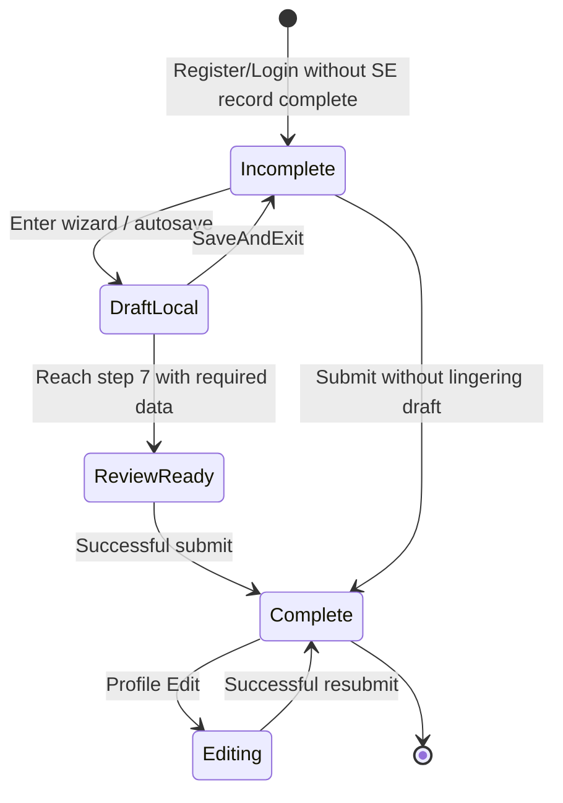

# User Profile, SE Onboarding, and Language Preferences Business Rules

## 1. Scope

This document extracts technology-agnostic business, UX, security, and integrity rules for **User Profile**, **Sales Executive (SE) Onboarding**, and **Language Preferences** in Field Commander version 1, for preservation in version 2.

### In scope

- Authenticated user’s profile identity display and completeness state
- SE multi-step profile onboarding (personal, organization, financial, assets, insurance, documents, review)
- Local draft resume for incomplete SE onboarding
- Edit-after-complete SE profile reopening
- Profile media/document viewing and onboarding media upload
- Language selection, persistence, static/dynamic translation behavior
- Logout and session-expiration effects on profile/language/drafts
- Cross-module use of profile completeness, auth identity, and selected language

### Out of scope (except as consumers or gates)

- Full dealer / farmer / distributor / FPO / FarmCard / FSPP onboarding field catalogs (covered only where they share language switching or draft infrastructure)
- Attendance/shift business rules beyond side effects of profile-completion `setUser`
- Expense, travel, retail, Farm Diary domain rules beyond navigation/identity dependencies
- Backend SQL/RLS definitions (not present in this repository)

### Version-2 boundary

This document states **what** the application must do. It does **not** prescribe frameworks, folders, databases, APIs, ORMs, state libraries, navigation libraries, or offline engines for version 2. Version-1 technologies appear only as **evidence** in Sections 2, 18, and rule evidence blocks.

---

## 2. Repository Evidence Map

### Screens and components

| File | Why it matters |
| --- | --- |
| `Frontend/src/modules/dashboard/screens/ProfileScreen.tsx` | Profile UI, completeness gate, language switcher, logout, network stats, document viewer, draft progress |
| `Frontend/src/modules/onboarding/se/screens/SEOnboardingScreen.tsx` | 7-step wizard shell, back handling, Save & Exit, Complete, success feedback |
| `Frontend/src/modules/onboarding/se/screens/steps/Step1PersonalDetails.tsx` | Personal identity/contact/address fields and conditionals |
| `Frontend/src/modules/onboarding/se/screens/steps/Step2Organization.tsx` | Organization hierarchy selects |
| `Frontend/src/modules/onboarding/se/screens/steps/Step3Financial.tsx` | PAN/bank fields |
| `Frontend/src/modules/onboarding/se/screens/steps/Step4AssetsLogistics.tsx` | Vehicle/DL/assets fields |
| `Frontend/src/modules/onboarding/se/screens/steps/Step5Insurances.tsx` | Optional multi-policy insurance UI |
| `Frontend/src/modules/onboarding/se/screens/steps/Step6Documents.tsx` | Required/optional document uploads |
| `Frontend/src/modules/onboarding/se/screens/steps/Step7Review.tsx` | Final review, edit-jump, file viewing |
| `Frontend/src/design-system/components/UploadTile.tsx` | Shared camera/gallery/document upload UI |
| `Frontend/src/design-system/templates/Templates.tsx` / `FeedbackScreenTemplate` | Wizard and success/offline shells |

### Hooks and forms

| File | Why it matters |
| --- | --- |
| `Frontend/src/modules/onboarding/se/hooks.ts` | Defaults, draft autosave, upload, submit upsert, Next enablement, editing mode |
| `Frontend/src/modules/dashboard/hooks.ts` | `useProfileActions` language/logout helpers (unused by ProfileScreen) |
| `Frontend/src/modules/auth/hooks.ts` | Registration/login form wiring that seeds auth identity used by SE defaults |

### Schemas and validation

| File | Why it matters |
| --- | --- |
| `Frontend/src/modules/onboarding/se/schema.ts` | Full SE validation, age/PAN/IFSC/vehicle/DL rules, married conditional |
| `Frontend/src/modules/auth/schema.ts` | Registration fields that prefill SE Step 1 |

### Services and APIs

| File | Why it matters |
| --- | --- |
| `Frontend/src/modules/dashboard/services/dashboardService.ts` | `fetchSEProfile`, `fetchNetworkSummary` |
| `Frontend/src/modules/onboarding/services/cloudinaryService.ts` | Media upload returning retrievable URL |
| `Frontend/src/modules/auth/services/authService.ts` | Register metadata including role `SE` |
| `Frontend/src/modules/onboarding/services/onboardingService.ts` | Entity onboarding only; **not** used by SE flow |

### Stores and state

| File | Why it matters |
| --- | --- |
| `Frontend/src/store/authStore.ts` | Current user shape, logout, `isProfileComplete` |
| `Frontend/src/store/draftStore.ts` | `seDraft` persistence separate from entity drafts |
| `Frontend/src/store/alertStore.ts` | Permission/upload/validation alerts |

### Navigation

| File | Why it matters |
| --- | --- |
| `Frontend/src/navigation/AppNavigator.tsx` | Auth gate, `SIGNED_IN` hydration of profile flags, `SEOnboardingScreen` route, offline gate |

### Core and shared utilities

| File | Why it matters |
| --- | --- |
| `Frontend/src/core/i18n.ts` | Languages, detector, fallback, local language persistence |
| `Frontend/src/core/i18nSync.ts` | Remote dynamic translation merge for `hi`/`gu` |
| `Frontend/src/core/dynamicTranslator.ts` | Runtime translation of selected DB field values |
| `Frontend/src/core/translationService.ts` / `modules/core/translationService.ts` | Duplicate helpers translating GU/HI input toward English |
| `Frontend/src/core/permissions.ts` | Camera/media permission requests for uploads |
| `Frontend/src/core/AutoLogoutProvider.tsx` | 7-day session expiry → logout |
| `Frontend/src/core/usePermissions.ts` | Role-based module permissions (not profile-complete gated) |
| `Frontend/src/core/database.ts` | Pending location sync count shown on Profile |
| `Frontend/locales/en.json`, `gu.json`, `hi.json` | Static translation catalogs (~2k keys each) |

### Related modules

| File / area | Why it matters |
| --- | --- |
| Dealer/Distributor/Farmer/FPO/FarmCard/FSPP onboarding screens | Cycle language switcher (`en→hi→gu`) |
| `DashboardScreen.tsx` | Permission gate; **no** `isProfileComplete` gate |
| Auth register/login | Seeds name, mobile, email, DOB used as SE defaults |
| `business-rules/auth.md` | Overlapping auth ↔ profile-completion findings |
| Supabase auth→`profiles` insert trigger (backend, not in Frontend repo) | Creates base `profiles` row on account create; maps metadata → email/name/mobile/role |

---

## 3. Actors, Roles, and Permissions

| Actor | How established (v1 evidence) | Profile / SE / language capabilities |
| --- | --- | --- |
| Unauthenticated visitor | Local user null | No Profile tab; no SE onboarding; no language UI in auth screens |
| Authenticated user | Local user non-null after session; base `profiles` row created on signup | Profile tab, language switcher, logout |
| Sales Executive (SE) | App register writes metadata `role: 'SE'`; backend copies that into `profiles.role` when present; permissions treat SE specially | Intended audience for SE onboarding; default **app** registrant |
| Territory Head (TH) | `profiles.role = 'TH'`; **backend default** when metadata role is missing/blank | Same Profile/SE screens if authenticated; full module permissions |
| Super Admin | `profiles.role` ∈ {`Super Admin`} (permissions code) | Same shell; full module access |
| Other named roles (e.g. `CO`) | Backend accepts non-empty metadata `role` (including `CO`) into `profiles.role`; permissions via role_permissions for non-SE/non-TH/Super Admin | Same shell; modules filtered by permissions |
| Off-app / Admin Setup user | Backend name fallback `'Admin Setup'` when metadata name/first+last absent | No dedicated in-app admin profile UI found |

### Role assignment (cross-layer)

| Layer | Behavior |
| --- | --- |
| App registration | Always sends metadata `role: 'SE'` (user cannot choose) |
| Backend profiles insert (on auth user create) | `profiles.role = COALESCE(NULLIF(metadata.role, ''), 'TH')` — accepts `SE`/`CO`/other when passed; **defaults to `TH` if role omitted** |
| Runtime permissions | Read from `profiles.role`, not from local auth user object |

### Access summary

- **Authentication required** for Profile and SE onboarding routes.
- **No role check** before opening `SEOnboardingScreen` (any authenticated user can navigate there).
- **Profile completeness does not** block Dashboard modules, attendance, expenses, or retail in executable code (UI copy claims otherwise).
- **Language switcher** on Profile is available to all authenticated users regardless of completeness.

---

## 4. User Profile Rules

### UP-PROF-001 — Current user identity source

- **Rule:** The current user is identified by the authenticated account id stored in the local auth user object.
- **Business purpose:** Bind profile reads/writes to the signed-in person.
- **Trigger/condition:** App has a non-null local user after sign-in hydration.
- **Behavior/result:** Profile loads network counts and SE record using that id.
- **Actor/role:** Authenticated user.
- **Affected workflow:** Profile load.
- **UX behavior:** If id missing, load exits early without updating counts/profile.
- **Validation/error behavior:** Load errors are logged; spinner stops.
- **Online/offline behavior:** Requires connectivity (global offline screen replaces navigator).
- **Enforcement requirement:** Profile operations must use the authenticated user id.
- **Dependencies:** Auth session hydration.
- **Original implementation evidence:**
  - `Frontend/src/modules/dashboard/screens/ProfileScreen.tsx:47-55` — `loadAllData`
  - `Frontend/src/store/authStore.ts:7` — `user.id`
- **Confidence:** High

### UP-PROF-002 — Auth metadata vs SE profile record

- **Rule:** Display identity may combine (a) auth-session metadata fields and (b) a separate SE profile record keyed by that user id.
- **Business purpose:** Registration seeds basic identity; onboarding stores extended SE data.
- **Trigger/condition:** Profile focus/refresh.
- **Behavior/result:** Name falls back from SE `first_name`/`last_name` to auth `user.name` to label “Sales Executive”. Contact subtitle prefers employee id, else `+91` + auth mobile, else “No Contact Added”.
- **Actor/role:** Authenticated user.
- **Affected workflow:** Profile header.
- **UX behavior:** Missing values show fallbacks / `N/A` in detail rows.
- **Validation/error behavior:** N/A for display.
- **Online/offline behavior:** SE record fetch requires network when online path is available.
- **Enforcement requirement:** Support dual-source display with defined fallbacks.
- **Dependencies:** `fetchSEProfile`; auth hydration.
- **Original implementation evidence:**
  - `Frontend/src/modules/dashboard/screens/ProfileScreen.tsx:193-200` — name/contact fallbacks
  - `Frontend/src/navigation/AppNavigator.tsx:115-129` — metadata hydration
- **Confidence:** High

### UP-PROF-003 — Completeness determination

- **Rule:** Profile is complete if local auth flag `isProfileComplete` **OR** SE record `is_profile_complete` is true.
- **Business purpose:** Recognize completion even if one of the two stores is stale.
- **Trigger/condition:** Profile render after load.
- **Behavior/result:** Complete → detail cards + Edit; Incomplete → incomplete/in-progress card + CTA.
- **Actor/role:** Authenticated user.
- **Affected workflow:** Profile conditional layout.
- **UX behavior:** See Section 13 matrix.
- **Validation/error behavior:** N/A.
- **Online/offline behavior:** Local flag can show complete offline after prior success; remote flag needs fetch.
- **Enforcement requirement:** OR completeness from local session state and authoritative profile record.
- **Dependencies:** SE submit sets both local flag and remote `is_profile_complete`.
- **Original implementation evidence:**
  - `Frontend/src/modules/dashboard/screens/ProfileScreen.tsx:85` — OR check
- **Confidence:** High

### UP-PROF-004 — Incomplete profile messaging claims feature unlock

- **Rule:** Incomplete UI states that onboarding must be completed “to unlock all network features.”
- **Business purpose:** Motivate onboarding.
- **Trigger/condition:** `!isProfileComplete` and no draft.
- **Behavior/result:** Warning card + “Complete Profile Now”.
- **Actor/role:** Authenticated user.
- **Affected workflow:** Profile incomplete state.
- **UX behavior:** Message shown; Dashboard modules are **not** blocked by this flag in code.
- **Validation/error behavior:** N/A.
- **Online/offline behavior:** N/A.
- **Enforcement requirement:** Version 2 must either enforce the unlock gate or change messaging; v1 claim is not enforced (see audit).
- **Dependencies:** None for actual locking.
- **Original implementation evidence:**
  - `Frontend/src/modules/dashboard/screens/ProfileScreen.tsx:259-261` — unlock copy
  - `Frontend/src/modules/dashboard/screens/DashboardScreen.tsx` — permission gate only
- **Confidence:** High (unenforced claim)

### UP-PROF-005 — In-progress draft progress display

- **Rule:** If incomplete and a local SE draft exists, show “Profile In Progress”, percent complete, and current step text, with “Resume Onboarding”.
- **Business purpose:** Allow resume of partial onboarding.
- **Trigger/condition:** `!isProfileComplete && seDraft`.
- **Behavior/result:** Progress = `((seDraft.step - 1) / 6) * 100`; copy says “Step X of 6”.
- **Actor/role:** Authenticated user.
- **Affected workflow:** Profile incomplete/in-progress.
- **UX behavior:** Progress bar + resume CTA.
- **Validation/error behavior:** N/A.
- **Online/offline behavior:** Draft is local-device persisted.
- **Enforcement requirement:** Show draft-aware incomplete UI.
- **Dependencies:** `seDraft` store; note step-count mismatch with 7-step wizard (audit).
- **Original implementation evidence:**
  - `Frontend/src/modules/dashboard/screens/ProfileScreen.tsx:227-269` — in-progress card
- **Confidence:** High

### UP-PROF-006 — Network entity counts on profile

- **Rule:** Profile always shows counts for Distributors, Dealers, Farmers, and FPOs (submitted + drafts) for the current user, regardless of completeness.
- **Business purpose:** Summarize the SE’s network.
- **Trigger/condition:** Profile load/refresh with user id.
- **Behavior/result:** Four pressable stat boxes; each navigates to Dashboard main with a specific tab index.
- **Actor/role:** Authenticated user.
- **Affected workflow:** Profile → Dashboard deep link.
- **UX behavior:** Visible in both complete and incomplete states.
- **Validation/error behavior:** Failures logged; counts may remain zero.
- **Online/offline behavior:** Requires network fetch when online.
- **Enforcement requirement:** Display per-user network summary; taps open corresponding list tab.
- **Dependencies:** `fetchNetworkSummary`.
- **Original implementation evidence:**
  - `Frontend/src/modules/dashboard/screens/ProfileScreen.tsx:203-225` — StatBoxes
  - `Frontend/src/modules/dashboard/services/dashboardService.ts:144-172` — combined counts
- **Confidence:** High

### UP-PROF-007 — Complete profile sections shown

- **Rule:** When complete, profile shows read-only sections: Personal Details, Work Assignment, Statutory & Financial, Assets & Logistics, Documents (Aadhar, PAN, Address Proof).
- **Business purpose:** Confirm submitted SE data.
- **Trigger/condition:** `isProfileComplete`.
- **Behavior/result:** Flattened JSON blobs from SE record populate rows; empty → `N/A`; missing docs → “Missing” badge.
- **Actor/role:** Authenticated user.
- **Affected workflow:** Profile view.
- **UX behavior:** No inline editing on Profile; Edit opens wizard.
- **Validation/error behavior:** N/A.
- **Online/offline behavior:** Data from last successful fetch.
- **Enforcement requirement:** Read-only presentation of submitted SE fields listed above.
- **Dependencies:** SE record shape.
- **Original implementation evidence:**
  - `Frontend/src/modules/dashboard/screens/ProfileScreen.tsx:271-312` — detail cards
- **Confidence:** High

### UP-PROF-008 — Profile avatar from profile photo URL

- **Rule:** Avatar uses `documents.profilePhoto` URL when present; otherwise a generic person icon.
- **Business purpose:** Visual identity.
- **Trigger/condition:** Complete or incomplete (photo only exists after upload/submit).
- **Behavior/result:** Image fill or icon fallback.
- **Actor/role:** Authenticated user.
- **Affected workflow:** Profile header.
- **UX behavior:** No camera edit on Profile screen itself.
- **Validation/error behavior:** Broken URLs not specially handled.
- **Online/offline behavior:** Remote image URL requires network to render.
- **Enforcement requirement:** Prefer stored profile photo reference for avatar.
- **Dependencies:** Document upload during onboarding.
- **Original implementation evidence:**
  - `Frontend/src/modules/dashboard/screens/ProfileScreen.tsx:95,186-191` — avatar
- **Confidence:** High

### UP-PROF-009 — Profile is not inline-editable on Profile screen

- **Rule:** Profile detail fields on the Profile screen are display-only; changes require navigating to SE onboarding in edit mode.
- **Business purpose:** Reuse the validated wizard for edits.
- **Trigger/condition:** User taps Edit (complete only).
- **Behavior/result:** Navigate to SE onboarding with flattened existing values as `editData`.
- **Actor/role:** Authenticated user with complete profile.
- **Affected workflow:** Profile → SE edit.
- **UX behavior:** Edit chip hidden when incomplete.
- **Validation/error behavior:** Wizard validation on resubmit.
- **Online/offline behavior:** Edit navigation available when app online.
- **Enforcement requirement:** No direct field mutation on Profile view.
- **Dependencies:** UP-SE-EDIT-001.
- **Original implementation evidence:**
  - `Frontend/src/modules/dashboard/screens/ProfileScreen.tsx:174-181` — Edit navigate
- **Confidence:** High

### UP-PROF-010 — Pull-to-refresh and focus reload

- **Rule:** Profile reloads SE record and network summary on screen focus and on pull-to-refresh.
- **Business purpose:** Keep displayed data current.
- **Trigger/condition:** Focus effect / refresh control.
- **Behavior/result:** Parallel fetch; loading spinner until first finish (unless refreshing).
- **Actor/role:** Authenticated user.
- **Affected workflow:** Profile load.
- **UX behavior:** Full-screen spinner on initial load; refresh indicator on pull.
- **Validation/error behavior:** Errors logged only.
- **Online/offline behavior:** Needs network.
- **Enforcement requirement:** Refresh on enter and explicit refresh.
- **Dependencies:** User id.
- **Original implementation evidence:**
  - `Frontend/src/modules/dashboard/screens/ProfileScreen.tsx:47-73,77-82` — load/refresh/spinner
- **Confidence:** High

### UP-PROF-011 — Pending location sync status widget

- **Rule:** Profile shows whether offline location points are waiting to sync, polling every 5 seconds.
- **Business purpose:** Visibility into tracking sync health.
- **Trigger/condition:** Profile mounted.
- **Behavior/result:** Warning style if count > 0; success style if 0.
- **Actor/role:** Authenticated user.
- **Affected workflow:** Profile footer area.
- **UX behavior:** Always visible after load.
- **Validation/error behavior:** N/A.
- **Online/offline behavior:** Count is local; sync itself is separate.
- **Enforcement requirement:** Surface pending location sync count on Profile.
- **Dependencies:** Local pending-location store.
- **Original implementation evidence:**
  - `Frontend/src/modules/dashboard/screens/ProfileScreen.tsx:32-42,329-356` — poll + widget
- **Confidence:** High

### UP-PROF-012 — App version label

- **Rule:** Profile shows static app version text “Field Commander v1.0.5”.
- **Business purpose:** Support/debug identification.
- **Trigger/condition:** Always after load.
- **Behavior/result:** Muted footer text.
- **Actor/role:** Authenticated user.
- **Affected workflow:** Profile.
- **UX behavior:** Hardcoded (not translated).
- **Validation/error behavior:** N/A.
- **Online/offline behavior:** N/A.
- **Enforcement requirement:** Optional display of app version; v1 hardcodes this string.
- **Dependencies:** None.
- **Original implementation evidence:**
  - `Frontend/src/modules/dashboard/screens/ProfileScreen.tsx:358-363` — version
- **Confidence:** High

### UP-PROF-013 — Fields not shown on Profile after completion

- **Rule:** Several collected SE fields are **not** displayed on the Profile complete view, including insurance policies, middle name, current/permanent addresses & pincodes, HQ/territory/area (area omitted; HQ/territory shown in Work), PF number, fuel allowance, DL expiry, relieving letter, educational certificates.
- **Business purpose:** Unknown; appears incomplete presentation.
- **Trigger/condition:** Complete profile render.
- **Behavior/result:** Data may exist in record but is invisible on Profile.
- **Actor/role:** Authenticated user.
- **Affected workflow:** Profile view.
- **UX behavior:** Partial echo of onboarding data.
- **Validation/error behavior:** N/A.
- **Online/offline behavior:** N/A.
- **Enforcement requirement:** Document as v1 behavior; version 2 should decide intentional omission vs gap.
- **Dependencies:** SE persistence still stores omitted fields.
- **Original implementation evidence:**
  - `Frontend/src/modules/dashboard/screens/ProfileScreen.tsx:271-312` — shown sections only
- **Confidence:** High

### UP-PROF-014 — Base profile record created on account creation

- **Rule:** When an authentication account is created, the system must create a corresponding base profile record with the same id, containing email, display name, mobile, and role derived from account metadata (with defined fallbacks).
- **Business purpose:** Ensure every account has an authorization/identity row for permissions and directory use, separate from the extended SE onboarding record.
- **Trigger/condition:** New auth user insert / signup success.
- **Behavior/result:** Insert into `profiles` with:
  - **email:** real contact email from metadata if present, else auth login email
  - **name:** metadata `name` if non-empty; else trimmed `first_name` + `last_name`; else literal `Admin Setup`
  - **mobile:** metadata `mobile` if non-empty; else a generated unique 10-character surrogate (`00` + first 8 hex chars of user id without hyphens) to satisfy a unique mobile constraint
  - **role:** metadata `role` if non-empty; else default `TH`
- **Actor/role:** System (on behalf of registrant or admin-created user).
- **Affected workflow:** Registration / admin user provisioning → permissions source of truth.
- **UX behavior:** App register path supplies `role: 'SE'`, name parts, `real_email`, and mobile, so normal field users get SE role and real mobile/email/name rather than backend fallbacks.
- **Validation/error behavior:** Empty mobile would violate uniqueness without the generated surrogate; empty name would become `Admin Setup`.
- **Online/offline behavior:** Server-side on account create (requires successful signup).
- **Enforcement requirement:** Create base profile at account creation with the fallbacks above; keep role authoritative on the profile record for module permissions.
- **Dependencies:** Auth signup metadata; distinct from `sales_executive` extended profile.
- **Original implementation evidence:**
  - Supabase backend trigger function (operator-provided; not in Frontend repo) — `INSERT INTO public.profiles (id, email, name, mobile, role)` on new auth user
  - `Frontend/src/modules/auth/services/authService.ts:17` — app register metadata `role: 'SE'`
  - `Frontend/src/core/usePermissions.ts` — reads `profiles.role`
- **Confidence:** High (backend body provided by operator; trigger attachment name/timing not in repo)

### UP-PROF-015 — Base profile vs SE extended profile are separate

- **Rule:** The base profile record (identity + role) is not the same as the SE onboarding dossier (`sales_executive`). Completing SE onboarding does not, in evidenced frontend code, update `profiles.name` / `profiles.mobile` / `profiles.role`.
- **Business purpose:** Separate authorization identity from employment KYC dossier.
- **Trigger/condition:** After SE submit vs after signup.
- **Behavior/result:** Permissions continue to use `profiles.role`; Profile UI extended fields come from `sales_executive`.
- **Actor/role:** System / SE user.
- **Affected workflow:** Signup → SE onboarding → Dashboard permissions.
- **UX behavior:** Role not shown/editable on Profile screen.
- **Validation/error behavior:** N/A.
- **Online/offline behavior:** Both server entities require network for authoritative reads/writes.
- **Enforcement requirement:** Preserve separation of base identity/role record and SE extended profile unless product intentionally merges them.
- **Dependencies:** UP-PROF-014; UP-SED-001.
- **Original implementation evidence:**
  - Backend profiles insert (operator-provided)
  - `Frontend/src/modules/onboarding/se/hooks.ts:237-284` — upserts `sales_executive` only
- **Confidence:** High

---

## 5. Profile Fields and Validation Rules

Profile **view** does not validate fields (read-only). Validation applies when data is entered via SE onboarding (Section 8) or originally via registration.

### Auth-seeded fields used by Profile / SE defaults

| Field | Source | Editable on Profile? | Persisted where on SE submit? |
| --- | --- | --- | --- |
| id | Auth user id (= `profiles.id`) | No | `sales_executive.profile_id` |
| firstName / lastName / name | Auth metadata; `profiles.name` at signup; SE `personal_details` | Via SE wizard | `personal_details.*` (does not update `profiles.name` in evidenced client code) |
| email | Metadata `real_email` → `profiles.email` / local auth `email` | Via SE `emailId` | `personal_details.emailId` (not evidenced to update `profiles.email`) |
| mobile | Metadata → `profiles.mobile` (or generated surrogate if blank) | Via SE `mobileNumber` | `personal_details.mobileNumber` |
| dob | Auth metadata | Via SE `dob` | `personal_details.dob` |
| isProfileComplete | Local auth + `sales_executive` | Set true on SE submit | `sales_executive.is_profile_complete` |
| role | Metadata at signup → `profiles.role` (default `TH` if blank; app register sends `SE`) | Not on Profile | Not updated by SE submit |
| language | Device local settings key | Via language switcher | **Not** on user profile record |

### Display formatting (Profile)

| Field | Format behavior | Evidence |
| --- | --- | --- |
| Mobile / emergency | Prefix `+91` when shown from SE values | ProfileScreen DataRow / header |
| Empty values | `N/A` | DataRow |
| Arrays (company assets) | Comma-joined | DataRow |
| Vehicle | `type (number or N/A)` | Assets section |
| Documents | View File / Missing | DocRow |

---

## 6. Profile Editing, Persistence, and Logout Rules

### UP-EDIT-001 — Edit opens SE wizard with existing data

- **Rule:** Edit is available only when profile is complete; it opens SE onboarding with flattened SE JSON as `editData`.
- **Business purpose:** Correct previously submitted data.
- **Trigger/condition:** Edit press.
- **Behavior/result:** Wizard starts at step 1; draft autosave disabled while editing.
- **Actor/role:** Authenticated complete SE.
- **Affected workflow:** Profile edit.
- **UX behavior:** Save & Exit hidden in edit mode.
- **Validation/error behavior:** Same as onboarding submit.
- **Online/offline behavior:** Submit requires network.
- **Enforcement requirement:** Completed profiles can be reopened for correction through the same wizard.
- **Dependencies:** Flatten mapping of nested SE blobs.
- **Original implementation evidence:**
  - `Frontend/src/modules/dashboard/screens/ProfileScreen.tsx:174-181`
  - `Frontend/src/modules/onboarding/se/hooks.ts:30-33,104-105`
- **Confidence:** High

### UP-EDIT-002 — No cancel/save on Profile itself

- **Rule:** Profile has no Save/Cancel for profile fields; only Logout, language change, refresh, Edit, and onboarding CTAs.
- **Business purpose:** Avoid dual editors.
- **Trigger/condition:** Profile interaction.
- **Behavior/result:** Unsaved-change prompt not applicable on Profile.
- **Actor/role:** Authenticated user.
- **Affected workflow:** Profile.
- **UX behavior:** Immediate language change; logout immediate.
- **Validation/error behavior:** N/A.
- **Online/offline behavior:** N/A.
- **Enforcement requirement:** Profile is not a form editor.
- **Dependencies:** None.
- **Original implementation evidence:**
  - `Frontend/src/modules/dashboard/screens/ProfileScreen.tsx` — no save/cancel controls
- **Confidence:** High

### UP-EDIT-003 — Logout clears only auth session state

- **Rule:** Logout clears local user and login timestamp only; it does **not** clear SE draft, entity drafts, language preference, or permission cache.
- **Business purpose:** End session (v1 implementation is local-only clear).
- **Trigger/condition:** Logout button or auto-logout or auth `SIGNED_OUT`.
- **Behavior/result:** Navigator switches to Login/Register.
- **Actor/role:** Authenticated user.
- **Affected workflow:** Logout.
- **UX behavior:** Immediate; no confirmation dialog on Profile.
- **Validation/error behavior:** N/A.
- **Online/offline behavior:** Works locally; backend sign-out not called from auth store logout.
- **Enforcement requirement:** Version 2 must preserve intentional session end behavior; decide draft/language retention explicitly (v1 retains them).
- **Dependencies:** Auth store; AutoLogoutProvider; AppNavigator.
- **Original implementation evidence:**
  - `Frontend/src/store/authStore.ts:20` — logout
  - `Frontend/src/modules/dashboard/screens/ProfileScreen.tsx:327` — Logout button
- **Confidence:** High

### UP-EDIT-004 — Session expiry after 7 days resets to login

- **Rule:** If login timestamp is older than 7 days, app logs the user out (checked on mount and when app becomes active).
- **Business purpose:** Limit long-lived sessions.
- **Trigger/condition:** Elapsed time ≥ 7 days.
- **Behavior/result:** Same as logout regarding cleared state.
- **Actor/role:** Authenticated user.
- **Affected workflow:** Auto-logout.
- **UX behavior:** No dedicated expiry message on Profile.
- **Validation/error behavior:** Console log only.
- **Online/offline behavior:** Local timer.
- **Enforcement requirement:** Enforce maximum session age of 7 days from login timestamp.
- **Dependencies:** `loginTimestamp`; note SE submit `setUser` refreshes timestamp (auth.md).
- **Original implementation evidence:**
  - `Frontend/src/core/AutoLogoutProvider.tsx:7-38`
- **Confidence:** High

### UP-EDIT-005 — Completing SE onboarding refreshes login timestamp

- **Rule:** Successful SE submit calls set-user with the same user plus `isProfileComplete: true`, which also resets `loginTimestamp` to now.
- **Business purpose:** Side effect of shared set-user API.
- **Trigger/condition:** SE submit success.
- **Behavior/result:** Session clock restarts; local completeness true; draft cleared.
- **Actor/role:** SE completing onboarding.
- **Affected workflow:** SE submit → session timer / shift prompt side effects.
- **UX behavior:** Success feedback then Profile.
- **Validation/error behavior:** N/A.
- **Online/offline behavior:** After successful online submit.
- **Enforcement requirement:** Document side effect; version 2 should not accidentally reset unrelated session policy unless intended.
- **Dependencies:** Auth store `setUser`.
- **Original implementation evidence:**
  - `Frontend/src/modules/onboarding/se/hooks.ts:288-290`
  - `Frontend/src/store/authStore.ts:19`
- **Confidence:** High

---

## 7. SE Onboarding Overview and Eligibility

### UP-SE-001 — Authentication required

- **Rule:** SE onboarding route exists only inside the authenticated navigator.
- **Business purpose:** Bind onboarding to an account.
- **Trigger/condition:** `user` non-null.
- **Behavior/result:** Screen available via navigate from Profile (or any authenticated navigation).
- **Actor/role:** Authenticated user.
- **Affected workflow:** SE onboarding entry.
- **UX behavior:** Unauthenticated users cannot reach route.
- **Validation/error behavior:** Submit fails with “User session not found” if id missing mid-flow.
- **Online/offline behavior:** Offline gate blocks entire app UI including onboarding.
- **Enforcement requirement:** Require authentication.
- **Dependencies:** AppNavigator auth branch.
- **Original implementation evidence:**
  - `Frontend/src/navigation/AppNavigator.tsx:159-163`
  - `Frontend/src/modules/onboarding/se/hooks.ts:234`
- **Confidence:** High

### UP-SE-002 — No SE-role gate on the screen

- **Rule:** Access to SE onboarding is not restricted to users whose role equals `SE` in executable navigation/permission checks.
- **Business purpose:** Intended for SE registrants, but not enforced at route level.
- **Trigger/condition:** Any authenticated navigation to `SEOnboardingScreen`.
- **Behavior/result:** Screen opens.
- **Actor/role:** Any authenticated user.
- **Affected workflow:** SE onboarding entry.
- **UX behavior:** Same wizard.
- **Validation/error behavior:** N/A.
- **Online/offline behavior:** N/A.
- **Enforcement requirement:** Version 2 must decide whether to enforce SE-only access (v1 does not).
- **Dependencies:** Register defaults role to SE.
- **Original implementation evidence:**
  - `Frontend/src/navigation/AppNavigator.tsx:159-163` — no role check
  - `Frontend/src/modules/auth/services/authService.ts` — `role: 'SE'` at register
- **Confidence:** High

### UP-SE-003 — Onboarding is strongly encouraged, not navigation-mandatory

- **Rule:** Incomplete users can use Main Tabs (including Dashboard) without completing SE onboarding; Profile prompts completion.
- **Business purpose:** Soft gate via Profile UX.
- **Trigger/condition:** Incomplete profile.
- **Behavior/result:** Incomplete card on Profile; no forced redirect after login.
- **Actor/role:** Authenticated incomplete user.
- **Affected workflow:** Post-login navigation.
- **UX behavior:** User can ignore CTA.
- **Validation/error behavior:** N/A.
- **Online/offline behavior:** N/A.
- **Enforcement requirement:** Do not assume hard blocking exists unless version 2 adds it.
- **Dependencies:** UP-PROF-004.
- **Original implementation evidence:**
  - `Frontend/src/navigation/AppNavigator.tsx:159-161` — MainTabs always
  - `Frontend/src/modules/dashboard/screens/ProfileScreen.tsx:227-269`
- **Confidence:** High

### UP-SE-004 — Seven-step wizard structure

- **Rule:** SE onboarding is a sequential wizard with 7 steps: Personal → Organization → Financial → Assets → Insurances → Documents → Review.
- **Business purpose:** Collect full SE employment profile.
- **Trigger/condition:** Enter SE onboarding.
- **Behavior/result:** Progress label “STEP current OF 7”; progress = step/7.
- **Actor/role:** Authenticated user.
- **Affected workflow:** SE onboarding.
- **UX behavior:** Wizard template header/footer.
- **Validation/error behavior:** Full validation primarily at Complete (see mismatches).
- **Online/offline behavior:** Draft local; submit/upload need network.
- **Enforcement requirement:** Preserve seven logical sections culminating in review/submit.
- **Dependencies:** Step components.
- **Original implementation evidence:**
  - `Frontend/src/modules/onboarding/se/screens/SEOnboardingScreen.tsx:69-127`
- **Confidence:** High

### UP-SE-005 — Completed onboarding can be reopened

- **Rule:** Completed profiles can reopen the wizard via Edit with existing values; incomplete resumes from draft without `editData`.
- **Business purpose:** Correction and resume.
- **Trigger/condition:** Edit vs Complete/Resume CTA.
- **Behavior/result:** Edit mode vs draft mode (see UP-EDIT-001 / drafts).
- **Actor/role:** Authenticated user.
- **Affected workflow:** SE onboarding entry modes.
- **UX behavior:** Success screen after submit.
- **Validation/error behavior:** Same schema.
- **Online/offline behavior:** Draft offline-capable; submit online.
- **Enforcement requirement:** Support resume and post-complete edit.
- **Dependencies:** Draft store; editData param.
- **Original implementation evidence:**
  - `Frontend/src/modules/onboarding/se/hooks.ts:30-33`
- **Confidence:** High

### UP-SE-006 — No approval / rejection / pending-review statuses

- **Rule:** SE onboarding has no approval, rejection, or pending-review workflow in the frontend. Statuses evidenced: incomplete (no complete flag), draft (local), complete (`is_profile_complete: true`).
- **Business purpose:** Self-serve profile capture.
- **Trigger/condition:** Submit success.
- **Behavior/result:** Immediate complete; no manager approve UI.
- **Actor/role:** SE user.
- **Affected workflow:** SE submit.
- **UX behavior:** “Profile Complete!” feedback.
- **Validation/error behavior:** Submission Failed alert on error.
- **Online/offline behavior:** Online submit only.
- **Enforcement requirement:** Do not invent approval states without evidence; v1 is self-complete.
- **Dependencies:** Upsert sets complete true.
- **Original implementation evidence:**
  - `Frontend/src/modules/onboarding/se/hooks.ts:237-290`
  - Grep: no SE approval_status / rejected handlers
- **Confidence:** High

### UP-SE-007 — Skipping steps via Next is allowed until Review

- **Rule:** The Next button is enabled for all steps before Review regardless of field completeness; requiredness is enforced when attempting Complete on Review (and by schema on submit).
- **Business purpose:** Unknown; likely incomplete gating.
- **Trigger/condition:** `step < 7`.
- **Behavior/result:** Users can advance with empty fields until Review/Complete.
- **Actor/role:** SE user.
- **Affected workflow:** Step navigation.
- **UX behavior:** Next never disabled on steps 1–6.
- **Validation/error behavior:** Complete disabled if completeness memo fails; submit shows validation alert.
- **Online/offline behavior:** N/A.
- **Enforcement requirement:** Document v1 free navigation; version 2 should decide per-step gating.
- **Dependencies:** `isNextEnabled` early return.
- **Original implementation evidence:**
  - `Frontend/src/modules/onboarding/se/hooks.ts:126-128`
  - `Frontend/src/modules/onboarding/se/screens/SEOnboardingScreen.tsx:101-106`
- **Confidence:** High

---

## 8. SE Onboarding Step-by-Step Rules

### 8.1 Step 1 — Personal Details

#### UP-SE1-001 — Step 1 field catalog and requirements

- **Rule:** Step 1 collects identity, contact, and address data with the following requirements:

| Field | Required | Constraints / allowed values |
| --- | --- | --- |
| firstName | Yes | Min length 2 |
| middleName | No | Free text |
| lastName | Yes | Min length 2 |
| dob | Yes | Age ≥ 18; UI max date = today−18y |
| bloodGroup | Yes | A+/A-/B+/B-/O+/O-/AB+/AB- |
| maritalStatus | Yes | Single, Married, Divorced, Widowed |
| spouseName | If Married | Min length 2 |
| spouseMobile | If Married | Schema 10–12 digits; UI maxLength 10 |
| mobileNumber | Yes | Exactly 10 digits; UI `+91` |
| emergencyContact | Yes | Exactly 10 digits; UI `+91` |
| emailId | Yes | Email format; UI lowercases |
| permanentAddress | Yes | Min length 10 |
| permanentPincode | Yes | Exactly 6 digits |
| sameAsPermanent | No (default false) | Boolean |
| currentAddress | Yes (schema) | Min 10; hidden if sameAsPermanent (auto-copied) |
| currentPincode | Yes (schema) | 6 digits; auto-copied when same |

- **Business purpose:** HR-ready personal record.
- **Trigger/condition:** Step 1 visible.
- **Behavior/result:** Conditional spouse block and current-address block.
- **Actor/role:** SE user.
- **Affected workflow:** SE Step 1.
- **UX behavior:** Labels mark required with `*`; inline errors from schema when validated.
- **Validation/error behavior:** Schema + married superRefine.
- **Online/offline behavior:** Local form/draft.
- **Enforcement requirement:** Enforce listed constraints; auto-copy current address when “same as permanent”.
- **Dependencies:** Auth defaults for name/mobile/email/dob.
- **Original implementation evidence:**
  - `Frontend/src/modules/onboarding/se/screens/steps/Step1PersonalDetails.tsx:18-53`
  - `Frontend/src/modules/onboarding/se/schema.ts:15-38,88-97`
  - `Frontend/src/modules/onboarding/se/hooks.ts:91-96`
- **Confidence:** High

#### UP-SE1-002 — Prefill from auth / draft / editData

- **Rule:** Defaults prefer editData (edit mode), else draft data, else auth user first/last/dob/mobile/email.
- **Business purpose:** Reduce re-entry.
- **Trigger/condition:** Wizard init.
- **Behavior/result:** Fields prefilled.
- **Actor/role:** SE user.
- **Affected workflow:** SE entry.
- **UX behavior:** User can overwrite.
- **Validation/error behavior:** Prefill still validated on submit.
- **Online/offline behavior:** Auth/draft local.
- **Enforcement requirement:** Prefill from existing identity when available.
- **Dependencies:** Auth store; draft store.
- **Original implementation evidence:**
  - `Frontend/src/modules/onboarding/se/hooks.ts:41-49`
- **Confidence:** High

### 8.2 Step 2 — Organization & Hierarchy

#### UP-SE2-001 — Organization fields

- **Rule:** Step 2 requires:

| Field | Required | UI allowed values / format |
| --- | --- | --- |
| employeeId | Yes | Uppercase alphanumeric; UI forces uppercase |
| designation | Yes | Jr. Sales Executive, Sales Executive, Sr. Sales Executive, Area Manager |
| reportingTo | Yes | Hardcoded managers list (searchable) |
| joiningDate | Yes | Not in the future; UI max = today |
| headquarter | Yes | Hardcoded HQ cities (searchable) |
| territory | Yes | North, South, East, West, Central |
| area | Yes | Beat 1–4 labeled options |

- **Business purpose:** Capture assignment hierarchy.
- **Trigger/condition:** Step 2.
- **Behavior/result:** Select/date inputs.
- **Actor/role:** SE user.
- **Affected workflow:** SE Step 2.
- **UX behavior:** Schema only enforces min lengths for most; UI lists are stricter.
- **Validation/error behavior:** Joining date future rejected by schema.
- **Online/offline behavior:** Local.
- **Enforcement requirement:** Capture organization assignment; preserve UI option sets as business catalogs unless version 2 replaces with live directories.
- **Dependencies:** None.
- **Original implementation evidence:**
  - `Frontend/src/modules/onboarding/se/screens/steps/Step2Organization.tsx:8-32`
  - `Frontend/src/modules/onboarding/se/schema.ts:40-52`
- **Confidence:** High

### 8.3 Step 3 — Statutory & Financial

#### UP-SE3-001 — Financial fields

- **Rule:** Step 3 requires PAN, bank name, account number, IFSC; PF/pension optional.

| Field | Required | Constraints |
| --- | --- | --- |
| panNumber | Yes | `^[A-Z]{5}[0-9]{4}[A-Z]{1}$`; UI uppercase, max 10 |
| bankName | Yes | UI Indian bank list (schema min length only) |
| bankAccountNumber | Yes | 9–18 digits; UI max 18 |
| bankIfsc | Yes | `^[A-Z]{4}0[A-Z0-9]{6}$`; UI uppercase max 11 |
| pfPensionNumber | No | Free text |

- **Business purpose:** Payroll/statutory compliance.
- **Trigger/condition:** Step 3.
- **Behavior/result:** Form capture.
- **Actor/role:** SE user.
- **Affected workflow:** SE Step 3.
- **UX behavior:** Searchable bank select.
- **Validation/error behavior:** Regex messages on submit/validate.
- **Online/offline behavior:** Local.
- **Enforcement requirement:** Enforce Indian PAN/IFSC formats and account digit range.
- **Dependencies:** None.
- **Original implementation evidence:**
  - `Frontend/src/modules/onboarding/se/screens/steps/Step3Financial.tsx:8-31`
  - `Frontend/src/modules/onboarding/se/schema.ts:54-59`
- **Confidence:** High

### 8.4 Step 4 — Assets & Logistics

#### UP-SE4-001 — Assets fields

- **Rule:** Step 4 requires vehicle type, vehicle number, DL number, DL expiry; company assets and fuel allowance optional.

| Field | Required | Constraints |
| --- | --- | --- |
| vehicleType | Yes | Two-Wheeler, Four-Wheeler |
| vehicleNumber | Yes | Regex e.g. GJ01AB1234; UI uppercase |
| drivingLicenseNo | Yes | Regex e.g. MH04 20100012345; UI uppercase |
| dlExpiryDate | Yes | UI minimumDate = today (no past expiry selectable) |
| companyAssets | No | Multi-select: Laptop, Mobile Phone, SIM Card, Tablet, Data Card |
| fuelAllowance | No | Numeric-ish text with ₹ /km affordance |

- **Business purpose:** Logistics/asset tracking.
- **Trigger/condition:** Step 4.
- **Behavior/result:** Form capture.
- **Actor/role:** SE user.
- **Affected workflow:** SE Step 4.
- **UX behavior:** Radio for vehicle type.
- **Validation/error behavior:** Schema regex; expiry only min length in schema (not future-check beyond UI min).
- **Online/offline behavior:** Local.
- **Enforcement requirement:** Enforce vehicle/DL formats; prevent selecting past DL expiry in UI.
- **Dependencies:** None.
- **Original implementation evidence:**
  - `Frontend/src/modules/onboarding/se/screens/steps/Step4AssetsLogistics.tsx:12-27`
  - `Frontend/src/modules/onboarding/se/schema.ts:61-69`
- **Confidence:** High

### 8.5 Step 5 — Insurances

#### UP-SE5-001 — Optional multi-policy insurance

- **Rule:** Insurance is optional overall. UI starts with one empty policy card. User may add more. Delete available only when more than one card exists. If a card is partially filled, type + provider + insuranceId are all required (workflow memo); document upload optional.
- **Business purpose:** Capture employee insurance if available.
- **Trigger/condition:** Step 5.
- **Behavior/result:** Array of `{type, provider, insuranceId, documentUrl}`.
- **Actor/role:** SE user.
- **Affected workflow:** SE Step 5.
- **UX behavior:** Type options: Term / Health / Accident; providers hardcoded list; optional document upload.
- **Validation/error behavior:** Schema treats array optional with optional fields; completeness memo enforces partial-fill rule; no inline field errors rendered.
- **Online/offline behavior:** Doc upload needs network/permissions.
- **Enforcement requirement:** Allow zero insurance; forbid incomplete partial rows at final Complete.
- **Dependencies:** Upload pipeline.
- **Original implementation evidence:**
  - `Frontend/src/modules/onboarding/se/screens/steps/Step5Insurances.tsx:14-84`
  - `Frontend/src/modules/onboarding/se/hooks.ts:149-155`
  - `Frontend/src/modules/onboarding/se/schema.ts:71-77`
- **Confidence:** High

### 8.6 Step 6 — Documents

#### UP-SE6-001 — Document requirements

- **Rule:** Required documents for Complete: profile photo, Aadhar, PAN card, address proof. Optional: relieving letter. Schema marks documents object optional (workflow memo enforces required four). Educational certificates supported in schema/upload helper but **no UI**.
- **Business purpose:** KYC/employment documentation.
- **Trigger/condition:** Step 6.
- **Behavior/result:** Upload tiles with clear; profile photo uses camera/gallery; others camera or document picker.
- **Actor/role:** SE user.
- **Affected workflow:** SE Step 6.
- **UX behavior:** Required marked with `*`.
- **Validation/error behavior:** Complete disabled without required URLs; schema URL checks if present.
- **Online/offline behavior:** Upload requires network + permissions.
- **Enforcement requirement:** Require four document references before final completion; allow optional relieving letter.
- **Dependencies:** Media upload success → URL.
- **Original implementation evidence:**
  - `Frontend/src/modules/onboarding/se/screens/steps/Step6Documents.tsx:15-72`
  - `Frontend/src/modules/onboarding/se/hooks.ts:157-158`
  - `Frontend/src/modules/onboarding/se/schema.ts:79-87`
- **Confidence:** High

### 8.7 Step 7 — Review and Submit

#### UP-SE7-001 — Review content and edit jumps

- **Rule:** Review shows a subset of collected fields across six sections with Edit jumps back to steps 1–6; return target is always step 7. Omitted from review: middle name, addresses/pincodes, HQ/territory/area, PF, company assets, fuel allowance, DL expiry, educational certificates.
- **Business purpose:** Confirm before submit.
- **Trigger/condition:** Step 7.
- **Behavior/result:** Read-only summary + document viewers; Complete submits.
- **Actor/role:** SE user.
- **Affected workflow:** Final review.
- **UX behavior:** “Return to Review” when jumpBackTo set; Incomplete alert intended when returning with invalid data (see dead-logic audit).
- **Validation/error behavior:** Complete uses `isNextEnabled` full checks + schema submit.
- **Online/offline behavior:** Submit/upload online.
- **Enforcement requirement:** Provide final review with ability to jump edit sections before submit.
- **Dependencies:** All prior steps’ values in form state.
- **Original implementation evidence:**
  - `Frontend/src/modules/onboarding/se/screens/steps/Step7Review.tsx:51-172`
  - `Frontend/src/modules/onboarding/se/screens/SEOnboardingScreen.tsx:60-114`
- **Confidence:** High

---

## 9. SE Onboarding Workflow and State Transitions



| Transition | Allowed? | Actor | Notes |
| --- | --- | --- | --- |
| Incomplete → Draft | Yes | User | Autosave on step change/background |
| Draft → Resume | Yes | User | Restores step + data |
| Any step → Next (1–6) | Yes | User | Not blocked by field validity |
| Review → Complete | Conditional | User | Requires memo + schema validity |
| Complete → Edit | Yes | User | editData mode; no draft save |
| Complete → Rejected | No | — | Not implemented |
| Skip onboarding permanently | Effectively yes | User | Soft Profile CTA only |

### UP-SEW-001 — Hardware/header back behavior

- **Rule:** Back decrements step if step > 1; on step 1 goes back in navigation. If `jumpBackTo` is set, back tries to return to review (with Incomplete alert if `!isNextEnabled`).
- **Business purpose:** Wizard navigation safety.
- **Trigger/condition:** Hardware back or header back.
- **Behavior/result:** Step change or `goBack`.
- **Actor/role:** SE user.
- **Affected workflow:** SE wizard.
- **UX behavior:** Alert when Incomplete path triggers.
- **Validation/error behavior:** Alert text about filling required fields.
- **Online/offline behavior:** Local.
- **Enforcement requirement:** Preserve step-wise back; protect review-return path.
- **Dependencies:** `jumpBackTo`, `isNextEnabled`.
- **Original implementation evidence:**
  - `Frontend/src/modules/onboarding/se/screens/SEOnboardingScreen.tsx:28-84`
- **Confidence:** High

### UP-SEW-002 — Save & Exit

- **Rule:** Save & Exit autosaves draft and navigates to MainTabs → Profile; hidden during edit-after-complete.
- **Business purpose:** Partial completion without losing work.
- **Trigger/condition:** Save & Exit press when not editing.
- **Behavior/result:** Draft persisted; Profile shown.
- **Actor/role:** SE user (first-time/incomplete path).
- **Affected workflow:** Draft resume.
- **UX behavior:** Secondary button; disabled while submitting.
- **Validation/error behavior:** None on save.
- **Online/offline behavior:** Local draft.
- **Enforcement requirement:** Allow exit with restorable progress when not in post-complete edit mode.
- **Dependencies:** Draft store.
- **Original implementation evidence:**
  - `Frontend/src/modules/onboarding/se/hooks.ts:303-306`
  - `Frontend/src/modules/onboarding/se/screens/SEOnboardingScreen.tsx:88-97`
- **Confidence:** High

### UP-SEW-003 — Success feedback then Profile

- **Rule:** After successful submit, show success feedback “Profile Complete!” with primary action “Go to Profile”.
- **Business purpose:** Confirm completion.
- **Trigger/condition:** `showSuccess`.
- **Behavior/result:** Wizard replaced by feedback template.
- **Actor/role:** SE user.
- **Affected workflow:** Post-submit.
- **UX behavior:** No further editing until Profile Edit.
- **Validation/error behavior:** N/A.
- **Online/offline behavior:** After online success.
- **Enforcement requirement:** Explicit success confirmation before returning to Profile.
- **Dependencies:** Draft cleared; local complete flag set.
- **Original implementation evidence:**
  - `Frontend/src/modules/onboarding/se/screens/SEOnboardingScreen.tsx:47-57`
- **Confidence:** High

---

## 10. SE Onboarding Data and Persistence Rules

### UP-SED-001 — Authoritative SE profile entity

- **Rule:** Final SE profile is stored as one record keyed by authenticated user id (`profile_id`) with nested groups: personal_details, organization_details, financial_details (includes insurances), assets_details, documents, and `is_profile_complete: true`.
- **Business purpose:** Persist full SE dossier.
- **Trigger/condition:** Successful Complete.
- **Behavior/result:** Upsert write; local user marked complete; draft cleared.
- **Actor/role:** SE user.
- **Affected workflow:** SE submit.
- **UX behavior:** Success screen.
- **Validation/error behavior:** Backend error message shown in alert.
- **Online/offline behavior:** Online only; no offline submit queue for SE profile.
- **Enforcement requirement:** Persist complete SE profile against the authenticated user; mark complete atomically with data write.
- **Dependencies:** Valid form; uploaded media URLs already obtained.
- **Original implementation evidence:**
  - `Frontend/src/modules/onboarding/se/hooks.ts:232-290`
  - `Frontend/src/modules/dashboard/services/dashboardService.ts:110-118` — read by profile_id
- **Confidence:** High

### UP-SED-002 — Local draft persistence

- **Rule:** While not editing a completed profile and not on success screen, current step + form values are saved to a local SE draft on step change, app background/inactive, and unmount.
- **Business purpose:** Resume after interruption.
- **Trigger/condition:** Autosave triggers.
- **Behavior/result:** `seDraft = { step, data }` survives app restart on same device.
- **Actor/role:** SE user.
- **Affected workflow:** Incomplete onboarding.
- **UX behavior:** Profile shows progress.
- **Validation/error behavior:** Draft may contain invalid partial data.
- **Online/offline behavior:** Works offline for draft only.
- **Enforcement requirement:** Restorable partial SE onboarding on the same device.
- **Dependencies:** Draft not cleared by entity `clearDrafts`; cleared on successful submit.
- **Original implementation evidence:**
  - `Frontend/src/modules/onboarding/se/hooks.ts:104-124`
  - `Frontend/src/store/draftStore.ts:63-69`
- **Confidence:** High

### UP-SED-003 — Draft ownership not user-scoped

- **Rule:** `seDraft` is a single global local slot, not tagged with userId (unlike entity drafts).
- **Business purpose:** Simple resume (v1).
- **Trigger/condition:** Multi-account device use.
- **Behavior/result:** Another login on same device may see previous user’s SE draft.
- **Actor/role:** Any authenticated user on device.
- **Affected workflow:** Draft resume.
- **UX behavior:** Resume card may show foreign draft.
- **Validation/error behavior:** N/A.
- **Online/offline behavior:** Local.
- **Enforcement requirement:** Version 2 should treat this as a data-isolation gap unless intentional.
- **Dependencies:** Logout does not clear seDraft.
- **Original implementation evidence:**
  - `Frontend/src/store/draftStore.ts:23-65`
  - `Frontend/src/store/authStore.ts:20`
- **Confidence:** High

### UP-SED-004 — Auth metadata completeness not updated on submit

- **Rule:** SE submit sets remote `is_profile_complete` and local `user.isProfileComplete`, but does not update auth-session metadata `is_profile_complete`.
- **Business purpose:** Completeness tracking (partially implemented).
- **Trigger/condition:** Submit success; later `SIGNED_IN` hydration.
- **Behavior/result:** Hydration may reset local flag from metadata `false`, while Profile OR with SE record can still show complete after fetch.
- **Actor/role:** System.
- **Affected workflow:** Re-login / token refresh SIGNED_IN.
- **UX behavior:** Possible flicker/stale incomplete until SE fetch.
- **Validation/error behavior:** N/A.
- **Online/offline behavior:** Online hydration.
- **Enforcement requirement:** Keep local session flag and authoritative profile record consistent after completion.
- **Dependencies:** AppNavigator hydration.
- **Original implementation evidence:**
  - `Frontend/src/modules/onboarding/se/hooks.ts:237-288`
  - `Frontend/src/navigation/AppNavigator.tsx:128`
- **Confidence:** High

### UP-SED-005 — No offline SE submit queue

- **Rule:** SE profile submit and media uploads are online-only; there is no SE-specific pending/synced/failed sync queue.
- **Business purpose:** Immediate authoritative write.
- **Trigger/condition:** Offline or upload failure.
- **Behavior/result:** Global offline screen or upload/submit error alerts; draft may still hold data.
- **Actor/role:** SE user.
- **Affected workflow:** Submit/upload.
- **UX behavior:** Alerts; Retry Connection on offline gate.
- **Validation/error behavior:** “Upload failed.” / “Submission Failed”.
- **Online/offline behavior:** Offline blocks app navigator; drafts remain.
- **Enforcement requirement:** Either require online completion or define an offline queue (v1 requires online).
- **Dependencies:** Network gate; Cloudinary upload.
- **Original implementation evidence:**
  - `Frontend/src/navigation/AppNavigator.tsx:141-153`
  - `Frontend/src/modules/onboarding/se/hooks.ts:225-292`
- **Confidence:** High

---

## 11. Profile and Onboarding Media Rules

### UP-MED-001 — Permission-gated capture/upload

- **Rule:** Camera and media library permissions must be granted before capture/gallery/document pick; denial shows alert with fallback message; upload aborted.
- **Business purpose:** Privacy-compliant media access.
- **Trigger/condition:** Upload action.
- **Behavior/result:** Permission request (5s timeout treated as denial).
- **Actor/role:** SE user.
- **Affected workflow:** Steps 5–6 uploads.
- **UX behavior:** “Permission Denied” alert.
- **Validation/error behavior:** No upload.
- **Online/offline behavior:** Local permission; upload still needs network.
- **Enforcement requirement:** Request permissions; graceful denial without crash.
- **Dependencies:** Central permission helpers.
- **Original implementation evidence:**
  - `Frontend/src/core/permissions.ts:27-59`
  - `Frontend/src/modules/onboarding/se/hooks.ts:167-178`
- **Confidence:** High

### UP-MED-002 — Image compression before upload

- **Rule:** Camera/gallery images are resized (width 1024) and JPEG-compressed (0.6) before upload; stored as retrievable URL (not raw device path / not base64 in profile record).
- **Business purpose:** Limit upload size.
- **Trigger/condition:** Image/camera upload success path.
- **Behavior/result:** URL written into documents or insurance documentUrl.
- **Actor/role:** SE user.
- **Affected workflow:** Media upload.
- **UX behavior:** Per-key uploading spinner.
- **Validation/error behavior:** “Upload failed.” alert.
- **Online/offline behavior:** Requires network.
- **Enforcement requirement:** Compress images; persist URL reference only.
- **Dependencies:** Upload service returns secure URL.
- **Original implementation evidence:**
  - `Frontend/src/modules/onboarding/se/hooks.ts:196-223`
  - `Frontend/src/modules/onboarding/services/cloudinaryService.ts:3-40`
- **Confidence:** High

### UP-MED-003 — Document size limit 5 MB

- **Rule:** Non-image document picks larger than 5 MB are rejected with a size alert before upload.
- **Business purpose:** Prevent oversized documents.
- **Trigger/condition:** Document picker asset with size.
- **Behavior/result:** Alert; no upload.
- **Actor/role:** SE user.
- **Affected workflow:** Insurance docs; Aadhar/PAN/address/relieving as doc type.
- **UX behavior:** Alert with measured size.
- **Validation/error behavior:** Block.
- **Online/offline behavior:** Local check.
- **Enforcement requirement:** Reject documents over 5 MB.
- **Dependencies:** Picker provides size.
- **Original implementation evidence:**
  - `Frontend/src/modules/onboarding/se/hooks.ts:184-189`
- **Confidence:** High

### UP-MED-004 — Profile and review document viewing

- **Rule:** PDF/raw URLs download to cache then open via platform viewer/share; other URLs open in full-screen image modal. Failures alert “Could not load the document.”
- **Business purpose:** Allow inspection of uploaded KYC files.
- **Trigger/condition:** View File on Profile or Review.
- **Behavior/result:** External open or modal.
- **Actor/role:** Authenticated user (own profile).
- **Affected workflow:** Profile docs; SE review.
- **UX behavior:** Opening… spinner; Missing badge when no URL.
- **Validation/error behavior:** Error alert.
- **Online/offline behavior:** Download requires network.
- **Enforcement requirement:** Support viewing stored media references.
- **Dependencies:** Stored URLs.
- **Original implementation evidence:**
  - `Frontend/src/modules/dashboard/screens/ProfileScreen.tsx:110-156`
  - `Frontend/src/modules/onboarding/se/screens/steps/Step7Review.tsx:27-49`
- **Confidence:** High

### UP-MED-005 — Replace and clear media

- **Rule:** Users can clear an uploaded document field (delete key from documents / clear insurance documentUrl) and upload again before submit.
- **Business purpose:** Correct mistaken uploads.
- **Trigger/condition:** Clear on UploadTile / insurance clear.
- **Behavior/result:** Field becomes empty; Complete may disable if required.
- **Actor/role:** SE user.
- **Affected workflow:** Steps 5–6.
- **UX behavior:** Clear control on tile.
- **Validation/error behavior:** Required docs must be re-uploaded.
- **Online/offline behavior:** Clearing local; prior remote file not deleted in evidence.
- **Enforcement requirement:** Allow replace/clear before finalization; orphan remote cleanup not evidenced.
- **Dependencies:** Form setValue.
- **Original implementation evidence:**
  - `Frontend/src/modules/onboarding/se/screens/steps/Step6Documents.tsx:26-71`
  - `Frontend/src/modules/onboarding/se/screens/steps/Step5Insurances.tsx:52-58`
- **Confidence:** High

---

## 12. Language-Switcher and Localization Rules

### UP-LANG-001 — Supported languages

- **Rule:** Supported UI languages are English (`en`), Gujarati (`gu`), and Hindi (`hi`). Default when no stored preference is English. Device locale is **not** auto-detected.
- **Business purpose:** Regional language support for field users.
- **Trigger/condition:** App start / language change.
- **Behavior/result:** Active language drives `t()` strings.
- **Actor/role:** Authenticated users (Profile switcher); also onboarding screens with cycle button.
- **Affected workflow:** Global UI copy.
- **UX behavior:** Profile shows ENG / ગુજરાતી / हिंदी buttons; active highlighted.
- **Validation/error behavior:** Unknown language falls back toward English via i18n fallback.
- **Online/offline behavior:** Static catalogs available offline; dynamic remote merge needs network at startup.
- **Enforcement requirement:** Support these three languages with English default and English fallback.
- **Dependencies:** Locale JSON catalogs.
- **Original implementation evidence:**
  - `Frontend/src/core/i18n.ts:10-41`
  - `Frontend/src/modules/dashboard/screens/ProfileScreen.tsx:315-325`
- **Confidence:** High

### UP-LANG-002 — Immediate local persistence of language

- **Rule:** Changing language applies immediately and persists on-device under a settings language key across restarts. It is **not** stored on the user profile record and does **not** sync across devices.
- **Business purpose:** Remember UI language per device.
- **Trigger/condition:** `changeLanguage`.
- **Behavior/result:** UI re-renders with new language; preference survives logout (logout does not clear it).
- **Actor/role:** User.
- **Affected workflow:** Profile preferences; other cycle switchers.
- **UX behavior:** Immediate label updates for keys present in catalogs.
- **Validation/error behavior:** Persistence write failures swallowed.
- **Online/offline behavior:** Local persistence works offline.
- **Enforcement requirement:** Persist selected language on device; apply immediately.
- **Dependencies:** Language detector cache.
- **Original implementation evidence:**
  - `Frontend/src/core/i18n.ts:16-28`
  - `Frontend/src/modules/dashboard/screens/ProfileScreen.tsx:75`
- **Confidence:** High

### UP-LANG-003 — Language switcher locations

- **Rule:** Primary selector is on Profile. Additional cycle switchers (`en→hi→gu→en`) exist on Dealer, Distributor, Farmer, FPO, FarmCard, and FSPP onboarding screens. SE onboarding has **no** language switcher.
- **Business purpose:** Change language during entity onboarding without leaving flow.
- **Trigger/condition:** User taps switcher.
- **Behavior/result:** Global language changes for whole app.
- **Actor/role:** Authenticated user in those screens.
- **Affected workflow:** Localization.
- **UX behavior:** Badge shows current language code on cycle UIs.
- **Validation/error behavior:** N/A.
- **Online/offline behavior:** Local.
- **Enforcement requirement:** Provide Profile language selection among the three languages; optional cycle switchers as evidenced.
- **Dependencies:** Shared i18n instance.
- **Original implementation evidence:**
  - `Frontend/src/modules/dashboard/screens/ProfileScreen.tsx:315-325`
  - Dealer/Distributor/Farmer/FPO/FarmCard/FSPP onboarding screens — `i18n.changeLanguage(next)`
- **Confidence:** High

### UP-LANG-004 — Static catalogs plus optional dynamic merge

- **Rule:** Base translations load from bundled English/Gujarati/Hindi catalogs. On app start, remote dynamic translation rows may merge additional/override Hindi and Gujarati entries. Failure leaves static catalogs; no retry loop.
- **Business purpose:** Update some strings without app release.
- **Trigger/condition:** App mount `loadDynamicTranslations`.
- **Behavior/result:** Merge into `hi`/`gu` only.
- **Actor/role:** System.
- **Affected workflow:** Startup localization.
- **UX behavior:** Silent failure (console error).
- **Validation/error behavior:** Log and continue.
- **Online/offline behavior:** Offline → static only.
- **Enforcement requirement:** English fallback; allow optional remote augmentation for HI/GU.
- **Dependencies:** Remote `dynamic_translations` data.
- **Original implementation evidence:**
  - `Frontend/src/core/i18nSync.ts:5-33`
  - `Frontend/App.tsx` — calls loadDynamicTranslations
- **Confidence:** High

### UP-LANG-005 — Missing key and hardcoded bypasses

- **Rule:** Missing translation keys fall back to English then the key string. Some UI strings bypass translation (e.g., Profile version string; UploadTile internal English labels; many select option values; date formatting often fixed to `en-*` locales elsewhere).
- **Business purpose:** Avoid blank UI.
- **Trigger/condition:** Render with missing key / hardcoded text.
- **Behavior/result:** Mixed-language UI possible.
- **Actor/role:** User in non-English mode.
- **Affected workflow:** Localization quality.
- **UX behavior:** Partial translation.
- **Validation/error behavior:** Validation messages often English schema strings passed through `t()` only if keyed.
- **Online/offline behavior:** N/A.
- **Enforcement requirement:** Prefer translated UI strings; document v1 incomplete coverage.
- **Dependencies:** Catalog completeness (~2k lines each; exact parity unverified).
- **Original implementation evidence:**
  - `Frontend/src/core/i18n.ts:41` — fallbackLng
  - `Frontend/src/design-system/components/UploadTile.tsx` — hardcoded English
  - `Frontend/src/modules/dashboard/screens/ProfileScreen.tsx:361` — hardcoded version
- **Confidence:** High

### UP-LANG-006 — Dynamic DB content translation (consumer)

- **Rule:** Selected backend text fields (e.g., dealer list fields) may be translated at runtime to the active non-English language with local cache; offline/API failure keeps original text.
- **Business purpose:** Show network entity names in user’s language.
- **Trigger/condition:** Non-English language + field translation helper.
- **Behavior/result:** Cached per language+text.
- **Actor/role:** Authenticated user viewing lists.
- **Affected workflow:** Dashboard entity lists (related module).
- **UX behavior:** May lag while fetching translations.
- **Validation/error behavior:** Fallback to source text.
- **Online/offline behavior:** Cache usable offline; new texts need network.
- **Enforcement requirement:** When translating stored domain text, fail soft to original.
- **Dependencies:** Active language; network for first translate.
- **Original implementation evidence:**
  - `Frontend/src/core/dynamicTranslator.ts:11-54`
  - `Frontend/src/modules/dashboard/services/dashboardService.ts` — consumer
- **Confidence:** High

### UP-LANG-007 — No RTL / no language-driven number-date formatting

- **Rule:** Language change does not flip layout direction (no RTL) and does not systematically reformat dates/numbers/currency to the selected language.
- **Business purpose:** N/A (absent).
- **Trigger/condition:** Language change.
- **Behavior/result:** LTR UI remains; many dates stay `en-IN`/`en-US`/`en-GB` elsewhere.
- **Actor/role:** User.
- **Affected workflow:** Localization.
- **UX behavior:** Script changes for translated strings only.
- **Validation/error behavior:** N/A.
- **Online/offline behavior:** N/A.
- **Enforcement requirement:** Do not assume RTL or locale-aware formatting exists in v1.
- **Dependencies:** None.
- **Original implementation evidence:**
  - Grep: no `I18nManager` / RTL under `Frontend/src`
  - Scattered `toLocaleDateString('en-…')` usages in other modules
- **Confidence:** High

### UP-LANG-008 — `useProfileActions` unused by ProfileScreen

- **Rule:** A dashboard hook exposes `switchLanguage`/`logout`, but ProfileScreen implements both inline and does not call the hook.
- **Business purpose:** Shared actions (intended).
- **Trigger/condition:** N/A.
- **Behavior/result:** Duplicate pathways; hook effectively unused for Profile.
- **Actor/role:** Developer.
- **Affected workflow:** Language/logout.
- **UX behavior:** Profile still works via inline calls.
- **Validation/error behavior:** N/A.
- **Online/offline behavior:** N/A.
- **Enforcement requirement:** Behavioral parity is what matters, not the unused helper.
- **Dependencies:** None.
- **Original implementation evidence:**
  - `Frontend/src/modules/dashboard/hooks.ts:4-7`
  - ProfileScreen does not import `useProfileActions`
- **Confidence:** High

---

## 13. Conditional Rendering and Interaction Matrix

### 13.1 Profile screen matrix

| Element | Visible when | Hidden when | Disabled / read-only | Role / auth / network notes | Evidence |
| --- | --- | --- | --- | --- | --- |
| Full-screen loader | `loading && !refreshing` | After first load | N/A | Auth id required to load | ProfileScreen:77-82 |
| Title “My Profile” | After load | During initial loader | N/A | Auth | :172-173 |
| Edit chip | `isProfileComplete` | Incomplete | N/A | Auth | :174-182 |
| Avatar + name + contact | After load | Loader | Read-only | Auth | :185-201 |
| Network StatBoxes | After load (always) | Loader | Pressable | Auth; navigates Dashboard tabs | :203-225 |
| Incomplete / In-progress card | `!isProfileComplete` | Complete | CTA enabled | Draft changes copy/icon | :227-269 |
| Progress bar / % | Incomplete **and** `seDraft` | No draft or complete | Read-only | Uses /6 formula | :239-257 |
| Complete Profile / Resume CTA | Incomplete | Complete | Enabled | Navigates SE onboarding | :264-269 |
| Personal/Work/Financial/Assets/Docs cards | Complete | Incomplete | Read-only | Auth | :271-312 |
| Doc View File | Complete and URL present | No URL → Missing | Disabled while that URL downloading | Network for open | :138-155 |
| Change Language section | After load | Loader | Buttons always enabled | Auth | :315-325 |
| Active language style | `i18n.language === lng` | Other langs | N/A | Device preference | :319 |
| Logout | After load | Loader | Enabled | Clears auth only | :327 |
| Sync widget | After load | Loader | Read-only | Pending count poll | :329-356 |
| Version text | After load | Loader | Read-only | Hardcoded | :358-363 |
| Image viewer modal | `viewerUrl` set | Closed | Close control | Auth | :366-373 |

### 13.2 SE onboarding conditional matrix

| Element | Condition | Effect | Evidence |
| --- | --- | --- | --- |
| Spouse fields | `maritalStatus === 'Married'` | Visible + required | Step1:31-36; schema superRefine |
| Current address fields | `!sameAsPermanent` | Visible; else hidden & auto-filled | Step1:46-53; hooks:91-96 |
| Save & Exit | `!isEditing` | Visible; hidden in edit mode | SEOnboardingScreen:88-97 |
| Next vs Return to Review | `jumpBackTo` null vs set | Label/action changes | :101-105 |
| Next/Complete disabled | `!isNextEnabled` | Disabled | Note: always true if step&lt;7 |
| Complete button | `step === 7` | Shown instead of Next | :107-113 |
| Success feedback | `showSuccess` | Replaces wizard | :47-57 |
| Insurance delete | `insurances.length > 1` | Visible | Step5:31-41 |
| Insurance upload vs uploaded | `documentUrl` empty/non-empty | Swap UI | Step5:52-74 |
| Document tiles clear | Value present | Clear available | Step6 |
| Review spouse line | Married | Visible | Step7:68 |
| Review insurance list | Array length | List or “No insurances” | Step7:116-135 |

### 13.3 Language-dependent UI

| Effect | Condition | Result |
| --- | --- | --- |
| Translated chrome via `t()` | Any supported language | Labels/messages from catalogs |
| Profile language button active | Matches `i18n.language` | Primary filled style |
| Runtime DB field translation | Non-`en` + helper usage | Selected list fields translated |
| Option lists / version / UploadTile | Always | Often remain English |

---

## 14. Loading, Empty, Error, Permission-Denied, and Offline States

| State | Where | Behavior | Evidence |
| --- | --- | --- | --- |
| Loading | Profile initial | Full-screen spinner | ProfileScreen:77-82 |
| Refreshing | Profile pull | RefreshControl | :69-73,169-170 |
| Empty SE data | Incomplete / missing record | Incomplete card; header fallbacks | :193-269 |
| Empty document | Complete profile / review | “Missing” / “Not Uploaded” | DocRow; Step7 |
| Load error | Profile fetch | Console error; UI may show empty/defaults | :56-58 |
| Permission denied | Uploads | Alert + abort | hooks:169-177 |
| File too large | Doc upload | Alert | hooks:186-188 |
| Upload failed | Uploads | Alert “Upload failed.” | hooks:225-226 |
| Validation error | Complete | Alert to check previous steps | hooks:297-299 |
| Session missing | Submit | Alert “User session not found.” | hooks:234 |
| Submission failed | Submit | Alert with error message | hooks:291-292 |
| Document open failed | View file | Alert | Profile/Step7 |
| Offline | Entire app | “No Internet Connection” feedback; Retry | AppNavigator:141-153 |
| Success | SE complete | Feedback template | SEOnboardingScreen:47-57 |
| Incomplete return | Review jump back | Alert (logic often ineffective; see audit) | SEOnboardingScreen:32-34 |

---

## 15. Navigation and Cross-Module Rules

### UP-NAV-001 — Post-login shell independent of profile completeness

- **Rule:** After authentication, user enters Main Tabs (Dashboard, Reports, Profile). SE onboarding is a stack screen, not a forced first route.
- **Business purpose:** Soft onboarding.
- **Trigger/condition:** `user` set.
- **Behavior/result:** User may open Profile and start onboarding voluntarily.
- **Actor/role:** Authenticated user.
- **Affected workflow:** App entry.
- **UX behavior:** No blocking modal for incompleteness at navigator level.
- **Validation/error behavior:** N/A.
- **Online/offline behavior:** Offline replaces navigator.
- **Enforcement requirement:** Preserve soft gate unless version 2 deliberately hard-gates.
- **Dependencies:** Auth.
- **Original implementation evidence:**
  - `Frontend/src/navigation/AppNavigator.tsx:159-163`
- **Confidence:** High

### UP-NAV-002 — Profile network stats deep-link Dashboard tabs

- **Rule:** Stat boxes navigate to Dashboard → DashboardMain with `activeTab` 0–3 (Distributors, Dealers, Farmers, FPOs).
- **Business purpose:** Jump to entity lists.
- **Trigger/condition:** Stat press.
- **Behavior/result:** Tab selection via params.
- **Actor/role:** Authenticated user.
- **Affected workflow:** Profile → Dashboard.
- **UX behavior:** Works even if profile incomplete.
- **Validation/error behavior:** N/A.
- **Online/offline behavior:** Needs online app shell.
- **Enforcement requirement:** Preserve deep links from profile summary to network lists.
- **Dependencies:** Dashboard tab indices.
- **Original implementation evidence:**
  - `Frontend/src/modules/dashboard/screens/ProfileScreen.tsx:206-222`
- **Confidence:** High

### UP-NAV-003 — Language change does not remount navigation

- **Rule:** Changing language does not navigate away or reload the navigator; screens using `t()`/`useTranslation` update in place.
- **Business purpose:** Instant localization.
- **Trigger/condition:** Language button/cycle.
- **Behavior/result:** Immediate UI string updates where hooked.
- **Actor/role:** User.
- **Affected workflow:** Localization.
- **UX behavior:** Stay on current screen.
- **Validation/error behavior:** N/A.
- **Online/offline behavior:** Local.
- **Enforcement requirement:** Apply language without forcing navigation reset.
- **Dependencies:** i18n.
- **Original implementation evidence:**
  - `Frontend/src/modules/dashboard/screens/ProfileScreen.tsx:75`
- **Confidence:** High

### UP-NAV-004 — Cross-module dependencies (behavioral)

| Module | Relationship to profile / SE / language |
| --- | --- |
| Auth | Seeds identity + role SE; hydrates `isProfileComplete` from metadata (often stale) |
| Dashboard | Permission-gated modules; **not** profile-complete gated; may translate list fields |
| Attendance / shifts | Completing SE calls `setUser`, resetting login timestamp (side effect on punch prompts) |
| Expenses / Travel / Retail / FarmDiary / FarmCard / FSPP | Use auth user id; no SE-complete gate found; some have language cycle switchers |
| Entity onboarding drafts | Separate from `seDraft`; clearing entity drafts leaves SE draft |
| Offline sync | Location pending count on Profile; SE profile itself not queued |

---

## 16. Rule Consistency Audit

| Issue | Type | Evidence | Impact |
| --- | --- | --- | --- |
| Profile copy says onboarding unlocks network features, but Dashboard does not check completeness | Contradictory / unenforced | ProfileScreen:260 vs DashboardScreen permissions | Misleading UX; incomplete users retain module access |
| Wizard is 7 steps; Profile draft progress uses divisor 6 and “of 6” copy | Contradictory | ProfileScreen:246-255 vs SEOnboardingScreen:72 | Wrong % and step messaging |
| `isNextEnabled` returns true for all `step < 7`, so Next never blocks incomplete steps | Partially enforced | hooks.ts:126-128 | Users reach Review with empty required fields; Incomplete-on-back often dead |
| Required documents enforced in memo, optional in schema | Layer mismatch | schema.ts:79-87 vs hooks.ts:157-158 | Schema alone would allow Complete without docs if memo bypassed |
| Insurance partial-fill rule in memo only; schema optional | Layer mismatch | schema vs hooks Step5 | Same |
| Auth metadata `is_profile_complete` never written on submit | Inconsistency | hooks submit vs AppNavigator:128 | Local flag can be overwritten false on SIGNED_IN; OR with DB mitigates after fetch |
| SE submit does not write top-level `first_name`/`last_name` used by Profile header | Gap | hooks upsert vs ProfileScreen:194-196 | Header often falls back to auth name |
| Review omits many collected fields | Incomplete confirmation | Step7 vs Steps 1–4 | User cannot verify addresses/HQ/area/etc. before submit |
| Profile complete view omits insurance and other fields | Incomplete presentation | ProfileScreen sections | Stored data invisible |
| `educationalCertificates` in schema/upload, no UI | Dead / unreachable UI | schema.ts:86; Step6 | Dead capability |
| Spouse mobile UI max 10 vs schema 10–12 | Contradictory | Step1 vs schema | Schema branch unreachable via UI |
| `seDraft` not user-scoped; survives logout | Security/isolation gap | draftStore; authStore logout | Cross-account draft leak on shared device |
| Hardcoded manager/HQ/area lists | Ambiguous durability | Step2 | May be placeholder catalogs |
| Language not on profile; survives logout | Ambiguous product intent | i18n vs logout | Device-level preference |
| `useProfileActions` unused | Dead logic | dashboard/hooks.ts | Maintenance drift |
| UploadTile English hardcoded | i18n inconsistency | UploadTile | Mixed language in HI/GU |
| Global offline gate blocks Profile/SE entirely | Online/offline | AppNavigator:141-153 | Cannot view cached profile offline |
| App register defaults metadata role to `SE`, but backend profiles insert defaults missing role to `TH` | Contradictory defaults (mitigated when app sends role) | authService `role: 'SE'` vs backend `COALESCE(..., 'TH')` | Admin/API-created users without role become TH (full access), not SE |
| SE onboarding updates `sales_executive` but not `profiles` name/email/mobile/role | Layer split | hooks upsert vs profiles trigger | Base profile identity can diverge from SE personal_details after edit |
| Generated surrogate mobile when metadata mobile blank | Integrity workaround | Backend `'00' \|\| SUBSTRING(UUID…)` | Non-phone values may appear in `profiles.mobile` for admin-created users |

---

## 17. Missing, Ambiguous, or Unenforced Rules

| ID | Classification | Description |
| --- | --- | --- |
| M-01 | Unenforced | “Unlock all network features” claim |
| M-02 | Missing | SE-role-only access control for onboarding |
| M-03 | Missing | Approval/rejection/resubmission workflow |
| M-04 | Missing | Offline SE submit/sync queue |
| M-05 | Missing | Remote deletion of replaced media |
| M-06 | Missing | User-scoped SE draft isolation |
| M-07 | Missing | Writing completeness into auth metadata |
| M-08 | Missing | Profile display for insurance and omitted fields |
| M-09 | Ambiguous | Whether hardcoded org catalogs are production master data |
| M-10 | Ambiguous | Upsert conflict target / duplicate prevention for `sales_executive` (no SQL in repo) |
| M-11 | Ambiguous | Whether any backend trigger syncs SE `personal_details` names into `profiles.name` or top-level SE name columns (profiles insert at signup only evidenced) |
| M-12 | Partially enforced | Per-step required fields (only at Review Complete / schema submit) |
| M-13 | Partially enforced | Document requiredness (memo vs schema) |
| M-14 | Contradictory | Draft progress 6 vs wizard 7 |
| M-15 | Contradictory | Spouse mobile length UI vs schema |
| M-16 | Unreachable / dead | Incomplete alert while `jumpBackTo` and `step < 7` (isNextEnabled always true) |
| M-17 | Unreachable / dead | `educationalCertificates` UI |
| M-18 | Unreachable / dead | `useProfileActions` relative to ProfileScreen |
| M-19 | Missing | RTL and locale-aware date/number formatting tied to language |
| M-20 | Missing | Cross-device language sync |
| M-21 | Partially enforced | Backend authorization for `sales_executive` reads/writes (assumed, not in-repo) |
| M-22 | Contradictory | Client register role default `SE` vs backend missing-role default `TH` |
| M-23 | Ambiguous | Exact trigger name / `ON auth.users` timing not in repo (body provided by operator) |
| M-24 | Missing | Client update of `profiles` when SE personal contact fields change |

---

## 18. Original Implementation Evidence

How version 1 currently implements the documented behavior (**evidence only; not version-2 design**):

| Concern | Version-1 mechanism |
| --- | --- |
| Auth user | Zustand persist `auth-storage` |
| Base profile row | Supabase trigger on new auth user → `INSERT INTO public.profiles (id, email, name, mobile, role)` with metadata fallbacks (`real_email`, name/first+last/`Admin Setup`, mobile or UUID-derived surrogate, role or `TH`) |
| SE draft | Zustand persist `drafts-storage`.`seDraft` |
| SE authoritative data | Supabase table `sales_executive` upsert/select by `profile_id` |
| Completeness | Local `user.isProfileComplete` OR row `is_profile_complete` |
| Media | Expo ImagePicker/DocumentPicker → ImageManipulator → Cloudinary `secure_url` |
| Permissions | `src/core/permissions.ts`; role from `profiles.role` via `usePermissions` |
| Alerts | `alertStore` + Alert for some Profile PDF errors |
| i18n | i18next + AsyncStorage `settings.lang` + static JSON + optional Supabase `dynamic_translations` |
| Runtime DB text | Google Translate endpoint + AsyncStorage cache |
| Navigation | React Navigation stack; Profile tab; `SEOnboardingScreen` |
| Offline | NetInfo gate replaces entire navigator |
| Session limit | AutoLogoutProvider 7 days |
| Forms | React Hook Form + Zod resolver |
| Wizard UI | `WizardFlowTemplate` / `FeedbackScreenTemplate` |

SE onboarding does **not** use `onboardingService.ts` (that file serves other entity onboardings).

**Backend profiles-insert fallbacks (operator-provided function body):**

```text
email  = COALESCE(metadata.real_email, auth.email)
name   = COALESCE(NULLIF(metadata.name,''), NULLIF(TRIM(first_name || ' ' || last_name),''), 'Admin Setup')
mobile = COALESCE(NULLIF(metadata.mobile,''), '00' || first_8_hex_of_uuid)
role   = COALESCE(NULLIF(metadata.role,''), 'TH')
```

---

## 19. Version-2 User Profile, SE Onboarding, and Language Requirements

Technology-independent behaviors version 2 must preserve (or consciously replace with equal product decisions):

1. Identify the signed-in user and load that user’s profile/network summary.
2. Support dual sources of identity: account registration data and an extended SE profile record.
3. On account creation, create a base profile identity record (email, display name, mobile, role) with safe fallbacks so missing mobile cannot violate uniqueness and missing name has a defined placeholder.
4. Treat role on the base profile as the authorization source; accept explicit roles supplied at account creation (including SE); define a single intentional default when role is omitted (v1 backend default is TH; v1 app register always sends SE).
5. Keep base profile identity/role separate from the SE extended onboarding dossier unless product merges them deliberately; decide whether SE edits must sync back to the base profile.
6. Treat profile complete when either session completeness or authoritative SE completeness is true.
7. Soft-prompt incomplete users on Profile with Complete/Resume; do not assume hard module locking unless product adds it.
8. Show draft-aware in-progress progress when partial SE onboarding exists.
9. Display read-only completed profile sections and allow document viewing.
10. Allow edit-after-complete through the same multi-step SE capture flow.
11. Provide a seven-section SE capture flow ending in review and submit.
12. Prefill personal fields from existing account identity when available.
13. Enforce personal, organization, financial, assets, conditional spouse, and document constraints documented in Sections 5 and 8.
14. Auto-copy current address when marked same as permanent.
15. Allow optional multi-policy insurance with partial-row completeness rules.
16. Require successful media upload to a retrievable reference before those media count as present.
17. Request camera/media permissions with non-crashing denial feedback; reject oversized documents (>5 MB).
18. Persist restorable SE drafts across app restarts for incomplete onboarding; clear on successful submit.
19. Disable draft autosave when editing an already-complete profile; hide Save & Exit in that mode.
20. On successful submit, mark SE profile complete, clear draft, and confirm with success feedback returning to Profile.
21. Support English, Gujarati, and Hindi UI languages with English default/fallback; apply changes immediately; persist on device.
22. Provide Profile language selection among the three languages.
23. Logout ends the authenticated session; v1 retains language and SE draft on device—version 2 must decide retention explicitly.
24. Enforce a maximum session lifetime consistent with product policy (v1: 7 days from login timestamp).
25. Users must not access other users’ SE profile records (authorization isolation).
26. Preserve Profile network summary navigation into the corresponding entity lists.
27. Surface pending location-tracking sync status on Profile if tracking remains a product feature.

Explicit non-requirements for version 2 architecture: do not mandate the original frameworks, folder layout, database product, media CDN, or state libraries.

---

## 20. Completeness Checklist

| Review item | Status |
| --- | --- |
| Profile fields and actions | Reviewed |
| Profile load/edit/save/cancel/logout | Reviewed (no Profile save/cancel) |
| Profile completion rules | Reviewed |
| Every SE onboarding step (1–7) | Reviewed |
| Eligibility, sequencing, drafts, submit, approval/rejection | Reviewed (no approval) |
| Every onboarding field + validation | Reviewed |
| Conditional fields/sections/buttons/navigation | Reviewed |
| Profile/onboarding media | Reviewed |
| Language options and switchers | Reviewed |
| Translation load/fallback/persistence/errors | Reviewed |
| Language-dependent conditional UI | Reviewed |
| Role/auth/ownership | Reviewed |
| Offline/sync/retry/conflict | Reviewed (SE online-only; draft local) |
| Loading/empty/error/permission-denied | Reviewed |
| Cross-module references | Reviewed |
| Duplicated/contradictory/mocked/unimplemented | Documented in §§16–17 |
| Source evidence per rule | Included |
| Source code modified | **None** — only this Markdown file |

### Metrics

| Metric | Count / note |
| --- | --- |
| Extracted rules (numbered UP-* ) | **52** primary rules (+ field matrices in §§5, 8, 13) |
| Files analyzed (core set) | ~40 application files + 3 locale catalogs + related auth/dashboard docs + operator-provided profiles insert trigger |
| Cross-module references found | Auth, Dashboard, entity onboardings (language), shifts (timestamp side effect), location sync widget, permissions, backend `profiles` create |
| Contradictions found | ≥10 major (see §16) |
| Missing / unenforced / dead items | ≥24 (see §17) |
| Security-sensitive assumptions | Backend row isolation for `sales_executive` not verified in-repo; `seDraft` cross-user leak on shared device; missing-role accounts become TH (elevated default) |
| Unverified assumptions | Exact HI/GU key parity vs EN; `sales_executive` upsert conflict target; whether SE name edits sync to `profiles`; managers/HQ lists as master data; exact SQL trigger name/attachment |

**Output file:** `business-rules/user-profile.md` only. No source code changes.
